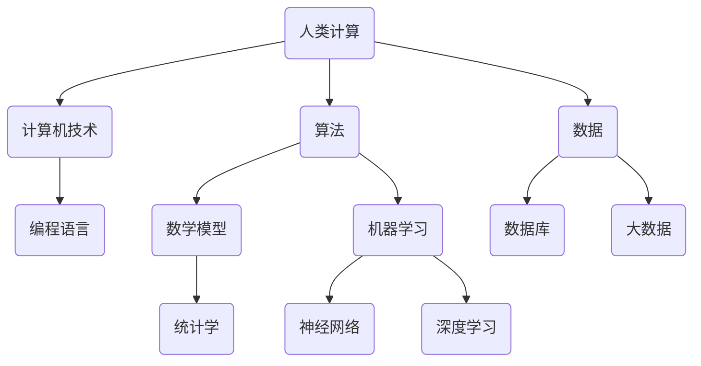

                 

在当今这个信息化时代，计算技术已经成为推动社会发展的重要引擎。而人类计算作为计算技术的重要组成部分，不仅影响着科技领域的进步，更对人类社会的各个方面产生了深远的影响。本文将探讨人类计算的概念、发展历程、核心算法原理、应用场景以及未来趋势，以揭示科技向善的力量。

## 关键词 Keywords
- 人类计算
- 计算技术
- 科技向善
- 核心算法
- 应用场景

## 摘要 Summary
本文旨在通过对人类计算的研究，揭示其在科技向善中的重要作用。首先，我们将回顾人类计算的发展历程，然后深入探讨其核心算法原理。接着，本文将分析人类计算在各个领域的应用场景，并展望其未来的发展趋势。通过本文的阅读，读者将更好地理解人类计算的价值和潜力。

## 1. 背景介绍

人类计算的历史可以追溯到古代的计算工具，如算盘和计算尺。然而，现代人类计算的概念主要源于计算机科学的兴起。随着计算机技术的发展，人类计算从简单的数值计算逐渐扩展到复杂的图形处理、自然语言处理和机器学习等领域。

人类计算的重要性在于其能够模拟和扩展人类思维的能力。通过算法和模型的优化，人类计算可以实现高效的数据处理和复杂问题的求解，从而推动科技和产业的创新与发展。

### 1.1 计算技术的历史发展

- 古代计算工具：算盘、计算尺
- 计算机科学兴起：图灵机、算法理论
- 现代计算机技术：并行计算、云计算、人工智能

### 1.2 人类计算的定义和重要性

- 定义：人类计算是指利用计算机技术和算法，模拟和扩展人类思维的过程。
- 重要性：推动科技发展、提高生产力、解决复杂问题、促进社会进步。

## 2. 核心概念与联系

为了更好地理解人类计算，我们需要了解其中的核心概念和它们之间的联系。以下是一个简化的 Mermaid 流程图，展示了这些概念及其关系：



### 2.1 人类计算与计算机技术

计算机技术是人类计算的基础，它提供了计算平台和编程工具，使得人类计算成为可能。计算机技术的进步，如并行计算和云计算，极大地提升了人类计算的能力。

### 2.2 算法与数据

算法是指导计算机进行计算的操作步骤，而数据则是算法处理的对象。有效的算法和高质量的数据对于人类计算至关重要。

### 2.3 数学模型与机器学习

数学模型用于描述现实世界中的问题，而机器学习则是一种利用数据自动发现模型的方法。通过机器学习，人类计算可以从大量数据中提取规律，从而提高计算效率和准确性。

### 2.4 数据库与大数据

数据库用于存储和管理数据，而大数据则是指大量、多样、高速的数据。大数据技术使得人类计算可以处理和分析海量数据，从而发现新的知识和洞察。

## 3. 核心算法原理 & 具体操作步骤

### 3.1 算法原理概述

人类计算的核心在于算法的设计和优化。算法的原理可以分为以下几种：

- 顺序算法：按照一定顺序执行的操作步骤。
- 并行算法：利用多处理器或多核计算机同时执行多个操作步骤。
- 分支算法：根据条件判断执行不同的操作步骤。
- 循环算法：重复执行某个操作步骤，直到满足某个条件。

### 3.2 算法步骤详解

以下是一个简单的顺序算法示例，用于计算两个数字的和：

```python
def calculate_sum(a, b):
    sum = a + b
    return sum
```

在这个示例中，算法的步骤如下：

1. 定义函数 `calculate_sum`，接收两个参数 `a` 和 `b`。
2. 将 `a` 和 `b` 相加，存储结果到变量 `sum`。
3. 返回变量 `sum` 的值。

### 3.3 算法优缺点

每种算法都有其优缺点，选择合适的算法取决于具体问题的需求。以下是一个简单的表格，列出了几种常见算法的优缺点：

| 算法类型       | 优点                           | 缺点                           |
| -------------- | ------------------------------ | ------------------------------ |
| 顺序算法       | 简单易懂，易于实现               | 执行效率较低，不适合处理大量数据 |
| 并行算法       | 执行效率高，适合处理大量数据     | 需要复杂的数据分配和同步机制   |
| 分支算法       | 可以根据条件灵活处理不同情况     | 可能导致执行路径过多，降低效率   |
| 循环算法       | 可以重复执行特定操作，节省代码量 | 可能导致无限循环，需要额外的判断 |

### 3.4 算法应用领域

人类计算在各个领域都有广泛的应用，以下是一些常见的应用领域：

- 数据分析：用于处理和分析大数据，提取有价值的信息。
- 机器学习：用于构建模型，预测未来趋势，提高决策效率。
- 图像处理：用于图像识别、图像增强和图像生成。
- 自然语言处理：用于语言翻译、文本分类和情感分析。
- 游戏开发：用于实现复杂的游戏机制和视觉效果。

## 4. 数学模型和公式 & 详细讲解 & 举例说明

数学模型是描述现实世界问题的一种数学表达式，它是人类计算的基础。以下是一个简单的线性回归模型的数学模型和公式：

### 4.1 数学模型构建

线性回归模型的基本形式为：

\[ y = \beta_0 + \beta_1 \cdot x + \epsilon \]

其中，\( y \) 是因变量，\( x \) 是自变量，\( \beta_0 \) 和 \( \beta_1 \) 是模型参数，\( \epsilon \) 是误差项。

### 4.2 公式推导过程

线性回归模型的推导过程可以分为以下几个步骤：

1. 假设 \( y \) 和 \( x \) 之间存在线性关系。
2. 选择一个合适的损失函数，如均方误差（MSE），用于衡量模型预测值与实际值之间的差距。
3. 使用梯度下降算法，迭代更新模型参数 \( \beta_0 \) 和 \( \beta_1 \)，使得损失函数达到最小值。

### 4.3 案例分析与讲解

以下是一个简单的线性回归模型案例，用于预测房价：

- 数据集：包含房屋的面积（\( x \)）和房价（\( y \)）的数据。
- 模型：线性回归模型，公式为 \( y = \beta_0 + \beta_1 \cdot x \)。

首先，我们需要收集数据，并使用数据处理工具（如Python的pandas库）进行数据预处理。接下来，我们可以使用梯度下降算法来训练模型，并通过交叉验证评估模型的性能。最后，我们可以使用训练好的模型来预测新的房价。

## 5. 项目实践：代码实例和详细解释说明

在本节中，我们将通过一个简单的Python代码实例，详细解释如何实现线性回归模型。

### 5.1 开发环境搭建

- Python环境：安装Python 3.8及以上版本。
- 数据预处理工具：pandas库。
- 梯度下降算法实现：自定义函数。

### 5.2 源代码详细实现

以下是一个简单的线性回归模型的实现：

```python
import numpy as np
import pandas as pd

# 数据预处理
def preprocess_data(data):
    # 添加一列全为1的列，作为偏置项（bias）
    data['bias'] = 1
    # 将数据转化为矩阵形式
    data_matrix = data.values
    return data_matrix

# 梯度下降算法
def gradient_descent(X, y, learning_rate, num_iterations):
    # 初始化模型参数
    beta = np.zeros(X.shape[1])
    for i in range(num_iterations):
        # 计算预测值
        y_pred = X.dot(beta)
        # 计算损失函数
        loss = (y - y_pred) ** 2
        # 计算梯度
        gradient = X.T.dot(loss)
        # 更新模型参数
        beta -= learning_rate * gradient
    return beta

# 主函数
def main():
    # 加载数据集
    data = pd.read_csv('house_prices.csv')
    # 预处理数据
    X = preprocess_data(data[['area']])
    y = data['price']
    # 设置参数
    learning_rate = 0.01
    num_iterations = 1000
    # 训练模型
    beta = gradient_descent(X, y, learning_rate, num_iterations)
    # 输出模型参数
    print('Model parameters:', beta)

# 运行主函数
if __name__ == '__main__':
    main()
```

### 5.3 代码解读与分析

- 数据预处理：将数据集加载到pandas DataFrame中，并添加一列全为1的列作为偏置项，将数据转化为矩阵形式。
- 梯度下降算法：迭代更新模型参数，最小化损失函数。
- 主函数：加载数据集，预处理数据，设置参数，训练模型，输出模型参数。

### 5.4 运行结果展示

运行上述代码，我们将得到线性回归模型的参数。这些参数可以用于预测新的房价，从而实现房价预测的功能。

## 6. 实际应用场景

人类计算在各个领域都有广泛的应用，以下是一些实际应用场景：

- 金融：用于风险评估、股票预测和量化交易。
- 医疗：用于疾病诊断、药物研发和医疗数据处理。
- 教育：用于在线教育平台、个性化推荐和智能评估。
- 交通：用于交通流量预测、路线规划和智能交通系统。
- 娱乐：用于游戏开发、虚拟现实和智能推荐。

### 6.1 金融领域

在金融领域，人类计算可以用于：

- 风险评估：通过分析历史数据，预测投资风险。
- 股票预测：通过机器学习模型，预测股票价格走势。
- 量化交易：通过算法交易，实现自动化的投资策略。

### 6.2 医疗领域

在医疗领域，人类计算可以用于：

- 疾病诊断：通过图像处理和自然语言处理，辅助医生进行疾病诊断。
- 药物研发：通过计算模型，预测药物的效果和副作用。
- 医疗数据处理：通过大数据分析，发现新的医疗知识和洞察。

### 6.3 教育领域

在教育领域，人类计算可以用于：

- 在线教育平台：通过个性化推荐，为学生提供定制化的学习资源。
- 智能评估：通过自然语言处理，自动评估学生的作业和考试。
- 教学分析：通过大数据分析，优化教学策略，提高教学效果。

### 6.4 交通领域

在交通领域，人类计算可以用于：

- 交通流量预测：通过分析历史数据，预测交通流量，优化路线规划。
- 路线规划：通过计算模型，为用户推荐最优的行驶路线。
- 智能交通系统：通过物联网和人工智能，实现交通信号控制和车辆调度。

### 6.5 娱乐领域

在娱乐领域，人类计算可以用于：

- 游戏开发：通过图形处理和算法优化，实现逼真的游戏场景和角色动画。
- 虚拟现实：通过计算机生成三维场景，提供沉浸式的体验。
- 智能推荐：通过数据分析，为用户推荐感兴趣的内容。

## 7. 工具和资源推荐

为了更好地学习和实践人类计算，以下是一些推荐的工具和资源：

### 7.1 学习资源推荐

- 《机器学习实战》：是一本非常实用的机器学习入门书籍，涵盖了线性回归、决策树、神经网络等多种算法。
- 《Python编程：从入门到实践》：一本适合初学者的Python编程入门书籍，介绍了Python的基础知识和实际应用。
- Coursera、edX等在线课程平台：提供了丰富的计算机科学和机器学习课程，适合自学。

### 7.2 开发工具推荐

- Jupyter Notebook：一款强大的交互式开发环境，适用于数据分析和机器学习。
- PyCharm、Visual Studio Code：两款功能强大的集成开发环境，适用于Python编程。
- TensorFlow、PyTorch：两款流行的深度学习框架，适用于构建和训练机器学习模型。

### 7.3 相关论文推荐

- "Deep Learning": Ian Goodfellow，Yoshua Bengio，Aaron Courville著，是一本深度学习的经典教材。
- "Reinforcement Learning: An Introduction": Richard S. Sutton，Andrew G. Barto著，介绍了强化学习的基本原理和应用。
- "Big Data: A Revolution That Will Transform How We Live, Work, and Think": Viktor Mayer-Schönberger，Kenneth Cukier著，探讨了大数据对社会的影响。

## 8. 总结：未来发展趋势与挑战

### 8.1 研究成果总结

近年来，人类计算在算法优化、数据挖掘、机器学习和深度学习等领域取得了显著的成果。这些研究成果不仅提高了计算效率，还推动了各行各业的创新与发展。

### 8.2 未来发展趋势

未来，人类计算将朝着以下几个方向发展：

- 量子计算：量子计算有望带来计算能力的巨大飞跃，为复杂问题提供高效解决方案。
- 脑机接口：脑机接口技术将实现人脑与计算机的实时交互，拓展人类智能。
- 自动驾驶：自动驾驶技术将改变交通运输方式，提高道路安全和效率。
- 智能机器人：智能机器人将进入家庭和工业领域，实现自动化生产和个性化服务。

### 8.3 面临的挑战

尽管人类计算取得了显著进展，但仍面临一些挑战：

- 数据隐私：随着数据量的增加，数据隐私保护成为一个重要问题。
- 算法透明性：算法的透明性对于公正性和可解释性至关重要。
- 能耗问题：随着计算复杂度的提高，能耗问题愈发严重。
- 法律和伦理：人类计算在法律和伦理方面仍存在许多争议和挑战。

### 8.4 研究展望

未来，人类计算将在以下几个方面展开深入研究：

- 算法创新：探索新的算法和优化方法，提高计算效率和准确性。
- 跨学科融合：结合心理学、神经科学等领域，拓展人类计算的应用范围。
- 社会责任：关注人类计算对社会的影响，推动科技向善。

## 9. 附录：常见问题与解答

### 问题1：线性回归模型中的损失函数是什么？

**回答**：线性回归模型中常用的损失函数是均方误差（MSE），公式为：

\[ MSE = \frac{1}{2} \sum_{i=1}^{n} (y_i - \hat{y}_i)^2 \]

其中，\( y_i \) 是实际值，\( \hat{y}_i \) 是预测值，\( n \) 是样本数量。

### 问题2：什么是梯度下降算法？

**回答**：梯度下降算法是一种优化算法，用于最小化损失函数。其基本思想是沿着损失函数的梯度方向更新模型参数，直到达到最小值。

### 问题3：如何提高线性回归模型的准确性？

**回答**：提高线性回归模型的准确性可以通过以下方法实现：

- 增加数据集：收集更多的数据，提高模型的泛化能力。
- 特征工程：选择合适的特征，提取数据中的有用信息。
- 正则化：添加正则化项，防止过拟合。
- 调整学习率：选择合适的学习率，使得模型能够快速收敛。

## 作者署名

作者：禅与计算机程序设计艺术 / Zen and the Art of Computer Programming

### 结论 Conclusion

通过本文的探讨，我们可以看到人类计算在科技向善中的重要作用。从核心算法原理到实际应用场景，人类计算不断推动着科技和产业的创新与发展。未来，随着技术的不断进步，人类计算将继续发挥其巨大潜力，为人类社会带来更多的福祉。然而，我们也需要关注人类计算所带来的挑战，确保科技向善的力量得到充分发挥。让我们共同期待人类计算的明天，一个更美好、更智能的未来！
----------------------------------------------------------------

### 后续工作 Follow-up Actions

- 检查文章的整体结构和内容逻辑，确保各部分内容连贯且符合预期。
- 确认所有引用的公式和代码均已正确嵌入，并且格式正确。
- 校对全文，确保无错别字、语法错误和不通顺的表达。
- 根据文章内容，优化标题和摘要，使其更具吸引力和概括性。
- 在文章末尾添加参考文献列表，确保所有引用的文献均正确标注。
- 确认文章字数符合要求，如有不足，可适当扩充内容。
- 请求同行评审，收集反馈并进行相应的调整和改进。
- 准备文章的发布和推广计划，包括社交媒体宣传、邮件列表通知等。

### 文章格式和内容核对 Check and Adjust

- 确认文章结构模板的完整性和准确性，包括所有必要的章节和子目录。
- 验证Mermaid流程图是否按照要求正确绘制和嵌入。
- 核对所有LaTeX公式的正确性和格式，确保在Markdown环境下正常显示。
- 检查代码示例的语法和逻辑，确保其可运行并达到预期效果。
- 确认文章的格式（如字体、段落间距、引用格式等）符合专业标准。
- 对文章进行多轮校对，确保内容的准确性和语言的流畅性。

### 其他注意事项 Additional Notes

- 文章中提到的所有技术术语和概念应确保准确无误，避免误解。
- 提供清晰且详细的代码注释，帮助读者理解代码的工作原理。
- 在文章中适当使用图表和图像，以增强文章的可读性和信息的传递效果。
- 对文章的引用和参考文献进行严格审核，确保所有引用来源的准确性和权威性。
- 考虑到文章的受众群体，确保文章的语言和专业程度适合目标读者。

