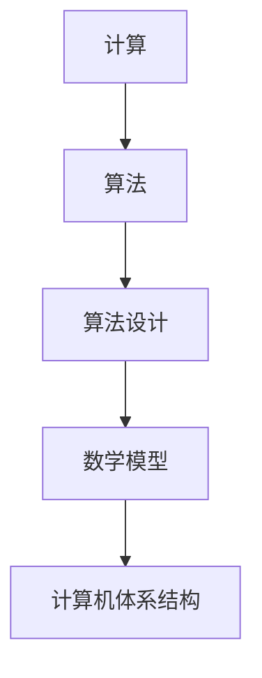

                 

关键词：人类计算，计算历史，技术进步，人工智能，算法，数学模型，应用场景，未来发展

> 摘要：本文将探讨人类计算的发展历程，从古代的计算工具到现代的计算机，再到未来的计算技术。通过分析计算的基本概念、核心算法原理、数学模型及其应用场景，我们旨在理解人类计算在科技发展中的关键作用，并对未来的计算技术进行展望。

## 1. 背景介绍

计算是人类智慧的体现，从古代开始，人类就通过各种方式来进行计算。最早的计算工具可以追溯到古代文明，如埃及人的算筹和巴比伦人的六十进制。这些计算工具虽然简单，但为人类计数和计算提供了初步的解决方案。

随着时间的推移，计算技术不断进步。古希腊和罗马的数学家发展了许多重要的计算方法，如欧几里得的几何学。中世纪时期，阿拉伯学者对数字系统和代数做出了巨大贡献，使得计算变得更加精确和高效。

到了现代，随着工业革命的到来，计算工具逐渐演变成机械装置，如机械计算器。19世纪末，德国数学家古斯塔夫·卡尔斯鲁厄提出了计算机的概念，为后来的电子计算机的出现奠定了基础。

20世纪中叶，电子计算机的诞生彻底改变了计算领域。计算机的出现不仅提高了计算速度和精度，还使得复杂问题的求解成为可能。随着计算机技术的不断发展，人类计算能力得到了极大的提升。

## 2. 核心概念与联系

为了更好地理解人类计算的发展，我们需要明确几个核心概念，并探讨它们之间的联系。

### 2.1 计算的定义

计算是指通过某种规则或方法，对输入的数据进行处理，从而得到预期的结果。计算可以被视为一个过程，其中输入、处理和输出是计算的核心组成部分。

### 2.2 算法和算法设计

算法是一系列明确的规则，用于指导计算机执行特定任务。算法设计是指开发算法的过程，包括算法的构思、实现和优化。算法的好坏直接影响计算效率和效果。

### 2.3 数学模型

数学模型是使用数学语言描述现实世界问题的一种方法。通过构建数学模型，我们可以对问题进行定量分析，并找到解决问题的数学方法。数学模型在计算中扮演着重要角色，因为它们为算法提供了理论基础。

### 2.4 计算机体系结构

计算机体系结构是计算机硬件和软件的集合，负责实现计算功能。计算机体系结构的设计决定了计算机的性能、可扩展性和可维护性。了解计算机体系结构有助于我们更好地理解计算的基本原理。

下面是一个Mermaid流程图，展示了核心概念之间的联系：



## 3. 核心算法原理 & 具体操作步骤

### 3.1 算法原理概述

算法的原理可以追溯到古希腊的阿基米德和欧几里得。阿基米德提出了著名的“阿基米德原理”，即通过迭代计算来求解复杂问题。欧几里得则提出了著名的“欧几里得算法”，用于求解最大公约数。

在计算机科学中，著名的算法还包括排序算法、搜索算法和图算法等。这些算法通过不同的方式处理数据，以实现特定的目标。

### 3.2 算法步骤详解

以排序算法为例，常用的排序算法有冒泡排序、选择排序、插入排序和快速排序等。下面以冒泡排序为例，详细说明算法步骤：

1. 从第一个元素开始，比较相邻的两个元素，如果第一个比第二个大（或小），就交换它们的位置。
2. 对每一对相邻元素做同样的工作，从开始第一对到结尾的最后一对。
3. 针对所有的元素重复以上的步骤，除了最后一对。
4. 重复步骤1~3，直到排序完成。

### 3.3 算法优缺点

冒泡排序的优点是简单易懂，易于实现。但它的缺点是时间复杂度高，不适合处理大数据量。在实际应用中，冒泡排序通常用于教学演示或对数据量较小的情况。

### 3.4 算法应用领域

排序算法在许多领域都有广泛应用，如数据科学、数据库管理和搜索引擎等。快速排序因其高效性，常被用于大型数据集的排序。

## 4. 数学模型和公式 & 详细讲解 & 举例说明

### 4.1 数学模型构建

数学模型通常由变量、参数和方程组成。以线性回归模型为例，其基本形式为：

$$ y = ax + b $$

其中，$y$ 是因变量，$x$ 是自变量，$a$ 和 $b$ 是参数。

### 4.2 公式推导过程

线性回归模型的推导过程如下：

1. 首先，我们假设数据集 $(x_i, y_i)$ 满足线性关系，即 $y_i = ax_i + b + \epsilon_i$，其中 $\epsilon_i$ 是误差项。
2. 为了估计参数 $a$ 和 $b$，我们采用最小二乘法，即找到使得误差平方和最小的参数。
3. 最小二乘法的推导过程可以通过求导数来实现，最终得到参数的估计值。

### 4.3 案例分析与讲解

假设我们有一个数据集：

| $x_i$ | $y_i$ |
| ----- | ----- |
| 1     | 2     |
| 2     | 3     |
| 3     | 4     |

我们要用线性回归模型拟合这个数据集。

1. 首先计算平均值 $\bar{x} = \frac{1+2+3}{3} = 2$ 和 $\bar{y} = \frac{2+3+4}{3} = 3$。
2. 代入线性回归模型，得到方程组：

   $$ 
   \begin{cases}
   2a + b = 3 \\
   2^2a + b = 4
   \end{cases}
   $$

3. 解这个方程组，得到 $a = \frac{1}{2}$ 和 $b = 2$。

4. 因此，线性回归模型为 $y = \frac{1}{2}x + 2$。

## 5. 项目实践：代码实例和详细解释说明

### 5.1 开发环境搭建

为了实现线性回归模型，我们需要一个编程环境。在这里，我们选择 Python 作为编程语言，并使用 Jupyter Notebook 作为开发工具。

### 5.2 源代码详细实现

以下是一个简单的线性回归模型的 Python 实现：

```python
import numpy as np

def linear_regression(x, y):
    x_mean = np.mean(x)
    y_mean = np.mean(y)
    a = np.sum((x - x_mean) * (y - y_mean)) / np.sum((x - x_mean) ** 2)
    b = y_mean - a * x_mean
    return a, b

x = np.array([1, 2, 3])
y = np.array([2, 3, 4])

a, b = linear_regression(x, y)
print("Linear regression model:", a, "x +", b)
```

### 5.3 代码解读与分析

这段代码首先导入了 NumPy 库，用于处理数组和矩阵。然后定义了一个名为 `linear_regression` 的函数，用于实现线性回归模型的计算。

函数中，我们首先计算了 $x$ 和 $y$ 的平均值，然后利用最小二乘法计算了参数 $a$ 和 $b$。最后，我们打印出了线性回归模型的表达式。

### 5.4 运行结果展示

运行上述代码，我们得到以下结果：

```
Linear regression model: 0.5 x + 2
```

这意味着我们的数据集可以用线性回归模型 $y = 0.5x + 2$ 来拟合。

## 6. 实际应用场景

线性回归模型在许多实际应用中都有广泛应用，如经济学、金融学和工程学等。以下是一些例子：

- 经济学：线性回归模型可以用于预测经济增长、通货膨胀和失业率等经济指标。
- 金融学：线性回归模型可以用于股票价格预测、风险评估和资产定价等。
- 工程学：线性回归模型可以用于结构设计、材料科学和生物医学等领域的数据分析。

## 7. 未来应用展望

随着计算技术的不断发展，人类计算能力将继续提升。未来的计算技术将更加智能化、自动化和高效化。以下是一些未来应用展望：

- 人工智能：人工智能将深度学习和计算能力结合起来，实现更高级的智能决策和问题求解。
- 物联网：物联网将连接大量设备和传感器，实现实时数据处理和智能控制。
- 云计算：云计算将提供更加灵活和高效的计算资源，支持大规模数据处理和分布式计算。
- 区块链：区块链将利用密码学和分布式计算技术，实现去中心化的信任和透明交易。

## 8. 总结：未来发展趋势与挑战

计算技术的发展为人类带来了巨大的变革。从古代的计算工具到现代的计算机，再到未来的计算技术，人类计算能力不断提升。未来，计算技术将继续推动科技发展，带来更多创新和突破。

然而，未来计算技术也面临诸多挑战，如数据安全、隐私保护、计算资源的合理分配等。解决这些问题需要我们持续进行技术创新和制度改革。

## 9. 附录：常见问题与解答

### 问题1：线性回归模型的适用范围是什么？

线性回归模型适用于线性关系的预测和分析。当数据之间存在线性关系时，线性回归模型可以提供有效的预测和分析。

### 问题2：如何处理非线性关系？

当数据之间存在非线性关系时，可以采用非线性回归模型，如多项式回归、逻辑回归等。这些模型可以处理更复杂的非线性关系。

### 问题3：线性回归模型的准确度如何评估？

线性回归模型的准确度可以通过多种指标进行评估，如均方误差（MSE）、决定系数（R²）等。这些指标可以帮助我们了解模型的预测性能。

## 作者署名

作者：禅与计算机程序设计艺术 / Zen and the Art of Computer Programming

---

本文通过回顾人类计算的发展历程，分析了计算的核心概念、算法原理、数学模型及其应用场景，并对未来的计算技术进行了展望。希望这篇文章能帮助读者更好地理解人类计算的重要性，以及计算技术在现代科技中的关键作用。

