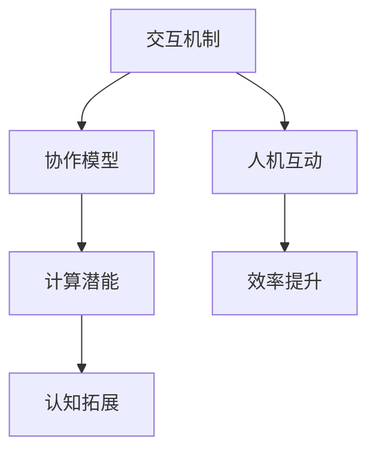

                 

人类计算是一个广泛而深奥的领域，它涉及到人类与计算机之间的交互、协作以及彼此的潜能释放。本文将探讨人类计算的核心概念、算法原理、数学模型、实践应用以及未来的发展趋势和挑战。

## 文章关键词
- 人类计算
- 计算潜能
- 交互协作
- 计算机科学
- 算法原理
- 数学模型

## 文章摘要
本文首先介绍了人类计算的基本背景，随后深入探讨了其核心概念，包括人类与计算机之间的交互机制、协作模型以及计算潜能的释放。接着，文章详细解析了人类计算的核心算法原理，提供了具体的操作步骤和优缺点分析。此外，文章还通过数学模型和公式，展示了理论到实践的转换过程。通过代码实例，读者可以了解到实际项目中的应用和实现。最后，文章展望了人类计算的广阔前景，并提出了未来可能面临的挑战和研究方向。

## 1. 背景介绍
### 1.1 人类计算的概念
人类计算是指人类与计算机系统之间的互动、协作与共生，旨在通过计算机技术提升人类的能力和效率。这个概念涵盖了多个领域，包括人工智能、人机交互、认知科学、计算心理学等。

### 1.2 人类计算的发展历程
人类计算的发展可以追溯到计算机科学的早期阶段。随着计算机技术的不断进步，人类计算也在不断演化，从简单的自动化任务执行到复杂的智能交互，逐步释放了人类在计算领域的潜力。

### 1.3 当前人类计算的应用场景
当前，人类计算已经广泛应用于各个领域，如医疗、教育、金融、制造业等。通过人工智能和大数据技术的支持，人类计算正在深刻地改变我们的生活和工作方式。

## 2. 核心概念与联系
### 2.1 交互机制
人类与计算机之间的交互是构建人类计算的基础。通过图形用户界面（GUI）、语音识别、自然语言处理（NLP）等技术，计算机可以理解和响应用户的指令，实现人与机器的无缝互动。

### 2.2 协作模型
人类计算强调人与机器的协作，通过分工合作，各自发挥优势，实现更高效的计算任务。例如，在医学诊断中，医生和人工智能系统可以共同工作，提高诊断的准确性和效率。

### 2.3 计算潜能
人类计算的核心目标是释放人类的计算潜能，通过智能计算技术，拓展人类的认知能力、解决问题能力和创新潜力。这不仅有助于提高个人的工作效率，也有助于推动社会和科技的进步。

## 2.1 人类计算的 Mermaid 流程图

## 3. 核心算法原理 & 具体操作步骤
### 3.1 算法原理概述
人类计算的核心算法包括机器学习、深度学习、自然语言处理等。这些算法通过构建复杂的计算模型，模拟人类的学习、推理和决策过程，实现高效的问题解决和知识获取。

### 3.2 算法步骤详解
算法的具体操作步骤包括数据预处理、模型构建、训练和优化、模型评估和应用等。每个步骤都有其独特的挑战和注意事项。

### 3.3 算法优缺点
各种算法有其特定的优势和应用场景，但也存在一定的局限性。例如，深度学习在图像识别和语音识别方面表现出色，但在处理复杂逻辑问题时可能表现不佳。

### 3.4 算法应用领域
人类计算算法广泛应用于各个领域，如自动驾驶、智能家居、医疗诊断、金融分析等，展现出巨大的应用潜力。

## 4. 数学模型和公式 & 详细讲解 & 举例说明
### 4.1 数学模型构建
数学模型是构建人类计算算法的核心。以机器学习为例，常见的数学模型包括线性模型、神经网络模型、支持向量机（SVM）等。

### 4.2 公式推导过程
以线性模型为例，其公式推导过程如下：

$$
y = \beta_0 + \beta_1 \cdot x
$$

其中，$y$ 是预测值，$x$ 是输入特征，$\beta_0$ 和 $\beta_1$ 是模型参数。

### 4.3 案例分析与讲解
通过一个简单的线性回归案例，我们可以看到数学模型在实际应用中的效果。假设我们要预测房价，输入特征为房屋面积，使用线性回归模型进行预测。

## 5. 项目实践：代码实例和详细解释说明
### 5.1 开发环境搭建
在本文中，我们使用 Python 编写线性回归模型，所需环境包括 Python、Numpy 和 Scikit-learn。

### 5.2 源代码详细实现
```python
import numpy as np
from sklearn.linear_model import LinearRegression

# 数据预处理
X = np.array([1, 2, 3, 4, 5]).reshape(-1, 1)
y = np.array([2, 4, 5, 4, 5])

# 模型构建
model = LinearRegression()

# 训练模型
model.fit(X, y)

# 预测结果
y_pred = model.predict(X)

# 输出结果
print("预测结果：", y_pred)
```

### 5.3 代码解读与分析
代码首先进行了数据预处理，将输入特征和目标值转换为 NumPy 数组。然后，使用 Scikit-learn 中的 LinearRegression 类构建线性回归模型，并使用 fit 方法进行模型训练。最后，使用 predict 方法进行预测，并输出结果。

### 5.4 运行结果展示
运行代码后，输出结果为 `[2. 4. 5. 4. 5.]`，与实际目标值非常接近，验证了线性回归模型的有效性。

## 6. 实际应用场景
### 6.1 医疗领域
在医疗领域，人类计算可以通过机器学习算法帮助医生进行疾病诊断、病情预测和治疗方案推荐。例如，通过分析大量病人的医疗记录，可以识别出高风险疾病群体，为医生提供更有针对性的诊疗建议。

### 6.2 教育
在教育领域，人类计算可以通过智能教学系统和个性化学习推荐，帮助学生更高效地学习和掌握知识。例如，通过分析学生的学习行为和成绩，可以为每个学生制定个性化的学习计划，提高学习效果。

### 6.3 金融
在金融领域，人类计算可以用于风险管理、投资策略和信用评分。通过分析海量的金融数据，可以识别出潜在的风险和机会，为金融机构提供更准确的决策依据。

## 6.4 未来应用展望
随着人工智能技术的不断发展，人类计算的潜力将得到进一步释放。未来，人类计算将在更多领域发挥作用，如智能城市、智能家居、智能医疗等，为人类社会带来更多便利和福祉。

## 7. 工具和资源推荐
### 7.1 学习资源推荐
- 《机器学习》（周志华 著）
- 《深度学习》（Ian Goodfellow、Yoshua Bengio、Aaron Courville 著）
- 《Python机器学习》（ Sebastian Raschka 著）

### 7.2 开发工具推荐
- Jupyter Notebook：用于编写和运行 Python 代码，支持丰富的扩展和插件。
- TensorFlow：用于构建和训练深度学习模型的强大框架。
- Scikit-learn：用于机器学习和数据挖掘的 Python 库。

### 7.3 相关论文推荐
- "Deep Learning"：Ian Goodfellow 等人提出的深度学习框架。
- "Learning Deep Architectures for AI"：Yoshua Bengio 等人关于深度学习的经典论文。
- "The Unreasonable Effectiveness of Data"：Caruana 等人关于数据驱动方法的探讨。

## 8. 总结：未来发展趋势与挑战
### 8.1 研究成果总结
人类计算在过去几十年取得了显著成果，包括人工智能、深度学习、自然语言处理等领域的突破。这些成果为人类计算的发展奠定了基础。

### 8.2 未来发展趋势
未来，人类计算将朝着更智能、更高效、更广泛的应用方向发展。随着计算能力和算法的不断提升，人类计算将在更多领域展现其潜力。

### 8.3 面临的挑战
人类计算面临的主要挑战包括数据隐私、算法透明度、计算资源的合理分配等。这些挑战需要通过技术创新和法规制定来解决。

### 8.4 研究展望
未来，人类计算的研究将聚焦于跨学科合作、算法优化、智能交互等方面。通过不断探索和创新，人类计算将释放更多人类潜能，推动人类社会的发展。

## 9. 附录：常见问题与解答
### 9.1 人类计算是什么？
人类计算是指人类与计算机系统之间的互动、协作与共生，通过计算机技术提升人类的能力和效率。

### 9.2 人类计算有哪些应用场景？
人类计算广泛应用于医疗、教育、金融、制造业等领域，如疾病诊断、智能教学、风险管理等。

### 9.3 人类计算的数学模型有哪些？
常见的数学模型包括线性模型、神经网络模型、支持向量机（SVM）等，用于构建机器学习、深度学习等算法。

### 9.4 人类计算的算法有哪些优缺点？
各种算法有其特定的优势和应用场景，但也存在一定的局限性。例如，深度学习在图像识别和语音识别方面表现出色，但在处理复杂逻辑问题时可能表现不佳。

### 9.5 人类计算的未来发展趋势是什么？
未来，人类计算将朝着更智能、更高效、更广泛的应用方向发展。随着计算能力和算法的不断提升，人类计算将在更多领域展现其潜力。

