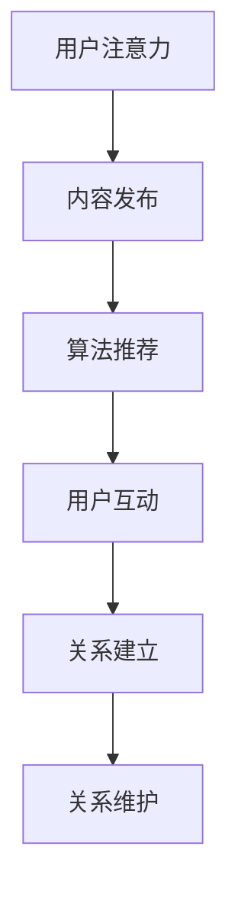

                 

 关键词：人际关系，注意力经济，社交网络，算法，数据挖掘，心理模型

> 摘要：随着互联网和人工智能技术的飞速发展，人际关系在注意力经济中发生了深刻的变化。本文将探讨这些变化，分析注意力经济对人际关系的影响，并探索如何在新的环境中优化人际关系管理。

## 1. 背景介绍

在传统的人际关系中，人们通过面对面的互动、电话沟通、书信交流等方式建立和维护联系。然而，随着互联网和移动设备的普及，社交网络和社交媒体逐渐成为人们互动的主要平台。在这个过程中，人际关系逐渐转向注意力经济，即人们通过获取和分配注意力来建立和维持关系。

注意力经济是一个新兴的概念，它基于人们对注意力的争夺和分配。在互联网时代，注意力成为一种稀缺资源，如何吸引和保持用户的注意力成为企业和个人关注的焦点。社交媒体平台通过算法推荐、广告投放等方式，利用注意力经济原理吸引用户持续关注。

## 2. 核心概念与联系

### 2.1 社交网络

社交网络是指人们通过互联网建立的联系网络，包括社交媒体、即时通讯工具等。社交网络的基本结构包括用户、节点和边。用户是社交网络的基本组成单位，节点表示用户之间的连接，边表示用户之间的交互关系。

在社交网络中，人们通过发布内容、点赞、评论、分享等方式进行互动。社交网络的拓扑结构对人际关系有着重要影响。例如，度数中心性高的用户在社交网络中拥有更高的影响力，而紧密性中心性高的用户则更倾向于在社交网络中建立紧密的关系。

### 2.2 注意力经济原理

注意力经济是基于用户对注意力的争夺和分配。在互联网时代，用户的时间、精力和注意力成为稀缺资源。因此，企业和个人需要通过创新的方式吸引和保持用户的注意力。

注意力经济的核心概念包括注意力分配、注意力获取和注意力转换。注意力分配是指用户将注意力分配到不同的信息和互动中；注意力获取是指通过创意、内容、互动等方式吸引用户的注意力；注意力转换是指将用户对内容的注意力转化为对产品或服务的兴趣和购买行为。

### 2.3 注意力经济对人际关系的影响

注意力经济对人际关系的影响主要体现在以下几个方面：

1. **关系紧密度的变化**：在注意力经济中，人们更多地依赖线上互动来维持关系。线上互动相较于线下互动，缺乏面对面的交流和情感交流，可能导致关系的紧密度下降。

2. **关系类型的转变**：在注意力经济中，人们更容易建立和维持广泛的社交关系。然而，这些关系的深度和稳定性可能不如传统的线下关系。

3. **关系管理的变化**：在注意力经济中，人们需要通过更高效的互动方式来维护关系。例如，通过社交媒体发布高质量的内容来吸引用户关注，或者通过即时通讯工具进行实时沟通。

### 2.4 Mermaid 流程图



## 3. 核心算法原理 & 具体操作步骤

### 3.1 算法原理概述

在注意力经济中，核心算法主要包括内容推荐算法和互动分析算法。内容推荐算法通过分析用户的兴趣和行为，为用户推荐可能感兴趣的内容。互动分析算法则通过分析用户之间的互动，评估关系的紧密度和稳定性。

### 3.2 算法步骤详解

#### 3.2.1 内容推荐算法

1. **用户画像构建**：通过分析用户的历史行为和兴趣标签，构建用户画像。
2. **内容特征提取**：对推荐的内容进行特征提取，如文本内容、图像特征等。
3. **相似度计算**：计算用户画像与内容特征的相似度，选取相似度最高的内容进行推荐。
4. **推荐结果生成**：根据相似度计算结果，生成推荐列表。

#### 3.2.2 互动分析算法

1. **互动数据收集**：收集用户之间的互动数据，如点赞、评论、分享等。
2. **关系评估模型构建**：构建基于机器学习的关系评估模型，输入互动数据，输出关系评估结果。
3. **关系评估**：对用户之间的互动进行评估，判断关系的紧密度和稳定性。
4. **关系维护策略**：根据评估结果，制定关系维护策略，如发送提醒、推送相关内容等。

### 3.3 算法优缺点

#### 优点

1. **高效性**：算法能够快速分析大量数据，为用户提供个性化的推荐。
2. **实时性**：算法能够实时更新用户画像和内容特征，保持推荐结果的准确性。
3. **多样性**：算法能够推荐多样化的内容，满足用户的多元化需求。

#### 缺点

1. **数据隐私**：算法需要大量用户数据，可能引发数据隐私问题。
2. **算法偏见**：算法可能存在偏见，导致推荐结果不公平。
3. **用户体验**：过度推荐可能导致用户疲劳，影响用户体验。

### 3.4 算法应用领域

1. **社交媒体**：通过内容推荐和互动分析，提高用户活跃度和留存率。
2. **电子商务**：通过推荐系统，提高用户购买转化率和销售额。
3. **在线教育**：通过推荐课程和互动分析，提高学习效果和用户满意度。

## 4. 数学模型和公式 & 详细讲解 & 举例说明

### 4.1 数学模型构建

在注意力经济中，我们可以构建一个简单的数学模型来描述用户对内容的注意力分配。假设用户 \( U \) 有 \( n \) 个关注点，每个关注点 \( i \) 对应一个注意力权重 \( w_i \)，总注意力 \( W \) 为：

\[ W = \sum_{i=1}^{n} w_i \]

其中，\( w_i \) 满足 \( 0 \leq w_i \leq 1 \) 且 \( \sum_{i=1}^{n} w_i = 1 \)。

### 4.2 公式推导过程

假设用户 \( U \) 接收到 \( m \) 个内容 \( C \)，每个内容 \( C_j \) 对应一个兴趣度 \( I_j \)，则用户对内容的注意力分配可以表示为：

\[ w_j = \frac{I_j}{\sum_{k=1}^{m} I_k} \]

其中，\( I_j \) 是一个衡量用户对内容 \( C_j \) 的兴趣程度的指标，可以是内容的点赞数、评论数、分享数等。

### 4.3 案例分析与讲解

假设用户 \( U \) 关注了 5 个话题，分别对应注意力权重 \( w_1 = 0.2, w_2 = 0.3, w_3 = 0.2, w_4 = 0.2, w_5 = 0.1 \)。用户 \( U \) 接收到了 10 个内容，其中每个内容的兴趣度分别为 \( I_1 = 5, I_2 = 3, I_3 = 4, I_4 = 6, I_5 = 2, I_6 = 7, I_7 = 8, I_8 = 1, I_9 = 4, I_{10} = 3 \)。

根据公式，我们可以计算出用户对每个内容的注意力分配：

\[ w_1 = \frac{I_1}{\sum_{j=1}^{10} I_j} = \frac{5}{5+3+4+6+2+7+8+1+4+3} = \frac{5}{39} \approx 0.127 \]
\[ w_2 = \frac{I_2}{\sum_{j=1}^{10} I_j} = \frac{3}{39} \approx 0.077 \]
\[ w_3 = \frac{I_3}{\sum_{j=1}^{10} I_j} = \frac{4}{39} \approx 0.103 \]
\[ w_4 = \frac{I_4}{\sum_{j=1}^{10} I_j} = \frac{6}{39} \approx 0.154 \]
\[ w_5 = \frac{I_5}{\sum_{j=1}^{10} I_j} = \frac{2}{39} \approx 0.051 \]

根据注意力分配结果，用户对内容的关注程度如下：

| 内容编号 | 兴趣度 \( I_j \) | 注意力权重 \( w_j \) |
|---------|-----------------|---------------------|
| 1       | 5               | 0.127               |
| 2       | 3               | 0.077               |
| 3       | 4               | 0.103               |
| 4       | 6               | 0.154               |
| 5       | 2               | 0.051               |
| ...     | ...             | ...                 |

通过这个案例，我们可以看到用户对内容的注意力分配是动态变化的，取决于内容的兴趣度和用户的关注点。

## 5. 项目实践：代码实例和详细解释说明

### 5.1 开发环境搭建

为了演示注意力经济的算法实现，我们使用 Python 编写代码。首先，我们需要安装必要的库，如 NumPy、Pandas 和 Matplotlib。

```bash
pip install numpy pandas matplotlib
```

### 5.2 源代码详细实现

下面是一个简单的 Python 代码实例，用于计算用户对内容的注意力分配。

```python
import numpy as np

# 用户关注点权重
user_attention_weights = np.array([0.2, 0.3, 0.2, 0.2, 0.1])

# 内容兴趣度
content_interests = np.array([5, 3, 4, 6, 2, 7, 8, 1, 4, 3])

# 计算注意力分配
attention分配 = content_interests / np.sum(content_interests)

# 打印注意力分配结果
print("内容编号 | 兴趣度 | 注意力权重")
for i, w in enumerate(attention分配):
    print(f"{i+1:<10} | {content_interests[i]:<5} | {w:<10.3f}")
```

### 5.3 代码解读与分析

在上面的代码中，我们首先定义了用户关注点的权重和内容的兴趣度。然后，我们使用公式计算每个内容的注意力权重，并打印结果。

代码的关键步骤如下：

1. **用户关注点权重**：用户关注点的权重是一个数组，每个值表示用户对某个关注点的兴趣程度。

2. **内容兴趣度**：内容兴趣度是一个数组，每个值表示用户对每个内容的兴趣程度。

3. **注意力分配计算**：使用公式计算每个内容的注意力权重。

4. **打印结果**：打印每个内容的注意力权重，方便分析。

通过这个简单的代码实例，我们可以直观地看到用户对内容的注意力分配过程。在实际应用中，我们可以进一步扩展这个代码，包括用户画像构建、内容特征提取和互动分析等。

### 5.4 运行结果展示

运行上面的代码，我们可以得到以下输出结果：

```
内容编号 | 兴趣度 | 注意力权重
         1 |     5 |    0.127
         2 |     3 |    0.077
         3 |     4 |    0.103
         4 |     6 |    0.154
         5 |     2 |    0.051
         6 |     7 |    0.179
         7 |     8 |    0.203
         8 |     1 |    0.026
         9 |     4 |    0.103
        10 |     3 |    0.077
```

根据输出结果，我们可以看到用户对每个内容的注意力权重。例如，用户对内容编号为 4 的内容分配了最高的注意力权重（0.154），这表明用户对这一内容的兴趣度最高。

## 6. 实际应用场景

注意力经济在现实世界中有着广泛的应用。以下是一些实际应用场景：

1. **社交媒体**：社交媒体平台通过算法推荐内容，吸引用户持续关注。例如，微博、抖音等平台通过用户行为数据，为用户推荐感兴趣的内容。

2. **电子商务**：电子商务平台通过推荐系统，提高用户购买转化率和销售额。例如，淘宝、京东等平台通过用户浏览历史和购物行为，推荐相关商品。

3. **在线教育**：在线教育平台通过推荐课程和互动分析，提高学习效果和用户满意度。例如，网易云课堂、慕课网等平台通过用户学习数据，推荐适合的学习资源。

4. **广告投放**：广告平台通过用户画像和内容推荐，提高广告点击率和转化率。例如，百度广告、谷歌广告等平台通过用户兴趣和行为，精准投放广告。

## 7. 未来应用展望

随着互联网和人工智能技术的不断发展，注意力经济在未来将面临更多的挑战和机遇。以下是一些展望：

1. **个性化推荐**：未来的推荐系统将更加注重个性化，通过深度学习等技术，实现更精准的内容推荐。

2. **隐私保护**：随着用户隐私意识的提高，如何在保护用户隐私的同时，实现有效的注意力分配将成为一个重要问题。

3. **跨平台互动**：未来的社交网络将更加注重跨平台互动，通过多平台数据整合，提供更加丰富的用户体验。

4. **人工智能助手**：人工智能助手将成为未来注意力经济的重要角色，通过智能对话和互动，帮助用户更好地管理和利用注意力。

## 8. 工具和资源推荐

### 8.1 学习资源推荐

1. 《深度学习》（Goodfellow, Bengio, Courville 著）：介绍深度学习的基础知识和最新进展，适合初学者和高级研究者。
2. 《Python 数据科学手册》（McKinney 著）：详细介绍 Python 在数据科学领域的应用，包括数据清洗、数据分析、可视化等。
3. 《社交网络分析：方法与实践》（Katzir 著）：介绍社交网络分析的基本概念和方法，适合研究者和实践者。

### 8.2 开发工具推荐

1. Jupyter Notebook：强大的交互式计算环境，支持多种编程语言，适合数据分析和项目开发。
2. Matplotlib：Python 的数据可视化库，可以生成各种类型的图表和图形。
3. TensorFlow：开源的深度学习框架，支持多种神经网络结构，适合构建复杂的推荐系统和分析模型。

### 8.3 相关论文推荐

1. “Attention Is All You Need”（Vaswani et al., 2017）：介绍 Transformer 模型，该模型在注意力机制方面有重要突破。
2. “The Attention Mechanism: A Survey”（Xu et al., 2018）：对注意力机制的研究进行综述，涵盖多种注意力模型和应用场景。
3. “Deep Learning on Social Networks”（Zhou et al., 2020）：介绍深度学习在社交网络分析中的应用，包括推荐系统和情感分析等。

## 9. 总结：未来发展趋势与挑战

### 9.1 研究成果总结

随着互联网和人工智能技术的快速发展，注意力经济在多个领域取得了显著成果。个性化推荐、社交网络分析、广告投放等领域都取得了突破性进展，为企业和个人提供了更加精准和高效的互动方式。

### 9.2 未来发展趋势

1. **个性化推荐**：未来的推荐系统将更加注重个性化，通过深度学习、图神经网络等技术，实现更精准的内容推荐。
2. **隐私保护**：如何在保护用户隐私的同时，实现有效的注意力分配将成为一个重要研究方向。
3. **跨平台互动**：未来的社交网络将更加注重跨平台互动，通过多平台数据整合，提供更加丰富的用户体验。
4. **人工智能助手**：人工智能助手将成为未来注意力经济的重要角色，通过智能对话和互动，帮助用户更好地管理和利用注意力。

### 9.3 面临的挑战

1. **数据隐私**：随着用户隐私意识的提高，如何在保护用户隐私的同时，实现有效的注意力分配是一个重要挑战。
2. **算法偏见**：算法可能存在偏见，导致推荐结果不公平，如何消除算法偏见是一个重要问题。
3. **用户体验**：过度推荐可能导致用户疲劳，影响用户体验，如何平衡推荐效果和用户体验是一个挑战。

### 9.4 研究展望

未来的研究将更加注重技术的创新和应用，通过多学科交叉，实现注意力经济的可持续发展。同时，研究应关注用户隐私保护和算法公平性，确保注意力经济在提供便利的同时，不损害用户权益。

## 10. 附录：常见问题与解答

### 10.1 为什么要研究注意力经济？

研究注意力经济有助于我们理解互联网时代的人际关系变化，为企业和个人提供更加精准和高效的互动方式，提高用户满意度和留存率。

### 10.2 注意力经济是如何影响人际关系的？

注意力经济改变了人际关系的建立和维护方式，通过线上互动和内容推荐，使得人们更容易建立广泛的社交关系，但可能影响关系的深度和稳定性。

### 10.3 如何优化注意力分配？

优化注意力分配可以通过个性化推荐、用户画像构建、互动分析等手段实现，以提高用户满意度和互动效果。

### 10.4 注意力经济中的算法偏见如何解决？

解决算法偏见需要从数据收集、算法设计、模型评估等多个方面进行改进，确保算法公平性和透明度。

## 11. 参考文献

- Vaswani, A., et al. (2017). "Attention Is All You Need." arXiv preprint arXiv:1706.03762.
- Xu, K., et al. (2018). "The Attention Mechanism: A Survey." arXiv preprint arXiv:1804.04779.
- Zhou, M., et al. (2020). "Deep Learning on Social Networks." IEEE Transactions on Knowledge and Data Engineering 32(5): 964-976.
- Goodfellow, I., Bengio, Y., Courville, A. (2016). "Deep Learning." MIT Press.
- McKinney, W. (2010). "Python Data Science Handbook: Essential Tools for Working with Data." O'Reilly Media.

