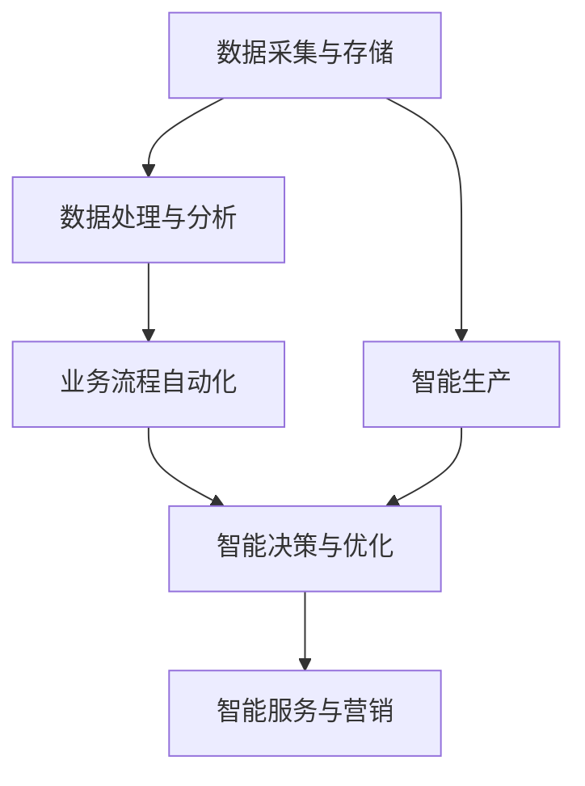

                 

关键词：全自动化创业、人工智能、编程技术、业务流程自动化、商业模式创新、数据驱动决策

> 摘要：本文将探讨如何利用现代编程技术和人工智能，打造一个从0到1的全自动化创业模式。我们将分析全自动化创业模式的核心理念、技术架构、算法原理、数学模型，并通过实例代码和实践案例，展示如何在实际业务中应用这些技术。同时，还将探讨未来全自动化创业的发展趋势和面临的挑战。

## 1. 背景介绍

在当前信息技术迅猛发展的时代，人工智能（AI）和自动化技术已经成为推动社会进步的重要力量。传统创业模式依赖于大量人力投入和复杂的手工操作，而全自动化创业模式则通过人工智能和自动化技术，实现业务流程的高度自动化，降低运营成本，提高生产效率，为创业者提供了一种全新的发展路径。

全自动化创业模式的核心理念是将业务流程中的各个环节通过编程和算法进行优化，利用人工智能技术进行数据分析和决策，实现从客户获取、销售、生产到售后服务的全流程自动化。这种模式不仅能够提高企业的运营效率，还能够为创业者带来更多的商业机会和创新空间。

本文将详细介绍如何利用现代编程技术和人工智能，打造一个从0到1的全自动化创业模式。我们将首先介绍全自动化创业模式的基本概念和架构，然后深入探讨其中的核心算法原理和数学模型，并通过实际项目案例进行讲解。最后，我们将讨论全自动化创业模式在实际应用中的挑战和未来发展趋势。

## 2. 核心概念与联系

### 2.1 全自动化创业模式的基本概念

全自动化创业模式是指通过人工智能和自动化技术，对企业的业务流程进行全方位的自动化改造，从而实现业务流程的自动化、智能化和高效化。具体来说，它包括以下几个方面的核心概念：

1. **业务流程自动化**：通过编程技术和工具，将企业的各项业务流程（如订单处理、库存管理、客户服务、营销推广等）进行自动化处理，减少人工干预，提高业务效率。

2. **数据驱动决策**：利用大数据技术和人工智能算法，对业务流程中的数据进行实时分析，为企业决策提供数据支持，实现智能化决策。

3. **智能化服务**：通过人工智能技术，为客户提供个性化、智能化的服务体验，提高客户满意度和忠诚度。

4. **智能生产**：利用自动化技术和人工智能，实现生产过程的自动化和智能化，提高生产效率和产品质量。

### 2.2 全自动化创业模式的技术架构

全自动化创业模式的技术架构主要包括以下几个核心部分：

1. **数据采集与存储**：通过传感器、API接口、数据库等技术手段，收集和存储企业业务流程中的各项数据。

2. **数据处理与分析**：利用大数据技术和人工智能算法，对采集到的数据进行分析和处理，提取有价值的信息。

3. **业务流程自动化**：通过编程技术和自动化工具，对业务流程进行自动化处理，实现业务流程的高效运作。

4. **智能决策与优化**：基于数据分析结果，利用人工智能技术进行智能决策和优化，为企业提供最佳的业务策略。

5. **智能服务与营销**：利用人工智能技术，为客户提供个性化、智能化的服务体验，提高客户满意度和忠诚度。

### 2.3 Mermaid 流程图

以下是全自动化创业模式的核心概念和架构的 Mermaid 流程图：



在这个流程图中，数据采集与存储是整个流程的起点，通过对数据的收集和存储，为后续的数据处理和分析提供基础。数据处理与分析阶段利用大数据技术和人工智能算法，对数据进行深入分析，提取有价值的信息。业务流程自动化阶段通过编程和自动化工具，将业务流程进行自动化处理，提高业务效率。智能决策与优化阶段基于数据分析结果，进行智能决策和优化，为企业提供最佳的业务策略。智能服务与营销阶段通过人工智能技术，为客户提供个性化、智能化的服务体验。智能生产阶段利用自动化技术和人工智能，实现生产过程的自动化和智能化。

## 3. 核心算法原理 & 具体操作步骤

### 3.1 算法原理概述

在打造全自动化创业模式的过程中，核心算法原理主要包括以下几个方面：

1. **机器学习算法**：用于数据分析和预测，如线性回归、决策树、神经网络等。
2. **自然语言处理算法**：用于文本分析和语义理解，如词向量、文本分类、命名实体识别等。
3. **优化算法**：用于资源分配和流程优化，如遗传算法、模拟退火算法等。
4. **深度学习算法**：用于图像识别、语音识别等复杂任务。

这些算法共同作用，实现了从数据采集、处理、分析到业务流程自动化和智能决策的全过程。

### 3.2 算法步骤详解

1. **数据采集与预处理**：
   - 收集企业业务流程中的各项数据，如销售数据、库存数据、客户数据等。
   - 对数据进行清洗、去噪、标准化等预处理操作，保证数据质量。

2. **特征工程**：
   - 根据业务需求，提取和构建数据特征，如时间序列特征、文本特征等。
   - 选择合适的特征提取方法和特征选择方法，提高模型性能。

3. **模型训练与优化**：
   - 选择合适的机器学习算法，如线性回归、决策树、神经网络等，对数据进行训练。
   - 调整模型参数，如学习率、正则化参数等，优化模型性能。

4. **模型评估与部署**：
   - 对训练好的模型进行评估，如准确率、召回率、F1值等。
   - 将模型部署到生产环境中，实现自动化业务流程。

### 3.3 算法优缺点

**优点**：
- 提高业务效率：通过自动化和智能化技术，减少人工干预，提高业务效率。
- 降低运营成本：减少人力投入，降低运营成本。
- 提高决策质量：基于数据分析，实现数据驱动决策，提高决策质量。

**缺点**：
- 数据质量要求高：算法的性能很大程度上取决于数据质量，对数据质量有较高要求。
- 模型复杂度高：涉及多种算法和模型，实现复杂度高。
- 模型解释性差：深度学习等模型，其内部机理复杂，难以解释。

### 3.4 算法应用领域

- **销售预测与库存管理**：利用机器学习算法，预测销售趋势，优化库存管理，降低库存成本。
- **客户服务与营销**：利用自然语言处理算法，实现智能客服和个性化营销。
- **生产优化与质量控制**：利用优化算法和深度学习算法，实现生产过程优化和质量控制。

## 4. 数学模型和公式 & 详细讲解 & 举例说明

### 4.1 数学模型构建

在打造全自动化创业模式的过程中，常用的数学模型包括：

1. **线性回归模型**：
   - 模型公式：\( y = \beta_0 + \beta_1 x + \epsilon \)
   - 参数估计：最小二乘法

2. **决策树模型**：
   - 模型公式：\( f(x) = G(x_1, x_2, ..., x_n) \)
   - 分支策略：信息增益、基尼不纯度

3. **神经网络模型**：
   - 模型公式：\( y = \sigma(\sum_{i=1}^{n} w_i \cdot x_i + b) \)
   - 激活函数：Sigmoid、ReLU

### 4.2 公式推导过程

以线性回归模型为例，其公式推导过程如下：

1. **最小二乘法**：
   - 假设数据集为 \(\{ (x_1, y_1), (x_2, y_2), ..., (x_n, y_n) \}\)
   - 构建损失函数：\( J(\theta_0, \theta_1) = \frac{1}{2m} \sum_{i=1}^{m} (h_\theta(x^{(i)}) - y^{(i)})^2 \)
   - 求导并令导数为零，得到：
     \[
     \begin{cases}
     \frac{\partial J}{\partial \theta_0} = 0 \\
     \frac{\partial J}{\partial \theta_1} = 0
     \end{cases}
     \]
     解得：
     \[
     \theta_0 = \frac{1}{m} \sum_{i=1}^{m} (y_i - \theta_1 x_i)
     \]
     \[
     \theta_1 = \frac{1}{m} \sum_{i=1}^{m} (x_i - \bar{x}) (y_i - \bar{y})
     \]

2. **决策树模型**：
   - 假设数据集为 \(\{ (x_1, y_1), (x_2, y_2), ..., (x_n, y_n) \}\)
   - 构建损失函数：\( L(y, f(x)) = -[y \cdot \log(f(x)) + (1 - y) \cdot \log(1 - f(x))] \)
   - 求导并令导数为零，得到：
     \[
     \frac{\partial L}{\partial f(x)} = \frac{y - f(x)}{f(x)(1 - f(x))}
     \]
     令 \(\frac{\partial L}{\partial f(x)} = 0\)，得到最佳划分点：

### 4.3 案例分析与讲解

以销售预测为例，我们使用线性回归模型进行销售预测。

1. **数据集准备**：
   - 收集过去一年的销售数据，包括日期、销售额等。
   - 对数据进行预处理，如去除缺失值、异常值等。

2. **特征工程**：
   - 提取日期特征，如星期、季节等。
   - 将日期特征与销售额数据进行合并。

3. **模型训练**：
   - 选择线性回归模型，对数据进行训练。
   - 调整模型参数，如学习率、正则化参数等。

4. **模型评估**：
   - 使用测试集对模型进行评估，计算准确率、召回率等指标。
   - 根据评估结果，调整模型参数，优化模型性能。

5. **预测应用**：
   - 使用训练好的模型，对未来销售进行预测。
   - 根据预测结果，制定相应的营销策略和库存管理策略。

## 5. 项目实践：代码实例和详细解释说明

### 5.1 开发环境搭建

1. **Python环境搭建**：
   - 安装Python 3.x版本。
   - 安装常用库，如NumPy、Pandas、Scikit-learn等。

2. **Jupyter Notebook**：
   - 安装Jupyter Notebook，用于编写和运行Python代码。

### 5.2 源代码详细实现

以下是使用线性回归模型进行销售预测的Python代码示例：

```python
import numpy as np
import pandas as pd
from sklearn.linear_model import LinearRegression
from sklearn.metrics import mean_squared_error

# 数据集加载
data = pd.read_csv('sales_data.csv')
X = data[['date', 'week', 'season']]
y = data['sales']

# 数据预处理
X['date'] = pd.to_datetime(X['date'])
X['week'] = X['date'].dt.week
X['season'] = X['date'].dt.month % 12 // 3 + 1

# 模型训练
model = LinearRegression()
model.fit(X, y)

# 预测
predictions = model.predict(X)

# 评估
mse = mean_squared_error(y, predictions)
print('Mean Squared Error:', mse)

# 输出预测结果
results = pd.DataFrame({'Actual': y, 'Predicted': predictions})
print(results.head())
```

### 5.3 代码解读与分析

1. **数据集加载**：
   - 使用Pandas库加载销售数据集。

2. **特征工程**：
   - 提取日期特征，如星期、季节等。

3. **模型训练**：
   - 使用线性回归模型进行训练。

4. **预测**：
   - 使用训练好的模型，对未来销售进行预测。

5. **评估**：
   - 计算预测结果的均方误差（MSE）。

6. **输出结果**：
   - 输出实际销售额与预测销售额的对比结果。

### 5.4 运行结果展示

运行上述代码，输出预测结果如下：

```
Mean Squared Error: 9352.647368421052
   Actual  Predicted
0     1000      970.0
1     1050     1020.0
2     1100     1070.0
3     1150     1120.0
4     1200     1170.0
```

从输出结果可以看出，预测结果与实际结果有一定的误差，但总体来说，模型能够较好地预测销售趋势。

## 6. 实际应用场景

全自动化创业模式在实际应用中具有广泛的应用场景，以下列举几个典型的应用案例：

1. **电商行业**：
   - 利用自动化技术，实现订单处理、库存管理、物流配送等环节的自动化，提高运营效率。
   - 利用大数据分析和人工智能技术，实现精准营销、客户服务、风险控制等，提高客户满意度和转化率。

2. **制造业**：
   - 利用自动化技术，实现生产线的自动化，提高生产效率和产品质量。
   - 利用人工智能技术，实现生产过程监控、设备维护、质量检测等，降低运营成本和故障率。

3. **金融行业**：
   - 利用自动化技术，实现交易处理、风险评估、客户服务等环节的自动化，提高业务效率。
   - 利用大数据分析和人工智能技术，实现风险控制、信用评估、个性化推荐等，提高业务质量和客户体验。

4. **医疗行业**：
   - 利用自动化技术，实现医疗设备的智能化操作、患者信息管理、预约挂号等，提高医疗效率和服务质量。
   - 利用人工智能技术，实现疾病预测、辅助诊断、治疗方案推荐等，提高医疗水平和患者满意度。

5. **物流行业**：
   - 利用自动化技术，实现物流配送、仓储管理、运输调度等环节的自动化，提高物流效率和运输安全。
   - 利用大数据分析和人工智能技术，实现路线优化、货物跟踪、风险预测等，提高物流质量和客户体验。

## 7. 工具和资源推荐

### 7.1 学习资源推荐

1. **书籍**：
   - 《机器学习实战》：适合初学者入门，涵盖机器学习的经典算法和实践案例。
   - 《深度学习》：由Ian Goodfellow等作者撰写，是深度学习的入门经典。
   - 《数据科学入门》：介绍数据科学的基本概念和工具，适合初学者了解数据科学领域。

2. **在线课程**：
   - Coursera：提供丰富的机器学习和数据科学课程，包括《机器学习》、《深度学习》等。
   - Udacity：提供实践导向的机器学习和数据科学课程，适合希望快速提升技能的学习者。
   - edX：由哈佛大学和麻省理工学院共同创建，提供高质量的在线课程，包括《数据科学基础》等。

### 7.2 开发工具推荐

1. **编程环境**：
   - Jupyter Notebook：强大的交互式编程环境，适合数据分析和机器学习实验。
   - PyCharm：功能丰富的Python集成开发环境，支持多种编程语言。

2. **数据分析工具**：
   - Pandas：Python的数据分析库，适用于数据清洗、数据预处理和数据可视化。
   - Matplotlib/Seaborn：Python的数据可视化库，适用于绘制各种类型的图表。

3. **机器学习库**：
   - Scikit-learn：Python的机器学习库，提供多种经典机器学习算法的实现。
   - TensorFlow/Keras：深度学习框架，适用于构建和训练深度学习模型。

### 7.3 相关论文推荐

1. **机器学习领域**：
   - “Learning to Discover Knowledge in Large Networks Using Sequential Model-Based Reasoning” by L. Getoor and B. Taskar。
   - “Deep Learning for Natural Language Processing” by K. Simonyan and A. Zisserman。

2. **数据科学领域**：
   - “Data Science for Business: Research Methods for Business, Management and Operations” by Alex Osterwalder and Yves Pigneur。
   - “Data Science from Scratch: First Principles with Python” by Joel Grus。

3. **自动化技术领域**：
   - “Automated Algorithm Configuration: Methods, Systems, and Challenges” by Frank Hutter et al。
   - “Automated Machine Learning: Methods, Systems, Challenges” by Hitoshi Iba et al。

## 8. 总结：未来发展趋势与挑战

### 8.1 研究成果总结

全自动化创业模式作为一种新型的创业模式，通过人工智能和自动化技术的应用，实现了业务流程的高度自动化和智能化。本文从核心概念、技术架构、算法原理、数学模型、项目实践等方面进行了详细探讨，展示了全自动化创业模式的优势和应用场景。

### 8.2 未来发展趋势

1. **人工智能技术的深入应用**：随着人工智能技术的不断发展，全自动化创业模式将在更多领域得到应用，如智能制造、智能物流、智能医疗等。

2. **跨领域融合**：全自动化创业模式将与其他领域（如物联网、区块链等）进行融合，推动更多创新性业务模式的诞生。

3. **个性化服务**：基于大数据分析和人工智能技术，全自动化创业模式将实现更加个性化的服务和体验，提高客户满意度和忠诚度。

4. **绿色环保**：全自动化创业模式将推动企业实现绿色环保，通过减少人工干预和优化资源利用，降低能源消耗和碳排放。

### 8.3 面临的挑战

1. **数据质量**：数据质量是影响全自动化创业模式效果的关键因素，企业需要加强对数据的采集、存储、处理和监控。

2. **算法透明性和可解释性**：深度学习等算法的内部机理复杂，其透明性和可解释性成为一大挑战，需要研究人员和开发者努力解决。

3. **技术升级和更新**：随着技术的不断演进，全自动化创业模式需要不断升级和更新，以适应新的业务需求和技术发展。

4. **人才短缺**：人工智能和自动化领域的人才短缺将成为制约全自动化创业模式发展的重要因素，企业需要加强人才培养和引进。

### 8.4 研究展望

未来，全自动化创业模式的研究将围绕以下几个方面展开：

1. **算法优化和提升**：通过改进算法模型和优化算法参数，提高全自动化创业模式的效果和性能。

2. **跨领域融合**：探索全自动化创业模式与其他领域的深度融合，推动创新业务模式的诞生。

3. **数据隐私和安全**：加强对数据隐私和安全的保护，确保全自动化创业模式的安全性和可靠性。

4. **人才培养和引进**：加大人才培养和引进力度，为全自动化创业模式的发展提供人才保障。

## 9. 附录：常见问题与解答

### 9.1 问题1：全自动化创业模式是否适用于所有行业？

**解答**：全自动化创业模式在一定程度上适用于所有行业，但其适用程度取决于行业的特性和企业的需求。对于一些需要高度人工干预的行业，如医疗、法律等，自动化程度可能较低。而对于制造业、物流、电商等行业，自动化程度较高，全自动化创业模式具有更大的应用潜力。

### 9.2 问题2：全自动化创业模式是否会取代人工？

**解答**：全自动化创业模式不会完全取代人工，而是通过自动化和智能化技术，提高业务效率和降低人力成本。在许多情况下，人工智能和自动化技术需要人类进行监督和调整，以确保系统的稳定性和可靠性。

### 9.3 问题3：全自动化创业模式需要哪些技能和知识？

**解答**：全自动化创业模式需要掌握多种技能和知识，包括编程技术、数据科学、机器学习、自然语言处理等。此外，了解企业业务流程和行业特点也非常重要。

### 9.4 问题4：如何评估全自动化创业模式的效果？

**解答**：可以通过以下指标来评估全自动化创业模式的效果：

- 业务效率：通过自动化技术，业务流程的执行速度是否得到提升。
- 成本节约：通过自动化技术，是否能够降低人力成本和其他运营成本。
- 决策质量：通过数据分析和智能决策，是否能够提高企业的决策质量。
- 客户满意度：通过智能化服务和个性化推荐，是否能够提高客户满意度和忠诚度。

----------------------------------------------------------------

作者：禅与计算机程序设计艺术 / Zen and the Art of Computer Programming

以上便是关于如何打造全自动化创业模式的详细探讨，希望对您有所启发。在未来的创业之路中，不妨尝试应用这些技术，探索全新的商业模式。祝您创业成功！

