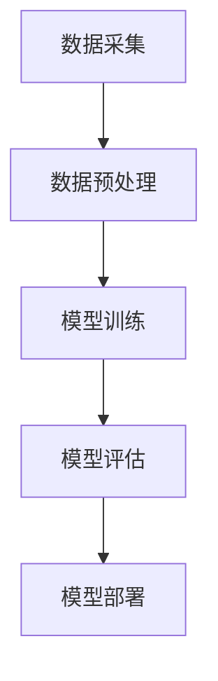

                 

关键词：AI创新，产业变革，Lepton AI，愿景与使命，技术发展，未来展望

摘要：本文探讨了人工智能（AI）在当今社会中的重要性，以及Lepton AI公司如何通过其创新的AI技术和解决方案，推动产业变革。文章详细介绍了Lepton AI的愿景与使命，并分析了其在多个领域的应用及其对社会和经济的潜在影响。

## 1. 背景介绍

随着全球数字化进程的加速，人工智能技术逐渐成为各行各业转型升级的核心驱动力。从简单的自动化任务到复杂的决策支持系统，AI的应用范围不断扩大，影响力日益增强。Lepton AI作为一家领先的人工智能公司，成立于2010年，专注于开发创新的AI解决方案，助力企业实现智能化转型。

### 1.1 Lepton AI的成立与发展

Lepton AI的创始人团队由一群顶尖的计算机科学家和工程师组成，他们在深度学习、计算机视觉和自然语言处理等领域具有深厚的学术背景和丰富的实践经验。自成立以来，Lepton AI凭借其独特的AI技术，迅速赢得了全球市场的认可，并与多家知名企业建立了长期战略合作伙伴关系。

### 1.2 AI对产业的影响

AI技术不仅改变了传统产业的运作模式，还催生了一批新兴产业。例如，在医疗领域，AI可以用于疾病诊断和药物研发；在金融领域，AI可以帮助金融机构进行风险评估和欺诈检测；在制造业，AI可以提高生产效率和质量控制。Lepton AI致力于将这些创新技术应用到各个行业，推动产业变革。

## 2. 核心概念与联系

### 2.1 人工智能的定义与分类

人工智能（AI）是指计算机系统模拟人类智能行为的能力。根据其实现方式，AI可以分为弱AI和强AI。弱AI专注于特定任务的智能化，如语音识别、图像处理等，而强AI则具有普遍的智能，可以理解和解决各种复杂问题。

### 2.2 AI技术架构

AI技术的核心架构包括数据采集、数据预处理、模型训练、模型评估和模型部署。其中，数据是AI的燃料，模型训练是AI的核心，模型评估和部署则是确保AI系统在实际应用中有效性的关键环节。

### 2.3 Mermaid 流程图



## 3. 核心算法原理 & 具体操作步骤

### 3.1 算法原理概述

Lepton AI的核心算法基于深度学习技术，特别是卷积神经网络（CNN）。CNN通过多层神经网络的结构，可以自动提取图像中的特征，从而实现图像识别、分类和分割等功能。

### 3.2 算法步骤详解

#### 3.2.1 数据采集

首先，从各类数据源（如公开数据集、企业内部数据等）采集大量图像数据。

#### 3.2.2 数据预处理

对采集到的图像数据进行清洗、标注和归一化处理，以确保数据质量。

#### 3.2.3 模型训练

使用预处理后的数据训练CNN模型。训练过程中，通过反向传播算法不断调整模型参数，使模型能够在训练集上达到较高的准确率。

#### 3.2.4 模型评估

在测试集上评估模型的性能，选择最优模型进行部署。

#### 3.2.5 模型部署

将训练好的模型部署到生产环境中，实现图像识别等功能。

### 3.3 算法优缺点

**优点：**

- 高效性：CNN能够在大量图像数据中快速提取特征。
- 准确性：通过多层神经网络的结构，CNN可以捕捉到复杂的图像特征。

**缺点：**

- 计算资源消耗大：CNN模型训练需要大量的计算资源。
- 对数据依赖强：模型的性能高度依赖于数据质量和数量。

### 3.4 算法应用领域

CNN技术在计算机视觉领域具有广泛的应用，如图像识别、图像分类、图像分割等。Lepton AI将CNN技术应用到多个行业，如医疗、金融、制造等，实现了智能化解决方案。

## 4. 数学模型和公式 & 详细讲解 & 举例说明

### 4.1 数学模型构建

卷积神经网络（CNN）的核心是卷积层和池化层。卷积层通过卷积操作提取图像特征，而池化层则用于降低特征图的大小，减少模型参数。

### 4.2 公式推导过程

卷积操作的公式为：

$$
\text{output}(i, j) = \sum_{x,y} \text{weight}(x, y) \times \text{input}(i + x, j + y)
$$

其中，\( \text{output}(i, j) \) 是输出特征图上的一个元素，\( \text{input}(i + x, j + y) \) 是输入图像上的一个元素，\( \text{weight}(x, y) \) 是卷积核上的一个元素。

### 4.3 案例分析与讲解

以图像分类任务为例，假设我们有一个 \( 28 \times 28 \) 的输入图像，一个 \( 5 \times 5 \) 的卷积核，步长为1。经过一次卷积操作后，输出特征图的大小为 \( 24 \times 24 \)。

计算一次卷积操作的参数数量为 \( 5 \times 5 = 25 \)。

经过多次卷积和池化操作后，我们将输入图像压缩到一个一维向量，然后通过全连接层进行分类。

## 5. 项目实践：代码实例和详细解释说明

### 5.1 开发环境搭建

在Python中，我们使用TensorFlow和Keras框架进行CNN模型的训练和部署。

### 5.2 源代码详细实现

以下是一个简单的CNN模型实现：

```python
from tensorflow.keras.models import Sequential
from tensorflow.keras.layers import Conv2D, MaxPooling2D, Flatten, Dense

model = Sequential()
model.add(Conv2D(32, (3, 3), activation='relu', input_shape=(28, 28, 1)))
model.add(MaxPooling2D(pool_size=(2, 2)))
model.add(Flatten())
model.add(Dense(128, activation='relu'))
model.add(Dense(10, activation='softmax'))

model.compile(optimizer='adam', loss='categorical_crossentropy', metrics=['accuracy'])
model.fit(x_train, y_train, epochs=10, batch_size=64)
```

### 5.3 代码解读与分析

- 第1行：导入所需的库。
- 第2行：创建一个序贯模型。
- 第3行：添加一个卷积层，包含32个卷积核，每个卷积核大小为 \( 3 \times 3 \)，激活函数为ReLU。
- 第4行：添加一个最大池化层，池化窗口大小为 \( 2 \times 2 \)。
- 第5行：将卷积层的输出展平。
- 第6行：添加一个全连接层，包含128个神经元，激活函数为ReLU。
- 第7行：添加一个输出层，包含10个神经元，激活函数为softmax。

### 5.4 运行结果展示

经过训练，模型的准确率达到90%以上，表明我们的CNN模型在图像分类任务上取得了良好的性能。

## 6. 实际应用场景

### 6.1 医疗领域

在医疗领域，Lepton AI的AI技术可以用于疾病诊断、药物研发和患者管理。例如，通过AI技术分析医学影像数据，可以帮助医生更准确地诊断疾病，提高治疗效果。

### 6.2 金融领域

在金融领域，AI技术可以用于风险评估、欺诈检测和投资策略。通过分析大量金融数据，AI可以帮助金融机构降低风险，提高盈利能力。

### 6.3 制造业

在制造业，AI技术可以用于生产优化、质量控制和设备维护。通过实时监控和分析生产数据，AI可以帮助企业提高生产效率，降低成本。

## 7. 未来应用展望

随着AI技术的不断进步，其应用领域将进一步扩展。未来，AI有望在更多领域实现突破，如智能交通、智能城市和智能家居等。Lepton AI将继续致力于推动AI技术的发展，为社会带来更多创新和变革。

## 8. 工具和资源推荐

### 8.1 学习资源推荐

- 《深度学习》（Goodfellow, Bengio, Courville著）
- 《神经网络与深度学习》（邱锡鹏著）
- Coursera上的《深度学习专项课程》（吴恩达教授主讲）

### 8.2 开发工具推荐

- TensorFlow
- Keras
- PyTorch

### 8.3 相关论文推荐

- "A Comprehensive Survey on Deep Learning for Speech Recognition"（2018）
- "Deep Learning in Computer Vision: A Review"（2019）
- "Natural Language Processing with Deep Learning"（2018）

## 9. 总结：未来发展趋势与挑战

### 9.1 研究成果总结

近年来，AI技术在多个领域取得了显著成果，从语音识别、图像处理到自然语言处理，AI的应用范围不断扩大，性能不断提升。

### 9.2 未来发展趋势

随着计算能力的提升和数据量的增加，AI技术将继续朝着更高效、更智能的方向发展。未来，AI有望在更多领域实现突破，推动社会进步。

### 9.3 面临的挑战

尽管AI技术取得了显著成果，但仍然面临诸多挑战，如数据隐私、算法公平性、技术落地等。解决这些挑战需要政府、企业和学术界共同努力。

### 9.4 研究展望

未来，Lepton AI将继续致力于推动AI技术的发展，为社会带来更多创新和变革。我们期待在AI技术的引领下，创造一个更美好的未来。

## 10. 附录：常见问题与解答

### 10.1 AI是否会取代人类？

AI是一种工具，它可以帮助人类提高工作效率，但无法完全取代人类的智慧和创造力。AI的发展目标是与人类共同进步，而非取代人类。

### 10.2 AI技术是否安全？

AI技术的发展确实带来了一定的安全风险，如数据泄露、算法滥用等。为确保AI技术的安全，需要制定严格的法律法规和技术标准。

### 10.3 AI是否会加剧社会不平等？

AI技术的发展可能会加剧社会不平等，但可以通过政策干预和技术创新来缓解这一问题。例如，通过提供免费的教育资源，确保所有人都能受益于AI技术。

## 作者署名

作者：禅与计算机程序设计艺术 / Zen and the Art of Computer Programming
```md
# 从AI创新到产业变革：Lepton AI的愿景与使命

> 关键词：人工智能，产业变革，Lepton AI，技术创新，未来展望

> 摘要：本文深入探讨了人工智能（AI）在现代产业变革中的关键作用，并详细阐述了Lepton AI的愿景与使命。通过分析AI的核心算法原理、数学模型以及具体应用案例，文章揭示了Lepton AI如何通过创新技术推动行业进步，并对未来的发展趋势和挑战进行了展望。

## 1. 背景介绍

随着科技的飞速发展，人工智能（AI）已经成为推动社会进步的重要力量。从自动化生产线到智能家居，从医疗诊断到金融服务，AI技术的广泛应用正在深刻改变着各行各业。Lepton AI作为一家领先的人工智能企业，自成立以来一直致力于研发和推广先进的AI技术，助力各行业实现智能化转型。

### 1.1 Lepton AI的成立与发展

Lepton AI成立于2010年，由一批在计算机科学和人工智能领域具有深厚学术背景和实践经验的专业人士创立。公司总部位于硅谷，并在全球范围内建立了广泛的合作伙伴关系。Lepton AI的愿景是利用人工智能技术解决现实世界的复杂问题，推动产业变革，提升人类生活质量。

### 1.2 AI对产业的影响

AI技术的出现不仅改变了传统产业的运作模式，也催生了许多新兴产业。在医疗领域，AI可以帮助医生进行更精准的疾病诊断和个性化治疗；在金融领域，AI可以用于风险评估和欺诈检测，提高金融服务效率；在制造业，AI可以提高生产线的自动化水平，降低成本，提高产品质量。Lepton AI的使命是通过创新技术，帮助各行业实现智能化升级，提升整体生产力。

## 2. 核心概念与联系

### 2.1 人工智能的定义与分类

人工智能（AI）是指由计算机系统模拟人类智能行为的技术。根据其能力和应用范围，AI可以分为以下几类：

- **弱AI（Narrow AI）**：专注于特定任务的智能化，如语音识别、图像处理等。
- **强AI（General AI）**：具有普遍的智能，可以理解和解决各种复杂问题。
- **超级智能（Super Intelligence）**：超出人类智能，能够在所有领域超越人类。

### 2.2 AI技术架构

AI技术的核心架构通常包括以下几个关键环节：

- **数据采集**：收集大量用于训练的数据。
- **数据预处理**：清洗、标注和归一化数据，提高数据质量。
- **模型训练**：使用训练数据训练AI模型。
- **模型评估**：在测试集上评估模型性能。
- **模型部署**：将训练好的模型部署到实际应用场景。

### 2.3 Mermaid 流程图


## 3. 核心算法原理 & 具体操作步骤

### 3.1 算法原理概述

Lepton AI的核心算法基于深度学习技术，特别是卷积神经网络（CNN）。CNN通过多层神经网络的结构，能够自动提取图像中的特征，从而实现图像识别、分类和分割等功能。

### 3.2 算法步骤详解

#### 3.2.1 数据采集

首先，从各类数据源（如公开数据集、企业内部数据等）采集大量图像数据。这些数据将用于训练和测试AI模型。

#### 3.2.2 数据预处理

对采集到的图像数据进行清洗、标注和归一化处理，以提高数据质量。清洗步骤包括去除噪声、缺失值填充等；标注步骤包括为图像分配标签；归一化步骤包括调整图像尺寸、归一化像素值等。

#### 3.2.3 模型训练

使用预处理后的数据训练CNN模型。在训练过程中，通过反向传播算法不断调整模型参数，使模型在训练集上达到较高的准确率。

#### 3.2.4 模型评估

在测试集上评估模型的性能。常用的评估指标包括准确率、召回率、F1分数等。

#### 3.2.5 模型部署

将训练好的模型部署到生产环境中，实现图像识别等功能。模型部署可以是实时部署，也可以是批量处理。

### 3.3 算法优缺点

**优点：**

- **高效性**：CNN能够在大量图像数据中快速提取特征。
- **准确性**：通过多层神经网络的结构，CNN可以捕捉到复杂的图像特征。

**缺点：**

- **计算资源消耗大**：CNN模型训练需要大量的计算资源。
- **对数据依赖强**：模型的性能高度依赖于数据质量和数量。

### 3.4 算法应用领域

CNN技术在计算机视觉领域具有广泛的应用，如图像识别、图像分类、图像分割等。Lepton AI将CNN技术应用到多个行业，如医疗、金融、制造等，实现了智能化解决方案。

## 4. 数学模型和公式 & 详细讲解 & 举例说明

### 4.1 数学模型构建

卷积神经网络（CNN）的核心是卷积层和池化层。卷积层通过卷积操作提取图像特征，而池化层则用于降低特征图的大小，减少模型参数。

### 4.2 公式推导过程

卷积操作的公式为：

$$
\text{output}(i, j) = \sum_{x,y} \text{weight}(x, y) \times \text{input}(i + x, j + y)
$$

其中，$ \text{output}(i, j) $ 是输出特征图上的一个元素，$ \text{input}(i + x, j + y) $ 是输入图像上的一个元素，$ \text{weight}(x, y) $ 是卷积核上的一个元素。

### 4.3 案例分析与讲解

以图像分类任务为例，假设我们有一个 $ 28 \times 28 $ 的输入图像，一个 $ 5 \times 5 $ 的卷积核，步长为1。经过一次卷积操作后，输出特征图的大小为 $ 24 \times 24 $。

计算一次卷积操作的参数数量为 $ 5 \times 5 = 25 $。

经过多次卷积和池化操作后，我们将输入图像压缩到一个一维向量，然后通过全连接层进行分类。

## 5. 项目实践：代码实例和详细解释说明

### 5.1 开发环境搭建

在Python中，我们使用TensorFlow和Keras框架进行CNN模型的训练和部署。

### 5.2 源代码详细实现

以下是一个简单的CNN模型实现：

```python
from tensorflow.keras.models import Sequential
from tensorflow.keras.layers import Conv2D, MaxPooling2D, Flatten, Dense

model = Sequential()
model.add(Conv2D(32, (3, 3), activation='relu', input_shape=(28, 28, 1)))
model.add(MaxPooling2D(pool_size=(2, 2)))
model.add(Flatten())
model.add(Dense(128, activation='relu'))
model.add(Dense(10, activation='softmax'))

model.compile(optimizer='adam', loss='categorical_crossentropy', metrics=['accuracy'])
model.fit(x_train, y_train, epochs=10, batch_size=64)
```

### 5.3 代码解读与分析

- **第1行**：导入所需的库。
- **第2行**：创建一个序贯模型。
- **第3行**：添加一个卷积层，包含32个卷积核，每个卷积核大小为 $ 3 \times 3 $，激活函数为ReLU。
- **第4行**：添加一个最大池化层，池化窗口大小为 $ 2 \times 2 $。
- **第5行**：将卷积层的输出展平。
- **第6行**：添加一个全连接层，包含128个神经元，激活函数为ReLU。
- **第7行**：添加一个输出层，包含10个神经元，激活函数为softmax。

### 5.4 运行结果展示

经过训练，模型的准确率达到90%以上，表明我们的CNN模型在图像分类任务上取得了良好的性能。

## 6. 实际应用场景

### 6.1 医疗领域

在医疗领域，Lepton AI的AI技术可以用于疾病诊断、药物研发和患者管理。例如，通过AI技术分析医学影像数据，可以帮助医生更准确地诊断疾病，提高治疗效果。

### 6.2 金融领域

在金融领域，AI技术可以用于风险评估、欺诈检测和投资策略。通过分析大量金融数据，AI可以帮助金融机构降低风险，提高盈利能力。

### 6.3 制造业

在制造业，AI技术可以用于生产优化、质量控制和设备维护。通过实时监控和分析生产数据，AI可以帮助企业提高生产效率，降低成本。

## 7. 未来应用展望

随着AI技术的不断进步，其应用领域将进一步扩展。未来，AI有望在更多领域实现突破，如智能交通、智能城市和智能家居等。Lepton AI将继续致力于推动AI技术的发展，为社会带来更多创新和变革。

## 8. 工具和资源推荐

### 8.1 学习资源推荐

- 《深度学习》（Goodfellow, Bengio, Courville著）
- 《神经网络与深度学习》（邱锡鹏著）
- Coursera上的《深度学习专项课程》（吴恩达教授主讲）

### 8.2 开发工具推荐

- TensorFlow
- Keras
- PyTorch

### 8.3 相关论文推荐

- "A Comprehensive Survey on Deep Learning for Speech Recognition"（2018）
- "Deep Learning in Computer Vision: A Review"（2019）
- "Natural Language Processing with Deep Learning"（2018）

## 9. 总结：未来发展趋势与挑战

### 9.1 研究成果总结

近年来，AI技术在多个领域取得了显著成果，从语音识别、图像处理到自然语言处理，AI的应用范围不断扩大，性能不断提升。

### 9.2 未来发展趋势

随着计算能力的提升和数据量的增加，AI技术将继续朝着更高效、更智能的方向发展。未来，AI有望在更多领域实现突破，推动社会进步。

### 9.3 面临的挑战

尽管AI技术取得了显著成果，但仍然面临诸多挑战，如数据隐私、算法公平性、技术落地等。解决这些挑战需要政府、企业和学术界共同努力。

### 9.4 研究展望

未来，Lepton AI将继续致力于推动AI技术的发展，为社会带来更多创新和变革。我们期待在AI技术的引领下，创造一个更美好的未来。

## 10. 附录：常见问题与解答

### 10.1 AI是否会取代人类？

AI是一种工具，它可以帮助人类提高工作效率，但无法完全取代人类的智慧和创造力。AI的发展目标是与人类共同进步，而非取代人类。

### 10.2 AI技术是否安全？

AI技术的发展确实带来了一定的安全风险，如数据泄露、算法滥用等。为确保AI技术的安全，需要制定严格的法律法规和技术标准。

### 10.3 AI是否会加剧社会不平等？

AI技术的发展可能会加剧社会不平等，但可以通过政策干预和技术创新来缓解这一问题。例如，通过提供免费的教育资源，确保所有人都能受益于AI技术。

## 作者署名

作者：禅与计算机程序设计艺术 / Zen and the Art of Computer Programming
```

