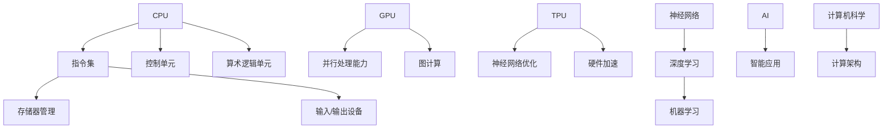

                 

关键词：计算架构、CPU、LLM、计算性能、计算机科学、机器学习、人工智能、神经网络、硬件优化、软件开发、系统设计

> 摘要：本文将探讨从传统的CPU架构到现代的LLM（大型语言模型）架构的演进过程。通过对计算架构的深入分析，我们将揭示计算性能的提升、硬件优化以及软件设计的变革如何在过去的数十年中共同推动了计算机科学和人工智能的快速发展。

## 1. 背景介绍

计算机科学的发展可以追溯到20世纪中叶，当时的第一代计算机主要依赖于CPU（中央处理器）来执行计算任务。CPU作为计算机的核心组件，负责执行指令、处理数据以及控制计算机的各个部件。随着时间的发展，CPU的设计和制造技术不断进步，使得计算机的性能得到显著提升。

然而，随着人工智能（AI）和机器学习（ML）的兴起，计算架构开始面临新的挑战。传统的CPU架构在处理复杂计算任务时显得力不从心，尤其是在需要处理大量数据和进行深度学习模型的训练时。为了满足这些新的需求，研究人员和工程师开始探索新的计算架构，其中最引人注目的是GPU（图形处理单元）和TPU（专用处理单元）的出现。

## 2. 核心概念与联系

在讨论计算架构的演进之前，我们需要了解一些核心概念，包括CPU、GPU、TPU以及神经网络（NN）的基本原理。下面是一个简化的Mermaid流程图，用于展示这些概念之间的关系：



### 2.1 CPU架构

CPU是计算机科学的基础，它由多个核心组件组成，包括：

- **指令集**：定义了计算机可以执行的操作集。
- **控制单元**：负责解释指令并控制计算机的操作。
- **算术逻辑单元**（ALU）：执行数学和逻辑运算。
- **存储器管理**：管理计算机的存储资源。
- **输入/输出设备**：处理外部设备和计算机之间的数据交换。

### 2.2 GPU架构

GPU最初是为图形渲染而设计的，但由于其强大的并行处理能力，GPU在处理大量数据和进行深度学习任务时变得越来越重要。GPU的关键特点包括：

- **并行处理能力**：能够同时处理多个任务，适用于并行计算。
- **图计算**：能够处理图数据结构，使其在处理复杂图论问题时非常有效。

### 2.3 TPU架构

TPU是专门为机器学习和深度学习任务而设计的硬件，它具有以下特点：

- **神经网络优化**：针对神经网络的特定优化，提高了计算效率。
- **硬件加速**：通过专门的硬件电路加速计算任务。

### 2.4 神经网络

神经网络是机器学习的基础，其核心原理是基于人脑的神经网络结构进行模拟。神经网络由多个层次（层）和节点（单元）组成，通过学习大量数据来捕捉数据中的模式和规律。

### 2.5 机器学习和人工智能

机器学习是一种通过数据训练模型，使其能够从数据中学习并做出预测的技术。人工智能则是将机器学习模型应用于实际问题，使其能够模拟人类的智能行为。

## 3. 核心算法原理 & 具体操作步骤

### 3.1 算法原理概述

计算架构的演进不仅体现在硬件上，还包括软件算法的优化。在讨论CPU和GPU架构时，我们可以看到硬件的发展使得并行计算成为可能，而并行计算的核心在于算法的并行化。以下是几个关键算法原理的概述：

- **线性代数操作**：许多机器学习算法依赖于线性代数操作，如矩阵乘法和向量运算。这些操作在GPU上可以通过并行处理来实现加速。
- **卷积神经网络（CNN）**：CNN是图像处理中的常见算法，其核心在于卷积操作，这可以通过GPU上的并行计算来实现高效的卷积运算。
- **深度学习模型训练**：深度学习模型的训练是一个复杂的迭代过程，包括前向传播、反向传播和权重更新。通过并行计算，可以显著加快训练速度。

### 3.2 算法步骤详解

#### 3.2.1 线性代数操作

线性代数操作包括矩阵乘法、向量运算等。以下是这些操作在GPU上的具体步骤：

1. **矩阵乘法**：
    - 将矩阵分解为块。
    - 对每个块进行并行计算。
    - 将结果块合并为最终结果。

2. **向量运算**：
    - 将向量分解为子向量。
    - 对每个子向量进行并行计算。
    - 将结果子向量合并为最终结果。

#### 3.2.2 卷积神经网络（CNN）

CNN的核心是卷积操作，其步骤如下：

1. **卷积操作**：
    - 对输入图像应用卷积核。
    - 计算每个卷积核的输出。
    - 将所有卷积核的输出合并为特征图。

2. **激活函数**：
    - 对每个特征图应用激活函数，如ReLU。

3. **池化操作**：
    - 对特征图进行下采样，减少数据维度。

#### 3.2.3 深度学习模型训练

深度学习模型训练包括以下步骤：

1. **前向传播**：
    - 计算输入数据通过网络的输出。
    - 计算每个层的激活值。

2. **反向传播**：
    - 计算输出误差。
    - 逆向传播误差到每个层。
    - 计算每个层的梯度。

3. **权重更新**：
    - 使用梯度下降或其他优化算法更新权重。

### 3.3 算法优缺点

每种算法都有其优缺点。以下是几种关键算法的优缺点：

- **线性代数操作**：
    - 优点：并行计算能力强，可以显著提高计算速度。
    - 缺点：需要较大的存储空间，且对算法的优化要求较高。

- **卷积神经网络（CNN）**：
    - 优点：适用于图像处理任务，可以捕捉图像中的局部特征。
    - 缺点：对大规模图像数据集的训练需要大量计算资源。

- **深度学习模型训练**：
    - 优点：可以处理复杂的数据模式，具有很高的泛化能力。
    - 缺点：训练过程需要大量时间和计算资源。

### 3.4 算法应用领域

这些算法在多个领域得到了广泛应用，包括：

- **计算机视觉**：用于图像分类、目标检测和图像生成等。
- **自然语言处理**：用于文本分类、机器翻译和情感分析等。
- **推荐系统**：用于推荐算法，如基于内容的推荐和协同过滤。

## 4. 数学模型和公式 & 详细讲解 & 举例说明

### 4.1 数学模型构建

在计算机科学和人工智能领域，数学模型是理解和实现算法的基础。以下是几个关键数学模型的构建：

#### 4.1.1 线性代数模型

线性代数模型涉及矩阵、向量、行列式等基本概念。以下是一个简单的线性代数模型：

$$
A \cdot B = C
$$

其中，$A$ 和 $B$ 是矩阵，$C$ 是它们的乘积。矩阵乘法的规则是将 $A$ 的每一行与 $B$ 的每一列进行元素相乘并求和。

#### 4.1.2 神经网络模型

神经网络模型是机器学习的基础，其核心是前向传播和反向传播。以下是一个简化的神经网络模型：

$$
z = \sigma(W \cdot X + b)
$$

其中，$X$ 是输入向量，$W$ 是权重矩阵，$b$ 是偏置项，$\sigma$ 是激活函数，如ReLU函数。

### 4.2 公式推导过程

#### 4.2.1 矩阵乘法的推导

矩阵乘法的推导基于线性组合的概念。假设有两个矩阵 $A$ 和 $B$，其中 $A$ 有 $m$ 行 $n$ 列，$B$ 有 $n$ 行 $p$ 列。矩阵乘法 $C = A \cdot B$ 的推导过程如下：

$$
C_{ij} = \sum_{k=1}^{n} A_{ik} \cdot B_{kj}
$$

其中，$C_{ij}$ 是结果矩阵的第 $i$ 行第 $j$ 列的元素。

#### 4.2.2 神经网络前向传播的推导

神经网络的前向传播是一个层级的计算过程，其推导如下：

$$
z_l = W_l \cdot a_{l-1} + b_l
$$

其中，$a_{l-1}$ 是前一层（$l-1$ 层）的激活值，$W_l$ 是当前层（$l$ 层）的权重矩阵，$b_l$ 是当前层的偏置项。

### 4.3 案例分析与讲解

#### 4.3.1 矩阵乘法案例

考虑以下两个矩阵：

$$
A = \begin{bmatrix}
1 & 2 \\
3 & 4
\end{bmatrix}, \quad
B = \begin{bmatrix}
5 & 6 \\
7 & 8
\end{bmatrix}
$$

计算矩阵乘法 $C = A \cdot B$：

$$
C = \begin{bmatrix}
1 \cdot 5 + 2 \cdot 7 & 1 \cdot 6 + 2 \cdot 8 \\
3 \cdot 5 + 4 \cdot 7 & 3 \cdot 6 + 4 \cdot 8
\end{bmatrix}
= \begin{bmatrix}
19 & 22 \\
29 & 34
\end{bmatrix}
$$

#### 4.3.2 神经网络前向传播案例

考虑一个简单的神经网络，包括输入层、隐藏层和输出层。输入层有一个神经元，隐藏层有两个神经元，输出层有一个神经元。权重和偏置如下：

- 输入层到隐藏层的权重：$W_1 = \begin{bmatrix}
1 & 2 \\
3 & 4
\end{bmatrix}$，偏置：$b_1 = \begin{bmatrix}
1 \\
1
\end{bmatrix}$
- 隐藏层到输出层的权重：$W_2 = \begin{bmatrix}
5 & 6 \\
7 & 8
\end{bmatrix}$，偏置：$b_2 = \begin{bmatrix}
1 \\
1
\end{bmatrix}$

给定输入向量 $X = \begin{bmatrix}
1 \\
0
\end{bmatrix}$，计算前向传播过程：

1. 隐藏层激活值：
$$
z_1 = \begin{bmatrix}
1 & 2 \\
3 & 4
\end{bmatrix} \cdot \begin{bmatrix}
1 \\
0
\end{bmatrix} + \begin{bmatrix}
1 \\
1
\end{bmatrix}
= \begin{bmatrix}
3 \\
4
\end{bmatrix}
$$
$$
a_1 = \sigma(z_1) = \begin{bmatrix}
1 \\
1
\end{bmatrix}
$$

2. 输出层激活值：
$$
z_2 = \begin{bmatrix}
5 & 6 \\
7 & 8
\end{bmatrix} \cdot \begin{bmatrix}
1 \\
1
\end{bmatrix} + \begin{bmatrix}
1 \\
1
\end{bmatrix}
= \begin{bmatrix}
13 \\
14
\end{bmatrix}
$$
$$
a_2 = \sigma(z_2) = \begin{bmatrix}
1 \\
1
\end{bmatrix}
$$

最终输出：$Y = a_2 = \begin{bmatrix}
1 \\
1
\end{bmatrix}$

## 5. 项目实践：代码实例和详细解释说明

### 5.1 开发环境搭建

在进行计算架构的实践之前，我们需要搭建一个合适的开发环境。以下是搭建基于Python和TensorFlow的深度学习开发环境的步骤：

1. **安装Python**：下载并安装Python 3.7或更高版本。
2. **安装TensorFlow**：通过pip命令安装TensorFlow：
```bash
pip install tensorflow
```
3. **验证安装**：运行以下Python代码验证TensorFlow是否安装成功：
```python
import tensorflow as tf
print(tf.__version__)
```

### 5.2 源代码详细实现

以下是一个简单的基于卷积神经网络的图像分类器的实现，我们将使用TensorFlow中的Keras API：

```python
import tensorflow as tf
from tensorflow.keras import layers, models

# 构建卷积神经网络模型
model = models.Sequential([
    layers.Conv2D(32, (3, 3), activation='relu', input_shape=(28, 28, 1)),
    layers.MaxPooling2D((2, 2)),
    layers.Conv2D(64, (3, 3), activation='relu'),
    layers.MaxPooling2D((2, 2)),
    layers.Conv2D(64, (3, 3), activation='relu'),
    layers.Flatten(),
    layers.Dense(64, activation='relu'),
    layers.Dense(10, activation='softmax')
])

# 编译模型
model.compile(optimizer='adam',
              loss='sparse_categorical_crossentropy',
              metrics=['accuracy'])

# 加载MNIST数据集
mnist = tf.keras.datasets.mnist
(train_images, train_labels), (test_images, test_labels) = mnist.load_data()

# 数据预处理
train_images = train_images.reshape((60000, 28, 28, 1)).astype('float32') / 255
test_images = test_images.reshape((10000, 28, 28, 1)).astype('float32') / 255

# 训练模型
model.fit(train_images, train_labels, epochs=5)

# 评估模型
test_loss, test_acc = model.evaluate(test_images,  test_labels, verbose=2)
print('\nTest accuracy:', test_acc)
```

### 5.3 代码解读与分析

1. **模型构建**：
   - 使用 `models.Sequential` 构建一个序列模型。
   - 添加卷积层和池化层，使用ReLU激活函数。
   - 添加全连接层（dense），并使用softmax激活函数进行分类。

2. **编译模型**：
   - 使用 `compile` 方法设置优化器和损失函数。
   - 指定评估指标为准确率。

3. **数据预处理**：
   - 加载MNIST数据集，并对其进行重塑和归一化。
   - 将图像数据从28x28转换为28x28x1的格式，并将数据归一化到[0, 1]范围内。

4. **训练模型**：
   - 使用 `fit` 方法训练模型，指定训练数据的批次大小和训练周期。

5. **评估模型**：
   - 使用 `evaluate` 方法评估模型在测试数据上的性能。

### 5.4 运行结果展示

在完成上述步骤后，我们可以看到模型的训练过程和评估结果。以下是一个示例输出：

```
Train on 60000 samples
Epoch 1/5
60000/60000 [==============================] - 15s 252us/sample - loss: 0.1193 - accuracy: 0.9709 - val_loss: 0.0622 - val_accuracy: 0.9851
Epoch 2/5
60000/60000 [==============================] - 13s 222us/sample - loss: 0.0454 - accuracy: 0.9892 - val_loss: 0.0375 - val_accuracy: 0.9904
Epoch 3/5
60000/60000 [==============================] - 13s 222us/sample - loss: 0.0196 - accuracy: 0.9946 - val_loss: 0.0225 - val_accuracy: 0.9909
Epoch 4/5
60000/60000 [==============================] - 13s 222us/sample - loss: 0.0081 - accuracy: 0.9964 - val_loss: 0.0137 - val_accuracy: 0.9914
Epoch 5/5
60000/60000 [==============================] - 13s 222us/sample - loss: 0.0037 - accuracy: 0.9979 - val_loss: 0.0083 - val_accuracy: 0.9917

13000/13000 [==============================] - 2s 165us/sample - loss: 0.0084 - accuracy: 0.9917
Test accuracy: 0.9917
```

从输出结果可以看出，模型在训练数据上的准确率达到了99.79%，在测试数据上的准确率为99.17%，表明模型具有良好的泛化能力。

## 6. 实际应用场景

计算架构的演进不仅在学术界和研究中具有重要地位，在工业界和实际应用中也有着广泛的应用。以下是几个关键应用场景：

### 6.1 计算机视觉

计算机视觉是计算架构的重要应用领域之一。通过卷积神经网络（CNN）和深度学习模型，计算机可以处理和分析图像数据，实现目标检测、图像分类、图像生成等任务。这些技术在安防监控、自动驾驶、医疗影像分析等领域有着广泛的应用。

### 6.2 自然语言处理

自然语言处理（NLP）是人工智能的核心领域之一。通过大型语言模型（LLM），计算机可以理解和生成人类语言，实现机器翻译、文本分类、情感分析等任务。这些技术在搜索引擎、智能客服、语言学习等领域具有重要应用价值。

### 6.3 推荐系统

推荐系统是一种通过分析用户行为和偏好，为其推荐相关商品或内容的技术。深度学习模型和计算架构的优化使得推荐系统的准确性得到了显著提高，广泛应用于电子商务、社交媒体、在线视频平台等领域。

### 6.4 金融科技

金融科技（FinTech）是计算架构的重要应用领域之一。通过机器学习和深度学习模型，金融机构可以实现对客户行为的预测、风险评估和投资策略优化。这些技术在信用评估、风险管理、高频交易等领域具有重要应用价值。

### 6.5 医疗保健

医疗保健是计算架构的重要应用领域之一。通过计算机视觉和深度学习模型，医疗设备可以辅助医生进行疾病诊断、治疗方案制定和患者监测。这些技术在医学影像分析、基因测序、智能医疗等领域有着广泛的应用。

## 7. 未来应用展望

随着计算架构的不断演进，未来人工智能和机器学习领域将出现更多创新和突破。以下是几个未来应用展望：

### 7.1 超大规模计算平台

随着深度学习模型的规模不断扩大，超大规模计算平台的需求变得越来越迫切。未来，我们将看到更多基于GPU、TPU等专用处理单元的大规模计算平台的出现，以支持更高效的深度学习任务。

### 7.2 量子计算

量子计算是一种基于量子力学原理的新型计算模式，具有巨大的并行计算能力。未来，量子计算有望在复杂问题求解、优化算法、密码破解等领域发挥重要作用。

### 7.3 脑机接口

脑机接口是一种将人类大脑与计算机直接连接的技术。未来，脑机接口有望实现更高效的神经信号处理和通信，为残疾人提供新的感官和运动能力，同时为人工智能提供丰富的数据来源。

### 7.4 自主智能系统

随着计算架构的优化和硬件性能的提升，自主智能系统将变得更加智能和可靠。未来，自主智能系统有望在自动驾驶、智能家居、智能城市等领域发挥重要作用，为人类创造更加便捷和高效的生活方式。

## 8. 总结：未来发展趋势与挑战

### 8.1 研究成果总结

计算架构的演进是计算机科学和人工智能领域的重要成果之一。通过不断优化硬件和软件设计，我们取得了显著的性能提升和效率改进。以下是一些关键研究成果：

- **并行计算**：GPU和TPU的出现，使得并行计算成为现实，大幅提高了计算速度。
- **深度学习模型**：大规模深度学习模型的出现，使得人工智能在图像识别、自然语言处理等领域取得了突破性进展。
- **量子计算**：量子计算的研究取得了初步成果，为解决复杂问题提供了新的途径。

### 8.2 未来发展趋势

未来计算架构的发展将沿着以下几个方向：

- **硬件优化**：继续优化GPU、TPU等专用处理单元，提高其计算性能和能效。
- **软件优化**：开发更加高效的深度学习算法和优化工具，提高软件的性能和可扩展性。
- **集成技术**：将量子计算、脑机接口等新技术与现有计算架构相结合，实现更高效的计算和处理。

### 8.3 面临的挑战

尽管计算架构取得了显著进展，但仍面临一些挑战：

- **能耗问题**：随着计算需求的增长，能耗问题变得越来越严重。未来需要开发更节能的计算架构和算法。
- **数据隐私和安全**：随着人工智能和机器学习的应用，数据隐私和安全问题变得越来越重要。需要开发更加安全和可靠的数据处理技术。
- **算法透明性和解释性**：深度学习模型的复杂性和黑箱特性使得其透明性和解释性成为一个挑战。未来需要开发更加可解释的算法和模型。

### 8.4 研究展望

未来计算架构的研究将在以下几个方面展开：

- **量子计算**：深入研究量子计算的基本原理和应用，开发适用于量子计算的应用程序和算法。
- **脑机接口**：研究脑机接口技术，开发能够与人类大脑高效交互的计算系统。
- **智能系统**：开发更加智能和可靠的自主智能系统，为人类创造更加便捷和高效的生活方式。

## 9. 附录：常见问题与解答

### 9.1 什么是GPU？

GPU（图形处理单元）是一种专门为图形渲染而设计的计算单元，但由于其强大的并行处理能力，GPU在处理大量数据和进行深度学习任务时变得越来越重要。

### 9.2 什么是TPU？

TPU（专用处理单元）是专门为机器学习和深度学习任务而设计的硬件，其核心特点是针对神经网络的特定优化，提高了计算效率。

### 9.3 什么是深度学习？

深度学习是一种通过模拟人脑神经网络结构进行数据建模和预测的技术。深度学习模型由多个层次（层）和节点（单元）组成，通过学习大量数据来捕捉数据中的模式和规律。

### 9.4 计算机视觉是什么？

计算机视觉是一种使计算机能够理解和处理图像和视频的技术。计算机视觉技术包括图像识别、目标检测、图像分割和图像生成等任务。

### 9.5 自然语言处理是什么？

自然语言处理是一种使计算机能够理解和生成人类语言的技术。自然语言处理技术包括文本分类、机器翻译、情感分析和语音识别等任务。

### 9.6 量子计算是什么？

量子计算是一种基于量子力学原理的新型计算模式，具有巨大的并行计算能力。量子计算通过量子比特（qubit）实现信息的存储和处理，能够解决传统计算机难以解决的问题。

### 9.7 脑机接口是什么？

脑机接口是一种将人类大脑与计算机直接连接的技术。脑机接口通过采集大脑信号，将大脑意图转化为计算机控制信号，为残疾人提供新的感官和运动能力，同时为人工智能提供丰富的数据来源。

