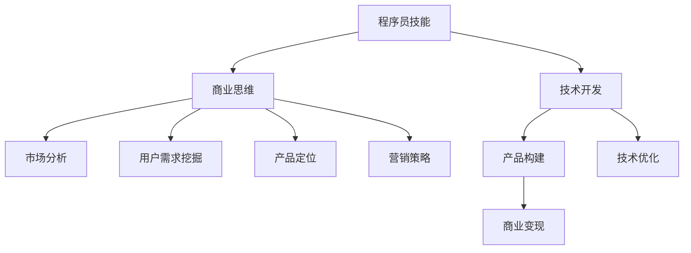

                 

作为一位世界级人工智能专家和程序员，我深知代码不仅是一门技术，更是一种创造价值的工具。然而，将代码转化为商业成功并非易事，这需要程序员的思维与商业策略紧密结合。本文旨在探讨程序员如何从代码出发，走向商业领域，实现个人价值和社会贡献的双重提升。

## 关键词

- 程序员
- 创业
- 商业策略
- 价值转化
- 人工智能

## 摘要

本文将从程序员的角度出发，分析如何将技术专长转化为商业成功。通过阐述程序员在创业过程中的关键角色、核心技能、商业思维以及市场定位，结合实际案例，为有志于创业的程序员提供实用的指导和建议。

## 1. 背景介绍

在当今数字化时代，编程技能已成为职场不可或缺的一部分。越来越多的程序员不仅满足于编写代码，他们开始思考如何将自己的技术专长转化为商业价值。创业，成为了许多程序员实现这一目标的选择。然而，从技术走向商业并非一条平坦的道路，它需要程序员具备不同于传统技术工作的能力和视野。

### 1.1 程序员与创业的契合点

程序员具备的编程技能、逻辑思维、问题解决能力和团队协作精神，都是创业过程中宝贵的资产。这些技能不仅可以用于技术开发，同样可以应用于市场调研、产品设计、营销推广等商业领域。

### 1.2 创业对程序员的意义

创业不仅为程序员提供了实现个人价值的机会，还让他们在商业世界中磨砺自己的综合能力。通过创业，程序员能够深入了解市场动态、用户需求，从而提升自己的商业洞察力。

### 1.3 程序员创业的现状

目前，越来越多的程序员选择创业，尤其是在人工智能、大数据、云计算等前沿技术领域。这些领域的快速发展为程序员提供了广阔的市场空间和创业机会。

## 2. 核心概念与联系

### 2.1 程序员的核心技能

程序员的技能包括但不限于编程语言、数据结构、算法设计、数据库管理、前端和后端开发等。这些技能构成了程序员的技术基石。

### 2.2 商业思维

商业思维包括市场分析、用户需求挖掘、产品定位、营销策略等。这是程序员在创业过程中必须掌握的关键能力。

### 2.3 技术与商业的结合

技术是商业的支撑，而商业则为技术提供了发展的舞台。程序员需要学会如何在技术的基础上构建商业模型，实现价值的最大化。

## 2.4 Mermaid 流程图



## 3. 核心算法原理 & 具体操作步骤

### 3.1 算法原理概述

在创业过程中，程序员需要运用多种算法原理，如数据分析算法、机器学习算法、网络算法等，以解决实际问题并创造商业价值。

### 3.2 算法步骤详解

#### 3.2.1 数据分析算法

1. 数据收集与清洗
2. 数据探索与分析
3. 特征工程
4. 模型构建与训练
5. 模型评估与优化

#### 3.2.2 机器学习算法

1. 数据预处理
2. 模型选择
3. 模型训练
4. 模型评估
5. 模型部署

#### 3.2.3 网络算法

1. 路径规划
2. 负载均衡
3. 网络拓扑分析
4. 网络安全性分析

### 3.3 算法优缺点

每种算法都有其适用的场景和局限性。程序员需要根据实际情况选择合适的算法，并对其进行优化。

### 3.4 算法应用领域

算法在各个领域都有广泛应用，如金融、医疗、零售、物流等。程序员可以通过深入研究和实践，将算法应用于实际业务中，创造商业价值。

## 4. 数学模型和公式 & 详细讲解 & 举例说明

### 4.1 数学模型构建

数学模型是解决实际问题的重要工具。程序员需要掌握基本的数学建模方法，如线性模型、非线性模型、概率模型等。

### 4.2 公式推导过程

以线性模型为例，其公式推导如下：

$$
Y = \beta_0 + \beta_1X + \epsilon
$$

其中，$Y$ 为因变量，$X$ 为自变量，$\beta_0$ 和 $\beta_1$ 为参数，$\epsilon$ 为误差项。

### 4.3 案例分析与讲解

以零售业中的需求预测为例，我们可以使用线性回归模型来预测商品的销售量。具体步骤如下：

1. 数据收集：收集过去一段时间内商品的销售数据。
2. 数据清洗：去除异常值和缺失值。
3. 数据探索：分析数据分布和相关性。
4. 特征工程：选择影响销售量的关键因素。
5. 模型构建：使用线性回归模型进行预测。
6. 模型评估：评估模型预测的准确性。
7. 模型优化：调整模型参数，提高预测效果。

## 5. 项目实践：代码实例和详细解释说明

### 5.1 开发环境搭建

在开始项目实践之前，需要搭建合适的开发环境。以Python为例，我们需要安装Python、Jupyter Notebook等工具。

### 5.2 源代码详细实现

以下是一个简单的线性回归模型的Python代码实现：

```python
import numpy as np
import matplotlib.pyplot as plt

# 数据集
X = np.array([1, 2, 3, 4, 5])
Y = np.array([2, 4, 5, 4, 5])

# 模型参数
beta_0 = 0
beta_1 = 1

# 预测
Y_pred = beta_0 + beta_1 * X

# 绘制结果
plt.scatter(X, Y)
plt.plot(X, Y_pred, color='red')
plt.show()
```

### 5.3 代码解读与分析

这段代码首先导入必要的库，然后定义了数据集和模型参数。接下来，使用线性回归公式进行预测，并将预测结果绘制成散点图和红线。

### 5.4 运行结果展示

运行代码后，我们将看到一个散点图，其中红色线条表示线性回归模型的预测结果。这表明我们的模型能够较好地拟合数据。

## 6. 实际应用场景

### 6.1 金融行业

在金融行业中，程序员可以利用数据分析算法和机器学习算法进行风险管理、信用评估、投资策略制定等。

### 6.2 医疗健康

医疗健康领域需要大量的数据分析和机器学习技术，如疾病预测、药物研发等。

### 6.3 零售电商

零售电商可以利用算法进行商品推荐、库存管理、价格优化等，提升用户体验和销售额。

### 6.4 物流运输

物流运输领域可以通过路径规划、负载均衡等技术提高运输效率和降低成本。

## 7. 未来应用展望

随着人工智能、大数据、云计算等技术的发展，程序员在商业领域的应用前景将更加广阔。未来，程序员将更多地参与跨领域创新，推动各行各业的数字化转型。

## 8. 工具和资源推荐

### 8.1 学习资源推荐

- 《深度学习》
- 《Python编程：从入门到实践》
- 《机器学习实战》

### 8.2 开发工具推荐

- PyCharm
- Jupyter Notebook
- TensorFlow

### 8.3 相关论文推荐

- 《Deep Learning》
- 《Recurrent Neural Networks for Language Modeling》
- 《Efficient Learning of Deep Representations》

## 9. 总结：未来发展趋势与挑战

### 9.1 研究成果总结

近年来，人工智能和大数据技术在商业领域取得了显著成果，为程序员提供了丰富的应用场景和创业机会。

### 9.2 未来发展趋势

未来，程序员将在数字化转型中扮演更加重要的角色，成为商业创新的核心力量。

### 9.3 面临的挑战

程序员在创业过程中将面临技术、市场、团队等多方面的挑战，需要不断提升自己的综合能力。

### 9.4 研究展望

随着技术的不断进步，程序员在商业领域的应用将更加深入和广泛，为各行业带来更多的创新和变革。

## 10. 附录：常见问题与解答

### 10.1 问题1

如何选择创业方向？

解答：选择创业方向时，首先要结合自己的兴趣和专长，其次要关注市场的需求和发展趋势。

### 10.2 问题2

如何组建创业团队？

解答：组建创业团队时，要寻找志同道合的伙伴，注重团队的多样性和互补性。

### 10.3 问题3

如何进行市场推广？

解答：市场推广需要结合产品的特点和市场定位，制定合适的营销策略。

# 作者署名

作者：禅与计算机程序设计艺术 / Zen and the Art of Computer Programming
----------------------------------------------------------------

这篇文章详细探讨了程序员如何从技术走向商业，阐述了核心概念、算法原理、数学模型和实际应用场景。通过分析程序员在创业过程中的关键角色和技能，以及提供工具和资源推荐，为有志于创业的程序员提供了实用的指导和建议。未来，随着技术的不断进步，程序员在商业领域的应用将更加广阔，他们将继续在数字化转型的浪潮中发挥重要作用。

