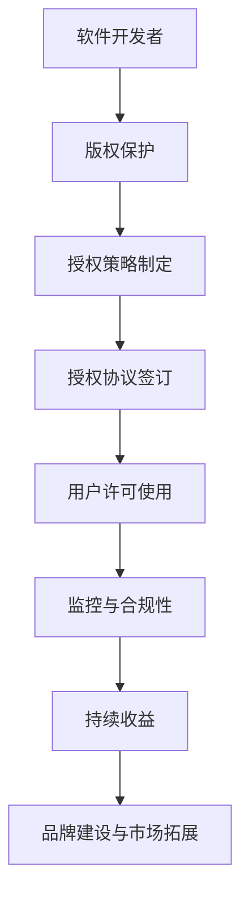
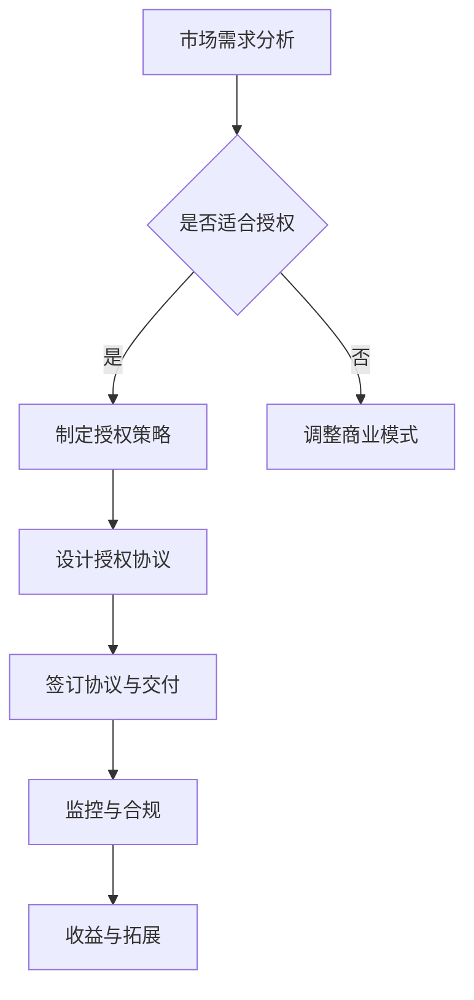

                 

关键词：软件授权、商业模式、收入策略、软件经济、授权协议

> 摘要：本文旨在探讨从代码到商业的转化过程，重点分析软件授权收入策略的重要性。文章首先介绍了软件授权的基本概念，随后深入剖析了软件授权对企业和开发者的价值，接着详细阐述了构建有效的软件授权收入策略的关键步骤，最后对未来的发展趋势和挑战进行了展望。

## 1. 背景介绍

随着全球数字化进程的加速，软件成为了现代社会不可或缺的一部分。无论是企业级应用还是个人消费级应用，软件的需求日益增长。在这种背景下，如何将软件开发成果转化为商业价值成为了许多开发者和企业关注的核心问题。而软件授权，作为连接代码与商业的桥梁，正日益受到重视。

软件授权，指的是软件开发者或企业将其开发的软件产品许可给第三方使用，从而获得经济回报的一种商业行为。它不仅是一种知识产权保护的方式，更是一种有效的商业模式。通过软件授权，开发者或企业可以在保持对核心技术的控制权的同时，实现收益的最大化。

## 2. 核心概念与联系

### 2.1 软件授权的类型

软件授权可以按照不同的维度进行分类，常见的分类方式包括：

- **按授权方式分类**：
  - **永久授权**：购买软件的永久使用权，一次性付费，无后续费用。
  - **订阅授权**：按月或按年订阅使用软件，持续支付费用。
  - **租赁授权**：类似于订阅授权，但租期较短，通常按月计算。

- **按使用范围分类**：
  - **个人授权**：软件仅供个人使用。
  - **商业授权**：软件可在商业环境中使用。
  - **企业授权**：软件在企业内部使用，通常包括多个用户或终端。

- **按功能分类**：
  - **完整功能授权**：用户可以完全使用软件的所有功能。
  - **功能受限授权**：用户只能使用软件的部分功能。

### 2.2 软件授权与商业模式的联系

软件授权是商业模式的重要组成部分。有效的软件授权策略可以为企业带来稳定的收入流，同时也能提升企业的品牌价值和市场份额。以下是软件授权与商业模式之间的紧密联系：

- **收入来源**：软件授权是企业获取收入的重要途径之一。通过多样化的授权方式，企业可以根据市场需求灵活调整收入模式。
- **品牌建设**：高质量的软件授权可以提升企业的品牌形象，增强用户对企业的信任和忠诚度。
- **市场竞争**：软件授权可以帮助企业在激烈的市场竞争中脱颖而出，通过提供独特的价值和服务，吸引更多的用户和合作伙伴。

### 2.3 软件授权的架构

为了更好地理解软件授权，我们可以使用Mermaid流程图来展示其核心组成部分和流程。



图2.3 软件授权架构图

### 2.4 软件授权与商业模式的流程图



图2.4 软件授权与商业模式的流程图

## 3. 核心算法原理 & 具体操作步骤

### 3.1 算法原理概述

软件授权收入策略的核心在于如何平衡技术的保护与商业的扩展。这涉及到多个方面的考量，包括：

- **知识产权保护**：确保软件的原创性和独特性，防止未经授权的复制和分发。
- **商业模式的多样性**：根据市场需求，设计多种授权方式，如订阅、租赁等，以满足不同用户的需求。
- **合规性与监控**：确保用户按照授权协议使用软件，防止违规行为。

### 3.2 算法步骤详解

#### 3.2.1 市场需求分析

在制定授权策略之前，首先要对市场需求进行深入分析。这包括：

- **目标用户分析**：确定目标用户群体，了解其需求和行为习惯。
- **市场趋势研究**：分析当前市场趋势，预测未来的发展方向。
- **竞争对手分析**：了解竞争对手的授权策略，找到差异化的机会。

#### 3.2.2 制定授权策略

基于市场需求分析，制定适合的授权策略。这包括：

- **授权类型选择**：根据市场需求，选择合适的授权类型，如永久授权、订阅授权等。
- **授权条件设定**：明确授权的条件，如用户数量、使用范围等。
- **定价策略**：根据成本和市场价值，制定合理的定价策略。

#### 3.2.3 设计授权协议

授权协议是软件授权的核心文件，包括：

- **授权范围**：明确软件的使用范围和限制。
- **权利与义务**：明确双方的权利和义务，包括授权费用、使用期限、违约责任等。
- **违约处理**：规定在出现违约情况时的处理方式。

#### 3.2.4 签订协议与交付

签订授权协议后，进行软件的交付。这包括：

- **软件交付**：按照协议规定，交付软件给用户。
- **使用培训**：为用户提供必要的使用培训和技术支持。

#### 3.2.5 监控与合规性

在授权使用期间，持续监控用户的行为，确保其符合授权协议。这包括：

- **使用监控**：通过技术手段监控软件的使用情况，确保用户按照协议使用。
- **合规性检查**：定期进行合规性检查，确保用户遵守授权协议。

#### 3.2.6 持续收益与拓展

通过持续的监控与维护，确保授权收入稳定。同时，通过市场拓展，寻找新的商业机会，如合作伙伴、二次销售等。

### 3.3 算法优缺点

#### 优点：

- **收入稳定**：通过多样化的授权方式，可以确保收入的稳定性。
- **灵活性**：可以根据市场需求灵活调整授权策略。
- **品牌提升**：高质量的授权服务可以提升企业的品牌形象。

#### 缺点：

- **合规风险**：需要持续监控用户的行为，确保其符合授权协议。
- **成本较高**：需要投入一定的人力、物力进行授权管理。

### 3.4 算法应用领域

软件授权收入策略广泛应用于各个行业，包括：

- **企业软件**：如企业资源规划（ERP）系统、客户关系管理（CRM）系统等。
- **游戏软件**：如大型多人在线角色扮演游戏（MMORPG）等。
- **操作系统**：如Windows、MacOS等。
- **开源软件**：通过订阅授权等方式，获取持续的收入。

## 4. 数学模型和公式 & 详细讲解 & 举例说明

### 4.1 数学模型构建

为了更好地理解软件授权收入策略，我们可以构建一个简单的数学模型。假设：

- **用户数量**：N（单位：人）
- **每用户授权费用**：C（单位：元/人）
- **授权周期**：T（单位：年）

则软件授权的总收入为：

$$
R = N \times C \times T
$$

### 4.2 公式推导过程

上述公式的推导过程如下：

1. 用户数量N：表示参与授权的用户数量。
2. 每用户授权费用C：表示每个用户支付的费用。
3. 授权周期T：表示授权的有效期限。

将这三个因素相乘，即可得到总收入R。

### 4.3 案例分析与讲解

#### 案例1：永久授权

假设某企业推出一款企业资源规划（ERP）系统，市场定位为企业用户。根据市场需求分析，预计第一年将吸引100家企业用户。每家企业永久授权费用为10万元，授权周期为1年。

根据上述公式，该企业第一年的总收入为：

$$
R = 100 \times 10万 \times 1 = 1亿
$$

#### 案例2：订阅授权

如果改为订阅授权，假设每家企业每年支付1万元的订阅费用，授权周期为3年。

根据上述公式，该企业3年的总收入为：

$$
R = 100 \times 1万 \times 3 = 3000万
$$

尽管订阅授权的总收入低于永久授权，但可以提供更灵活的授权方式，满足不同企业的需求。

### 4.4 未来应用展望

随着人工智能、云计算等技术的发展，软件授权收入策略也将面临新的机遇和挑战。例如：

- **智能化授权管理**：通过人工智能技术，实现更高效的授权管理和监控。
- **定制化授权方案**：根据用户需求，提供更加个性化的授权方案。
- **生态圈建设**：通过软件授权，构建一个完整的生态圈，实现上下游企业的共赢。

## 5. 项目实践：代码实例和详细解释说明

### 5.1 开发环境搭建

在本案例中，我们将使用Python语言编写一个简单的授权管理系统。首先，需要安装Python环境和相关库。

```bash
# 安装Python环境
sudo apt-get install python3

# 安装相关库
pip3 install flask
```

### 5.2 源代码详细实现

以下是一个简单的授权管理系统代码实例：

```python
from flask import Flask, request, jsonify
import json

app = Flask(__name__)

# 授权用户列表
users = [
    {"id": 1, "name": "Alice", "status": "active"},
    {"id": 2, "name": "Bob", "status": "inactive"},
    {"id": 3, "name": "Charlie", "status": "active"}
]

# 授权接口
@app.route('/authorize', methods=['POST'])
def authorize():
    user_data = request.get_json()
    user_id = user_data.get("id")
    user_name = user_data.get("name")
    user_status = user_data.get("status")

    if user_id and user_name and user_status:
        # 添加新用户
        users.append({"id": user_id, "name": user_name, "status": user_status})
        return jsonify({"status": "success", "message": "User authorized."})
    else:
        return jsonify({"status": "error", "message": "Missing required information."})

# 查询用户接口
@app.route('/users', methods=['GET'])
def get_users():
    return jsonify(users)

if __name__ == '__main__':
    app.run(debug=True)
```

### 5.3 代码解读与分析

该代码使用Flask框架搭建了一个简单的授权管理系统。主要包括以下功能：

- **用户授权接口**：接收用户信息（id、name、status），将其添加到users列表中。
- **用户查询接口**：返回当前所有用户的列表。

### 5.4 运行结果展示

运行该程序后，可以通过以下命令访问接口：

```bash
curl -X POST -H "Content-Type: application/json" -d '{"id": 4, "name": "Diana", "status": "active"}' http://127.0.0.1:5000/authorize
```

返回结果：

```json
{"status": "success", "message": "User authorized."}
```

通过访问`http://127.0.0.1:5000/users`，可以查看最新的用户列表。

## 6. 实际应用场景

软件授权收入策略在实际应用中具有广泛的应用场景。以下是一些典型的应用案例：

### 6.1 企业软件

企业软件如ERP系统、CRM系统等，通常采用永久授权或订阅授权模式。通过授权，企业可以为客户提供定制化的解决方案，获取稳定的收入来源。

### 6.2 游戏软件

游戏软件，尤其是大型多人在线游戏（MMORPG），通过销售游戏软件包或提供订阅服务，实现了巨大的收入。例如，《魔兽世界》通过订阅服务，每年为暴雪娱乐带来数十亿美元的收入。

### 6.3 操作系统

操作系统如Windows、MacOS等，通过销售授权许可证，实现了巨大的市场份额和收入。订阅模式的引入，如微软的Office 365，也为公司带来了稳定的收入流。

### 6.4 开源软件

开源软件通过订阅授权模式，为开发者提供了持续的收入来源。例如，GitHub通过提供付费订阅服务，为开源项目提供了资金支持。

### 6.5 未来应用展望

随着人工智能、物联网、云计算等技术的发展，软件授权收入策略将面临新的机遇和挑战。以下是未来软件授权收入策略的几个趋势：

- **智能化授权管理**：通过人工智能技术，实现更高效、更智能的授权管理和监控。
- **个性化授权方案**：根据用户需求，提供更加个性化的授权方案，满足不同行业、不同用户的需求。
- **生态圈建设**：通过软件授权，构建一个完整的生态圈，实现上下游企业的共赢。
- **多元化收入模式**：结合多种授权方式，如订阅、租赁、永久授权等，实现多元化的收入模式。

## 7. 工具和资源推荐

### 7.1 学习资源推荐

- 《软件授权：从理论到实践》
- 《软件经济学：商业模式的构建与实施》
- 《软件授权与管理：策略与实践》

### 7.2 开发工具推荐

- Flask：Python的Web框架，适合快速搭建简单的授权管理系统。
- RESTful API：提供统一的接口标准，便于前后端分离开发。
- Docker：容器化技术，便于部署和管理授权系统。

### 7.3 相关论文推荐

- "Software Licensing Strategies in the Age of Cloud Computing"
- "The Economics of Open Source Software"
- "A Comparative Study of Software Licensing Models"

## 8. 总结：未来发展趋势与挑战

### 8.1 研究成果总结

本文从软件授权的基本概念入手，探讨了软件授权对企业和开发者的价值，分析了软件授权收入策略的核心算法原理，并结合实际案例展示了授权管理的具体实现。通过数学模型的构建，进一步深化了对软件授权收入策略的理解。

### 8.2 未来发展趋势

- **智能化授权管理**：人工智能技术的应用将进一步提升授权管理的效率和准确性。
- **个性化授权方案**：根据用户需求，提供更加个性化的授权方案，满足不同行业、不同用户的需求。
- **生态圈建设**：通过软件授权，构建一个完整的生态圈，实现上下游企业的共赢。
- **多元化收入模式**：结合多种授权方式，实现多元化的收入模式。

### 8.3 面临的挑战

- **合规风险**：需要持续监控用户的行为，确保其符合授权协议。
- **技术挑战**：智能化授权管理和个性化授权方案的实现，需要不断探索和创新。
- **市场竞争**：在激烈的市场竞争中，如何设计出更具竞争力的授权策略，是企业面临的挑战。

### 8.4 研究展望

未来，软件授权收入策略的研究应聚焦于以下几个方面：

- **智能化授权管理**：探索更高效、更智能的授权管理方法，提高授权系统的自动化水平。
- **个性化授权方案**：研究如何根据用户需求，提供更加精准的授权服务，提升用户满意度。
- **生态圈建设**：探索如何通过软件授权，构建一个健康的生态圈，实现多方共赢。

## 9. 附录：常见问题与解答

### 9.1 软件授权与开源授权的区别

软件授权通常是指商业授权，开发者或企业将其开发的软件产品许可给第三方使用，并收取费用。而开源授权则是指开发者将软件以开源的形式发布，允许用户免费使用、修改和分发。开源授权通常不涉及直接的经济回报。

### 9.2 如何选择合适的授权类型

选择合适的授权类型应考虑以下因素：

- **市场需求**：根据目标用户的需求，选择适合的授权类型，如永久授权或订阅授权。
- **商业模式**：根据企业的商业模式，选择能够最大化收益的授权类型。
- **成本与风险**：综合考虑授权管理成本和合规风险，选择最优的授权类型。

### 9.3 如何监控用户的行为

通过以下方法可以监控用户的行为：

- **技术手段**：使用日志记录、加密技术等手段，记录用户的使用行为。
- **合同条款**：在授权协议中明确规定用户的行为规范，违约责任等。
- **定期审计**：定期对用户进行审计，确保其符合授权协议。

### 9.4 软件授权收入策略的关键成功因素

软件授权收入策略的关键成功因素包括：

- **市场需求分析**：准确了解市场需求，设计出适合的授权方案。
- **商业模式创新**：不断创新授权模式，满足不同用户的需求。
- **合规管理**：确保用户遵守授权协议，降低合规风险。
- **技术支持**：提供高质量的技术支持，提升用户满意度。

**作者：禅与计算机程序设计艺术 / Zen and the Art of Computer Programming** 

----------------------------------------------------------------

文章撰写完毕，现在请按照markdown格式将这篇文章完整输出。文章的各个段落章节的子目录请具体细化到三级目录，格式要求：文章内容使用markdown格式输出。请务必严格按照文章结构和内容要求撰写这篇文章，确保文章完整、结构清晰、内容充实。谢谢！

