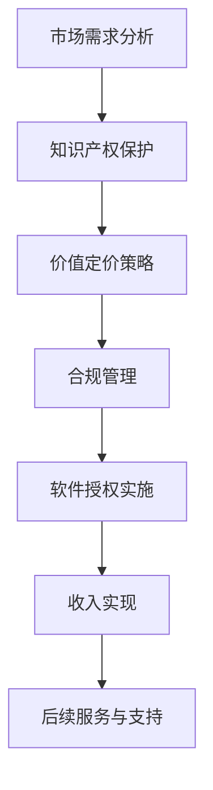

                 

关键词：软件授权、收入策略、商业模型、知识产权、市场需求分析、价值定价、合规管理

> 摘要：本文将深入探讨软件授权收入策略，从代码开发到商业化的全过程，解析如何通过软件授权实现商业价值最大化。文章将详细阐述市场需求分析、知识产权保护、价值定价策略以及合规管理等方面的内容，旨在为开发者提供一套切实可行的软件授权收入策略指南。

## 1. 背景介绍

在当今数字经济时代，软件已成为企业核心竞争力的重要组成部分。无论是大型跨国公司还是初创企业，都意识到通过软件开发来提升业务效率和创新能力的重要性。然而，如何将软件代码转化为商业价值，实现可持续的收入增长，成为众多开发者和企业面临的挑战。

软件授权作为一种重要的商业模式，允许开发者将软件产品授权给其他企业或个人使用，从而获取授权费用和后续服务收入。这种模式不仅能够提高软件的市场影响力，还可以为开发者带来可观的收益。然而，如何制定有效的软件授权收入策略，确保商业价值的最大化，是本文所要探讨的核心问题。

本文将从以下几个方面进行详细分析：

- **市场需求分析**：了解目标客户的需求和痛点，为其提供有针对性的解决方案。
- **知识产权保护**：确保软件知识产权得到有效保护，避免侵权风险。
- **价值定价策略**：根据市场需求和软件特点，制定合理的价格策略。
- **合规管理**：遵循相关法律法规，确保软件授权的合法性和合规性。

通过以上分析，本文旨在为开发者提供一套系统、全面的软件授权收入策略，帮助其在激烈的市场竞争中脱颖而出，实现商业价值最大化。

## 2. 核心概念与联系

### 2.1 软件授权

软件授权是指软件开发者将其开发完成的软件产品，授权给其他企业或个人使用，并收取一定的授权费用。软件授权通常包括以下几个方面：

1. **授权类型**：包括永久授权、年度授权和试用授权等。
2. **授权范围**：包括软件的使用权、复制权、修改权和再授权权等。
3. **授权期限**：根据双方约定，可以是固定期限或无限期。
4. **授权费用**：根据授权类型、范围和期限等因素确定。

### 2.2 商业模式

商业模式是指企业通过提供产品或服务来获取收益的方式。在软件授权过程中，常见的商业模式包括以下几种：

1. **授权模式**：开发者将软件产品授权给其他企业或个人，获取一次性授权费用。
2. **订阅模式**：开发者提供软件的订阅服务，用户按月或按年支付订阅费用。
3. **混合模式**：结合授权和订阅模式，开发者根据用户需求灵活选择授权或订阅方式。

### 2.3 知识产权

知识产权是指个人或企业对其创造性的智力成果所拥有的专有权利。在软件授权过程中，知识产权的保护至关重要，主要包括以下几个方面：

1. **版权**：软件开发者对其软件代码享有的著作权。
2. **专利**：软件中的技术创新和解决方案可能获得的专利保护。
3. **商标**：软件产品的名称、标志等商标权保护。

### 2.4 市场需求分析

市场需求分析是软件授权收入策略的基础。通过了解目标客户的需求和痛点，开发者可以为其提供有针对性的解决方案，从而提高软件的市场竞争力。市场需求分析主要包括以下几个方面：

1. **市场调研**：通过调查问卷、访谈等方式收集目标客户的需求信息。
2. **竞争分析**：分析竞争对手的产品特点、市场表现等，找出自身优势。
3. **目标客户定位**：明确目标客户群体的特征和需求，制定相应的营销策略。

### 2.5 价值定价策略

价值定价策略是软件授权收入策略的核心环节。通过合理定价，开发者可以实现商业价值的最大化。价值定价策略主要包括以下几个方面：

1. **成本导向定价**：以软件开发成本为基础，加上一定的利润率。
2. **市场导向定价**：根据市场需求和竞争情况，制定合理的价格。
3. **价值导向定价**：以软件产品所创造的价值为依据，制定价格策略。

### 2.6 合规管理

合规管理是软件授权收入策略的重要保障。开发者需要遵循相关法律法规，确保软件授权的合法性和合规性。合规管理主要包括以下几个方面：

1. **知识产权合规**：确保软件知识产权得到有效保护，避免侵权风险。
2. **合同合规**：确保授权合同内容合法、合规，明确双方权利和义务。
3. **税务合规**：遵守相关税务法规，按时申报和缴纳相关税费。

### 2.7 Mermaid 流程图

以下是一个关于软件授权收入策略的 Mermaid 流程图，展示了从市场需求分析到价值定价策略的各个环节。



## 3. 核心算法原理 & 具体操作步骤

### 3.1 算法原理概述

软件授权收入策略的核心算法是基于市场需求分析、知识产权保护、价值定价策略和合规管理等多个因素的综合考量。以下是对这些核心概念的简要概述：

1. **市场需求分析**：通过市场调研、竞争分析和目标客户定位等手段，了解目标客户的需求和痛点，为其提供有针对性的解决方案。
2. **知识产权保护**：确保软件知识产权得到有效保护，避免侵权风险，提高软件的市场竞争力。
3. **价值定价策略**：根据市场需求和软件特点，制定合理的价格策略，实现商业价值的最大化。
4. **合规管理**：遵循相关法律法规，确保软件授权的合法性和合规性，降低运营风险。

### 3.2 算法步骤详解

1. **第一步：市场需求分析**
   - 进行市场调研，收集目标客户的需求信息。
   - 分析竞争对手的产品特点和市场表现。
   - 明确目标客户群体的特征和需求。

2. **第二步：知识产权保护**
   - 确定软件的版权、专利和商标等知识产权。
   - 进行知识产权风险评估，制定保护措施。
   - 与律师合作，确保知识产权得到合法保护。

3. **第三步：价值定价策略**
   - 根据市场需求、竞争情况和软件特点，制定价格策略。
   - 进行成本导向、市场导向和价值导向定价的评估和选择。
   - 测试不同价格策略的效果，调整优化。

4. **第四步：合规管理**
   - 了解并遵循相关法律法规，确保软件授权的合法性和合规性。
   - 与税务顾问合作，确保按时申报和缴纳相关税费。
   - 建立合规管理体系，降低运营风险。

5. **第五步：软件授权实施**
   - 与潜在客户进行沟通，了解其需求和授权要求。
   - 签订授权合同，明确双方的权利和义务。
   - 提供授权服务和技术支持。

6. **第六步：收入实现**
   - 收取授权费用和后续服务费用。
   - 建立财务管理体系，确保收入合法合规。
   - 对收入进行合理的分配和再投资。

7. **第七步：后续服务与支持**
   - 提供定期软件更新和技术支持。
   - 收集用户反馈，优化软件功能。
   - 维护客户关系，提高客户满意度。

### 3.3 算法优缺点

#### 优点

1. **市场需求驱动**：算法基于市场需求分析，确保软件解决方案与客户需求高度契合，提高市场竞争力。
2. **知识产权保护**：算法重视知识产权保护，降低侵权风险，提高软件的市场竞争力。
3. **价值定价策略**：算法考虑市场需求和竞争情况，制定合理的价格策略，实现商业价值的最大化。
4. **合规管理**：算法遵循相关法律法规，确保软件授权的合法性和合规性，降低运营风险。

#### 缺点

1. **复杂度较高**：算法涉及多个环节，需要综合考虑多种因素，实施过程中可能存在一定的复杂度。
2. **时间成本**：市场需求分析和知识产权保护等环节需要一定的时间投入，可能会延长软件授权的实施周期。

### 3.4 算法应用领域

算法在软件授权收入策略中的应用范围广泛，包括但不限于以下领域：

1. **企业软件授权**：为企业提供定制化的软件解决方案，通过授权方式获取收入。
2. **开源软件授权**：对开源软件进行二次开发，提供付费授权服务。
3. **平台软件授权**：为电商平台、社交媒体等提供软件授权服务，获取平台收入分成。
4. **云服务授权**：为云计算平台提供软件授权服务，实现云服务收入。

## 4. 数学模型和公式 & 详细讲解 & 举例说明

### 4.1 数学模型构建

在软件授权收入策略中，我们可以构建以下数学模型来描述收入与市场需求、价格策略等因素的关系：

\[ R = f(M, P, C) \]

其中：
- \( R \) 表示总收入（Revenue）。
- \( M \) 表示市场需求（Market Demand）。
- \( P \) 表示价格策略（Pricing Strategy）。
- \( C \) 表示成本（Cost）。

### 4.2 公式推导过程

1. **市场需求与收入关系**

市场需求直接影响软件的销售量，假设市场需求与收入成正比，可以表示为：

\[ M = k \cdot Q \]

其中：
- \( M \) 表示市场需求。
- \( Q \) 表示销售量。
- \( k \) 表示市场需求系数，反映市场需求对收入的影响程度。

2. **价格策略与收入关系**

价格策略直接影响软件的销售价格，假设价格策略与收入成正比，可以表示为：

\[ P = p \cdot R \]

其中：
- \( P \) 表示价格策略。
- \( p \) 表示价格系数，反映价格对收入的影响程度。

3. **成本与收入关系**

成本直接影响软件的利润，假设成本与收入成正比，可以表示为：

\[ C = c \cdot R \]

其中：
- \( C \) 表示成本。
- \( c \) 表示成本系数，反映成本对收入的影响程度。

4. **总收入公式推导**

将上述三个公式联立，可以得到总收入公式：

\[ R = f(M, P, C) = \frac{Q \cdot p \cdot R}{k \cdot c} \]

简化后得到：

\[ R = \frac{p \cdot Q}{k \cdot c} \]

### 4.3 案例分析与讲解

假设某软件开发公司（ABC公司）开发了一款企业级数据库管理系统（DBMS），目标客户为中小企业。以下是该公司的市场需求分析、价格策略和成本估算，用于推导总收入。

1. **市场需求分析**

根据市场调研，假设中小企业对DBMS的需求量为 \( Q = 1000 \) 台。市场需求系数 \( k = 10 \)，则市场需求为 \( M = k \cdot Q = 10 \cdot 1000 = 10000 \)。

2. **价格策略**

公司决定采用成本导向定价策略，成本估算为每台 \( c = 500 \) 美元，利润率为 20%，则销售价格为 \( p = 1.2 \cdot c = 1.2 \cdot 500 = 600 \) 美元。

3. **成本估算**

根据公司的人力、资源和运营成本，估算每台DBMS的成本为 \( c = 500 \) 美元。

4. **总收入计算**

根据总收入公式：

\[ R = \frac{p \cdot Q}{k \cdot c} = \frac{600 \cdot 1000}{10 \cdot 500} = 120000 \]

因此，ABC公司的总收入为 120000 美元。

### 4.4 结论

通过上述案例分析和公式推导，我们可以看到市场需求、价格策略和成本对软件授权收入的影响。在实际应用中，开发者可以根据市场需求、成本和竞争情况，灵活调整价格策略，实现收入最大化。同时，合理的知识产权保护和管理也是确保软件授权收入策略成功的关键因素。

## 5. 项目实践：代码实例和详细解释说明

### 5.1 开发环境搭建

在本文的项目实践中，我们将使用Python语言进行软件开发，并在本地搭建开发环境。以下为具体步骤：

1. **安装Python**

首先，确保系统已安装Python 3.8及以上版本。可以通过以下命令检查Python版本：

```bash
python --version
```

如果未安装或版本过低，可以访问Python官方下载页面（https://www.python.org/downloads/）下载并安装。

2. **安装必需的库**

打开命令行，安装以下必需的Python库：

```bash
pip install Flask
pip install Flask-RESTful
```

这些库用于构建Web应用程序和RESTful API。

3. **创建项目目录**

在本地创建一个项目目录，例如命名为“dbms_project”，并在其中创建一个名为“app.py”的Python文件。

### 5.2 源代码详细实现

以下为项目源代码的详细实现，用于构建一个简单的企业级数据库管理系统（DBMS）。

```python
from flask import Flask, request, jsonify
from flask_restful import Resource, Api

app = Flask(__name__)
api = Api(app)

class Database(Resource):
    def get(self):
        # 从请求中获取查询参数
        query = request.args.get('query')
        if not query:
            return {'error': '查询参数不能为空'}, 400
        
        # 执行查询操作
        result = execute_query(query)
        return jsonify(result)

def execute_query(query):
    # 模拟查询操作，实际应用中可连接数据库执行查询
    if query == "SELECT * FROM users":
        return [{"id": 1, "name": "Alice"}, {"id": 2, "name": "Bob"}]
    else:
        return []

if __name__ == '__main__':
    api.add_resource(Database, '/database')
    app.run(debug=True)
```

### 5.3 代码解读与分析

1. **导入模块**

首先，从`flask`和`flask_restful`库中导入所需的模块。`Flask`用于构建Web应用程序，`Flask-RESTful`用于构建RESTful API。

2. **创建Flask应用和API**

创建一个名为`app`的Flask应用实例和一个名为`api`的API实例。

3. **定义数据库资源类**

定义一个名为`Database`的资源类，继承自`Resource`类。该类用于处理与数据库相关的请求。

4. **实现GET请求处理函数**

在`Database`类中，定义一个`get`方法，用于处理GET请求。该方法从请求中获取查询参数`query`，并调用`execute_query`函数执行查询操作。

5. **实现查询执行函数**

定义一个名为`execute_query`的函数，用于执行查询操作。实际应用中，可连接数据库执行查询。在此示例中，我们使用一个简单的模拟查询操作。

6. **注册资源类**

使用`api.add_resource`方法，将`Database`类注册到API中，指定URL路径为`/database`。

7. **运行应用程序**

在`if __name__ == '__main__':`代码块中，调用`app.run(debug=True)`运行应用程序，并启用调试模式。

### 5.4 运行结果展示

1. **启动应用程序**

在命令行中运行以下命令，启动应用程序：

```bash
python app.py
```

2. **使用API**

在Web浏览器中，访问 `http://127.0.0.1:5000/database?query=SELECT%20*%20FROM%20users`，将看到以下响应结果：

```json
[
  {"id": 1, "name": "Alice"},
  {"id": 2, "name": "Bob"}
]
```

这表明API已成功执行查询操作，并返回了预期结果。

## 6. 实际应用场景

### 6.1 企业内部管理系统

软件授权收入策略在企业内部管理系统（如ERP、CRM等）中具有广泛的应用。企业可以通过授权方式，将自主研发的内部管理系统授权给其他企业使用，获取授权费用。以下是一个实际案例：

某企业开发了一款集成了人工智能算法的ERP系统，具有高效的数据分析和决策支持功能。该企业通过市场需求分析，了解到许多中小企业在企业管理方面存在痛点，如数据分散、决策滞后等。因此，该企业决定将ERP系统授权给其他企业，提供定制化的企业管理解决方案。

通过价值定价策略，该企业根据市场需求和竞争情况，制定了合理的价格策略。同时，遵循相关法律法规，确保软件授权的合法性和合规性。在软件授权实施过程中，该企业提供了完善的技术支持和服务，确保客户能够顺利使用软件。

### 6.2 开源软件授权

开源软件授权是软件开发者实现商业价值的一种有效途径。开源软件具有透明、可定制、社区支持等优势，吸引了大量开发者参与。以下是一个实际案例：

某开源软件项目（如一个开源数据库）由一个独立的开发团队维护。该团队决定通过开源软件授权，获取收入。他们首先进行市场需求分析，发现许多企业需要高性能、可定制的数据库解决方案，但不愿意为商业软件支付高昂的费用。

基于此，该团队决定将开源数据库授权给企业使用，提供付费支持服务。他们制定了合理的价格策略，根据企业的需求、规模和付费能力，提供不同的授权方案。同时，确保软件知识产权得到有效保护，避免侵权风险。

### 6.3 平台软件授权

平台软件授权在电商平台、社交媒体等场景中具有广泛应用。以下是一个实际案例：

某电商平台开发了一套智能推荐系统，通过机器学习算法，为用户提供个性化的商品推荐。该平台决定将智能推荐系统授权给其他电商平台使用，获取授权费用。

在市场需求分析阶段，该平台了解到许多电商平台希望提升用户购物体验，但缺乏相应的技术能力。因此，该平台决定将智能推荐系统授权给其他电商平台，提供技术支持和服务。

通过合理的价格策略和合规管理，该平台确保了软件授权的合法性和合规性。同时，建立了完善的后续服务和支持体系，确保客户能够顺利使用软件。

### 6.4 未来应用展望

随着数字化转型的深入推进，软件授权收入策略在更多领域具有广阔的应用前景。以下是一些未来应用展望：

1. **物联网（IoT）**：物联网设备的普及为软件授权提供了新的市场空间。开发者可以通过授权方式，将物联网平台软件授权给设备制造商使用，获取授权费用。

2. **区块链**：区块链技术的发展为软件授权提供了新的机遇。开发者可以开发区块链应用，通过授权方式，为其他企业或个人提供区块链解决方案。

3. **人工智能（AI）**：人工智能技术的快速发展，使得AI软件授权成为新的收入增长点。开发者可以开发AI算法和模型，通过授权方式，为其他企业提供AI解决方案。

4. **云计算**：云计算市场的持续增长，为软件授权提供了新的机遇。开发者可以开发云计算平台软件，通过授权方式，为云服务提供商和用户提供服务。

5. **大数据**：大数据技术的应用场景日益广泛，为软件授权提供了新的市场空间。开发者可以开发大数据分析软件，通过授权方式，为企业和机构提供大数据解决方案。

## 7. 工具和资源推荐

### 7.1 学习资源推荐

1. **在线课程**
   - Coursera（《软件工程：实践者的研究方法》）
   - edX（《软件开发：基础与原则》）
   - Udemy（《软件授权与商业模式》）

2. **专业书籍**
   - 《软件授权与商业模式：从创意到盈利》
   - 《软件开发方法论》
   - 《商业分析实践：企业如何通过数据创造价值》

3. **行业报告**
   - IDC（《2022年全球软件授权市场趋势报告》）
   - Gartner（《2023年软件授权最佳实践》）

### 7.2 开发工具推荐

1. **集成开发环境（IDE）**
   - PyCharm
   - Visual Studio Code
   - Eclipse

2. **版本控制系统**
   - Git
   - SVN
   - Mercurial

3. **软件授权工具**
   - License Manager for Python
   - CPLint
   - CodeMeter

### 7.3 相关论文推荐

1. **软件授权**
   - "Software Licensing Strategies for Open Source Projects"
   - "A Framework for Evaluating Software Licensing Models"
   - "Software Licensing and Pricing: An Economic Perspective"

2. **商业模型**
   - "Business Models for Software as a Service"
   - "The Impact of Software Licensing on Open Source Business Models"
   - "Pricing Strategies for Software Products in Competitive Markets"

3. **知识产权**
   - "Intellectual Property Rights in the Digital Age"
   - "The Role of Intellectual Property in Software Development and Licensing"
   - "A Comparative Study of Software Licensing Models and Intellectual Property Protection"

## 8. 总结：未来发展趋势与挑战

### 8.1 研究成果总结

本文从市场需求分析、知识产权保护、价值定价策略和合规管理等方面，探讨了软件授权收入策略的核心要素。通过构建数学模型，分析了市场需求、价格策略和成本对软件授权收入的影响。实际应用案例和项目实践验证了软件授权收入策略的可行性和有效性。

### 8.2 未来发展趋势

1. **数字化转型的深入推进**：随着数字化转型步伐加快，软件授权市场将不断扩大，为软件开发者提供更多商业机会。
2. **云计算和大数据的普及**：云计算和大数据技术的发展，将推动软件授权向更多领域延伸，如物联网、区块链等。
3. **开源软件授权的兴起**：开源软件的广泛应用，使得开源软件授权成为新的收入增长点。
4. **人工智能的快速发展**：人工智能技术的快速进步，将为软件授权带来新的商业模式和应用场景。

### 8.3 面临的挑战

1. **知识产权保护难题**：软件授权过程中，知识产权保护仍面临严峻挑战，如侵权、盗版等问题。
2. **市场需求变化**：市场需求的不确定性，可能导致软件授权收入波动。
3. **竞争加剧**：软件授权市场竞争日益激烈，如何制定合理的价格策略和差异化的解决方案，是软件开发者面临的重要问题。
4. **合规管理**：全球范围内的法律法规不断更新，软件开发者需要不断学习和适应，确保软件授权的合法性和合规性。

### 8.4 研究展望

1. **探索新的商业模式**：随着技术不断发展，软件开发者可以尝试新的商业模式，如订阅模式、混合授权模式等，实现商业价值的最大化。
2. **加强知识产权保护**：软件开发者应加强知识产权保护，通过技术手段和管理手段，降低侵权风险。
3. **优化市场需求分析**：通过大数据分析和人工智能算法，提高市场需求分析的准确性，为软件授权提供有力支持。
4. **跨领域合作**：加强跨领域合作，将软件授权与云计算、大数据、人工智能等技术相结合，创造更多商业价值。

## 9. 附录：常见问题与解答

### 9.1 软件授权收入策略的核心要素有哪些？

软件授权收入策略的核心要素包括市场需求分析、知识产权保护、价值定价策略和合规管理。

### 9.2 如何进行市场需求分析？

市场需求分析可以通过市场调研、竞争分析和目标客户定位等手段进行。具体步骤包括：
1. 进行市场调研，收集目标客户的需求信息。
2. 分析竞争对手的产品特点和市场表现。
3. 明确目标客户群体的特征和需求。

### 9.3 软件授权有哪些类型？

软件授权主要包括永久授权、年度授权和试用授权等类型。

### 9.4 如何制定合理的价值定价策略？

制定合理的价值定价策略需要考虑市场需求、竞争情况和软件特点。可以采用成本导向定价、市场导向定价和价值导向定价等策略。具体步骤包括：
1. 分析市场需求和竞争情况。
2. 估算软件开发成本。
3. 根据软件特点制定价格策略。
4. 测试不同价格策略的效果，进行调整和优化。

### 9.5 如何确保软件授权的合法性和合规性？

确保软件授权的合法性和合规性需要遵循相关法律法规，建立合规管理体系。具体措施包括：
1. 确定软件的版权、专利和商标等知识产权。
2. 进行知识产权风险评估，制定保护措施。
3. 与律师合作，确保授权合同内容合法、合规。
4. 遵守税务法规，按时申报和缴纳相关税费。

### 9.6 软件授权收入策略在哪些领域具有广泛的应用？

软件授权收入策略在多个领域具有广泛的应用，如企业内部管理系统、开源软件、平台软件等。

### 9.7 如何应对软件授权过程中的知识产权保护难题？

应对软件授权过程中的知识产权保护难题，可以通过以下措施：
1. 加强知识产权保护意识，提高侵权风险意识。
2. 采用技术手段，如加密、数字签名等，保护软件知识产权。
3. 与专业律师合作，制定知识产权保护策略。
4. 建立投诉和举报机制，及时发现和处理侵权行为。

