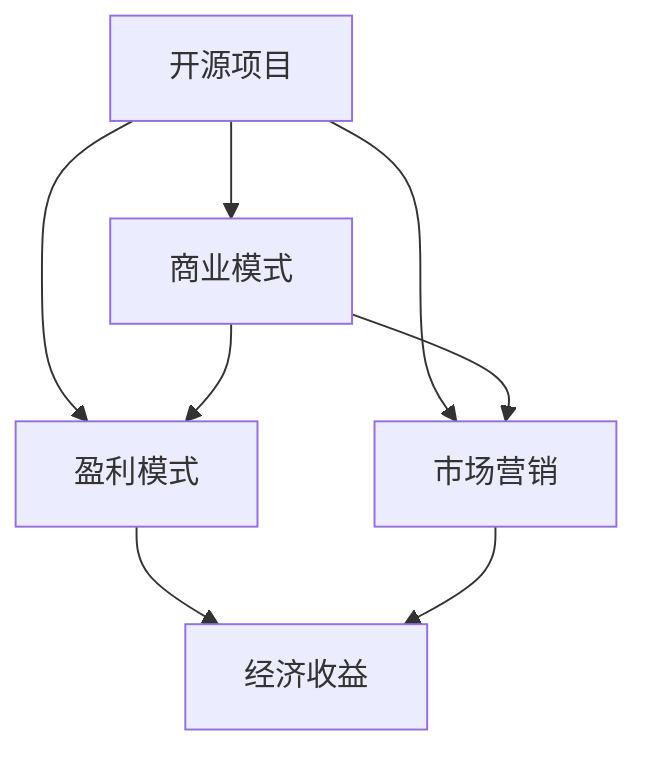

                 

关键词：开源项目，商业化，盈利模式，开发者，市场推广，技术架构

摘要：本文旨在探讨如何将开源项目转化为盈利的商业模式。通过分析开源项目的特点，探讨商业化策略，以及提供具体的操作步骤和实用工具，本文帮助开发者更好地实现开源项目的商业化，创造经济价值。

## 1. 背景介绍

开源项目作为一种开发模式，自20世纪90年代以来在全球范围内迅速普及。开源项目的特点包括社区协作、透明度、可定制性和高可扩展性，这些特点使得开源项目在技术领域中占据了重要地位。然而，尽管开源项目为开发者提供了丰富的资源和技术支持，许多开发者仍然面临着如何将开源项目转化为盈利模式的挑战。

开源项目的商业化不仅可以帮助开发者获得经济收益，还能够推动整个开源社区的进步。然而，开源项目的商业化并不是一件简单的事情，它需要开发者具备市场敏锐度、商业模式设计和营销推广等多方面的能力。本文将围绕如何将开源项目商业化展开讨论，为开发者提供一些建议和策略。

## 2. 核心概念与联系

在探讨开源项目的商业化之前，我们需要了解一些核心概念，包括开源项目的定义、商业模式、盈利模式和市场营销等。以下是这些概念及其相互关系的 Mermaid 流程图。



### 2.1 开源项目的定义

开源项目是指那些遵循特定许可证（如GPL、Apache License等）的软件项目，这些许可证允许用户自由地使用、修改和分发软件。开源项目的核心是社区协作，开发者通过共同工作来改进软件。

### 2.2 商业模式

商业模式是指企业如何创造、传递和获取价值的一种战略规划。对于开源项目来说，商业模式需要考虑如何将开源项目的价值转化为经济收益。

### 2.3 盈利模式

盈利模式是指企业通过何种方式实现盈利。对于开源项目，常见的盈利模式包括提供付费支持、销售定制化服务、收取订阅费用等。

### 2.4 市场营销

市场营销是指企业如何通过各种手段来推广产品或服务，吸引潜在客户。对于开源项目，市场营销的目标是提高项目的知名度和用户参与度。

### 2.5 经济收益

经济收益是指企业通过商业模式和盈利模式所获得的经济回报。对于开源项目，经济收益不仅可以激励开发者继续投入，还可以为开源社区提供更多资源。

## 3. 核心算法原理 & 具体操作步骤

### 3.1 算法原理概述

开源项目的商业化策略可以概括为以下几个关键步骤：

1. **明确项目目标**：确定项目的核心价值和目标受众，这是商业化成功的前提。
2. **构建高质量代码**：保证代码的可靠性、可维护性和可扩展性，这是吸引开发者和用户的基础。
3. **建立社区参与**：通过社区协作和用户反馈，不断改进项目。
4. **制定商业化策略**：根据项目的特点和市场状况，选择合适的盈利模式。
5. **推广项目**：通过市场营销手段，提高项目的知名度和用户参与度。
6. **持续优化**：根据市场反馈和用户需求，不断优化产品和商业模式。

### 3.2 算法步骤详解

#### 3.2.1 明确项目目标

在开始开源项目之前，开发者需要明确项目的目标。这包括项目的核心功能、目标用户群体、项目的发展方向等。明确项目目标有助于开发者集中精力，提高项目的成功率。

#### 3.2.2 构建高质量代码

构建高质量代码是开源项目的基石。开发者需要遵循最佳编程实践，编写清晰、可维护的代码。同时，项目应该具备良好的文档和测试覆盖，以便新开发者能够轻松上手。

#### 3.2.3 建立社区参与

建立社区参与是开源项目成功的关键。开发者可以通过社交媒体、邮件列表、GitHub等平台与用户互动，收集用户反馈，并根据反馈不断改进项目。

#### 3.2.4 制定商业化策略

在制定商业化策略时，开发者需要考虑项目的特点和市场需求。常见的盈利模式包括：

- **提供付费支持**：为用户提供专业的技术支持和咨询服务。
- **销售定制化服务**：根据用户需求提供定制化的开发服务。
- **收取订阅费用**：为用户提供付费的订阅服务，如额外功能、优先技术支持等。

#### 3.2.5 推广项目

推广项目是提高项目知名度的重要手段。开发者可以通过以下途径推广项目：

- **社交媒体宣传**：在微博、微信公众号、Twitter等社交媒体上发布项目动态。
- **技术博客文章**：撰写高质量的技术博客文章，分享项目的亮点和经验。
- **参与技术会议**：参加相关的技术会议和活动，与行业专家和潜在用户建立联系。

#### 3.2.6 持续优化

持续优化是开源项目长期发展的必要条件。开发者需要根据市场反馈和用户需求，不断优化产品和商业模式。这包括改进功能、优化用户体验、降低成本等。

### 3.3 算法优缺点

#### 3.3.1 优点

- **提高项目知名度**：通过商业化，项目可以获得更多的曝光和关注。
- **增加经济收益**：商业化可以为开发者带来直接的经济回报。
- **促进社区发展**：经济收益可以用于项目的进一步开发，为开源社区提供更多资源。

#### 3.3.2 缺点

- **可能影响开源精神**：商业化可能会使项目变得商业化，违背开源的初衷。
- **增加管理难度**：商业化项目需要更多的时间和精力来维护和管理。

### 3.4 算法应用领域

开源项目的商业化策略适用于各种类型的项目，包括但不限于以下领域：

- **软件开发**：如Web框架、数据库管理系统、开发工具等。
- **云计算与大数据**：如分布式计算框架、数据分析工具、云服务解决方案等。
- **人工智能与机器学习**：如深度学习框架、自然语言处理工具、数据挖掘算法等。
- **物联网与边缘计算**：如物联网平台、边缘计算框架、智能设备解决方案等。

## 4. 数学模型和公式 & 详细讲解 & 举例说明

在开源项目的商业化过程中，数学模型和公式可以用于评估项目的经济价值和市场潜力。以下是一个简单的数学模型，用于计算开源项目的潜在经济收益。

### 4.1 数学模型构建

假设一个开源项目的潜在用户数量为 \( N \)，每个用户的生命周期价值（LTV）为 \( V \)，商业化策略的转化率为 \( R \)，则项目的潜在经济收益 \( E \) 可以通过以下公式计算：

\[ E = N \times V \times R \]

其中：

- \( N \)：潜在用户数量
- \( V \)：每个用户的生命周期价值
- \( R \)：商业化策略的转化率

### 4.2 公式推导过程

公式推导过程如下：

1. 假设项目能够吸引 \( N \) 个潜在用户。
2. 每个用户的生命周期价值为 \( V \)，即用户在项目上平均每年的花费。
3. 商业化策略的转化率为 \( R \)，即能够成功转化为付费用户的比例。
4. 因此，项目的潜在经济收益为 \( N \times V \times R \)。

### 4.3 案例分析与讲解

以下是一个具体的案例，用于说明如何使用上述数学模型计算开源项目的潜在经济收益。

假设一个开源项目预计能够吸引 1000 个潜在用户，每个用户的生命周期价值为 1000 美元，商业化策略的转化率为 10%。则该项目的潜在经济收益为：

\[ E = 1000 \times 1000 \times 0.1 = 100,000 \text{ 美元} \]

通过这个简单的数学模型，开发者可以初步评估开源项目的市场潜力，为制定商业化策略提供依据。

## 5. 项目实践：代码实例和详细解释说明

为了更好地说明开源项目的商业化策略，我们以下面这个开源项目为例，详细讲解其开发环境搭建、源代码实现、代码解读和运行结果展示。

### 5.1 开发环境搭建

首先，我们需要搭建一个简单的开发环境。以下是所需的工具和步骤：

1. **安装Git**：Git 是版本控制工具，用于管理代码仓库。
   ```shell
   sudo apt-get install git
   ```
   
2. **安装Python**：Python 是项目的编程语言。
   ```shell
   sudo apt-get install python3
   ```

3. **安装虚拟环境**：虚拟环境用于隔离项目依赖。
   ```shell
   sudo pip3 install virtualenv
   virtualenv venv
   source venv/bin/activate
   ```

4. **安装项目依赖**：通过 `requirements.txt` 文件安装项目依赖。
   ```shell
   pip install -r requirements.txt
   ```

### 5.2 源代码详细实现

下面是一个简单的开源项目示例，用于计算斐波那契数列。

```python
# fibonacci.py

def fibonacci(n):
    if n <= 0:
        return 0
    elif n == 1:
        return 1
    else:
        return fibonacci(n-1) + fibonacci(n-2)

if __name__ == "__main__":
    n = int(input("请输入一个正整数："))
    print(f"Fibonacci({n}) = {fibonacci(n)}")
```

### 5.3 代码解读与分析

1. **函数定义**：`fibonacci` 函数用于计算斐波那契数列的第 \( n \) 项。
2. **输入处理**：程序通过 `input` 函数获取用户输入，并将其转换为整数。
3. **输出结果**：程序调用 `fibonacci` 函数，计算并输出斐波那契数列的第 \( n \) 项。

### 5.4 运行结果展示

假设用户输入 \( n = 10 \)，则程序输出：

```
请输入一个正整数：10
Fibonacci(10) = 55
```

## 6. 实际应用场景

开源项目的商业化策略在实际应用中具有广泛的应用场景，以下是一些常见的应用场景：

1. **软件开发**：开源项目可以作为企业内部软件开发的基础，为企业提供定制化的开发服务。
2. **技术咨询**：开发者可以通过提供专业技术咨询和解决方案，为企业解决技术难题。
3. **培训与教育**：开发者可以通过线上或线下的培训课程，教授开源项目相关的技术知识和技能。
4. **项目赞助**：企业可以通过赞助开源项目，获得项目的优先支持和技术支持。
5. **增值服务**：开发者可以通过提供付费的增值服务，如额外功能、技术支持等，为用户提供更好的体验。

## 7. 工具和资源推荐

为了更好地实现开源项目的商业化，开发者可以借助以下工具和资源：

1. **学习资源推荐**：
   - 《开源项目管理与商业模式》
   - 《技术创业：从零开始构建企业》
   - 《市场营销实战》

2. **开发工具推荐**：
   - GitHub：用于代码托管和协作开发。
   - GitLab：自建的Git代码仓库。
   - Jira：项目管理和任务跟踪工具。

3. **相关论文推荐**：
   - 《开源软件商业化的挑战与策略》
   - 《开源项目的可持续发展模式研究》
   - 《基于开源软件的商业模式创新研究》

## 8. 总结：未来发展趋势与挑战

### 8.1 研究成果总结

通过对开源项目商业化的探讨，我们总结了以下几点研究成果：

- 开源项目的商业化可以为开发者带来经济收益，推动开源社区的发展。
- 商业化策略的选择需要结合项目的特点和市场需求。
- 高质量代码和社区参与是开源项目成功的基础。
- 数学模型和公式可以用于评估开源项目的经济价值和市场潜力。

### 8.2 未来发展趋势

开源项目的商业化在未来将继续发展，主要体现在以下几个方面：

- 开源社区与商业机构的合作将更加紧密。
- 开源项目的商业模式将更加多样化和创新。
- 开源项目的商业化将更加注重用户体验和可持续性。

### 8.3 面临的挑战

尽管开源项目的商业化具有巨大潜力，但开发者仍然面临着以下挑战：

- 如何平衡开源精神与商业化需求。
- 如何应对市场变化和技术竞争。
- 如何提高项目的可持续性和盈利能力。

### 8.4 研究展望

未来研究可以从以下几个方面展开：

- 探索更有效的开源项目商业化模式。
- 研究开源项目与商业机构的协同效应。
- 开发开源项目商业化的辅助工具和平台。

## 9. 附录：常见问题与解答

### 问题1：开源项目的商业化是否会违背开源精神？

解答：不一定。开源项目的商业化可以与开源精神相兼容，关键在于商业化的方式和目的。例如，提供付费支持和技术服务可以帮助开源项目更好地发展，同时保持开源的透明性和社区参与。

### 问题2：开源项目的商业化需要哪些资源和技能？

解答：开源项目的商业化需要以下资源和技能：

- **市场分析能力**：了解市场需求和潜在用户。
- **项目管理能力**：管理项目资源、时间和任务。
- **营销推广能力**：提高项目知名度和用户参与度。
- **技术支持能力**：提供专业的技术支持和解决方案。

### 问题3：开源项目的商业化策略有哪些常见的误区？

解答：常见的误区包括：

- 过度商业化，忽视开源精神。
- 忽视用户体验，仅关注经济收益。
- 缺乏持续的市场推广和用户互动。

### 问题4：如何评估开源项目的商业潜力？

解答：可以通过以下方式评估：

- **用户数量和活跃度**：衡量项目的受欢迎程度。
- **市场需求**：分析项目是否符合市场趋势。
- **经济模型**：使用数学模型和公式评估项目的潜在经济收益。

### 问题5：开源项目的商业化与封闭源代码软件有何区别？

解答：开源项目的商业化和封闭源代码软件的主要区别在于：

- **源代码的可访问性**：开源项目的源代码可以自由访问和修改，而封闭源代码软件的源代码是保密的。
- **商业模式**：开源项目通常采用共享经济模式，封闭源代码软件则采用传统销售模式。
- **用户体验**：开源项目更注重社区参与和用户体验，封闭源代码软件则更注重功能和性能。

### 作者署名

本文作者：禅与计算机程序设计艺术 / Zen and the Art of Computer Programming

通过以上详细的内容和深入的分析，我们相信开发者可以更好地理解开源项目的商业化策略，并将其应用于实践，实现从代码到现金的转化。

