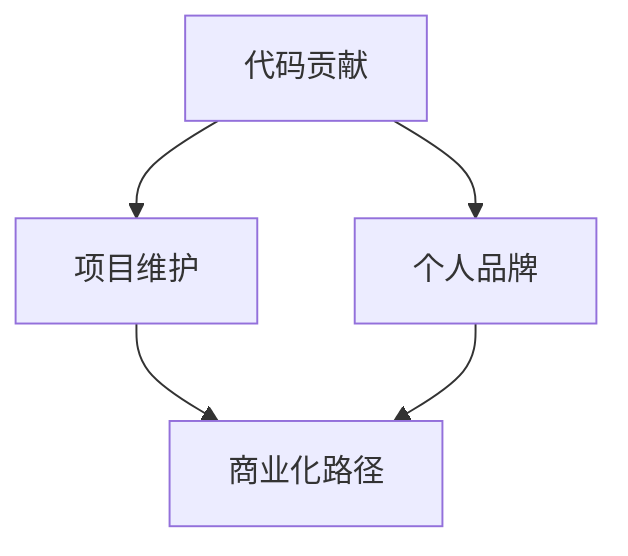

                 

关键词：开源，代码贡献，商业化，技术社区，项目管理，合作与协作，可持续发展

> 摘要：本文将探讨从代码贡献到开源商业化的全链路，解析如何通过开源项目积累技术影响力，提升个人品牌，以及实现商业价值的最大化。我们将深入分析开源项目的价值、合作模式、商业化路径，并结合实际案例提供操作指南，为技术从业者和开源项目管理者提供实用的参考。

## 1. 背景介绍

在当今技术高速发展的时代，开源已经成为软件生态系统的重要组成部分。无论是操作系统、开发框架、还是数据库和中间件，开源技术无处不在。随着开源文化的普及，越来越多的人参与到开源项目中，贡献代码、修复漏洞、撰写文档，甚至开展商业活动。然而，从代码贡献到开源商业化，这一过程并非一蹴而就，需要深入的技术理解、良好的项目管理能力以及商业智慧。

本文旨在解答以下问题：

- 开源项目的价值如何体现？
- 技术贡献者如何提升个人品牌？
- 开源项目如何实现商业价值的转化？
- 开源商业化面临哪些挑战与机遇？

通过本文的阅读，您将了解开源项目的运作机制、合作模式以及商业化路径，从而更好地把握开源时代的机遇。

### 1.1 开源文化的崛起

开源文化起源于20世纪70年代末，随着Unix系统的普及和Linux内核的诞生，逐渐形成了一种以自由、共享、合作为核心的软件开发模式。开源文化的核心在于开放源代码，允许用户自由地查看、修改和分发软件，这使得技术社区能够共同参与、共同改进。随着互联网的兴起，开源项目得到了更广泛的传播和参与，逐渐成为现代软件开发的基石。

开源文化的崛起不仅改变了软件开发的方式，也深刻影响了软件产业的发展。一方面，开源项目吸引了全球范围内的技术人才，形成了强大的社群力量；另一方面，企业也开始意识到开源技术的重要性，将其作为产品开发和业务创新的手段。如今，开源已经成为现代IT行业的核心驱动力之一。

### 1.2 开源项目的发展趋势

近年来，开源项目的发展呈现出以下几个显著趋势：

1. **项目数量爆发性增长**：随着开源平台（如GitHub、GitLab、GitBucket等）的普及，开源项目数量呈现爆发性增长。据统计，GitHub上的项目数量已经超过了4,000万个，GitLab上也有数百万个活跃项目。

2. **技术领域覆盖广泛**：从操作系统、编程语言、框架库到人工智能、大数据、物联网等，开源项目已经覆盖了几乎所有技术领域。例如，Python、Java、JavaScript等编程语言的流行，离不开大量优秀的开源框架和工具。

3. **商业合作日益紧密**：企业开始积极参与开源项目，通过开源技术获取商业利益。例如，许多企业将自己的内部项目开源，以吸引开发者贡献代码，从而提升产品的市场竞争力。同时，企业也会通过赞助、参与治理等方式支持开源项目。

4. **开源与商业的深度融合**：随着开源技术的商业化进程加速，许多开源项目已经开始实现商业价值的转化。例如，Elasticsearch、MongoDB等开源数据库已经成为企业级应用的标准配置，其商业版本提供了更多的功能和安全保障。

### 1.3 开源项目的重要性

开源项目的重要性体现在以下几个方面：

1. **技术创新的源泉**：开源项目鼓励技术创新和知识共享，吸引了全球范围内的开发者共同参与。这种开放的合作模式促进了技术的快速迭代和创新。

2. **降低开发成本**：开源项目提供了大量的现成代码和解决方案，开发者可以基于开源项目进行二次开发，从而节省了大量的时间和成本。

3. **增强市场竞争能力**：企业通过参与开源项目，可以获取更多的技术资源，提升产品的技术水平和市场竞争力。

4. **推动产业发展**：开源项目不仅为开发者提供了技术支持，也为整个产业创造了新的机遇。例如，物联网、人工智能等新兴领域的发展，离不开开源技术的推动。

## 2. 核心概念与联系

在探讨如何从代码贡献到开源商业化的过程中，需要明确以下几个核心概念和它们之间的联系：

1. **代码贡献**：指开发者向开源项目提交代码、修复漏洞、完善文档等贡献行为。
2. **项目维护**：指项目管理者负责项目的持续发展，包括代码审核、版本控制、社区管理等。
3. **个人品牌**：指技术贡献者通过参与开源项目、发表技术文章、参与技术活动等手段建立的个人专业形象和声誉。
4. **商业化路径**：指通过开源项目实现商业价值转化的策略和途径，包括项目赞助、服务订阅、企业定制等。

下面是一个简化的 Mermaid 流程图，展示了这些核心概念之间的联系：



### 2.1 代码贡献

代码贡献是开源项目的基石。开发者通过提交代码、修复漏洞、优化功能等方式，为项目的发展贡献力量。以下是一些关键步骤：

1. **了解项目需求**：在开始贡献代码之前，开发者需要熟悉项目的需求和现状，以确保贡献的内容能够真正帮助到项目。
2. **准备开发环境**：开发者需要搭建与项目兼容的开发环境，包括安装必要的依赖库和工具。
3. **编写代码**：在开发环境中编写符合项目规范的代码，并确保代码质量。
4. **提交拉取请求**：将编写的代码提交到项目的仓库，并通过拉取请求（Pull Request，简称PR）方式邀请项目管理者进行审核。
5. **代码审查**：项目管理者对提交的代码进行审查，确保代码质量符合项目标准，并进行必要的修改。

### 2.2 项目维护

项目维护是确保开源项目长期健康发展的关键。以下是一些重要的任务：

1. **代码审核**：定期审查代码库中的代码，确保代码质量和一致性。
2. **版本控制**：及时发布新的版本，修复已知的漏洞，并添加新功能。
3. **社区管理**：建立和维护活跃的社区，鼓励开发者参与项目讨论和贡献。
4. **文档更新**：及时更新项目文档，确保文档与代码同步，为开发者提供清晰的指引。

### 2.3 个人品牌

通过参与开源项目，开发者可以建立个人品牌，提升专业影响力。以下是一些有效的策略：

1. **撰写技术文章**：在技术博客、论坛等平台上发表高质量的技术文章，分享自己的经验和见解。
2. **参与技术活动**：参加技术会议、研讨会、开源峰会等活动，与业内同行交流互动。
3. **开源项目贡献**：积极参与开源项目，贡献代码、修复漏洞，提升项目的质量和知名度。
4. **个人网站或博客**：建立个人网站或博客，展示自己的技术成果和专业知识。

### 2.4 商业化路径

开源项目的商业化路径多样化，以下是一些常见的策略：

1. **项目赞助**：企业或个人通过赞助方式支持开源项目，获得项目的优先权或品牌曝光。
2. **服务订阅**：企业通过提供基于开源项目的技术支持、培训、咨询服务等方式获得收入。
3. **企业定制**：根据企业需求，定制开发符合特定需求的功能或服务，从而实现商业价值的转化。
4. **商业版授权**：开源项目的开发者或组织提供商业版授权，提供额外的功能和安全保障。

## 3. 核心算法原理 & 具体操作步骤

### 3.1 算法原理概述

开源项目的成功往往离不开一系列核心算法的支持。这些算法不仅保证了项目的功能实现，还提高了系统的性能和可靠性。本节将介绍一种常用的开源算法——快速排序（Quick Sort），并详细描述其原理和操作步骤。

### 3.2 算法步骤详解

快速排序的基本思想是选取一个基准元素，将数组分为两部分，一部分比基准元素小，另一部分比基准元素大。这个过程称为分区（Partition）。然后递归地对这两个分区进行快速排序。具体步骤如下：

1. **选择基准元素**：从数组中随机选择一个元素作为基准元素。
2. **分区**：将数组分为两部分，所有比基准元素小的元素放在基准元素的左边，所有比基准元素大的元素放在基准元素的右边。
3. **递归排序**：对基准元素左边的数组和右边的数组分别递归执行快速排序。

### 3.3 算法优缺点

**优点**：

- **高效**：快速排序的平均时间复杂度为 $O(n\log n)$。
- **原地排序**：快速排序不需要额外的存储空间，是一种原地排序算法。
- **稳定性**：快速排序是一种稳定的排序算法，相同值的元素在排序过程中不会交换位置。

**缺点**：

- **最坏情况**：在最坏情况下，快速排序的时间复杂度为 $O(n^2)$，这通常发生在数组已经有序或完全逆序时。
- **依赖随机性**：快速排序的性能依赖于随机性，如果基准元素的选择不当，可能导致性能下降。

### 3.4 算法应用领域

快速排序广泛应用于各种场景，包括：

- **数据分析**：快速排序是许多数据分析算法的基础，如堆排序、快速选择等。
- **软件工程**：快速排序在软件开发中经常用于排序大量数据，如数据库索引构建、缓存排序等。
- **算法竞赛**：快速排序是算法竞赛中常见的排序算法，用于解决各种排序问题。

### 3.5 数学模型和公式

快速排序的算法分析通常涉及以下数学模型和公式：

- **时间复杂度**：
  $$ T(n) = 2T(n/2) + n $$
  快速排序的平均时间复杂度为 $O(n\log n)$，最坏情况为 $O(n^2)$。

- **空间复杂度**：
  $$ S(n) = \log_2 n $$
  快速排序的空间复杂度为 $O(\log n)$。

### 3.6 案例分析与讲解

以下是一个简单的快速排序算法的 Python 实现：

```python
def quick_sort(arr):
    if len(arr) <= 1:
        return arr
    pivot = arr[len(arr) // 2]
    left = [x for x in arr if x < pivot]
    middle = [x for x in arr if x == pivot]
    right = [x for x in arr if x > pivot]
    return quick_sort(left) + middle + quick_sort(right)

# 示例
arr = [3, 6, 8, 10, 1, 2, 1]
sorted_arr = quick_sort(arr)
print(sorted_arr)
```

通过上述案例，我们可以看到快速排序的基本实现流程和操作步骤。在实际应用中，快速排序可以根据具体需求进行调整和优化，以适应不同的场景。

## 4. 数学模型和公式 & 详细讲解 & 举例说明

在开源项目中，数学模型和公式是算法设计和性能分析的重要组成部分。这些数学工具不仅能够帮助开发者理解和优化代码，还能提高项目的可扩展性和可靠性。以下，我们将详细讲解一个常见的数学模型——最优化理论，并举例说明其在开源项目中的应用。

### 4.1 数学模型构建

最优化理论旨在寻找在给定约束条件下，能够最大化或最小化某一目标函数的解。其基本模型可以表示为：

$$
\min_{x} f(x) \quad \text{subject to} \quad g_i(x) \leq 0, \quad h_j(x) = 0
$$

其中：

- \( f(x) \) 是目标函数，可以是需要最小化的成本函数或最大化收益函数。
- \( g_i(x) \) 和 \( h_j(x) \) 是约束条件，分别表示等式约束和不等式约束。

为了便于理解和应用，我们可以将上述模型分解为以下几个步骤：

1. **定义目标函数**：根据项目的具体需求，确定需要优化的目标函数。例如，在资源分配问题中，目标函数可能是最小化总能耗或最大化系统吞吐量。
2. **确定约束条件**：识别项目中的限制因素，并将其转化为数学约束条件。例如，硬件资源限制、预算约束、时间约束等。
3. **构建数学模型**：将目标函数和约束条件组合起来，形成完整的优化模型。

### 4.2 公式推导过程

以下是一个简单的优化模型示例，用于解决线性规划问题：

$$
\min_{x} c^T x \quad \text{subject to} \quad Ax \leq b
$$

其中：

- \( c \) 是目标函数系数向量。
- \( x \) 是决策变量向量。
- \( A \) 和 \( b \) 分别是约束条件矩阵和向量。

为了求解上述线性规划问题，我们可以使用单纯形法。以下是单纯形法的推导步骤：

1. **初始基本可行解**：选择初始基本可行解，使得所有约束条件都满足。
2. **确定进入变量和离开变量**：通过计算确定进入基本解的变量（进基）和离开基本解的变量（出基）。
3. **更新基本解**：根据进入变量和离开变量的比例，更新基本解，并重复步骤2，直到找到最优解。

### 4.3 案例分析与讲解

假设我们有一个线性规划问题，目标是最小化总成本，同时满足以下约束条件：

$$
\min_{x, y} 3x + 2y \\
\text{subject to} \\
x + y \leq 5 \\
2x + y \leq 7 \\
x, y \geq 0
$$

我们可以通过单纯形法求解这个问题。以下是详细的步骤：

1. **初始基本可行解**：
   选择初始基本可行解为 \( x = 0, y = 0 \)。这个解满足了所有约束条件。

2. **确定进入变量和离开变量**：
   - 计算每个变量的相对成本（即目标函数在当前基本解上的值与当前基本解的值之比）。
   - 选择相对成本最小的变量作为进入变量。
   - 计算离开变量，使其比例最小化。

   以此步骤，我们选择 \( x \) 作为进入变量。

3. **更新基本解**：
   通过迭代更新基本解，找到最优解。

   更新过程如下：
   - 将 \( x \) 替换为 \( y \)。
   - 重新计算相对成本，并确定新的进入变量和离开变量。

   重复上述步骤，直到找到最优解。

通过这个过程，我们可以得到最优解 \( x = 3, y = 2 \)，总成本为 \( 3 \times 3 + 2 \times 2 = 13 \)。

### 4.4 实际应用

最优化理论在开源项目中有着广泛的应用。以下是一些实际案例：

- **资源分配**：在分布式系统中，优化算法可以用于合理分配计算资源，最大化系统吞吐量或最小化能耗。
- **负载均衡**：通过优化算法，可以动态调整服务器负载，提高系统的可靠性和性能。
- **网络优化**：路由算法和流量控制算法基于优化理论，可以确保网络的稳定性和高效性。

这些案例表明，数学模型和公式在开源项目中具有重要的应用价值，能够帮助开发者更好地理解和优化代码。

### 4.5 小结

通过本节的内容，我们了解了最优化理论的数学模型构建、公式推导过程以及在开源项目中的应用。这些知识不仅有助于开发者优化代码，还能提高项目的整体性能和可靠性。在实际项目中，开发者可以根据具体需求，灵活运用优化理论，从而实现更高效的资源利用和业务流程优化。

## 5. 项目实践：代码实例和详细解释说明

在实际应用中，开源项目往往需要通过具体的代码实现来实现其功能和目标。以下，我们将以一个常见的开源项目——Python中的 Flask 框架为例，详细讲解其开发环境搭建、源代码实现、代码解读与分析以及运行结果展示。

### 5.1 开发环境搭建

要开始使用 Flask 框架，首先需要搭建开发环境。以下是所需的步骤：

1. **安装 Python**：Flask 框架依赖于 Python，建议使用 Python 3.6 或更高版本。可以从 [Python 官网](https://www.python.org/) 下载安装。
2. **安装虚拟环境**：为了隔离项目依赖，可以使用 virtualenv 创建一个虚拟环境。执行以下命令安装 virtualenv：
   ```bash
   pip install virtualenv
   ```
   创建虚拟环境：
   ```bash
   virtualenv flask_project_env
   ```
   激活虚拟环境：
   ```bash
   source flask_project_env/bin/activate
   ```
3. **安装 Flask**：在虚拟环境中安装 Flask：
   ```bash
   pip install Flask
   ```

### 5.2 源代码详细实现

以下是一个简单的 Flask 应用示例，实现了一个基础的 Web 服务：

```python
from flask import Flask

app = Flask(__name__)

@app.route('/')
def hello_world():
    return 'Hello, World!'

if __name__ == '__main__':
    app.run()
```

**代码解读：**

- 第1行：导入 Flask 模块。
- 第2行：创建 Flask 应用对象。
- 第3行：定义一个路由规则，当访问根路径（'/'）时，调用 `hello_world` 函数。
- 第4行：实现 `hello_world` 函数，返回字符串 'Hello, World!'。
- 第6行：确保当直接运行该脚本时，调用 `app.run()` 启动 Flask 应用。

### 5.3 代码解读与分析

**路由规则**：路由规则是 Flask 应用的核心，用于定义不同的 URL 路径对应的功能。在上面的示例中，`@app.route('/')` 装饰器定义了当访问根路径（'/'）时，将调用 `hello_world` 函数。

**视图函数**：视图函数是 Flask 应用中处理 HTTP 请求的核心部分。在上面的示例中，`hello_world` 函数是视图函数，它根据请求的 URL 路径返回相应的响应内容。

**应用运行**：`app.run()` 函数用于启动 Flask 应用。它将在本地 127.0.0.1 端口上启动一个 Web 服务器，默认使用 WSGIHTTPServer。当运行该脚本时，Web 服务器将监听该端口，等待客户端请求。

### 5.4 运行结果展示

运行上述代码后，Flask 应用将启动，并在浏览器中访问 `http://127.0.0.1:5000/`，显示如下结果：

```
Hello, World!
```

这表明 Flask 应用已经成功运行，并返回了预期的响应内容。

### 5.5 扩展功能

Flask 框架支持丰富的扩展功能，例如数据库集成、用户认证、Web 框架等。以下是一个简单的扩展示例，使用 Flask-SQLAlchemy 实现一个简单的用户管理系统：

```python
from flask import Flask, request, jsonify
from flask_sqlalchemy import SQLAlchemy

app = Flask(__name__)
app.config['SQLALCHEMY_DATABASE_URI'] = 'sqlite:///users.db'
db = SQLAlchemy(app)

class User(db.Model):
    id = db.Column(db.Integer, primary_key=True)
    username = db.Column(db.String(80), unique=True, nullable=False)
    password = db.Column(db.String(120), nullable=False)

@app.route('/users', methods=['POST'])
def create_user():
    username = request.json['username']
    password = request.json['password']
    new_user = User(username=username, password=password)
    db.session.add(new_user)
    db.session.commit()
    return jsonify({'message': 'User created successfully.'})

if __name__ == '__main__':
    db.create_all()
    app.run()
```

**代码解读：**

- 第3行：配置数据库 URI。
- 第4行：创建数据库对象。
- 第5行：定义 User 模型，包括 id、username 和 password 列。
- 第8行：定义创建用户的路由，接收 POST 请求，解析 JSON 数据，并保存到数据库。
- 第11行：创建数据库表。

通过这个扩展示例，我们可以看到如何使用 Flask 框架实现更复杂的功能。在实际项目中，可以根据需求扩展更多的功能，如用户认证、数据验证、权限控制等。

### 5.6 小结

通过本节的内容，我们详细讲解了 Flask 框架的开发环境搭建、源代码实现、代码解读与分析以及运行结果展示。这些步骤和代码示例为开发者提供了一个实用的入门指南，帮助他们更好地理解和应用 Flask 框架。同时，扩展功能的部分展示了如何进一步扩展 Flask 应用的功能，满足更复杂的需求。

## 6. 实际应用场景

开源项目不仅为技术社区提供了丰富的资源和合作平台，还在实际应用场景中发挥着重要作用。以下是一些典型的实际应用场景，以及开源项目在这些场景中的贡献和影响。

### 6.1 开源项目在软件开发中的应用

在软件开发过程中，开源项目为开发者提供了大量的工具和框架，大大提高了开发效率。以下是一些典型的开源项目：

- **Django**：一个高级的Python Web框架，用于快速开发和部署应用程序。Django 提供了完整的Web开发工具集，包括ORM、认证系统、权限控制等，广泛应用于各种大型网站和Web应用。
- **React**：一个用于构建用户界面的JavaScript库，由Facebook开发。React 提供了一种声明式的、组件化的UI开发方法，使得前端开发更加高效和灵活。
- **Kubernetes**：一个开源的容器编排平台，用于自动化部署、扩展和管理容器化应用程序。Kubernetes已经成为容器化应用的标准，被广泛应用于云计算和大数据领域。

### 6.2 开源项目在数据科学和人工智能中的应用

在数据科学和人工智能领域，开源项目为研究人员和开发者提供了丰富的算法库和工具集。以下是一些重要的开源项目：

- **Scikit-learn**：一个用于机器学习的Python库，提供了广泛的机器学习算法和工具，包括分类、回归、聚类等。Scikit-learn 是数据科学家和机器学习研究者的常用工具。
- **TensorFlow**：由Google开发的开源机器学习库，用于构建和训练深度学习模型。TensorFlow 提供了丰富的API和工具，支持各种深度学习任务，包括图像识别、自然语言处理等。
- **PyTorch**：一个由Facebook开发的深度学习库，提供了灵活的动态计算图和自动微分功能。PyTorch 被广泛应用于深度学习研究、工业应用和学术项目。

### 6.3 开源项目在云计算和大数据中的应用

在云计算和大数据领域，开源项目为开发者提供了强大的基础设施和工具，支持大规模数据处理和分布式计算。以下是一些重要的开源项目：

- **Hadoop**：一个分布式数据处理平台，用于存储和处理大规模数据集。Hadoop 提供了HDFS（分布式文件系统）、MapReduce（数据处理框架）和YARN（资源调度框架）等核心组件，被广泛应用于大数据处理和分析。
- **Docker**：一个开源的应用容器引擎，用于打包、交付和运行应用程序。Docker 通过容器化技术，实现了应用与基础设施的解耦，提高了开发和运维的效率。
- **Kubernetes**：在前面已经详细介绍，Kubernetes 作为容器编排平台，在云计算和大数据领域发挥了重要作用，支持容器化应用的自动化部署和管理。

### 6.4 开源项目在社会公益和科研领域的应用

开源项目不仅在企业应用中发挥了巨大作用，还在社会公益和科研领域产生了深远影响。以下是一些开源项目在社会公益和科研中的应用：

- **OpenStreetMap**：一个全球性的开源地图项目，用户可以自由编辑和分享地图数据。OpenStreetMap 为科研、救灾、社区活动等领域提供了重要的地理信息支持。
- **GitHub**：作为全球最大的开源代码托管平台，GitHub 为科研人员提供了一个便捷的代码分享和协作平台，促进了学术交流和科研合作。
- **SciHub**：一个开源的学术文献下载工具，帮助用户免费获取各类学术期刊和论文。SciHub 在一定程度上缓解了科研人员获取文献资源的困难。

### 6.5 开源项目在行业应用中的角色

开源项目在各个行业中也发挥着重要作用，推动了技术创新和业务模式变革。以下是一些行业应用案例：

- **金融科技**：开源项目如区块链和智能合约技术，为金融行业带来了全新的业务模式和服务体验。例如，比特币和以太坊等区块链项目已经在支付、交易和智能合约等领域取得了广泛应用。
- **物联网**：开源项目如物联网操作系统和传感器协议，为物联网设备提供了强大的支持。例如，Arduino 和 Raspberry Pi 等开源硬件项目，推动了物联网设备的发展和普及。
- **制造业**：开源项目如制造数据分析和3D打印技术，为制造业提供了创新的解决方案。例如，MES（制造执行系统）和3D打印技术正在改变制造业的生产流程和制造方式。

### 6.6 开源项目在教育和培训中的应用

开源项目在教育领域也发挥着重要作用，为教师和学生提供了丰富的教学资源和实践平台。以下是一些开源项目在教育中的应用：

- **Khan Academy**：一个提供免费教育资源的开源项目，涵盖了数学、科学、编程等多个学科领域。Khan Academy 通过在线课程和互动练习，为全球学生提供了灵活的学习方式。
- **GitHub Education**：GitHub 为教育机构提供了免费的教育订阅计划，支持学生和教师使用 GitHub 平台进行项目协作和学习。
- **Jupyter Notebook**：一个开源的交互式计算环境，广泛应用于数据科学、机器学习和教育领域。Jupyter Notebook 支持多种编程语言，为教育和科研提供了强大的工具支持。

### 6.7 小结

开源项目在软件开发、数据科学、人工智能、云计算、大数据、社会公益、科研、行业应用和教育培训等领域中发挥着重要作用。通过提供丰富的工具和资源，开源项目为技术社区和创新实践提供了强大的支持。在未来，随着开源文化的进一步普及和技术的不断进步，开源项目将在更多领域展现其独特的价值和影响力。

### 6.8 未来应用展望

随着技术的不断进步和开源文化的深入发展，开源项目将在未来迎来更多的机遇和挑战。以下是对未来开源应用的一些展望：

#### 6.8.1 技术趋势

1. **边缘计算和物联网**：随着5G和物联网技术的发展，边缘计算将成为主流。开源项目在这一领域将发挥关键作用，提供支持实时数据处理和智能决策的分布式系统框架。
2. **人工智能和机器学习**：开源人工智能和机器学习项目将继续推动技术创新，为研究人员和开发者提供强大的算法库和工具集。
3. **区块链技术**：区块链技术的开源项目将在金融、供应链管理、数字身份等领域得到广泛应用，推动业务模式和社会治理的变革。

#### 6.8.2 商业模式创新

1. **云原生开源项目**：随着云计算的普及，云原生开源项目如Kubernetes、Docker等将继续发挥重要作用。企业将通过购买服务订阅、云原生应用托管等方式，实现开源项目的商业化。
2. **社区驱动商业模式**：开源项目可以通过建立强大的社区，鼓励用户参与贡献和反馈，从而实现产品改进和商业价值的最大化。
3. **混合商业模式**：开源项目可以通过提供商业版授权、付费增值服务、企业定制等方式，实现多渠道收入。

#### 6.8.3 社会影响

1. **教育普及**：开源项目在教育领域将发挥更大作用，为全球学生和教师提供丰富的教学资源和实践平台，促进教育公平和知识普及。
2. **社会公益**：开源项目将在社会公益领域发挥重要作用，如OpenStreetMap为救灾和社区发展提供地理信息支持，SciHub为科研人员提供学术资源获取途径。
3. **数字化转型**：开源项目将在数字化转型过程中起到推动作用，为企业和政府提供创新的解决方案，提升生产效率和服务质量。

#### 6.8.4 面临的挑战

1. **项目治理**：随着开源项目规模的扩大，项目治理和决策过程将变得更加复杂。需要建立有效的治理机制，确保项目的可持续发展和社区共识。
2. **人才短缺**：开源项目的繁荣需要大量具备技术能力和合作精神的人才。如何吸引和培养优秀的开源开发者，将成为一个重要挑战。
3. **知识产权问题**：开源项目在商业应用中可能面临知识产权纠纷，需要建立完善的知识产权保护机制，确保项目的合法性和可持续性。

### 6.9 小结

开源项目在技术趋势、商业模式创新、社会影响等方面展现出巨大的潜力和前景。同时，也面临项目治理、人才短缺和知识产权等挑战。在未来，开源社区和商业机构需要共同努力，克服这些挑战，推动开源项目的可持续发展，实现技术创新和商业价值的最大化。

## 7. 工具和资源推荐

在开源领域，掌握一系列有用的工具和资源是成功参与和推动开源项目的重要前提。以下，我们将推荐一些学习资源、开发工具和相关论文，以帮助您更好地理解和应用开源技术。

### 7.1 学习资源推荐

1. **GitHub**：作为全球最大的开源代码托管平台，GitHub 提供了丰富的开源项目、文档和社区资源。通过 GitHub，您可以了解最新的开源趋势、参与项目讨论和贡献代码。
2. **OpenCourseWare（OCW）**：许多高校和研究机构提供了免费的开源课程资源，涵盖计算机科学、人工智能、数据科学等多个领域。这些课程资源为开源学习提供了宝贵的学习材料。
3. **Stack Overflow**：Stack Overflow 是一个庞大的技术问答社区，提供了大量的编程问题和解决方案。通过 Stack Overflow，您可以解决编程难题、学习新技能并与其他开发者交流。

### 7.2 开发工具推荐

1. **Jenkins**：Jenkins 是一个开源的持续集成和持续部署工具，用于自动化软件构建、测试和部署。Jenkins 可以帮助开源项目实现高效的开发和发布流程。
2. **Docker**：Docker 是一个开源的应用容器引擎，用于打包、交付和运行应用程序。通过 Docker，您可以轻松地创建和管理容器化的应用，提高开发效率。
3. **Kubernetes**：Kubernetes 是一个开源的容器编排平台，用于自动化部署、扩展和管理容器化应用程序。Kubernetes 支持复杂的分布式系统，为开源项目提供了强大的基础设施支持。

### 7.3 相关论文推荐

1. **"The Cathedral and the Bazaar"**：这是一篇经典的论文，由Eric S. Raymond撰写，探讨了开源项目的组织和管理模式。论文分析了开源项目的合作与竞争关系，提出了“Bazaar”模型，对开源社区的运作机制提供了深刻的洞见。
2. **"Free as in Freedom"**：这是Sam Williams撰写的一本关于Linux历史的书，详细介绍了Linux内核的开发过程和开源文化的发展。这本书为理解开源项目的演变和历史提供了宝贵的资料。
3. **"The Business of Open Source"**：这是一本关于开源商业模式和商业实践的书籍，由Chris Anderson撰写。书中探讨了开源项目如何实现商业价值的转化，为开源项目的商业化提供了实用的指导。

### 7.4 小结

通过以上推荐的学习资源、开发工具和相关论文，您将能够更好地掌握开源技术，提升自己的技术能力和项目管理水平。在开源领域的不断探索和实践中，这些工具和资源将成为您宝贵的支持和指导。

## 8. 总结：未来发展趋势与挑战

在本文中，我们详细探讨了从代码贡献到开源商业化的全链路，解析了开源项目的价值、合作模式、商业化路径以及面临的各种挑战。以下是本文的核心结论和未来发展趋势：

### 8.1 研究成果总结

- **开源项目的价值**：开源项目为技术社区提供了丰富的资源和合作平台，促进了技术创新和知识共享。通过开源项目，开发者可以积累技术影响力，提升个人品牌，并获得商业机会。
- **开源商业化的路径**：开源项目可以通过项目赞助、服务订阅、企业定制和商业版授权等多种方式实现商业价值的转化。企业通过参与开源项目，可以获取技术资源和市场竞争力。
- **合作与协作**：开源项目的成功离不开良好的合作与协作。通过社区管理、代码贡献、文档编写和交流，项目可以持续发展并取得更大的影响力。
- **技术趋势**：随着边缘计算、人工智能和区块链技术的发展，开源项目将在更多领域发挥重要作用。企业将通过开源项目实现数字化转型和业务创新。

### 8.2 未来发展趋势

- **开源社区的国际化**：随着全球化的推进，开源社区将更加国际化。跨国合作和交流将成为开源项目发展的重要驱动力。
- **云原生开源项目**：云原生开源项目如Kubernetes、Docker等将继续受到关注，为云计算和分布式系统提供强大的支持。
- **商业模式创新**：开源项目的商业模式将不断创新，企业将通过多元化渠道实现开源商业价值的最大化。
- **技术标准的统一**：开源项目将在推动技术标准统一方面发挥重要作用，提高软件开发的互操作性和兼容性。

### 8.3 面临的挑战

- **项目治理**：随着开源项目规模的扩大，项目治理和决策过程将变得更加复杂。需要建立有效的治理机制，确保项目的可持续发展和社区共识。
- **人才短缺**：开源项目的繁荣需要大量具备技术能力和合作精神的人才。如何吸引和培养优秀的开源开发者，将成为一个重要挑战。
- **知识产权问题**：开源项目在商业应用中可能面临知识产权纠纷，需要建立完善的知识产权保护机制，确保项目的合法性和可持续性。

### 8.4 研究展望

- **开源项目的可持续发展**：未来研究应关注如何确保开源项目的可持续发展，包括资金支持、社区建设和项目治理等方面。
- **开源商业模式的创新**：探索新的开源商业模式，推动开源项目的商业价值最大化。
- **开源与人工智能的融合**：研究如何将开源技术应用于人工智能领域，推动人工智能的开放和普及。

### 8.5 小结

开源项目已经成为现代软件生态系统的核心组成部分，其在技术创新、知识共享和商业应用等方面发挥着重要作用。未来，随着技术趋势和商业模式的发展，开源项目将继续迎来新的机遇和挑战。通过深入研究和实践，我们有望实现开源项目的可持续发展，推动技术进步和商业创新。

## 9. 附录：常见问题与解答

### 9.1 问题1：如何开始参与开源项目？

**解答**：开始参与开源项目的步骤如下：

1. **选择项目**：选择一个你感兴趣的开源项目，可以通过 GitHub、GitLab 等开源平台查找。
2. **了解项目**：阅读项目的文档，了解项目的需求和现状，确保你的贡献能够真正帮助到项目。
3. **搭建环境**：按照项目文档的要求，搭建开发环境，确保你的本地环境与项目兼容。
4. **编写代码**：编写符合项目规范的代码，并确保代码质量。
5. **提交贡献**：将代码提交到项目的仓库，并通过 Pull Request（PR）的方式邀请项目管理者进行审核。

### 9.2 问题2：开源项目如何实现商业化？

**解答**：开源项目实现商业化的途径包括：

1. **项目赞助**：企业或个人通过赞助方式支持开源项目，获得项目的优先权或品牌曝光。
2. **服务订阅**：提供基于开源项目的技术支持、培训、咨询服务等方式获得收入。
3. **企业定制**：根据企业需求，定制开发符合特定需求的功能或服务，从而实现商业价值的转化。
4. **商业版授权**：开源项目的开发者或组织提供商业版授权，提供额外的功能和安全保障。

### 9.3 问题3：如何建立个人品牌？

**解答**：建立个人品牌的策略包括：

1. **技术贡献**：积极参与开源项目，贡献代码、修复漏洞、完善文档。
2. **撰写文章**：在技术博客、论坛等平台上发表高质量的技术文章，分享经验和见解。
3. **参与活动**：参加技术会议、研讨会、开源峰会等活动，与业内同行交流互动。
4. **建立个人网站或博客**：建立个人网站或博客，展示技术成果和专业知识。

### 9.4 问题4：开源项目的项目管理有哪些挑战？

**解答**：开源项目管理的挑战包括：

1. **项目治理**：随着项目规模的扩大，项目治理和决策过程将变得更加复杂。
2. **代码审核**：确保所有提交的代码都符合项目标准，需要投入大量时间和精力。
3. **社区管理**：维护一个积极、和谐的社区，鼓励开发者参与项目讨论和贡献。
4. **资源分配**：开源项目通常缺乏明确的资源分配，需要项目管理者合理规划和管理资源。

### 9.5 问题5：如何确保开源项目的可持续发展？

**解答**：确保开源项目可持续发展的方法包括：

1. **建立基金会**：通过建立基金会，为开源项目提供财务支持和管理服务。
2. **多元化收入**：通过赞助、服务订阅、企业定制等多种渠道获取收入，提高项目的经济独立性。
3. **社区参与**：鼓励社区成员参与项目决策和贡献，增强社区的归属感和责任感。
4. **项目治理**：建立有效的项目治理机制，确保项目的长期稳定发展。

通过以上常见问题与解答，希望为您在开源领域的探索提供一些帮助和指导。如果您有任何其他疑问，欢迎在开源社区中提问，与广大开发者共同学习和进步。

