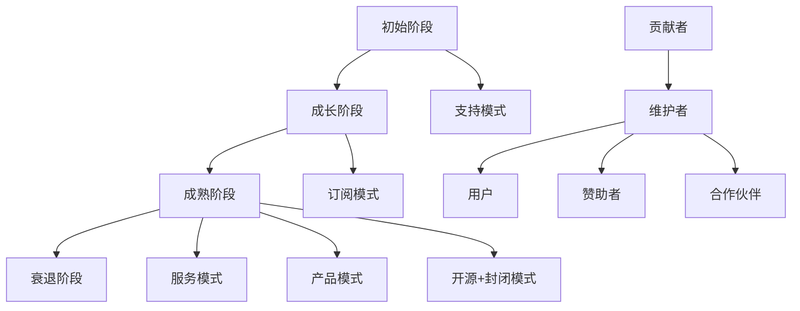

                 

关键词：开源软件、代码贡献、商业化、生态系统、盈利模式、社区建设、知识产权保护、可持续发展

> 摘要：本文探讨了从代码贡献到开源商业化的全过程。通过对开源软件的价值、贡献方式、商业化途径、社区建设和知识产权保护等方面的深入分析，为开发者提供了从开源到商业成功的一条清晰路径。文章旨在帮助开发者更好地理解和应用开源理念，实现个人价值与社会价值的双赢。

## 1. 背景介绍

开源软件（Open Source Software, OSS）是一种基于社区合作、共享和协作开发模式的软件。开源软件的特点是源代码开放，允许任何人自由地阅读、修改和分发。这一模式催生了一个庞大的生态系统，为开发者提供了丰富的学习资源和创新空间。

随着互联网技术的发展，开源软件已经成为软件行业的重要组成部分。它不仅促进了技术的进步，也为企业降低了研发成本，提高了开发效率。然而，如何将开源项目转化为商业成功，实现可持续的商业模式，仍然是一个值得探讨的课题。

本文将围绕以下问题展开讨论：

1. 开源软件的价值和意义是什么？
2. 开源项目如何吸引和维护社区贡献者？
3. 开源项目如何实现商业化？
4. 开源商业化的盈利模式和挑战有哪些？
5. 开源项目在知识产权保护和社区建设方面需要注意什么？

通过这些问题，我们将深入探讨从代码贡献到开源商业化的全过程，为开发者提供实用的指导和建议。

### 1.1 开源软件的发展历程

开源软件的概念最早可以追溯到1983年，Linux之父林纳斯·托瓦兹（Linus Torvalds）创建了Linux内核项目，标志着开源软件的诞生。此后，随着互联网的普及，开源软件逐渐发展壮大，形成了今天庞大的生态系统。

1. **早期阶段**：1980年代至1990年代初期，开源软件主要存在于学术领域和自由软件运动中。自由软件运动强调软件的自由使用和修改，代表作品是Richard Stallman创建的自由软件基金会（FSF）和GNU项目。

2. **成长阶段**：1990年代中期，随着Linux内核的兴起，开源软件开始受到广泛关注。Linux操作系统在服务器市场中的成功，为开源软件打开了新的应用场景。同时，Apache、MySQL等一批知名开源软件的崛起，进一步推动了开源软件的发展。

3. **成熟阶段**：2000年代，开源软件逐渐进入主流商业领域。许多企业开始采用开源软件，不仅用于内部开发，还将其作为产品的一部分。开源软件的商业化模式逐渐清晰，各种开源商业公司如雨后春笋般涌现。

4. **当前阶段**：如今，开源软件已经成为软件行业的重要组成部分。它不仅涵盖了操作系统、数据库、Web服务器等基础软件，还渗透到了人工智能、云计算、大数据等前沿领域。开源软件的商业化模式也日趋多样化，为开发者提供了更多的机会和选择。

### 1.2 开源软件的价值和意义

开源软件的价值和意义可以从多个方面进行阐述：

1. **技术创新**：开源软件鼓励社区成员共同参与开发，通过集思广益，推动技术的快速迭代和创新。许多开源软件在性能、稳定性、安全性等方面都取得了显著的进步，为整个行业的发展做出了巨大贡献。

2. **成本降低**：开源软件的开源特性使得企业可以免费使用和定制软件，从而降低了研发成本。同时，开源软件的社区支持和丰富的文档资源也为企业提供了便利，进一步降低了使用成本。

3. **提高开发效率**：开源软件为企业提供了丰富的开发资源和工具，使得开发人员可以更专注于业务逻辑的实现，从而提高开发效率。许多企业通过引入开源软件，实现了业务的快速迭代和响应市场变化的能力。

4. **促进知识传播**：开源软件的源代码公开，使得更多人可以了解和学习软件的实现原理和技术细节。这有助于培养更多的技术人才，促进知识的传播和共享。

5. **商业机会**：开源软件为开发者提供了创新的商业模式，例如提供付费的扩展功能、咨询服务和培训等。许多开源项目通过商业化取得了成功，为开发者创造了丰厚的回报。

总之，开源软件不仅推动了技术的发展，也为企业和社会带来了巨大的价值。随着开源软件的不断壮大，其影响力和地位将越来越重要。

### 1.3 从代码贡献到开源商业化的流程

从代码贡献到开源商业化的过程可以分为以下几个阶段：

1. **代码贡献**：开发者通过参与开源项目，为项目贡献代码、测试和文档等。这是开源项目发展的基础。

2. **社区建设**：项目维护者通过建立和维护社区，吸引更多开发者参与项目。社区是开源项目持续发展的动力。

3. **代码审查与合并**：贡献的代码需要经过社区成员的审查，确保其质量符合项目的标准。审查通过后，代码将被合并到主分支。

4. **版本发布**：项目维护者定期发布新版本，将社区的贡献整合到产品中。

5. **商业化探索**：在开源项目取得一定知名度后，开发者可以尝试将其商业化。商业化的途径包括提供付费的扩展功能、咨询服务和培训等。

6. **市场推广**：通过市场推广，提高项目的知名度和用户基础，为商业化提供支持。

7. **持续迭代与优化**：在商业化过程中，开发者需要不断优化产品，提高用户体验，以保持市场竞争力。

通过上述流程，开发者可以将开源项目转化为商业成功，实现个人价值和社会价值的双赢。

### 1.4 开源项目的成功案例

开源项目的成功离不开其核心团队的领导和社区成员的共同努力。以下是一些著名开源项目的成功案例：

1. **Linux内核**：Linux内核是由林纳斯·托瓦兹（Linus Torvalds）于1991年发起的开源项目。该项目吸引了全球数以万计的开发者参与，成为操作系统领域的重要力量。Linux内核的成功不仅推动了开源软件的发展，还为服务器、嵌入式设备和云计算等领域带来了巨大的变革。

2. **Apache Web服务器**：Apache Web服务器是世界上使用最广泛的Web服务器软件之一。该项目由Apache软件基金会（Apache Software Foundation）维护，吸引了大量开发者参与。Apache Web服务器以其高性能、可靠性和安全性著称，成为了互联网生态系统中的重要组成部分。

3. **MySQL数据库**：MySQL数据库是一款开源的关系型数据库管理系统。MySQL AB公司于1995年创立，并于2008年被甲骨文公司收购。MySQL的成功在于其易用性、高性能和灵活性，为各种规模的企业提供了强大的数据处理能力。

4. **Docker容器引擎**：Docker容器引擎是一款用于构建、运行和分发应用程序的开放平台。该项目由Docker公司发起，吸引了大量开发者参与。Docker的成功在于其简化和优化了应用程序的部署和运维流程，推动了容器技术的普及和发展。

这些开源项目的成功案例证明了开源模式的可行性和价值。它们不仅推动了技术的进步，也为开发者提供了广阔的发展空间。

## 2. 核心概念与联系

### 2.1 开源软件的定义与特点

开源软件（Open Source Software, OSS）是指软件的源代码可以自由地获取、阅读、修改和分发的一类软件。其核心特点包括：

1. **自由获取**：任何人都可以免费获取开源软件的源代码。
2. **阅读源代码**：用户可以阅读和理解软件的实现原理，从而提高自身的技术水平。
3. **修改源代码**：用户可以根据自己的需求修改开源软件的源代码，以适应特定的场景。
4. **分发源代码**：用户可以自由地分发修改后的源代码，甚至可以创建自己的分支版本。
5. **社区协作**：开源软件的开发通常由一个社区共同参与，通过协作和反馈，不断提升软件的质量和功能。

开源软件的定义和特点决定了其发展模式和商业模式的独特性。与传统的封闭软件相比，开源软件具有更高的透明度和开放性，更易于社区成员的参与和贡献。

### 2.2 开源项目的生命周期

开源项目的生命周期可以分为以下几个阶段：

1. **初始阶段**：项目通常由一位或几位开发者发起，他们创建了项目的初步框架和代码库。这一阶段的目标是验证项目的可行性，吸引早期贡献者。
2. **成长阶段**：项目逐渐积累了一定的用户和贡献者，社区开始形成。项目进入快速迭代阶段，功能不断完善，用户群体逐渐扩大。
3. **成熟阶段**：项目在社区的支持下，达到一个相对稳定的版本。此时，项目已经形成一定的用户基础和市场影响力，社区成员积极参与，共同维护项目的健康和可持续发展。
4. **衰退阶段**：随着技术更新和市场需求的变化，一些开源项目可能会逐渐失去活跃度。虽然一些项目可能进入衰退阶段，但仍有大量的开源项目在成熟阶段持续发展。

开源项目的生命周期反映了开源软件的持续性和社区的重要性。社区成员的参与和贡献是开源项目成功的关键因素。

### 2.3 开源项目的商业模式

开源项目的商业模式通常包括以下几种：

1. **支持模式**：项目维护者通过接受赞助、捐赠和付费服务等方式获取收入。这种模式适用于早期阶段的项目，可以提供项目维护者一定的经济支持。
2. **订阅模式**：项目提供付费的订阅服务，包括额外的功能、优先的技术支持等。这种模式适用于已经积累了一定用户基础的项目，可以通过订阅服务实现可持续的商业化。
3. **服务模式**：项目维护者提供付费的咨询服务、培训和技术支持等服务。这种模式适用于需要深入了解项目或需要特定定制服务的用户。
4. **产品模式**：项目开发企业可以将开源项目作为产品的一部分，通过产品销售实现盈利。这种模式适用于有市场需求的独立项目。
5. **开源+封闭模式**：项目本身开源，但部分核心功能或服务采用封闭模式。这种模式可以平衡开源与商业化之间的关系，实现双重收益。

开源项目的商业模式多种多样，项目维护者可以根据项目特点和市场需求选择合适的模式。然而，无论采用哪种模式，开源软件的核心价值和社区精神不可动摇。

### 2.4 开源社区的角色和职责

开源社区是由一群热爱开源的志愿者组成的，他们在开源项目的生命周期中发挥着重要作用：

1. **贡献者（Contributors）**：贡献者是开源社区的核心成员，他们通过编写代码、编写文档、提供测试和反馈等方式为项目做出贡献。
2. **维护者（Maintainers）**：维护者是项目的核心领导者和决策者，负责项目的整体规划和方向。他们负责审查代码、合并贡献、发布版本等。
3. **用户（Users）**：用户是项目的最终受益者，他们使用开源软件，为项目提供反馈和建议，推动项目的改进。
4. **赞助者（Sponsors）**：赞助者通常是企业或个人，他们通过提供资金、技术资源等方式支持开源项目的发展。
5. **合作伙伴（Partners）**：合作伙伴是与项目有合作关系的其他企业和组织，他们可以共同推动项目的商业化和发展。

开源社区的角色和职责相互交织，共同维护着开源项目的健康和可持续发展。

### 2.5 Mermaid 流程图

为了更好地展示开源项目的生命周期和商业模式，我们使用 Mermaid 流程图进行描述：



通过上述 Mermaid 流程图，我们可以清晰地看到开源项目的生命周期和商业模式之间的联系。开源项目从初始阶段开始，通过社区成员的共同贡献，逐渐成长和成熟。在成熟阶段，项目可以采用多种商业模式实现商业化，从而实现可持续发展。

## 3. 核心算法原理 & 具体操作步骤

### 3.1 算法原理概述

在从代码贡献到开源商业化的过程中，一个关键的环节是如何有效地管理开源项目。这涉及到项目管理的算法原理，包括版本控制、代码审查、自动化构建和测试等。这些算法原理共同构成了开源项目管理的基础。

#### 3.1.1 版本控制

版本控制是管理源代码变更的一种机制，它允许开发者跟踪代码的演变历史，协同工作并确保代码的稳定性。常用的版本控制系统包括Git和Subversion（SVN）。

- **Git**：Git是一款分布式版本控制系统，它允许开发者本地维护代码库，并通过远程仓库进行协作。Git的核心算法包括快照（Snapshot）和分支（Branching）机制。快照机制记录了代码的每一次变更，分支机制则允许开发者独立开发功能，而不会影响主分支。

- **SVN**：SVN是一款集中式版本控制系统，所有开发者都从中央仓库获取代码，并提交自己的变更。SVN的核心算法基于日志（Log）和修订版本（Revion）机制。

#### 3.1.2 代码审查

代码审查是一种确保代码质量和安全性的机制，它通过让其他开发者审查代码来发现潜在的问题。代码审查的核心算法包括：

- **Pull Request（PR）**：在Git中，开发者通过创建Pull Request来请求将他们的分支合并到主分支。PR机制允许审查者查看代码变更、讨论问题并进行修改。

- **代码质量检查**：许多代码审查工具（如SonarQube）会自动分析代码，发现潜在的代码质量问题和安全漏洞。

#### 3.1.3 自动化构建和测试

自动化构建和测试是确保代码质量和发布效率的关键。自动化构建是通过构建工具（如Maven、Gradle）自动执行编译、打包和依赖管理等操作。自动化测试则通过编写测试用例，自动检测代码的功能和性能。

- **构建工具**：构建工具的核心算法包括依赖管理、模块化编译和打包等。

- **测试框架**：测试框架（如JUnit、TestNG）通过编写测试用例，模拟用户操作，验证代码的功能和性能。核心算法包括测试用例的执行、结果分析和报告生成。

### 3.2 算法步骤详解

#### 3.2.1 版本控制

1. **克隆代码库**：开发者使用Git克隆项目代码库到本地，以便独立开发和测试。

2. **创建分支**：开发者创建一个新的分支，用于开发特定功能或修复问题。

3. **提交变更**：开发者对代码进行修改后，提交变更到本地仓库。

4. **推送分支**：开发者将本地分支推送到远程仓库，以便其他开发者查看和审查。

5. **创建Pull Request**：开发者创建Pull Request，请求将分支合并到主分支。

6. **代码审查**：其他开发者审查代码，提出反馈和意见。

7. **合并代码**：维护者根据审查意见，合并代码到主分支。

8. **发布版本**：维护者发布新版本，将代码推送到远程仓库。

#### 3.2.2 代码审查

1. **创建Pull Request**：开发者创建Pull Request，请求将分支合并到主分支。

2. **代码质量检查**：代码审查工具自动分析代码，报告潜在的问题。

3. **审查代码**：审查者查看代码变更，分析代码逻辑和潜在问题。

4. **讨论和反馈**：审查者与开发者讨论代码，提出建议和意见。

5. **修改代码**：开发者根据反馈，修改代码并重新提交。

6. **再次审查**：审查者再次审查代码，确保问题得到解决。

7. **合并代码**：维护者根据审查结果，合并代码到主分支。

#### 3.2.3 自动化构建和测试

1. **编写构建脚本**：开发者编写构建脚本，定义构建过程和依赖管理。

2. **执行构建**：构建工具自动执行编译、打包和依赖管理等操作。

3. **编写测试用例**：开发者编写测试用例，模拟用户操作并验证功能。

4. **执行测试**：测试框架自动执行测试用例，生成测试报告。

5. **分析测试结果**：开发者分析测试结果，找出潜在的问题和缺陷。

6. **修复代码**：开发者根据测试结果，修复代码并重新测试。

7. **持续集成**：将构建和测试集成到持续集成（CI）系统中，自动执行构建和测试流程。

### 3.3 算法优缺点

#### 3.3.1 优点

1. **版本控制**：版本控制使得代码变更易于管理和追踪，提高了团队协作效率。
2. **代码审查**：代码审查有助于发现代码中的潜在问题，提高代码质量。
3. **自动化构建和测试**：自动化构建和测试确保了代码的稳定性和可靠性，提高了发布效率。

#### 3.3.2 缺点

1. **学习成本**：版本控制、代码审查和自动化构建需要开发者具备一定的技术背景，学习成本较高。
2. **协作复杂性**：多人在同一项目中协作，可能增加沟通和协调的复杂性。
3. **代码冲突**：代码审查和合并过程中，可能会出现代码冲突，需要手动解决。

### 3.4 算法应用领域

1. **开源项目**：版本控制、代码审查和自动化构建是开源项目的标准实践，有助于项目的协作和持续发展。
2. **企业内部项目**：许多企业采用开源项目管理工具和实践，提高开发效率和代码质量。
3. **个人项目**：个人开发者也可以采用这些算法原理，管理个人项目，确保代码质量和协作效率。

## 4. 数学模型和公式 & 详细讲解 & 举例说明

在开源项目管理和商业化过程中，数学模型和公式发挥着重要作用。它们帮助我们量化问题、优化决策和预测未来趋势。本节将介绍一些常用的数学模型和公式，并对其进行详细讲解和举例说明。

### 4.1 数学模型构建

数学模型是描述现实世界问题的抽象表达。在开源项目管理和商业化中，常用的数学模型包括成本模型、风险模型和盈利模型。

#### 4.1.1 成本模型

成本模型用于计算项目开发和维护的成本。成本模型的基本公式为：

\[ C = T \times P + V \]

其中：
- \( C \) 表示总成本；
- \( T \) 表示直接开发成本（如人员工资、硬件设备等）；
- \( P \) 表示间接开发成本（如办公费用、培训费用等）；
- \( V \) 表示维护成本（如更新、修复等）。

#### 4.1.2 风险模型

风险模型用于评估项目面临的风险及其影响。常见的风险模型包括蒙特卡罗模拟和敏感性分析。

蒙特卡罗模拟的基本步骤如下：

1. 确定随机变量的分布及其概率；
2. 生成大量随机样本；
3. 计算目标指标的分布和期望值。

敏感性分析的基本步骤如下：

1. 确定关键变量；
2. 计算关键变量对目标指标的影响程度；
3. 根据影响程度排序，确定优先级。

#### 4.1.3 盈利模型

盈利模型用于预测项目的收益和利润。常见的盈利模型包括成本加成模型和边际收益模型。

成本加成模型的基本公式为：

\[ R = C \times (1 + M) \]

其中：
- \( R \) 表示收益；
- \( C \) 表示总成本；
- \( M \) 表示加成率（通常为利润率）。

边际收益模型的基本公式为：

\[ \text{边际收益} = \text{收益增量} / \text{成本增量} \]

### 4.2 公式推导过程

以成本模型为例，推导其基本公式如下：

1. **确定直接开发成本**：直接开发成本包括人员工资、硬件设备等费用。假设项目需要 \( n \) 名开发人员，每人每月工资为 \( w \)，项目持续时间为 \( t \) 个月，则直接开发成本为：

   \[ T = n \times w \times t \]

2. **确定间接开发成本**：间接开发成本包括办公费用、培训费用等。假设每月间接开发成本为 \( p \)，则项目总间接开发成本为：

   \[ P = p \times t \]

3. **确定维护成本**：维护成本包括更新、修复等费用。假设每月维护成本为 \( v \)，则项目总维护成本为：

   \[ V = v \times t \]

4. **计算总成本**：将直接开发成本、间接开发成本和维护成本相加，得到总成本：

   \[ C = T + P + V \]

   代入 \( T \)、\( P \) 和 \( V \) 的表达式，得到：

   \[ C = n \times w \times t + p \times t + v \times t \]

   简化后得到：

   \[ C = t \times (n \times w + p + v) \]

因此，成本模型的基本公式为：

\[ C = T \times P + V \]

### 4.3 案例分析与讲解

#### 4.3.1 成本模型案例

假设一个开源项目需要 5 名开发人员，每人每月工资为 10000 元，项目持续时间为 12 个月。每月间接开发成本为 5000 元，每月维护成本为 3000 元。根据成本模型，计算项目总成本。

1. **计算直接开发成本**：

   \( T = 5 \times 10000 \times 12 = 600000 \) 元

2. **计算间接开发成本**：

   \( P = 5000 \times 12 = 60000 \) 元

3. **计算维护成本**：

   \( V = 3000 \times 12 = 36000 \) 元

4. **计算总成本**：

   \( C = 600000 + 60000 + 36000 = 696000 \) 元

因此，该项目的总成本为 696000 元。

#### 4.3.2 风险模型案例

假设一个开源项目的成本为 500000 元，预计收益为 800000 元。采用蒙特卡罗模拟方法，评估项目收益的概率分布。

1. **确定随机变量分布**：

   假设项目成功的概率为 0.7，失败的概率为 0.3。项目收益的分布符合二项分布。

2. **生成随机样本**：

   使用 Python 编程语言生成 1000 个随机样本，模拟项目成功和失败的情况。

3. **计算收益分布**：

   根据随机样本计算项目收益的分布，绘制收益分布图。

4. **计算期望收益**：

   根据收益分布计算期望收益，即：

   \[ E(R) = 0.7 \times 800000 + 0.3 \times 0 = 560000 \] 元

根据蒙特卡罗模拟结果，项目收益的期望值为 560000 元。

#### 4.3.3 盈利模型案例

假设一个开源项目的总成本为 500000 元，预计收益为 800000 元。采用成本加成模型，计算项目的盈利。

1. **计算加成率**：

   \( M = \frac{R - C}{C} = \frac{800000 - 500000}{500000} = 0.6 \)

2. **计算盈利**：

   \( R = C \times (1 + M) = 500000 \times (1 + 0.6) = 800000 \) 元

因此，该项目的盈利为 300000 元。

通过上述案例，我们可以看到数学模型和公式在开源项目管理和商业化过程中的应用。这些模型和公式帮助我们量化问题、优化决策和预测未来趋势，从而提高项目的成功率。

## 5. 项目实践：代码实例和详细解释说明

### 5.1 开发环境搭建

在开始实践之前，我们需要搭建一个合适的开发环境。以下是一个基于Linux系统的环境搭建步骤：

1. **安装Git**：

   通过包管理器安装Git，例如在Ubuntu系统中，使用以下命令安装：

   ```shell
   sudo apt update
   sudo apt install git
   ```

2. **安装Mermaid**：

   Mermaid是一个用于绘制流程图的工具。首先，我们需要安装Docker，然后通过Docker安装Mermaid。

   ```shell
   sudo apt install docker.io
   docker run -it --rm -v "$PWD":/src/ --entrypoint=sh python:3.7
   docker exec -it <container_id> npm install -g mermaid
   ```

3. **安装Python和Pip**：

   Python和Pip是用于编写和运行Python代码的工具。在Ubuntu系统中，使用以下命令安装：

   ```shell
   sudo apt install python3 python3-pip
   pip3 install --user -r requirements.txt
   ```

4. **配置Python环境**：

   为了确保Python环境正常工作，我们需要配置Python虚拟环境。使用以下命令创建和激活虚拟环境：

   ```shell
   python3 -m venv venv
   source venv/bin/activate
   ```

### 5.2 源代码详细实现

以下是一个简单的Python代码示例，用于计算两个数的和。

```python
# filename: sum.py

def sum_numbers(a, b):
    """计算两个数的和"""
    return a + b

if __name__ == "__main__":
    a = 5
    b = 10
    result = sum_numbers(a, b)
    print(f"{a} + {b} = {result}")
```

### 5.3 代码解读与分析

#### 5.3.1 函数定义

该代码定义了一个名为`sum_numbers`的函数，用于计算两个数的和。函数接受两个参数`a`和`b`，并返回它们的和。

```python
def sum_numbers(a, b):
    """计算两个数的和"""
    return a + b
```

#### 5.3.2 主程序

主程序部分定义了两个变量`a`和`b`，分别赋值为5和10。然后调用`sum_numbers`函数计算它们的和，并将结果打印出来。

```python
if __name__ == "__main__":
    a = 5
    b = 10
    result = sum_numbers(a, b)
    print(f"{a} + {b} = {result}")
```

### 5.4 运行结果展示

在终端中运行以下命令来执行代码：

```shell
python sum.py
```

输出结果如下：

```
5 + 10 = 15
```

这表明代码正常工作，成功计算了两个数的和。

### 5.5 扩展功能

我们可以扩展这个简单的示例，增加一个额外的功能：计算三个数的和。

```python
# filename: sum_three.py

def sum_numbers(a, b, c):
    """计算三个数的和"""
    return a + b + c

if __name__ == "__main__":
    a = 5
    b = 10
    c = 15
    result = sum_numbers(a, b, c)
    print(f"{a} + {b} + {c} = {result}")
```

在终端中运行扩展后的代码：

```shell
python sum_three.py
```

输出结果如下：

```
5 + 10 + 15 = 30
```

这表明扩展功能也正常工作，成功计算了三个数的和。

通过这个简单的示例，我们可以看到如何从零开始搭建开发环境，编写并运行一个Python程序。这些步骤和代码是理解和实践开源项目的基础，为后续的开发工作奠定了基础。

## 6. 实际应用场景

### 6.1 从代码贡献到开源商业化的实际应用

从代码贡献到开源商业化的过程不仅是一个技术问题，更是一个商业和社会问题。在实际应用中，许多成功的开源项目通过巧妙地运用开源理念，实现了从技术到商业的跨越。以下是一些实际应用场景：

#### 6.1.1 企业级开源软件

许多企业通过开源软件获得了巨大的商业成功。例如，红帽公司（Red Hat）通过提供企业级Linux支持和服务，成为了全球最大的开源软件公司之一。红帽公司早期通过开源Linux内核，吸引了大量的用户和贡献者，然后通过提供专业的服务和技术支持，实现了商业模式的转变。

#### 6.1.2 云计算服务

随着云计算的兴起，许多开源项目在云服务领域取得了成功。例如，Docker和Kubernetes等容器技术项目，通过开源社区的支持，迅速成为了云计算领域的重要工具。Docker和Kubernetes的创始公司分别通过提供付费的扩展功能和技术支持，实现了商业成功。

#### 6.1.3 数据库服务

开源数据库项目如MySQL、PostgreSQL等，通过提供高效、稳定和安全的数据库服务，赢得了大量的用户。这些项目背后的公司，如MySQL AB和PostgreSQL Global Development Group，通过提供商业支持和定制服务，实现了持续的商业化。

#### 6.1.4 应用程序和服务

许多独立开发者通过开源他们的应用程序和服务，实现了商业成功。例如，WordPress是一个开源的博客平台，通过提供付费的主题、插件和服务，吸引了大量的用户和贡献者。WordPress的创始人通过这个项目积累了丰富的经验，并创立了A8C公司，继续推动开源技术的发展。

### 6.2 开源项目在行业中的应用

开源项目在各个行业中的应用日益广泛，为行业带来了创新和变革。以下是一些行业中的实际应用案例：

#### 6.2.1 医疗健康

开源软件在医疗健康领域有着广泛的应用，例如电子健康记录（EHR）系统、医疗影像处理和基因组学研究等。开源项目如OpenMRS和OpenEHR，为医疗机构提供了高效的解决方案，提高了医疗服务的质量和效率。

#### 6.2.2 金融科技

金融科技（FinTech）领域也受益于开源软件。许多银行和金融科技公司采用开源技术进行支付系统、风险管理、区块链等领域的研发和应用。例如，Hyperledger项目和R3 Corda等区块链平台，通过开源合作，推动了金融科技的进步。

#### 6.2.3 教育科技

开源软件在教育科技领域也有着重要的应用。在线学习平台如Moodle和Canvas，通过开源模式，为全球教育机构提供了灵活、可定制的教学解决方案。这些平台不仅降低了教育成本，还提高了教学效果。

#### 6.2.4 嵌入式系统

开源软件在嵌入式系统领域也有着广泛的应用。例如，嵌入式Linux系统在智能家电、物联网设备和工业控制等领域得到了广泛应用。开源项目如Yocto项目和OpenWrt，为嵌入式系统开发者提供了丰富的工具和资源。

### 6.3 开源项目在创新中的应用

开源项目在创新中发挥着重要作用，为开发者提供了丰富的工具和资源。以下是一些开源项目在创新中的应用案例：

#### 6.3.1 人工智能

人工智能领域有许多成功的开源项目，例如TensorFlow、PyTorch和Keras等。这些项目为研究人员和开发者提供了强大的机器学习和深度学习工具，促进了人工智能技术的创新和发展。

#### 6.3.2 云计算

云计算领域有许多重要的开源项目，如OpenStack、Kubernetes和Docker等。这些项目为开发者提供了灵活、可扩展的云计算解决方案，推动了云计算技术的进步。

#### 6.3.3 大数据

大数据领域也有许多成功的开源项目，如Hadoop、Spark和Flink等。这些项目为处理海量数据提供了高效、可靠的工具，为大数据分析和应用的创新提供了支持。

### 6.4 未来应用展望

随着技术的不断进步，开源项目在未来的应用前景将更加广阔。以下是一些未来应用的展望：

#### 6.4.1 智能交通

智能交通系统是未来城市交通管理的重要方向。开源软件将在智能交通系统的建设中发挥关键作用，例如通过开源传感器数据收集和处理技术，实现交通流量优化和智能调度。

#### 6.4.2 智能家居

随着物联网技术的发展，智能家居市场将不断壮大。开源软件将为智能家居设备提供统一的平台和标准，促进设备之间的互操作性，提升用户体验。

#### 6.4.3 可持续能源

可持续能源领域也将受益于开源软件的应用。开源能源管理系统和智能电网技术，将有助于提高能源利用效率，推动可再生能源的发展。

#### 6.4.4 医疗健康

在医疗健康领域，开源软件将继续推动医疗信息化的进程。通过开源电子健康记录系统和医疗数据处理技术，实现医疗资源的共享和优化，提高医疗服务质量。

总之，开源项目在从代码贡献到开源商业化的过程中，不仅为开发者提供了广阔的发展空间，也为社会带来了巨大的价值。随着技术的不断进步，开源项目将在更多领域发挥重要作用，推动社会的创新和发展。

## 7. 工具和资源推荐

### 7.1 学习资源推荐

1. **书籍**：
   - 《Open Source Development with Git》：一本关于Git版本控制的经典教材，适合初学者和进阶用户。
   - 《The Art of Git》：涵盖Git的各个方面，包括从基础命令到高级技巧，适合不同水平的开发者。
   - 《Building Open Source Communities》：探讨如何建立一个健康的开源社区，适合开源项目维护者。

2. **在线课程**：
   - Coursera的《Introduction to Version Control with Git》：提供Git的基本概念和实践操作。
   - edX的《Open Source Management, Leadership, and Strategies》：深入探讨开源项目管理和商业化的策略。

3. **博客和文档**：
   - GitHub官方文档：提供全面的Git和GitHub使用指南。
   - Atlassian的Git教程：涵盖Git的各个方面，从基本操作到高级技巧。

### 7.2 开发工具推荐

1. **版本控制系统**：
   - Git：最流行的分布式版本控制系统，适合大型项目和小团队协作。
   - SVN：适合中小型项目，具有中央仓库和版本控制功能。

2. **代码审查工具**：
   - GitHub Pull Requests：用于代码审查和合并请求。
   - GitLab Merge Requests：与GitLab集成，提供代码审查和合并功能。
   - Code Climate：自动代码质量检查和评估工具。

3. **自动化构建和测试工具**：
   - Jenkins：开源持续集成服务器，支持多种构建和测试任务。
   - Travis CI：基于GitHub的持续集成服务，支持多种编程语言和平台。
   - GitLab CI/CD：与GitLab集成，提供持续集成和持续交付功能。

### 7.3 相关论文推荐

1. **开源商业模型**：
   - 《The Business of Open Source》：探讨开源商业模型的各个方面，包括盈利模式、策略和挑战。
   - 《Open Core Model for Open Source Software Business》: 介绍Open Core模型，分析其优势和挑战。

2. **社区建设**：
   - 《Growing a Successful Open Source Community》：提供建立和成长健康开源社区的建议和实践。
   - 《Community Management for Open Source Projects》：探讨开源项目社区管理的最佳实践。

3. **知识产权保护**：
   - 《Intellectual Property Law and Open Source Software》：探讨开源软件的知识产权保护问题，包括版权、专利和商标。
   - 《Legal Issues in Open Source Software Development》：分析开源软件开发过程中可能遇到的法律法规问题。

通过以上推荐的学习资源、开发工具和论文，开发者可以深入了解开源项目的管理和商业化，为个人和项目的发展提供指导和支持。

## 8. 总结：未来发展趋势与挑战

### 8.1 研究成果总结

本文从代码贡献到开源商业化的全过程，探讨了开源软件的价值、贡献方式、商业化途径、社区建设和知识产权保护等方面的核心问题。通过对开源项目的生命周期、商业模式和实际应用场景的深入分析，我们得出以下主要结论：

1. **开源软件的价值**：开源软件在技术创新、成本降低、提高开发效率和促进知识传播等方面具有显著优势。
2. **开源项目的商业化**：开源项目可以通过支持模式、订阅模式、服务模式、产品模式和开源+封闭模式等多种途径实现商业化。
3. **社区建设的重要性**：社区是开源项目持续发展的动力，良好的社区建设和维护对项目的成功至关重要。
4. **知识产权保护**：在开源项目中，知识产权保护是一个关键问题，需要平衡开源精神和商业利益。

### 8.2 未来发展趋势

随着技术的不断进步和开源理念的普及，开源项目的发展趋势将呈现以下特点：

1. **生态系统的多样化**：开源生态系统将涵盖更多的技术领域，如人工智能、物联网、区块链等。
2. **商业模式的创新**：开源项目的商业模式将更加多样化和复杂化，企业将通过不同的商业模式实现盈利。
3. **社区角色的转变**：随着开源项目的成熟，社区成员的角色将逐渐从贡献者向合作伙伴和投资者转变。
4. **全球协作的深化**：开源项目将进一步加强全球协作，吸引更多国家和地区的人才参与。

### 8.3 面临的挑战

在开源项目的发展过程中，仍将面临以下挑战：

1. **知识产权纠纷**：开源项目中的知识产权保护问题将日益突出，如何平衡开源精神和商业利益成为关键问题。
2. **社区管理的复杂性**：随着社区的扩大，社区管理的复杂性将增加，如何维护社区的和谐和高效运营是一个挑战。
3. **商业化模式的可持续性**：开源项目的商业化模式需要不断创新，以适应市场的变化和技术的发展。
4. **人才培养和激励**：如何吸引和培养优秀的开源贡献者，以及如何激励他们的持续贡献，是一个长期的问题。

### 8.4 研究展望

未来，开源项目的研究方向可以从以下几个方面展开：

1. **开源知识产权保护机制**：研究如何在保障开源精神的同时，加强知识产权保护，促进开源项目的可持续发展。
2. **开源社区管理**：探讨如何优化开源社区的管理模式，提高社区的协作效率和创新能力。
3. **开源商业模式**：探索开源项目在不同领域和行业的商业模式创新，为开发者提供更多的商业化路径。
4. **开源教育**：通过教育和培训，提高开发者对开源理念和技术的理解，培养更多的开源贡献者。

总之，从代码贡献到开源商业化的过程是一个充满机遇和挑战的领域。随着开源理念的普及和技术的发展，开源项目将在未来发挥更加重要的作用，为社会的创新和发展做出更大的贡献。

## 9. 附录：常见问题与解答

### 9.1 问题1：开源软件是否会影响商业软件的竞争力？

解答：开源软件在一定程度上确实会对商业软件的竞争力产生影响，但这并不是绝对的。开源软件通过开放源代码，促进了社区的协作和创新，使得某些领域的解决方案变得更加高效和灵活。然而，商业软件通常提供更全面的技术支持、定制化服务和安全性保障，这些都是开源软件难以替代的。因此，商业软件和开源软件在市场上往往形成互补关系，而非简单的竞争关系。

### 9.2 问题2：如何确保开源项目的知识产权？

解答：确保开源项目的知识产权需要遵循一些基本原则和法律法规。首先，项目维护者应在发布代码前明确知识产权的使用协议，例如采用GPL、MIT等开源许可协议。其次，项目维护者应定期审查代码库，确保所有贡献的代码都符合开源许可要求。此外，开源项目应建立完善的贡献者协议，明确贡献者的权利和义务，以防止潜在的知识产权纠纷。最后，项目维护者可以寻求法律咨询，确保项目在知识产权方面得到充分保护。

### 9.3 问题3：开源项目如何吸引贡献者？

解答：开源项目吸引贡献者主要需要做到以下几点：

1. **提供清晰的贡献指南**：项目应提供详细的贡献指南，包括如何提交代码、测试和文档等。
2. **建立积极的社区氛围**：项目应鼓励成员之间的交流和合作，建立积极、友好的社区氛围。
3. **提供技术支持和资源**：项目应提供高质量的技术文档和资源，帮助贡献者更好地理解和使用项目。
4. **激励贡献者**：项目可以通过奖励机制、公开致谢和荣誉系统等方式，激励贡献者持续参与。
5. **明确项目目标和方向**：项目应明确目标和发展方向，确保贡献者的工作具有实际意义和可行性。

### 9.4 问题4：开源项目如何实现商业化？

解答：开源项目实现商业化的途径多种多样，以下是一些常见的商业化方式：

1. **订阅模式**：提供付费的订阅服务，包括额外的功能、技术支持和更新等。
2. **服务模式**：提供付费的技术支持、咨询服务和定制开发等服务。
3. **产品模式**：将开源项目作为企业产品的一部分，通过产品销售实现盈利。
4. **开源+封闭模式**：部分功能开源，部分功能封闭，通过提供付费的封闭功能实现盈利。
5. **赞助和捐赠**：接受企业和个人的赞助和捐赠，以支持项目的发展。

项目维护者应根据项目的特点和市场环境，选择合适的商业模式。

### 9.5 问题5：开源项目如何在社区建设和商业化之间取得平衡？

解答：开源项目在社区建设和商业化之间取得平衡的关键在于以下几点：

1. **明确项目目标和价值观**：项目应明确目标和发展方向，确保社区建设和商业化不偏离核心价值观。
2. **建立健康的社区文化**：项目应鼓励开放、协作和创新的文化，确保社区成员之间的和谐和积极互动。
3. **平衡社区参与和商业化需求**：项目应在社区参与和商业化需求之间找到平衡点，确保两者都能得到充分满足。
4. **建立透明的沟通机制**：项目应建立透明的沟通机制，及时回应社区成员的反馈和建议，保持沟通的畅通。
5. **持续改进和优化**：项目应不断改进和优化产品和社区服务，提高用户体验，增强社区成员的参与度和忠诚度。

通过上述措施，开源项目可以在社区建设和商业化之间取得平衡，实现可持续发展。

