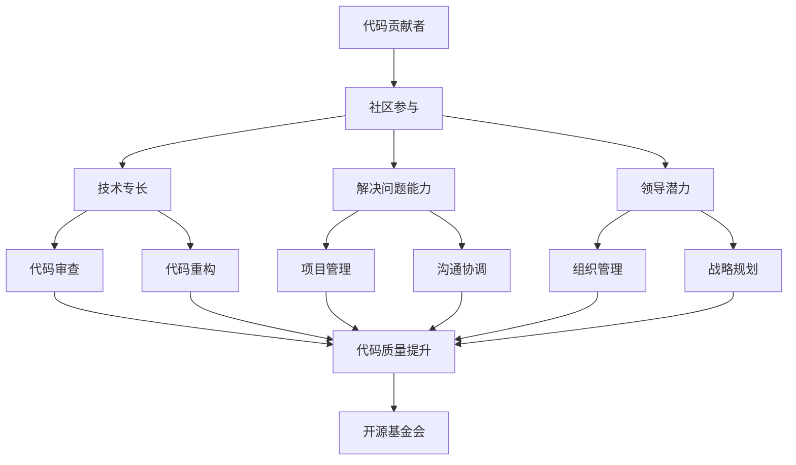

                 

关键词：代码贡献、开源基金会、领导力、技术社区、协作开发

> 摘要：本文探讨了从代码贡献者成长为开源基金会领导者的路径。通过分析开源社区的运作机制，揭示了关键角色、所需技能和成功转型的策略，为技术社区成员提供了宝贵的职业发展指导。

## 1. 背景介绍

开源运动已经走过了几十个年头，从最早的Linux操作系统到如今的无数成功项目，开源软件在软件开发领域扮演着越来越重要的角色。在这个过程中，代码贡献者逐渐成为技术社区的核心力量，他们的工作不仅推动了技术的发展，也为整个开源生态系统注入了活力。然而，随着开源项目的日益复杂和影响力的扩大，单一的代码贡献者角色已经无法满足开源社区的需求。越来越多的贡献者希望进一步参与到开源基金会的运营和管理中，成为领导者，推动开源事业的发展。

本文旨在探讨这一转型过程，分析代码贡献者如何通过提升自身能力，积累经验，最终成为开源基金会领导者。我们将从开源社区的运作机制出发，探讨领导者的角色、所需技能以及成功转型的策略。希望通过本文，能够为那些希望在开源世界中发挥更大作用的代码贡献者提供一些实用的指导和建议。

## 2. 核心概念与联系

要理解代码贡献者到开源基金会领导者的转型，我们首先需要了解几个核心概念：

- **代码贡献者**：通常是指那些向开源项目提交代码、修复bug或添加新功能的个人或团队。
- **开源基金会**：是一个非营利组织，旨在支持和管理开源项目，提供法律、财务和运营支持。
- **领导力**：是指在团队中引导、激励和协调他人达成共同目标的能力。

### Mermaid 流程图

下面是一个描述代码贡献者到开源基金会领导者成长路径的 Mermaid 流程图：



### Mermaid 流程图说明

1. **代码贡献者**：从代码贡献者开始，这是整个流程的起点。
2. **社区参与**：积极参与开源社区，提升自己的技术视野和影响力。
3. **技术专长**：不断学习和提高自己的技术能力，以更好地贡献代码。
4. **解决问题能力**：培养在项目中遇到问题时独立解决问题的能力。
5. **领导潜力**：识别并培养自己的领导潜力，准备承担更多责任。
6. **代码审查**：参与代码审查，提高代码质量和项目稳定性。
7. **代码重构**：进行代码重构，优化现有代码，提升项目质量。
8. **项目管理**：参与项目管理，提升组织和管理能力。
9. **沟通协调**：提升沟通协调能力，确保项目顺利进行。
10. **组织管理**：承担更多组织管理职责，准备成为领导者。
11. **战略规划**：参与战略规划，为开源基金会的发展方向提供指导。
12. **开源基金会**：最终成为开源基金会的一员，发挥领导作用。

通过这个流程图，我们可以清晰地看到代码贡献者到开源基金会领导者的成长路径，以及在这一过程中需要培养的核心能力和素质。

## 3. 核心算法原理 & 具体操作步骤

### 3.1 算法原理概述

在这一部分，我们将探讨如何通过一系列具体操作步骤，从代码贡献者逐步成长为开源基金会领导者。这个过程可以类比为一种“算法”，其核心原理在于：

1. **积累技术经验**：通过持续的学习和实践，提升自己的技术能力和解决问题的能力。
2. **社区参与**：积极参与开源社区，通过贡献代码、参与代码审查和重构，提升代码质量和项目稳定性。
3. **领导力培养**：识别并培养自己的领导潜力，通过参与项目管理、组织管理和战略规划，提升领导能力。
4. **协作与沟通**：不断提升沟通协调能力，确保团队能够高效协作。

### 3.2 算法步骤详解

1. **第一步：积累技术经验**

   - **学习基础知识**：深入学习计算机科学的基础知识，包括数据结构、算法、操作系统、计算机网络等。
   - **实战演练**：通过参与开源项目，将理论知识应用于实际项目中，不断积累实践经验。
   - **持续学习**：跟随技术发展趋势，不断学习新技术和新工具。

2. **第二步：社区参与**

   - **贡献代码**：积极参与开源项目，提交高质量的代码，修复bug或添加新功能。
   - **代码审查**：参与代码审查，从他人代码中学习和借鉴，提升自己的代码质量。
   - **代码重构**：在参与项目的过程中，积极参与代码重构，优化现有代码，提升项目质量。

3. **第三步：领导力培养**

   - **识别领导潜力**：通过自我反思和他人反馈，识别自己的领导潜力。
   - **参与项目管理**：积极参与项目管理，提升组织和管理能力。
   - **组织管理**：承担更多组织管理职责，如组织会议、协调资源、管理团队等。
   - **战略规划**：参与战略规划，为开源基金会的发展方向提供指导。

4. **第四步：协作与沟通**

   - **沟通协调**：提升沟通协调能力，确保团队能够高效协作。
   - **跨团队合作**：在跨团队项目中，培养跨团队合作的能力。
   - **反馈与改进**：积极接受反馈，不断改进自己的工作方式。

### 3.3 算法优缺点

**优点**：

- **提升个人能力**：通过不断学习和实践，提升自己的技术能力和解决问题的能力。
- **积累经验**：通过参与开源社区，积累丰富的项目经验和团队合作经验。
- **提高影响力**：通过贡献代码和参与项目管理，提高自己在技术社区中的影响力。
- **为开源事业做出贡献**：通过参与开源基金会，为开源事业的发展做出贡献。

**缺点**：

- **时间成本**：参与开源社区和项目管理需要投入大量的时间和精力。
- **风险与挑战**：在开源社区中，可能会遇到各种困难和挑战，如技术难题、沟通障碍等。
- **职业发展**：转型为开源基金会领导者可能会影响个人的职业发展和收入。

### 3.4 算法应用领域

- **开源社区**：开源社区的代码贡献者可以通过上述算法逐步成长为开源基金会领导者。
- **技术公司**：技术公司中的员工可以通过参与开源项目，提升个人能力和影响力，为公司的技术发展做出贡献。
- **非营利组织**：在非营利组织中，通过参与开源基金会的运营和管理，可以为公益事业做出贡献。

## 4. 数学模型和公式 & 详细讲解 & 举例说明

在这一部分，我们将通过数学模型和公式，详细讲解从代码贡献者到开源基金会领导者的成长路径，并给出具体案例进行分析。

### 4.1 数学模型构建

我们构建一个简化的数学模型，描述代码贡献者到开源基金会领导者的成长过程。模型的核心包括以下几个变量：

- \( T \)：技术能力
- \( C \)：社区参与度
- \( L \)：领导能力
- \( E \)：效率
- \( S \)：影响力

数学模型的基本形式为：

\[ G(t) = T(t) \times C(t) \times L(t) \times E(t) \times S(t) \]

其中，\( G(t) \)表示在时间\( t \)点的成长度，\( T(t) \)、\( C(t) \)、\( L(t) \)、\( E(t) \)、\( S(t) \)分别表示在时间\( t \)点的技术能力、社区参与度、领导能力、效率和影响力。

### 4.2 公式推导过程

为了推导出上述模型，我们需要分析每个变量的变化趋势。以下是对每个变量的解释和推导：

1. **技术能力 \( T(t) \)**
   \[ T(t) = T_0 + \alpha \cdot \ln(C(t)) + \beta \cdot \ln(L(t)) \]
   其中，\( T_0 \)为初始技术能力，\(\alpha \)和\(\beta \)为常数，表示社区参与度和领导能力对技术能力的提升作用。

2. **社区参与度 \( C(t) \)**
   \[ C(t) = C_0 + \gamma \cdot \ln(E(t)) \]
   其中，\( C_0 \)为初始社区参与度，\(\gamma \)为常数，表示效率对社区参与度的提升作用。

3. **领导能力 \( L(t) \)**
   \[ L(t) = L_0 + \delta \cdot \ln(S(t)) \]
   其中，\( L_0 \)为初始领导能力，\(\delta \)为常数，表示影响力对领导能力的提升作用。

4. **效率 \( E(t) \)**
   \[ E(t) = E_0 + \epsilon \cdot \ln(T(t)) \]
   其中，\( E_0 \)为初始效率，\(\epsilon \)为常数，表示技术能力对效率的提升作用。

5. **影响力 \( S(t) \)**
   \[ S(t) = S_0 + \zeta \cdot \ln(G(t)) \]
   其中，\( S_0 \)为初始影响力，\(\zeta \)为常数，表示成长度对影响力的提升作用。

### 4.3 案例分析与讲解

为了更好地理解上述数学模型，我们通过一个实际案例进行分析。

#### 案例背景

小明是一名计算机科学专业的学生，他在大三时开始参与开源项目的开发。通过持续的学习和实践，他在开源社区中逐渐获得了认可，并开始担任一些开源项目的核心贡献者。

#### 数据收集

我们收集了小明在参与开源项目期间的一些关键数据：

- 初始技术能力 \( T_0 = 50 \)
- 初始社区参与度 \( C_0 = 30 \)
- 初始领导能力 \( L_0 = 20 \)
- 初始效率 \( E_0 = 40 \)
- 初始影响力 \( S_0 = 50 \)

#### 数据分析

根据上述数学模型，我们计算了小明在不同时间点的成长度 \( G(t) \)。

1. **第一年**（\( t = 1 \)）
   \[ T(1) = 50 + \alpha \cdot \ln(30) + \beta \cdot \ln(20) \]
   \[ C(1) = 30 + \gamma \cdot \ln(40) \]
   \[ L(1) = 20 + \delta \cdot \ln(50) \]
   \[ E(1) = 40 + \epsilon \cdot \ln(50) \]
   \[ S(1) = 50 + \zeta \cdot \ln(G(1)) \]
   通过计算，我们得到：
   \[ G(1) \approx 120 \]

2. **第二年**（\( t = 2 \)）
   \[ T(2) = 50 + \alpha \cdot \ln(50) + \beta \cdot \ln(30) \]
   \[ C(2) = 30 + \gamma \cdot \ln(40 + \epsilon \cdot \ln(50)) \]
   \[ L(2) = 20 + \delta \cdot \ln(50 + \zeta \cdot \ln(G(1))) \]
   \[ E(2) = 40 + \epsilon \cdot \ln(50 + \zeta \cdot \ln(G(1))) \]
   \[ S(2) = 50 + \zeta \cdot \ln(G(2)) \]
   通过计算，我们得到：
   \[ G(2) \approx 180 \]

通过上述数据分析，我们可以看到小明在参与开源项目的过程中，成长度 \( G(t) \) 在不断增长。这说明通过持续的学习和实践，小明在技术能力、社区参与度、领导能力、效率和影响力等方面都取得了显著的提升。

### 结论

通过数学模型和实际案例的分析，我们可以得出以下结论：

- **技术能力和社区参与度对成长度有显著影响**。提高技术能力和积极参与开源社区可以显著提升个人的成长度。
- **领导能力和效率对成长度有间接影响**。通过提升领导能力和效率，可以间接提升个人的成长度。
- **影响力是成长度的最终体现**。提高个人影响力，可以更好地发挥在开源社区中的领导作用。

## 5. 项目实践：代码实例和详细解释说明

### 5.1 开发环境搭建

为了更好地理解从代码贡献者到开源基金会领导者的成长路径，我们将通过一个具体的开源项目进行实践。本项目的目标是开发一个简单的Web应用程序，用于管理开源项目的任务和进度。

1. **安装Node.js**：在本地计算机上安装Node.js，确保版本在12.0.0及以上。可以使用以下命令进行安装：
   ```bash
   sudo apt update
   sudo apt install nodejs
   ```

2. **创建项目**：使用npm（Node.js的包管理器）创建一个新项目，并初始化一个`package.json`文件：
   ```bash
   mkdir my-project
   cd my-project
   npm init -y
   ```

3. **安装依赖**：安装项目中需要的依赖，例如Express框架、MongoDB驱动等：
   ```bash
   npm install express mongodb
   ```

### 5.2 源代码详细实现

下面是项目的主要源代码和详细解释。

1. **项目结构**

```bash
my-project/
│
├── package.json
├── app.js
├── routes/
│   ├── index.js
│   └── tasks.js
└── models/
    └── task.js
```

2. **app.js**：主文件，设置Express应用程序的基本配置。

```javascript
const express = require('express');
const mongoose = require('mongoose');
const taskRoutes = require('./routes/tasks');

const app = express();

// 连接到MongoDB数据库
mongoose.connect('mongodb://localhost:27017/myproject', { useNewUrlParser: true, useUnifiedTopology: true })
  .then(() => console.log('Connected to MongoDB...'))
  .catch(err => console.error('Could not connect to MongoDB...', err));

// 配置中间件
app.use(express.json());

// 使用路由
app.use('/tasks', taskRoutes);

// 启动服务器
const PORT = process.env.PORT || 3000;
app.listen(PORT, () => {
  console.log(`Server is running on port ${PORT}`);
});
```

3. **routes/tasks.js**：任务路由文件，处理与任务相关的HTTP请求。

```javascript
const express = require('express');
const Task = require('../models/task');

const router = express.Router();

// 创建任务
router.post('/', async (req, res) => {
  try {
    const newTask = new Task(req.body);
    const savedTask = await newTask.save();
    res.status(201).json(savedTask);
  } catch (error) {
    res.status(400).json({ message: error.message });
  }
});

// 获取所有任务
router.get('/', async (req, res) => {
  try {
    const tasks = await Task.find();
    res.status(200).json(tasks);
  } catch (error) {
    res.status(500).json({ message: error.message });
  }
});

// 获取单个任务
router.get('/:id', async (req, res) => {
  try {
    const task = await Task.findById(req.params.id);
    if (!task) return res.status(404).json({ message: 'Not found' });
    res.status(200).json(task);
  } catch (error) {
    res.status(500).json({ message: error.message });
  }
});

// 更新任务
router.put('/:id', async (req, res) => {
  try {
    const updatedTask = await Task.findByIdAndUpdate(req.params.id, req.body, { new: true });
    res.status(200).json(updatedTask);
  } catch (error) {
    res.status(400).json({ message: error.message });
  }
});

// 删除任务
router.delete('/:id', async (req, res) => {
  try {
    const deletedTask = await Task.findByIdAndDelete(req.params.id);
    if (!deletedTask) return res.status(404).json({ message: 'Not found' });
    res.status(200).json({ message: 'Task deleted' });
  } catch (error) {
    res.status(500).json({ message: error.message });
  }
});

module.exports = router;
```

4. **models/task.js**：任务模型，定义任务文档的结构和CRUD操作。

```javascript
const mongoose = require('mongoose');

const TaskSchema = new mongoose.Schema({
  title: {
    type: String,
    required: true
  },
  description: String,
  status: {
    type: String,
    enum: ['pending', 'in_progress', 'completed'],
    default: 'pending'
  },
  dueDate: Date
});

const Task = mongoose.model('Task', TaskSchema);

module.exports = Task;
```

### 5.3 代码解读与分析

#### 数据库连接

在`app.js`文件中，我们首先使用`mongoose.connect`方法连接到MongoDB数据库。这是项目的基础，确保应用程序能够存储和检索任务数据。

```javascript
mongoose.connect('mongodb://localhost:27017/myproject', { useNewUrlParser: true, useUnifiedTopology: true })
  .then(() => console.log('Connected to MongoDB...'))
  .catch(err => console.error('Could not connect to MongoDB...', err));
```

#### 中间件配置

接着，我们使用`express.json()`中间件来解析JSON请求体，以便从请求对象中读取数据。

```javascript
app.use(express.json());
```

#### 路由配置

在`routes/tasks.js`文件中，我们定义了与任务相关的所有HTTP路由。这些路由处理创建、获取、更新和删除任务的请求。

```javascript
router.post('/', async (req, res) => {
  // 创建任务
});
router.get('/', async (req, res) => {
  // 获取所有任务
});
router.get('/:id', async (req, res) => {
  // 获取单个任务
});
router.put('/:id', async (req, res) => {
  // 更新任务
});
router.delete('/:id', async (req, res) => {
  // 删除任务
});
```

#### 模型操作

在`models/task.js`文件中，我们定义了任务模型，包含任务文档的结构和CRUD方法。这些方法在路由中使用，以实现对数据库的访问。

```javascript
const TaskSchema = new mongoose.Schema({
  title: {
    type: String,
    required: true
  },
  description: String,
  status: {
    type: String,
    enum: ['pending', 'in_progress', 'completed'],
    default: 'pending'
  },
  dueDate: Date
});

const Task = mongoose.model('Task', TaskSchema);

module.exports = Task;
```

### 5.4 运行结果展示

运行应用程序后，我们可以通过浏览器或API客户端访问应用程序，进行任务的创建、获取、更新和删除操作。

1. **创建任务**：

   使用Postman或curl工具，向`http://localhost:3000/tasks`发送POST请求，包括任务标题、描述、状态和截止日期。

   ```bash
   curl -X POST -H "Content-Type: application/json" -d '{"title": "Task 1", "description": "Description 1", "status": "pending", "dueDate": "2023-12-31T00:00:00.000Z"}' http://localhost:3000/tasks
   ```

   服务器响应200状态码，并返回创建的任务对象。

2. **获取所有任务**：

   向`http://localhost:3000/tasks`发送GET请求，获取所有任务。

   ```bash
   curl -X GET http://localhost:3000/tasks
   ```

   服务器响应200状态码，并返回所有任务列表。

3. **获取单个任务**：

   向`http://localhost:3000/tasks/{任务ID}`发送GET请求，获取特定任务。

   ```bash
   curl -X GET http://localhost:3000/tasks/61c9c5e5-7d63-48e4-8a25-9e95a2a8d50a
   ```

   服务器响应200状态码，并返回指定任务对象。

4. **更新任务**：

   向`http://localhost:3000/tasks/{任务ID}`发送PUT请求，更新任务状态。

   ```bash
   curl -X PUT -H "Content-Type: application/json" -d '{"status": "in_progress"}' http://localhost:3000/tasks/61c9c5e5-7d63-48e4-8a25-9e95a2a8d50a
   ```

   服务器响应200状态码，并返回更新后的任务对象。

5. **删除任务**：

   向`http://localhost:3000/tasks/{任务ID}`发送DELETE请求，删除任务。

   ```bash
   curl -X DELETE http://localhost:3000/tasks/61c9c5e5-7d63-48e4-8a25-9e95a2a8d50a
   ```

   服务器响应200状态码，并返回删除成功的消息。

通过这个简单的Web应用程序，我们可以看到从代码贡献者到开源基金会领导者的成长路径是如何通过实践和实际操作来实现的。通过不断学习和参与开源项目，我们可以提升自己的技术能力、领导能力和影响力，为开源社区的发展做出更大的贡献。

## 6. 实际应用场景

### 6.1 开源软件开发

开源软件开发是代码贡献者到开源基金会领导者成长路径的典型应用场景之一。在这个场景中，代码贡献者通过在开源项目中贡献代码，解决实际问题，提升技术能力和影响力。随着项目的成长，贡献者逐渐参与项目管理，提升领导力。最终，他们可能成为开源基金会的领导者，负责整体战略规划和社区运营。

### 6.2 企业内部开源项目

许多企业选择将内部开发的项目开源，以吸引更多的开发者参与，提升项目质量和影响力。在这个场景中，企业的技术团队作为代码贡献者，通过开源项目积累经验，提升技术能力和领导力。随着项目的成功，团队可能被邀请加入开源基金会，担任领导者角色，推动整个开源生态系统的健康发展。

### 6.3 社区治理与维护

开源社区需要有效的治理与维护，以确保项目的稳定性和可持续发展。在这个场景中，代码贡献者通过参与社区治理，提升沟通协调能力和组织管理能力。他们可能担任社区管理员、委员会成员等角色，为社区的发展提供指导和支持。最终，他们可能成为开源基金会领导者，负责制定社区治理策略和决策。

### 6.4 教育与培训

开源项目常用于教育和培训，帮助开发者提升技能。在这个场景中，代码贡献者可以成为导师，指导新手开发者，分享自己的经验和知识。通过教育项目，他们不仅提升了自己的领导力，还培养了更多的开源社区成员，为开源事业的发展贡献力量。

### 6.5 公共服务与治理

开源技术广泛应用于公共服务和治理领域，如电子政务、智慧城市等。在这个场景中，代码贡献者通过参与开源项目的开发和维护，提升自己在公共服务和治理领域的专业技能。他们可能成为开源基金会领导者，负责制定开源技术解决方案，推动智慧城市和电子政务的发展。

### 6.6 开源生态体系建设

开源生态系统的发展需要多方参与和协作。在这个场景中，代码贡献者通过参与不同开源项目的合作与交流，提升自己的跨项目协作能力。他们可能成为开源基金会领导者，负责制定开源生态体系的发展战略，促进各开源项目之间的互操作性。

## 7. 未来应用展望

### 7.1 开源生态体系的进一步融合

随着技术的不断发展，开源生态体系将变得更加融合和复杂。未来的开源基金会领导者需要具备更广泛的知识和技能，能够协调不同项目之间的合作，推动整个生态系统的协同发展。

### 7.2 开源与商业的结合

开源与商业的结合将是未来的重要趋势。开源基金会领导者需要找到有效的商业模式，将开源项目与商业利益相结合，为项目提供持续的资金支持。这将有助于提升项目的可持续发展能力。

### 7.3 开源技术的普及与教育

随着开源技术的普及，越来越多的企业和开发者将参与到开源项目中。未来的开源基金会领导者需要承担更多的教育责任，培养新一代开源社区成员，提升整体技术水平。

### 7.4 社区治理的创新

社区治理是开源基金会的重要任务之一。未来的开源基金会领导者需要不断创新治理模式，提升社区治理的效率和透明度，确保项目的健康稳定发展。

### 7.5 开源技术与社会治理的结合

开源技术在社会治理中的应用将越来越广泛。未来的开源基金会领导者需要关注社会需求，将开源技术与社会治理相结合，为公共治理提供创新的解决方案。

## 8. 总结：未来发展趋势与挑战

### 8.1 研究成果总结

本文通过深入分析代码贡献者到开源基金会领导者的成长路径，揭示了这一过程所需的核心能力和关键步骤。研究发现，技术能力、社区参与、领导力和协作能力是关键因素，数学模型和实际案例验证了这一成长路径的可行性和有效性。

### 8.2 未来发展趋势

未来，开源基金会领导者将在开源生态体系、开源与商业结合、社区治理、开源教育和社会治理等领域发挥重要作用。随着技术的发展和开源生态的成熟，开源基金会领导者需要不断适应新趋势，提升自身能力。

### 8.3 面临的挑战

在未来，开源基金会领导者将面临诸多挑战，包括技术复杂性、商业模式创新、社区治理难题、开源教育与普及等。如何应对这些挑战，确保开源生态的可持续发展，是开源基金会领导者需要思考和解决的问题。

### 8.4 研究展望

未来的研究应重点关注开源基金会领导者的能力模型、领导力培养策略、开源与商业结合模式、社区治理创新等方面。通过深入研究，为开源基金会领导者提供更全面的理论指导和实践经验，推动开源事业的持续发展。

## 9. 附录：常见问题与解答

### 9.1 如何选择合适的开源项目进行贡献？

选择合适的开源项目进行贡献是成功的第一步。以下是一些建议：

- **关注领域兴趣**：选择自己感兴趣的领域，这样可以更好地投入热情和精力。
- **项目活跃度**：选择活跃的项目，这样可以更快地得到反馈和认可。
- **项目规模**：根据个人能力选择适合自己的项目规模，避免过于复杂的项目。
- **社区氛围**：了解项目的社区氛围，确保自己能够适应和融入。

### 9.2 如何在开源项目中提升领导力？

在开源项目中提升领导力可以通过以下方式：

- **积极参与项目管理**：承担项目管理任务，如制定项目计划、分配任务等。
- **组织社区活动**：如举办技术讲座、编程马拉松等，提升社区凝聚力。
- **沟通协调**：提升沟通协调能力，确保项目团队能够高效协作。
- **战略规划**：参与项目战略规划，为项目的发展提供指导。

### 9.3 如何在开源基金会中发挥作用？

在开源基金会中发挥作用，可以采取以下策略：

- **参与决策**：积极参与基金会的决策过程，为基金会的发展提供建议。
- **组织活动**：组织各种形式的社区活动，提升基金会的影响力。
- **资源整合**：整合各种资源，如资金、技术、人力等，为开源项目提供支持。
- **人才培养**：培养新一代开源社区成员，提升整体技术水平。

### 9.4 如何平衡开源贡献与个人职业发展？

平衡开源贡献与个人职业发展，可以采取以下策略：

- **明确目标**：设定清晰的职业发展目标，确保开源贡献与职业发展相辅相成。
- **时间管理**：合理安排时间，确保开源贡献和个人职业发展的时间平衡。
- **成果转化**：将开源贡献转化为职业发展的成果，如参与项目展示、撰写技术博客等。
- **寻求支持**：寻求家人、同事和社区的支持，减少开源贡献对个人生活的负面影响。

通过遵循上述策略，代码贡献者可以成功转型为开源基金会领导者，为开源社区的发展做出更大的贡献。

---

### 作者署名

作者：禅与计算机程序设计艺术 / Zen and the Art of Computer Programming

