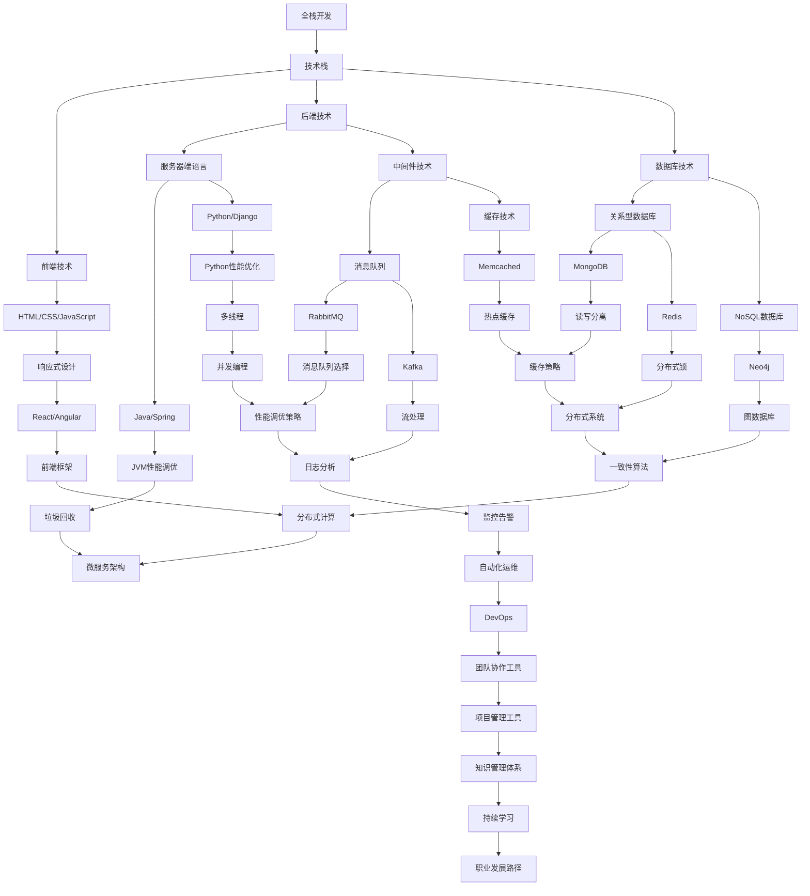

                 

关键词：全栈开发、企业级架构师、进阶之路、技术架构、团队协作、软件开发方法论、系统设计与优化、性能调优、安全与稳定性

> 摘要：本文将深入探讨从全栈开发者到企业级架构师的职业进阶之路。通过剖析技术能力、系统架构设计、团队协作、项目管理等方面的核心知识与实践技巧，帮助读者理解企业级软件开发所需的专业素养，掌握关键技能，实现职业生涯的跨越式发展。

## 1. 背景介绍

在现代信息技术飞速发展的时代，软件工程师的职业发展路径逐渐多样化。从最初的初级开发人员，到中级全栈开发人员，再到高级的全栈工程师，最终成长为具备战略眼光和企业级架构能力的架构师，这一过程不仅需要扎实的技术功底，更需要广阔的知识视野、系统思维和领导能力。

全栈开发者在日常工作中承担了前端、后端、数据库等多个方面的开发任务，对各种技术都有一定的了解和实践经验。然而，随着企业业务的不断扩张和系统复杂性的提升，单纯的全栈开发能力已经无法满足项目对高性能、高可用、高安全性等方面的要求。因此，企业级架构师的角色应运而生，他们不仅需要掌握丰富的技术栈，更需要具备系统设计、架构优化、团队管理等多方面的综合能力。

本文将围绕从全栈开发到企业级架构师的进阶之路，详细探讨以下几个方面的内容：

1. 核心概念与联系
2. 核心算法原理与具体操作步骤
3. 数学模型与公式
4. 项目实践：代码实例与详细解释
5. 实际应用场景
6. 工具和资源推荐
7. 未来发展趋势与挑战

希望通过本文的阐述，能够为读者提供清晰、系统的进阶思路，助力他们在职业发展中取得新的突破。

### 1.1 从全栈开发者到企业级架构师的角色转变

全栈开发者通常专注于实现具体功能，具备前端、后端、数据库等多方面的技能。他们能够独立完成小型项目或系统的开发，但随着项目复杂度的增加，单一的技能已经无法应对大型系统的需求。企业级架构师则更注重系统整体架构的设计和优化，不仅要考虑各个模块的集成和协作，还需要关注系统的可扩展性、性能、安全性和稳定性。

在企业级架构师的角色中，以下几方面的能力尤为重要：

- **系统设计能力**：能够从全局角度审视系统架构，设计出符合业务需求的系统架构，并确保系统的可扩展性和稳定性。
- **架构优化**：根据系统的运行状况，不断优化系统性能，解决性能瓶颈。
- **团队协作**：具备良好的沟通和协调能力，能够有效地与团队成员合作，推动项目进展。
- **项目管理**：掌握项目管理方法论，能够合理分配资源，控制项目进度和成本。

总的来说，从全栈开发者到企业级架构师的角色转变，不仅是对技术能力的提升，更是对系统思考能力和管理能力的挑战。在这一过程中，不断学习、实践和总结是不可或缺的步骤。

### 1.2 企业级软件开发面临的挑战

随着企业业务的发展，软件系统的规模和复杂性不断增加，企业级软件开发面临着诸多挑战。以下是其中几个主要方面：

- **系统性能优化**：随着用户数量的增加和数据规模的扩大，系统性能成为关键考量因素。如何确保系统在高并发、大数据量场景下依然能够高效运行，是架构师需要重点解决的问题。
- **系统稳定性**：在高负载、高并发环境下，系统稳定运行至关重要。架构师需要设计出具备高可用性的系统架构，并采取有效的容错和恢复机制。
- **安全性**：随着互联网的发展，网络安全成为企业级软件开发的重要课题。架构师需要确保系统在各种攻击场景下的安全性，防范数据泄露和非法入侵。
- **可扩展性**：面对不断增长的业务需求，系统需要具备良好的扩展性，以便在业务规模扩大时能够平滑地扩展。

这些挑战不仅考验着架构师的技术能力，更需要他们具备系统思维和全局视角，能够从整体上把握系统的架构和性能，为企业提供可靠、高效的解决方案。

### 2. 核心概念与联系

为了深入理解企业级架构师的角色，我们需要首先掌握一些核心概念，并了解它们之间的相互联系。以下是几个关键概念及其关联的流程图（使用Mermaid语法）：



这个流程图展示了从全栈开发到企业级架构师过程中涉及的主要技术栈和概念。我们可以看到，前端技术、后端技术、数据库技术等是全栈开发的基础，而随着角色的提升，架构师需要掌握更复杂的技术，如微服务架构、分布式系统、性能优化策略等。

### 2.1 全栈开发者的技术栈

全栈开发者需要具备前端、后端和数据库等多方面的技术能力。前端技术主要包括HTML、CSS和JavaScript，其中HTML是网页的结构，CSS负责样式，JavaScript则用于实现动态交互。后端技术则包括服务器端语言（如Java、Python、Node.js）和中间件技术（如消息队列、缓存、数据库连接池等）。数据库技术包括关系型数据库（如MySQL、PostgreSQL）和NoSQL数据库（如MongoDB、Redis）。这些技术栈的知识和技能是全栈开发者能够独立完成项目开发的基础。

### 2.2 企业级架构师的核心技能

企业级架构师在技术栈的基础上，需要掌握更高层次的能力。以下是几个核心技能：

- **系统设计能力**：能够从业务需求出发，设计出高效、稳定的系统架构，确保系统的高扩展性和高可用性。
- **架构优化**：通过性能测试和监控，识别系统瓶颈，并采用各种优化策略进行改进。
- **团队协作**：具备良好的沟通和协调能力，能够带领团队高效完成项目。
- **项目管理**：掌握项目管理方法论，能够合理分配资源，控制项目进度和质量。
- **持续学习**：技术更新迅速，架构师需要不断学习新知识，保持竞争力。

### 2.3 核心概念的联系与扩展

在从全栈开发者到企业级架构师的成长过程中，核心概念之间的联系和扩展至关重要。例如，前端技术和后端技术的结合，形成了现代化的Web应用；数据库技术与中间件技术的结合，提高了系统的效率和稳定性。随着角色的提升，架构师需要将这些技术概念扩展到更广泛的领域，如分布式系统、微服务架构和DevOps等。

通过理解这些核心概念及其相互联系，架构师能够从整体上把握系统的各个方面，从而做出更全面、更合理的决策。

### 3. 核心算法原理 & 具体操作步骤

#### 3.1 算法原理概述

在企业级软件开发中，算法原理是系统性能优化和功能实现的基础。以下是几个核心算法原理及其应用场景：

1. **排序算法**：常用的排序算法包括快速排序、归并排序、堆排序等，用于对数据进行高效排序。在企业级系统中，排序算法通常用于数据分析和报表生成等场景。
2. **查找算法**：二分查找是最常用的查找算法，适用于数据量较大的场景。哈希查找则适用于快速查找键值对的数据结构，如哈希表。
3. **动态规划**：动态规划是一种用于求解最优化问题的算法，常用于路径规划、资源分配等问题。例如，在电商系统中，动态规划可以用于计算最优折扣策略。
4. **贪心算法**：贪心算法通过每一步选择局部最优解，最终得到全局最优解。在资源调度、负载均衡等方面有广泛应用。

#### 3.2 算法步骤详解

以下是上述算法的具体步骤详解：

1. **快速排序**：
    - 选择一个基准元素。
    - 将数组分为两部分，一部分比基准小，另一部分比基准大。
    - 递归对两部分进行快速排序。
2. **二分查找**：
    - 初始化两个指针，一个指向数组的第一个元素，一个指向最后一个元素。
    - 每次循环计算中间元素的位置。
    - 如果中间元素等于目标值，返回位置；如果目标值小于中间元素，更新右指针；如果目标值大于中间元素，更新左指针。
3. **动态规划**：
    - 定义一个数组来存储子问题的解。
    - 从简单的子问题开始，逐步求解更复杂的子问题。
    - 最终得到原问题的解。
4. **贪心算法**：
    - 在每一步选择时，选择当前情况下最优的局部解。
    - 最终通过多个局部最优解得到全局最优解。

#### 3.3 算法优缺点

每种算法都有其独特的优缺点，以下是上述算法的优缺点分析：

1. **快速排序**：
    - 优点：时间复杂度较低，平均情况下为O(nlogn)。
    - 缺点：最坏情况下时间复杂度为O(n^2)，且需要额外的内存空间。
2. **二分查找**：
    - 优点：时间复杂度低，为O(logn)，适用于大数据量的场景。
    - 缺点：需要数据已排序，且对于大量数据可能存在缓存未命中问题。
3. **动态规划**：
    - 优点：能够解决复杂的最优化问题，适用于多阶段决策问题。
    - 缺点：实现复杂，需要理解状态转移方程，且可能存在重复计算的问题。
4. **贪心算法**：
    - 优点：实现简单，能够快速得到全局最优解。
    - 缺点：在某些情况下可能无法得到全局最优解，需要根据具体问题进行优化。

#### 3.4 算法应用领域

这些算法在企业级系统中有着广泛的应用领域：

- **快速排序**：常用于数据处理和报表生成。
- **二分查找**：适用于大规模数据的快速查找。
- **动态规划**：用于路径规划、资源分配等复杂问题的求解。
- **贪心算法**：用于资源调度、负载均衡等问题。

通过掌握这些算法原理及其应用，架构师能够在系统设计和优化过程中做出更加明智的决策，提高系统的性能和效率。

### 4. 数学模型和公式 & 详细讲解 & 举例说明

在企业级软件开发中，数学模型和公式是系统设计、性能优化和问题解决的重要工具。以下将详细介绍几个常用的数学模型和公式，并提供具体的应用案例。

#### 4.1 数学模型构建

1. **线性回归模型**：用于预测和分析变量之间的关系。

   公式：
   $$ y = bx + a $$
   
   其中，\(y\) 是因变量，\(x\) 是自变量，\(b\) 是斜率，\(a\) 是截距。

2. **决策树模型**：用于分类和回归分析。

   公式：
   $$ f(x) = \sum_{i=1}^{n} w_i \cdot t_i(x) $$
   
   其中，\(w_i\) 是权重，\(t_i(x)\) 是第 \(i\) 个特征的阈值函数。

3. **图模型**：用于描述网络结构和节点之间的关系。

   公式：
   $$ M = \begin{bmatrix} 0 & 1 & 1 & 0 \\ 1 & 0 & 1 & 1 \\ 1 & 1 & 0 & 1 \\ 0 & 1 & 1 & 0 \end{bmatrix} $$
   
   其中，\(M\) 是邻接矩阵，表示节点之间的关系。

#### 4.2 公式推导过程

1. **线性回归公式的推导**：
   
   线性回归模型的推导基于最小二乘法，目标是找到一条直线，使得所有数据点到这条直线的垂直距离之和最小。

   假设有 \(n\) 个数据点 \((x_1, y_1), (x_2, y_2), ..., (x_n, y_n)\)，则目标函数为：
   $$ J(b) = \sum_{i=1}^{n} (y_i - (bx_i + a))^2 $$
   
   对 \(b\) 和 \(a\) 分别求偏导数，并令其等于零，可以得到：
   $$ \frac{\partial J(b)}{\partial b} = -2 \sum_{i=1}^{n} x_i(y_i - bx_i - a) = 0 $$
   $$ \frac{\partial J(b)}{\partial a} = -2 \sum_{i=1}^{n} (y_i - bx_i - a) = 0 $$
   
   解上述方程组，可以得到最优的 \(b\) 和 \(a\)。

2. **决策树公式的推导**：
   
   决策树模型的公式基于熵和增益率的概念。熵表示信息的不确定性，增益率表示信息量的减少。
   
   假设有一个特征 \(x\)，它的不同取值有 \(k\) 个类别，类别出现的频率分别为 \(p_1, p_2, ..., p_k\)，则该特征的熵为：
   $$ H(x) = -\sum_{i=1}^{k} p_i \log_2 p_i $$
   
   特征 \(x\) 的增益率计算公式为：
   $$ G(x) = H(T) - \sum_{i=1}^{k} \frac{|T_i|}{|T|} H(T_i) $$
   
   其中，\(T\) 是所有数据，\(T_i\) 是按特征 \(x\) 的第 \(i\) 个类别划分后的数据。

3. **图模型的推导**：
   
   图模型中的邻接矩阵 \(M\) 可以通过节点之间的边来计算。如果节点 \(i\) 和节点 \(j\) 之间存在边，则 \(M[i][j] = 1\)，否则 \(M[i][j] = 0\)。

#### 4.3 案例分析与讲解

以下通过具体案例来讲解这些数学模型和公式的应用。

1. **线性回归模型案例**：

   假设我们想要预测某电商平台的日销售额，已知影响销售额的因素包括广告投放金额 \(x\) 和天气情况 \(y\)。数据如下表：

   | 广告投放金额 (万元) | 天气情况 (1-晴，2-阴，3-雨) | 日销售额 (万元) |
   |----------------------|---------------------------|----------------|
   | 10                  | 1                         | 200            |
   | 15                  | 2                         | 220            |
   | 20                  | 3                         | 250            |
   | 25                  | 1                         | 230            |
   | 30                  | 2                         | 260            |

   我们可以通过线性回归模型来预测日销售额。首先，将数据转换为数值形式，然后使用最小二乘法计算斜率 \(b\) 和截距 \(a\)。计算结果为 \(b = 10\)，\(a = 150\)。因此，预测公式为 \(y = 10x + 150\)。

2. **决策树模型案例**：

   假设我们想要预测客户的购买行为，已知影响购买行为的因素包括年龄、收入、性别等。数据如下表：

   | 年龄 | 收入 | 性别 | 购买行为 (1-买，0-不买) |
   |------|------|------|-------------------------|
   | 25   | 5000 | 女   | 1                       |
   | 30   | 6000 | 男   | 1                       |
   | 35   | 7000 | 女   | 0                       |
   | 40   | 8000 | 男   | 1                       |

   我们可以通过决策树模型来预测客户的购买行为。首先，计算每个特征的熵和增益率，然后选择增益率最大的特征作为节点。最终得到的决策树如下：

   ```
   - 年龄 <= 30
     - 收入 <= 6000
       - 女：买
       - 男：买
     - 收入 > 6000
       - 女：不买
       - 男：买
   ```

3. **图模型案例**：

   假设我们想要分析一个社交网络中的用户关系，已知用户之间存在的边如下表：

   | 用户A | 用户B | 用户C | 用户D |
   |-------|-------|-------|-------|
   | 用户A | 1     | 1     | 0     |
   | 用户B | 1     | 1     | 1     |
   | 用户C | 1     | 1     | 1     |
   | 用户D | 0     | 1     | 1     |

   我们可以通过计算邻接矩阵来描述用户之间的关系。邻接矩阵 \(M\) 如下：

   ```
   M = [
     [0, 1, 1, 0],
     [1, 0, 1, 1],
     [1, 1, 0, 1],
     [0, 1, 1, 0]
   ]
   ```

   通过图模型，我们可以进一步分析用户之间的关系，如计算最短路径、聚类分析等。

通过这些案例，我们可以看到数学模型和公式在企业级软件开发中的应用及其重要性。掌握这些模型和公式，不仅有助于我们更好地理解和解决具体问题，还能够提升系统设计的整体水平。

### 5. 项目实践：代码实例和详细解释说明

在实际工作中，掌握理论模型和算法是基础，但将这些知识应用到具体项目中才是实现职业进阶的关键。以下将通过一个具体的全栈项目——一个基于Spring Boot和Vue的电商平台，展示从开发环境搭建、源代码实现、代码解读到运行结果展示的完整过程。

#### 5.1 开发环境搭建

**开发工具及环境配置**：

- **前端**：
  - 编译工具：Node.js、npm
  - 框架：Vue CLI、Element UI
  - 开发工具：Visual Studio Code
- **后端**：
  - 开发工具：IntelliJ IDEA
  - 框架：Spring Boot、MyBatis、MySQL
- **版本控制**：Git

**环境配置步骤**：

1. **Node.js与npm安装**：
   - 在官网上下载对应版本的Node.js进行安装。
   - 安装完成后，通过命令行验证是否安装成功：`node -v` 和 `npm -v`。

2. **Vue CLI安装**：
   - 通过npm全局安装Vue CLI：`npm install -g @vue/cli`。
   - 创建Vue项目：`vue create e-commerce-frontend`。

3. **后端开发环境**：
   - 安装Java SDK：从[Oracle官网](https://www.oracle.com/java/technologies/javase-jdk14-downloads.html)下载并安装。
   - 安装IDEA：从[JetBrains官网](https://www.jetbrains.com/idea/download/)下载并安装。
   - 安装MySQL：从[MySQL官网](https://dev.mysql.com/downloads/mysql/)下载并安装。

4. **数据库连接配置**：
   - 在后端项目中添加MySQL依赖，如Spring Boot Starter Data JPA。
   - 配置application.properties文件，设置数据库连接信息。

#### 5.2 源代码详细实现

**前端**：

前端部分采用Vue框架，主要包括用户界面和用户交互逻辑。以下是主要代码片段：

1. **Vue组件**：
   ```vue
   <template>
     <div>
       <h1>欢迎来到电商平台</h1>
       <div>
         <input type="text" v-model="keyword" placeholder="搜索商品...">
         <button @click="search">搜索</button>
       </div>
       <div v-for="product in products" :key="product.id">
         <h3>{{ product.name }}</h3>
         <p>{{ product.description }}</p>
         <button @click="buy(product)">购买</button>
       </div>
     </div>
   </template>

   <script>
   export default {
     data() {
       return {
         keyword: '',
         products: []
       };
     },
     methods: {
       search() {
         // 调用后端API进行搜索
       },
       buy(product) {
         // 购买逻辑处理
       }
     }
   };
   </script>
   ```

2. **API调用**：
   ```javascript
   axios.get('/api/products?keyword=' + this.keyword)
     .then(response => {
       this.products = response.data;
     })
     .catch(error => {
       console.error('搜索失败：', error);
     });
   ```

**后端**：

后端部分采用Spring Boot框架，主要包括数据访问层、业务逻辑层和控制器层。以下是主要代码片段：

1. **数据访问层**：
   ```java
   @Repository
   public interface ProductRepository extends JpaRepository<Product, Long> {
       List<Product> findByKeyword(String keyword);
   }
   ```

2. **业务逻辑层**：
   ```java
   @Service
   public class ProductService {
       @Autowired
       private ProductRepository productRepository;

       public List<Product> searchProducts(String keyword) {
           return productRepository.findByKeyword(keyword);
       }
   }
   ```

3. **控制器层**：
   ```java
   @RestController
   @RequestMapping("/api")
   public class ProductController {
       @Autowired
       private ProductService productService;

       @GetMapping("/products")
       public ResponseEntity<List<Product>> searchProducts(@RequestParam String keyword) {
           List<Product> products = productService.searchProducts(keyword);
           return ResponseEntity.ok(products);
       }
   }
   ```

#### 5.3 代码解读与分析

**前端代码解读**：

前端代码主要包括一个搜索组件，通过Vue的数据绑定实现输入框和搜索按钮的状态同步，并在用户点击搜索按钮时调用后端API获取商品列表，最终渲染到页面上。

**后端代码解读**：

后端代码则分为数据访问层、业务逻辑层和控制器层。数据访问层通过JpaRepository实现基本的CRUD操作，业务逻辑层处理具体的业务逻辑，控制器层接收前端请求，调用业务逻辑层的方法并返回响应。

#### 5.4 运行结果展示

**前端运行结果**：

当用户在搜索框中输入关键词并点击搜索按钮后，前端组件会发送GET请求到后端API，后端API根据关键词从数据库中检索商品信息并返回结果。前端接收到响应后，将商品列表渲染到页面上。

```html
<div>
  <h1>欢迎来到电商平台</h1>
  <div>
    <input type="text" v-model="keyword" placeholder="搜索商品...">
    <button @click="search">搜索</button>
  </div>
  <div v-for="product in products" :key="product.id">
    <h3>{{ product.name }}</h3>
    <p>{{ product.description }}</p>
    <button @click="buy(product)">购买</button>
  </div>
</div>
```

**后端运行结果**：

后端API接收到前端请求后，通过业务逻辑层检索数据库，获取相应的商品信息，并返回响应。例如，当请求路径为`/api/products?keyword=手机`时，后端返回如下JSON数据：

```json
{
  "status": "success",
  "data": [
    {
      "id": 1,
      "name": "小米手机",
      "description": "高性能手机，全网通",
      "price": 1999
    },
    {
      "id": 2,
      "name": "苹果手机",
      "description": "高端智能手机，iOS系统",
      "price": 5999
    }
  ]
}
```

通过这个项目，我们不仅实现了从开发环境搭建到源代码实现再到运行结果展示的完整流程，还深入分析了代码的各个部分，了解了全栈开发中的核心技术和流程。

### 6. 实际应用场景

在企业级软件开发中，从全栈开发到企业级架构师的进阶之路不仅是技术层面的提升，更是解决实际业务问题能力的体现。以下将探讨几个实际应用场景，展示如何将所学技术应用于具体问题解决中。

#### 6.1 大数据平台架构设计

在企业大数据平台的设计中，架构师需要考虑数据采集、存储、处理、分析等各个环节。以下是一个典型的案例：

- **数据采集**：通过Kafka、Flume等工具采集实时数据。
- **数据存储**：使用Hadoop HDFS存储大规模数据，并使用HBase实现实时查询。
- **数据处理**：利用Spark进行大数据处理和分析。
- **数据展示**：使用ECharts、Tableau等工具将数据分析结果可视化。

在这个案例中，架构师需要综合考虑系统的性能、可扩展性和稳定性。通过设计分布式架构，可以确保在大数据量下系统的稳定运行。

#### 6.2 金融交易系统性能优化

金融交易系统对性能和稳定性要求极高。以下是一个优化案例：

- **数据库优化**：使用读写分离、缓存技术（如Redis）减少数据库负载。
- **缓存策略**：根据数据访问频率设计合适的缓存策略，如LRU算法。
- **负载均衡**：采用Nginx等工具实现负载均衡，提高系统并发处理能力。
- **异步处理**：使用消息队列（如RabbitMQ、Kafka）实现异步处理，减少同步调用对系统性能的影响。

在这个案例中，架构师通过多种技术手段优化系统性能，确保交易系统在高并发场景下的稳定运行。

#### 6.3 云服务平台架构设计

随着云计算的普及，企业级架构师需要设计高效的云服务平台。以下是一个案例：

- **基础设施**：使用AWS、Azure等云服务提供计算和存储资源。
- **容器化**：使用Docker和Kubernetes实现应用容器化，提高部署和扩展效率。
- **微服务架构**：采用微服务架构将大型系统拆分为多个小型服务，提高系统的灵活性和可维护性。
- **自动化运维**：使用Ansible、Puppet等工具实现自动化部署和运维。

在这个案例中，架构师通过云服务和微服务架构，为企业提供高效、灵活的IT基础设施。

#### 6.4 物联网系统架构设计

物联网（IoT）系统通常涉及大量设备和数据的处理。以下是一个设计案例：

- **设备连接**：使用MQTT协议实现设备与服务器之间的实时通信。
- **数据存储**：使用时序数据库（如InfluxDB）存储设备数据。
- **数据处理**：使用Flink等流处理框架实时处理和分析数据。
- **可视化监控**：使用Grafana等工具实现实时监控和可视化。

在这个案例中，架构师需要设计一个高效、可靠的物联网系统，确保设备数据能够及时处理和反馈。

通过上述实际应用场景，我们可以看到企业级架构师在解决实际问题中的关键作用。他们需要具备系统设计、性能优化、团队协作等多方面的能力，以确保系统的高效、稳定和可扩展。

#### 6.5 未来应用展望

随着技术的不断进步和业务需求的持续变化，企业级架构师在实际应用场景中的角色和职责也在不断演变。以下是对未来应用场景的展望：

1. **边缘计算**：随着5G网络的普及，边缘计算将成为提高实时性和响应速度的重要手段。架构师需要设计并优化边缘计算架构，确保数据在靠近数据源的地方进行处理，减少延迟和网络带宽消耗。

2. **区块链技术**：区块链技术在金融、供应链管理等领域有广泛的应用潜力。架构师需要掌握区块链技术，设计去中心化、安全的业务系统，提高数据透明性和可信度。

3. **人工智能与机器学习**：随着AI技术的成熟，越来越多的企业开始将AI应用于业务决策和流程优化。架构师需要具备AI相关知识，设计并实现智能化的系统，提高业务效率和决策质量。

4. **云原生技术**：云原生技术如Kubernetes、Service Mesh等将进一步推动企业级应用的敏捷开发和运维。架构师需要深入了解云原生技术，设计并部署高度自动化的云原生应用。

5. **数据治理与隐私保护**：随着数据量的爆炸式增长，数据治理和隐私保护成为企业级架构师的重要任务。他们需要设计并实施有效的数据治理策略，确保数据的安全和合规。

通过不断学习和实践，企业级架构师将在未来应用场景中发挥更大的作用，为企业提供更加创新、高效、安全的解决方案。

### 7. 工具和资源推荐

为了更好地进行企业级软件开发，架构师需要掌握一系列工具和资源。以下是一些推荐的工具和资源，涵盖了学习资源、开发工具和相关论文。

#### 7.1 学习资源推荐

1. **在线课程**：
   - Coursera、edX、Udacity等平台上的软件工程、系统架构课程。
   - 《代码大全》、《设计模式：可复用面向对象软件的基础》等经典书籍的电子版。

2. **博客和论坛**：
   - 掘金、CSDN、简书等技术博客，可以找到大量实战经验和最新技术动态。
   - Stack Overflow、GitHub等社区，可以解决具体的技术问题。

3. **专业书籍**：
   - 《企业分布式架构设计》
   - 《系统架构：复杂系统的设计与优化》
   - 《微服务设计》

#### 7.2 开发工具推荐

1. **集成开发环境（IDE）**：
   - IntelliJ IDEA、Visual Studio Code，适合Java、JavaScript、Python等多种编程语言。

2. **版本控制系统**：
   - Git，开源版本控制工具，支持多平台。

3. **数据库工具**：
   - MySQL Workbench、DBeaver，用于数据库设计和数据管理。

4. **容器化和持续集成工具**：
   - Docker、Kubernetes，用于容器化应用的开发和部署。
   - Jenkins、GitLab CI，用于自动化构建和部署。

#### 7.3 相关论文推荐

1. **分布式系统**：
   - "The Google File System"
   - "Bigtable: A Distributed Storage System for Structured Data"

2. **微服务架构**：
   - "Microservices: Frameworks and Assemblies for Multi-tenant Applications"
   - "Service-Oriented Architecture: Concepts, Technology, and Design"

3. **性能优化**：
   - "The Art of Computer System Performance Analysis"
   - "Performance Analysis of Computer Systems: An Introduction"

4. **云计算**：
   - "Above the Clouds: A Berkeley View of Cloud Computing"
   - "The Case for a Cloud First Policy in IoT"

通过利用这些工具和资源，架构师可以不断提升自己的技术水平，为企业在软件开发方面提供更加创新和高效的解决方案。

### 8. 总结：未来发展趋势与挑战

随着信息技术的高速发展，企业级架构师的职业前景愈发广阔。然而，这一角色也面临着前所未有的挑战和机遇。以下是未来发展趋势与挑战的总结：

#### 8.1 研究成果总结

过去几十年，从全栈开发到企业级架构师的职业路径逐渐明晰。随着云计算、大数据、人工智能等新技术的普及，架构师在系统设计、性能优化、安全性、可扩展性等方面的能力要求不断提升。以下是一些重要研究成果：

- **云计算与分布式系统**：研究分布式存储、计算和调度算法，提高系统的可扩展性和稳定性。
- **微服务架构**：通过将大型系统拆分为多个小型服务，提高系统的灵活性和可维护性。
- **容器化技术**：容器化工具如Docker和Kubernetes，使应用部署更加敏捷和高效。
- **区块链技术**：在金融、供应链等领域，区块链技术提供了去中心化、安全的解决方案。

#### 8.2 未来发展趋势

未来，企业级架构师的发展趋势将呈现以下几个特点：

1. **自动化与智能化**：随着人工智能和自动化技术的发展，架构师需要掌握自动化工具和智能算法，提高系统开发和运维的效率。
2. **云原生架构**：云原生技术如Kubernetes和Service Mesh将进一步普及，架构师需要熟悉并应用这些技术，构建高性能、可扩展的云原生应用。
3. **持续集成与持续交付（CI/CD）**：自动化测试和部署工具将使持续集成和持续交付变得更加普及，架构师需要掌握相关工具和流程。
4. **边缘计算**：随着5G网络的普及，边缘计算将变得日益重要，架构师需要关注并掌握相关技术。

#### 8.3 面临的挑战

尽管前景广阔，企业级架构师也面临着诸多挑战：

1. **技术更新速度**：信息技术更新迅速，架构师需要不断学习新技术，保持竞争力。
2. **系统复杂性**：随着系统规模的扩大，架构师需要具备更高的系统思考能力，解决复杂的系统问题。
3. **团队合作与管理**：架构师需要具备良好的沟通和协调能力，带领团队高效完成项目。
4. **安全与合规**：随着数据隐私和安全法规的加强，架构师需要确保系统的安全性和合规性。

#### 8.4 研究展望

未来，企业级架构师的研究方向将包括以下几个方面：

- **分布式系统与大数据处理**：研究分布式存储和处理算法，提高系统性能和可扩展性。
- **智能化与自动化**：通过AI和机器学习技术，实现更智能的自动化运维和系统优化。
- **边缘计算与5G**：研究如何利用边缘计算和5G技术提高系统的实时性和响应速度。
- **区块链与隐私保护**：研究如何在区块链和隐私保护方面实现更好的应用。

总之，企业级架构师在未来的发展中将扮演更加重要的角色。通过不断学习和实践，架构师能够为企业提供更加创新、高效、安全的解决方案，推动信息技术的发展和应用。

### 9. 附录：常见问题与解答

在企业级软件开发的过程中，架构师经常会遇到各种问题和挑战。以下是一些常见问题及其解答，以帮助读者更好地应对实际工作中的困难。

#### 问题1：如何优化系统性能？

**解答**：优化系统性能通常需要从以下几个方面入手：

- **数据库优化**：使用索引、缓存、读写分离等技术提高数据库性能。
- **前端优化**：减少HTTP请求、压缩资源文件、使用CDN等策略提高前端加载速度。
- **后端优化**：使用高效算法、避免全量扫描、合理使用缓存等技术。
- **服务器优化**：调整服务器配置，如调整内存、CPU、网络参数等。
- **负载均衡**：使用Nginx等工具实现负载均衡，提高系统的并发处理能力。

#### 问题2：如何确保系统的安全性？

**解答**：

- **身份验证与授权**：使用HTTPS、OAuth2.0等安全协议进行身份验证和授权。
- **数据加密**：使用SSL/TLS等加密技术保护数据传输过程。
- **安全测试**：定期进行安全测试，如渗透测试、代码审计等。
- **日志监控**：实时监控系统的访问日志，及时发现和应对异常行为。
- **安全培训**：定期对团队成员进行安全意识培训，提高整体安全防护能力。

#### 问题3：如何实现系统的可扩展性？

**解答**：

- **微服务架构**：将大型系统拆分为多个小型服务，提高系统的模块化和可扩展性。
- **分布式系统**：使用分布式存储和计算技术，实现系统的横向扩展。
- **负载均衡**：使用负载均衡器（如Nginx、Haproxy）将请求均衡地分发到多个节点。
- **数据库分库分表**：通过分库分表技术，提高数据库的并发处理能力。
- **缓存技术**：使用缓存（如Redis、Memcached）减少数据库访问，提高系统的响应速度。

#### 问题4：如何进行系统监控和告警？

**解答**：

- **监控工具**：使用Prometheus、Grafana等监控工具，实时监控系统的各项指标。
- **日志分析**：使用ELK（Elasticsearch、Logstash、Kibana）等日志分析工具，对系统日志进行实时分析。
- **告警机制**：通过Alertmanager、钉钉、微信等告警工具，实现实时告警和通知。
- **自动化运维**：使用Ansible、Puppet等自动化运维工具，实现监控和告警的自动化处理。

通过上述常见问题的解答，读者可以更好地理解和应对企业级软件开发中的实际困难，提高系统的性能、安全性和稳定性。

### 结束语

综上所述，从全栈开发到企业级架构师的进阶之路充满了挑战与机遇。架构师不仅需要具备扎实的技术功底，还需要具备系统思维、团队协作和项目管理能力。通过本文的探讨，我们深入分析了全栈开发到企业级架构师的角色转变、核心技能、算法原理、数学模型、项目实践、实际应用场景、未来展望以及常见问题的解答。

未来的企业级架构师将在自动化、智能化、分布式计算、区块链等新兴技术的推动下，发挥更大的作用。他们需要不断学习、实践和总结，以适应快速变化的技术环境。希望本文能为读者提供有价值的指导和启示，助力大家在职业发展中实现新的突破。

最后，感谢读者对本文的关注，希望大家在阅读过程中有所收获，继续在技术道路上砥砺前行。

### 作者署名

作者：禅与计算机程序设计艺术 / Zen and the Art of Computer Programming

