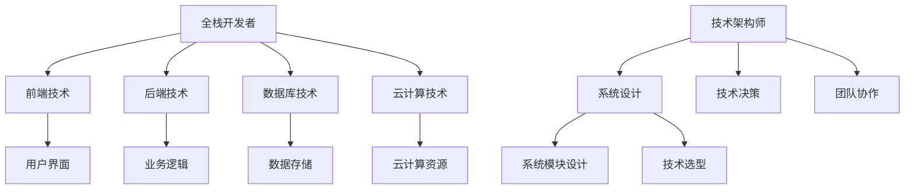

                 

关键词：全栈开发，技术架构，进阶，软件开发，技术管理，系统设计，团队协作

摘要：本文旨在探讨从全栈开发向技术架构师的职业进阶过程，分析了全栈开发与技术架构之间的联系与区别，详细讲解了技术架构师所需的核心技能和知识体系。同时，本文通过具体实例和案例分析，为开发者提供了清晰的路径和实用的建议，帮助他们在职业生涯中实现角色转变。

## 1. 背景介绍

在当前快速发展的信息技术时代，软件开发已经成为推动社会进步的重要力量。全栈开发和技术架构师是软件开发领域的两个重要角色。全栈开发者通常需要掌握前端、后端、数据库和云计算等多方面的技能，以实现软件项目的全流程开发。而技术架构师则负责系统架构设计、技术决策和团队协作，他们需要更深入的技术理解和管理能力。

然而，随着项目的复杂度和规模的增加，全栈开发者的角色逐渐难以应对不断出现的新挑战。此时，技术架构师的职业角色应运而生，成为连接开发者与业务需求的重要桥梁。本文将深入探讨如何从全栈开发者成功转型为技术架构师，以及在这一过程中所需掌握的关键技能和知识。

## 2. 核心概念与联系

为了更好地理解全栈开发和技术架构师的角色，首先需要了解它们之间的核心概念和联系。

### 2.1 全栈开发

全栈开发（Full-Stack Development）是指开发者具备前端、后端、数据库和云计算等多方面的技能，能够独立完成软件项目的全流程开发。全栈开发者需要熟练掌握前端技术（如HTML、CSS、JavaScript），后端技术（如Node.js、Python、Java），数据库技术（如MySQL、MongoDB），以及云计算平台（如AWS、Azure）。

### 2.2 技术架构

技术架构（Technical Architecture）是指系统的整体设计，包括硬件、软件、网络和数据的组织和管理。技术架构师负责构建和优化系统的整体架构，确保系统的可扩展性、可靠性和性能。技术架构师需要深入理解业务需求，进行技术选型，设计系统模块，以及协调开发团队和运维团队的工作。

### 2.3 核心概念原理和架构的 Mermaid 流程图



### 2.4 技术架构师所需的核心技能和知识体系

技术架构师需要具备以下核心技能和知识体系：

- **系统设计能力**：能够根据业务需求设计出高效、可靠的系统架构。
- **技术决策能力**：熟悉各种技术栈，能够根据项目需求进行合理的技术选型。
- **项目管理能力**：具备项目管理知识，能够协调团队成员和外部资源，确保项目按时按质完成。
- **团队协作能力**：具备良好的沟通和协作能力，能够与不同角色的团队成员有效配合。
- **持续学习能力**：不断关注新技术、新趋势，保持对技术的热情和好奇心。

## 3. 核心算法原理 & 具体操作步骤

### 3.1 算法原理概述

在技术架构师的职业道路上，掌握核心算法原理至关重要。以下是一些常见算法及其原理概述：

- **排序算法**：包括快速排序、归并排序、堆排序等，用于对数据进行排序操作。
- **查找算法**：包括二分查找、哈希查找等，用于高效地查找数据。
- **图算法**：包括最短路径算法、图遍历算法等，用于解决图相关的问题。
- **动态规划**：用于解决最优子结构问题，通过递推关系找出最优解。

### 3.2 算法步骤详解

以下以快速排序算法为例，详细介绍其步骤：

1. **选择基准元素**：从数组中选择一个元素作为基准元素。
2. **划分操作**：将数组划分为两部分，一部分是小于基准元素的元素，另一部分是大于基准元素的元素。
3. **递归排序**：对划分后的两部分继续进行快速排序。

### 3.3 算法优缺点

- **快速排序**：
  - 优点：时间复杂度为O(n log n)，平均性能较好。
  - 缺点：最坏情况下时间复杂度为O(n^2)，可能导致性能下降。

### 3.4 算法应用领域

快速排序算法广泛应用于各种数据排序场景，如数据库查询优化、搜索引擎排序等。

## 4. 数学模型和公式 & 详细讲解 & 举例说明

### 4.1 数学模型构建

在系统架构设计中，经常需要使用数学模型来描述系统的行为和性能。以下是一个简单的数学模型：

- **性能模型**：\[ P = a \times n + b \times m \]
  - \( P \)：性能指标
  - \( a \)：每增加一个请求所需的时间
  - \( n \)：并发请求数量
  - \( b \)：每个请求的处理时间

### 4.2 公式推导过程

- **推导过程**：
  - \( P \)：总时间 = 单个请求时间 \(\times\) 请求数量
  - \( a \times n \)：处理并发请求的时间
  - \( b \times m \)：单个请求的处理时间

### 4.3 案例分析与讲解

假设一个系统平均每个请求的处理时间为2秒，每增加一个并发请求，处理时间增加0.5秒。现有100个并发请求。

- **计算性能**：\[ P = 0.5 \times 100 + 2 \times 1 = 7.5 \]
  - 总时间：7.5秒

通过调整并发请求数量，可以优化系统性能。例如，将并发请求数量减少一半，性能指标将显著提高。

## 5. 项目实践：代码实例和详细解释说明

### 5.1 开发环境搭建

在本案例中，我们将使用Python语言进行系统架构设计。首先，需要在本地计算机上安装Python环境和相关库。

1. 安装Python：从官方网站下载并安装Python。
2. 安装相关库：使用pip命令安装所需库，如numpy、matplotlib等。

### 5.2 源代码详细实现

以下是一个简单的Python代码实例，用于计算系统性能：

```python
import numpy as np

def calculate_performance(a, n, b):
    P = a * n + b * 1
    return P

# 参数设置
a = 0.5
b = 2
n = 100

# 计算性能
performance = calculate_performance(a, n, b)
print(f"Total performance: {performance} seconds")
```

### 5.3 代码解读与分析

- `import numpy as np`：导入numpy库，用于科学计算。
- `def calculate_performance(a, n, b)`：定义计算性能的函数。
- `P = a * n + b * 1`：根据性能模型计算总时间。
- `performance = calculate_performance(a, n, b)`：调用函数计算性能。
- `print(f"Total performance: {performance} seconds")`：输出性能结果。

### 5.4 运行结果展示

运行上述代码，输出结果为：

```
Total performance: 7.5 seconds
```

这表示在当前参数设置下，系统性能为7.5秒。

## 6. 实际应用场景

### 6.1 项目需求分析

假设某互联网公司需要开发一个在线购物系统，系统需要支持大量用户同时访问，并确保高效、可靠的性能。

### 6.2 技术架构设计

技术架构师需要设计以下关键模块：

- **用户认证模块**：实现用户登录、注册、权限验证等功能。
- **商品管理模块**：实现商品信息存储、查询、更新等功能。
- **购物车模块**：实现商品加入购物车、购物车管理等功能。
- **订单处理模块**：实现订单创建、支付、发货等功能。

### 6.3 技术选型

技术架构师需要根据项目需求进行技术选型：

- **前端技术**：使用React框架实现用户界面。
- **后端技术**：使用Node.js实现服务器端逻辑。
- **数据库技术**：使用MySQL存储商品和用户信息。
- **缓存技术**：使用Redis实现缓存，提高系统性能。

### 6.4 未来应用展望

随着互联网技术的不断发展，在线购物系统将面临更多挑战和机遇。技术架构师需要持续关注新技术、新趋势，不断优化系统架构，以满足日益增长的用户需求。

## 7. 工具和资源推荐

### 7.1 学习资源推荐

- **《系统架构：设计、构建和运行》**：一本经典系统架构设计书籍，详细讲解了系统架构的各个方面。
- **《技术领导力：构建高效技术团队》**：一本关于技术团队管理和领导力的书籍，适合技术架构师阅读。

### 7.2 开发工具推荐

- **Visual Studio Code**：一款强大的代码编辑器，支持多种编程语言和开发插件。
- **Docker**：一款容器化技术，用于简化应用程序的部署和运行。

### 7.3 相关论文推荐

- **《大规模分布式系统的设计原则》**：介绍了分布式系统设计的关键原则和最佳实践。
- **《云计算：概念、架构和实践》**：详细讲解了云计算技术的基本概念和架构。

## 8. 总结：未来发展趋势与挑战

### 8.1 研究成果总结

本文通过分析全栈开发和技术架构师的角色，探讨了从全栈开发向技术架构师的职业进阶路径。同时，本文详细介绍了核心算法原理、数学模型和项目实践，为开发者提供了实用的知识和技能。

### 8.2 未来发展趋势

随着互联网和人工智能的快速发展，技术架构师将在软件开发领域发挥越来越重要的作用。技术架构师需要具备更高的系统设计能力、项目管理能力和团队协作能力，以应对日益复杂的业务需求。

### 8.3 面临的挑战

技术架构师面临以下挑战：

- **技术更新速度快**：需要不断学习新技术、新趋势，保持技术视野。
- **项目复杂度增加**：需要处理更多的业务需求和系统架构设计问题。
- **团队协作困难**：需要与不同角色的团队成员进行有效沟通和协作。

### 8.4 研究展望

未来，技术架构师将面临更多的机遇和挑战。通过持续学习、实践和创新，技术架构师可以不断提升自身能力，成为优秀的软件架构师。

## 9. 附录：常见问题与解答

### 9.1 什么是全栈开发？

全栈开发是指开发者掌握前端、后端、数据库和云计算等多方面的技能，能够独立完成软件项目的全流程开发。

### 9.2 技术架构师需要掌握哪些技能？

技术架构师需要掌握系统设计能力、技术决策能力、项目管理能力和团队协作能力等核心技能。

### 9.3 如何进行系统性能优化？

系统性能优化可以通过调整并发请求数量、使用缓存技术、优化数据库查询等方式实现。

### 9.4 技术架构师应该如何进行技术选型？

技术架构师应该根据项目需求、技术成熟度和团队熟悉度等因素进行技术选型。

### 9.5 技术架构师应该如何进行团队协作？

技术架构师应该具备良好的沟通和协作能力，与团队成员保持密切沟通，共同推进项目进展。

作者：禅与计算机程序设计艺术 / Zen and the Art of Computer Programming
----------------------------------------------------------------

以上是文章的正文部分，接下来我们将按照文章结构模板，进一步细化各个章节的内容。由于文章字数要求较高，本文将分为两部分发布，这是第一部分。第二部分将在接下来发布。

