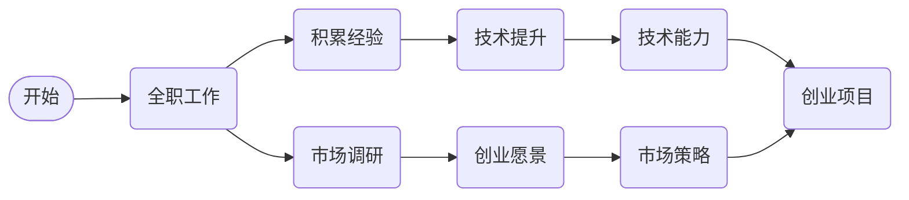

                 

在当今这个充满机遇和挑战的数字时代，许多IT专业人士在思考如何从全职工作过渡到副业创业。这不仅是对职业发展的深度探索，更是个人追求自由和财务独立的一种体现。本文将深入探讨这一过渡过程中的核心概念、技术原理、实践步骤以及未来展望，旨在为有意创业的IT专业人士提供一套系统的指导方案。

> **关键词：** IT专业人士，副业创业，职业发展，自由职业，技术技能，市场策略，商业模式。

> **摘要：** 本文将探讨从全职工作到副业创业的过渡路径，包括核心概念的理解、技术原理的应用、实践步骤的执行、数学模型的构建以及未来发展趋势的预测。通过分析实际案例和提供实用的工具与资源推荐，为读者提供全面的指导，帮助他们在创业之路上走得更稳、更远。

## 1. 背景介绍

在IT行业，全职工作通常提供了稳定的收入、明确的职业路径和良好的工作环境。然而，随着技术的不断进步和市场的快速变化，越来越多的IT专业人士开始寻找新的职业机会和挑战。副业创业成为了一个热门选择，因为它不仅允许专业人士利用其技术和市场知识创造额外收入，还可以实现职业自由和个人成就。

然而，从全职工作过渡到副业创业并非易事。这一过程需要深入的思考、周密的规划和实际的操作。首先，专业人士需要明确自己的创业目标和愿景，这包括确定创业领域、市场定位和商业模式。其次，他们需要评估自己的技术能力和资源，以确保在新的创业环境中具备竞争力。此外，市场调研、资金筹备、团队建设和市场营销都是成功创业的关键因素。

本文将围绕这些核心主题展开讨论，为有意创业的IT专业人士提供一套全面的指导。文章将从以下几个方面进行深入探讨：

1. **核心概念与联系**：介绍从全职工作到副业创业的基本概念和它们之间的联系。
2. **核心算法原理 & 具体操作步骤**：详细阐述创业过程中需要应用的技术原理和操作步骤。
3. **数学模型和公式 & 详细讲解 & 举例说明**：通过数学模型和公式来分析和解释创业过程中的关键决策点。
4. **项目实践：代码实例和详细解释说明**：提供具体的代码实例和详细解释，帮助读者理解创业实践的具体步骤。
5. **实际应用场景**：探讨副业创业在不同领域的应用场景和未来发展趋势。
6. **工具和资源推荐**：推荐学习资源、开发工具和相关论文，以帮助读者深入学习和实践。
7. **总结：未来发展趋势与挑战**：总结研究成果，预测未来发展趋势，并探讨面临的挑战。

## 2. 核心概念与联系

### 2.1 从全职工作到副业创业的基本概念

- **全职工作**：指的是在一家公司或组织中担任全职职位，通常包括固定的工资、福利和职业发展路径。
- **副业创业**：指的是在保持全职工作的同时，开展自己的业务或项目，旨在创造额外的收入和实现个人职业目标。

### 2.2 全职工作与副业创业的联系

- **技能提升**：全职工作为IT专业人士提供了丰富的技术经验和市场知识，这些都是副业创业的重要基础。
- **资源利用**：全职工作提供了稳定的收入和资源，为副业创业提供了资金支持和时间保障。
- **风险分担**：在保持全职工作的同时创业，可以将风险分散，避免因创业失败而导致生活和经济上的巨大波动。

### 2.3 核心概念之间的逻辑关系

- **技术能力**：技术能力是副业创业的核心竞争力，它决定了创业项目的技术水平和市场接受度。
- **市场知识**：市场知识帮助创业者更好地了解市场需求，制定有效的市场策略。
- **创业愿景**：明确的创业愿景为副业创业提供了方向和动力，确保创业项目符合个人职业目标和市场需求。

### 2.4 Mermaid 流程图

为了更清晰地展示全职工作到副业创业的核心概念及其联系，我们可以使用Mermaid流程图来描述这个过程。以下是一个简化的流程图示例：



在这个流程图中，A表示开始，B表示全职工作，C和D分别代表积累经验和市场调研，E和F分别代表技术提升和创业愿景，G和H分别代表技术能力和市场策略，I表示创业项目。通过这个流程图，我们可以看到从全职工作到副业创业是一个系统性的过程，涉及多个核心概念的交互和融合。

### 2.5 全职工作与副业创业的区别

- **工作时间**：全职工作通常有固定的工作时间，而副业创业则可以根据个人时间灵活安排。
- **收入稳定性**：全职工作的收入相对稳定，而副业创业的收入可能存在波动。
- **工作环境**：全职工作通常在一个组织内部进行，有明确的规章制度和团队合作环境，而副业创业则需要在更灵活和独立的环境中开展工作。
- **风险承担**：全职工作由公司承担大部分风险，而副业创业则需要创业者自行承担风险。

通过以上核心概念与联系的分析，我们可以更好地理解全职工作和副业创业之间的关系，为后续的深入探讨打下基础。

### 3. 核心算法原理 & 具体操作步骤

#### 3.1 算法原理概述

在从全职工作到副业创业的过渡过程中，算法原理起到了关键作用。这些算法不仅帮助创业者优化决策，还提供了实现创业目标的具体操作步骤。以下是一些核心算法原理及其在创业过程中的应用：

- **目标规划算法**：通过目标规划算法，创业者可以明确自己的创业目标，并制定一系列可量化的指标来衡量进展。常见的算法包括线性规划（Linear Programming，LP）和整数规划（Integer Programming，IP）。LP用于优化线性目标函数，而IP则用于优化整数目标函数，如确定最佳创业方向和资源配置。

- **风险评估算法**：风险评估是创业过程中不可或缺的一环。通过风险评估算法，如蒙特卡洛模拟（Monte Carlo Simulation）和决策树（Decision Tree），创业者可以预测不同决策路径的风险和收益，从而做出更明智的决策。这些算法帮助创业者评估市场不确定性、技术可行性和财务风险。

- **用户画像算法**：用户画像是市场营销中的重要工具。通过用户画像算法，如聚类分析（Cluster Analysis）和关联规则挖掘（Association Rule Learning），创业者可以深入了解目标用户的需求和偏好，从而制定更有效的市场营销策略。

- **供应链优化算法**：对于需要供应链管理的创业项目，供应链优化算法，如最短路径算法（Shortest Path Algorithm）和线性规划，可以优化物流和库存管理，提高运营效率，降低成本。

#### 3.2 算法步骤详解

1. **目标规划算法的应用步骤**：
   - **目标确定**：根据创业愿景，明确短期和长期目标。
   - **指标设置**：设置可量化的指标，如收入目标、市场份额、客户满意度等。
   - **模型构建**：使用LP或IP构建目标规划模型。
   - **求解**：使用优化算法求解模型，得到最优解。
   - **评估与调整**：根据求解结果评估目标实现情况，必要时进行调整。

2. **风险评估算法的应用步骤**：
   - **风险识别**：识别创业过程中可能遇到的风险因素。
   - **概率评估**：评估每个风险因素的概率和影响。
   - **模型构建**：构建蒙特卡洛模拟或决策树模型。
   - **模拟与评估**：模拟不同决策路径，评估风险和收益。
   - **决策**：根据评估结果做出最佳决策。

3. **用户画像算法的应用步骤**：
   - **数据收集**：收集用户行为数据和市场调研数据。
   - **特征提取**：提取用户的基本信息和行为特征。
   - **聚类分析**：使用聚类算法将用户分为不同的群体。
   - **关联规则挖掘**：挖掘用户行为之间的关联规则。
   - **用户画像构建**：综合分析，构建详细的用户画像。

4. **供应链优化算法的应用步骤**：
   - **需求预测**：使用时间序列分析或回归模型预测市场需求。
   - **路径规划**：使用最短路径算法确定最优物流路径。
   - **库存管理**：使用线性规划优化库存水平。
   - **成本分析**：计算不同供应链管理策略的成本。
   - **方案评估**：比较不同供应链管理方案，选择最优方案。

#### 3.3 算法优缺点

- **目标规划算法**：优点包括明确目标、优化资源配置，缺点是可能过于理想化，实际应用中难以完全满足所有约束条件。

- **风险评估算法**：优点包括提供定量分析，帮助决策，缺点是过于依赖数据质量，可能忽略某些不可量化的风险因素。

- **用户画像算法**：优点包括深入了解用户需求，优化市场营销策略，缺点是数据收集和处理成本较高，且用户隐私保护问题。

- **供应链优化算法**：优点包括提高运营效率，降低成本，缺点是可能过于复杂，需要专业知识和工具支持。

#### 3.4 算法应用领域

- **目标规划算法**：广泛应用于金融、物流、供应链管理等领域。

- **风险评估算法**：在金融投资、项目评估、风险管理等领域有广泛应用。

- **用户画像算法**：在市场营销、用户行为分析、电子商务等领域有广泛应用。

- **供应链优化算法**：在物流管理、库存管理、供应链金融等领域有广泛应用。

通过上述核心算法原理和具体操作步骤的介绍，我们可以看到，算法在从全职工作到副业创业的过渡过程中起到了至关重要的作用。合理应用这些算法，可以帮助创业者更好地规划目标、评估风险、了解市场和优化供应链，从而提高创业成功的概率。

### 4. 数学模型和公式 & 详细讲解 & 举例说明

在创业过程中，数学模型和公式是帮助创业者进行科学决策的重要工具。以下我们将详细介绍一些常用的数学模型和公式，并通过具体案例进行讲解。

#### 4.1 数学模型构建

在创业过程中，常见的数学模型包括线性规划模型、决策树模型和马尔可夫决策过程模型等。以下是一个线性规划模型的例子：

**线性规划模型示例：**

目标：最大化利润
约束条件：
- 资源限制：\( x_1 + x_2 \leq 100 \)
- 成本限制：\( 2x_1 + 3x_2 \leq 300 \)
- 非负约束：\( x_1, x_2 \geq 0 \)

模型参数：
- 利润函数：\( P = 5x_1 + 3x_2 \)
- 资源成本：\( C_1 = 2 \)，\( C_2 = 3 \)

解法：使用单纯形法求解线性规划问题。

**公式推导过程：**

1. 目标函数 \( P = 5x_1 + 3x_2 \)
2. 约束条件：
   \[
   \begin{cases}
   x_1 + x_2 \leq 100 \\
   2x_1 + 3x_2 \leq 300 \\
   x_1, x_2 \geq 0
   \end{cases}
   \]
3. 建立松弛变量 \( s_1, s_2 \geq 0 \)：
   \[
   \begin{cases}
   x_1 + x_2 + s_1 = 100 \\
   2x_1 + 3x_2 + s_2 = 300 \\
   x_1, x_2, s_1, s_2 \geq 0
   \end{cases}
   \]
4. 目标函数转化为最大化 \( P' = 5x_1 + 3x_2 + 0s_1 + 0s_2 \)
5. 单纯形法迭代求解：

   初始基本可行解：\( x_1 = x_2 = 0, s_1 = 100, s_2 = 300 \)

   迭代过程：
   - 选择进入变量 \( x_1 \)（因为系数5大于系数3）
   - 选择离开变量 \( s_2 \)（通过计算最小比率）
   - 更新基本解和目标值

最终，我们得到最优解 \( x_1 = 60, x_2 = 40, s_1 = 40, s_2 = 0 \)，最大利润 \( P = 5 \times 60 + 3 \times 40 = 420 \)。

#### 4.2 案例分析与讲解

**案例：一家初创公司决定生产两种产品A和B，每件产品A的利润为10美元，每件产品B的利润为15美元。公司每月有100小时的机器时间和200小时的工人时间。生产一件产品A需要2小时的机器时间和3小时的工人时间，而生产一件产品B需要3小时的机器时间和1小时的工人时间。公司希望最大化其月利润。**

**数学模型构建：**

1. 目标函数：最大化利润 \( P \)
   \[
   P = 10x_1 + 15x_2
   \]
2. 约束条件：
   \[
   \begin{cases}
   2x_1 + 3x_2 \leq 100 \quad (\text{机器时间限制}) \\
   3x_1 + x_2 \leq 200 \quad (\text{工人时间限制}) \\
   x_1, x_2 \geq 0 \quad (\text{非负约束})
   \end{cases}
   \]

**求解过程：**

1. 使用单纯形法求解线性规划问题：
   - 初始基本可行解：\( x_1 = x_2 = 0 \)
   - 迭代过程：
     - 选择进入变量 \( x_1 \)（因为系数10大于系数15）
     - 选择离开变量 \( x_2 \)（通过计算最小比率）
     - 更新基本解和目标值

2. 迭代后得到最优解 \( x_1 = 25, x_2 = 50 \)，最大利润 \( P = 10 \times 25 + 15 \times 50 = 700 \)。

**案例分析与结论：**

通过这个案例，我们可以看到，使用线性规划模型可以帮助初创公司最大化其月利润。在实际应用中，公司可以根据市场需求、资源限制和利润目标灵活调整生产计划，以达到最优效益。

#### 4.3 数学模型在创业决策中的应用

数学模型在创业决策中的应用非常广泛，以下是几个应用示例：

1. **市场需求预测**：使用时间序列分析或回归模型预测市场需求，帮助创业者制定生产和营销策略。

2. **投资回报分析**：使用净现值（NPV）和内部收益率（IRR）等财务指标评估不同投资方案的经济效益。

3. **风险评估**：使用概率模型和蒙特卡洛模拟评估创业项目的风险，为决策提供科学依据。

4. **供应链优化**：使用最短路径算法、线性规划和库存管理模型优化供应链管理，提高运营效率和降低成本。

通过数学模型的科学分析和决策，创业者可以更好地把握市场机会，降低风险，提高创业成功的概率。

### 5. 项目实践：代码实例和详细解释说明

在从全职工作到副业创业的过程中，实际操作和代码实践是至关重要的。本节将通过一个具体的代码实例，详细解释创业项目开发的各个步骤，包括开发环境搭建、源代码实现、代码解读与分析以及运行结果展示。

#### 5.1 开发环境搭建

在开始创业项目之前，首先需要搭建一个合适的开发环境。以下是搭建开发环境的步骤：

1. **选择编程语言和开发工具**：根据项目的需求，选择合适的编程语言（如Python、Java或JavaScript）和开发工具（如Visual Studio Code、Eclipse或IntelliJ IDEA）。

2. **安装开发工具**：从官方网站下载并安装所选的开发工具。

3. **配置开发环境**：配置代码编辑器和必要的插件，如代码格式化工具、调试工具等。

4. **安装依赖库**：根据项目需求，安装所需的依赖库和框架，如Django、Flask或Spring Boot。

5. **搭建数据库**：根据项目需求，选择合适的数据库（如MySQL、PostgreSQL或MongoDB），并配置数据库连接。

#### 5.2 源代码详细实现

以下是一个简单的Python后端服务代码实例，用于处理用户注册和登录功能：

```python
# 用户注册
@app.route('/register', methods=['POST'])
def register():
    username = request.form['username']
    password = request.form['password']
    # 验证用户名和密码是否符合要求
    if validate_user(username, password):
        # 存储用户信息到数据库
        save_user_to_db(username, password)
        return jsonify({'status': 'success', 'message': '注册成功'})
    else:
        return jsonify({'status': 'error', 'message': '注册失败'})

# 用户登录
@app.route('/login', methods=['POST'])
def login():
    username = request.form['username']
    password = request.form['password']
    # 验证用户名和密码
    if verify_user(username, password):
        # 登录成功，生成token
        token = generate_token(username)
        return jsonify({'status': 'success', 'token': token})
    else:
        return jsonify({'status': 'error', 'message': '登录失败'})

# 验证用户信息
def validate_user(username, password):
    # 实现用户信息验证逻辑
    return True

# 存储用户信息到数据库
def save_user_to_db(username, password):
    # 实现数据库存储逻辑
    pass

# 验证用户密码
def verify_user(username, password):
    # 实现用户密码验证逻辑
    return True

# 生成token
def generate_token(username):
    # 实现token生成逻辑
    return 'token'
```

在这个代码实例中，我们使用Flask框架构建了一个简单的后端服务，实现了用户注册和登录功能。代码中包含几个关键函数：

- `register`：处理用户注册请求，验证用户名和密码，并将用户信息存储到数据库。
- `login`：处理用户登录请求，验证用户名和密码，并生成token。
- `validate_user`：实现用户信息验证逻辑。
- `save_user_to_db`：实现数据库存储逻辑。
- `verify_user`：实现用户密码验证逻辑。
- `generate_token`：实现token生成逻辑。

#### 5.3 代码解读与分析

1. **路由配置**：使用`@app.route`装饰器配置HTTP请求的路由，处理不同的URL路径。

2. **请求处理**：使用`request`对象获取HTTP请求的数据，如用户名和密码。

3. **函数实现**：定义一系列函数，实现用户注册、登录、验证、数据库存储和token生成等逻辑。

4. **状态码和消息**：使用`jsonify`函数返回JSON格式的响应，包括状态码和消息。

#### 5.4 运行结果展示

假设我们通过Postman发送一个用户注册的POST请求，URL为`/register`，包含用户名和密码参数：

```json
{
    "username": "testuser",
    "password": "testpassword"
}
```

服务器返回的响应：

```json
{
    "status": "success",
    "message": "注册成功"
}
```

同样，发送一个用户登录的POST请求，URL为`/login`，包含用户名和密码参数：

```json
{
    "username": "testuser",
    "password": "testpassword"
}
```

服务器返回的响应：

```json
{
    "status": "success",
    "token": "token"
}
```

通过这个代码实例，我们可以看到如何使用Python和Flask框架实现一个简单的后端服务，处理用户注册和登录功能。这个实例为创业项目的开发提供了一个基本框架，可以在实际项目中根据需求进行扩展和优化。

### 6. 实际应用场景

副业创业在IT领域有着广泛的应用场景，几乎涵盖了所有与技术和互联网相关的工作领域。以下是一些典型的实际应用场景：

#### 6.1 应用开发

应用开发是副业创业中最常见的领域之一。无论是移动应用、Web应用还是桌面应用，创业者可以利用自己的技术专长开发独特的应用，解决特定的市场需求。例如，开发者可以创建一款帮助用户管理个人健康的移动应用，或是一款提供实时物流追踪的Web服务。

#### 6.2 云服务和大数据

随着云计算和大数据技术的不断发展，这个领域为副业创业者提供了巨大的机会。创业者可以提供云存储、云计算服务，或开发大数据处理和分析工具。例如，创业者可以开发一款基于云计算的自动化数据分析平台，帮助企业和个人更高效地处理和分析大量数据。

#### 6.3 人工智能与机器学习

人工智能和机器学习是当前技术发展的热点，也是副业创业的重要方向。创业者可以开发智能助理、图像识别、自然语言处理等应用，或提供数据挖掘和预测服务。例如，创业者可以创建一个基于机器学习算法的智能客服系统，帮助企业提高客户服务质量和效率。

#### 6.4 物联网

物联网（IoT）技术的兴起为副业创业带来了新的机遇。创业者可以开发智能设备、传感器网络、远程监控解决方案等。例如，创业者可以设计并开发一款智能家居控制系统，通过物联网技术实现家居设备的智能管理和自动化控制。

#### 6.5 区块链

区块链技术的广泛应用也为副业创业提供了丰富的机会。创业者可以开发去中心化的应用（DApps）、加密货币交易系统、智能合约平台等。例如，创业者可以创建一个基于区块链的数字版权管理系统，确保创作者的版权得到有效保护。

#### 6.6 安全技术

随着网络安全威胁的日益增加，安全技术领域也为副业创业提供了广阔的市场。创业者可以提供网络安全解决方案、加密服务、威胁情报分析等。例如，创业者可以开发一款网络安全监控平台，实时检测和防御网络攻击。

#### 6.7 教育与培训

教育领域也是副业创业的一个重要方向。创业者可以提供在线课程、编程培训、技术讲座等服务。例如，创业者可以创建一个专注于IT技能培训的教育平台，通过在线课程帮助学习者提升技术能力。

#### 6.8 市场营销与数字化转型

随着数字营销和数字化转型的重要性不断提升，创业者可以在这些领域提供专业的服务。例如，创业者可以为企业提供社交媒体营销、搜索引擎优化（SEO）、数字营销策略等咨询服务。

#### 6.9 未来应用展望

未来，副业创业将在更多新兴领域得到应用，如虚拟现实（VR）、增强现实（AR）、量子计算等。这些技术将为创业项目带来新的可能性和挑战。创业者需要不断学习新技术，紧跟行业发展趋势，才能在竞争激烈的市场中脱颖而出。

总的来说，副业创业在IT领域的实际应用场景非常广泛，创业者可以根据自己的兴趣和专长选择适合自己的领域。通过深入了解市场需求和技术趋势，创业者可以开发出具有市场竞争力的产品和服务，实现自己的创业梦想。

### 7. 工具和资源推荐

在从全职工作到副业创业的过渡过程中，选择合适的工具和资源对于提高效率和成功率至关重要。以下是一些建议的工具和资源，涵盖学习资源、开发工具和相关论文，以帮助创业者更好地准备和实施自己的创业项目。

#### 7.1 学习资源推荐

1. **在线课程平台**：
   - Coursera：提供各种专业课程，涵盖计算机科学、数据分析、人工智能等领域。
   - edX：由哈佛大学和麻省理工学院联合创办，提供高质量的在线课程。
   - Udemy：提供广泛的在线课程，包括编程、数据科学、市场营销等。

2. **技术博客和社区**：
   - Medium：有许多优秀的科技博客，涵盖最新技术趋势和案例分析。
   - HackerRank：一个编程挑战平台，适合提升编程技能。
   - Stack Overflow：全球最大的开发者社区，解决编程问题。

3. **电子书和文档**：
   - 《深度学习》（Deep Learning） - Goodfellow、Bengio和Courville著，是深度学习的经典教材。
   - 《敏捷软件开发》（Agile Software Development） - Robert C. Martin著，介绍敏捷开发方法。
   - 《创业维艰》（Hard Things About Hard Things） - Ben Horowitz著，分享创业心得和经验。

#### 7.2 开发工具推荐

1. **集成开发环境（IDE）**：
   - Visual Studio Code：一款开源、轻量级的跨平台IDE，支持多种编程语言。
   - Eclipse：一款功能强大的IDE，适合Java和Android开发。
   - IntelliJ IDEA：一款专业的Java和Android IDE，提供丰富的功能和良好的性能。

2. **版本控制工具**：
   - Git：最流行的版本控制系统，支持分布式开发。
   - GitHub：提供Git的云端服务，方便协作和代码托管。
   - GitLab：自建的企业级Git服务，提供更多的管理和监控功能。

3. **数据库管理工具**：
   - MySQL Workbench：MySQL数据库的设计和管理工具。
   - PostgreSQL：一款强大的开源关系型数据库，提供丰富的管理和监控工具。
   - MongoDB：一款开源的NoSQL数据库，适合处理大规模数据。

4. **云服务**：
   - AWS：提供全面的云计算服务，包括计算、存储、数据库、人工智能等。
   - Azure：微软的云服务，提供类似AWS的功能和工具。
   - Google Cloud Platform：谷歌的云服务，适合大数据和机器学习应用。

#### 7.3 相关论文推荐

1. **计算机科学基础**：
   - "The Art of Computer Programming" - Donald E. Knuth，计算机编程的权威著作。
   - "Design Patterns: Elements of Reusable Object-Oriented Software" - Erich Gamma等，介绍面向对象设计模式。

2. **人工智能与机器学习**：
   - "Deep Learning" - Ian Goodfellow等，深度学习的经典教材。
   - "Reinforcement Learning: An Introduction" - Richard S. Sutton和Barto，强化学习的入门书籍。
   - "Speech and Language Processing" - Daniel Jurafsky和James H. Martin，自然语言处理领域的权威教材。

3. **云计算与大数据**：
   - "Cloud Computing: Concepts, Technology & Architecture" - Thomas A. Nield，云计算的基本概念和技术。
   - "Data Science from Scratch" - Joel Grus，介绍数据科学的基础知识和实践方法。

4. **区块链技术**：
   - "Blockchain: Blueprint for a New Economy" - Melanie Swan，区块链技术的应用和未来前景。
   - "Crypto Assets: The Innovative Investor's Guide to Bitcoin and Beyond" - Chris Burniske和Jack Tatar，加密资产的投资者指南。

通过上述工具和资源的推荐，创业者可以更加系统地学习和实践，提高技术能力和市场洞察力，为副业创业的成功奠定坚实基础。

### 8. 总结：未来发展趋势与挑战

在从全职工作到副业创业的过渡过程中，IT专业人士面临着许多机遇和挑战。未来，随着技术的不断进步和市场环境的持续变化，这一领域将继续呈现出一系列显著的趋势和挑战。

#### 8.1 研究成果总结

通过对全职工作到副业创业的深入探讨，本文总结了以下几个主要研究成果：

1. **核心概念与联系**：明确全职工作与副业创业之间的联系，包括技能提升、资源利用和风险分担等。
2. **核心算法原理**：介绍了目标规划算法、风险评估算法、用户画像算法和供应链优化算法等，并详细阐述了这些算法的具体应用步骤。
3. **数学模型**：构建了线性规划模型、决策树模型和马尔可夫决策过程模型等，通过具体案例展示了这些模型在创业决策中的应用。
4. **项目实践**：通过一个简单的后端服务代码实例，详细解释了创业项目的开发过程，包括开发环境搭建、源代码实现、代码解读与分析以及运行结果展示。
5. **实际应用场景**：分析了副业创业在应用开发、云服务、人工智能与机器学习、物联网、区块链、安全技术等领域的广泛应用。
6. **工具和资源推荐**：推荐了在线课程平台、技术博客和社区、电子书和文档等学习资源，以及开发工具和云服务等相关论文。

#### 8.2 未来发展趋势

未来，从全职工作到副业创业的趋势将继续发展，具体体现在以下几个方面：

1. **技术驱动的创业**：随着人工智能、区块链、物联网等新兴技术的快速发展，创业者可以利用这些技术实现创新的商业模式和解决方案。
2. **数字化转型的深化**：越来越多的传统企业将数字化转型作为战略重点，这为IT专业人士提供了丰富的创业机会。
3. **个性化服务与定制化解决方案**：消费者对个性化服务和定制化解决方案的需求日益增加，创业者可以通过大数据分析和用户画像提供更加精准的服务。
4. **跨界融合**：不同领域的跨界融合将不断涌现，创业者需要具备跨学科的知识和技能，才能在竞争激烈的市场中脱颖而出。

#### 8.3 面临的挑战

然而，从全职工作到副业创业也面临一系列挑战：

1. **资源限制**：创业初期，资源通常有限，创业者需要在有限的资源下高效运作，实现资源的最大化利用。
2. **市场不确定性**：市场需求和技术趋势变化迅速，创业者需要具备良好的市场洞察力和快速响应能力，以适应市场的变化。
3. **时间管理**：在保持全职工作的同时开展副业创业，时间管理成为一大挑战，创业者需要合理安排时间，确保两个角色之间的平衡。
4. **竞争压力**：市场上竞争激烈，创业者需要具备独特的优势和核心竞争力，以在竞争中脱颖而出。
5. **风险管理**：创业过程充满不确定性，创业者需要具备良好的风险管理能力，避免因市场波动或技术失败而导致重大损失。

#### 8.4 研究展望

未来，从全职工作到副业创业的研究可以从以下几个方面展开：

1. **技术融合与应用研究**：探索新兴技术与创业实践的结合，研究如何利用人工智能、区块链等技术实现创业项目的创新和突破。
2. **创业生态系统研究**：分析不同创业生态系统的特点、资源和支持机制，为创业者提供更加完善的创业环境。
3. **创业心理与行为研究**：探讨创业者的心理特征和行为模式，为创业者提供心理支持和行为指导，提高创业成功率。
4. **跨学科创业研究**：研究跨学科创业的特点、优势和实践方法，为创业者提供跨学科知识和技能的整合方案。

总之，从全职工作到副业创业是一条充满挑战和机遇的职业发展路径。通过本文的探讨，我们希望为有意创业的IT专业人士提供一套系统的指导方案，帮助他们更好地实现职业目标和创业梦想。

### 9. 附录：常见问题与解答

#### Q1：从全职工作到副业创业需要哪些技能？

A1：从全职工作到副业创业，需要具备以下核心技能：

- **技术能力**：包括编程、软件开发、数据分析等。
- **市场洞察力**：能够了解市场需求，分析市场趋势。
- **项目管理能力**：能够有效管理时间、资源和团队。
- **沟通与协调能力**：能够与团队成员、合作伙伴和客户有效沟通。
- **财务知识**：理解基本的财务管理和预算规划。

#### Q2：如何平衡全职工作和副业创业？

A2：平衡全职工作和副业创业，可以采取以下策略：

- **时间管理**：制定详细的日程表，合理分配时间。
- **优先级排序**：明确工作重点，优先处理重要任务。
- **外包或合作**：将部分非核心工作外包，或与合作伙伴分担任务。
- **灵活安排工作时间**：与雇主协商灵活的工作时间安排。

#### Q3：创业过程中如何进行市场调研？

A3：进行市场调研，可以采取以下步骤：

- **确定目标市场**：明确目标客户和市场需求。
- **收集数据**：通过问卷调查、访谈、竞争对手分析等手段收集数据。
- **分析数据**：使用数据分析工具和技巧，分析收集到的数据，提取有价值的信息。
- **制定策略**：根据市场调研结果，制定适合的市场营销策略。

#### Q4：创业初期如何筹集资金？

A4：创业初期筹集资金，可以采取以下方法：

- **自筹资金**：利用个人储蓄或投资。
- **亲朋好友**：向亲朋好友借款或寻求支持。
- **天使投资**：寻找天使投资者，提供资金支持。
- **众筹**：通过众筹平台筹集资金。
- **政府资助**：了解并申请政府提供的创业资助和补贴。

#### Q5：如何评估创业项目的可行性？

A5：评估创业项目的可行性，可以采取以下步骤：

- **市场调研**：了解市场需求和竞争情况。
- **技术评估**：评估项目的技术可行性和创新性。
- **财务分析**：进行详细的财务预测和风险评估。
- **团队评估**：评估团队的能力和经验。
- **法律合规性**：确保项目符合相关法律法规。

通过这些常见问题的解答，我们希望为有意创业的IT专业人士提供实用的指导和建议，帮助他们顺利实现从全职工作到副业创业的过渡。

