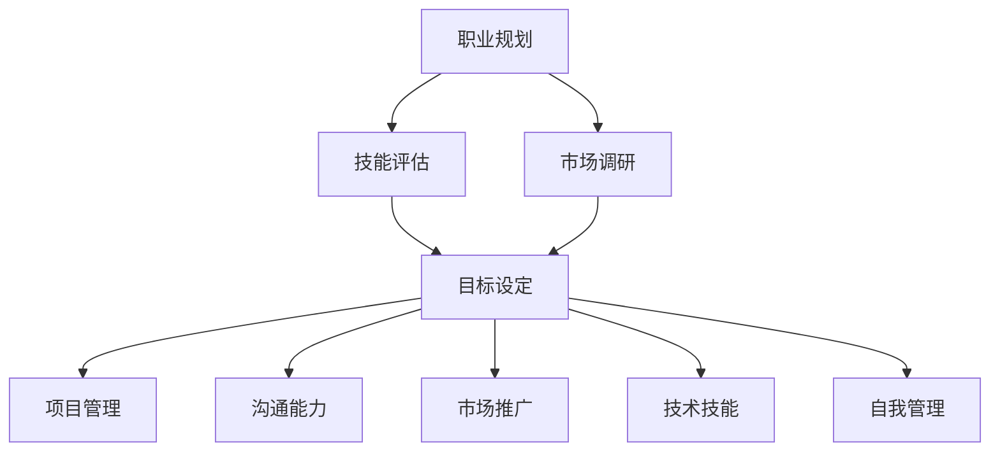

                 

关键词：全职工作、自由职业、过渡、职业规划、技能提升、远程工作、创业

## 摘要

本文将探讨从全职工作向自由职业过渡的过程。无论是出于对工作环境、时间灵活性还是个人职业发展的考虑，许多专业人士都在寻求这种转变。文章将分析过渡过程中的挑战与机遇，并给出实用的策略和建议，帮助读者顺利实现这一转变。

## 1. 背景介绍

### 1.1 全职工作的特点

全职工作通常提供稳定的收入、固定的办公时间和明确的职责分工。雇主和员工之间形成了一种长期的雇佣关系，这种关系基于合同和明确的期望。全职工作者通常享有各种福利，如医疗保险、退休金计划等。

### 1.2 自由职业的特点

自由职业者则拥有更高的自主权，可以自由选择项目和工作时间。他们通常以合同或项目为基础，与多个客户或雇主合作。自由职业者的收入不稳定，但可以在时间和工作地点上实现更大的灵活性。

### 1.3 从全职工作到自由职业的动机

许多人选择从全职工作转向自由职业，主要是为了追求以下目标：

- **更高的工作满意度**：自由职业者可以从事自己真正热爱的工作，追求内心的满足感。
- **灵活的工作时间**：自由职业者可以根据自己的日程安排工作，平衡职业与个人生活。
- **更高的收入潜力**：通过自主接项目，自由职业者可以为自己设定更高的收费标准，追求更高的收入。
- **职业发展**：自由职业者有机会接触到更广泛的项目和任务，从而不断提升自己的技能和经验。

## 2. 核心概念与联系

为了成功过渡到自由职业，需要理解以下核心概念：

### 2.1 职业规划

职业规划是成功过渡的关键。这意味着你需要明确自己的职业目标，并制定实现这些目标的策略。职业规划需要包括：

- **技能评估**：了解自己的优势和劣势，确定哪些技能需要在过渡过程中进行提升。
- **市场调研**：研究市场需求，了解你的技能在自由职业市场中的价值。
- **目标设定**：设定短期和长期的职业目标，确保你的努力有方向。

### 2.2 技能提升

作为自由职业者，技能的提升至关重要。以下是一些关键技能：

- **项目管理**：能够有效地规划和管理项目，确保按时交付高质量的工作。
- **沟通能力**：良好的沟通能力对于与客户、合作伙伴和团队成员的协作至关重要。
- **市场推广**：了解如何有效地推广自己的服务和品牌，吸引潜在客户。
- **技术技能**：不断提升与你的专业领域相关的技术技能。

### 2.3 自我管理

自由职业者需要强大的自我管理能力。这包括：

- **时间管理**：合理安排时间，确保高效工作。
- **财务管理**：管理个人财务，确保收入和支出平衡。
- **健康与平衡**：保持良好的工作与生活平衡，避免过度工作。

### 2.4 Mermaid 流程图



## 3. 核心算法原理 & 具体操作步骤

### 3.1 算法原理概述

过渡到自由职业的过程可以看作是一个多步骤的决策过程。这个过程的核心是平衡自我提升、市场拓展和客户关系管理。以下是具体的算法原理：

### 3.2 算法步骤详解

#### 3.2.1 第一步：自我评估

- **技能评估**：通过自我评估工具，了解自己的技能和兴趣。
- **优势分析**：分析自己的优势和劣势，确定需要提升的技能。

#### 3.2.2 第二步：市场调研

- **行业分析**：研究目标行业的趋势和需求。
- **竞争对手分析**：了解竞争对手的优势和劣势。

#### 3.2.3 第三步：制定职业规划

- **目标设定**：设定短期和长期的职业目标。
- **策略制定**：制定实现目标的策略和计划。

#### 3.2.4 第四步：提升技能

- **学习计划**：制定学习计划，提升关键技能。
- **实践应用**：将所学技能应用于实际工作中。

#### 3.2.5 第五步：市场推广

- **建立品牌**：创建个人品牌，提升市场知名度。
- **推广策略**：制定有效的市场推广策略。

#### 3.2.6 第六步：客户关系管理

- **客户拓展**：积极拓展新客户。
- **客户维护**：保持与现有客户的良好关系。

### 3.3 算法优缺点

#### 优点

- **灵活性**：可以根据自己的时间安排工作。
- **自主性**：可以自由选择项目和客户。
- **收入潜力**：通过自我定价，有可能获得更高的收入。

#### 缺点

- **收入不稳定**：可能面临收入波动。
- **自我管理**：需要更强的自我管理能力。
- **市场压力**：需要不断更新技能和知识。

### 3.4 算法应用领域

该算法适用于所有希望在全职工作后转向自由职业的专业人士，尤其是IT、设计、写作等领域的专业人士。

## 4. 数学模型和公式 & 详细讲解 & 举例说明

### 4.1 数学模型构建

自由职业者的收入可以表示为以下数学模型：

\[ R = p \times Q \]

其中，\( R \) 是收入，\( p \) 是每小时的收费标准，\( Q \) 是每小时工作的数量。

### 4.2 公式推导过程

收入 \( R \) 是每小时收费 \( p \) 与每小时工作数量 \( Q \) 的乘积。因此，收入可以表示为：

\[ R = p \times Q \]

### 4.3 案例分析与讲解

假设一个自由职业者的每小时收费标准是 \( p = 100 \) 美元，他每个月工作 \( Q = 160 \) 小时，那么他的月收入 \( R \) 为：

\[ R = 100 \times 160 = 16000 \text{美元} \]

如果他的收费标准提高 10%，即 \( p = 110 \) 美元，同时保持每月工作小时数不变，那么他的月收入 \( R \) 将为：

\[ R = 110 \times 160 = 17600 \text{美元} \]

可以看到，通过提高收费标准，他的月收入增加了。

## 5. 项目实践：代码实例和详细解释说明

### 5.1 开发环境搭建

在开始编程实践之前，需要搭建一个合适的开发环境。以Python为例，你可以使用以下步骤来搭建环境：

1. 安装Python（版本3.8或更高）
2. 安装IDE（如PyCharm或VSCode）
3. 安装必要的库（如NumPy、Pandas等）

### 5.2 源代码详细实现

以下是一个简单的Python代码实例，用于计算自由职业者的收入：

```python
def calculate_income(hourly_rate, hours_worked):
    return hourly_rate * hours_worked

# 设置每小时收费和每月工作小时数
hourly_rate = 100
hours_worked = 160

# 计算月收入
monthly_income = calculate_income(hourly_rate, hours_worked)
print(f"每月收入: {monthly_income}美元")
```

### 5.3 代码解读与分析

这段代码定义了一个名为 `calculate_income` 的函数，用于计算收入。函数接受每小时收费和每小时工作数量作为参数，返回总收入。

在主程序部分，我们设置了每小时收费为 100 美元，每月工作小时数为 160 小时。通过调用 `calculate_income` 函数，我们计算出了月收入，并打印出来。

### 5.4 运行结果展示

假设我们的开发环境已经搭建好，我们可以在命令行中运行这段代码：

```bash
$ python income.py
每月收入: 16000美元
```

这将显示每月收入为 16000 美元。

## 6. 实际应用场景

### 6.1 技术咨询服务

许多技术专家选择成为自由职业者，为客户提供技术咨询和服务。他们可以利用自己的专业技能，为企业解决技术难题，提高业务效率。

### 6.2 项目合作

自由职业者可以与多个客户或团队合作，参与不同类型的项目。这种合作不仅能够提升个人技能，还能拓展人际关系网络。

### 6.3 个人品牌建设

通过在社交媒体、博客等平台上分享经验和知识，自由职业者可以建立自己的个人品牌，吸引更多的客户和合作伙伴。

## 7. 未来应用展望

随着远程工作和远程协作工具的不断发展，自由职业将越来越受到欢迎。未来，自由职业者将有更多的机会和平台展示自己的技能和才华。

## 8. 总结：未来发展趋势与挑战

### 8.1 研究成果总结

本文探讨了从全职工作到自由职业的过渡过程，分析了过渡过程中的核心概念和算法原理，并提供了实际应用场景和未来发展趋势。

### 8.2 未来发展趋势

- **远程工作的普及**：随着技术的进步，远程工作将越来越普遍。
- **自由职业者的专业化**：自由职业者将更加专业化，提供更高质量的服务。
- **数字化的提升**：数字工具将帮助自由职业者更高效地管理项目和客户。

### 8.3 面临的挑战

- **收入不稳定**：自由职业者可能面临收入波动。
- **自我管理**：自由职业者需要更强的自我管理能力。
- **技能更新**：技术快速发展，自由职业者需要不断更新技能。

### 8.4 研究展望

未来的研究可以集中在如何帮助自由职业者更好地管理时间、财务和心理健康，以及如何提高他们的市场竞争力。

## 9. 附录：常见问题与解答

### 9.1 如何开始自由职业？

- **自我评估**：了解自己的技能和兴趣。
- **市场调研**：研究市场需求和竞争对手。
- **制定计划**：设定职业目标并制定实现目标的策略。

### 9.2 如何管理自由职业的收入波动？

- **建立紧急基金**：为不稳定的收入设置紧急储备。
- **多元化收入来源**：不要依赖单一收入来源。
- **合理规划支出**：避免不必要的开支，确保收入和支出平衡。

### 9.3 如何保持工作与生活的平衡？

- **时间管理**：合理安排工作时间，避免过度工作。
- **健康生活方式**：保持良好的饮食和锻炼习惯。
- **定期休息**：确保有足够的休息时间，避免工作疲劳。

## 作者署名

作者：禅与计算机程序设计艺术 / Zen and the Art of Computer Programming
-------------------------------------------------------------------

以上就是从全职工作到自由职业的过渡的全篇文章，希望能够对您提供帮助。如果您有任何问题或需要进一步的讨论，欢迎随时提出。祝您在职业道路上一切顺利！


