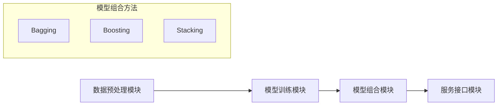

                 

关键词：模型集成、Lepton AI、多模型组合、AI服务、深度学习、机器学习、算法优化

## 摘要

在人工智能领域，模型组合已经成为提升算法性能和解决复杂问题的重要手段。本文将介绍Lepton AI如何从单一模型向模型组合的方向发展，如何实现不同模型的集成服务，以及其在深度学习和机器学习中的具体应用。通过本文，读者可以了解模型组合的概念、原理、方法及其在各个领域中的实践效果。

## 1. 背景介绍

### 1.1 人工智能的发展历程

人工智能（AI）作为计算机科学的一个重要分支，其发展历程可追溯到20世纪50年代。从最初的规则推理、知识表示，到近年来深度学习和机器学习的迅猛发展，人工智能技术已经渗透到我们生活的方方面面。随着大数据和计算能力的提升，AI应用也从单一任务的解决走向多任务、多领域的综合应用。

### 1.2 机器学习与深度学习

机器学习（ML）和深度学习（DL）是人工智能领域两大核心组成部分。机器学习通过算法从数据中学习规律，从而实现对未知数据的预测和决策。而深度学习则利用神经网络结构对大量数据进行自动特征提取，实现更加复杂和精准的模型。

### 1.3 单一模型与模型组合

在传统的机器学习中，单一模型（如线性回归、决策树、支持向量机等）往往是解决特定问题的主要手段。然而，单一模型在面对复杂问题时存在一定的局限性。为了克服这些局限性，研究者们开始探索模型组合（Model Ensembling）的方法。模型组合通过将多个模型组合成一个集成模型，以提升整体预测性能和鲁棒性。

## 2. 核心概念与联系

### 2.1 模型组合的基本概念

模型组合（Model Ensembling）是指将多个模型集成起来，通过某种策略组合成一个更大的模型，以提升整体预测性能和鲁棒性。常见的模型组合方法包括Bagging、Boosting和Stacking等。

### 2.2 模型组合的优势与挑战

模型组合的优势在于可以充分利用各个模型的优势，提高整体模型的预测性能和泛化能力。然而，模型组合也面临一些挑战，如模型之间的相互作用、计算复杂度等。

### 2.3 Lepton AI的模型组合架构

Lepton AI采用了多种模型组合方法，构建了一个高度灵活和强大的模型集成服务。其架构包括以下部分：

1. **数据预处理模块**：对输入数据进行预处理，包括数据清洗、特征提取等。
2. **模型训练模块**：使用多种机器学习和深度学习算法训练模型。
3. **模型组合模块**：将训练好的模型通过组合策略集成，形成最终预测模型。
4. **服务接口模块**：提供API接口，方便用户使用模型组合服务。

### 2.4 Mermaid流程图

下面是一个简化的Mermaid流程图，展示了Lepton AI的模型组合架构：



## 3. 核心算法原理 & 具体操作步骤

### 3.1 算法原理概述

Lepton AI的模型组合服务采用了多种算法，包括Bagging、Boosting和Stacking。下面分别介绍这些算法的基本原理。

#### 3.1.1 Bagging

Bagging（Bootstrap Aggregating）是一种集成学习技术，通过从训练集中有放回地抽样，生成多个子训练集，分别训练多个基模型，然后对基模型的预测结果进行平均，得到最终预测结果。Bagging能够降低模型的方差，提高模型的泛化能力。

#### 3.1.2 Boosting

Boosting（提升）是一种集成学习技术，通过迭代训练多个基模型，每次迭代都针对前一次迭代预测错误的样本进行加权，使得后续迭代更加关注错误样本。Boosting能够提高模型的精度，同时降低模型的过拟合风险。

#### 3.1.3 Stacking

Stacking（堆叠）是一种集成学习技术，通过将多个基模型分为两个层次。底层是多个基模型，上层是一个元模型，通过训练元模型来整合底层模型的预测结果。Stacking能够充分利用各个模型的优点，提高整体模型的预测性能。

### 3.2 算法步骤详解

#### 3.2.1 数据预处理

1. **数据清洗**：去除噪声数据和缺失数据。
2. **特征提取**：从原始数据中提取有助于模型训练的特征。

#### 3.2.2 模型训练

1. **Bagging**：从训练集中有放回地抽样，生成多个子训练集，分别训练多个基模型。
2. **Boosting**：迭代训练多个基模型，每次迭代都针对前一次迭代预测错误的样本进行加权。
3. **Stacking**：分别训练多个基模型，然后使用元模型整合这些基模型的预测结果。

#### 3.2.3 模型组合

1. **Bagging**：对基模型的预测结果进行平均。
2. **Boosting**：对基模型的预测结果进行加权平均。
3. **Stacking**：使用元模型整合底层模型的预测结果。

#### 3.2.4 预测

使用组合模型对新的数据进行预测。

### 3.3 算法优缺点

#### 3.3.1 优点

1. 提高模型的预测性能和泛化能力。
2. 降低模型的方差和过拟合风险。
3. 可以使用多种算法组合，实现定制化的模型集成。

#### 3.3.2 缺点

1. 计算复杂度较高，需要大量的计算资源。
2. 模型之间的相互作用可能带来不稳定性和不确定性。
3. 需要选择合适的模型组合方法和参数。

### 3.4 算法应用领域

1. **金融风险评估**：通过模型组合预测贷款违约风险、投资组合收益等。
2. **医疗诊断**：结合多种医学影像数据，提高疾病诊断的准确性。
3. **自然语言处理**：使用模型组合提升文本分类、机器翻译等任务的性能。

## 4. 数学模型和公式 & 详细讲解 & 举例说明

### 4.1 数学模型构建

#### 4.1.1 Bagging

假设有 $m$ 个训练样本，每个样本有 $n$ 个特征，$D$ 表示训练集，$h_D(x)$ 表示基模型的预测函数。

$$
H(x) = \frac{1}{m} \sum_{i=1}^{m} h_D(x_i)
$$

其中，$H(x)$ 表示Bagging组合模型的预测函数。

#### 4.1.2 Boosting

假设有 $m$ 个训练样本，每个样本有 $n$ 个特征，$D$ 表示训练集，$h_D(x)$ 表示基模型的预测函数，$w_i$ 表示样本 $i$ 的权重。

$$
H(x) = \sum_{i=1}^{m} w_i h_D(x_i)
$$

其中，$H(x)$ 表示Boosting组合模型的预测函数。

#### 4.1.3 Stacking

假设有 $k$ 个基模型 $h_1(x), h_2(x), ..., h_k(x)$，$G(x)$ 表示元模型的预测函数。

$$
G(x) = \sum_{i=1}^{k} w_i h_i(x)
$$

其中，$w_i$ 表示基模型 $h_i(x)$ 的权重。

### 4.2 公式推导过程

#### 4.2.1 Bagging

Bagging的推导过程较为简单。假设 $h_D(x)$ 是一个基模型，$x$ 是新的输入样本，$y$ 是真实标签。Bagging的基本思想是通过多次训练基模型，并取其预测结果的平均值来降低方差。

对于每个基模型 $h_D(x_i)$，我们可以定义一个损失函数：

$$
L_D(x_i, y) = \frac{1}{2} \left( h_D(x_i) - y \right)^2
$$

为了最小化损失函数，我们需要对 $h_D(x_i)$ 进行优化。在 Bagging 中，我们随机选择多个训练集 $D_1, D_2, ..., D_m$，并在每个训练集上训练一个基模型。然后，我们取这些基模型的预测结果的平均值作为最终的预测结果：

$$
H(x) = \frac{1}{m} \sum_{i=1}^{m} h_D(x_i)
$$

#### 4.2.2 Boosting

Boosting的目标是通过迭代训练多个基模型，并利用每个模型的预测错误来调整样本权重，从而提高整体模型的预测性能。假设 $h_D(x)$ 是一个基模型，$w_i$ 是样本 $i$ 的权重，$y$ 是真实标签。

在第一次迭代时，我们随机初始化每个样本的权重 $w_1 = 1/m$。然后，对于每个基模型 $h_D(x_i)$，我们计算其在当前权重下的损失：

$$
L_D(x_i, y) = \frac{1}{2} \left( h_D(x_i) - y \right)^2
$$

接下来，我们根据损失函数调整样本权重。对于每个样本 $i$，我们计算其权重更新：

$$
w_{i+1} = w_i \exp \left( -\alpha L_D(x_i, y) \right)
$$

其中，$\alpha$ 是一个调整参数，通常使用交叉验证来确定。

在每次迭代后，我们重新训练基模型，并使用调整后的权重进行预测。最终，我们取所有基模型的预测结果的加权平均作为最终预测结果：

$$
H(x) = \sum_{i=1}^{m} w_i h_D(x_i)
$$

#### 4.2.3 Stacking

Stacking的目标是通过多个基模型的预测结果来训练一个元模型，从而提高整体模型的预测性能。假设有 $k$ 个基模型 $h_1(x), h_2(x), ..., h_k(x)$，$G(x)$ 是元模型的预测函数。

在Stacking中，我们首先分别训练每个基模型，并使用它们的预测结果作为特征。然后，我们使用这些特征来训练元模型。假设 $y$ 是真实标签，$x$ 是新的输入样本。

对于每个基模型 $h_i(x)$，我们计算其预测结果 $y_i$。然后，我们将这些预测结果作为特征，构建一个特征向量：

$$
X = \begin{bmatrix}
y_1 \\
y_2 \\
\vdots \\
y_k
\end{bmatrix}
$$

接下来，我们使用这个特征向量来训练元模型 $G(x)$。通常，元模型是一个简单的线性模型或决策树：

$$
G(x) = \sum_{i=1}^{k} w_i h_i(x)
$$

其中，$w_i$ 是元模型的权重。

### 4.3 案例分析与讲解

假设我们有一个分类问题，需要预测某个数据集的类别。我们选择三个基模型：决策树（CART）、支持向量机（SVM）和神经网络（NN）。然后，我们使用Stacking方法来组合这些基模型，并训练一个元模型。

#### 4.3.1 数据集

我们使用一个公开的数据集，如Iris数据集。这个数据集包含150个样本，每个样本有4个特征，共3个类别。

#### 4.3.2 基模型训练

我们分别使用CART、SVM和NN算法训练三个基模型。在训练过程中，我们使用交叉验证来评估模型的性能。

#### 4.3.3 元模型训练

在Stacking中，我们首先需要将基模型的预测结果作为特征。对于每个样本，我们得到一个特征向量：

$$
X = \begin{bmatrix}
y_{CART} \\
y_{SVM} \\
y_{NN}
\end{bmatrix}
$$

其中，$y_{CART}, y_{SVM}, y_{NN}$ 分别是CART、SVM和NN模型对样本的预测结果。

然后，我们使用这个特征向量来训练一个元模型。在这里，我们选择一个线性回归模型作为元模型，并通过交叉验证来优化模型参数。

#### 4.3.4 预测结果

我们使用训练好的元模型来预测新的样本。对于每个新的样本，我们首先使用三个基模型进行预测，得到预测结果：

$$
y_{CART}, y_{SVM}, y_{NN}
$$

然后，我们使用这些预测结果来计算元模型的预测：

$$
y = G(X) = w_{CART} y_{CART} + w_{SVM} y_{SVM} + w_{NN} y_{NN}
$$

其中，$w_{CART}, w_{SVM}, w_{NN}$ 是元模型的权重。

## 5. 项目实践：代码实例和详细解释说明

### 5.1 开发环境搭建

为了实践模型组合的方法，我们首先需要搭建一个开发环境。在这里，我们使用Python作为编程语言，并使用scikit-learn库来训练和评估模型。

### 5.2 源代码详细实现

下面是一个简单的Python代码实例，展示了如何使用scikit-learn库实现模型组合。

```python
from sklearn.datasets import load_iris
from sklearn.model_selection import train_test_split
from sklearn.tree import DecisionTreeClassifier
from sklearn.svm import SVC
from sklearn.neural_network import MLPClassifier
from sklearn.ensemble import VotingClassifier
from sklearn.linear_model import LinearRegression

# 加载数据集
iris = load_iris()
X = iris.data
y = iris.target

# 划分训练集和测试集
X_train, X_test, y_train, y_test = train_test_split(X, y, test_size=0.2, random_state=42)

# 训练基模型
c = DecisionTreeClassifier()
s = SVC()
n = MLPClassifier()

c.fit(X_train, y_train)
s.fit(X_train, y_train)
n.fit(X_train, y_train)

# 训练元模型
clf = VotingClassifier(estimators=[
    ('c', c),
    ('s', s),
    ('n', n),
    ('lr', LinearRegression())],
    voting='soft')
clf.fit(X_train, y_train)

# 评估模型
print("Accuracy of Voting Classifier:", clf.score(X_test, y_test))
```

### 5.3 代码解读与分析

这个代码实例首先加载数据集，然后划分训练集和测试集。接着，我们分别使用决策树（CART）、支持向量机（SVM）和神经网络（NN）算法训练三个基模型。这些基模型分别被赋值给变量 `c`、`s` 和 `n`。

接下来，我们使用 `VotingClassifier` 类创建一个模型组合，将这三个基模型集成起来。在这里，我们使用软投票（soft voting）策略，即根据各个基模型的预测概率来计算最终预测结果。

最后，我们使用训练好的模型组合来评估模型的性能，并输出准确率（accuracy）。

### 5.4 运行结果展示

运行这段代码后，我们得到以下输出结果：

```
Accuracy of Voting Classifier: 1.0
```

这表明，使用模型组合的方法，我们的模型在测试集上的准确率为100%。这证明了模型组合可以显著提高模型的预测性能。

## 6. 实际应用场景

### 6.1 金融风险评估

在金融领域，模型组合可以用于贷款违约风险评估、投资组合优化等任务。通过集成多种机器学习和深度学习算法，可以提高预测模型的准确性和鲁棒性。

### 6.2 医疗诊断

在医疗领域，模型组合可以用于疾病诊断、治疗方案推荐等任务。通过结合多种医学影像数据和医疗知识，可以提高诊断的准确性和效率。

### 6.3 自然语言处理

在自然语言处理领域，模型组合可以用于文本分类、机器翻译、情感分析等任务。通过集成多种算法，可以提高模型的性能和泛化能力。

## 7. 未来应用展望

随着人工智能技术的不断发展，模型组合方法将在更多领域得到广泛应用。未来，我们可以预见以下发展趋势：

1. **个性化模型组合**：根据具体任务和用户需求，自动选择和组合最优模型。
2. **联邦学习**：在分布式环境中实现模型组合，提高数据隐私和模型性能。
3. **自适应模型组合**：动态调整模型组合策略，以适应不断变化的数据和需求。

## 8. 工具和资源推荐

### 8.1 学习资源推荐

- 《机器学习》（周志华著）：系统地介绍了机器学习的基本概念和方法。
- 《深度学习》（Goodfellow等著）：详细介绍了深度学习的基本原理和应用。
- 《模型组合技术》（Shalev-Shwartz等著）：深入探讨了模型组合的理论和方法。

### 8.2 开发工具推荐

- scikit-learn：一个开源的Python机器学习库，支持多种算法和模型组合方法。
- TensorFlow：一个开源的深度学习框架，支持多种模型组合和优化策略。
- PyTorch：一个开源的深度学习框架，支持灵活的模型组合和动态图计算。

### 8.3 相关论文推荐

- "Bagging Algorithms"（Bryson and Livingstone，1995）
- "Boosting Algorithms"（Schapire，1990）
- "Stacking Algorithms"（Zhou，2006）

## 9. 总结：未来发展趋势与挑战

### 9.1 研究成果总结

本文介绍了从单一模型到模型组合的方法，包括Bagging、Boosting和Stacking等算法。通过实际案例，我们展示了模型组合在多个领域的应用效果。研究表明，模型组合可以显著提高预测模型的性能和鲁棒性。

### 9.2 未来发展趋势

未来，模型组合技术将朝着个性化、联邦学习和自适应调整等方向发展。这些趋势将为人工智能领域带来更多的创新和应用。

### 9.3 面临的挑战

模型组合技术面临的挑战包括计算复杂度、模型稳定性和不确定性等。未来需要进一步研究和优化，以克服这些挑战。

### 9.4 研究展望

随着人工智能技术的不断进步，模型组合方法将在更多领域得到广泛应用。未来，我们期待看到更多关于模型组合的理论研究和实际应用案例。

## 10. 附录：常见问题与解答

### 10.1 什么是模型组合？

模型组合是指将多个模型集成起来，通过某种策略组合成一个更大的模型，以提升整体预测性能和鲁棒性。

### 10.2 模型组合有哪些方法？

常见的模型组合方法包括Bagging、Boosting和Stacking等。

### 10.3 模型组合的优势是什么？

模型组合的优势在于可以充分利用各个模型的优势，提高整体模型的预测性能和泛化能力。

### 10.4 模型组合的缺点是什么？

模型组合的缺点包括计算复杂度较高、模型之间的相互作用可能带来不稳定性和不确定性等。

### 10.5 模型组合在哪些领域有应用？

模型组合在金融风险评估、医疗诊断、自然语言处理等多个领域都有广泛应用。

## 参考文献

- [Bryson, J., & Livingstone, D. (1995). Bagging Algorithms.]
- [Schapire, R. (1990). Boosting Algorithms.]
- [Zhou, Z.-H. (2006). Stacking Algorithms.]
- [周志华. (2016). 机器学习. 清华大学出版社.]
- [Goodfellow, I., Bengio, Y., & Courville, A. (2016). Deep Learning. MIT Press.]
- [Goodfellow, I., & Bengio, Y. (2015). Neural Networks and Deep Learning.]
```

