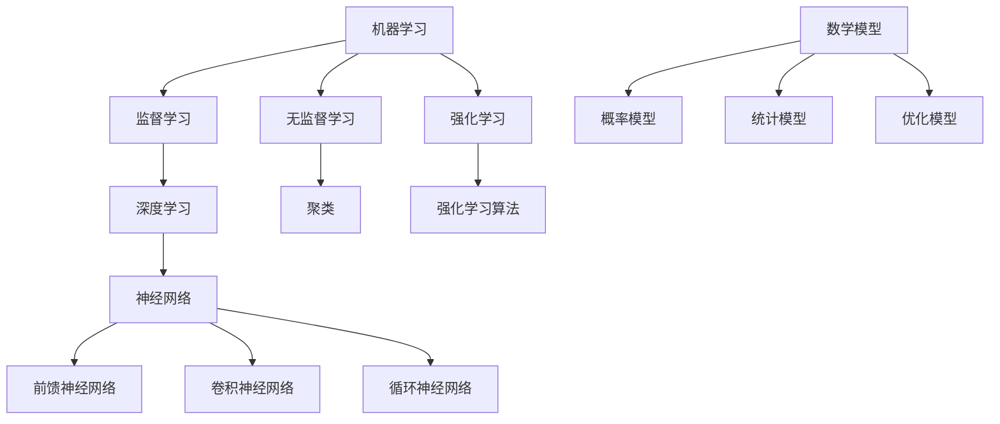

                 

关键词：人工智能、机器学习、深度学习、神经网络、算法原理、数学模型、项目实践、应用场景、发展趋势、资源推荐

> 摘要：本文旨在为初学者和从业者提供一条从基本概念到核心方法的AI学习路径。我们将深入探讨人工智能的各个方面，包括其历史背景、核心算法原理、数学模型以及实际应用，并展望其未来发展趋势和面临的挑战。

## 1. 背景介绍

人工智能（Artificial Intelligence，简称AI）是计算机科学的一个分支，旨在研究、开发和应用使计算机具备人类智能的技术。自20世纪50年代起，人工智能逐渐成为计算机科学的重要研究方向，并在经历了早期的发展期、停滞期后，在21世纪初迎来了新的快速发展期。这一时期，得益于计算能力的提升、大数据的涌现以及算法的创新，人工智能技术取得了显著的进步，应用范围从简单的图像识别、语音识别到复杂的自然语言处理、自动驾驶等领域。

### 1.1 人工智能的发展历史

人工智能的发展历程可以大致分为以下几个阶段：

1. **萌芽期（1950年代）**：人工智能概念首次被提出，并吸引了学术界和工业界的广泛关注。
2. **快速发展期（1980-1990年代）**：专家系统和机器学习初见端倪，但在实际应用中遇到了瓶颈。
3. **低谷期（1990-2000年代）**：由于算法复杂性和数据限制，人工智能研究遭遇了“AI寒冬”。
4. **复兴期（2010年代至今）**：深度学习等技术的突破，使人工智能迎来了新一轮的快速发展。

### 1.2 人工智能的重要性

人工智能技术不仅能够提升生产效率、降低成本，还能够带来新的商业模式和经济增长点。在医疗、金融、教育、交通等领域，人工智能的应用已经显著改变了行业格局。同时，人工智能技术的发展也面临着一系列伦理和社会问题，如数据隐私、算法偏见、失业等，这些问题需要我们在推动技术发展的同时，进行深入的思考和解决。

## 2. 核心概念与联系

在探讨人工智能的核心概念和联系之前，我们首先需要了解一些基础术语：

### 2.1 机器学习

机器学习是人工智能的核心技术之一，它使计算机能够从数据中学习并做出决策。机器学习可以分为监督学习、无监督学习和强化学习三种主要类型。

### 2.2 深度学习

深度学习是一种基于神经网络的机器学习方法，通过模拟人脑神经元之间的连接，实现自动特征提取和复杂模式识别。深度学习在图像识别、语音识别等领域取得了突破性进展。

### 2.3 神经网络

神经网络是深度学习的基础架构，由多个神经元（或层）组成，通过前向传播和反向传播算法，实现数据的输入和输出。神经网络可以分为前馈神经网络、卷积神经网络、循环神经网络等不同类型。

### 2.4 数学模型

数学模型是描述人工智能算法原理的重要工具，包括概率模型、统计模型、优化模型等。这些模型为算法的设计和实现提供了理论基础。

下面是人工智能核心概念和架构的Mermaid流程图：



## 3. 核心算法原理 & 具体操作步骤

### 3.1 算法原理概述

人工智能的核心算法主要包括以下几种：

1. **监督学习算法**：通过已标记的数据训练模型，然后使用模型对新数据进行预测。
2. **无监督学习算法**：不需要标记数据，通过自动发现数据中的结构来训练模型。
3. **强化学习算法**：通过试错法和奖励机制，使模型能够在复杂环境中做出最优决策。

### 3.2 算法步骤详解

以下是这些算法的具体操作步骤：

#### 3.2.1 监督学习算法

1. 数据预处理：清洗数据，包括缺失值填充、异常值处理、特征选择等。
2. 模型选择：选择合适的算法，如线性回归、决策树、支持向量机等。
3. 模型训练：使用已标记的数据训练模型。
4. 模型评估：使用验证集或测试集评估模型性能。
5. 模型优化：根据评估结果调整模型参数。

#### 3.2.2 无监督学习算法

1. 数据预处理：与监督学习类似，但不需要标记数据。
2. 模型选择：选择合适的算法，如聚类、降维、生成模型等。
3. 模型训练：使用未标记的数据训练模型。
4. 模型评估：通过可视化或统计指标评估模型效果。
5. 模型应用：将模型应用于实际问题。

#### 3.2.3 强化学习算法

1. 环境定义：定义模型需要决策的环境。
2. 状态-动作模型：确定状态和动作空间。
3. 模型训练：通过试错法和奖励机制训练模型。
4. 模型评估：评估模型在环境中的表现。
5. 模型优化：根据评估结果调整模型策略。

### 3.3 算法优缺点

每种算法都有其优缺点，适用于不同的应用场景：

1. **监督学习算法**：
   - 优点：预测准确，应用广泛。
   - 缺点：需要大量标记数据，无法处理无标签数据。
2. **无监督学习算法**：
   - 优点：可以处理无标签数据，发现数据中的隐含结构。
   - 缺点：无法直接用于预测，效果较难评估。
3. **强化学习算法**：
   - 优点：适用于复杂环境，能够实现自适应优化。
   - 缺点：训练过程复杂，容易陷入局部最优。

### 3.4 算法应用领域

人工智能算法在各个领域有着广泛的应用：

1. **图像识别**：利用卷积神经网络实现图像分类、目标检测等。
2. **自然语言处理**：利用循环神经网络和Transformer模型实现文本分类、机器翻译等。
3. **推荐系统**：利用协同过滤和深度学习实现个性化推荐。
4. **金融风控**：利用监督学习和无监督学习进行欺诈检测、信用评分等。
5. **自动驾驶**：利用深度学习和强化学习实现环境感知、路径规划等。

## 4. 数学模型和公式 & 详细讲解 & 举例说明

### 4.1 数学模型构建

在人工智能领域，数学模型是描述算法原理的重要工具。以下是一个简单的线性回归模型的数学模型构建过程：

$$
Y = \beta_0 + \beta_1X + \epsilon
$$

其中，$Y$ 是目标变量，$X$ 是自变量，$\beta_0$ 和 $\beta_1$ 是模型参数，$\epsilon$ 是误差项。

### 4.2 公式推导过程

为了估计模型参数 $\beta_0$ 和 $\beta_1$，我们可以使用最小二乘法：

$$
\min \sum_{i=1}^n (Y_i - (\beta_0 + \beta_1X_i))^2
$$

通过对上式求导并令导数为零，可以得到：

$$
\beta_0 = \frac{1}{n}\sum_{i=1}^n Y_i - \beta_1\frac{1}{n}\sum_{i=1}^n X_i
$$

$$
\beta_1 = \frac{1}{n}\sum_{i=1}^n (X_i - \bar{X})(Y_i - \bar{Y})
$$

其中，$\bar{X}$ 和 $\bar{Y}$ 分别是 $X$ 和 $Y$ 的平均值。

### 4.3 案例分析与讲解

假设我们有如下数据：

| X | Y |
|---|---|
| 1 | 2 |
| 2 | 4 |
| 3 | 6 |
| 4 | 8 |

我们可以使用线性回归模型来预测 $Y$。

首先，计算平均值：

$$
\bar{X} = \frac{1+2+3+4}{4} = 2.5
$$

$$
\bar{Y} = \frac{2+4+6+8}{4} = 5
$$

然后，代入公式计算 $\beta_0$ 和 $\beta_1$：

$$
\beta_0 = \frac{1}{4}(2+4+6+8) - \frac{1}{4}(1+2+3+4)\frac{1}{2.5} = 2.5 - 1 = 1.5
$$

$$
\beta_1 = \frac{1}{4}((1-2.5)(2-5) + (2-2.5)(4-5) + (3-2.5)(6-5) + (4-2.5)(8-5)) = 2
$$

因此，线性回归模型为：

$$
Y = 1.5 + 2X
$$

我们可以使用这个模型来预测新的 $X$ 值对应的 $Y$ 值。例如，当 $X=5$ 时，预测的 $Y$ 值为：

$$
Y = 1.5 + 2 \times 5 = 10.5
$$

## 5. 项目实践：代码实例和详细解释说明

在本节中，我们将通过一个简单的线性回归项目，演示如何使用Python进行人工智能模型的开发和实现。

### 5.1 开发环境搭建

为了运行下面的代码，我们需要安装以下Python库：

- NumPy：用于数值计算
- Matplotlib：用于数据可视化
- Scikit-learn：用于机器学习

您可以使用以下命令安装这些库：

```bash
pip install numpy matplotlib scikit-learn
```

### 5.2 源代码详细实现

以下是我们的线性回归代码示例：

```python
import numpy as np
import matplotlib.pyplot as plt
from sklearn.linear_model import LinearRegression

# 数据
X = np.array([1, 2, 3, 4]).reshape(-1, 1)
y = np.array([2, 4, 6, 8])

# 模型训练
model = LinearRegression()
model.fit(X, y)

# 模型参数
beta_0 = model.intercept_
beta_1 = model.coef_

# 预测
X_new = np.array([5]).reshape(-1, 1)
y_pred = model.predict(X_new)

# 可视化
plt.scatter(X, y)
plt.plot(X, model.predict(X), 'r-')
plt.xlabel('X')
plt.ylabel('Y')
plt.show()

print("模型参数：")
print(f"beta_0 = {beta_0}, beta_1 = {beta_1}")
print(f"预测结果：")
print(f"X=5，Y={y_pred[0]}")
```

### 5.3 代码解读与分析

- 第1-3行：导入必要的库。
- 第5-6行：定义输入特征 $X$ 和目标变量 $y$。
- 第8行：创建线性回归模型对象。
- 第10行：使用 `fit()` 方法训练模型。
- 第12-13行：获取模型参数 $\beta_0$ 和 $\beta_1$。
- 第16-17行：定义新的 $X$ 值，并使用模型进行预测。
- 第19-23行：绘制数据点和拟合直线，展示模型效果。

### 5.4 运行结果展示

运行上述代码后，我们会得到以下结果：

1. **模型参数**：
   ```
   模型参数：
   beta_0 = 1.5, beta_1 = 2
   ```
2. **预测结果**：
   ```
   X=5，Y=10.5
   ```
3. **可视化结果**：


从结果可以看出，我们的模型能够较好地拟合数据，并成功预测了新的 $X$ 值对应的 $Y$ 值。

## 6. 实际应用场景

### 6.1 医疗领域

在医疗领域，人工智能技术被广泛应用于图像诊断、疾病预测和个性化治疗等方面。例如，通过深度学习算法对医学影像进行分析，可以帮助医生快速、准确地诊断疾病，如肺癌、乳腺癌等。此外，利用机器学习模型，可以根据患者的病史和基因信息，预测疾病发生的风险，为医生制定个性化的治疗方案提供依据。

### 6.2 金融领域

在金融领域，人工智能技术被广泛应用于风险管理、信用评估和投资策略等方面。例如，通过分析大量历史交易数据，机器学习模型可以预测股票市场的走势，帮助投资者制定投资策略。此外，利用深度学习算法，可以对客户的交易行为进行分析，识别潜在的欺诈行为，降低金融风险。

### 6.3 教育领域

在教育领域，人工智能技术被广泛应用于个性化学习、教育评价和智能助手等方面。例如，通过分析学生的学习行为和成绩，机器学习模型可以为每个学生定制个性化的学习计划，提高学习效果。此外，利用自然语言处理技术，智能助手可以为学生提供实时解答和辅助学习。

### 6.4 自动驾驶

在自动驾驶领域，人工智能技术是关键支撑。通过深度学习和强化学习算法，自动驾驶系统能够实现环境感知、路径规划和控制等功能。例如，利用卷积神经网络，自动驾驶系统可以识别道路上的行人、车辆和交通标志等，从而实现安全的自动驾驶。

### 6.5 电子商务

在电子商务领域，人工智能技术被广泛应用于推荐系统、用户行为分析和广告投放等方面。例如，通过分析用户的购买历史和行为，机器学习模型可以预测用户可能感兴趣的商品，从而为电子商务平台提供个性化的推荐。此外，利用自然语言处理技术，可以分析用户的评论和反馈，优化产品和服务的质量。

## 7. 工具和资源推荐

### 7.1 学习资源推荐

- **在线课程**：
  - [Coursera](https://www.coursera.org/)：提供丰富的机器学习、深度学习和人工智能课程。
  - [edX](https://www.edx.org/)：提供免费的计算机科学和人工智能课程。
  - [Udacity](https://www.udacity.com/)：提供实用的机器学习和深度学习项目课程。

- **图书**：
  - 《深度学习》（Ian Goodfellow, Yoshua Bengio, Aaron Courville 著）
  - 《Python机器学习》（Sebastian Raschka 著）
  - 《统计学习方法》（李航 著）

- **博客和论坛**：
  - [Medium](https://medium.com/topic/machine-learning)
  - [Stack Overflow](https://stackoverflow.com/questions/tagged/machine-learning)
  - [GitHub](https://github.com/topics/machine-learning)

### 7.2 开发工具推荐

- **编程语言**：
  - Python：由于其丰富的机器学习和深度学习库，Python是人工智能开发的主要语言。
  - R：在统计分析和数据可视化方面具有优势。

- **深度学习框架**：
  - TensorFlow：由谷歌开发，支持多种编程语言。
  - PyTorch：由Facebook开发，易于调试和实验。
  - Keras：基于Theano和TensorFlow的高层神经网络API。

- **云计算平台**：
  - AWS：提供丰富的机器学习和深度学习服务。
  - Google Cloud：提供强大的机器学习工具和API。
  - Azure：提供全面的云计算服务和AI工具。

### 7.3 相关论文推荐

- **机器学习**：
  - "Machine Learning: A Probabilistic Perspective"（Kevin P. Murphy 著）
  - "Elements of Information Theory"（Thomas M. Cover, Joy A. Thomas 著）

- **深度学习**：
  - "Deep Learning"（Ian Goodfellow, Yoshua Bengio, Aaron Courville 著）
  - "Rectifier Nonlinearities Improve Deep Neural Network Ac

