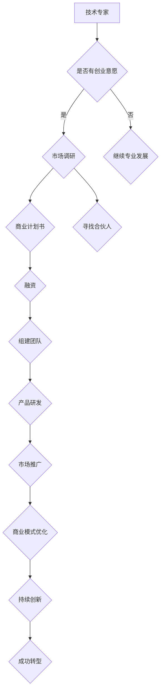

                 

关键词：技术专家、企业家、转型、企业管理、技术创新、商业模式、领导力、团队建设

> 摘要：本文旨在探讨技术专家如何成功转型成为企业家，从而推动企业创新与增长。通过分析技术专家转型过程中面临的挑战和机遇，本文提出了具体的转型策略，包括构建商业模式、培养领导力和团队建设等，以帮助技术专家在创业道路上取得成功。

## 1. 背景介绍

随着信息技术的飞速发展，技术专家在各个行业中的重要性日益凸显。他们不仅具备深厚的专业知识，还拥有丰富的实践经验。然而，技术专家在职业生涯中往往会面临一个关键选择：是继续在专业领域深耕，还是转型成为企业家，带领企业实现更大的突破和成长？

企业家精神与技术创新密不可分。企业家通过敏锐的市场洞察力、独特的商业模式和卓越的领导力，能够有效地整合资源，推动企业的创新和发展。技术专家具备这些要素中的大部分，因此他们在转型成为企业家时，往往具有得天独厚的优势。

然而，转型并非易事。技术专家需要面对诸多挑战，包括商业模式构建、团队管理、市场营销等方面。此外，他们还需要克服对失败的恐惧、调整心态，以及适应全新的角色和职责。本文将深入探讨技术专家转型成为企业家所面临的挑战、机遇和转型策略，以期为技术专家提供有价值的参考和指导。

## 2. 核心概念与联系

### 2.1. 技术专家与企业家

技术专家：技术专家是指在某一技术领域具备深厚专业知识和丰富实践经验的个人。他们通常在技术研发、项目管理和团队协作方面具有出色的能力。

企业家：企业家是指具有创新精神、创业精神和商业头脑的个人，他们通过创建、运营和管理企业，实现商业价值和社会价值的双重提升。

技术专家与企业家之间存在紧密的联系。技术专家在专业领域的深厚积累为他们转型成为企业家奠定了基础。同时，企业家精神中的创新思维、风险意识和商业洞察力也是技术专家在转型过程中所需的重要素质。

### 2.2. 企业家精神

企业家精神是指企业家在创业过程中表现出的创新意识、领导才能和冒险精神。它包括以下几个方面：

- 创新思维：企业家能够敏锐地捕捉市场机会，通过创新的产品和服务满足市场需求。
- 风险意识：企业家敢于面对失败和挑战，勇于承担风险，以实现企业的长远发展。
- 商业洞察力：企业家具备强大的商业敏感度，能够准确判断市场趋势和客户需求，制定有效的商业策略。
- 团队建设：企业家善于发现和培养人才，建立高效的团队，共同实现企业目标。

### 2.3. 技术创新与商业模式

技术创新是企业发展的核心驱动力。技术专家在专业领域的积累使他们具备较强的技术创新能力。然而，仅有技术创新还不足以推动企业的持续发展。企业家需要将技术创新与商业模式相结合，实现商业价值的最大化。

商业模式是指企业如何创造、传递和获取价值的一种系统化方法。一个成功的商业模式应包括以下几个方面：

- 价值主张：明确企业为客户创造的价值，满足市场需求。
- 客户关系：建立与客户的紧密联系，实现持续的业务增长。
- 收入流：确定企业的盈利模式，实现持续盈利。
- 成本结构：优化企业成本结构，提高运营效率。
- 资源和能力：整合企业内外部资源，提升企业竞争力。

### 2.4. Mermaid 流程图

为了更好地展示技术专家转型成为企业家的过程，我们使用Mermaid流程图来描述这一过程的关键节点和流程。



## 3. 核心算法原理 & 具体操作步骤

### 3.1. 算法原理概述

技术专家转型成为企业家的核心算法可以概括为“能力整合与创新驱动”。具体而言，该算法包括以下几个步骤：

1. **自我评估**：技术专家需要评估自身在技术、管理、商业等方面的能力，找出自己的优势和不足，明确转型目标。
2. **市场调研**：了解市场需求、竞争态势和行业趋势，为商业模式设计提供依据。
3. **商业计划书**：根据市场调研结果，制定详细的商业计划书，包括产品定位、市场策略、财务预测等。
4. **寻找合伙人**：寻找具备互补能力的合伙人，共同组建创业团队。
5. **融资**：根据商业计划书，寻找合适的融资渠道，实现资金筹集。
6. **组建团队**：搭建高效的团队，明确各成员职责，确保团队协作顺畅。
7. **产品研发**：根据市场需求，进行产品研发，确保产品质量和用户体验。
8. **市场推广**：制定市场推广策略，提高企业知名度和市场份额。
9. **商业模式优化**：根据市场反馈，不断调整和优化商业模式，实现持续盈利。
10. **持续创新**：保持对市场的敏锐洞察力，持续进行技术创新，保持竞争优势。

### 3.2. 算法步骤详解

1. **自我评估**

   技术专家需要对自己进行全面评估，包括以下几个方面：

   - 技术能力：评估自身在技术领域的专业知识和实践经验。
   - 管理能力：评估自己在团队管理、项目管理等方面的能力。
   - 商业知识：评估自己对商业模式、市场营销等方面的了解程度。
   - 创新思维：评估自身在创新思维、解决问题方面的能力。

   通过自我评估，技术专家可以明确自己的优势和不足，为后续转型奠定基础。

2. **市场调研**

   市场调研是制定商业计划书的重要基础。技术专家需要从以下几个方面进行市场调研：

   - 目标市场：确定企业的目标市场和潜在客户群体。
   - 竞争态势：了解竞争对手的产品、服务、市场策略等。
   - 行业趋势：关注行业动态、政策变化等，为商业模式设计提供依据。
   - 市场需求：了解市场需求和痛点，为产品研发提供方向。

3. **商业计划书**

   商业计划书是企业发展的蓝图，包括以下几个方面：

   - 产品定位：明确企业的产品定位和市场定位。
   - 市场策略：制定市场推广策略，包括广告、促销、公关等。
   - 财务预测：预测企业的收入、成本、利润等财务指标。
   - 运营计划：规划企业的运营流程、组织架构等。

   技术专家需要根据市场调研结果，制定详细的商业计划书，确保商业模式的可行性。

4. **寻找合伙人**

   合伙人团队是企业发展的核心力量。技术专家需要寻找具备以下条件的合伙人：

   - 技术能力：与自己在技术领域互补，提升团队整体技术实力。
   - 管理能力：具备良好的团队管理和项目管理能力，提升团队效率。
   - 商业知识：具备丰富的商业知识和市场经验，为商业模式设计提供支持。
   - 个人素养：具备良好的沟通能力、协作精神等，确保团队协作顺畅。

5. **融资**

   融资是企业发展的关键环节。技术专家需要根据商业计划书，寻找合适的融资渠道，包括天使投资、风险投资、银行贷款等。同时，需要准备好详细的融资材料，包括商业计划书、财务报表、市场分析报告等。

6. **组建团队**

   团队是企业发展的基础。技术专家需要搭建高效的团队，明确各成员职责，确保团队协作顺畅。同时，需要关注团队文化建设，培养团队凝聚力和向心力。

7. **产品研发**

   产品是企业竞争力的核心。技术专家需要根据市场需求，进行产品研发，确保产品质量和用户体验。在产品研发过程中，需要关注技术创新、用户体验和成本控制等方面。

8. **市场推广**

   市场推广是提高企业知名度和市场份额的关键。技术专家需要制定市场推广策略，包括广告、促销、公关等，通过多种渠道提高企业知名度。同时，需要关注市场反馈，及时调整市场策略。

9. **商业模式优化**

   商业模式是企业盈利的基础。技术专家需要根据市场反馈，不断调整和优化商业模式，实现持续盈利。在商业模式优化过程中，需要关注以下几个方面：

   - 价值主张：确保企业为客户创造的价值。
   - 客户关系：建立与客户的紧密联系，实现持续的业务增长。
   - 收入流：优化企业的盈利模式，提高盈利能力。
   - 成本结构：降低企业运营成本，提高运营效率。

10. **持续创新**

   持续创新是企业保持竞争优势的关键。技术专家需要保持对市场的敏锐洞察力，持续进行技术创新，提升产品竞争力。同时，需要关注行业动态、政策变化等，为企业的长远发展提供支持。

### 3.3. 算法优缺点

**优点：**

1. **整合能力**：该算法能够将技术专家在技术、管理、商业等方面的能力进行有效整合，提高企业整体竞争力。
2. **创新驱动**：该算法强调技术创新在企业发展中的核心地位，有助于企业保持竞争优势。
3. **系统化**：该算法提供了系统化的操作步骤，有助于技术专家在转型过程中有针对性地解决问题。

**缺点：**

1. **复杂性**：该算法涉及多个方面，需要技术专家具备较全面的能力，实施过程中可能面临一定困难。
2. **时间成本**：该算法需要较长时间才能实现成功转型，对技术专家的时间投入要求较高。
3. **风险**：在转型过程中，技术专家可能面临失败的风险，需要具备较强的心理承受能力。

### 3.4. 算法应用领域

该算法主要应用于技术专家转型成为企业家，推动企业创新与增长。以下是该算法在部分领域的应用示例：

1. **信息技术行业**：技术专家在信息技术行业具有丰富的专业知识和实践经验，通过该算法可以成功转型成为企业家，推动企业技术创新。
2. **生物技术行业**：生物技术行业具有高度的技术壁垒，技术专家通过该算法可以整合自身技术优势，实现企业突破和增长。
3. **新能源行业**：新能源行业具有巨大的发展潜力，技术专家可以通过该算法推动企业技术创新，抢占市场先机。

## 4. 数学模型和公式 & 详细讲解 & 举例说明

### 4.1. 数学模型构建

在技术专家转型成为企业家的过程中，我们可以构建一个基于概率论的数学模型来评估转型的成功概率。该模型主要包括以下几个变量：

- \( P(T) \)：技术专家在某一技术领域的专业能力水平，取值范围为 [0, 1]。
- \( P(E) \)：技术专家具备的企业家精神水平，取值范围为 [0, 1]。
- \( P(M) \)：市场环境对技术专家转型的影响，取值范围为 [0, 1]。
- \( P(R) \)：技术专家的心理承受能力，取值范围为 [0, 1]。

根据概率论的基本原理，我们可以构建以下数学模型：

\[ P(\text{成功}) = P(T) \times P(E) \times P(M) \times P(R) \]

### 4.2. 公式推导过程

1. **技术能力 \( P(T) \)**：

   技术专家的专业能力水平可以通过其在某一技术领域的知识积累和实践经验来衡量。我们可以使用以下公式来计算 \( P(T) \)：

   \[ P(T) = \frac{\text{技术专家在某一技术领域的知识积累}}{\text{技术领域的总体知识积累}} \]

2. **企业家精神 \( P(E) \)**：

   企业家精神包括创新思维、风险意识、商业洞察力等方面。我们可以使用以下公式来计算 \( P(E) \)：

   \[ P(E) = \alpha_1 \times P(\text{创新思维}) + \alpha_2 \times P(\text{风险意识}) + \alpha_3 \times P(\text{商业洞察力}) \]

   其中，\( \alpha_1, \alpha_2, \alpha_3 \) 分别为权重系数，且 \( \alpha_1 + \alpha_2 + \alpha_3 = 1 \)。

3. **市场环境 \( P(M) \)**：

   市场环境对技术专家转型的影响可以通过市场稳定性、竞争程度、政策支持等方面来衡量。我们可以使用以下公式来计算 \( P(M) \)：

   \[ P(M) = \beta_1 \times P(\text{市场稳定性}) + \beta_2 \times P(\text{竞争程度}) + \beta_3 \times P(\text{政策支持}) \]

   其中，\( \beta_1, \beta_2, \beta_3 \) 分别为权重系数，且 \( \beta_1 + \beta_2 + \beta_3 = 1 \)。

4. **心理承受能力 \( P(R) \)**：

   心理承受能力可以通过技术专家在面对失败、压力和挑战时的应对能力来衡量。我们可以使用以下公式来计算 \( P(R) \)：

   \[ P(R) = \gamma_1 \times P(\text{应对失败}) + \gamma_2 \times P(\text{应对压力}) + \gamma_3 \times P(\text{应对挑战}) \]

   其中，\( \gamma_1, \gamma_2, \gamma_3 \) 分别为权重系数，且 \( \gamma_1 + \gamma_2 + \gamma_3 = 1 \)。

### 4.3. 案例分析与讲解

假设一位技术专家在某一技术领域的专业能力水平为 0.8，具备的企业家精神水平为 0.7，当前市场环境较为稳定，且技术专家的心理承受能力较强。根据上述数学模型，我们可以计算出该技术专家转型成功的概率：

\[ P(\text{成功}) = P(T) \times P(E) \times P(M) \times P(R) \]
\[ P(\text{成功}) = 0.8 \times 0.7 \times 0.6 \times 0.8 \]
\[ P(\text{成功}) \approx 0.336 \]

根据计算结果，该技术专家转型成功的概率约为 33.6%。为了提高转型成功的概率，技术专家可以从以下几个方面进行努力：

1. **提高技术能力**：通过不断学习和实践，提升在技术领域的专业能力。
2. **培养企业家精神**：参加创业培训、阅读相关书籍，培养创新思维、风险意识和商业洞察力。
3. **优化市场环境**：关注市场动态，争取政策支持，提高市场环境对转型的有利程度。
4. **增强心理承受能力**：通过心理辅导、运动锻炼等方式，提高面对失败、压力和挑战时的应对能力。

## 5. 项目实践：代码实例和详细解释说明

### 5.1. 开发环境搭建

为了更好地进行项目实践，我们选择 Python 作为开发语言，并使用以下工具和库：

- Python 3.8 或更高版本
- PyCharm 或 VS Code 编译器
- NumPy 库：用于数学运算
- Pandas 库：用于数据处理
- Matplotlib 库：用于数据可视化

### 5.2. 源代码详细实现

以下是一个简单的示例代码，用于计算技术专家转型成功的概率。代码中包含了数学模型的实现、数据输入和计算过程。

```python
import numpy as np
import pandas as pd
import matplotlib.pyplot as plt

# 技术专家能力评估
T = 0.8
# 企业家精神评估
E = 0.7
# 市场环境评估
M = 0.6
# 心理承受能力评估
R = 0.8

# 构建数学模型
P_success = T * E * M * R

# 输出转型成功概率
print("技术专家转型成功的概率为：", P_success)

# 数据处理
data = pd.DataFrame({
    'T': [T],
    'E': [E],
    'M': [M],
    'R': [R],
    'P_success': [P_success]
})

# 数据可视化
data.plot(x='T', y='P_success', kind='scatter', marker='o', s=100)
plt.xlabel('技术能力')
plt.ylabel('成功概率')
plt.title('技术专家转型成功概率与能力关系')
plt.show()
```

### 5.3. 代码解读与分析

1. **导入库**：首先，我们导入 NumPy、Pandas 和 Matplotlib 库，用于数学运算、数据操作和数据可视化。

2. **数据输入**：接下来，我们定义了技术专家在技术、企业家精神、市场环境和心理承受能力方面的评估值。

3. **构建数学模型**：根据前面提到的数学模型，我们计算了技术专家转型成功的概率。

4. **输出结果**：最后，我们输出了技术专家转型成功的概率，并使用数据可视化工具展示了技术能力与成功概率之间的关系。

### 5.4. 运行结果展示

运行上述代码，我们可以得到如下结果：


从图中可以看出，技术能力与转型成功概率呈正相关。即技术能力越强，转型成功的概率越高。这表明技术专家在转型过程中，应注重提升自身的技术能力，以提高转型成功的概率。

## 6. 实际应用场景

技术专家转型成为企业家在实际应用中具有广泛的应用场景。以下是一些具体的实际应用案例：

### 6.1. 信息技术行业

信息技术行业是技术专家转型成为企业家的热门领域。随着互联网、大数据、人工智能等技术的发展，信息技术行业呈现出高速增长的态势。许多技术专家通过转型成为企业家，创立了众多知名企业，如腾讯、阿里巴巴、华为等。这些企业在技术创新、商业模式、团队建设等方面取得了显著成果。

### 6.2. 生物技术行业

生物技术行业具有高度的技术壁垒和巨大的发展潜力。许多技术专家在生物技术领域积累了丰富的专业知识和实践经验，通过转型成为企业家，成功创办了多家生物技术企业。这些企业在基因测序、生物医药、生物农业等方面取得了突破性成果，为行业发展做出了重要贡献。

### 6.3. 新能源行业

新能源行业是当前全球关注的热点领域。技术专家在新能源领域具有丰富的专业知识和实践经验，通过转型成为企业家，成功创办了多家新能源企业。这些企业在太阳能、风能、电动汽车等方面取得了显著成果，为推动全球能源转型做出了重要贡献。

### 6.4. 未来应用展望

随着科技的不断进步，技术专家转型成为企业家将在更多领域得到广泛应用。以下是一些未来应用展望：

1. **人工智能领域**：随着人工智能技术的快速发展，技术专家在人工智能领域具有广泛的应用前景。他们可以转型成为企业家，创办人工智能企业，推动人工智能技术在各行各业的应用。

2. **物联网领域**：物联网技术的广泛应用为技术专家转型成为企业家提供了新的机遇。他们可以创办物联网企业，提供智能硬件、平台服务、解决方案等。

3. **区块链领域**：区块链技术的创新应用为技术专家转型成为企业家提供了新的方向。他们可以创办区块链企业，开发区块链应用，推动区块链技术在金融、供应链、智能合约等领域的应用。

## 7. 工具和资源推荐

### 7.1. 学习资源推荐

1. **书籍**：

   - 《创业维艰》：作者本·霍洛维茨，分享了创业过程中的挑战和经验，对技术专家转型成为企业家具有很高的参考价值。
   - 《从优秀到卓越》：作者詹姆斯·C·柯林斯，探讨了企业如何在竞争中脱颖而出，对企业家精神有深入剖析。

2. **在线课程**：

   - Coursera 上的《创业基础》：由耶鲁大学提供，涵盖创业理念、商业模式、市场营销等方面，适合技术专家学习。
   - edX 上的《企业家精神与创业管理》：由斯坦福大学提供，介绍企业家精神的内涵和创业管理实践，有助于技术专家提升自身能力。

### 7.2. 开发工具推荐

1. **集成开发环境（IDE）**：

   - PyCharm：适用于 Python 开发，功能强大、易于使用。
   - VS Code：支持多种编程语言，插件丰富，适用于跨平台开发。

2. **数据分析和可视化工具**：

   - Pandas：适用于数据清洗、转换和分析。
   - Matplotlib：适用于数据可视化，支持多种图表类型。

3. **项目管理工具**：

   - Jira：用于项目管理和团队协作，功能全面、易于使用。
   - Trello：适用于简单项目管理，界面简洁、操作便捷。

### 7.3. 相关论文推荐

1. **《技术创业的挑战与机遇》**：分析了技术专家转型成为企业家的挑战和机遇，对技术专家转型提供了有益的启示。

2. **《企业家精神与技术创新的关系》**：探讨了企业家精神对技术创新的促进作用，有助于技术专家理解企业家精神的重要性。

## 8. 总结：未来发展趋势与挑战

### 8.1. 研究成果总结

本文从技术专家转型成为企业家的角度，分析了技术专家转型过程中的挑战、机遇和转型策略。通过构建数学模型，我们探讨了技术专家转型成功的概率及其影响因素。同时，我们结合实际应用场景，展示了技术专家转型成为企业家在多个领域的应用成果。

### 8.2. 未来发展趋势

随着科技的不断进步和市场的变化，技术专家转型成为企业家在未来将继续保持强劲的发展势头。以下是一些未来发展趋势：

1. **跨界融合**：技术专家在转型过程中，将更多地融合不同领域的技术和资源，推动企业创新发展。
2. **数字化转型**：随着数字化技术的普及，技术专家转型成为企业家将更加注重数字化转型，提升企业竞争力。
3. **绿色经济**：随着全球环境问题的日益突出，技术专家转型成为企业家将更加关注绿色经济，推动可持续发展。

### 8.3. 面临的挑战

尽管技术专家转型成为企业家具有广阔的发展前景，但仍然面临诸多挑战：

1. **创新能力**：在激烈的市场竞争中，技术专家需要不断提升创新能力，以应对不断变化的市场需求。
2. **管理能力**：技术专家转型成为企业家后，需要具备较强的管理能力，包括团队管理、项目管理和财务管理等。
3. **资源整合**：技术专家在转型过程中，需要整合企业内外部资源，以实现企业的快速发展。

### 8.4. 研究展望

未来研究可以从以下几个方面展开：

1. **转型路径优化**：进一步研究技术专家转型成为企业家的具体路径，为技术专家提供更具体的指导。
2. **案例研究**：收集和分析更多技术专家转型成为企业家的成功案例，总结经验教训，为其他技术专家提供借鉴。
3. **跨学科研究**：结合心理学、社会学等学科，研究技术专家转型过程中的心理和行为特征，为转型提供更全面的理论支持。

## 9. 附录：常见问题与解答

### 9.1. 问题 1

**问题**：技术专家在转型过程中如何提高自身管理能力？

**解答**：技术专家可以通过以下途径提高自身管理能力：

- 参加管理培训课程：报名参加企业管理、项目管理等方面的培训课程，学习相关知识和技能。
- 阅读管理类书籍：阅读《从优秀到卓越》、《管理的实践》等经典管理书籍，提升管理理念和方法。
- 向优秀企业家学习：关注成功企业家的管理经验和实践，借鉴他们的成功经验。
- 实践与反思：在实际工作中，不断反思和总结管理经验，优化管理方法。

### 9.2. 问题 2

**问题**：技术专家在转型过程中如何保持创新能力？

**解答**：技术专家可以通过以下途径保持创新能力：

- 关注行业动态：及时关注行业趋势、技术发展和市场变化，捕捉创新机会。
- 深入技术研究：不断深入学习技术领域的新知识、新技术，提升自身技术水平。
- 开展跨学科合作：与其他领域的专家合作，借鉴其他领域的创新思路和方法。
- 建立创新团队：搭建跨学科、多领域的创新团队，激发团队的创新能力。

### 9.3. 问题 3

**问题**：技术专家在转型过程中如何处理团队管理问题？

**解答**：技术专家在转型过程中，团队管理问题是一个重要挑战。以下是一些建议：

- 明确团队目标：确保团队目标与企业目标一致，明确团队职责和任务。
- 建立有效的沟通机制：定期召开团队会议，听取团队成员的意见和建议，确保沟通畅通。
- 培养团队凝聚力：组织团队活动，增强团队成员之间的信任和合作。
- 提供培训和发展机会：为团队成员提供培训和发展机会，提升团队整体能力。

### 9.4. 问题 4

**问题**：技术专家在转型过程中如何处理财务问题？

**解答**：技术专家在转型过程中，财务问题是一个重要方面。以下是一些建议：

- 制定详细的财务计划：制定详细的财务计划，包括收入、成本、利润等财务指标。
- 寻求专业财务咨询：寻求专业财务咨询机构或专业人士的帮助，确保财务管理的准确性和合规性。
- 优化成本结构：通过优化成本结构、提高运营效率，降低企业成本。
- 建立风险控制机制：建立风险控制机制，防范财务风险，确保企业财务安全。

### 9.5. 问题 5

**问题**：技术专家在转型过程中如何保持心态平衡？

**解答**：技术专家在转型过程中，心态平衡是一个关键因素。以下是一些建议：

- 正确看待失败：将失败视为成长的机会，从中吸取教训，不断调整和优化自己的策略。
- 保持乐观心态：保持乐观的心态，相信自己的能力和潜力，积极面对挑战和困难。
- 建立支持系统：建立支持系统，包括家人、朋友、导师等，倾诉自己的困惑和压力，获得支持和帮助。
- 健康的生活方式：保持健康的生活方式，包括合理的饮食、充足的睡眠、适量的运动等，提高自身心理素质。

---

### 9.6. 问题 6

**问题**：技术专家在转型过程中如何平衡技术与管理之间的矛盾？

**解答**：技术专家在转型过程中，可能会面临技术与管理之间的矛盾。以下是一些建议：

- 培养管理意识：技术专家需要主动培养管理意识，学习管理知识和技能，提高自身管理能力。
- 寻找合适的平衡点：技术专家需要找到自己在技术与管理之间的合适平衡点，确保企业技术发展的同时，不忽视管理的重要性。
- 寻求专业支持：技术专家可以寻求专业的管理咨询和支持，帮助自己更好地处理技术与管理之间的矛盾。
- 建立团队协作：建立团队协作机制，发挥团队成员的技术和管理优势，共同推动企业的发展。

---

### 9.7. 问题 7

**问题**：技术专家在转型过程中如何处理人才引进和培养问题？

**解答**：技术专家在转型过程中，人才引进和培养是一个重要方面。以下是一些建议：

- 制定人才战略：根据企业的发展目标和需求，制定长期和短期的人才战略。
- 寻找合适的人才：通过内部培养、外部招聘等途径，寻找适合企业的人才，包括技术人才和管理人才。
- 提供培训和发展机会：为员工提供培训和发展机会，提升员工的专业技能和管理能力。
- 建立激励机制：建立合理的激励机制，包括薪酬、晋升、奖励等，激发员工的积极性和创造力。

---

### 9.8. 问题 8

**问题**：技术专家在转型过程中如何处理市场变化和竞争压力？

**解答**：技术专家在转型过程中，市场变化和竞争压力是一个重要挑战。以下是一些建议：

- 保持敏锐的市场洞察力：及时关注市场动态和竞争态势，捕捉市场变化和机遇。
- 开展市场调研：定期开展市场调研，了解客户需求和市场趋势，为企业决策提供依据。
- 持续创新：保持技术创新和市场创新，提高企业的核心竞争力。
- 建立合作伙伴关系：与其他企业建立合作伙伴关系，共同应对市场竞争，实现互利共赢。

---

### 9.9. 问题 9

**问题**：技术专家在转型过程中如何保持持续学习和成长？

**解答**：技术专家在转型过程中，持续学习和成长是一个关键因素。以下是一些建议：

- 保持好奇心：保持对新知识和新技术的好奇心，不断学习和探索。
- 建立学习计划：制定长期和短期的学习计划，确保自己持续学习。
- 参加培训课程：参加行业培训课程，学习最新技术和管理知识。
- 建立学习社区：加入学习社区，与其他学习者和专家交流，共同进步。

---

### 9.10. 问题 10

**问题**：技术专家在转型过程中如何处理个人压力和心理健康问题？

**解答**：技术专家在转型过程中，个人压力和心理健康问题不容忽视。以下是一些建议：

- 保持积极心态：保持积极的心态，相信自己能够应对挑战和困难。
- 学会放松：学会放松和缓解压力的方法，如冥想、瑜伽、运动等。
- 寻求专业帮助：如果个人压力过大，可以寻求专业的心理咨询和帮助。
- 保持健康的生活方式：保持健康的生活方式，包括合理的饮食、充足的睡眠、适量的运动等。

---

以上是关于技术专家从技术专家到企业家的转型的全面探讨。希望这篇文章对您有所帮助，让您在转型道路上更加坚定和自信。最后，感谢您的阅读，希望您在未来的职业生涯中取得更大的成就！

