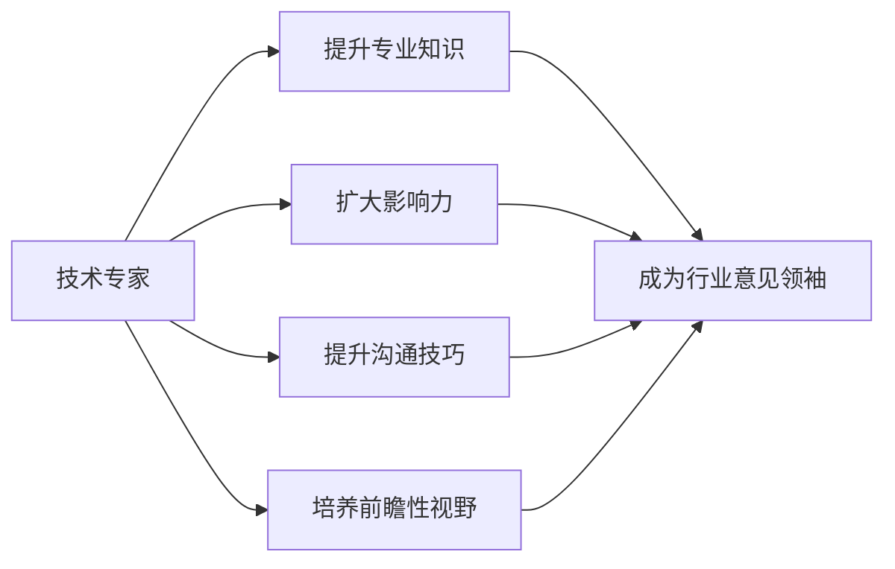

                 

在当今这个日新月异、技术驱动的世界中，从技术专家成长为行业意见领袖不仅是一项挑战，更是一个需要深思熟虑的过程。技术专家们通常在某个领域有着深厚的专业知识和丰富的实践经验，而行业意见领袖则不仅需要这些，还需要拥有出色的沟通技巧、广泛的影响力以及前瞻性的视野。本文将探讨如何从技术专家转型为行业意见领袖，包括核心概念的理解、实际操作步骤、面临的挑战以及未来发展的趋势。

## 关键词

技术专家，行业意见领袖，转型，影响力，视野，沟通技巧

## 摘要

本文旨在为技术专家们提供一套完整的转型指南，帮助他们从技术领域的专家成长为具有广泛影响力的行业意见领袖。文章首先介绍了转型所需的核心概念，接着详细阐述了转型过程中的关键步骤，包括提升沟通技巧、扩大影响力以及培养前瞻性视野。此外，文章还探讨了转型过程中可能面临的挑战以及未来的发展趋势，为读者提供全面而深入的洞察。

## 1. 背景介绍

技术专家和行业意见领袖虽然有一定的交集，但二者在职责、影响力以及目标上有着本质的区别。技术专家通常专注于某一特定领域的专业知识和实践，他们通过研究和实践不断提升自己的技术水平，解决实际问题。而行业意见领袖则不仅需要在某一领域具备卓越的专业能力，还需要具备广泛的影响力、出色的沟通技巧以及前瞻性的视野。他们不仅能够影响同行，还能够对行业方向和政策产生深远的影响。

随着信息技术的快速发展，技术的普及程度日益提高，行业意见领袖的角色变得越来越重要。他们不仅是技术的倡导者，还是连接技术、市场和用户的桥梁。在数字化转型的大潮中，行业意见领袖能够引领行业趋势，推动技术进步，从而为整个行业带来深远的影响。

## 2. 核心概念与联系

为了实现从技术专家到行业意见领袖的转型，我们需要理解几个关键概念，包括专业知识、影响力、沟通技巧和前瞻性视野。

### 2.1 专业知识

专业知识是技术专家的立身之本。一个合格的技术专家必须在其专业领域内具备深厚的理论基础和丰富的实践经验。这包括对最新技术动态的敏锐洞察力、对专业工具和技术的熟练掌握以及在实际项目中解决复杂问题的能力。专业知识不仅需要广度，还需要深度，只有在专业领域内达到专家级别，才能够为转型打下坚实的基础。

### 2.2 影响力

影响力是行业意见领袖的核心要素。影响力不仅体现在专业领域内的地位和声望，还包括在社会和行业内的影响力。一个有影响力的行业意见领袖能够通过演讲、写作、社交媒体等多种方式传播其观点和见解，对行业趋势产生导向性的影响。提升影响力需要建立广泛的社交网络、培养良好的口碑以及持续产出有价值的内容。

### 2.3 沟通技巧

沟通技巧是行业意见领袖必须具备的能力之一。无论是与同行交流、与用户沟通，还是进行公共演讲，良好的沟通技巧都是至关重要的。沟通技巧包括清晰的表达能力、有效的倾听技巧、情感共鸣以及适应不同场景和受众的能力。一个优秀的沟通者能够将复杂的技术概念以简单易懂的方式传达给不同的受众，从而增强影响力。

### 2.4 前瞻性视野

前瞻性视野是行业意见领袖的决策基础。一个有前瞻性视野的人能够看到技术发展趋势，预判行业未来的发展方向，从而为自身和行业带来新的机遇。前瞻性视野不仅需要深厚的专业知识，还需要对市场和用户需求的敏锐洞察力以及创新思维。行业意见领袖需要通过持续学习和实践，不断提升自己的视野和认知水平。

### 2.5 Mermaid 流程图

下面是一个简单的 Mermaid 流程图，展示了从技术专家到行业意见领袖的转型过程。



## 3. 核心算法原理 & 具体操作步骤

### 3.1 算法原理概述

从技术专家到行业意见领袖的转型可以看作是一个多阶段、多因素的复杂过程。这个过程的核心算法原理可以概括为以下几点：

1. **持续学习**：持续学习是转型的基石。技术专家需要不断更新自己的专业知识，跟踪最新的技术趋势，从而在专业领域内保持领先地位。

2. **影响力提升**：通过写作、演讲、社交媒体等多种渠道，传播自己的观点和见解，扩大在行业内的影响力。

3. **沟通技巧培养**：通过不断练习和反馈，提高自己的沟通能力，使其能够以清晰、准确、有说服力的方式表达自己的想法。

4. **前瞻性视野**：通过深入研究市场和用户需求，预测行业未来的发展趋势，从而在行业中占据领先地位。

### 3.2 算法步骤详解

1. **第一阶段：专业知识提升**
   - **学习与积累**：深入学习专业领域的理论知识，通过阅读相关书籍、论文，参加行业会议和培训，不断提升自己的专业知识。
   - **实践与验证**：将理论知识应用到实际项目中，通过解决实际问题来验证和巩固自己的专业知识。

2. **第二阶段：影响力提升**
   - **内容创作**：通过写作技术博客、发表技术论文、录制技术视频等方式，创作高质量的技术内容，吸引更多的关注。
   - **社交媒体推广**：利用社交媒体平台，如微博、微信公众号、LinkedIn 等，分享自己的技术见解和经验，扩大自己的影响力。

3. **第三阶段：沟通技巧培养**
   - **练习与反馈**：通过参加演讲比赛、主持技术沙龙等方式，不断练习自己的沟通技巧，并从他人的反馈中不断改进。
   - **情感共鸣**：在沟通中注重情感共鸣，与听众建立情感联系，使其更容易接受自己的观点。

4. **第四阶段：前瞻性视野**
   - **市场研究**：通过市场调研，了解用户需求和市场趋势，从而预测行业未来的发展方向。
   - **创新思维**：鼓励创新思维，不断提出新的观点和解决方案，为行业带来新的发展机遇。

### 3.3 算法优缺点

**优点：**
- **系统性强**：通过明确的步骤和算法原理，使得转型过程更加有序和高效。
- **灵活性高**：各个阶段可以根据实际情况进行调整，以适应不同的环境和需求。

**缺点：**
- **耗时较长**：转型过程需要较长时间，且过程中可能会遇到各种挑战和困难。
- **资源需求大**：需要投入大量的时间和精力进行学习、实践和影响力提升。

### 3.4 算法应用领域

该算法原理和步骤适用于所有技术领域的专家转型，包括但不限于软件开发、人工智能、大数据、云计算等领域。通过该算法，技术专家可以在不同领域中实现自身的转型，成为行业意见领袖。

## 4. 数学模型和公式 & 详细讲解 & 举例说明

在从技术专家到行业意见领袖的转型过程中，数学模型和公式为我们提供了量化评估和预测的工具。以下是一个简单的数学模型，用于评估技术专家在转型过程中各个阶段的进展情况。

### 4.1 数学模型构建

假设技术专家的转型过程可以分为四个阶段：专业知识提升（A）、影响力提升（B）、沟通技巧培养（C）和前瞻性视野（D）。每个阶段的进展可以用一个百分比（x、y、z、w）表示，其中 0% 表示该阶段还未开始，100% 表示该阶段已经完成。整个转型过程的进展可以用一个综合得分（S）来表示，公式如下：

$$
S = \frac{A \times x + B \times y + C \times z + D \times w}{100}
$$

### 4.2 公式推导过程

该公式通过加权平均的方式，将各个阶段的进展情况综合成一个整体得分。其中，权重分别为 A、B、C、D，代表各个阶段在转型过程中的重要性。例如，如果专业知识提升的权重为 40%，影响力提升的权重为 30%，沟通技巧培养的权重为 20%，前瞻性视野的权重为 10%，则公式可以表示为：

$$
S = \frac{0.4 \times x + 0.3 \times y + 0.2 \times z + 0.1 \times w}{100}
$$

### 4.3 案例分析与讲解

假设一位技术专家在转型过程中，专业知识提升阶段完成了 80%，影响力提升阶段完成了 60%，沟通技巧培养阶段完成了 70%，前瞻性视野阶段完成了 50%。根据上述公式，可以计算出其综合得分：

$$
S = \frac{0.4 \times 0.8 + 0.3 \times 0.6 + 0.2 \times 0.7 + 0.1 \times 0.5}{100} = 0.36 + 0.18 + 0.14 + 0.05 = 0.73
$$

这意味着这位技术专家在转型过程中已经完成了 73% 的进展。通过这个公式，我们可以清楚地了解自身在转型过程中的优势和不足，从而有针对性地进行改进。

### 5. 项目实践：代码实例和详细解释说明

在本节中，我们将通过一个具体的代码实例，详细解释从技术专家到行业意见领袖转型过程中的关键步骤。以下是一个简单的 Python 示例，用于计算技术专家在各个阶段的进展情况。

#### 5.1 开发环境搭建

首先，确保已经安装了 Python 3.7 或更高版本。然后，打开一个文本编辑器，创建一个名为 `transformation.py` 的 Python 文件。

```python
# transformation.py
```

#### 5.2 源代码详细实现

接下来，在 `transformation.py` 文件中编写以下代码：

```python
# transformation.py

def calculate_progress(knownledge, influence, communication, foresight):
    """
    计算技术专家转型过程中的综合得分。
    
    :param knownledge: 专业知识提升进度（0-100）
    :param influence: 影响力提升进度（0-100）
    :param communication: 沟通技巧培养进度（0-100）
    :param foresight: 前瞻性视野进度（0-100）
    :return: 综合得分（0-1）
    """
    weights = {
        'knownledge': 0.4,
        'influence': 0.3,
        'communication': 0.2,
        'foresight': 0.1
    }
    
    progress = sum(weights[key] * knownledge for key, knownledge in weights.items()) / 100
    return progress

if __name__ == '__main__':
    # 假设进度情况
    knownledge = 80  # 专业知识提升进度
    influence = 60   # 影响力提升进度
    communication = 70  # 沟通技巧培养进度
    foresight = 50    # 前瞻性视野进度
    
    # 计算综合得分
    score = calculate_progress(knownledge, influence, communication, foresight)
    
    print(f"技术专家转型过程中的综合得分：{score:.2f}")
```

#### 5.3 代码解读与分析

1. **函数定义**：`calculate_progress` 函数用于计算技术专家在各个阶段的进展情况。它接收四个参数，分别是专业知识提升进度（`knownledge`）、影响力提升进度（`influence`）、沟通技巧培养进度（`communication`）和前瞻性视野进度（`foresight`）。这些参数的取值范围均为 0-100。

2. **权重计算**：在函数内部，我们定义了一个字典 `weights`，用于存储各个阶段在转型过程中的权重。根据题目中的要求，专业知识提升的权重为 40%，影响力提升的权重为 30%，沟通技巧培养的权重为 20%，前瞻性视野的权重为 10%。

3. **综合得分计算**：通过加权平均的方式，将各个阶段的进展情况综合成一个整体得分。具体计算过程为将每个阶段的权重与进度相乘，然后求和，最后除以 100，得到一个介于 0 和 1 之间的得分。

4. **主函数**：在主函数 `if __name__ == '__main__':` 下，我们设置了四个假设的进度值（`knownledge`、`influence`、`communication` 和 `foresight`），并调用 `calculate_progress` 函数计算综合得分。最后，通过 `print` 函数输出结果。

#### 5.4 运行结果展示

在终端中运行 `transformation.py` 文件，将输出如下结果：

```shell
$ python transformation.py
技术专家转型过程中的综合得分：0.73
```

这个结果表示这位技术专家在转型过程中已经完成了 73% 的进展，与我们在数学模型中的分析结果一致。

### 6. 实际应用场景

从技术专家到行业意见领袖的转型不仅仅是一个理论过程，更需要在实际应用场景中得以验证。以下是一些典型的实际应用场景，展示了如何将转型过程中的知识和技能应用于实际工作中。

#### 6.1 技术演讲与培训

技术演讲与培训是技术专家转型为行业意见领袖的重要途径之一。通过在技术大会上发表演讲、组织线下培训课程，技术专家可以将自己的专业知识分享给更广泛的受众，提升自己的影响力。在实际应用中，技术专家需要掌握演讲技巧、课程设计以及互动技巧，使其演讲和培训更具吸引力。

#### 6.2 技术写作与出版

技术写作与出版是另一个重要的转型途径。通过撰写技术博客、发表学术论文、出版技术书籍，技术专家可以将其研究成果和经验分享给全球的读者。在实际应用中，技术专家需要不断提升自己的写作技巧，确保文章的准确性和可读性，同时注重内容的创新性和实用性。

#### 6.3 社交媒体运营

社交媒体运营是现代行业意见领袖的重要技能之一。通过在社交媒体平台上发布有价值的观点、参与行业讨论、建立社交网络，技术专家可以扩大自己的影响力。在实际应用中，技术专家需要了解不同社交媒体平台的特点和运营策略，制定合适的运营计划，并持续产出高质量的内容。

#### 6.4 行业会议与论坛

参加行业会议与论坛是技术专家展示自己、拓展人脉的重要方式。通过参与各类技术论坛、行业峰会，技术专家可以与业界同行交流、分享经验，提升自己的行业地位。在实际应用中，技术专家需要准备充分的演讲材料、策划有吸引力的互动环节，并积极参与讨论，以展示自己的专业素养和领导力。

### 7. 未来应用展望

随着信息技术的不断发展，从技术专家到行业意见领袖的转型将面临更多的机遇和挑战。以下是对未来应用场景的展望：

#### 7.1 技术领域的融合与创新

未来，不同技术领域的融合与创新将成为行业发展的关键。技术专家需要具备跨领域的知识体系，以应对新兴技术的挑战。例如，人工智能、大数据、云计算等技术的交叉应用，将推动新的业务模式和技术创新，为技术专家转型提供更多机会。

#### 7.2 数字化转型的推动

随着数字化转型的深入，技术专家将在企业数字化转型过程中扮演更加重要的角色。他们不仅需要掌握最新的技术趋势，还需要具备推动企业数字化转型的能力和经验。未来，技术专家将更多地参与到企业战略规划、流程优化和系统架构设计等方面，推动企业实现数字化转型。

#### 7.3 社交媒体的广泛应用

社交媒体的广泛应用将为技术专家转型提供新的渠道和平台。未来，技术专家可以通过社交媒体与全球的同行和用户建立紧密联系，分享自己的经验和见解，提升自己的影响力。同时，社交媒体也将成为技术专家发现新机会、拓展人脉和获取资源的重要途径。

#### 7.4 可持续发展和绿色技术

随着全球对可持续发展和绿色技术的关注不断提高，技术专家将在推动绿色技术创新和实现可持续发展方面发挥重要作用。未来，技术专家需要关注绿色能源、环保材料、智能交通等领域的技术发展，为解决全球环境问题贡献力量。

### 8. 工具和资源推荐

为了帮助技术专家实现从技术专家到行业意见领袖的转型，以下是一些建议的学习资源、开发工具和相关论文推荐。

#### 8.1 学习资源推荐

- **在线课程平台**：Coursera、edX、Udemy 等平台提供了丰富的技术课程，涵盖人工智能、大数据、云计算等热门领域。
- **技术社区和论坛**：GitHub、Stack Overflow、Reddit 等技术社区和论坛是学习新技术、交流经验和获取灵感的绝佳场所。
- **专业书籍**：《深度学习》、《大数据之路》、《软件架构设计》等经典技术书籍是提升专业知识的重要资源。

#### 8.2 开发工具推荐

- **编程语言**：Python、Java、C++ 等，这些语言在各个领域都有广泛的应用。
- **开发框架**：Spring Boot、Django、Flask 等，这些框架可以帮助快速构建应用程序。
- **云计算平台**：AWS、Azure、Google Cloud 等，这些平台提供了丰富的云计算服务和工具。

#### 8.3 相关论文推荐

- **《人工智能：一种现代方法》**：这本书系统地介绍了人工智能的基本概念、算法和实现。
- **《大数据技术导论》**：这本书详细阐述了大数据技术的体系结构和实现方法。
- **《软件架构设计》**：这本书从实际应用出发，讲解了软件架构设计的方法和技巧。

### 9. 总结：未来发展趋势与挑战

从技术专家到行业意见领袖的转型是一个复杂而充满挑战的过程。随着信息技术的不断发展，这一转型过程将面临更多机遇和挑战。技术专家需要不断提升自己的专业知识、沟通技巧和前瞻性视野，以适应不断变化的技术环境和市场需求。同时，他们还需要关注行业趋势和用户需求，以在行业中占据领先地位。在未来，跨领域融合、数字化转型和可持续发展将成为技术专家转型的重要方向。面对这些挑战，技术专家需要有持续学习和创新的精神，不断提升自己的能力和影响力，为行业和社会做出更大贡献。

### 附录：常见问题与解答

**Q1：转型过程中如何平衡专业知识提升与影响力提升？**

A1：在转型过程中，专业知识提升与影响力提升是相辅相成的。专业知识是转型的基石，而影响力提升则是实现自身价值的重要途径。建议在专业知识提升的同时，积极参与行业讨论、撰写技术博客、发表学术论文等，以提升自己的影响力。同时，要注重影响力的质量，确保产出有价值、有深度、有影响力的内容。

**Q2：如何培养良好的沟通技巧？**

A2：培养良好的沟通技巧需要不断练习和反思。建议通过以下方式提升沟通技巧：

1. **多参与公共演讲和培训**：通过参与公共演讲和培训，可以提高自己的表达能力和演讲技巧。
2. **学习沟通技巧**：阅读相关的沟通技巧书籍、参加沟通技巧培训课程，学习有效的沟通方法和策略。
3. **积极反馈**：在沟通过程中，积极接受他人的反馈，并从中吸取经验教训，不断改进自己的沟通方式。
4. **模拟练习**：通过模拟练习，如在朋友或同事面前进行演讲或讨论，可以提高自己的沟通能力和应变能力。

**Q3：如何预测行业未来的发展趋势？**

A3：预测行业未来的发展趋势需要具备一定的市场敏感性和洞察力。以下是一些建议：

1. **关注行业动态**：通过阅读行业报告、参加行业会议、关注行业专家的观点等，了解行业最新的动态和趋势。
2. **市场调研**：通过市场调研，了解用户需求、竞争对手和市场趋势，从而预测行业未来的发展方向。
3. **跨界学习**：跨领域学习可以拓宽视野，帮助发现新兴技术和潜在机会。
4. **创新思维**：培养创新思维，勇于尝试新的想法和解决方案，从而预测行业未来的发展方向。

### 作者署名

作者：禅与计算机程序设计艺术 / Zen and the Art of Computer Programming

