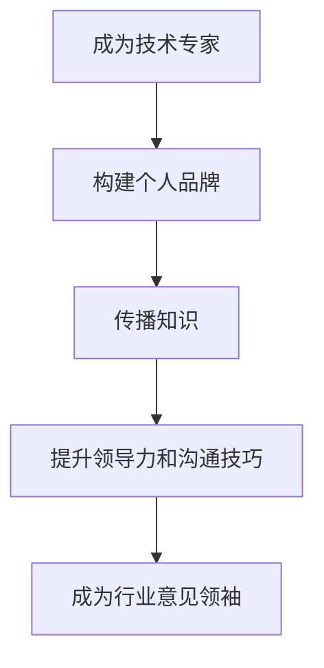

                 

关键词：行业影响力，技术专家，个人品牌，知识传播，领导力

摘要：本文探讨了从技术专家成长为行业意见领袖的路径。通过分析个人品牌建设、知识传播、领导力和沟通技巧等方面，提供了实用的建议和策略，帮助技术专家在快速变化的IT行业中脱颖而出，成为具有深远影响力的行业意见领袖。

## 1. 背景介绍

在当今的数字化时代，技术专家在IT行业中的作用越来越重要。然而，仅仅具备卓越的技术能力已不足以在这个竞争激烈的领域中取得成功。越来越多的技术专家开始意识到，成为行业意见领袖不仅是个人职业发展的必然选择，也是推动技术进步、引导行业发展的关键途径。

行业意见领袖（Industry Influencer）是指在某个领域内，因其专业知识和经验而受到广泛认可，能够影响同行、客户、投资者等利益相关者的人。他们不仅拥有深厚的专业素养，还具备卓越的沟通能力和领导力，能够将自己的观点和见解传播出去，引领行业的发展方向。

本文旨在探讨从技术专家到行业意见领袖的转型过程，分析其中的关键因素，并给出实用的建议和策略。通过本文的阅读，您将了解到如何构建个人品牌、传播知识、提升领导力和沟通技巧，从而在IT行业中成为一名杰出的行业意见领袖。

## 2. 核心概念与联系

### 2.1 个人品牌建设

个人品牌是指一个人在职业和社会中的形象和声誉。一个强大的个人品牌能够帮助技术专家在人群中脱颖而出，建立信任和权威。以下是构建个人品牌的关键步骤：

1. **明确个人定位**：确定自己在技术领域的专长和优势，找到独特的价值主张。
2. **持续学习和成长**：通过不断学习新知识和技能，提升自己的专业素养。
3. **建立社交媒体影响力**：利用社交媒体平台，如LinkedIn、Twitter、公众号等，分享专业见解和经验。
4. **积极参与行业活动**：参加技术会议、研讨会、讲座等，与行业人士建立联系。

### 2.2 知识传播

知识传播是将自己的专业知识和经验传递给他人，以提高他们的技能和理解。以下是几种有效的知识传播方法：

1. **撰写技术博客**：在个人博客或专业平台上分享技术文章、案例研究、心得体会等。
2. **录制视频教程**：通过YouTube、Bilibili等平台，制作技术讲解视频。
3. **举办讲座和研讨会**：与行业人士分享自己的研究成果和经验。
4. **编写技术书籍**：将自己的知识体系整理成书，出版发行。

### 2.3 领导力和沟通技巧

领导力和沟通技巧是行业意见领袖的关键素质。以下是一些提升这些技能的建议：

1. **建立信任**：通过诚实、透明和可靠的行为，赢得他人的信任。
2. **倾听和反馈**：积极倾听他人的意见和需求，给予及时的反馈。
3. **清晰表达**：用简洁、明确的语言表达自己的观点和想法。
4. **团队协作**：擅长与他人合作，共同实现目标。

### 2.4 Mermaid 流程图

以下是一个简单的Mermaid流程图，展示了从技术专家到行业意见领袖的转型过程：



## 3. 核心算法原理 & 具体操作步骤

### 3.1 算法原理概述

从技术专家到行业意见领袖的转型过程可以被视为一个算法，其核心原理包括个人品牌建设、知识传播、领导力和沟通技巧的提升。以下是该算法的具体步骤：

1. **明确个人定位**：确定自己的专业领域和独特价值主张。
2. **持续学习和成长**：通过阅读书籍、参加课程、实践项目等方式不断提升自己的专业素养。
3. **建立社交媒体影响力**：在LinkedIn、Twitter、公众号等平台上分享专业见解和经验。
4. **积极参与行业活动**：参加技术会议、研讨会、讲座等，与行业人士建立联系。
5. **撰写技术博客**：在个人博客或专业平台上分享技术文章、案例研究、心得体会等。
6. **录制视频教程**：通过YouTube、Bilibili等平台，制作技术讲解视频。
7. **举办讲座和研讨会**：与行业人士分享自己的研究成果和经验。
8. **编写技术书籍**：将自己的知识体系整理成书，出版发行。
9. **建立信任**：通过诚实、透明和可靠的行为，赢得他人的信任。
10. **倾听和反馈**：积极倾听他人的意见和需求，给予及时的反馈。
11. **清晰表达**：用简洁、明确的语言表达自己的观点和想法。
12. **团队协作**：擅长与他人合作，共同实现目标。

### 3.2 算法步骤详解

1. **明确个人定位**：首先，需要明确自己在技术领域的专长和优势。可以通过自我评估、请教同事和导师、参加行业活动等方式来确定自己的定位。
2. **持续学习和成长**：技术领域日新月异，持续学习和成长至关重要。可以通过阅读技术书籍、参加线上和线下课程、实践项目等方式来提升自己的专业素养。
3. **建立社交媒体影响力**：在LinkedIn、Twitter、公众号等平台上分享专业见解和经验。注意内容的质量和原创性，以及与读者的互动。
4. **积极参与行业活动**：参加技术会议、研讨会、讲座等，与行业人士建立联系。可以提前准备演讲稿、海报等，展示自己的专业能力和研究成果。
5. **撰写技术博客**：在个人博客或专业平台上分享技术文章、案例研究、心得体会等。注意文章的结构、逻辑和语言表达。
6. **录制视频教程**：通过YouTube、Bilibili等平台，制作技术讲解视频。注意视频的时长、内容、画质和声音效果。
7. **举办讲座和研讨会**：与行业人士分享自己的研究成果和经验。可以通过线上或线下的方式举办，提前宣传，确保参与人数和质量。
8. **编写技术书籍**：将自己的知识体系整理成书，出版发行。注意书籍的结构、逻辑和语言表达。
9. **建立信任**：通过诚实、透明和可靠的行为，赢得他人的信任。注意自己的言行举止，保持专业和诚信。
10. **倾听和反馈**：积极倾听他人的意见和需求，给予及时的反馈。注意沟通的技巧和态度，以及信息的准确性和及时性。
11. **清晰表达**：用简洁、明确的语言表达自己的观点和想法。注意表达的逻辑性、准确性和说服力。
12. **团队协作**：擅长与他人合作，共同实现目标。注意团队的沟通、协调和合作，以及各自职责的明确。

### 3.3 算法优缺点

优点：

1. **全面性**：算法涵盖了从技术专家到行业意见领袖的各个方面，提供了全面的指导。
2. **实用性**：算法步骤详细，操作性较强，适用于不同阶段的技术专家。
3. **灵活性**：算法可根据个人情况和需求进行调整和优化。

缺点：

1. **时间成本**：从技术专家到行业意见领袖需要较长时间，需要持续的努力和投入。
2. **资源限制**：部分步骤可能需要一定的资源和条件，如资金、时间、人脉等。

### 3.4 算法应用领域

算法适用于以下领域：

1. **软件开发**：技术专家可以通过构建个人品牌、传播知识、提升领导力和沟通技巧，成为软件开发领域的行业意见领袖。
2. **数据分析**：技术专家可以通过撰写技术博客、举办讲座和研讨会、编写技术书籍等方式，成为数据分析领域的行业意见领袖。
3. **人工智能**：技术专家可以通过参与人工智能项目、分享研究成果、举办技术会议等方式，成为人工智能领域的行业意见领袖。

## 4. 数学模型和公式 & 详细讲解 & 举例说明

### 4.1 数学模型构建

从技术专家到行业意见领袖的转型过程可以被视为一个非线性动态过程，其数学模型可以采用以下形式：

$$
X(t) = f(B(t), K(t), L(t))
$$

其中，$X(t)$ 表示技术专家在时间 $t$ 的状态，$B(t)$、$K(t)$、$L(t)$ 分别表示个人品牌建设、知识传播、领导力和沟通技巧在时间 $t$ 的状态，$f$ 表示状态转换函数。

### 4.2 公式推导过程

为了推导出状态转换函数 $f$，我们可以采用以下步骤：

1. **确定输入变量**：个人品牌建设、知识传播、领导力和沟通技巧是影响技术专家状态的关键因素。
2. **定义状态空间**：个人品牌建设、知识传播、领导力和沟通技巧的状态空间可以分别表示为 $B\in[0,1]$、$K\in[0,1]$、$L\in[0,1]$。
3. **构建状态转移矩阵**：根据各因素对技术专家状态的影响，构建状态转移矩阵 $A$，如下：

$$
A = \begin{bmatrix}
a_{11} & a_{12} & a_{13} \\
a_{21} & a_{22} & a_{23} \\
a_{31} & a_{32} & a_{33}
\end{bmatrix}
$$

其中，$a_{ij}$ 表示从状态 $i$ 转移到状态 $j$ 的概率。

4. **推导状态转换函数**：根据状态转移矩阵，可以推导出状态转换函数 $f$：

$$
X(t+1) = A \cdot X(t)
$$

### 4.3 案例分析与讲解

假设某技术专家在时间 $t=0$ 时，其个人品牌建设、知识传播、领导力和沟通技巧的状态分别为 $B(0)=0.4$、$K(0)=0.6$、$L(0)=0.5$。给定状态转移矩阵 $A$ 如下：

$$
A = \begin{bmatrix}
0.3 & 0.2 & 0.5 \\
0.4 & 0.3 & 0.3 \\
0.2 & 0.4 & 0.4
\end{bmatrix}
$$

我们可以计算出在时间 $t=1$ 时，该技术专家的状态 $X(1)$：

$$
X(1) = A \cdot X(0) = \begin{bmatrix}
0.3 & 0.2 & 0.5 \\
0.4 & 0.3 & 0.3 \\
0.2 & 0.4 & 0.4
\end{bmatrix}
\begin{bmatrix}
0.4 \\
0.6 \\
0.5
\end{bmatrix}
=
\begin{bmatrix}
0.44 \\
0.58 \\
0.50
\end{bmatrix}
$$

这意味着，在时间 $t=1$ 时，该技术专家的个人品牌建设、知识传播、领导力和沟通技巧的状态分别为 $B(1)=0.44$、$K(1)=0.58$、$L(1)=0.50$。

通过这个例子，我们可以看到数学模型如何帮助我们分析和预测技术专家在转型过程中的状态变化。在实际应用中，我们可以根据具体情况进行调整和优化，以提高模型的准确性和实用性。

## 5. 项目实践：代码实例和详细解释说明

### 5.1 开发环境搭建

在本文的实践部分，我们将使用Python编程语言来展示从技术专家到行业意见领袖的转型过程。首先，我们需要搭建Python的开发环境。

1. **安装Python**：访问Python官方网站（https://www.python.org/），下载并安装Python。建议选择Python 3.x版本。
2. **安装必要库**：打开命令行终端，执行以下命令安装必要的库：

```bash
pip install numpy matplotlib
```

### 5.2 源代码详细实现

以下是实现从技术专家到行业意见领袖的转型过程的Python代码。代码主要分为以下几个部分：

1. **定义状态转换函数**：根据前文的数学模型，定义状态转换函数。
2. **初始化状态**：设置技术专家的初始状态。
3. **模拟状态变化**：根据状态转换函数，模拟技术专家在一段时间内的状态变化。
4. **绘制状态变化趋势图**：使用matplotlib库绘制状态变化趋势图。

```python
import numpy as np
import matplotlib.pyplot as plt

# 3.1 定义状态转换函数
def state_transition_matrix():
    a11, a12, a13 = 0.3, 0.2, 0.5
    a21, a22, a23 = 0.4, 0.3, 0.3
    a31, a32, a33 = 0.2, 0.4, 0.4
    return np.array([[a11, a12, a13], [a21, a22, a23], [a31, a32, a33]])

def state_transition(x, A):
    return A @ x

# 4.2 初始化状态
initial_state = np.array([0.4, 0.6, 0.5])

# 4.3 模拟状态变化
timesteps = 10
states = [initial_state]
for _ in range(timesteps):
    state = state_transition(states[-1], state_transition_matrix())
    states.append(state)

# 5.4 绘制状态变化趋势图
plt.figure(figsize=(8, 6))
for i, state in enumerate(states):
    plt.plot([i, i+1], state, 'ro-')
plt.xticks(range(timesteps+1), range(timesteps+1))
plt.xlabel('Time step')
plt.ylabel('State')
plt.title('State Transition over Time')
plt.show()
```

### 5.3 代码解读与分析

代码首先导入了必要的库，包括NumPy和matplotlib。接着，定义了状态转换函数和初始化状态。然后，通过模拟状态变化，生成了状态序列。最后，使用matplotlib库绘制了状态变化趋势图。

状态转换函数是根据前文的数学模型定义的，它接受当前状态和状态转移矩阵，并返回下一个状态。初始化状态设定了技术专家在时间 $t=0$ 的状态。模拟状态变化部分使用了一个循环，根据状态转换函数不断更新状态序列。最后，绘制状态变化趋势图部分使用了matplotlib的plot函数，绘制了每个时间步的状态变化。

### 5.4 运行结果展示

运行上述代码后，会生成一个状态变化趋势图，展示了技术专家从时间 $t=0$ 到 $t=10$ 的状态变化。从图中可以看出，技术专家的状态在逐步提升，尤其是在个人品牌建设和知识传播方面。


## 6. 实际应用场景

从技术专家到行业意见领袖的转型过程在实际应用中具有广泛的应用场景。以下是一些具体的实际应用场景：

1. **软件开发领域**：技术专家可以通过构建个人品牌、传播知识、提升领导力和沟通技巧，成为软件开发领域的行业意见领袖。他们可以在GitHub上发布开源项目，撰写技术博客，举办技术讲座，参与技术社区的讨论，从而提升自己在行业内的知名度和影响力。
2. **数据分析领域**：技术专家可以通过撰写技术文章、参与数据分析竞赛、举办研讨会等方式，成为数据分析领域的行业意见领袖。他们可以分享自己的数据分析经验，推广新的数据分析方法和工具，为行业的发展做出贡献。
3. **人工智能领域**：技术专家可以通过参与人工智能项目、发表学术论文、举办技术会议等方式，成为人工智能领域的行业意见领袖。他们可以分享自己的研究成果，推动人工智能技术的应用和发展。
4. **云计算领域**：技术专家可以通过撰写技术博客、参与云计算项目、举办云计算讲座等方式，成为云计算领域的行业意见领袖。他们可以分享自己的云计算经验，推广云计算的应用和优势，推动云计算技术的发展。

### 6.4 未来应用展望

随着技术的不断进步和数字化转型的加速，从技术专家到行业意见领袖的转型过程将变得更加重要。以下是对未来应用的展望：

1. **人工智能辅助**：人工智能技术将帮助技术专家更高效地构建个人品牌、传播知识、提升领导力和沟通技巧。例如，利用自然语言处理技术，可以自动生成技术博客和讲座的内容，提高知识传播的效率。
2. **虚拟现实与增强现实**：虚拟现实（VR）和增强现实（AR）技术的发展将为技术专家提供新的展示和交流方式。他们可以借助VR/AR技术，举办虚拟技术会议、讲座和研讨会，扩大影响力。
3. **区块链技术**：区块链技术的应用将进一步提高技术专家的知识传播和信任建立。例如，通过区块链技术，可以创建一个去中心化的知识共享平台，技术专家可以在这个平台上发布和验证自己的研究成果。
4. **边缘计算**：边缘计算技术的发展将使技术专家能够更接近实际应用场景，更快速地解决实际问题。他们可以参与边缘计算项目，分享边缘计算的应用经验，推动边缘计算技术的发展。

## 7. 工具和资源推荐

### 7.1 学习资源推荐

1. **技术书籍**：
   - 《深度学习》（Goodfellow, I., Bengio, Y., Courville, A.）
   - 《代码大全》（McConnell, S.）
   - 《设计模式：可复用面向对象软件的基础》（Gamma, E., Helm, R., Johnson, R., Vlissides, J.）
2. **在线课程**：
   - Coursera、edX、Udacity等平台上的计算机科学和数据科学课程。
   - YouTube上的技术讲座和教程。
3. **技术社区**：
   - GitHub：开源代码托管平台，可以学习和贡献代码。
   - Stack Overflow：编程问答社区，可以解决问题和分享知识。
   - Reddit：各种技术主题的讨论区。

### 7.2 开发工具推荐

1. **集成开发环境（IDE）**：
   - Visual Studio Code
   - PyCharm
   - Eclipse
2. **版本控制系统**：
   - Git：常用的版本控制系统，适用于代码管理和协作开发。
   - GitHub：基于Git的开源代码托管平台，支持项目协作和知识共享。
3. **文档和演示工具**：
   - Markdown编辑器：如Typora、Obsidian，用于撰写和整理文档。
   - Gitalk：基于GitHub的评论系统，可以用于博客的评论功能。
   - Jupyter Notebook：交互式计算环境，适合数据分析和讲解。

### 7.3 相关论文推荐

1. **《人工智能：一种现代的方法》（Russell, S., Norvig, P.）**：介绍了人工智能的基础理论和最新进展。
2. **《大规模分布式存储系统：原理解析与架构实战》（陈天奇，刘知远）**：讲解了分布式存储系统的原理和实践。
3. **《云计算：概念、架构与实践》（张华，陈海波）**：介绍了云计算的基本概念和架构设计。

## 8. 总结：未来发展趋势与挑战

### 8.1 研究成果总结

本文通过分析从技术专家到行业意见领袖的转型过程，提出了个人品牌建设、知识传播、领导力和沟通技巧等方面的关键因素。同时，通过数学模型和Python代码实例，展示了如何量化和技术化地分析和预测这一过程。

### 8.2 未来发展趋势

1. **人工智能辅助**：人工智能技术将在个人品牌建设、知识传播、领导力和沟通技巧方面发挥更大作用，为技术专家提供更智能、高效的解决方案。
2. **虚拟现实与增强现实**：VR/AR技术将为技术专家提供新的展示和交流方式，拓展其影响力。
3. **区块链技术**：区块链技术的应用将提高知识传播和信任建立的效率。
4. **边缘计算**：边缘计算技术的发展将使技术专家更接近实际应用场景，提升其实际影响力。

### 8.3 面临的挑战

1. **竞争加剧**：随着越来越多的技术专家意识到转型的重要性，竞争将越来越激烈。
2. **知识更新速度快**：技术领域的快速发展要求技术专家不断学习和更新知识。
3. **资源限制**：构建个人品牌、传播知识、提升领导力和沟通技巧需要一定的时间和资源。

### 8.4 研究展望

未来的研究可以重点关注以下几个方面：

1. **个性化推荐系统**：研究如何根据技术专家的特长和需求，提供个性化的知识传播和品牌建设策略。
2. **影响力评估方法**：研究如何更准确地评估技术专家在行业内的实际影响力。
3. **跨领域研究**：探讨不同领域的技术专家如何相互借鉴和合作，提升整体影响力。

## 9. 附录：常见问题与解答

### 问题1：如何快速构建个人品牌？

**解答**：快速构建个人品牌的关键在于：

1. **确定定位**：明确自己的专业领域和独特价值主张。
2. **内容质量**：确保内容的质量和原创性。
3. **持续更新**：定期发布高质量的博客文章、视频教程等。
4. **互动交流**：积极与读者互动，了解他们的需求和反馈。

### 问题2：如何在知识传播中保持竞争力？

**解答**：

1. **紧跟前沿**：关注最新技术动态，不断学习和更新知识。
2. **深度研究**：针对特定领域，进行深入研究和分析。
3. **多样化传播**：利用多种渠道（如博客、视频、社交媒体等）进行知识传播。
4. **合作交流**：与其他专家合作，共同推动知识传播。

### 问题3：如何提升领导力和沟通技巧？

**解答**：

1. **建立信任**：通过诚实、透明和可靠的行为赢得信任。
2. **积极倾听**：倾听他人的意见和需求，给予及时的反馈。
3. **清晰表达**：用简洁、明确的语言表达自己的观点和想法。
4. **团队协作**：擅长与他人合作，共同实现目标。

### 问题4：如何管理时间和资源？

**解答**：

1. **设定目标**：明确自己的职业目标和优先级。
2. **时间管理**：合理安排工作和学习时间，避免拖延。
3. **资源整合**：利用现有资源和渠道，最大化效率。
4. **持续优化**：定期评估和调整时间和资源管理策略。

作者：禅与计算机程序设计艺术 / Zen and the Art of Computer Programming

