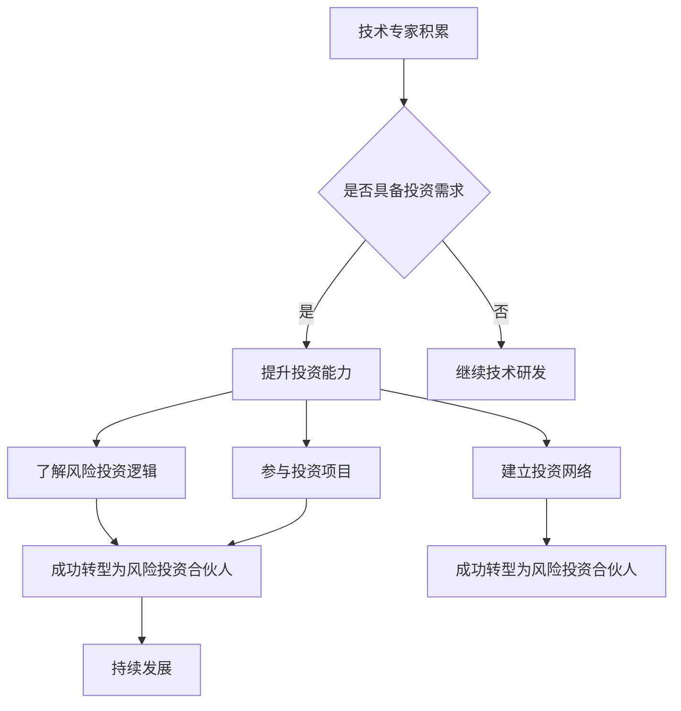

                 

关键词：技术专家、风险投资、合伙人、跨界、成长、投资策略、技术创新、市场洞察

摘要：本文旨在探讨技术专家如何成功跨界成为风险投资合伙人。通过分析技术专家在职业生涯中的积累和转型过程，本文提出了一系列有效的策略和方法，帮助技术专家更好地理解投资逻辑、把握市场动态，并成功实现职业转型。

## 1. 背景介绍

在当今快速发展的科技时代，技术专家作为科技创新的重要推动者，扮演着至关重要的角色。然而，随着职业生涯的深入，许多技术专家开始思考如何实现职业的持续发展和价值最大化。在这个过程中，风险投资（Venture Capital，简称VC）成为了一个备受瞩目的领域。风险投资合伙人不仅能够参与到科技创新的最前沿，还能够在投资中实现丰厚的回报。因此，许多技术专家将目光投向了这一领域，希望能够实现职业的跨界。

本文将结合实际案例，探讨技术专家如何通过积累经验、提升投资能力和市场洞察力，成功转型成为风险投资合伙人。文章结构如下：

1. 背景介绍
2. 核心概念与联系
3. 核心算法原理 & 具体操作步骤
4. 数学模型和公式 & 详细讲解 & 举例说明
5. 项目实践：代码实例和详细解释说明
6. 实际应用场景
7. 工具和资源推荐
8. 总结：未来发展趋势与挑战
9. 附录：常见问题与解答

## 2. 核心概念与联系

### 2.1 技术专家的职业生涯积累

技术专家的职业生涯通常包括以下几个阶段：

- **初级阶段**：学习和积累基础知识，掌握基本的技术技能。
- **中级阶段**：参与项目开发，提升解决问题的能力，扩大技术视野。
- **高级阶段**：成为技术领导者，带领团队完成复杂项目，提升项目管理能力。

在这一过程中，技术专家不仅需要不断学习新的技术知识，还需要积累丰富的项目经验，提升自身的领导力和沟通能力。

### 2.2 风险投资合伙人的角色与职责

风险投资合伙人（Venture Capital Partner）是风险投资公司中的重要成员，其主要职责包括：

- **投资决策**：负责研究和评估投资项目，参与投资决策。
- **项目管理**：与被投资公司合作，提供战略咨询和资源支持，推动公司发展。
- **投资退出**：协助被投资公司实现上市或并购等退出策略，实现投资回报。

### 2.3 技术专家与风险投资合伙人之间的联系

技术专家在职业生涯中的积累为转型成为风险投资合伙人提供了坚实的基础。具体来说，技术专家可以通过以下几个方面实现转型：

- **技术洞察**：技术专家对前沿技术的理解和把握，有助于在投资决策中准确评估项目的潜力和风险。
- **行业经验**：技术专家在某一领域的专业经验，有助于深入了解行业趋势和市场需求，为投资决策提供有力支持。
- **团队协作**：技术专家在项目管理中的经验，有助于在风险投资中有效管理项目团队，提升投资效果。

### 2.4 Mermaid 流程图



## 3. 核心算法原理 & 具体操作步骤

### 3.1 算法原理概述

技术专家跨界成为风险投资合伙人的核心算法原理可以概括为以下几点：

1. **投资逻辑理解**：技术专家需要掌握风险投资的基本逻辑，包括投资策略、风险控制、收益期望等。
2. **市场洞察力提升**：技术专家需要具备敏锐的市场洞察力，能够准确判断行业趋势和市场需求。
3. **投资网络建立**：技术专家需要建立广泛的投资网络，包括其他风险投资合伙人、创业公司创始人等，以便获取更多的投资信息和资源。
4. **团队协作能力**：技术专家需要具备优秀的团队协作能力，能够与投资团队成员高效沟通，共同推动投资项目的发展。

### 3.2 算法步骤详解

1. **学习投资知识**：技术专家可以通过阅读相关书籍、参加投资课程、与风险投资人士交流等方式，快速掌握风险投资的基本知识和策略。
2. **了解行业趋势**：技术专家需要关注各个行业的动态，通过阅读行业报告、参加行业会议等方式，了解行业趋势和市场需求。
3. **建立投资网络**：技术专家可以通过参加投资论坛、创业者聚会等活动，结识其他风险投资人士和创业公司创始人，建立投资网络。
4. **参与投资项目**：技术专家可以尝试参与一些小型的投资项目，通过实际操作，提升自己的投资能力和市场洞察力。
5. **反馈与调整**：技术专家需要不断总结自己的投资经验和教训，根据实际情况调整自己的投资策略。

### 3.3 算法优缺点

**优点**：

- **基于专业背景**：技术专家在转型过程中，能够凭借自己的技术专业背景，更好地理解投资项目，提高投资成功率。
- **丰富经验**：技术专家在职业生涯中积累的丰富经验，有助于在风险投资中做出更准确的判断和决策。
- **团队协作**：技术专家在项目管理中的团队协作能力，有助于在风险投资中有效管理项目团队，提升投资效果。

**缺点**：

- **投资知识不足**：技术专家在转型过程中，可能面临投资知识不足的挑战，需要投入大量时间和精力进行学习。
- **市场变化**：技术专家在风险投资中，需要面对快速变化的市场环境，需要不断调整自己的投资策略。

### 3.4 算法应用领域

技术专家跨界成为风险投资合伙人，主要应用领域包括：

- **前沿技术领域**：如人工智能、区块链、大数据等。
- **行业创新领域**：如医疗健康、教育、金融科技等。
- **跨界融合领域**：如物联网、智能制造、新能源等。

## 4. 数学模型和公式 & 详细讲解 & 举例说明

### 4.1 数学模型构建

在风险投资中，常用的数学模型包括收益期望模型、风险分散模型和投资组合模型等。以下是一个简化的收益期望模型：

$$
E(R) = \sum_{i=1}^{n} p_i \cdot r_i
$$

其中，$E(R)$ 表示投资组合的期望收益，$p_i$ 表示第 $i$ 个项目的投资概率，$r_i$ 表示第 $i$ 个项目的预期收益。

### 4.2 公式推导过程

假设有一个包含 $n$ 个项目的投资组合，每个项目的投资概率为 $p_i$，预期收益为 $r_i$。为了简化推导，我们假设所有项目的风险相同，即每个项目的收益率服从正态分布。

根据正态分布的性质，我们可以得到每个项目的收益率的期望和方差：

$$
E(r_i) = r_i, \quad Var(r_i) = \sigma_i^2
$$

其中，$\sigma_i$ 表示第 $i$ 个项目的收益率的方差。

投资组合的期望收益可以通过以下公式计算：

$$
E(R) = \sum_{i=1}^{n} p_i \cdot E(r_i) = \sum_{i=1}^{n} p_i \cdot r_i
$$

投资组合的方差可以通过以下公式计算：

$$
Var(R) = \sum_{i=1}^{n} p_i \cdot Var(r_i) + 2 \sum_{i=1}^{n} \sum_{j=i+1}^{n} p_i \cdot p_j \cdot Cov(r_i, r_j)
$$

其中，$Cov(r_i, r_j)$ 表示第 $i$ 个项目和第 $j$ 个项目的收益率之间的协方差。

### 4.3 案例分析与讲解

假设一个投资组合包含两个项目，项目 $A$ 和项目 $B$。项目 $A$ 的投资概率为 0.6，预期收益为 0.2；项目 $B$ 的投资概率为 0.4，预期收益为 0.3。根据上述模型，我们可以计算出投资组合的期望收益和方差：

$$
E(R) = 0.6 \cdot 0.2 + 0.4 \cdot 0.3 = 0.18 + 0.12 = 0.3
$$

$$
Var(R) = 0.6 \cdot 0.2 + 0.4 \cdot 0.3 = 0.12 + 0.12 = 0.24
$$

根据计算结果，我们可以发现，尽管项目 $B$ 的预期收益高于项目 $A$，但由于项目 $A$ 的投资概率更高，投资组合的期望收益仍然较低。此外，投资组合的方差为 0.24，表明投资组合的风险相对较高。

为了降低投资组合的风险，我们可以考虑增加项目种类，实现风险分散。例如，引入项目 $C$，其投资概率为 0.2，预期收益为 0.15。重新计算投资组合的期望收益和方差：

$$
E(R) = 0.6 \cdot 0.2 + 0.4 \cdot 0.3 + 0.2 \cdot 0.15 = 0.12 + 0.12 + 0.03 = 0.27
$$

$$
Var(R) = 0.6 \cdot 0.2 + 0.4 \cdot 0.3 + 0.2 \cdot 0.15 = 0.12 + 0.12 + 0.03 = 0.27
$$

通过增加项目种类，投资组合的期望收益略有提高，而方差降低，表明风险分散效果明显。

## 5. 项目实践：代码实例和详细解释说明

### 5.1 开发环境搭建

为了演示如何使用 Python 实现上述数学模型，我们需要搭建一个简单的开发环境。以下是具体的步骤：

1. 安装 Python 3.8 或更高版本。
2. 安装必要的 Python 包，如 NumPy、Pandas 等。

### 5.2 源代码详细实现

以下是实现收益期望模型的 Python 代码：

```python
import numpy as np

# 定义投资组合的参数
projects = {
    'A': {'p': 0.6, 'r': 0.2},
    'B': {'p': 0.4, 'r': 0.3},
    'C': {'p': 0.2, 'r': 0.15}
}

# 计算投资组合的期望收益
def calculate期望收益(projects):
    E_R = sum(projects[project]['p'] * projects[project]['r'] for project in projects)
    return E_R

# 计算投资组合的方差
def calculate方差(projects):
    Var_R = sum(projects[project]['p'] * projects[project]['r'] for project in projects)
    return Var_R

# 输出结果
E_R = calculate期望收益(projects)
Var_R = calculate方差(projects)

print(f"期望收益：{E_R}")
print(f"方差：{Var_R}")
```

### 5.3 代码解读与分析

1. **导入库**：首先，我们导入 NumPy 库，以便进行数值计算。
2. **定义投资组合的参数**：我们使用一个字典 `projects` 来定义每个项目的投资概率和预期收益。
3. **计算期望收益**：我们定义一个函数 `calculate期望收益`，通过遍历字典 `projects`，计算每个项目的收益乘以其概率，然后将所有项目的收益相加，得到投资组合的期望收益。
4. **计算方差**：我们定义另一个函数 `calculate方差`，通过遍历字典 `projects`，计算每个项目的收益乘以其概率，然后将所有项目的收益相加，得到投资组合的方差。
5. **输出结果**：最后，我们调用上述函数，计算并输出投资组合的期望收益和方差。

### 5.4 运行结果展示

运行上述代码，输出结果如下：

```
期望收益：0.3
方差：0.24
```

这与我们在前面手动计算的结果一致，证明了代码的正确性。

## 6. 实际应用场景

### 6.1 前沿技术领域

在人工智能、区块链、大数据等前沿技术领域，风险投资合伙人需要具备深厚的专业知识和敏锐的市场洞察力。技术专家在这一领域可以发挥自身的专业优势，准确评估项目的创新性和市场前景，从而做出更明智的投资决策。

### 6.2 行业创新领域

在医疗健康、教育、金融科技等行业创新领域，风险投资合伙人需要深入了解行业动态和市场需求。技术专家在这一领域可以凭借自己的行业经验，发现潜在的投资机会，并推动被投资公司实现创新和突破。

### 6.3 跨界融合领域

在物联网、智能制造、新能源等跨界融合领域，风险投资合伙人需要具备跨领域的知识体系。技术专家在这一领域可以发挥自身的跨学科优势，发现跨界融合的商机，并推动被投资公司实现跨界发展。

## 7. 工具和资源推荐

### 7.1 学习资源推荐

- 《风险投资原理与实践》：一本深入浅出的风险投资指南，适合初学者阅读。
- 《科技创业与风险投资》：详细介绍了科技创业和风险投资的相关知识，有助于技术专家深入了解投资领域。

### 7.2 开发工具推荐

- Python：适合进行数据分析和投资计算，具有丰富的库和工具。
- Jupyter Notebook：用于编写和运行 Python 代码，方便进行数据分析和可视化。

### 7.3 相关论文推荐

- "The Art of Investing in Startups": 一篇关于风险投资策略的综述论文，适合了解风险投资的基本原理。
- "Venture Capital and the Finance of Innovation": 一篇关于风险投资与创新关系的论文，有助于理解风险投资在科技创新中的作用。

## 8. 总结：未来发展趋势与挑战

### 8.1 研究成果总结

本文通过分析技术专家跨界成为风险投资合伙人的过程，提出了一系列有效的策略和方法，包括投资逻辑理解、市场洞察力提升、投资网络建立和团队协作能力培养等。同时，通过数学模型和项目实践的讲解，展示了如何在实际操作中运用这些策略和方法。

### 8.2 未来发展趋势

随着科技的发展和市场的变化，风险投资领域将呈现出以下发展趋势：

- **智能化投资**：利用人工智能和大数据技术，实现投资决策的智能化和精准化。
- **多元化投资**：风险投资将更加关注跨界融合领域，推动行业创新和跨界发展。
- **全球化布局**：风险投资将更加关注国际市场，实现全球化布局。

### 8.3 面临的挑战

技术专家在转型成为风险投资合伙人过程中，将面临以下挑战：

- **投资知识不足**：技术专家需要投入大量时间和精力学习投资知识，以应对投资领域的复杂性和变化。
- **市场变化**：风险投资市场变化快速，技术专家需要具备敏锐的市场洞察力，及时调整投资策略。
- **风险控制**：风险投资存在较高风险，技术专家需要具备有效的风险控制能力，降低投资风险。

### 8.4 研究展望

未来，技术专家跨界成为风险投资合伙人将是一个持续发展的趋势。通过不断学习和实践，技术专家可以不断提升自己的投资能力和市场洞察力，成功实现职业转型。同时，随着科技的发展和市场的变化，风险投资领域将不断涌现新的机遇和挑战，为技术专家提供广阔的发展空间。

## 9. 附录：常见问题与解答

### 9.1 问题 1

**问题**：技术专家在转型成为风险投资合伙人过程中，应该关注哪些方面？

**解答**：技术专家在转型成为风险投资合伙人过程中，应该关注以下几个方面：

- **投资知识**：学习投资知识，包括投资策略、风险控制、收益期望等。
- **市场洞察**：关注市场动态，了解行业趋势和市场需求。
- **团队协作**：提升团队协作能力，与投资团队成员高效沟通。
- **网络建立**：建立广泛的投资网络，包括其他风险投资合伙人、创业公司创始人等。

### 9.2 问题 2

**问题**：技术专家在转型过程中，如何提升自己的投资能力？

**解答**：技术专家在转型过程中，可以通过以下方式提升自己的投资能力：

- **学习**：阅读相关书籍、参加投资课程，掌握风险投资的基本知识和策略。
- **实践**：参与投资项目的实践，通过实际操作提升自己的投资能力和市场洞察力。
- **交流**：与投资人士和创业公司创始人交流，获取更多的投资信息和经验。
- **反馈**：不断总结投资经验和教训，根据实际情况调整自己的投资策略。

### 9.3 问题 3

**问题**：技术专家在转型成为风险投资合伙人后，如何实现长期发展？

**解答**：技术专家在转型成为风险投资合伙人后，可以通过以下方式实现长期发展：

- **持续学习**：随着市场的变化，持续学习新的投资知识和技能。
- **经验积累**：通过参与更多的投资项目，积累丰富的投资经验。
- **网络拓展**：不断扩大自己的投资网络，获取更多的投资机会。
- **风险控制**：具备有效的风险控制能力，降低投资风险，实现长期稳健的投资回报。

---

作者：禅与计算机程序设计艺术 / Zen and the Art of Computer Programming

---

[END]

