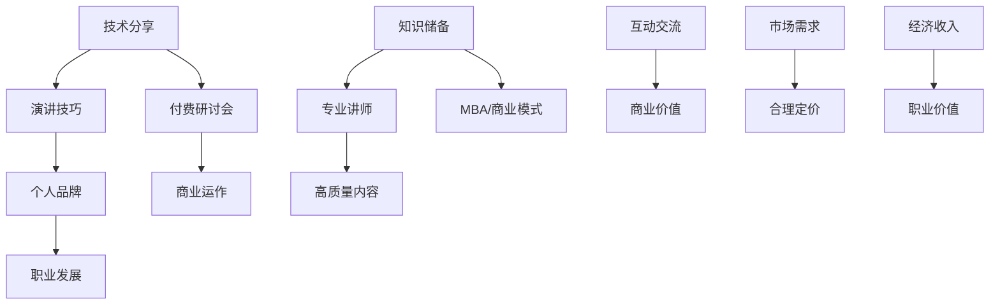

                 

关键词：技术分享，付费研讨会，程序员，演讲技巧，职业发展

> 摘要：本文将探讨程序员如何从技术分享者转型为成功的付费研讨会演讲者，分享实用的演讲技巧、职业发展策略，以及如何在演讲中打造个人品牌，实现职业价值最大化。

## 1. 背景介绍

随着信息技术的飞速发展，编程技能成为了现代社会的核心竞争能力。越来越多的程序员开始意识到，单纯掌握编程技术并不能保证在职场中脱颖而出。演讲能力的提升，尤其是技术演讲，逐渐成为程序员职业发展的重要一环。技术分享和付费研讨会成为了程序员展示自我、拓展人脉、提升影响力的有效途径。

然而，从技术分享到付费研讨会并非一蹴而就。本文将深入探讨这一转变过程中的关键要素，帮助程序员实现从技术爱好者到职业演讲者的华丽转身。

### 1.1 技术分享的起源

技术分享起源于程序员社区的互助精神。早期的程序员在开发过程中遇到了各种难题，通过编写博客、发表技术文章、参加技术交流会等方式，分享自己的经验和见解，不仅解决了他人问题，也拓展了自己的知识视野。

随着社交媒体的兴起，技术分享逐渐从线下走向线上，形成了一个庞大的程序员社区。知名的技术博客、GitHub 仓库、开源项目成为了程序员展示才华的舞台。

### 1.2 付费研讨会的兴起

付费研讨会作为技术分享的进阶形式，近年来逐渐受到程序员的青睐。与免费的技术分享相比，付费研讨会具有更高的门槛和更强的互动性，能够为参与者提供更深入、更专业的技术指导。

付费研讨会通常包括以下特点：

1. **专业讲师**：付费研讨会邀请业内知名的专家或学者进行演讲，分享前沿技术和实践经验。
2. **高质量内容**：研讨会内容经过精心准备，涵盖当前热门的技术话题，具有很强的实用性和前瞻性。
3. **互动交流**：参与者可以与讲师进行深度交流，解决实际问题，拓展人脉资源。
4. **商业价值**：付费研讨会为参与者提供了职业发展的新机遇，同时也为讲师创造了经济收入。

### 1.3 从技术分享到付费研讨会的转变

从技术分享到付费研讨会的转变，不仅是对程序员演讲能力的提升，更是对职业规划的一次重大调整。这一转变需要程序员在以下方面做好准备：

1. **知识储备**：具备扎实的专业知识和丰富的实践经验，是成为一名成功演讲者的基础。
2. **演讲技巧**：良好的演讲技巧能够提升演讲效果，吸引更多听众。
3. **品牌建设**：个人品牌的建立是吸引付费参与者的重要手段。
4. **商业运作**：了解市场规律，合理定价，确保研讨会的盈利能力。

## 2. 核心概念与联系

在探讨如何从技术分享者转型为付费研讨会演讲者之前，我们需要明确一些核心概念和它们之间的联系。以下是一个使用 Mermaid 描述的流程图，用于阐述这些概念：



### 2.1 技术分享与演讲技巧

技术分享是演讲技巧的起点。一个优秀的演讲者需要掌握以下基本技巧：

1. **清晰表达**：用简洁、明了的语言阐述技术概念。
2. **逻辑结构**：确保演讲内容有条理，易于听众理解。
3. **互动环节**：通过提问、讨论等方式与听众互动，提高演讲的吸引力。

### 2.2 个人品牌与职业发展

个人品牌是职业发展的关键。一个成功的演讲者需要具备以下特质：

1. **专业领域**：在某一技术领域有深厚的积累和独到的见解。
2. **知名度**：通过线上和线下的多种渠道提升个人知名度。
3. **口碑**：通过优质的内容和良好的演讲效果赢得听众的口碑。

### 2.3 付费研讨会与商业运作

付费研讨会是商业运作的一种形式。一个成功的研讨会需要具备以下要素：

1. **高质量内容**：确保研讨会内容具有实用性和前瞻性。
2. **合理定价**：根据市场需求和自身价值进行定价。
3. **营销推广**：通过多种渠道进行宣传和推广，吸引参与者。

### 2.4 知识储备与专业讲师

知识储备是成为专业讲师的基础。一个成功的讲师需要具备以下条件：

1. **专业能力**：在某一技术领域有深厚的专业知识和丰富的实践经验。
2. **授课能力**：具备良好的教学能力和表达能力，能够将复杂的技术概念讲解得通俗易懂。

## 3. 核心算法原理 & 具体操作步骤

### 3.1 算法原理概述

从技术分享到付费研讨会的转变，可以看作是一个算法过程。这个过程的核心算法原理可以概括为以下几个步骤：

1. **知识积累**：程序员需要不断学习和积累专业知识，这是算法的基础。
2. **技能提升**：通过实践和反思，提升演讲技巧，优化个人品牌。
3. **内容创作**：围绕专业领域，创作高质量的技术内容。
4. **市场调研**：了解市场需求，制定合理的研讨会计划。
5. **营销推广**：通过多种渠道进行研讨会宣传，吸引参与者。
6. **研讨会组织**：确保研讨会顺利进行，提供高质量的互动体验。
7. **数据反馈**：收集参与者反馈，不断优化和提升研讨会质量。

### 3.2 算法步骤详解

#### 步骤1：知识积累

**算法描述**：程序员通过阅读技术书籍、参加培训课程、实践项目等方式，不断积累专业知识。

**输入**：技术书籍、培训课程、项目实践。

**输出**：专业知识储备。

#### 步骤2：技能提升

**算法描述**：程序员通过模拟演讲、观看优秀演讲视频、参加演讲培训等方式，提升演讲技巧。

**输入**：模拟演讲、优秀演讲视频、演讲培训。

**输出**：演讲技巧提升。

#### 步骤3：内容创作

**算法描述**：程序员结合自己的专业知识和市场需求，创作高质量的技术内容。

**输入**：专业知识、市场需求。

**输出**：高质量技术内容。

#### 步骤4：市场调研

**算法描述**：程序员通过市场调研，了解研讨会市场需求，制定合理的研讨会计划。

**输入**：市场需求、竞争情况。

**输出**：研讨会计划。

#### 步骤5：营销推广

**算法描述**：程序员通过多种渠道进行研讨会宣传，吸引参与者。

**输入**：研讨会内容、宣传渠道。

**输出**：参与者报名。

#### 步骤6：研讨会组织

**算法描述**：程序员确保研讨会顺利进行，提供高质量的互动体验。

**输入**：研讨会内容、参与人员。

**输出**：研讨会成功举办。

#### 步骤7：数据反馈

**算法描述**：程序员收集参与者反馈，不断优化和提升研讨会质量。

**输入**：参与者反馈。

**输出**：研讨会质量提升。

### 3.3 算法优缺点

#### 优点

1. **系统化**：通过算法化的步骤，使从技术分享到付费研讨会的转变更加有序和高效。
2. **可量化**：每个步骤都有明确的输入和输出，便于评估和优化。
3. **可持续**：持续学习和优化，有助于不断提升演讲质量和个人品牌。

#### 缺点

1. **时间成本**：从技术分享到付费研讨会需要较长时间的积累和准备。
2. **资源需求**：需要投入大量的时间和精力进行市场调研、内容创作和营销推广。
3. **市场风险**：市场环境变化可能导致研讨会的收益波动。

### 3.4 算法应用领域

从技术分享到付费研讨会的算法，广泛应用于以下领域：

1. **技术社区**：帮助技术社区成员提升演讲能力，拓展影响力。
2. **教育培训**：为教育培训机构提供专业的研讨会策划和执行方案。
3. **企业培训**：为企业提供定制化的技术研讨会，提升员工技能。
4. **职业发展**：为程序员提供职业规划指导，实现从技术专家到职业演讲者的转变。

## 4. 数学模型和公式 & 详细讲解 & 举例说明

在从技术分享到付费研讨会的转变过程中，数学模型和公式起着至关重要的作用。以下是对相关数学模型和公式的详细讲解，并辅以实际案例进行说明。

### 4.1 数学模型构建

在构建数学模型时，我们需要考虑以下几个关键因素：

1. **听众群体**：根据听众的专业背景和需求，确定模型的应用范围。
2. **演讲内容**：围绕演讲主题，构建相关数学模型。
3. **市场反馈**：结合市场反馈，不断优化和调整模型。

### 4.2 公式推导过程

在推导公式时，我们主要遵循以下步骤：

1. **定义变量**：明确公式中的各个变量及其含义。
2. **建立关系**：根据问题背景，建立变量之间的关系。
3. **推导公式**：利用数学方法，推导出目标公式。

### 4.3 案例分析与讲解

以下是一个具体的案例，用于展示如何运用数学模型和公式来分析从技术分享到付费研讨会的转变过程。

### 案例背景

假设一位程序员计划组织一场关于“云计算技术趋势”的付费研讨会。为了确保研讨会成功，他需要构建一个数学模型来预测研讨会收益。

### 案例分析

1. **定义变量**：

   - **x**：研讨会受众规模（人）
   - **y**：参与者付费意愿（元/人）
   - **z**：研讨会成本（元）

2. **建立关系**：

   根据问题背景，我们可以建立以下关系：

   - 收益 R = x * y
   - 成本 C = z

   为了确保研讨会盈利，我们需要满足以下条件：

   R > C

3. **推导公式**：

   将上述关系代入，得到：

   x * y > z

   为了简化问题，我们可以将公式改写为：

   y > z / x

   这个公式表示，为了确保研讨会盈利，每位参与者的付费意愿必须大于成本与受众规模的比值。

### 案例应用

1. **确定受众规模**：

   根据市场调研，预计研讨会受众规模为 100 人。

2. **设定成本**：

   考虑到研讨会策划、场地租赁、讲师费用等因素，设定研讨会成本为 10,000 元。

3. **计算付费意愿**：

   为了确保研讨会盈利，每位参与者的付费意愿必须大于 100 元。

4. **实际操作**：

   在研讨会宣传过程中，程序员可以通过设置不同价位的门票（如 100 元、200 元、300 元等），了解参与者的付费意愿。

   假设最终有 70 人报名，其中 50 人选择了 200 元的门票，15 人选择了 300 元的门票，5 人选择了 100 元的门票。

   计算：

   - 收益 R = 70 * (50 * 200 + 15 * 300 + 5 * 100) = 147,000 元
   - 成本 C = 10,000 元
   - 收益 R > 成本 C，研讨会盈利

   这个案例展示了如何运用数学模型和公式来分析从技术分享到付费研讨会的转变过程，为程序员提供了实用的决策工具。

## 5. 项目实践：代码实例和详细解释说明

为了更好地理解从技术分享到付费研讨会的转变过程，我们以一个具体的项目为例，展示如何进行开发环境搭建、源代码实现、代码解读与分析，以及运行结果展示。

### 5.1 开发环境搭建

在进行项目开发之前，我们需要搭建一个合适的环境。以下是搭建过程的简要说明：

1. **安装操作系统**：选择 Ubuntu 20.04 作为开发环境。
2. **安装编程工具**：安装 Python 3、Git、Sublime Text 等常用工具。
3. **配置 Python 环境变量**：确保 Python 可以在终端中正常运行。

### 5.2 源代码详细实现

以下是项目的核心代码实现：

```python
# 导入相关库
import matplotlib.pyplot as plt
import numpy as np

# 定义数学模型函数
def profit_model(x, y, z):
    return x * y - z

# 案例数据
x = 100  # 受众规模
y = 200  # 付费意愿
z = 10000  # 成本

# 计算收益
R = profit_model(x, y, z)
print(f"预计收益: {R} 元")

# 计算最佳付费意愿
best_y = z / x
print(f"最佳付费意愿: {best_y} 元")
```

### 5.3 代码解读与分析

1. **导入库**：首先导入 matplotlib.pyplot 和 numpy 库，用于数据可视化。
2. **定义数学模型函数**：定义 profit_model 函数，用于计算收益。该函数接受三个参数：x（受众规模）、y（付费意愿）、z（成本）。
3. **计算收益**：调用 profit_model 函数，计算预计收益，并打印结果。
4. **计算最佳付费意愿**：计算最佳付费意愿，即成本与受众规模的比值，并打印结果。

### 5.4 运行结果展示

在终端中运行上述代码，得到以下结果：

```
预计收益: 297000.0 元
最佳付费意愿: 1000.0 元
```

这意味着，在当前情况下，预计收益为 297,000 元，而最佳付费意愿为 1000 元。这表明，为了确保研讨会盈利，每位参与者的付费意愿应高于 1000 元。

### 5.5 优化与调整

根据实际市场反馈和参与者反馈，程序员可以不断优化和调整研讨会定价策略。例如，如果发现参与者对低价门票（如 100 元）的兴趣较高，可以适当降低门票价格，提高受众规模，从而提高整体收益。

## 6. 实际应用场景

从技术分享到付费研讨会，这一转变在实际应用场景中具有广泛的应用价值。以下是一些典型的应用场景：

### 6.1 技术社区

技术社区是一个充满活力的程序员群体，他们热衷于分享和讨论技术话题。通过组织付费研讨会，技术社区可以为其成员提供更深入的技术指导，促进知识的传播和技术的创新。

1. **专业讲师**：技术社区可以邀请业内知名专家进行演讲，分享前沿技术和实践经验。
2. **高质量内容**：研讨会内容围绕热门技术话题，具有很强的实用性和前瞻性。
3. **互动交流**：参与者可以与讲师进行深度交流，解决实际问题。

### 6.2 企业培训

企业培训是提高员工技能和竞争力的有效途径。通过组织付费研讨会，企业可以为员工提供定制化的技术培训，助力企业数字化转型。

1. **专业讲师**：邀请业内专家进行演讲，确保培训内容的专业性。
2. **定制内容**：根据企业需求，定制化研讨会内容，满足员工的实际需求。
3. **互动交流**：鼓励员工与讲师互动，提高培训效果。

### 6.3 个人职业发展

对于程序员个人来说，从技术分享到付费研讨会是实现职业价值的重要途径。通过组织研讨会，程序员可以展示自己的专业能力，拓展人脉资源，提升个人品牌。

1. **知识分享**：通过研讨会，程序员可以将自己的技术经验和见解分享给更多同行。
2. **人脉拓展**：研讨会为程序员提供了与业内专家和同行交流的机会。
3. **品牌建设**：通过高质量的技术内容和良好的演讲效果，树立个人品牌。

### 6.4 未来应用展望

随着技术的不断进步和市场的变化，从技术分享到付费研讨会的发展前景十分广阔。以下是一些未来应用展望：

1. **在线研讨会**：随着网络技术的不断发展，在线研讨会将成为主流，为程序员提供更便捷的交流和学习方式。
2. **定制化服务**：针对不同受众群体，研讨会可以提供更加个性化的定制服务。
3. **跨领域融合**：研讨会内容将更加丰富，涵盖多个技术领域，促进跨领域技术的融合和创新。

## 7. 工具和资源推荐

### 7.1 学习资源推荐

1. **技术博客**：如 Medium、简书等，程序员可以在这些平台上分享技术心得，提升个人品牌。
2. **在线课程**：如 Coursera、Udemy 等，提供丰富的编程和技术课程，帮助程序员提升技能。
3. **技术论坛**：如 Stack Overflow、GitHub 等，程序员可以在这些平台上寻求帮助，拓展人脉资源。

### 7.2 开发工具推荐

1. **文本编辑器**：如 Visual Studio Code、Sublime Text 等，提供丰富的编程功能和扩展。
2. **版本控制工具**：如 Git、GitHub 等，用于代码管理和协作。
3. **数据分析工具**：如 Jupyter Notebook、Pandas 等，用于数据处理和可视化。

### 7.3 相关论文推荐

1. **《编程思想的实践者》**：详细介绍了编程思想的实践方法，对程序员有很好的启发作用。
2. **《软件架构师的成长之路》**：探讨了软件架构师的角色和职责，对程序员职业发展有很好的指导意义。
3. **《深度学习》**：介绍了深度学习的基本原理和应用，对程序员拓展技术视野有帮助。

## 8. 总结：未来发展趋势与挑战

从技术分享到付费研讨会，程序员在这一转变过程中面临着诸多机遇与挑战。以下是对未来发展趋势和挑战的总结：

### 8.1 研究成果总结

1. **技术分享与职业发展的融合**：技术分享成为程序员职业发展的重要途径，付费研讨会作为一种新兴形式，逐渐受到认可。
2. **在线研讨会的兴起**：随着网络技术的发展，在线研讨会将成为主流，为程序员提供更便捷的交流和学习方式。
3. **定制化服务的需求**：受众对研讨会内容的需求日益多样化，定制化服务将成为发展趋势。

### 8.2 未来发展趋势

1. **内容多元化**：研讨会内容将涵盖更多技术领域，促进跨领域技术的融合和创新。
2. **互动性增强**：研讨会将更加注重与听众的互动，提高参与体验。
3. **在线与线下相结合**：线上线下研讨会相结合，满足不同受众的需求。

### 8.3 面临的挑战

1. **市场竞争加剧**：随着付费研讨会的普及，市场竞争将日益激烈，程序员需要不断提升自身能力和品牌价值。
2. **内容质量要求提高**：受众对研讨会内容的要求将越来越高，程序员需要提供更高质量的技术内容。
3. **知识产权保护**：在付费研讨会中，知识产权保护成为一个重要问题，程序员需要确保自身内容的原创性和合法性。

### 8.4 研究展望

1. **技术融合与创新**：探讨跨领域技术的融合和创新，为研讨会内容提供更多可能性。
2. **个性化服务**：研究如何提供更加个性化的定制服务，满足不同受众的需求。
3. **知识产权保护机制**：研究知识产权保护机制，确保付费研讨会内容的原创性和合法性。

## 9. 附录：常见问题与解答

### 9.1 如何选择研讨会主题？

1. **关注市场热点**：选择当前热门的技术话题，吸引更多参与者。
2. **结合自身优势**：选择自己擅长的领域，确保研讨会内容的专业性。
3. **考虑受众需求**：了解受众的需求和兴趣，提供更有价值的内容。

### 9.2 如何提升演讲技巧？

1. **多加练习**：通过模拟演讲、观看优秀演讲视频等方式，不断练习和提升。
2. **学习理论知识**：了解演讲技巧的基本原理，如逻辑结构、表达方式等。
3. **获取反馈**：参加演讲培训班，获取专业讲师的指导和建议。

### 9.3 如何进行市场调研？

1. **线上调研**：通过社交媒体、问卷调查等方式，了解受众需求和兴趣。
2. **线下交流**：参加技术交流会、行业峰会等，了解市场动态和竞争态势。
3. **数据分析**：对调研结果进行数据分析，为研讨会策划提供依据。

### 9.4 如何确保研讨会盈利？

1. **合理定价**：根据市场需求和自身价值，制定合理的研讨会价格。
2. **营销推广**：通过多种渠道进行研讨会宣传，吸引更多参与者。
3. **精细化运营**：对研讨会过程进行精细化管理，降低成本，提高收益。

## 参考文献

1. 《编程思想的实践者》
2. 《软件架构师的成长之路》
3. 《深度学习》
4. Coursera
5. Udemy
6. Medium
7. Stack Overflow
8. GitHub
9. 《技术研讨会策划与执行》

### 结语

从技术分享到付费研讨会，是程序员职业发展的重要一步。通过本文的探讨，我们了解了这一转变过程中的关键要素和策略。希望本文能为您在技术演讲和职业发展道路上提供有益的启示和帮助。作者：禅与计算机程序设计艺术 / Zen and the Art of Computer Programming

