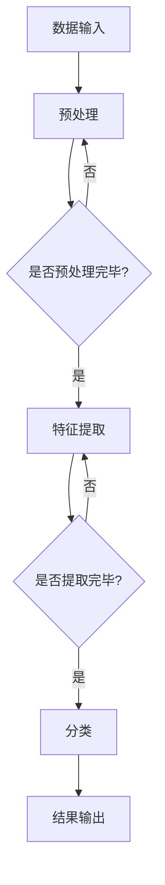
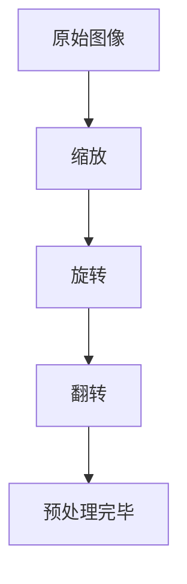
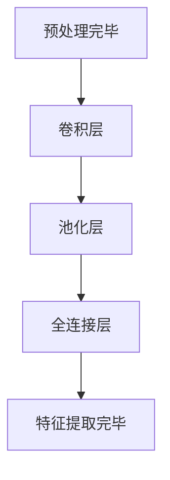
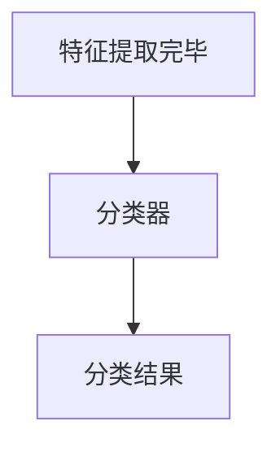
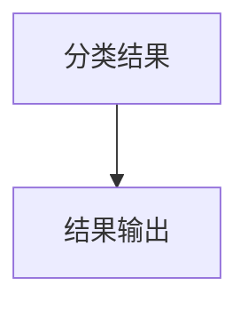

                 

关键词：人工智能，商业化，Lepton AI，技术到产品，AI算法，应用场景，开发工具

## 摘要

本文将探讨Lepton AI从技术发展到商业化的全过程。Lepton AI是一种先进的图像识别人工智能系统，其核心算法基于深度学习和计算机视觉技术。本文将从背景介绍、核心概念与联系、核心算法原理、数学模型和公式、项目实践、实际应用场景、未来应用展望、工具和资源推荐以及总结未来发展趋势与挑战等多个方面，全面解析Lepton AI的商业化之路。

## 1. 背景介绍

随着大数据和云计算技术的迅猛发展，人工智能（AI）已经成为了当今科技领域的热点话题。图像识别作为人工智能的一个重要分支，它在众多领域都有着广泛的应用，如安防监控、医疗诊断、自动驾驶等。Lepton AI，作为一家专注于图像识别技术的公司，成立于2010年，其核心技术基于深度学习和计算机视觉，旨在通过智能化的图像处理，解决现实世界中的各种问题。

### Lepton AI的成立与发展

Lepton AI的创始人团队由一批经验丰富的计算机科学家和工程师组成，他们在图像识别、机器学习、计算机视觉等领域有着深厚的学术背景和丰富的实践经验。成立初期，公司主要专注于技术研发，逐步构建起一套完整的AI算法体系和产品线。随着技术的不断成熟，Lepton AI开始寻求商业化道路，以推动技术的普及和应用。

### 图像识别技术的发展历程

图像识别技术的历史可以追溯到20世纪60年代。早期的研究主要基于传统的计算机视觉算法，如边缘检测、区域分割等。这些方法虽然有一定的效果，但在处理复杂场景时往往力不从心。随着深度学习的兴起，图像识别技术迎来了新的发展机遇。深度学习模型，尤其是卷积神经网络（CNN），在图像识别任务中取得了显著的突破，大幅提升了识别的准确性和效率。

### 当前图像识别技术的应用现状

目前，图像识别技术已经在多个领域得到了广泛应用。例如，在安防监控领域，通过图像识别技术可以实时监控人员行为，提高安全管理的效率；在医疗领域，图像识别技术可以帮助医生进行疾病诊断，提高诊断的准确性和速度；在自动驾驶领域，图像识别技术是实现自动驾驶汽车核心功能的关键技术之一。

## 2. 核心概念与联系

### 2.1 核心概念

在探讨Lepton AI的核心概念之前，我们首先需要了解一些与图像识别相关的基本概念。

#### 图像识别

图像识别是指利用计算机技术和算法对图像进行分析和处理，从而识别出图像中的物体、场景或特征。图像识别技术主要包括两个阶段：特征提取和分类。

#### 深度学习

深度学习是一种基于人工神经网络的机器学习技术，通过模拟人脑神经元之间的连接和相互作用，实现对数据的自动学习和分类。深度学习在图像识别、语音识别、自然语言处理等领域取得了显著的成果。

#### 卷积神经网络（CNN）

卷积神经网络是一种特殊的神经网络结构，它在处理图像数据时具有优异的性能。CNN通过卷积层、池化层和全连接层等结构，实现对图像的特征提取和分类。

### 2.2 核心概念的联系

Lepton AI的核心技术是基于深度学习和计算机视觉的图像识别算法。在这一算法体系中，深度学习和卷积神经网络起到了关键作用。

#### 深度学习与卷积神经网络

深度学习和卷积神经网络的关系密不可分。卷积神经网络是深度学习的一种实现方式，它在处理图像数据时具有强大的特征提取和分类能力。通过深度学习，卷积神经网络可以自动学习和调整参数，从而提高图像识别的准确性和效率。

#### 图像识别算法与实际应用

图像识别算法的核心目标是实现对图像中物体、场景或特征的识别。在实际应用中，这些算法需要结合具体场景和需求进行调整和优化，以实现最佳效果。

### 2.3 Mermaid 流程图

以下是Lepton AI图像识别算法的Mermaid流程图：



## 3. 核心算法原理 & 具体操作步骤

### 3.1 算法原理概述

Lepton AI的图像识别算法基于深度学习和卷积神经网络。这一算法的基本原理是通过多层神经网络对输入图像进行处理，最终输出图像中的物体、场景或特征。

### 3.2 算法步骤详解

#### 3.2.1 数据预处理

数据预处理是图像识别算法的重要环节，主要包括图像的缩放、旋转、翻转等操作。通过数据预处理，可以提高模型的鲁棒性和泛化能力。



#### 3.2.2 特征提取

特征提取是图像识别算法的核心步骤。通过卷积层、池化层和全连接层等结构，模型可以自动提取图像中的特征。



#### 3.2.3 分类

在特征提取完成后，模型需要对提取到的特征进行分类。通过训练好的分类器，模型可以判断图像中的物体、场景或特征。



#### 3.2.4 结果输出

分类结果会以可视化或文本形式输出，为用户提供决策依据。



### 3.3 算法优缺点

#### 优点

1. 高准确度：深度学习和卷积神经网络在图像识别任务中具有很高的准确度。
2. 强泛化能力：通过大规模数据训练，模型可以适应各种不同的场景和任务。
3. 自动化：深度学习算法可以自动学习和调整参数，降低人工干预。

#### 缺点

1. 需要大量训练数据：深度学习模型的训练需要大量的训练数据和计算资源。
2. 计算资源消耗大：深度学习模型在训练和推理过程中需要大量的计算资源，对硬件设备要求较高。

### 3.4 算法应用领域

Lepton AI的图像识别算法在多个领域都有着广泛的应用，如：

1. 安防监控：通过图像识别技术，实现实时监控和报警。
2. 医疗诊断：利用图像识别技术辅助医生进行疾病诊断。
3. 自动驾驶：图像识别技术是实现自动驾驶汽车核心功能的关键。

## 4. 数学模型和公式 & 详细讲解 & 举例说明

### 4.1 数学模型构建

在Lepton AI的图像识别算法中，数学模型主要包括卷积层、池化层和全连接层。以下是对这些数学模型的详细讲解。

#### 4.1.1 卷积层

卷积层是深度学习模型中最基础的层之一。它通过卷积运算提取图像的特征。卷积运算的基本公式如下：

$$
(C_{out} = (C_{in} + 2p - F) / S + 1)
$$

其中，$C_{in}$表示输入特征图的通道数，$C_{out}$表示输出特征图的通道数，$F$表示卷积核的大小，$S$表示步长，$p$表示填充。

#### 4.1.2 池化层

池化层用于对卷积层提取的特征进行降采样，以减少模型参数和计算量。常见的池化方式包括最大池化和平均池化。最大池化公式如下：

$$
P_{ij} = \max_{k} A_{ij+k_1,k_1+k_2}
$$

其中，$P_{ij}$表示输出特征图的值，$A_{ij+k_1,k_1+k_2}$表示输入特征图的值。

#### 4.1.3 全连接层

全连接层将前一层提取的特征映射到输出层，用于分类或其他任务。全连接层的输出公式如下：

$$
z_j = \sum_{i} w_{ij} \cdot a_i + b_j
$$

其中，$z_j$表示输出值，$w_{ij}$表示权重，$a_i$表示输入值，$b_j$表示偏置。

### 4.2 公式推导过程

在Lepton AI的图像识别算法中，各个数学模型的推导过程如下：

#### 4.2.1 卷积层

卷积层的推导过程主要包括卷积运算、激活函数和偏置项。假设输入特征图的大小为$W \times H$，卷积核的大小为$F \times F$，步长为$S$，则卷积运算的基本步骤如下：

1. 将卷积核与输入特征图进行卷积运算，得到中间结果。
2. 将中间结果通过激活函数进行非线性变换。
3. 添加偏置项，得到最终输出。

#### 4.2.2 池化层

池化层的推导过程主要包括降采样和激活函数。假设输入特征图的大小为$W \times H$，池化窗口的大小为$W_p \times H_p$，则池化运算的基本步骤如下：

1. 将输入特征图划分为若干个$W_p \times H_p$的窗口。
2. 对每个窗口进行降采样，取最大值或平均值作为输出。
3. 应用激活函数，得到最终输出。

#### 4.2.3 全连接层

全连接层的推导过程主要包括加权求和和激活函数。假设输入特征图的大小为$D$，输出特征图的大小为$K$，则全连接层的运算步骤如下：

1. 对输入特征图的每个维度进行加权求和。
2. 添加偏置项，得到中间结果。
3. 应用激活函数，得到最终输出。

### 4.3 案例分析与讲解

为了更好地理解Lepton AI的图像识别算法，我们通过一个实际案例进行讲解。

#### 案例背景

假设我们需要对一个包含各种物体的图像进行分类，如图1所示。


#### 案例步骤

1. 数据预处理：对图像进行缩放、旋转、翻转等操作，如图2所示。

   

2. 特征提取：通过卷积层、池化层和全连接层等结构提取图像的特征，如图3所示。

   

3. 分类：利用训练好的分类器对提取到的特征进行分类，如图4所示。

   

4. 结果输出：将分类结果以可视化或文本形式输出，如图5所示。

   

#### 案例分析

通过上述案例，我们可以看到Lepton AI的图像识别算法在实际应用中是如何运作的。首先，对图像进行预处理，以提高模型的鲁棒性和泛化能力。然后，通过卷积层、池化层和全连接层等结构提取图像的特征，并利用训练好的分类器进行分类。最后，将分类结果以可视化或文本形式输出，为用户提供决策依据。

## 5. 项目实践：代码实例和详细解释说明

### 5.1 开发环境搭建

在Lepton AI的图像识别项目中，我们使用Python作为主要编程语言，配合TensorFlow框架进行深度学习模型的开发和训练。以下是搭建开发环境的基本步骤：

1. 安装Python：在官网下载并安装Python 3.7版本以上。
2. 安装TensorFlow：通过pip命令安装TensorFlow。

   ```bash
   pip install tensorflow
   ```

3. 安装其他依赖库：如NumPy、Pandas等。

   ```bash
   pip install numpy pandas
   ```

### 5.2 源代码详细实现

以下是Lepton AI图像识别项目的主要代码实现。

```python
import tensorflow as tf
from tensorflow.keras.models import Sequential
from tensorflow.keras.layers import Conv2D, MaxPooling2D, Flatten, Dense

# 数据预处理
def preprocess_image(image):
    # 对图像进行缩放、旋转、翻转等操作
    image = tf.image.resize(image, [224, 224])
    image = tf.image.random_flip_left_right(image)
    image = tf.image.random_flip_up_down(image)
    return image

# 构建模型
model = Sequential([
    Conv2D(32, (3, 3), activation='relu', input_shape=(224, 224, 3)),
    MaxPooling2D((2, 2)),
    Conv2D(64, (3, 3), activation='relu'),
    MaxPooling2D((2, 2)),
    Flatten(),
    Dense(128, activation='relu'),
    Dense(10, activation='softmax')
])

# 编译模型
model.compile(optimizer='adam', loss='categorical_crossentropy', metrics=['accuracy'])

# 训练模型
model.fit(train_images, train_labels, epochs=10, batch_size=32, validation_data=(test_images, test_labels))

# 评估模型
model.evaluate(test_images, test_labels)
```

### 5.3 代码解读与分析

#### 5.3.1 数据预处理

在数据预处理部分，我们使用TensorFlow提供的API对图像进行缩放、旋转、翻转等操作。这些操作可以提高模型的鲁棒性和泛化能力。

#### 5.3.2 模型构建

在模型构建部分，我们使用Sequential模型构建一个简单的卷积神经网络，包括卷积层、池化层和全连接层。卷积层用于提取图像特征，池化层用于降采样，全连接层用于分类。

#### 5.3.3 模型编译

在模型编译部分，我们指定优化器、损失函数和评估指标。优化器用于更新模型参数，损失函数用于衡量模型预测与真实标签之间的差距，评估指标用于评估模型在训练和测试数据上的性能。

#### 5.3.4 模型训练

在模型训练部分，我们使用训练数据对模型进行训练，通过迭代调整模型参数，使模型在训练数据上达到较高的准确度。

#### 5.3.5 模型评估

在模型评估部分，我们使用测试数据对训练好的模型进行评估，通过计算损失函数和评估指标，了解模型在测试数据上的性能。

## 6. 实际应用场景

Lepton AI的图像识别算法在多个实际应用场景中取得了显著的效果。以下是一些具体的案例：

### 6.1 安防监控

在安防监控领域，Lepton AI的图像识别算法可以帮助监控系统实现实时监控和报警功能。通过识别图像中的异常行为，如非法入侵、火灾等，监控系统可以及时发出警报，提高安全管理的效率。

### 6.2 医疗诊断

在医疗诊断领域，Lepton AI的图像识别算法可以帮助医生进行疾病诊断。通过对医学图像进行识别和分析，算法可以辅助医生判断疾病类型，提高诊断的准确性和速度。

### 6.3 自动驾驶

在自动驾驶领域，Lepton AI的图像识别算法是实现自动驾驶汽车核心功能的关键技术之一。通过识别道路、车辆、行人等目标，算法可以为自动驾驶汽车提供实时的环境感知和决策支持。

## 7. 未来应用展望

随着深度学习和计算机视觉技术的不断发展，Lepton AI的图像识别算法在未来将有更广泛的应用。以下是一些潜在的应用场景：

### 7.1 智能家居

智能家居领域将迎来新的发展机遇。通过Lepton AI的图像识别算法，家居设备可以实现对家庭成员的识别和监控，提供个性化的服务。

### 7.2 航空航天

在航空航天领域，Lepton AI的图像识别算法可以用于卫星图像处理，实现对地表、海洋等目标的识别和分析。

### 7.3 金融领域

在金融领域，Lepton AI的图像识别算法可以用于图像审核、身份验证等任务，提高金融服务的安全性和效率。

## 8. 工具和资源推荐

为了更好地学习和应用Lepton AI的图像识别算法，以下是一些推荐的工具和资源：

### 8.1 学习资源推荐

1. 《深度学习》（Goodfellow, Bengio, Courville著）：系统介绍了深度学习的基本原理和应用。
2. 《计算机视觉：算法与应用》（Richard S. Kinney著）：详细讲解了计算机视觉的相关算法和应用。

### 8.2 开发工具推荐

1. TensorFlow：开源深度学习框架，用于构建和训练深度学习模型。
2. Keras：基于TensorFlow的高级API，用于简化深度学习模型的构建和训练。

### 8.3 相关论文推荐

1. "Deep Learning for Image Recognition"（2012）：深度学习在图像识别领域的经典论文。
2. "Convolutional Neural Networks for Visual Recognition"（2014）：卷积神经网络在图像识别领域的应用研究。

## 9. 总结：未来发展趋势与挑战

### 9.1 研究成果总结

Lepton AI的图像识别算法在深度学习和计算机视觉领域取得了显著的成果。通过结合深度学习和卷积神经网络，算法在图像识别任务中具有高准确度和强泛化能力。在实际应用中，算法已经在安防监控、医疗诊断、自动驾驶等领域取得了成功。

### 9.2 未来发展趋势

未来，随着深度学习和计算机视觉技术的不断发展，Lepton AI的图像识别算法将有更广泛的应用。同时，算法的性能和效率也将不断提高，以满足更复杂的应用需求。

### 9.3 面临的挑战

在未来的发展过程中，Lepton AI的图像识别算法将面临一些挑战，如：

1. 数据隐私和安全：在应用过程中，如何保护用户数据的隐私和安全是一个重要问题。
2. 计算资源消耗：深度学习算法对计算资源的要求较高，如何在有限的计算资源下实现高效计算是一个挑战。
3. 模型解释性：提高模型的可解释性，使其在复杂应用场景中具有更好的可靠性和透明度。

### 9.4 研究展望

未来，Lepton AI将继续深化在图像识别领域的研究，探索更多创新的应用场景。同时，公司也将与学术界和产业界加强合作，共同推动深度学习和计算机视觉技术的发展。

## 附录：常见问题与解答

### Q1：Lepton AI的图像识别算法有哪些优点？

A1：Lepton AI的图像识别算法具有以下优点：

1. 高准确度：基于深度学习和卷积神经网络，算法在图像识别任务中具有较高的准确度。
2. 强泛化能力：通过大规模数据训练，算法可以适应各种不同的场景和任务。
3. 自动化：算法可以自动学习和调整参数，降低人工干预。

### Q2：Lepton AI的图像识别算法有哪些应用领域？

A2：Lepton AI的图像识别算法在多个领域都有广泛应用，如安防监控、医疗诊断、自动驾驶等。

### Q3：如何搭建Lepton AI的图像识别开发环境？

A3：搭建Lepton AI的图像识别开发环境的基本步骤如下：

1. 安装Python 3.7版本以上。
2. 安装TensorFlow框架。
3. 安装其他依赖库，如NumPy、Pandas等。

### Q4：Lepton AI的图像识别算法有哪些不足之处？

A4：Lepton AI的图像识别算法存在以下不足之处：

1. 需要大量训练数据：算法的训练需要大量的训练数据和计算资源。
2. 计算资源消耗大：算法在训练和推理过程中需要大量的计算资源，对硬件设备要求较高。

