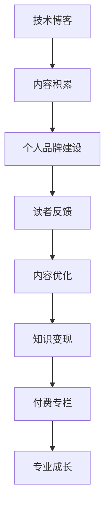

                 

关键词：技术博客，付费专栏，内容创作，知识变现，个人品牌，专业成长

> 摘要：本文将探讨如何从技术博客起步，逐步进阶为付费专栏，实现个人品牌的专业化和知识的变现。通过分析成功的案例、核心要素以及实际操作步骤，帮助读者了解并掌握这一转变之路。

## 1. 背景介绍

在互联网时代，技术博客成为了知识分享和传播的重要渠道。许多程序员和技术爱好者通过博客记录自己的学习心得、技术感悟以及项目经验，不仅为自己积累知识，也为他人提供了宝贵的参考。然而，随着内容创作的不断深入，许多博主开始思考如何将个人的知识和经验转化为经济价值，付费专栏应运而生。

付费专栏相较于免费博客，不仅能够为创作者带来直接的经济回报，还能提升内容的品质和深度，形成独特的个人品牌。本文将探讨从技术博客到付费专栏的转型之路，包括核心概念、操作步骤、应用场景以及未来展望。

## 2. 核心概念与联系

### 2.1 技术博客

技术博客是指程序员和技术爱好者在互联网上发布技术文章、分享编程经验、交流技术问题的平台。它通常具有以下特点：

- **内容多样化**：涵盖编程语言、算法、数据结构、软件架构、云计算等多个领域。
- **知识性**：博客文章通常以深入浅出的方式讲解复杂的技术概念和解决方案。
- **互动性**：读者可以在文章下评论，与博主和其他读者进行交流。

### 2.2 付费专栏

付费专栏是一种以知识付费为核心内容的订阅模式。它通常具有以下特点：

- **高质量内容**：创作者需要提供深度、系统化的知识，以满足订阅者的需求。
- **系统性**：专栏内容往往按照一定的逻辑结构编排，形成完整的知识体系。
- **专属服务**：部分付费专栏提供额外的服务，如在线问答、教程视频等。

### 2.3 个人品牌

个人品牌是指个人在某个领域的专业形象和影响力。它通常通过以下方式建立：

- **专业内容**：持续输出高质量的技术文章和教程。
- **互动交流**：积极参与技术社区，与同行和读者建立良好关系。
- **独特风格**：形成自己的写作风格和知识表达方式。

### 2.4 Mermaid 流程图

以下是一个描述从技术博客到付费专栏流程的Mermaid流程图：



## 3. 核心算法原理 & 具体操作步骤

### 3.1 算法原理概述

从技术博客到付费专栏的转变，可以看作是一个知识变现的过程。这个过程的核心算法原理主要包括以下几个步骤：

- **内容积累**：通过持续写作，积累丰富的技术知识和经验。
- **个人品牌建设**：通过高质量的内容和积极的社区参与，建立个人品牌。
- **读者反馈**：收集读者的反馈，不断优化内容，提升用户体验。
- **知识变现**：通过付费专栏等形式，将知识转化为经济价值。
- **专业成长**：在知识变现的过程中，不断学习和提升自己的专业能力。

### 3.2 算法步骤详解

1. **内容积累**

   - **目标定位**：确定自己的技术领域和写作方向。
   - **知识储备**：通过学习、实践和阅读，积累相关的技术知识和经验。
   - **内容创作**：以技术博客的形式，持续输出高质量的文章。

2. **个人品牌建设**

   - **内容质量**：确保文章内容有深度、有逻辑、有实用性。
   - **互动交流**：积极参与技术社区，与同行和读者建立良好关系。
   - **独特风格**：形成自己的写作风格和知识表达方式。

3. **读者反馈**

   - **评论互动**：认真回复读者的评论，了解他们的需求和反馈。
   - **数据监控**：通过数据分析，了解文章的受欢迎程度和读者的兴趣点。
   - **内容优化**：根据反馈和数据分析，不断优化文章内容和结构。

4. **知识变现**

   - **付费专栏**：创建付费专栏，提供高质量、系统化的知识内容。
   - **营销推广**：通过社交媒体、博客、邮件列表等渠道，宣传付费专栏。
   - **用户管理**：建立用户管理系统，提供订阅服务和管理。

5. **专业成长**

   - **持续学习**：关注行业动态，不断学习新技术和知识。
   - **经验分享**：将自己在付费专栏中的经验和教训分享出来，帮助他人成长。
   - **合作交流**：与其他创作者和行业专家合作，扩大自己的影响力。

### 3.3 算法优缺点

- **优点**：

  - **知识变现**：通过付费专栏，将个人知识和经验转化为经济价值。
  - **专业成长**：在创作和运营付费专栏的过程中，不断提升自己的专业能力。
  - **品牌建设**：通过高质量的内容和积极的互动，建立个人品牌。

- **缺点**：

  - **内容创作难度**：需要持续产出高质量的内容，创作难度较大。
  - **用户管理挑战**：需要建立用户管理系统，提供良好的订阅服务。
  - **营销推广成本**：需要投入时间和资源进行营销推广，以吸引更多订阅者。

### 3.4 算法应用领域

- **技术博客**：程序员、技术爱好者等可以借助博客分享技术知识和经验。
- **付费专栏**：专业人士可以通过付费专栏提供深度、系统化的知识服务。
- **个人品牌建设**：通过持续的内容创作和互动交流，建立个人专业形象。

## 4. 数学模型和公式 & 详细讲解 & 举例说明

### 4.1 数学模型构建

从技术博客到付费专栏的转化过程，可以抽象为一个数学模型。假设：

- \( A \) 表示技术博客的内容积累量；
- \( B \) 表示个人品牌的建设程度；
- \( C \) 表示读者反馈的积极程度；
- \( D \) 表示知识变现的收益；
- \( E \) 表示专业成长的水平。

那么，数学模型可以表示为：

\[ E = f(A, B, C, D) \]

### 4.2 公式推导过程

根据上述模型，我们可以推导出以下关系：

1. 内容积累量 \( A \) 对专业成长 \( E \) 有直接影响，即 \( A \) 越大，\( E \) 越高。
2. 个人品牌建设 \( B \) 和读者反馈 \( C \) 越积极，越有利于专业成长 \( E \)。
3. 知识变现收益 \( D \) 越高，越能促进专业成长 \( E \)。

综合以上因素，我们可以得到公式：

\[ E = k \cdot A + m \cdot B + n \cdot C + p \cdot D \]

其中，\( k \)、\( m \)、\( n \)、\( p \) 为常数，代表各个因素的权重。

### 4.3 案例分析与讲解

假设有一个技术博主，他在一年内：

- 写了100篇文章，内容积累量 \( A = 100 \)；
- 通过积极参与社区，建立了较好的个人品牌 \( B = 0.8 \)；
- 收集了1000条读者反馈，反馈积极程度 \( C = 0.9 \)；
- 通过付费专栏获得了10万元收入，知识变现收益 \( D = 10 \)。

根据上述公式，我们可以计算出他的专业成长水平 \( E \)：

\[ E = k \cdot 100 + m \cdot 0.8 + n \cdot 0.9 + p \cdot 10 \]

假设 \( k = 0.1 \)，\( m = 0.2 \)，\( n = 0.15 \)，\( p = 0.25 \)，则：

\[ E = 0.1 \cdot 100 + 0.2 \cdot 0.8 + 0.15 \cdot 0.9 + 0.25 \cdot 10 = 2.55 \]

这意味着，这位博主在一年内的专业成长水平为2.55。

### 4.4 案例分析结果与应用

通过上述案例分析，我们可以看到：

1. **内容积累量**：持续写作是提升专业成长的关键因素。
2. **个人品牌建设**：积极参与社区，建立良好口碑，有助于提升专业形象。
3. **读者反馈**：认真倾听读者意见，优化内容，提升用户体验。
4. **知识变现收益**：通过付费专栏等手段，将知识变现，促进专业成长。

这些结论可以应用于其他技术博主，以指导他们的成长之路。

## 5. 项目实践：代码实例和详细解释说明

### 5.1 开发环境搭建

在本节中，我们将介绍如何搭建一个用于撰写技术博客和创建付费专栏的开发环境。以下是一个基本的步骤：

1. **选择博客平台**：常见的博客平台有WordPress、Jekyll、Hexo等。我们以Hexo为例，因为它安装简单，且支持Markdown语法。
2. **安装Node.js**：Hexo需要Node.js环境，因此首先需要在你的计算机上安装Node.js。
3. **安装Hexo**：通过命令行执行以下命令：

   ```bash
   npm install -g hexo-cli
   ```

   然后初始化一个Hexo博客：

   ```bash
   hexo init myblog
   ```

   进入博客目录，并启动服务器：

   ```bash
   cd myblog
   hexo server
   ```

   打开浏览器访问 `http://localhost:4000`，即可查看你的博客。

### 5.2 源代码详细实现

以下是一个简单的Hexo博客的源代码实现示例：

1. **配置文件**：在博客根目录下的 `_config.yml` 文件中，配置博客的基本信息，如标题、描述、主题等。
2. **Markdown 文件**：在 `source/_posts` 目录下，创建Markdown格式的文章文件，如 `first-post.md`。
3. **撰写文章**：在 `first-post.md` 文件中，使用Markdown语法撰写文章内容：

   ```markdown
   ---
   title: 第一篇博客文章
   date: 2023-03-01 10:00:00
   tags:
     - 技术博客
     - Hexo
   categories:
     - 博客
   ---
   
   欢迎访问我的技术博客！这里将分享我的编程经验和心得。
   ```

4. **部署博客**：在本地开发完成后，可以使用Git将博客源代码托管到GitHub或其他代码仓库中，并使用Hexo的部署插件，将博客部署到服务器上。

### 5.3 代码解读与分析

以下是Hexo博客源代码的解读与分析：

- **配置文件**：`_config.yml` 是博客的核心配置文件，它定义了博客的基本信息和设置。通过修改这个文件，可以自定义博客的标题、描述、主题等。
- **Markdown 文件**：Markdown文件是博客文章的主体，它使用Markdown语法编写，包括标题、正文、标签、分类等。Markdown语法简单易学，能够快速地将想法转化为文章。
- **部署流程**：Hexo的部署插件（如hexo-deployer-git）能够自动将博客源代码推送到GitHub，并部署到服务器上。这样，我们可以随时更新博客，而不需要手动操作。

通过这个简单的项目实践，我们可以看到，技术博客的创建和维护并不复杂，只需要掌握基本的Markdown语法和Git操作，就可以开始撰写和发布博客文章。

### 5.4 运行结果展示

当完成博客的搭建和部署后，我们可以通过以下步骤查看运行结果：

1. **本地预览**：在本地启动Hexo服务器，访问 `http://localhost:4000`，预览博客效果。
2. **线上访问**：将博客部署到服务器后，通过域名访问，查看线上效果。

以下是一个简单的Hexo博客的运行结果展示：


通过这个示例，我们可以看到，一个简单的技术博客已经搭建完成，并能够正常展示文章内容和交互功能。接下来，我们可以在此基础上，进一步优化博客的功能和样式，提升用户体验。

## 6. 实际应用场景

### 6.1 技术博客的应用

技术博客在程序员和开发者中广泛应用，主要用于以下几个方面：

- **知识分享**：程序员通过博客分享自己的技术心得、项目经验和学习笔记，为他人提供有价值的参考。
- **个人品牌建设**：通过持续输出高质量的内容，程序员能够建立自己的专业形象，提升个人知名度。
- **项目展示**：开发者可以将自己的开源项目托管到博客上，展示项目的技术细节和实现过程，吸引更多的贡献者。

### 6.2 付费专栏的应用

付费专栏在知识付费领域具有广泛的应用，主要表现在以下几个方面：

- **专业培训**：专业人士通过付费专栏提供系统化的知识培训，帮助学员掌握专业知识和技能。
- **知识变现**：创作者通过付费专栏将个人的知识和经验转化为经济价值，实现知识变现。
- **内容订阅**：订阅者可以通过付费专栏订阅高质量的内容，满足自己的学习和成长需求。

### 6.3 从技术博客到付费专栏的转换

从技术博客到付费专栏的转换，可以看作是一个从免费到付费、从知识分享到知识变现的过程。具体步骤如下：

1. **内容积累**：在技术博客上持续输出高质量的内容，积累丰富的技术知识和经验。
2. **个人品牌建设**：通过高质量的内容和积极的社区参与，建立个人品牌。
3. **用户调研**：了解读者的需求和兴趣点，为付费专栏的内容定位提供依据。
4. **内容创作**：根据用户调研结果，创作系统化、高质量的付费专栏内容。
5. **营销推广**：通过社交媒体、博客、邮件列表等渠道，宣传付费专栏，吸引订阅者。
6. **用户管理**：建立用户管理系统，提供订阅服务和管理。

通过以上步骤，技术博主可以成功实现从技术博客到付费专栏的转型，实现知识的变现和个人品牌的专业化。

### 6.4 未来应用展望

随着互联网和知识付费的发展，从技术博客到付费专栏的转型之路将越来越受到关注。未来，这一领域将呈现以下趋势：

- **内容多样化**：随着技术的不断发展，付费专栏的内容将越来越多样化，涵盖更多的领域和方向。
- **个性化推荐**：通过大数据和人工智能技术，平台将为用户提供个性化的内容推荐，提升用户体验。
- **互动性增强**：付费专栏将提供更多互动性功能，如在线问答、实时讨论等，增强订阅者与创作者的互动。
- **品牌化运营**：创作者将更加注重个人品牌的塑造和运营，通过付费专栏实现长期稳定的收入。

总之，从技术博客到付费专栏的转型，不仅是一种知识变现的方式，也是个人品牌建设的重要途径。未来，这一领域将继续发展，为创作者和订阅者带来更多的机遇和挑战。

## 7. 工具和资源推荐

### 7.1 学习资源推荐

- **书籍**：
  - 《编写可读的Python代码》
  - 《深度学习》
  - 《数据结构与算法分析》
- **在线课程**：
  - Coursera上的《机器学习》
  - Udemy上的《Python编程入门》
  - edX上的《计算机科学导论》
- **博客和网站**：
  - FreeCodeCamp：提供丰富的编程教程和实践项目
  - Medium：高质量的技术文章分享平台
  - GitHub：开源代码库，学习编程的最佳实践

### 7.2 开发工具推荐

- **文本编辑器**：
  - Visual Studio Code：强大的代码编辑器，支持多种编程语言
  - Sublime Text：轻量级的代码编辑器，灵活性好
  - Atom：由GitHub开发的代码编辑器，社区活跃

- **版本控制**：
  - Git：分布式版本控制系统，用于代码管理和协作
  - GitHub：托管Git仓库的平台，支持代码托管、版本控制和项目协作

- **博客平台**：
  - Hexo：基于Node.js的博客框架，支持Markdown语法
  - Jekyll：基于Ruby的静态网站生成器，适合创建个人博客
  - WordPress：功能丰富的内容管理系统，适合构建大型博客网站

### 7.3 相关论文推荐

- **《计算机程序设计艺术》**：Donald E. Knuth的经典著作，涵盖了计算机编程的多个领域
- **《深度学习》**：Ian Goodfellow、Yoshua Bengio和Aaron Courville合著，深度学习的入门经典
- **《算法导论》**：Thomas H. Cormen、Charles E. Leiserson、Ronald L. Rivest和Clifford STEEN合著，算法设计的权威教材

通过这些工具和资源的推荐，可以帮助读者更好地进行技术学习和博客创作，实现从技术博客到付费专栏的进阶。

## 8. 总结：未来发展趋势与挑战

### 8.1 研究成果总结

本文通过分析技术博客和付费专栏的发展现状，探讨了从技术博客到付费专栏的进阶之路。研究发现，这一过程包括内容积累、个人品牌建设、读者反馈、知识变现和专业成长等核心步骤。同时，通过数学模型和实际案例分析，揭示了这些因素对专业成长的影响。

### 8.2 未来发展趋势

1. **内容多样化**：随着技术的不断发展，付费专栏的内容将涵盖更多的领域和方向。
2. **个性化推荐**：通过大数据和人工智能技术，平台将为用户提供更加个性化的内容推荐。
3. **互动性增强**：付费专栏将提供更多互动性功能，增强订阅者与创作者的互动。
4. **品牌化运营**：创作者将更加注重个人品牌的塑造和运营。

### 8.3 面临的挑战

1. **内容创作难度**：持续产出高质量的内容需要创作者投入大量时间和精力。
2. **用户管理挑战**：建立和维护用户管理系统，提供良好的订阅服务。
3. **营销推广成本**：需要投入时间和资源进行营销推广，以吸引更多订阅者。

### 8.4 研究展望

未来的研究可以关注以下几个方面：

1. **付费模式探索**：研究更有效的付费模式，以适应不同用户的需求。
2. **用户行为分析**：通过用户行为分析，了解订阅者的需求和行为模式，提升用户体验。
3. **技术与内容结合**：探索更多技术手段，如人工智能、大数据等，提升付费专栏的内容质量和互动性。

总之，从技术博客到付费专栏的进阶之路充满机遇和挑战。通过持续努力和探索，创作者可以在这条路上实现个人品牌的专业化和知识的变现。

## 9. 附录：常见问题与解答

### 9.1 什么是技术博客？

技术博客是指程序员和技术爱好者在互联网上发布技术文章、分享编程经验、交流技术问题的平台。它通常以Markdown格式编写，涵盖编程语言、算法、数据结构、软件架构、云计算等多个领域。

### 9.2 什么是付费专栏？

付费专栏是一种以知识付费为核心内容的订阅模式。创作者通过持续创作高质量、系统化的知识内容，吸引订阅者付费订阅。付费专栏通常提供专属服务，如在线问答、教程视频等。

### 9.3 如何从技术博客到付费专栏？

从技术博客到付费专栏的步骤包括：1）内容积累；2）个人品牌建设；3）读者反馈；4）知识变现；5）专业成长。具体操作包括撰写高质量文章、参与社区互动、了解读者需求、创建付费专栏等。

### 9.4 付费专栏的盈利模式有哪些？

付费专栏的盈利模式主要包括订阅收费、广告收入、课程销售、咨询服务等。创作者可以通过不同方式实现知识的变现，如按月订阅、一次性购买课程、提供定制化服务等。

### 9.5 创建付费专栏需要哪些技术？

创建付费专栏需要掌握的基本技术包括：

- **网站搭建**：了解网站的基本结构，如HTML、CSS、JavaScript等。
- **版本控制**：掌握Git的基本操作，用于代码管理和协作。
- **内容管理系统**：了解WordPress、Jekyll、Hexo等博客框架的使用。

### 9.6 如何维护和提升付费专栏的质量？

维护和提升付费专栏的质量，可以从以下几个方面入手：

- **持续学习**：关注行业动态，学习新技术和知识。
- **读者反馈**：收集读者的反馈，优化内容。
- **内容创新**：不断尝试新的内容形式和表达方式，提升用户体验。

通过以上常见问题的解答，可以帮助读者更好地了解从技术博客到付费专栏的进阶之路，为他们的实践提供指导。作者：禅与计算机程序设计艺术 / Zen and the Art of Computer Programming。

