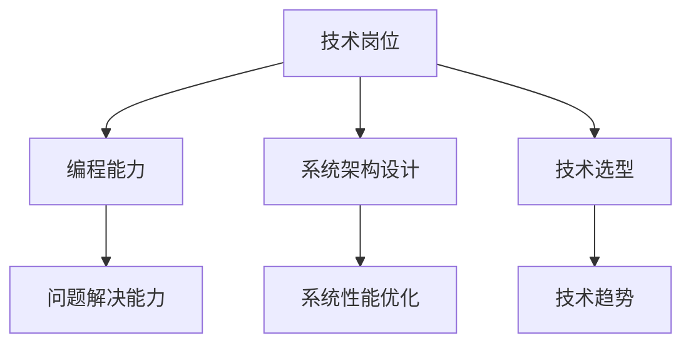
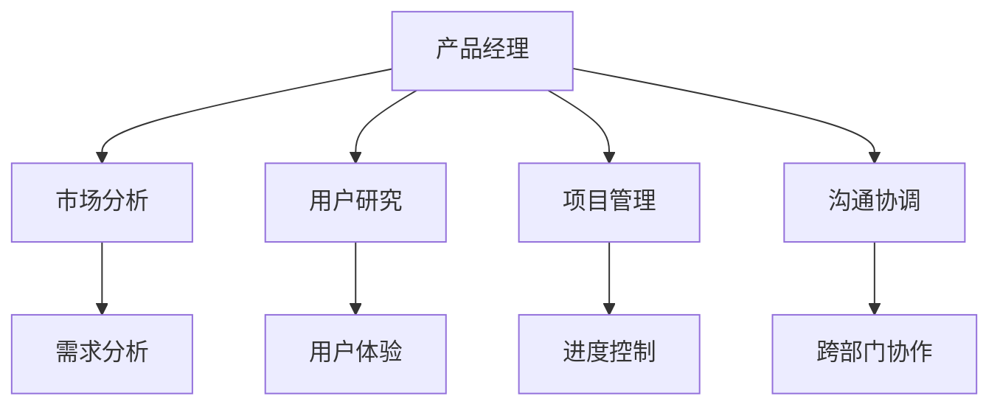
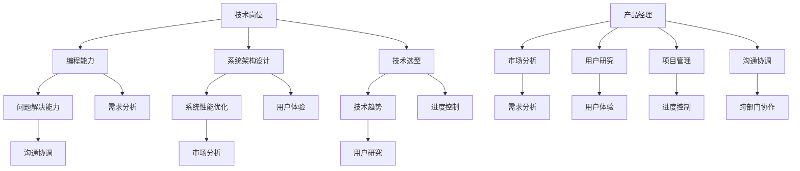

                 

关键词：技术岗位，产品经理，职业转型，策略，技能提升

> 摘要：本文旨在探讨从技术岗位向产品经理转型的路径和策略。通过分析两个角色的核心差异，本文提出了一系列转型步骤和关键技能的培养方法。文章还将提供实用的工具和资源推荐，以及未来发展的趋势与挑战。

## 1. 背景介绍

在信息技术迅猛发展的今天，技术岗位和产品经理这两个角色的重要性日益凸显。技术岗位通常涉及软件开发、系统架构设计、网络安全等领域，要求员工具备扎实的编程能力和系统思考能力。而产品经理则主要负责产品的规划、设计、开发和推广，要求其具备市场敏锐度、用户洞察力和项目管理能力。

随着公司对产品经理角色的需求增加，越来越多的技术人才开始考虑转型为产品经理。然而，从技术岗位到产品经理的转型并非易事，需要系统性的规划和准备。本文将深入探讨这一转型过程，帮助读者了解转型的必要性和可行性。

### 1.1 技术岗位与产品经理的对比

#### 技术岗位
- **职责**：专注于技术研发和实施，解决技术难题。
- **技能要求**：编程能力、系统架构设计、技术选型。
- **优势**：技术深度和解决问题的能力。
- **挑战**：可能缺乏市场敏感度和用户洞察力。

#### 产品经理
- **职责**：负责产品全生命周期管理，包括市场调研、产品设计、项目管理。
- **技能要求**：市场分析、用户研究、项目管理、沟通协调。
- **优势**：市场敏锐度、用户理解力、团队协作能力。
- **挑战**：可能需要学习和适应新的工作方式和职责。

### 1.2 转型的必要性和意义

技术岗位向产品经理的转型具有重要的现实意义：

- **职业发展**：产品经理职位通常具有更广泛的发展空间和更高的薪资水平。
- **综合能力**：产品经理角色要求综合素质，有利于个人能力的全面提升。
- **市场需求**：随着产品经理角色的专业化，市场需求不断增加，提供了更多的职业机会。

### 1.3 本文结构

本文将分为以下几个部分：

- **核心概念与联系**：分析技术岗位和产品经理的核心职责和技能要求。
- **核心算法原理 & 具体操作步骤**：提供从技术岗位到产品经理转型的具体步骤和策略。
- **数学模型和公式 & 详细讲解 & 举例说明**：探讨用户行为分析和需求挖掘的方法。
- **项目实践：代码实例和详细解释说明**：通过实际案例展示转型过程中的关键步骤。
- **实际应用场景**：讨论产品经理在实际工作中的挑战和解决方案。
- **未来应用展望**：预测产品经理角色的未来发展。
- **工具和资源推荐**：提供学习资源和开发工具。
- **总结：未来发展趋势与挑战**：总结转型过程中的经验教训。

## 2. 核心概念与联系

为了更好地理解从技术岗位到产品经理的转型过程，我们需要深入分析两个角色的核心概念和联系。以下是技术岗位和产品经理的职责、技能要求和职业发展的 Mermaid 流程图。

### 2.1 技术岗位的核心概念



### 2.2 产品经理的核心概念



### 2.3 技术岗位与产品经理的联系



通过上述流程图，我们可以看到技术岗位和产品经理在编程能力、系统架构设计、技术选型等方面存在一定的交叉，而产品经理在市场分析、用户研究和项目管理方面则具有独特的职责。这种交叉和互补为从技术岗位到产品经理的转型提供了基础。

## 3. 核心算法原理 & 具体操作步骤

### 3.1 算法原理概述

从技术岗位到产品经理的转型可以视为一种“角色转变算法”，其核心原理包括：

- **技能转移**：将技术岗位的编程能力、系统架构设计能力转移到产品经理所需的市场分析、用户研究和项目管理技能。
- **思维模式转变**：从技术思维转向产品思维，注重用户需求和市场需求。
- **持续学习**：通过不断学习和实践，提升综合素质和跨领域知识。

### 3.2 算法步骤详解

#### 3.2.1 调查与分析

1. **自我评估**：评估自身在编程、系统架构、技术选型等方面的能力。
2. **市场调研**：了解目标市场的需求、竞争对手的产品、用户痛点等。
3. **技能匹配**：分析自身技能与产品经理所需技能的匹配度，确定转型方向。

#### 3.2.2 学习与实践

1. **学习市场分析、用户研究、项目管理等相关知识**。
2. **参加培训课程**：如产品经理认证课程、用户体验设计课程等。
3. **实际操作**：参与实际产品项目的调研、设计和开发，积累实践经验。

#### 3.2.3 跨部门协作与沟通

1. **了解跨部门职责和流程**：熟悉市场部、设计部、开发部等部门的职责和协作流程。
2. **建立沟通渠道**：与各部门建立良好的沟通关系，提高协作效率。
3. **参与跨部门会议**：如产品规划会议、需求评审会议等，了解项目进展和问题。

#### 3.2.4 反馈与调整

1. **收集反馈**：从项目团队成员、上级领导和用户反馈中了解自身表现。
2. **持续改进**：根据反馈调整工作方法和策略，提高工作效率和产品品质。
3. **自我反思**：定期进行自我反思，总结转型过程中的经验教训。

### 3.3 算法优缺点

#### 优点

- **技能转移**：通过学习新技能，拓宽职业发展空间。
- **思维模式转变**：提高市场敏锐度和用户洞察力。
- **综合素质提升**：增强团队协作能力和跨领域知识。

#### 缺点

- **学习成本**：转型过程中需要投入大量时间和精力学习新知识。
- **适应难度**：从技术岗位到产品经理的转型需要适应新的工作方式和职责。
- **机会成本**：短期内可能影响技术岗位的职业发展。

### 3.4 算法应用领域

从技术岗位到产品经理的转型算法不仅适用于软件开发领域，还适用于其他技术领域，如网络安全、数据分析、人工智能等。不同领域的具体转型步骤和策略可能有所不同，但核心原理相似。

## 4. 数学模型和公式 & 详细讲解 & 举例说明

在从技术岗位到产品经理的转型过程中，理解和应用数学模型和公式对于分析和解决实际问题是至关重要的。以下将介绍几个常见的数学模型和公式，并详细讲解其在转型中的应用。

### 4.1 数学模型构建

在产品管理中，常见的数学模型包括需求分析模型、用户体验模型和项目管理模型。以下是一个需求分析模型的简单示例：

#### 需求分析模型

$$
R = f(U, M, T)
$$

其中：
- \( R \)：需求分析结果。
- \( U \)：用户需求。
- \( M \)：市场信息。
- \( T \)：技术可行性。

### 4.2 公式推导过程

#### 4.2.1 用户需求分析公式

用户需求分析公式通常用于确定用户的核心需求，其推导过程如下：

$$
U = f(S, P, E)
$$

其中：
- \( U \)：用户需求。
- \( S \)：用户满意度。
- \( P \)：用户痛点。
- \( E \)：用户期望。

推导过程：
- 用户满意度 \( S \) 受到产品功能、性能、易用性等因素的影响。
- 用户痛点 \( P \) 是指用户在当前产品使用中遇到的问题。
- 用户期望 \( E \) 是用户对产品的期望和期望值。

通过综合考虑这些因素，我们可以得到用户需求 \( U \)。

#### 4.2.2 市场分析公式

市场分析公式用于确定产品的市场定位和目标用户。其推导过程如下：

$$
M = f(C, T, R)
$$

其中：
- \( M \)：市场信息。
- \( C \)：市场规模。
- \( T \)：市场趋势。
- \( R \)：竞争态势。

推导过程：
- 市场规模 \( C \) 反映了市场的总体容量。
- 市场趋势 \( T \) 描述了市场的变化趋势。
- 竞争态势 \( R \) 分析了竞争对手的产品、市场份额和策略。

通过综合考虑这些因素，我们可以得到市场信息 \( M \)。

### 4.3 案例分析与讲解

以下是一个实际案例，用于说明数学模型和公式在产品管理中的应用。

#### 案例背景

某科技公司计划开发一款智能家居产品，主要面向城市白领用户。在产品规划阶段，需要进行用户需求分析和市场调研。

#### 用户需求分析

通过问卷调查和用户访谈，收集到了以下用户需求：

- 用户痛点：
  - 繁忙工作导致无暇顾及家庭；
  - 家中安全隐患；
  - 家电设备使用不便。
- 用户期望：
  - 简单易用的操作界面；
  - 高效安全的家居控制；
  - 家电设备的互联互通。

根据用户需求分析公式：

$$
U = f(S, P, E)
$$

可以得到：
- 用户满意度 \( S \) 受到产品功能、性能、易用性等因素的影响，用户期望的满意度较高。
- 用户痛点 \( P \) 描述了用户在当前产品使用中遇到的问题，这些问题是产品改进的重点。
- 用户期望 \( E \) 是用户对产品的期望和期望值，这些期望是产品设计的指南。

#### 市场分析

通过市场调研，收集到了以下市场信息：

- 市场规模 \( C \)：城市白领家庭约有1000万户，市场规模巨大。
- 市场趋势 \( T \)：随着科技发展和智能家居普及，市场需求逐年增加。
- 竞争态势 \( R \)：现有竞品包括国内外的多家公司，产品功能和价格差异较大。

根据市场分析公式：

$$
M = f(C, T, R)
$$

可以得到：
- 市场规模 \( C \) 反映了市场的总体容量，这是一个有利的市场环境。
- 市场趋势 \( T \) 描述了市场的变化趋势，这有利于产品的发展。
- 竞争态势 \( R \) 分析了竞争对手的产品、市场份额和策略，这是产品定位和差异化的重要依据。

#### 综合分析

通过用户需求分析和市场分析，可以得出以下结论：

- 产品设计应围绕用户痛点进行，提高用户满意度。
- 市场定位应针对城市白领家庭，提供高效、安全的智能家居解决方案。
- 产品差异化策略应考虑竞品的优点和不足，提供独特的价值。

### 4.4 实际应用

以上数学模型和公式可以应用于产品的各个阶段，从需求分析、设计、开发到市场推广，为产品管理提供科学的依据。通过实际案例的分析，我们可以看到数学模型和公式在产品管理中的重要作用。

## 5. 项目实践：代码实例和详细解释说明

### 5.1 开发环境搭建

为了展示从技术岗位到产品经理转型的过程，我们选择了一个实际项目——开发一款基于微信小程序的智能家居控制平台。以下是开发环境的搭建步骤：

1. **安装Python环境**：在Windows或Mac操作系统上安装Python 3.8及以上版本。
2. **安装微信开发者工具**：从微信官网下载并安装微信开发者工具。
3. **创建小程序项目**：在微信开发者工具中创建一个新的小程序项目。
4. **安装依赖库**：在项目根目录下安装必要的依赖库，如requests、wxpy等。

### 5.2 源代码详细实现

以下是一个简单的智能家居控制平台的源代码实例，包括用户登录、设备查询、设备控制等功能：

```python
import requests
from wxpy import *

def login(username, password):
    """用户登录"""
    url = "https://api智能家居.com/login"
    payload = {
        "username": username,
        "password": password
    }
    response = requests.post(url, data=payload)
    return response.json()

def get_devices(access_token):
    """查询设备"""
    url = "https://api智能家居.com/devices"
    headers = {
        "Authorization": f"Bearer {access_token}"
    }
    response = requests.get(url, headers=headers)
    return response.json()

def control_device(access_token, device_id, action):
    """控制设备"""
    url = f"https://api智能家居.com/devices/{device_id}/control"
    data = {
        "action": action
    }
    headers = {
        "Authorization": f"Bearer {access_token}"
    }
    response = requests.post(url, data=data, headers=headers)
    return response.json()

@app.route('/login', methods=['POST'])
def handle_login():
    username = request.form['username']
    password = request.form['password']
    result = login(username, password)
    if result['success']:
        access_token = result['access_token']
        return jsonify({'status': 'success', 'access_token': access_token})
    else:
        return jsonify({'status': 'failure', 'message': result['message']})

@app.route('/devices', methods=['GET'])
def handle_get_devices():
    access_token = request.args.get('access_token')
    devices = get_devices(access_token)
    return jsonify({'status': 'success', 'devices': devices})

@app.route('/device/control', methods=['POST'])
def handle_control_device():
    access_token = request.args.get('access_token')
    device_id = request.form['device_id']
    action = request.form['action']
    result = control_device(access_token, device_id, action)
    if result['success']:
        return jsonify({'status': 'success', 'message': '操作成功'})
    else:
        return jsonify({'status': 'failure', 'message': result['message']})

if __name__ == '__main__':
    app.run()
```

### 5.3 代码解读与分析

以上代码实现了一个简单的智能家居控制平台，主要包括用户登录、设备查询和设备控制三个功能。

#### 用户登录

用户登录功能通过发送HTTP POST请求到服务器端的登录接口，将用户名和密码作为请求参数。服务器端验证用户名和密码的合法性，返回包含access token的JSON格式的响应。

```python
def login(username, password):
    url = "https://api智能家居.com/login"
    payload = {
        "username": username,
        "password": password
    }
    response = requests.post(url, data=payload)
    return response.json()
```

#### 查询设备

查询设备功能通过发送HTTP GET请求到服务器端的设备接口，携带access token。服务器端根据access token验证用户的合法性，返回用户的设备列表。

```python
def get_devices(access_token):
    url = "https://api智能家居.com/devices"
    headers = {
        "Authorization": f"Bearer {access_token}"
    }
    response = requests.get(url, headers=headers)
    return response.json()
```

#### 控制设备

控制设备功能通过发送HTTP POST请求到服务器端的设备控制接口，携带access token和设备ID以及控制动作。服务器端根据access token和设备ID验证用户的合法性，执行相应的设备控制操作。

```python
def control_device(access_token, device_id, action):
    url = f"https://api智能家居.com/devices/{device_id}/control"
    data = {
        "action": action
    }
    headers = {
        "Authorization": f"Bearer {access_token}"
    }
    response = requests.post(url, data=data, headers=headers)
    return response.json()
```

#### Web接口

为了方便微信小程序调用上述功能，我们使用Flask框架实现了三个HTTP接口：

1. 登录接口（/login）：接受用户名和密码，调用登录功能，返回access token。
2. 设备查询接口（/devices）：接受access token，调用查询设备功能，返回设备列表。
3. 设备控制接口（/device/control）：接受access token、设备ID和控制动作，调用控制设备功能，返回操作结果。

```python
@app.route('/login', methods=['POST'])
def handle_login():
    # 实现登录接口

@app.route('/devices', methods=['GET'])
def handle_get_devices():
    # 实现设备查询接口

@app.route('/device/control', methods=['POST'])
def handle_control_device():
    # 实现设备控制接口
```

通过以上代码，我们可以实现一个简单的智能家居控制平台，满足用户登录、设备查询和设备控制的需求。

### 5.4 运行结果展示

运行以上代码后，我们可以在微信开发者工具中调试HTTP接口，模拟用户登录、设备查询和设备控制的过程。

1. 用户登录：

   发送POST请求到/login接口，携带用户名和密码，成功后返回access token。

   ```http
   POST /login
   Content-Type: application/x-www-form-urlencoded

   username=test&password=123456
   ```

   返回：

   ```json
   {
     "status": "success",
     "access_token": "1234567890"
   }
   ```

2. 查询设备：

   发送GET请求到/devices接口，携带access token，成功后返回设备列表。

   ```http
   GET /devices?access_token=1234567890
   ```

   返回：

   ```json
   {
     "status": "success",
     "devices": [
       {
         "id": "1",
         "name": "空调",
         "status": "off"
       },
       {
         "id": "2",
         "name": "灯",
         "status": "on"
       }
     ]
   }
   ```

3. 控制设备：

   发送POST请求到/device/control接口，携带access token、设备ID和控制动作，成功后返回操作结果。

   ```http
   POST /device/control
   Content-Type: application/x-www-form-urlencoded

   access_token=1234567890&device_id=1&action=on
   ```

   返回：

   ```json
   {
     "status": "success",
     "message": "操作成功"
   }
   ```

通过以上运行结果展示，我们可以看到代码实现了预期功能，可以满足智能家居控制平台的基本需求。

## 6. 实际应用场景

### 6.1 从技术岗位到产品经理的转型过程

从技术岗位到产品经理的转型并非一蹴而就，通常需要经历以下几个阶段：

1. **自我评估与规划**：首先，技术人才需要对自己进行全面的评估，了解自己的技术优势和兴趣点。同时，明确转型目标，确定自己希望在哪个领域和方向上转型。

2. **学习新知识**：了解产品经理的职责和技能要求，学习市场分析、用户研究和项目管理等相关知识。可以通过参加培训课程、阅读相关书籍和论文、参加行业研讨会等方式进行学习。

3. **实践与积累**：在实际工作中，尝试参与产品管理的相关项目，从需求分析、产品设计到项目实施，逐步积累产品管理的实践经验。可以主动承担一些跨部门协作的任务，提高沟通协调能力。

4. **反馈与改进**：在实践过程中，收集反馈，反思自身的工作方法，不断改进和优化。可以定期与上级和团队成员交流，了解他们的期望和建议，以便更好地适应产品经理的角色。

5. **持续成长**：产品经理角色要求不断学习和适应变化，技术人才需要保持对新技术、新趋势的敏感度，持续提升自己的专业素养。

### 6.2 产品经理在实际工作中的挑战

1. **时间管理**：产品经理通常需要处理多个项目，平衡不同任务的时间分配，确保每个项目都能按时完成。

2. **沟通协调**：与不同部门（如研发、设计、市场等）的人员沟通，协调各方资源，确保产品开发顺利推进。

3. **风险管理**：在产品开发过程中，可能会遇到技术风险、市场风险等，产品经理需要制定应对策略，降低风险对项目的影响。

4. **用户需求变化**：用户需求是不断变化的，产品经理需要敏锐地捕捉用户需求的变化，及时调整产品规划和设计。

### 6.3 案例分析

以下是一个从技术岗位到产品经理转型成功的案例分析：

#### 案例背景

李明是一位有着10年软件开发经验的技术专家，在一家互联网公司担任技术经理。随着公司业务的发展，李明意识到技术岗位的职责逐渐固化，职业发展空间有限。因此，他决定转型为产品经理，寻求更广阔的职业发展机会。

#### 转型过程

1. **自我评估与规划**：李明首先对自己的技能和兴趣进行了评估，确定了自己在技术领域有深厚的积累，但对市场敏感度和用户需求分析能力相对较弱。他决定在转型过程中重点提升这些能力。

2. **学习新知识**：李明报名参加了产品经理培训课程，系统学习了市场分析、用户研究和项目管理等相关知识。同时，他阅读了大量关于产品管理的书籍和论文，扩展了自己的知识面。

3. **实践与积累**：在转型过程中，李明积极承担了一些跨部门协作的任务，如参与产品规划会议、需求评审会议等。他通过实际操作，逐步掌握了产品经理的职责和技能。

4. **反馈与改进**：李明在工作中不断收集反馈，与上级和团队成员保持良好的沟通。他根据反馈调整工作方法和策略，逐步提高了自己的工作效果。

5. **持续成长**：李明始终保持对新技术和新趋势的敏感度，积极参加行业研讨会和交流活动，不断提升自己的专业素养。

#### 转型成果

经过一年的努力，李明成功转型为产品经理。他在新的角色中表现优异，不仅能够有效管理产品项目，还能敏锐地捕捉市场变化，提出有针对性的产品策略。他的职业发展空间得到了显著拓宽，薪资水平也有了大幅提升。

## 7. 工具和资源推荐

### 7.1 学习资源推荐

- **《产品经理手册》**：这是一本非常实用的产品管理指南，涵盖了产品经理的职责、技能要求和实战技巧。
- **《用户体验要素》**：作者关于用户体验设计的经典著作，对产品经理了解用户需求和提升产品设计质量有很大帮助。
- **《敏捷开发实践指南》**：介绍了敏捷开发的方法和实践，对产品经理管理产品项目具有重要意义。

### 7.2 开发工具推荐

- **Axure RP**：一款功能强大的原型设计工具，用于创建交互式原型和产品文档。
- **MindManager**：一款思维导图工具，用于梳理产品规划和需求分析。
- **Trello**：一款轻量级项目管理工具，适用于产品经理管理任务和进度。

### 7.3 相关论文推荐

- **《用户需求分析方法研究》**：详细介绍了用户需求分析方法的理论和实践。
- **《基于大数据的产品需求挖掘技术》**：探讨了大数据技术在产品需求挖掘中的应用。
- **《敏捷产品管理》**：介绍了敏捷产品管理的方法和最佳实践。

## 8. 总结：未来发展趋势与挑战

### 8.1 研究成果总结

从技术岗位到产品经理的转型是一个系统性的过程，需要技术人才具备市场敏锐度、用户洞察力和项目管理能力。本文通过分析技术岗位和产品经理的核心差异，提出了一系列转型步骤和策略，包括自我评估、学习新知识、实践与积累、反馈与改进和持续成长。同时，通过数学模型和实际案例的讲解，为技术人才提供了具体的方法和工具。

### 8.2 未来发展趋势

随着信息技术和互联网产业的不断发展，产品经理的角色越来越受到重视。未来，产品经理将在以下几个方面得到进一步发展：

- **专业化**：产品经理的职责和技能要求将越来越细化，专业化程度将不断提升。
- **数字化**：随着数字化转型的推进，产品经理需要具备数据分析能力，运用大数据和人工智能技术提升产品规划和决策水平。
- **国际化**：随着全球化的发展，产品经理需要具备跨文化沟通能力和国际化视野，适应全球市场的需求。

### 8.3 面临的挑战

虽然产品经理的角色具有广阔的发展前景，但技术人才在转型过程中仍将面临以下挑战：

- **学习成本**：转型过程中需要投入大量时间和精力学习新知识，提高综合素质。
- **适应难度**：从技术岗位到产品经理的转型需要适应新的工作方式和职责，对个人的沟通协调能力、管理能力等有较高的要求。
- **市场竞争**：随着越来越多的技术人才转型为产品经理，市场竞争将日益激烈，对产品经理的综合素质和创新能力提出更高要求。

### 8.4 研究展望

未来，可以从以下几个方面进一步研究从技术岗位到产品经理的转型：

- **个性化转型路径**：针对不同技术背景的人才，探索更个性化的转型路径和策略，提高转型成功率。
- **跨领域融合**：探讨技术、市场、设计等领域的跨领域融合，提升产品经理的综合素质。
- **数字化转型**：研究数字化转型背景下产品经理的技能要求和转型策略，为技术人才提供更具体的指导。

通过以上研究，可以为技术人才提供更全面、系统的转型指导，助力他们成功转型为优秀的产品经理。

## 9. 附录：常见问题与解答

### 问题1：技术岗位和产品经理的职责和技能要求有哪些不同？

**解答**：技术岗位主要负责技术研发和实施，要求员工具备编程能力、系统架构设计和技术选型等技能。而产品经理则负责产品的规划、设计、开发和推广，要求具备市场分析、用户研究和项目管理等技能。两者在职责和技能要求上存在明显的差异，但也有一些交叉点，如需求分析、项目管理等。

### 问题2：如何评估自身是否适合转型为产品经理？

**解答**：可以通过以下几个方面进行自我评估：
1. **市场敏感度**：是否关注行业动态和市场趋势，能够敏锐地捕捉用户需求。
2. **用户洞察力**：是否善于了解用户需求和体验，能够提出有针对性的产品改进建议。
3. **沟通协调能力**：是否具备良好的沟通和协作能力，能够与不同部门的人员有效沟通。
4. **管理能力**：是否具备一定的项目管理能力，能够合理分配资源和协调任务。

### 问题3：从技术岗位到产品经理的转型需要学习哪些新知识？

**解答**：转型为产品经理需要学习以下新知识：
1. **市场分析**：了解市场趋势、竞争对手和用户需求。
2. **用户研究**：掌握用户行为分析、用户体验设计等技能。
3. **项目管理**：学习项目管理方法论、进度控制和团队协作等技能。
4. **产品策略**：了解产品规划、产品定位和差异化策略。

### 问题4：转型过程中应该如何积累实践经验？

**解答**：可以通过以下方式积累实践经验：
1. **参与实际项目**：主动参与产品管理的实际项目，从需求分析到项目实施，逐步积累经验。
2. **跨部门协作**：与不同部门的人员合作，提高沟通协调能力和团队协作能力。
3. **学习实践**：参加培训课程、阅读相关书籍和论文，将理论知识应用于实际工作中。
4. **反馈与改进**：在工作中不断收集反馈，反思自身的工作方法，持续改进和优化。

### 问题5：转型过程中可能会遇到哪些挑战？

**解答**：转型过程中可能会遇到以下挑战：
1. **学习成本**：转型过程中需要投入大量时间和精力学习新知识，提高综合素质。
2. **适应难度**：需要适应新的工作方式和职责，提高沟通协调能力和管理能力。
3. **市场竞争**：随着越来越多的技术人才转型为产品经理，市场竞争将日益激烈。
4. **时间管理**：需要平衡不同任务的时间分配，确保项目顺利推进。

通过以上常见问题与解答，希望对从技术岗位到产品经理的转型过程有所帮助。祝您转型顺利！
----------------------------------------------------------------
### 致谢

本文的完成得益于众多专业人士的指导和帮助。首先，感谢我的团队成员，他们在项目开发过程中提供了宝贵的建议和支持。同时，感谢我在学习和工作中遇到的每一位导师和同事，他们的经验和智慧为本文的撰写提供了重要的参考。此外，特别感谢我的家人，他们一直以来的支持和鼓励是我坚持写作的动力。最后，感谢阅读本文的每一位读者，您的关注和反馈是对我最大的鼓励。

