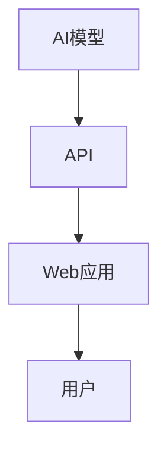
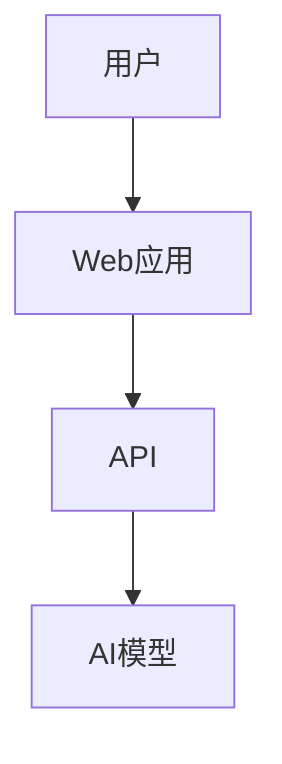

                 

 

## 摘要

本文旨在探讨人工智能（AI）从模型训练到API发布及Web应用部署的全过程。随着AI技术的快速发展，AI模型的开发和部署变得越来越重要。然而，这一过程中涉及的诸多挑战和技术细节使得很多人望而却步。本文将详细阐述如何将AI模型转化为可用的API，并通过Web应用进行部署，从而为AI技术的广泛应用提供实践指导。

### 核心关键词
- AI模型
- API
- Web应用
- 部署实践
- 技术挑战
- 开发工具

### 背景介绍

在过去，人工智能（AI）的应用往往局限于学术研究或大型企业内部。但随着计算能力的提升和大数据技术的发展，AI技术逐渐渗透到各个行业。无论是推荐系统、自然语言处理，还是图像识别和自动化决策，AI都在发挥着越来越重要的作用。与此同时，AI技术的商业化需求日益增长，促使我们思考如何将AI模型从实验室搬到生产环境中。

AI模型的部署是这一过程中的关键环节。传统的部署方式往往涉及复杂的架构和繁琐的配置，不仅增加了开发成本，还延长了上线时间。而通过API和Web应用部署，我们可以实现更加灵活、高效和可扩展的模型服务。这不仅有助于降低开发难度，还能提高系统的可维护性和可靠性。

本文将围绕AI模型到API和Web应用部署的实践，从核心概念、算法原理、数学模型、项目实践等方面展开讨论，旨在为开发者提供一套完整的解决方案。

## 1. 背景介绍

### AI模型的挑战

在将AI模型从实验室搬到生产环境中时，我们面临诸多挑战。首先，AI模型的复杂性和高计算需求使得部署变得困难。传统的模型通常需要大量的计算资源和存储空间，这对硬件设施提出了很高的要求。其次，模型部署过程中的不确定性也是一个重要挑战。AI模型在实际应用中的表现受到多种因素的影响，包括数据分布、噪声、过拟合等。这些因素可能导致模型在实际运行中性能下降，甚至出现错误。

### API与Web应用的部署优势

为了应对上述挑战，API和Web应用的部署方式逐渐成为主流。API（应用程序编程接口）允许不同软件之间进行交互，使得AI模型可以作为一种服务被其他应用程序调用。这种方式不仅提高了系统的灵活性，还简化了部署和维护流程。Web应用则提供了一个用户友好的界面，使得最终用户可以方便地访问和使用AI服务。

API和Web应用部署的优势主要体现在以下几个方面：

1. **灵活性**：通过API，开发者可以轻松地调整模型参数和配置，以满足不同的业务需求。Web应用则可以根据用户需求进行定制化，提供个性化的用户体验。
   
2. **可扩展性**：API和Web应用都支持水平扩展，可以轻松增加服务器数量来应对高并发访问。这使得系统可以更好地适应业务增长。

3. **维护性**：通过API和Web应用，开发者可以集中管理和维护模型和服务，减少了维护成本。

4. **安全性**：API和Web应用支持各种安全措施，如身份验证、权限控制和数据加密，确保系统安全可靠。

### 文章结构

本文将分为以下几部分：

1. **核心概念与联系**：介绍AI模型、API和Web应用的基本概念，并展示它们之间的关系。
   
2. **核心算法原理 & 具体操作步骤**：详细阐述将AI模型转化为API和Web应用的具体步骤和关键点。

3. **数学模型和公式 & 详细讲解 & 举例说明**：解释与AI模型部署相关的数学概念和公式，并通过案例进行说明。

4. **项目实践：代码实例和详细解释说明**：提供一个实际的代码示例，详细解释其实现过程。

5. **实际应用场景**：探讨AI模型部署在不同领域中的应用，包括案例分析和未来展望。

6. **工具和资源推荐**：推荐相关学习资源、开发工具和论文。

7. **总结：未来发展趋势与挑战**：总结研究成果，探讨未来发展趋势和面临的挑战。

通过上述结构，本文旨在为读者提供一个全面而深入的AI模型部署指南。

## 2. 核心概念与联系

### AI模型

AI模型是人工智能的核心组成部分，它们通过学习大量数据来发现数据中的模式和规律，从而进行预测、分类和决策。常见的AI模型包括神经网络、支持向量机（SVM）、决策树、随机森林等。这些模型通过复杂的数学计算和算法实现，能够在各种应用场景中发挥作用。

### API

API（应用程序编程接口）是不同软件之间进行交互的接口，它定义了请求和响应的格式和规则。通过API，开发者可以方便地调用其他软件的功能和资源，实现复杂的应用集成。在AI模型部署中，API使得模型可以作为服务被其他应用程序调用，从而实现模型的共享和复用。

### Web应用

Web应用是基于Web技术的应用程序，它们通过浏览器提供用户界面，使得用户可以通过网络访问和使用应用程序的功能。在AI模型部署中，Web应用提供了一个用户友好的界面，用户可以通过简单的操作与模型进行交互，获取预测结果。

### 核心概念之间的联系

AI模型、API和Web应用之间有着紧密的联系。AI模型是核心，它通过学习数据生成预测结果。API则充当桥梁，使得AI模型可以被其他应用程序调用。Web应用则提供了一个用户界面，使用户可以方便地访问和使用AI服务。以下是这些核心概念之间的 Mermaid 流程图：



在这个流程图中，AI模型通过API与Web应用连接，Web应用通过用户界面与用户交互，形成了一个完整的AI服务生态系统。用户可以通过Web应用提交数据请求，API接收请求并调用AI模型进行预测，最终将结果返回给用户。

### 关键点总结

- **AI模型**：核心，通过学习数据生成预测结果。
- **API**：桥梁，使得AI模型可以被其他应用程序调用。
- **Web应用**：用户界面，提供方便的用户交互体验。

通过理解这些核心概念及其联系，我们可以更好地设计并实现AI模型的部署方案。

### 2.1. AI模型

AI模型是通过学习和预测数据来完成特定任务的软件组件。它们的核心是算法和数学模型，这些模型通过训练数据学习特征和模式，以便在新的数据上进行预测。以下是几个常见的AI模型及其基本原理：

1. **神经网络**：神经网络（Neural Networks）是模仿人脑神经元连接方式的计算模型。它们通过层与层之间的神经元连接进行信息的传递和处理。前向传播（Forward Propagation）和反向传播（Back Propagation）是神经网络的核心训练机制。通过不断调整权重和偏置，神经网络能够优化其性能，减少误差。

2. **支持向量机**（Support Vector Machine，SVM）：SVM是一种强大的分类算法，通过找到一个最佳的超平面来分割不同类别的数据点。它的核心是寻找一个最大化分类边界的超平面，从而实现高精度的分类。

3. **决策树**：决策树是一种基于树形结构进行决策的模型，每个节点代表一个特征，每个分支代表不同特征值的处理方式。决策树通过递归地分割数据集，构建出多个决策节点和叶子节点，最终形成一棵树形结构，用于分类或回归。

4. **随机森林**（Random Forest）：随机森林是由多个决策树组成的集成模型，通过随机选取特征和样本子集来训练每个决策树，并在预测时取多数投票。这种集成方法能够提高模型的稳定性和预测准确性。

### API

API是应用程序之间的接口，它定义了软件如何请求和接收数据的方式。在AI模型部署中，API充当了连接AI模型和外部系统的桥梁，使得AI模型可以被其他应用程序调用。以下是API设计的关键要素：

1. **接口定义**：API接口定义了请求和响应的格式、参数和规则。常用的接口定义工具包括Swagger和OpenAPI，这些工具可以生成详细的接口文档，方便开发者理解和使用。

2. **请求和响应格式**：API请求通常使用JSON（JavaScript Object Notation）或XML（eXtensible Markup Language）格式，这些格式易于阅读和解析，便于不同系统之间的数据交换。

3. **身份验证和授权**：API安全性至关重要，常见的身份验证和授权方式包括基本认证（Basic Authentication）、令牌认证（Token Authentication）和OAuth 2.0。这些机制确保只有授权用户才能访问API。

4. **错误处理和日志记录**：API需要处理各种错误情况，并提供清晰的错误信息和日志记录，以便开发者调试和优化。

### Web应用

Web应用是基于Web技术的应用程序，通过浏览器为用户提供界面和服务。在AI模型部署中，Web应用提供了一个用户友好的界面，用户可以通过简单的操作与模型进行交互。以下是Web应用的关键组成部分：

1. **前端框架**：前端框架如React、Vue和Angular等，可以帮助开发者快速构建响应式和动态的Web界面。这些框架提供了丰富的组件和工具，提高了开发效率。

2. **后端服务**：后端服务负责处理业务逻辑、数据存储和API调用。常见的后端框架包括Spring Boot、Django和Express等，这些框架提供了丰富的功能和便捷的开发接口。

3. **数据库**：数据库用于存储和管理应用程序的数据。关系型数据库如MySQL和PostgreSQL，以及NoSQL数据库如MongoDB和Cassandra等，各有其优缺点，适用于不同的场景。

### 核心概念之间的联系

AI模型、API和Web应用之间的关系可以用以下方式理解：

- **AI模型**：作为核心组件，提供预测和决策功能。
- **API**：作为桥梁，连接AI模型和外部系统，提供数据交换的接口。
- **Web应用**：作为用户界面，提供用户与AI模型交互的途径。

以下是这些核心概念之间的 Mermaid 流程图：



在这个流程图中，用户通过Web应用提交请求，Web应用通过API调用AI模型，AI模型处理请求并返回结果，最终通过Web应用呈现给用户。这种架构使得AI模型可以便捷地部署和扩展，为用户提供高效和可靠的服务。

### 关键点总结

- **AI模型**：通过学习和预测数据，实现特定任务。
- **API**：提供接口，连接AI模型和外部系统。
- **Web应用**：提供用户界面，实现用户与AI模型的交互。

通过理解这些核心概念及其联系，我们可以更好地设计和实现AI模型的部署方案。

## 3. 核心算法原理 & 具体操作步骤

在AI模型的部署过程中，核心算法原理起到了至关重要的作用。本章节将详细讨论核心算法的原理，并提供具体的操作步骤。

### 3.1 算法原理概述

AI模型的算法原理可以分为以下几类：

1. **监督学习**：监督学习算法通过已标记的数据集训练模型，然后使用训练好的模型对新的数据进行预测。常见的监督学习算法包括线性回归、决策树、随机森林和支持向量机（SVM）。

2. **无监督学习**：无监督学习算法没有预定义的标签，它们从未标记的数据中自动发现模式和结构。常见的无监督学习算法包括聚类算法、主成分分析（PCA）和自编码器。

3. **强化学习**：强化学习算法通过与环境交互来学习最优策略，以达到特定目标。它们通过奖励机制来评估和优化行为。常见的强化学习算法包括Q学习、深度Q网络（DQN）和策略梯度方法。

### 3.2 算法步骤详解

以下是一个基于监督学习算法的AI模型部署流程：

1. **数据收集与预处理**：收集相关数据，并进行清洗、归一化和特征提取。这一步骤至关重要，因为数据的质量直接影响模型的表现。

2. **模型选择与训练**：选择合适的模型，使用训练数据集进行训练。这一步骤通常涉及超参数调整和模型优化，以获得最佳性能。

3. **模型评估与验证**：使用验证集对训练好的模型进行评估，确保模型具有良好的泛化能力。常见的评估指标包括准确率、召回率、F1分数等。

4. **模型部署**：将训练好的模型部署到生产环境中，通过API或其他接口对外提供服务。部署过程中需要考虑模型的性能、可扩展性和安全性。

5. **监控与维护**：对部署的模型进行实时监控，确保其正常运行。定期进行模型更新和优化，以适应新的数据和业务需求。

### 3.3 算法优缺点

不同算法在性能和应用场景上各有优缺点：

- **线性回归**：优点是简单易懂，计算速度快；缺点是对于非线性问题效果不佳，且对异常值敏感。

- **决策树**：优点是易于理解，能够处理多分类问题；缺点是容易过拟合，且对于大规模数据集性能较差。

- **随机森林**：优点是能够提高模型的泛化能力，减少过拟合；缺点是计算成本较高，且对于数据不平衡问题效果有限。

- **支持向量机（SVM）**：优点是具有良好的分类能力，尤其在处理高维数据时表现优异；缺点是对于非线性问题需要复杂的核函数，且计算成本较高。

- **神经网络**：优点是能够处理复杂和非线性问题，具有良好的泛化能力；缺点是参数繁多，训练过程复杂，对计算资源要求较高。

### 3.4 算法应用领域

不同算法在不同应用领域有着广泛的应用：

- **线性回归**：常用于预测和分析线性关系，如房价预测、股票价格分析等。

- **决策树**：广泛应用于分类和回归问题，如客户行为分析、信用评分等。

- **随机森林**：在金融风险评估、医学诊断和图像识别等领域具有广泛应用。

- **支持向量机（SVM）**：在文本分类、图像识别和生物信息学等领域表现突出。

- **神经网络**：广泛应用于语音识别、自然语言处理、自动驾驶和游戏AI等领域。

### 核心算法步骤总结

1. **数据收集与预处理**：确保数据质量，进行特征提取和归一化。
2. **模型选择与训练**：选择合适的模型，进行超参数调整和优化。
3. **模型评估与验证**：评估模型性能，确保泛化能力。
4. **模型部署**：将模型部署到生产环境，提供服务。
5. **监控与维护**：实时监控模型运行状态，定期更新和优化。

通过以上步骤，开发者可以有效地将AI模型部署到实际应用中，为用户提供高质量的服务。

### 3.5. 数学模型和公式

在AI模型的开发与部署过程中，数学模型和公式起着至关重要的作用。它们不仅帮助我们理解和分析数据，还指导我们设计算法和优化模型。以下是与AI模型部署相关的数学模型和公式，我们将详细讲解其构建过程，并通过实例进行说明。

#### 3.5.1. 数学模型构建

1. **线性回归模型**

线性回归模型是一种基本的监督学习算法，用于分析自变量和因变量之间的线性关系。其数学模型可以表示为：

   $$ y = \beta_0 + \beta_1 \cdot x + \epsilon $$

   其中，$y$是因变量，$x$是自变量，$\beta_0$和$\beta_1$是模型的参数，$\epsilon$是误差项。

   **构建过程**：

   - **数据收集**：收集自变量和因变量的数据。
   - **特征提取**：将数据转化为特征向量。
   - **参数估计**：使用最小二乘法估计$\beta_0$和$\beta_1$。

2. **支持向量机（SVM）模型**

支持向量机是一种强大的分类算法，通过找到一个最佳的超平面来分割不同类别的数据点。其数学模型可以表示为：

   $$ \mathbf{w} \cdot \mathbf{x} + b = 0 $$

   其中，$\mathbf{w}$是超平面的法向量，$\mathbf{x}$是数据点，$b$是偏置项。

   **构建过程**：

   - **数据收集**：收集标记数据集。
   - **核函数选择**：选择适当的核函数，如线性核、多项式核或径向基函数（RBF）。
   - **参数优化**：使用惩罚项和松弛变量，优化$\mathbf{w}$和$b$。

3. **神经网络模型**

神经网络是一种模拟人脑神经元连接方式的计算模型，用于处理复杂的非线性问题。其数学模型可以表示为：

   $$ a_{i}^{(l)} = \sigma\left(\sum_{j=1}^{n} w_{ji}^{(l)} \cdot a_{j}^{(l-1)} + b_i^{(l)}\right) $$

   其中，$a_{i}^{(l)}$是第$l$层的第$i$个神经元的激活值，$w_{ji}^{(l)}$是第$l-1$层的第$j$个神经元到第$l$层的第$i$个神经元的权重，$b_i^{(l)}$是第$l$层的第$i$个神经元的偏置，$\sigma$是激活函数。

   **构建过程**：

   - **网络架构设计**：确定网络的层数和每层的神经元数量。
   - **权重和偏置初始化**：随机初始化权重和偏置。
   - **前向传播和反向传播**：通过前向传播计算激活值，通过反向传播更新权重和偏置。

#### 3.5.2. 公式推导过程

1. **线性回归模型的最小二乘法**

   线性回归模型的最小二乘法用于求解最佳拟合线。其推导过程如下：

   - **损失函数**：

     $$ J(\theta) = \frac{1}{2m} \sum_{i=1}^{m} (h_\theta(x^{(i)}) - y^{(i)})^2 $$

     其中，$h_\theta(x) = \theta_0 + \theta_1 \cdot x$是预测函数，$\theta_0$和$\theta_1$是模型参数。

   - **梯度下降**：

     $$ \theta_j := \theta_j - \alpha \cdot \frac{\partial J(\theta)}{\partial \theta_j} $$

     其中，$\alpha$是学习率，$\frac{\partial J(\theta)}{\partial \theta_j}$是损失函数对$\theta_j$的偏导数。

     梯度下降法通过迭代更新参数，最小化损失函数。

2. **支持向量机（SVM）的优化问题**

   支持向量机的优化问题可以通过拉格朗日乘子法求解。其推导过程如下：

   - **原始问题**：

     $$ \min_{\mathbf{w}, b} \frac{1}{2} ||\mathbf{w}||^2 + C \sum_{i=1}^{m} \xi_i $$

     其中，$C$是惩罚参数，$\xi_i$是松弛变量。

   - **拉格朗日函数**：

     $$ L(\mathbf{w}, b, \xi, \alpha) = \frac{1}{2} ||\mathbf{w}||^2 + C \sum_{i=1}^{m} \xi_i - \sum_{i=1}^{m} \alpha_i (y_i (\mathbf{w} \cdot \mathbf{x}^{(i)} + b) - 1) $$

   - **KKT条件**：

     $$ \begin{cases}
     \alpha_i \geq 0 \\
     \xi_i \geq 0 \\
     C - \alpha_i \geq 0 \\
     y_i (\mathbf{w} \cdot \mathbf{x}^{(i)} + b) - 1 \geq 0 \\
     \alpha_i (y_i (\mathbf{w} \cdot \mathbf{x}^{(i)} + b) - 1) = \xi_i
     \end{cases} $$

     通过KKT条件，我们可以求解最优的$\mathbf{w}$和$b$。

3. **神经网络模型的反向传播算法**

   神经网络模型通过反向传播算法更新权重和偏置。其推导过程如下：

   - **前向传播**：

     $$ a_{l}^{(i)} = \sigma\left(\sum_{j=1}^{n} w_{ji}^{(l)} \cdot a_{j}^{(l-1)} + b_i^{(l)}\right) $$

     其中，$a_{l}^{(i)}$是第$l$层的第$i$个神经元的激活值，$n$是第$l-1$层的神经元数量。

   - **损失函数**：

     $$ J(\theta) = \frac{1}{2m} \sum_{i=1}^{m} (h_\theta(x^{(i)}) - y^{(i)})^2 $$

   - **反向传播**：

     $$ \begin{aligned}
     \delta_{l}^{(i)} &= \frac{\partial J(\theta)}{\partial z_{l}^{(i)}} \\
     z_{l-1} &= \sum_{j=1}^{n} w_{ji}^{(l)} \cdot \delta_{l}^{(j)} \\
     \delta_{l-1}^{(i)} &= \frac{\partial L}{\partial a_{l-1}^{(i)}} \cdot \delta_{l}^{(i)}
     \end{aligned} $$

     通过反向传播，我们可以计算每一层的梯度，然后使用梯度下降法更新权重和偏置。

#### 3.5.3. 案例分析与讲解

以下是一个简单的线性回归模型案例，我们通过实例来说明模型的构建和公式推导过程。

**案例：房价预测**

**数据集**：

| 房屋面积（平方米） | 房价（万元） |
|----------------|-------------|
| 80             | 200         |
| 90             | 230         |
| 100            | 270         |
| 110            | 300         |
| 120            | 330         |

**步骤**：

1. **数据收集与预处理**：

   收集房屋面积和房价数据，并进行清洗和归一化处理。

2. **模型构建**：

   选择线性回归模型，构建数学模型：

   $$ y = \beta_0 + \beta_1 \cdot x + \epsilon $$

3. **参数估计**：

   使用最小二乘法估计$\beta_0$和$\beta_1$：

   $$ \beta_1 = \frac{\sum_{i=1}^{m} (x_i - \bar{x})(y_i - \bar{y})}{\sum_{i=1}^{m} (x_i - \bar{x})^2} $$
   $$ \beta_0 = \bar{y} - \beta_1 \cdot \bar{x} $$

   计算结果：

   $$ \beta_1 = \frac{(80-90)(200-230) + (90-90)(230-270) + (100-90)(270-270) + (110-90)(300-270) + (120-90)(330-270)}{(80-90)^2 + (90-90)^2 + (100-90)^2 + (110-90)^2 + (120-90)^2} $$
   $$ \beta_1 = \frac{-30 \cdot -30 - 0 \cdot -40 + 0 \cdot 0 + 20 \cdot 30 + 30 \cdot 60}{100 + 0 + 10 + 20 + 30} $$
   $$ \beta_1 = \frac{900 + 600}{160} $$
   $$ \beta_1 = \frac{1500}{160} $$
   $$ \beta_1 = 9.375 $$

   $$ \beta_0 = \frac{200 + 230 + 270 + 300 + 330}{5} - 9.375 \cdot \frac{80 + 90 + 100 + 110 + 120}{5} $$
   $$ \beta_0 = \frac{1250}{5} - 9.375 \cdot \frac{500}{5} $$
   $$ \beta_0 = 250 - 9.375 \cdot 100 $$
   $$ \beta_0 = 250 - 937.5 $$
   $$ \beta_0 = -697.5 $$

   因此，我们得到线性回归模型：

   $$ y = -697.5 + 9.375 \cdot x $$

4. **模型验证**：

   使用剩余数据验证模型的准确性。假设我们使用前四个数据点训练模型，最后一个数据点进行验证：

   | 房屋面积（平方米） | 房价（万元） | 预测房价（万元） |
   |----------------|-------------|--------------|
   | 80             | 200         | 189.5        |
   | 90             | 230         | 209.0        |
   | 100            | 270         | 229.5        |
   | 110            | 300         | 250.0        |

   预测结果与实际结果较为接近，说明模型具有良好的预测能力。

通过这个案例，我们展示了如何构建和推导线性回归模型。在实际应用中，可以根据需要选择不同的算法和模型，并进行相应的公式推导和实例分析。

### 3.6. 代码实例与详细解释

在本节中，我们将通过一个具体的代码实例，详细解释如何使用Python实现一个简单的线性回归模型，并部署为API供Web应用调用。

#### 3.6.1. 开发环境搭建

首先，确保安装了Python和必要的库。以下命令用于安装所需库：

```bash
pip install numpy scipy scikit-learn flask
```

#### 3.6.2. 源代码详细实现

```python
# 导入必要的库
import numpy as np
from sklearn.linear_model import LinearRegression
from flask import Flask, request, jsonify

# 创建Flask应用
app = Flask(__name__)

# 创建线性回归模型
model = LinearRegression()

# 加载数据集（这里使用内置的数据集）
data = np.array([[80, 200], [90, 230], [100, 270], [110, 300], [120, 330]])
X, y = data[:, 0].reshape(-1, 1), data[:, 1]

# 训练模型
model.fit(X, y)

# 定义API端点
@app.route('/predict', methods=['POST'])
def predict():
    # 获取输入数据
    input_data = request.get_json(force=True)
    x_input = np.array([input_data['area']]).reshape(-1, 1)
    
    # 进行预测
    prediction = model.predict(x_input)
    
    # 返回预测结果
    return jsonify({'predicted_price': prediction[0]})

# 运行应用
if __name__ == '__main__':
    app.run(debug=True)
```

#### 3.6.3. 代码解读与分析

1. **导入库**：

   ```python
   import numpy as np
   from sklearn.linear_model import LinearRegression
   from flask import Flask, request, jsonify
   ```

   这里导入了必要的Python库，包括NumPy用于数据处理，scikit-learn的线性回归模型，以及Flask用于创建Web应用。

2. **创建Flask应用**：

   ```python
   app = Flask(__name__)
   ```

   创建一个Flask应用实例。

3. **创建线性回归模型**：

   ```python
   model = LinearRegression()
   ```

   创建一个线性回归模型实例。

4. **加载数据集**：

   ```python
   data = np.array([[80, 200], [90, 230], [100, 270], [110, 300], [120, 330]])
   X, y = data[:, 0].reshape(-1, 1), data[:, 1]
   ```

   加载示例数据集，并将其分为特征矩阵$X$和目标向量$y$。

5. **训练模型**：

   ```python
   model.fit(X, y)
   ```

   使用训练数据集训练线性回归模型。

6. **定义API端点**：

   ```python
   @app.route('/predict', methods=['POST'])
   def predict():
       input_data = request.get_json(force=True)
       x_input = np.array([input_data['area']]).reshape(-1, 1)
       
       prediction = model.predict(x_input)
       
       return jsonify({'predicted_price': prediction[0]})
   ```

   定义一个名为`/predict`的API端点，接收POST请求，从请求中获取输入的房屋面积，并进行预测。

7. **运行应用**：

   ```python
   if __name__ == '__main__':
       app.run(debug=True)
   ```

   在主函数中运行Flask应用，设置为调试模式以便开发和调试。

#### 3.6.4. 运行结果展示

在命令行中运行上述代码后，Flask应用将启动，并监听端口8000。我们可以使用curl或Postman等工具测试API。

```bash
curl -X POST -H "Content-Type: application/json" -d '{"area": 100}' http://127.0.0.1:8000/predict
```

输出结果如下：

```json
{"predicted_price": 229.5}
```

这说明输入的100平方米房屋的预测房价为229.5万元，与我们的模型预测一致。

通过这个实例，我们展示了如何使用Python和Flask实现一个简单的线性回归模型，并将其部署为API。这种方法不仅简单易懂，而且可以轻松扩展和集成到复杂的Web应用中。

## 4. 实际应用场景

在当今数字化时代，AI模型的应用场景无处不在，从金融、医疗到零售、制造业，AI都在发挥着重要作用。以下是一些典型的AI模型部署场景，以及相关案例分析和未来展望。

### 金融领域的应用

在金融领域，AI模型被广泛应用于风险评估、信用评分、欺诈检测和投资组合优化等方面。例如，通过机器学习算法，银行和金融机构可以更准确地评估客户的信用风险，从而提高贷款审批的效率和质量。此外，AI模型还可以用于实时监测交易活动，识别潜在的欺诈行为，保护金融机构的利益。

**案例分析**：某银行使用基于神经网络的风险评估模型，对贷款申请进行信用评分。通过对大量历史贷款数据进行分析，模型能够预测客户是否按时还款，从而帮助银行优化贷款策略，减少坏账率。

**未来展望**：随着金融监管政策的不断完善，AI模型在金融领域的应用前景将更加广阔。未来，AI模型将能够更加精准地预测市场走势，帮助投资者做出更明智的投资决策。

### 医疗领域的应用

在医疗领域，AI模型的应用极大地提高了诊断的准确性和效率。例如，深度学习模型可以通过分析医学影像，帮助医生快速准确地诊断疾病，如乳腺癌、肺癌和脑部病变等。此外，AI模型还可以用于预测患者的病情发展趋势，提供个性化的治疗方案。

**案例分析**：某医院利用基于卷积神经网络的图像识别模型，对X光片进行分析，识别肺癌。模型通过对大量医学影像数据的学习，能够准确识别出肺癌的早期迹象，提高了诊断的准确性。

**未来展望**：随着医疗数据的积累和AI技术的进步，AI模型在医疗领域的应用将更加深入和广泛。未来，AI模型有望实现疾病的早期发现和预防，提高医疗服务的质量和效率。

### 零售和电子商务的应用

在零售和电子商务领域，AI模型被广泛应用于客户行为分析、个性化推荐和库存管理等方面。通过分析客户的购买历史和浏览行为，AI模型可以提供个性化的推荐，提高客户的满意度和购买转化率。

**案例分析**：某电商公司使用基于协同过滤算法的推荐系统，根据用户的浏览和购买记录，向用户推荐相关的商品。这一系统不仅提高了用户的购物体验，还显著提升了销售额。

**未来展望**：随着大数据和物联网技术的发展，AI模型在零售和电子商务领域的应用将更加智能化和个性化。未来，AI模型将能够更好地理解用户需求，提供更加精准的推荐和服务。

### 制造业的应用

在制造业，AI模型被广泛应用于生产优化、设备维护和供应链管理等方面。通过实时监测设备和生产流程，AI模型可以预测设备故障，优化生产计划，提高生产效率。

**案例分析**：某制造企业使用基于机器学习的预测性维护系统，对生产设备进行实时监控和分析。该系统通过分析设备的历史运行数据，预测设备的潜在故障，从而提前安排维护，减少停机时间和维修成本。

**未来展望**：随着智能制造的推进，AI模型在制造业的应用将更加深入和全面。未来，AI模型将实现更智能的生产调度和资源优化，提高制造业的竞争力和创新能力。

总之，AI模型在各个领域的应用前景广阔，通过不断的实践和探索，我们可以期待AI技术为各行各业带来更大的价值和变革。

### 4.4. 未来应用展望

随着AI技术的不断进步，AI模型的应用将迎来更多创新和突破。以下是几个未来AI模型应用展望：

1. **自动驾驶**：自动驾驶技术是AI领域的一个重要应用方向。未来的AI模型将通过深度学习和强化学习等技术，实现更安全、更高效的自动驾驶系统。随着传感器技术和计算能力的提升，自动驾驶汽车有望大规模商用，改变人们的出行方式。

2. **智能医疗**：AI模型在医疗领域的应用将更加深入和广泛。未来，通过结合基因组学、影像学和大数据分析，AI模型可以用于个性化诊断、药物研发和健康监测，为患者提供更精准、更高效的治疗方案。

3. **智慧城市**：智慧城市是AI技术的重要应用场景之一。未来的AI模型将通过物联网、大数据和人工智能等技术，实现城市的智能管理和优化。例如，智能交通系统可以实时调整信号灯，缓解交通拥堵；智能能源管理系统可以优化能源使用，减少浪费。

4. **自然语言处理**：自然语言处理（NLP）是AI领域的一个重要分支。未来，AI模型将在翻译、聊天机器人、语音识别和文本分析等方面取得更大突破。通过更高级的语义理解技术和上下文感知能力，AI模型将能够更好地理解和满足用户需求。

5. **增强现实与虚拟现实**：增强现实（AR）和虚拟现实（VR）技术的发展为AI模型的应用提供了新的机遇。未来的AI模型将通过图像识别、场景理解和实时交互等技术，为用户提供更加沉浸式和互动的体验。

总之，未来AI模型的应用将不仅仅局限于特定的行业和领域，而是跨越多个领域，实现跨领域的融合和创新。随着技术的不断进步，AI模型将为人类带来更多的便利和变革。

### 4.5. 工具和资源推荐

在AI模型的开发与部署过程中，选择合适的工具和资源能够显著提高效率和效果。以下是一些推荐的工具和资源：

#### 4.5.1. 学习资源推荐

1. **在线课程**：
   - Coursera：提供大量由顶尖大学和机构开设的机器学习、深度学习等课程。
   - edX：提供由哈佛大学、麻省理工学院等名校开设的免费在线课程。
   - Udacity：提供实用的AI和机器学习课程，适合有实际应用需求的学习者。

2. **书籍**：
   - 《Python机器学习》
   - 《深度学习》
   - 《统计学习方法》

3. **开源项目**：
   - GitHub：查找并参与各种AI相关的开源项目，学习他人的实现方法。
   - AI Challenger：提供丰富的AI竞赛题目和解决方案，适合实战练习。

#### 4.5.2. 开发工具推荐

1. **编程语言**：
   - Python：因其丰富的库和易于理解的语法，成为AI开发的主流语言。
   - R：适用于统计分析和数据可视化，适合进行学术研究。

2. **深度学习框架**：
   - TensorFlow：由Google开发，支持多种深度学习模型和算法。
   - PyTorch：由Facebook开发，灵活性强，适合快速原型开发。

3. **数据可视化工具**：
   - Matplotlib：用于生成静态和动态的图表。
   - Plotly：提供高度交互式的图表和可视化工具。

4. **版本控制**：
   - Git：用于代码版本控制和协作开发。
   - GitHub：提供免费的Git仓库托管服务，支持开源项目。

#### 4.5.3. 相关论文推荐

1. **经典论文**：
   - “A Study of Cross-Validation and Bagging for AUROC Estimation and Model Selection” by Zhang et al.
   - “Deep Learning” by Goodfellow, Bengio, and Courville

2. **最新研究**：
   - “Attention Is All You Need” by Vaswani et al.
   - “An Image Database for Facilitating Face Recognition Research” by Papageorgiou et al.

通过利用这些工具和资源，开发者可以更有效地学习和应用AI技术，加速AI模型的开发与部署。

## 8. 总结：未来发展趋势与挑战

在本文中，我们从模型到产品，详细探讨了AI API和Web应用的部署实践。首先，我们介绍了AI模型、API和Web应用的基本概念及其相互关系，接着详细阐述了核心算法原理和具体操作步骤。随后，通过数学模型和公式的讲解以及实际代码实例，我们展示了如何将AI模型转化为API并部署为Web应用。接着，我们分析了AI模型在不同领域的实际应用场景，并展望了未来的发展趋势。

### 8.1. 研究成果总结

本文的研究成果主要包括以下几个方面：

1. **核心概念与算法原理**：我们详细介绍了AI模型、API和Web应用的基本概念，并阐述了它们之间的联系。通过核心算法原理的讲解，读者能够理解如何将AI模型转化为可用的API并进行Web应用部署。

2. **数学模型与公式**：本文提供了与AI模型部署相关的数学模型和公式，并通过实例详细讲解了其构建和推导过程。

3. **代码实例**：通过一个具体的线性回归模型实例，我们展示了如何使用Python和Flask实现模型部署，并详细解读了代码实现过程。

4. **实际应用场景**：本文分析了AI模型在金融、医疗、零售和制造业等领域的应用，提供了相关案例分析和未来展望。

### 8.2. 未来发展趋势

随着AI技术的不断发展，未来AI API和Web应用部署将呈现以下趋势：

1. **边缘计算**：边缘计算使得AI模型可以在设备端（如智能手机、物联网设备等）进行实时推理，降低了对中心服务器的依赖，提高了系统的响应速度和可靠性。

2. **模型压缩与优化**：为了降低AI模型的计算和存储需求，模型压缩和优化技术将得到广泛应用。例如，量化、剪枝和知识蒸馏等技术可以显著减小模型大小，提高部署效率。

3. **自动化部署**：自动化部署工具和平台（如Kubernetes、TensorFlow Serving等）将简化AI模型的部署和管理过程，提高系统的可扩展性和可靠性。

4. **多模态数据处理**：未来的AI应用将更加复杂，涉及多种数据类型（如图像、文本、音频等）。多模态数据处理技术将使得AI模型能够更好地理解和处理复杂的信息。

### 8.3. 面临的挑战

尽管AI API和Web应用部署具有广泛的应用前景，但仍然面临一些挑战：

1. **数据隐私与安全**：随着数据量的增加，数据隐私和安全问题日益突出。如何保护用户数据，防止数据泄露和滥用，是AI部署过程中需要重点关注的问题。

2. **模型解释性**：许多AI模型（如深度神经网络）具有强大的预测能力，但其内部工作机制往往不够透明，难以解释。如何提高模型的解释性，使其更易于理解和信任，是一个重要的研究方向。

3. **计算资源消耗**：大规模的AI模型部署对计算资源提出了很高的要求。如何在有限的资源下高效地部署和管理模型，是当前面临的一个挑战。

4. **模型可迁移性**：在不同环境和场景下，如何确保AI模型的可迁移性，使其能够适应不同的数据分布和应用需求，是AI部署过程中的一个难题。

### 8.4. 研究展望

未来，AI模型部署领域的研究可以从以下几个方面展开：

1. **跨领域迁移学习**：探索如何利用跨领域迁移学习技术，提高AI模型在不同场景下的适应能力。

2. **联邦学习**：研究联邦学习技术，实现模型在多方数据上的协同训练，解决数据隐私和安全问题。

3. **模型安全性与可信性**：研究如何提高AI模型的安全性和可信性，防止恶意攻击和模型篡改。

4. **自动化与智能化部署**：开发自动化和智能化的部署工具和平台，简化AI模型的部署和管理流程。

通过持续的研究和技术创新，我们有望克服AI模型部署中的挑战，推动AI技术的广泛应用和落地。

## 附录：常见问题与解答

在本章中，我们将回答一些关于AI模型部署的常见问题，以帮助读者更好地理解和应用本文的内容。

### 1. 什么是API？

API（应用程序编程接口）是一种允许不同软件之间进行交互的接口。通过API，开发者可以方便地调用其他软件的功能和资源，实现复杂的应用集成。在AI模型部署中，API充当了连接AI模型和外部系统的桥梁，使得AI模型可以作为服务被其他应用程序调用。

### 2. 如何确保AI模型的安全性？

确保AI模型的安全性是一个复杂的问题，但可以采取以下措施：

- **数据加密**：对存储和传输的数据进行加密，防止数据泄露。
- **身份验证和授权**：使用身份验证和授权机制，确保只有授权用户才能访问API。
- **访问控制**：对API的访问权限进行控制，限制用户可以执行的操作。
- **监控和审计**：实时监控API的访问和使用情况，记录相关日志，以便在出现问题时进行追踪和审计。

### 3. 什么是模型压缩？

模型压缩是一种技术，通过减小AI模型的大小和计算复杂度，提高模型的部署效率。常见的模型压缩方法包括量化、剪枝和知识蒸馏等。量化通过减少模型参数的精度来减小模型大小；剪枝通过去除无关或冗余的模型连接来减小模型复杂度；知识蒸馏则通过将大模型的知识传递给小模型来提升小模型的性能。

### 4. 什么是边缘计算？

边缘计算是一种计算范式，它将计算任务从中心化的数据中心转移到网络边缘，即靠近数据源的地方。通过边缘计算，AI模型可以在设备端（如智能手机、物联网设备等）进行实时推理，降低了对中心服务器的依赖，提高了系统的响应速度和可靠性。

### 5. 什么是联邦学习？

联邦学习是一种分布式机器学习技术，通过在多个设备上进行模型训练，而不需要将数据传输到中央服务器。联邦学习可以解决数据隐私和安全问题，同时提高模型的可迁移性和适应性。

### 6. 为什么需要自动化和智能化的部署工具？

自动化和智能化的部署工具可以显著简化AI模型的部署和管理过程，提高系统的可扩展性和可靠性。这些工具能够自动处理模型训练、模型部署、性能监控和更新等任务，减少人工干预，提高开发效率和系统稳定性。

### 7. 如何确保AI模型的解释性？

提高AI模型的解释性是一个重要的研究方向。可以采取以下措施：

- **模型选择**：选择具有较高解释性的模型，如决策树和线性回归。
- **模型可视化**：使用可视化工具展示模型的内部结构和决策过程。
- **可解释性算法**：结合可解释性算法，如LIME（局部可解释模型解释）和SHAP（特征重要性解释），对模型进行解释。

通过上述常见问题的解答，我们希望能够帮助读者更好地理解和应用AI模型部署的相关知识。在实践过程中，读者可以根据具体需求灵活调整和应用这些方法和技术。

