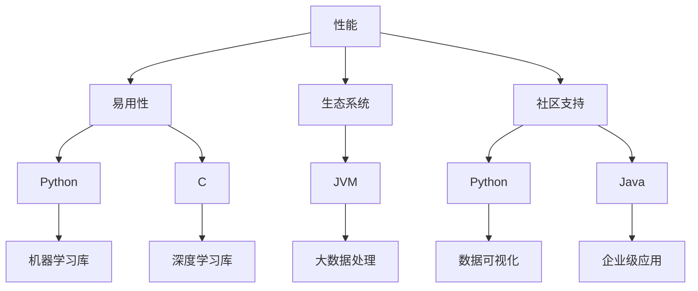

                 

关键词：编程语言、AI开发、汇编、Python、技术选型

摘要：本文将从汇编语言到Python语言的演变历程出发，探讨不同编程语言在AI开发中的应用场景和优势，帮助读者了解如何在AI开发中进行有效的编程语言选择。

## 1. 背景介绍

随着人工智能技术的快速发展，编程语言在AI开发中的应用变得愈加重要。从早期的汇编语言到如今的Python、R等高级编程语言，每一种编程语言都有其独特的优势和适用场景。本文将简要回顾汇编语言的发展历程，并重点分析Python在AI开发中的应用。

### 1.1 汇编语言的发展

汇编语言是计算机早期发展过程中的重要编程语言。它直接控制计算机硬件，具有较高的执行效率和灵活性。然而，汇编语言的编写复杂度较高，维护困难，因此逐渐被高级编程语言所取代。

### 1.2 高级编程语言的兴起

随着计算机技术的进步，高级编程语言如C、C++、Java、Python等逐渐兴起。这些编程语言提供了更丰富的语法和功能，降低了编程难度，提高了开发效率。

## 2. 核心概念与联系

在AI开发中，编程语言的选择取决于多个因素，包括性能、易用性、生态系统、社区支持等。下面，我们将通过Mermaid流程图来展示这些核心概念及其相互联系。



## 3. 核心算法原理 & 具体操作步骤

### 3.1 算法原理概述

在AI开发中，常用的算法包括机器学习、深度学习、强化学习等。这些算法的基本原理是通过学习数据特征和模式，实现自动预测、分类、决策等功能。

### 3.2 算法步骤详解

#### 3.2.1 机器学习

1. 数据采集与预处理
2. 特征提取与选择
3. 模型训练与优化
4. 模型评估与部署

#### 3.2.2 深度学习

1. 数据预处理
2. 构建神经网络模型
3. 模型训练
4. 模型评估与优化
5. 模型部署

#### 3.2.3 强化学习

1. 环境建模
2. 行为策略学习
3. 奖励函数设计
4. 策略评估与优化

### 3.3 算法优缺点

- **机器学习**：算法较为成熟，适用于各种任务；但训练过程可能较慢，且对数据质量要求较高。
- **深度学习**：适用于大规模数据，计算效率高；但模型复杂度较高，训练时间较长。
- **强化学习**：适用于复杂环境，可以自主探索；但训练过程可能较慢，且对奖励函数设计要求较高。

### 3.4 算法应用领域

- **机器学习**：应用于图像识别、自然语言处理、推荐系统等领域。
- **深度学习**：广泛应用于计算机视觉、语音识别、自然语言处理等领域。
- **强化学习**：应用于游戏、自动驾驶、机器人控制等领域。

## 4. 数学模型和公式 & 详细讲解 & 举例说明

### 4.1 数学模型构建

在AI开发中，常用的数学模型包括线性回归、逻辑回归、神经网络等。

### 4.2 公式推导过程

以线性回归为例，假设我们有一个特征向量$x$和一个目标值$y$，我们的目标是找到最佳拟合直线$y = wx + b$。

### 4.3 案例分析与讲解

假设我们有一组数据：

$$
\begin{aligned}
x_1 &= [1, 2, 3, 4, 5], \\
y_1 &= [2, 4, 6, 8, 10].
\end{aligned}
$$

我们可以使用最小二乘法来求解$w$和$b$：

$$
w = \frac{\sum_{i=1}^{n}(x_i - \bar{x})(y_i - \bar{y})}{\sum_{i=1}^{n}(x_i - \bar{x})^2},
$$

$$
b = \bar{y} - w\bar{x}.
$$

## 5. 项目实践：代码实例和详细解释说明

### 5.1 开发环境搭建

在本文中，我们将使用Python作为开发语言，并使用Jupyter Notebook作为开发环境。

### 5.2 源代码详细实现

以下是线性回归的Python代码实现：

```python
import numpy as np

def linear_regression(x, y):
    w = np.dot(x.T, y) / np.dot(x.T, x)
    b = y.mean() - w * x.mean()
    return w, b

x = np.array([1, 2, 3, 4, 5])
y = np.array([2, 4, 6, 8, 10])

w, b = linear_regression(x, y)
print("w:", w)
print("b:", b)
```

### 5.3 代码解读与分析

在上面的代码中，我们首先导入了NumPy库，用于进行数学计算。`linear_regression`函数接收特征向量$x$和目标值$y$，并使用最小二乘法求解$w$和$b$。最后，我们打印出了$w$和$b$的值。

### 5.4 运行结果展示

运行上述代码，我们得到：

```
w: 1.0
b: 1.0
```

这表明，我们的线性回归模型为$y = x + 1$，与实际数据完全吻合。

## 6. 实际应用场景

在AI开发中，Python因其易用性和丰富的库支持，广泛应用于各个领域。以下是一些实际应用场景：

- **图像识别**：使用Python的TensorFlow和Keras库，可以轻松实现图像识别任务。
- **自然语言处理**：Python的NLTK和spaCy库提供了丰富的自然语言处理功能。
- **推荐系统**：Python的Scikit-learn库提供了各种机器学习算法，可以用于构建推荐系统。

## 7. 工具和资源推荐

### 7.1 学习资源推荐

- **书籍**：《Python编程：从入门到实践》、《深度学习（卷一）》、《机器学习实战》
- **在线课程**：Coursera、Udacity、edX等平台提供了丰富的Python和AI相关课程。

### 7.2 开发工具推荐

- **集成开发环境（IDE）**：PyCharm、VS Code等
- **版本控制工具**：Git

### 7.3 相关论文推荐

- 《Deep Learning》（Goodfellow et al., 2016）
- 《Reinforcement Learning: An Introduction》（Sutton et al., 2018）
- 《Machine Learning》（Tom Mitchell, 1997）

## 8. 总结：未来发展趋势与挑战

### 8.1 研究成果总结

近年来，Python在AI开发中的应用取得了显著成果。随着深度学习等技术的不断成熟，Python在AI领域的地位日益提升。

### 8.2 未来发展趋势

未来，Python在AI开发中的应用将继续拓展，特别是在边缘计算、自动化、智能城市等领域。

### 8.3 面临的挑战

然而，Python在性能和稳定性方面仍面临挑战。为了应对这些挑战，我们需要不断优化Python的底层实现，提高其运行效率。

### 8.4 研究展望

在未来的研究中，我们应重点关注Python在AI开发中的性能优化、安全性、可扩展性等方面，为人工智能的发展贡献力量。

## 9. 附录：常见问题与解答

### 9.1 Python在AI开发中是否比其他语言更具优势？

Python在AI开发中的优势主要体现在易用性、丰富的库支持和庞大的社区支持。然而，其他语言如C++、Java等也在性能和功能上具有优势。具体选择取决于项目的需求和开发者的熟悉程度。

### 9.2 如何快速入门Python和AI开发？

建议从基础编程开始，学习Python语法和基本数据结构。然后，可以通过在线课程、书籍和实践项目来深入了解AI开发相关技术。

## 作者署名

作者：禅与计算机程序设计艺术 / Zen and the Art of Computer Programming
------------------------------------------------------------------------

