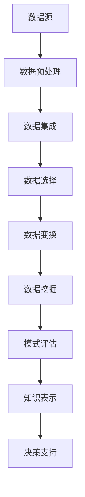

                 

关键词：海量信息处理、知识发现、大数据分析、人工智能、算法原理、数学模型、应用场景、未来展望

> 摘要：随着信息爆炸时代的到来，如何从海量数据中高效地提取知识成为一个关键问题。本文将探讨知识发现引擎的作用，阐述其核心概念、算法原理、数学模型及其在实际应用场景中的表现，并提出未来的发展趋势与挑战。

## 1. 背景介绍

在当今信息社会中，数据量呈爆炸式增长，这使得数据挖掘、机器学习和人工智能等领域的研究变得尤为重要。然而，面对如此庞大的数据集，如何从中挖掘出有价值的信息，实现从数据到知识的转换，成为一个亟待解决的难题。知识发现引擎（Knowledge Discovery Engine，简称KDE）作为一种新兴的技术手段，致力于从海量数据中提炼知识，提供决策支持和智能化服务。

### 1.1 知识发现的概念

知识发现（Knowledge Discovery in Databases，简称KDD）是指从大量数据中通过自动的或半自动的过程，识别出未知的、有价值的模式，并将其转换为知识的过程。知识发现通常包括以下步骤：数据预处理、数据集成、数据选择、数据变换、数据挖掘、模式评估和知识的表示。

### 1.2 知识发现引擎的作用

知识发现引擎在KDD过程中扮演着核心角色，其主要作用如下：

1. **提高数据挖掘效率**：知识发现引擎能够自动化地执行KDD的各个步骤，显著提高数据挖掘的效率。
2. **增强数据理解**：通过对数据的深入分析和模式识别，知识发现引擎可以帮助用户更好地理解数据背后的含义。
3. **支持决策制定**：知识发现引擎提炼出的知识可以直接应用于业务决策中，提高决策的准确性和效率。
4. **推动智能应用**：知识发现引擎为人工智能和机器学习提供了丰富的数据资源，促进了智能应用的不断发展。

## 2. 核心概念与联系

在深入探讨知识发现引擎之前，有必要理解其核心概念和相互之间的联系。

### 2.1 数据挖掘

数据挖掘（Data Mining）是指从大量数据中自动发现具有价值知识的过程。数据挖掘通常包括分类、聚类、关联规则挖掘、异常检测等方法。

### 2.2 机器学习

机器学习（Machine Learning）是一种通过算法让计算机从数据中学习并做出决策的技术。机器学习算法广泛应用于数据挖掘、预测分析和自然语言处理等领域。

### 2.3 人工智能

人工智能（Artificial Intelligence，简称AI）是指使计算机具有人类智能的技术。人工智能包括机器学习、深度学习、自然语言处理、计算机视觉等多个子领域。

### 2.4 数据库系统

数据库系统（Database System）是用于存储、管理和检索数据的系统。知识发现引擎通常基于数据库系统进行数据预处理和挖掘。

### 2.5 Mermaid 流程图

以下是知识发现引擎的核心概念和架构的Mermaid流程图：



## 3. 核心算法原理 & 具体操作步骤

### 3.1 算法原理概述

知识发现引擎通常基于以下核心算法：

1. **分类算法**：用于将数据划分为不同的类别。常见的分类算法包括决策树、支持向量机（SVM）和神经网络等。
2. **聚类算法**：用于将数据分为不同的簇。常见的聚类算法包括K-均值、层次聚类和DBSCAN等。
3. **关联规则挖掘**：用于发现数据之间的关联关系。常见的算法包括Apriori算法和FP-Growth算法等。
4. **异常检测**：用于识别数据中的异常值或异常模式。常见的算法包括孤立森林和K-均值等。

### 3.2 算法步骤详解

1. **数据预处理**：对原始数据进行清洗、归一化、缺失值填充等操作，使其符合数据挖掘算法的要求。
2. **数据集成**：将来自不同数据源的数据整合为一个统一的数据集，提高数据挖掘的效率和效果。
3. **数据选择**：根据实际需求，从原始数据中提取出有用的数据，减少数据挖掘的复杂度和计算量。
4. **数据变换**：对数据进行变换，包括数据转换、特征提取和特征选择等，提高数据挖掘的性能和效果。
5. **数据挖掘**：根据预定的算法，对数据进行挖掘，提取出有用的模式和知识。
6. **模式评估**：对挖掘出的模式进行评估，判断其是否具有实际应用价值。
7. **知识表示**：将挖掘出的模式转化为易于理解的知识表示形式，如决策树、规则集等。
8. **决策支持**：将知识表示应用于实际业务中，为决策者提供决策支持。

### 3.3 算法优缺点

- **分类算法**：
  - 优点：分类算法具有较好的可解释性，适用于分类任务。
  - 缺点：在处理高维数据和大规模数据时，分类算法的性能可能会下降。

- **聚类算法**：
  - 优点：聚类算法无需事先定义类别，适用于无监督学习任务。
  - 缺点：聚类算法的结果可能依赖于初始参数的选择，且聚类结果的可解释性较差。

- **关联规则挖掘**：
  - 优点：关联规则挖掘可以揭示数据之间的内在关系，适用于市场 basket分析等应用场景。
  - 缺点：关联规则挖掘算法通常会产生大量的规则，需要进一步筛选和评估。

- **异常检测**：
  - 优点：异常检测可以帮助识别数据中的异常值或异常模式，适用于安全监控等应用场景。
  - 缺点：异常检测算法通常需要大量的训练数据，且在处理高维数据时性能可能较差。

### 3.4 算法应用领域

知识发现引擎的应用领域非常广泛，包括但不限于：

1. **金融领域**：用于风险评估、欺诈检测、投资决策等。
2. **医疗领域**：用于疾病预测、诊断辅助、个性化治疗等。
3. **零售领域**：用于销售预测、客户行为分析、供应链优化等。
4. **教育领域**：用于学生成绩分析、学习效果评估、教育资源分配等。
5. **社交网络**：用于推荐系统、用户行为分析、社区挖掘等。

## 4. 数学模型和公式 & 详细讲解 & 举例说明

### 4.1 数学模型构建

知识发现引擎中的数学模型通常包括以下几个方面：

1. **分类模型**：如决策树、支持向量机（SVM）和神经网络等。
2. **聚类模型**：如K-均值、层次聚类和DBSCAN等。
3. **关联规则模型**：如Apriori算法和FP-Growth算法等。
4. **异常检测模型**：如孤立森林和K-均值等。

### 4.2 公式推导过程

以下以决策树为例，简要介绍其数学模型和公式推导过程。

#### 4.2.1 决策树模型

决策树是一种树形结构，每个内部节点表示一个特征，每个分支表示该特征的不同取值，每个叶子节点表示一个类。决策树的数学模型可以表示为：

$$
T = \{N, L\}
$$

其中，\(N\) 表示内部节点集，\(L\) 表示叶子节点集。

#### 4.2.2 公式推导

决策树的损失函数可以表示为：

$$
L(T) = \sum_{i=1}^{n} l(y_i, T(x_i))
$$

其中，\(y_i\) 表示第 \(i\) 个样本的标签，\(x_i\) 表示第 \(i\) 个样本的特征向量，\(l(\cdot, \cdot)\) 表示损失函数。

常见的损失函数包括：

1. **均方误差（MSE）**：
$$
l(y, \hat{y}) = \frac{1}{2}(y - \hat{y})^2
$$

2. **交叉熵（CE）**：
$$
l(y, \hat{y}) = -y \log \hat{y} - (1 - y) \log (1 - \hat{y})
$$

其中，\(\hat{y}\) 表示预测结果。

#### 4.2.3 案例分析与讲解

假设我们有一个包含100个样本的决策树模型，其中50个样本为正类，50个样本为负类。现在我们要对该模型进行评估。

1. **训练数据**：

$$
T = \{N_1, N_2, \ldots, N_n\}, \quad y_i \in \{-1, 1\}
$$

2. **测试数据**：

$$
x_{test} = \{x_{test1}, x_{test2}, \ldots, x_{testm}\}, \quad y_{test} \in \{-1, 1\}
$$

3. **损失函数**：

$$
L(T) = \sum_{i=1}^{n} l(y_i, T(x_i))
$$

4. **评估指标**：

- **准确率**：
$$
\text{Accuracy} = \frac{\sum_{i=1}^{n} \mathbb{1}_{y_i = T(x_i)}}{n}
$$

- **召回率**：
$$
\text{Recall} = \frac{\sum_{i=1}^{n} \mathbb{1}_{y_i = 1, T(x_i) = 1}}{n}
$$

- **精确率**：
$$
\text{Precision} = \frac{\sum_{i=1}^{n} \mathbb{1}_{y_i = 1, T(x_i) = 1}}{\sum_{i=1}^{n} \mathbb{1}_{T(x_i) = 1}}
$$

- **F1值**：
$$
F1 = 2 \cdot \frac{\text{Precision} \cdot \text{Recall}}{\text{Precision} + \text{Recall}}
$$

通过这些评估指标，我们可以对决策树模型的性能进行全面的评估。

## 5. 项目实践：代码实例和详细解释说明

在本节中，我们将通过一个简单的Python代码实例，展示如何使用知识发现引擎进行数据挖掘和模式识别。假设我们有一个包含客户购买行为的CSV文件，我们需要从中提取出有用的信息，以帮助零售商进行营销策略的制定。

### 5.1 开发环境搭建

在开始编写代码之前，我们需要安装以下Python库：

1. **Pandas**：用于数据预处理和操作。
2. **NumPy**：用于数值计算。
3. **Scikit-learn**：用于数据挖掘和机器学习。
4. **Matplotlib**：用于数据可视化。

安装这些库可以使用以下命令：

```bash
pip install pandas numpy scikit-learn matplotlib
```

### 5.2 源代码详细实现

以下是一个简单的Python代码实例，用于进行关联规则挖掘：

```python
import pandas as pd
from mlxtend.frequent_patterns import apriori
from mlxtend.frequent_patterns import association_rules
import matplotlib.pyplot as plt

# 读取数据
data = pd.read_csv('customer_transactions.csv')

# 数据预处理
data['transaction_id'] = data.groupby(['customer_id'])['transaction_id'].transform('count')
data = data[data['transaction_id'] > 1]

# 转换为二进制数据集
basket = (data[data['transaction_id'] > 1]
          .groupby(['customer_id', 'product_id'])
          .size()
          .reset_index(name='count'))

# 应用Apriori算法进行频繁项集挖掘
frequent_itemsets = apriori(basket, min_support=0.05, use_colnames=True)

# 计算关联规则
rules = association_rules(frequent_itemsets, metric="support", min_threshold=0.05)

# 可视化关联规则
plt.scatter(rules['support'], rules['confidence'])
plt.xlabel('Support')
plt.ylabel('Confidence')
plt.title('Association Rules')
plt.show()
```

### 5.3 代码解读与分析

1. **数据读取与预处理**：

   ```python
   data = pd.read_csv('customer_transactions.csv')
   data['transaction_id'] = data.groupby(['customer_id'])['transaction_id'].transform('count')
   data = data[data['transaction_id'] > 1]
   ```

   代码首先从CSV文件中读取客户购买行为数据，然后对数据进行预处理，包括计算每个客户的交易次数，并筛选出交易次数超过一次的数据。

2. **二进制数据集转换**：

   ```python
   basket = (data[data['transaction_id'] > 1]
            .groupby(['customer_id', 'product_id'])
            .size()
            .reset_index(name='count'))
   ```

   代码将预处理后的数据转换为二进制数据集，即每个客户和产品之间的购买关系。

3. **频繁项集挖掘**：

   ```python
   frequent_itemsets = apriori(basket, min_support=0.05, use_colnames=True)
   ```

   代码使用Apriori算法对二进制数据集进行频繁项集挖掘，其中`min_support`参数设置为一个阈值，表示最小支持度。

4. **关联规则计算**：

   ```python
   rules = association_rules(frequent_itemsets, metric="support", min_threshold=0.05)
   ```

   代码计算关联规则，其中`min_threshold`参数设置为一个阈值，表示最小置信度。

5. **可视化关联规则**：

   ```python
   plt.scatter(rules['support'], rules['confidence'])
   plt.xlabel('Support')
   plt.ylabel('Confidence')
   plt.title('Association Rules')
   plt.show()
   ```

   代码将计算出的关联规则进行可视化，以便用户更直观地理解数据中的关联关系。

### 5.4 运行结果展示

运行上述代码后，我们将得到一个散点图，其中每个点代表一条关联规则，横坐标表示支持度，纵坐标表示置信度。通过观察散点图，我们可以发现一些具有较高支持度和置信度的关联规则，这些规则可以帮助零售商制定更有效的营销策略。

## 6. 实际应用场景

知识发现引擎在各个领域的实际应用场景如下：

### 6.1 金融领域

- **风险评估**：知识发现引擎可以帮助金融机构识别高风险客户，降低不良贷款率。
- **欺诈检测**：通过关联规则挖掘和异常检测，知识发现引擎可以有效地识别和防范金融欺诈行为。
- **投资决策**：知识发现引擎可以从大量的金融数据中提取出有用的信息，为投资者提供决策支持。

### 6.2 医疗领域

- **疾病预测**：知识发现引擎可以从患者的电子健康记录中挖掘出疾病预测模型，提高疾病诊断的准确性。
- **个性化治疗**：通过分析患者的基因信息和病史，知识发现引擎可以制定个性化的治疗方案。
- **药物研发**：知识发现引擎可以帮助药企发现潜在的药物靶点和作用机制，加速新药研发过程。

### 6.3 零售领域

- **销售预测**：知识发现引擎可以预测未来的销售趋势，为零售商制定库存管理策略提供支持。
- **客户行为分析**：通过分析客户的购买行为和偏好，知识发现引擎可以提供个性化的推荐服务。
- **供应链优化**：知识发现引擎可以帮助零售商优化供应链，提高物流效率和降低成本。

### 6.4 教育领域

- **学生成绩分析**：知识发现引擎可以帮助教育机构分析学生的成绩数据，识别学习困难的学生并提供针对性的辅导。
- **学习效果评估**：通过分析学生的学习行为和学习成果，知识发现引擎可以评估教学效果，为教育改革提供依据。
- **教育资源分配**：知识发现引擎可以帮助教育部门优化教育资源分配，提高教育公平性。

### 6.5 社交网络

- **推荐系统**：知识发现引擎可以从社交网络数据中挖掘出用户的兴趣和偏好，为推荐系统提供支持。
- **用户行为分析**：通过分析用户的社交行为和互动关系，知识发现引擎可以识别出社交网络中的潜在社区和影响力人物。
- **社区挖掘**：知识发现引擎可以帮助社交网络平台发现和构建用户社区，提高用户黏性和活跃度。

## 7. 工具和资源推荐

### 7.1 学习资源推荐

1. **书籍**：
   - 《数据挖掘：概念与技术》（作者：王珊、曾庆鑫）
   - 《机器学习》（作者：周志华）
   - 《深度学习》（作者：Ian Goodfellow、Yoshua Bengio、Aaron Courville）

2. **在线课程**：
   - Coursera上的《机器学习》课程
   - edX上的《数据科学基础》课程
   - Udacity的《深度学习纳米学位》课程

### 7.2 开发工具推荐

1. **Python库**：
   - **Pandas**：用于数据预处理和操作。
   - **NumPy**：用于数值计算。
   - **Scikit-learn**：用于数据挖掘和机器学习。
   - **Matplotlib**：用于数据可视化。

2. **数据集**：
   - **UCI机器学习数据库**：提供各种领域的标准数据集。
   - **Kaggle**：提供各种领域的竞赛数据集。

### 7.3 相关论文推荐

1. **知识发现领域**：
   - "Knowledge Discovery in Databases: An Overview"（作者：Jiawei Han、Micheline Kamber、Jian Pei）
   - "Efficient Computation of Frequent Itemsets"（作者：Gopal Pandit、Bhuvan Arora）

2. **机器学习领域**：
   - "A Comprehensive Survey on Machine Learning for Time Series Modeling"（作者：Chen et al.）
   - "Deep Learning for Natural Language Processing"（作者：Ding et al.）

3. **深度学习领域**：
   - "Deep Learning"（作者：Ian Goodfellow、Yoshua Bengio、Aaron Courville）
   - "Convolutional Neural Networks for Visual Recognition"（作者：Karen Simonyan、Andrew Zisserman）

## 8. 总结：未来发展趋势与挑战

### 8.1 研究成果总结

知识发现引擎作为一种新兴的技术手段，已经在各个领域取得了显著的研究成果。例如，在金融领域，知识发现引擎有效地降低了不良贷款率和金融欺诈率；在医疗领域，知识发现引擎帮助医生制定个性化的治疗方案，提高了疾病诊断的准确性；在零售领域，知识发现引擎优化了销售预测和客户行为分析，提高了零售商的运营效率。

### 8.2 未来发展趋势

1. **多模态数据挖掘**：随着传感器技术和物联网的发展，越来越多的多模态数据（如文本、图像、音频等）被引入知识发现引擎，未来的发展趋势将是多模态数据挖掘方法的创新和发展。
2. **实时知识发现**：在实时数据处理和实时决策支持的需求下，实时知识发现技术将成为未来的研究热点。
3. **可解释性提升**：尽管当前的知识发现引擎在性能和效果上取得了很大的进步，但其可解释性仍然较低。未来的研究将更加注重提升知识发现引擎的可解释性，使其更容易被用户理解和接受。
4. **人工智能融合**：随着人工智能技术的不断发展，知识发现引擎将更加智能化，具备自我学习和自我优化的能力。

### 8.3 面临的挑战

1. **数据隐私**：在数据挖掘和知识发现过程中，如何保护用户隐私成为一个重要的挑战。
2. **数据质量**：数据质量对知识发现的效果具有重要影响，如何处理和优化数据质量是当前的一个难题。
3. **算法复杂度**：随着数据量的增加，知识发现算法的复杂度也会显著提高，如何降低算法复杂度是一个亟待解决的问题。
4. **跨领域应用**：尽管知识发现引擎在各个领域取得了显著的研究成果，但跨领域应用仍然面临很多挑战，如不同领域数据格式的不一致、数据维度差异等。

### 8.4 研究展望

知识发现引擎作为一种重要的技术手段，将在未来继续发挥重要作用。未来的研究应重点关注多模态数据挖掘、实时知识发现、可解释性提升和人工智能融合等方面，以推动知识发现技术的不断创新和发展。

## 9. 附录：常见问题与解答

### 9.1 什么是知识发现？

知识发现（Knowledge Discovery in Databases，简称KDD）是指从大量数据中通过自动的或半自动的过程，识别出未知的、有价值的模式，并将其转换为知识的过程。知识发现通常包括以下步骤：数据预处理、数据集成、数据选择、数据变换、数据挖掘、模式评估和知识的表示。

### 9.2 知识发现引擎有什么作用？

知识发现引擎在KDD过程中扮演着核心角色，其主要作用如下：

1. **提高数据挖掘效率**：知识发现引擎能够自动化地执行KDD的各个步骤，显著提高数据挖掘的效率。
2. **增强数据理解**：通过对数据的深入分析和模式识别，知识发现引擎可以帮助用户更好地理解数据背后的含义。
3. **支持决策制定**：知识发现引擎提炼出的知识可以直接应用于业务决策中，提高决策的准确性和效率。
4. **推动智能应用**：知识发现引擎为人工智能和机器学习提供了丰富的数据资源，促进了智能应用的不断发展。

### 9.3 知识发现引擎有哪些核心算法？

知识发现引擎的核心算法包括分类算法、聚类算法、关联规则挖掘和异常检测等。常见的分类算法包括决策树、支持向量机（SVM）和神经网络等；常见的聚类算法包括K-均值、层次聚类和DBSCAN等；常见的关联规则挖掘算法包括Apriori算法和FP-Growth算法等；常见的异常检测算法包括孤立森林和K-均值等。

### 9.4 知识发现引擎在哪些领域有应用？

知识发现引擎在金融、医疗、零售、教育、社交网络等众多领域有广泛的应用。例如，在金融领域，知识发现引擎可以用于风险评估、欺诈检测和投资决策；在医疗领域，知识发现引擎可以用于疾病预测、诊断辅助和个性化治疗；在零售领域，知识发现引擎可以用于销售预测、客户行为分析和供应链优化；在教育领域，知识发现引擎可以用于学生成绩分析、学习效果评估和
```perl
```

