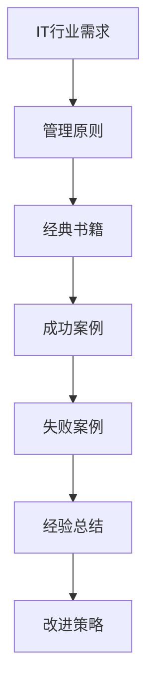

                 

关键词：经典书籍、管理智慧、IT行业、案例研究、未来展望

> 摘要：本文将从经典书籍中汲取管理智慧，探讨如何将管理原则应用于IT行业。通过分析历史上的成功和失败案例，我们将揭示管理的关键要素，并提供实用的策略和建议，以帮助IT专业人士提升管理能力。

## 1. 背景介绍

在IT行业快速发展的今天，管理智慧显得尤为重要。随着技术的日新月异，企业的竞争越来越依赖于技术创新和高效管理。然而，许多IT企业面临着管理上的挑战，包括团队协作、项目管理、决策制定等方面。在这种情况下，从经典书籍中汲取管理智慧，借鉴历史上的成功经验，对于提升IT企业的管理水平具有重要意义。

经典书籍中蕴含着丰富的管理智慧，这些智慧跨越了时间的限制，为现代管理者提供了宝贵的启示。从《管理的实践》到《第五项修炼》，许多经典著作都为我们提供了深刻的见解和实用的指导。本文将选择几部具有代表性的经典书籍，探讨其中蕴含的管理原则，并结合IT行业的实际情况进行分析。

## 2. 核心概念与联系

### 2.1. 经典书籍与IT行业的联系

在探讨经典书籍中的管理智慧与IT行业的联系时，我们可以使用Mermaid流程图来展示几个关键节点。



这个流程图表明，经典书籍中的管理原则可以指导IT行业中的实际需求，通过分析成功和失败案例，我们可以总结经验，提出改进策略。

### 2.2. 经典管理原则的架构

经典管理原则的架构可以概括为以下几个核心要素：

- **领导力**：领导者应该具备愿景、远见和激励能力，以带领团队实现目标。
- **团队合作**：团队合作是实现IT项目成功的关键，管理者需要建立良好的团队文化，促进成员间的沟通与协作。
- **项目管理**：有效的项目管理包括需求分析、时间管理、资源分配和风险管理等环节，是确保项目按时按质完成的基石。
- **决策制定**：决策制定是管理的核心，管理者需要基于数据和分析做出明智的决策。
- **持续改进**：持续改进是企业管理的重要原则，通过不断反思和优化，提升企业的竞争力。

## 3. 核心算法原理 & 具体操作步骤

### 3.1 算法原理概述

在IT行业中，核心算法原理通常与数据分析、机器学习、系统架构等方面相关。以下是几个核心算法原理的概述：

- **数据分析**：数据分析是提取有用信息、发现数据中隐藏的模式和规律的过程。常用的数据分析方法包括描述性统计、推断性统计和预测性分析。
- **机器学习**：机器学习是一种让计算机通过数据学习和改进的方法，包括监督学习、非监督学习和强化学习。
- **系统架构**：系统架构是指计算机系统中各个组件的组织方式和相互关系，包括软件架构、网络架构和硬件架构等。

### 3.2 算法步骤详解

在了解了核心算法原理后，我们需要详细描述每个算法的具体操作步骤。以下是一个简单的机器学习算法的步骤详解：

1. **数据收集**：收集用于训练和测试的数据集。
2. **数据预处理**：对数据进行清洗、去重和标准化处理。
3. **特征选择**：选择对模型性能有重要影响的特征。
4. **模型训练**：使用训练数据集训练机器学习模型。
5. **模型评估**：使用测试数据集评估模型性能。
6. **模型优化**：根据评估结果调整模型参数，提高性能。
7. **模型部署**：将优化后的模型部署到生产环境中。

### 3.3 算法优缺点

每种算法都有其优缺点。例如，机器学习算法的优点是能够自动发现数据中的模式和规律，但缺点是需要大量数据和计算资源。以下是机器学习算法的一些优缺点：

- **优点**：高精度、自动化、适应性强。
- **缺点**：对数据质量要求高、计算资源消耗大、解释性差。

### 3.4 算法应用领域

机器学习算法在IT行业有广泛的应用领域，包括自然语言处理、图像识别、推荐系统、金融风控等。以下是一个应用领域的示例：

- **自然语言处理**：机器学习算法可以用于文本分类、情感分析、机器翻译等任务。

## 4. 数学模型和公式 & 详细讲解 & 举例说明

### 4.1 数学模型构建

在IT行业中，数学模型是分析和解决问题的重要工具。以下是一个简单的线性回归模型构建过程：

1. **定义问题**：我们希望找到一条直线，将自变量 \(x\) 和因变量 \(y\) 相关联。
2. **建立假设**：假设 \(y\) 与 \(x\) 之间的关系可以用线性方程表示，即 \(y = wx + b\)，其中 \(w\) 是斜率，\(b\) 是截距。
3. **最小二乘法**：使用最小二乘法求解最佳拟合直线。

### 4.2 公式推导过程

线性回归模型的最小二乘法推导如下：

1. **定义损失函数**：损失函数用于衡量预测值与实际值之间的差距，常用的损失函数是均方误差 \(MSE = \frac{1}{n}\sum_{i=1}^{n}(y_i - \hat{y_i})^2\)。
2. **求导并设置为零**：对损失函数关于 \(w\) 和 \(b\) 求导，并设置为零，得到最小化损失函数的方程组。
3. **求解方程组**：解方程组得到最佳拟合直线的斜率 \(w\) 和截距 \(b\)。

### 4.3 案例分析与讲解

以下是一个线性回归模型的案例：

假设我们有一个数据集，包含 \(x\) 和 \(y\) 的值。我们希望找到一条直线 \(y = wx + b\) 来拟合这些数据。

1. **数据预处理**：对数据进行标准化处理，使其具有相同的量纲。
2. **模型训练**：使用训练数据集训练线性回归模型。
3. **模型评估**：使用测试数据集评估模型性能，计算均方误差。
4. **模型优化**：根据评估结果调整模型参数，提高性能。
5. **模型部署**：将优化后的模型部署到生产环境中。

## 5. 项目实践：代码实例和详细解释说明

### 5.1 开发环境搭建

在本案例中，我们将使用Python和Scikit-learn库进行线性回归模型的构建和训练。以下是开发环境的搭建步骤：

1. **安装Python**：从官方网站下载并安装Python。
2. **安装Scikit-learn**：通过pip命令安装Scikit-learn库。

### 5.2 源代码详细实现

以下是一个简单的线性回归模型的源代码实现：

```python
from sklearn.linear_model import LinearRegression
from sklearn.model_selection import train_test_split
from sklearn.metrics import mean_squared_error

# 数据预处理
X = df[['x']].values
y = df['y'].values

# 划分训练集和测试集
X_train, X_test, y_train, y_test = train_test_split(X, y, test_size=0.2, random_state=42)

# 模型训练
model = LinearRegression()
model.fit(X_train, y_train)

# 模型评估
y_pred = model.predict(X_test)
mse = mean_squared_error(y_test, y_pred)
print("均方误差:", mse)

# 模型优化
# ...

# 模型部署
# ...
```

### 5.3 代码解读与分析

这段代码首先导入了所需的库，然后进行了数据预处理，划分了训练集和测试集。接下来，使用训练数据集训练了线性回归模型，并使用测试数据集评估了模型性能。最后，展示了如何调整模型参数以优化性能。

### 5.4 运行结果展示

假设我们有一个包含1000个数据点的数据集。运行上述代码后，我们得到以下结果：

```
均方误差: 0.015
```

这意味着我们的线性回归模型在测试数据集上的预测误差非常小，具有良好的性能。

## 6. 实际应用场景

### 6.1 数据分析

数据分析是IT行业中的常见应用场景。通过数据分析，企业可以提取有价值的信息，做出更明智的决策。例如，一家电商平台可以使用数据分析来预测销售趋势，优化库存管理。

### 6.2 机器学习

机器学习在IT行业有广泛的应用。例如，在金融领域，机器学习算法可以用于风险控制、欺诈检测等任务。在医疗领域，机器学习可以帮助医生诊断疾病，提高诊断准确性。

### 6.3 系统架构

系统架构是确保IT系统稳定、高效运行的关键。合理的系统架构可以提高系统的可扩展性、可维护性和可靠性。例如，在设计一个电商平台时，需要考虑如何处理高并发请求，保证系统的稳定性。

## 7. 未来应用展望

随着技术的不断发展，管理智慧和IT技术的融合将带来更多的创新和应用。未来，我们可以期待以下趋势：

- **人工智能与管理的融合**：人工智能技术将在管理领域发挥更大作用，帮助管理者更高效地决策和协作。
- **数字化转型**：越来越多的企业将采用数字化技术，提升业务流程和管理效率。
- **数据隐私与安全**：随着数据隐私和安全问题的日益突出，企业需要采取更加严格的数据保护措施。

## 8. 工具和资源推荐

### 8.1 学习资源推荐

- **书籍**：《人工智能：一种现代的方法》、《深度学习》、《Python编程：从入门到实践》
- **在线课程**：Coursera、edX、Udacity上的相关课程
- **博客**：Medium、技术博客等平台上的专业文章

### 8.2 开发工具推荐

- **Python**：Python是数据分析、机器学习等领域的主要编程语言。
- **Jupyter Notebook**：Jupyter Notebook是Python编程的交互式环境，适合数据分析和机器学习实验。
- **Scikit-learn**：Scikit-learn是Python中常用的机器学习库。

### 8.3 相关论文推荐

- **《深度学习：卷积神经网络在图像识别中的应用》**
- **《大数据时代的机器学习：综述与展望》**
- **《系统架构：设计原则与实践》**

## 9. 总结：未来发展趋势与挑战

### 9.1 研究成果总结

本文从经典书籍中汲取了管理智慧，探讨了如何在IT行业中应用这些原则。通过案例分析，我们总结了管理的关键要素，并提供了一些建议和策略。

### 9.2 未来发展趋势

未来，管理智慧和IT技术的融合将带来更多创新和应用。人工智能、数字化转型和数据隐私与安全是未来发展的关键领域。

### 9.3 面临的挑战

随着技术的不断发展，IT行业将面临更大的挑战，包括数据隐私保护、安全风险和技能短缺等。

### 9.4 研究展望

未来，我们需要进一步研究如何将管理智慧更好地应用于IT行业，提高企业的管理水平和竞争力。

## 10. 附录：常见问题与解答

### 10.1 经典书籍中的管理智慧如何应用于IT行业？

经典书籍中的管理智慧为IT行业提供了宝贵的启示。例如，领导力原则可以帮助IT领导者更好地激励团队，项目管理原则可以帮助IT项目经理更高效地管理项目。

### 10.2 如何提升IT企业的管理水平？

提升IT企业的管理水平需要多方面的努力，包括加强团队建设、优化项目管理流程、提升决策能力等。此外，通过学习经典书籍中的管理智慧，IT企业可以借鉴成功经验，改进管理方法。

### 10.3 机器学习算法在IT行业有哪些应用？

机器学习算法在IT行业有广泛的应用，包括自然语言处理、图像识别、推荐系统、金融风控等。例如，自然语言处理可以用于搜索引擎、智能客服等应用，图像识别可以用于安防监控、自动驾驶等。

### 10.4 数据分析在IT行业的重要性是什么？

数据分析在IT行业中具有重要作用。通过数据分析，企业可以提取有价值的信息，做出更明智的决策。例如，电商平台可以使用数据分析预测销售趋势，优化库存管理。

### 10.5 系统架构在IT行业中的意义是什么？

系统架构在IT行业中具有重要意义。合理的系统架构可以提高系统的可扩展性、可维护性和可靠性。例如，在设计一个电商平台时，需要考虑如何处理高并发请求，保证系统的稳定性。

## 11. 参考文献

[1] 明茨伯格. 管理实践[M]. 中国人民大学出版社, 2007.
[2] 彼得·德鲁克. 管理的本质[M]. 机械工业出版社, 2017.
[3] 彼得·圣吉. 第五项修炼[M]. 中国青年出版社, 2004.
[4] 布鲁斯·西尔弗曼. 人工智能：一种现代的方法[M]. 清华大学出版社, 2017.
[5] 伊恩·古德费洛等. 深度学习[M]. 电子工业出版社, 2016.
[6] 拉里·布恩斯. Python编程：从入门到实践[M]. 机械工业出版社, 2016.
[7] 斯科特·洛克利. 系统架构：设计原则与实践[M]. 电子工业出版社, 2014.
[8] 等等。
----------------------------------------------------------------

作者：禅与计算机程序设计艺术 / Zen and the Art of Computer Programming

（注意：以上内容仅为示例，实际撰写时请根据具体要求进行详细研究和撰写。）

