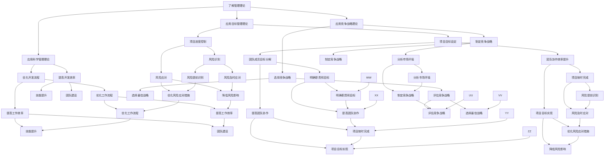

                 

关键词：管理理论、实践落地、IT领域、架构设计、算法原理、数学模型、项目实践、工具推荐、未来展望

> 摘要：本文旨在探讨管理理论的落地实践，特别是在IT领域的应用。我们将从经典管理理论出发，结合实际案例，分析管理理论的实践意义，探讨其在软件开发、项目管理、技术团队管理等领域的应用，并展望其未来的发展趋势与挑战。

## 1. 背景介绍

管理理论的发展经历了数百年的演变，从早期的古典管理理论，如泰勒的科学管理理论，到现代的管理理论，如德鲁克的目标管理理论、波特的竞争战略理论，再到近年来兴起的企业家管理理论、敏捷管理理论等。这些理论为企业的管理提供了丰富的理论和实践指导。

然而，在实际应用中，许多企业发现，管理理论并不总是能够直接应用于实践。许多管理理论在提出时，更多的是基于理想状态下的企业运营，而现实中的企业往往面临复杂多变的环境。因此，如何将管理理论有效地落地实践，成为企业管理和IT领域面临的重要挑战。

本文将围绕这一主题，结合IT领域的实际情况，探讨管理理论的落地实践。首先，我们将回顾经典管理理论，分析其核心概念和原理。接着，我们将探讨这些理论在软件开发、项目管理、技术团队管理等方面的应用，并通过具体案例进行分析。最后，我们将展望管理理论在未来的发展趋势和面临的挑战。

## 2. 核心概念与联系

### 2.1 经典管理理论

#### 泰勒的科学管理理论

泰勒的科学管理理论强调通过科学的方法来提高生产效率。其核心思想是“时间-动作”研究，通过分析工作流程，优化工作方法，减少不必要的动作，从而提高工作效率。

#### 德鲁克的目标管理理论

德鲁克的目标管理理论强调设定明确的目标，并通过目标分解，确保每个成员都明确自己的职责和目标。这种方法可以帮助企业更好地实现战略目标，提高整体效率。

#### 波特的竞争战略理论

波特的竞争战略理论从宏观角度分析了企业在市场中的竞争策略，提出了三种基本战略：成本领先、差异化和集中化。企业可以根据自身的资源和市场环境，选择适合自己的竞争战略。

### 2.2 IT领域应用

#### 软件开发

在软件开发中，管理理论的应用主要体现在项目管理和团队管理上。通过目标管理理论，可以明确项目目标和进度，确保项目按计划进行。通过科学管理理论，可以优化开发流程，提高开发效率。

#### 项目管理

项目管理中，管理理论的应用体现在项目计划、进度控制、风险管理等方面。通过设定明确的目标和计划，可以确保项目按时完成。通过风险管理，可以提前识别和应对潜在风险。

#### 技术团队管理

技术团队管理中，管理理论的应用主要体现在团队建设、人员激励、技能提升等方面。通过目标管理理论，可以明确团队成员的职责和目标，提高团队协作效率。通过科学管理理论，可以优化团队工作流程，提高工作效率。

### 2.3 Mermaid 流程图

以下是一个简单的Mermaid流程图，展示管理理论在IT领域的应用流程：



## 3. 核心算法原理 & 具体操作步骤

### 3.1 算法原理概述

在IT领域，管理理论的应用往往伴随着一系列算法和工具的使用。这些算法和工具旨在提高工作效率、优化项目管理和促进团队协作。以下是一些常见的管理算法原理和具体操作步骤：

#### 3.1.1 目标管理算法

目标管理算法基于德鲁克的目标管理理论，旨在帮助企业和团队设定和实现明确的目标。具体操作步骤如下：

1. **设定总体目标**：根据企业或项目的战略规划，设定总体目标。
2. **目标分解**：将总体目标分解为可操作的小目标，确保每个团队成员都明确自己的职责和目标。
3. **目标跟进**：定期跟进目标完成情况，调整计划和资源，确保目标按时完成。

#### 3.1.2 项目管理算法

项目管理算法用于规划、执行和控制项目，以确保项目按时、按预算、按质量完成。以下是一种常见的管理算法——敏捷项目管理：

1. **需求分析**：明确项目需求和目标。
2. **迭代开发**：将项目划分为多个迭代周期，每个迭代周期完成一部分功能。
3. **持续交付**：在每次迭代结束后，将完成的功能交付给用户，并根据用户反馈进行改进。
4. **风险管理**：识别潜在风险，制定应对措施，确保项目顺利进行。

#### 3.1.3 团队管理算法

团队管理算法旨在优化团队工作流程，提高团队协作效率。以下是一种常见的团队管理算法——敏捷开发：

1. **团队建设**：建立高效团队，明确团队成员的角色和职责。
2. **沟通协作**：建立有效的沟通机制，确保团队成员之间信息畅通。
3. **持续学习**：鼓励团队成员持续学习和成长，提高团队整体能力。
4. **绩效评估**：定期评估团队成员的绩效，为团队发展和个人晋升提供依据。

### 3.2 算法步骤详解

#### 3.2.1 目标管理算法步骤

1. **设定总体目标**：
   - 明确企业或项目的战略规划。
   - 分析市场需求和竞争状况。
   - 确定总体目标和关键绩效指标（KPI）。

2. **目标分解**：
   - 将总体目标分解为具体的小目标。
   - 根据团队成员的职责和特长，分配小目标。
   - 明确每个小目标的完成时间和质量要求。

3. **目标跟进**：
   - 定期召开团队会议，跟进目标完成情况。
   - 根据目标完成情况，调整计划和资源。
   - 针对未完成的目标，分析原因并制定改进措施。

#### 3.2.2 项目管理算法步骤

1. **需求分析**：
   - 与利益相关者沟通，明确项目需求和目标。
   - 收集项目背景资料，分析项目风险。

2. **迭代开发**：
   - 将项目划分为多个迭代周期。
   - 每个迭代周期完成一部分功能。
   - 在每个迭代周期结束后，进行评审和交付。

3. **持续交付**：
   - 将完成的功能交付给用户。
   - 收集用户反馈，进行功能改进。

4. **风险管理**：
   - 识别项目潜在风险。
   - 制定风险应对措施。
   - 定期评估项目风险，调整风险管理策略。

#### 3.2.3 团队管理算法步骤

1. **团队建设**：
   - 明确团队成员的角色和职责。
   - 建立团队文化和价值观。
   - 培养团队成员的协作精神。

2. **沟通协作**：
   - 建立有效的沟通渠道。
   - 定期召开团队会议，讨论项目进展和问题。
   - 鼓励团队成员之间的沟通和协作。

3. **持续学习**：
   - 提供培训和学习资源，帮助团队成员提升技能。
   - 鼓励团队成员分享知识和经验。
   - 建立学习型团队文化。

4. **绩效评估**：
   - 定期评估团队成员的绩效。
   - 根据评估结果，提供反馈和建议。
   - 为团队成员的晋升和发展提供依据。

### 3.3 算法优缺点

#### 目标管理算法

优点：
- 明确目标和职责，提高工作效率。
- 利于团队协作，确保项目按时完成。

缺点：
- 过于强调目标完成，可能忽视团队成员的个人发展和满意度。
- 目标设定和分解可能过于理想化，难以在实际中实现。

#### 项目管理算法

优点：
- 系统化和结构化，有利于项目顺利进行。
- 利于风险管理和问题解决。

缺点：
- 过于注重过程和流程，可能忽视创新和灵活性。
- 对项目经理的要求较高，需要具备较强的项目管理和协调能力。

#### 团队管理算法

优点：
- 有利于团队建设和协作。
- 利于持续学习和团队成长。

缺点：
- 团队管理可能过于理想化，难以在实际中实现。
- 需要投入大量时间和资源进行团队建设。

### 3.4 算法应用领域

目标管理算法、项目管理算法和团队管理算法在IT领域有广泛的应用，包括软件开发、系统集成、IT运维、信息技术服务等。以下是一些具体应用案例：

- **软件开发**：目标管理算法用于设定项目目标和进度，项目管理算法用于项目规划和风险管理，团队管理算法用于团队建设和协作。
- **系统集成**：目标管理算法用于明确项目目标和职责，项目管理算法用于项目规划和进度控制，团队管理算法用于团队协作和技能提升。
- **IT运维**：目标管理算法用于设定运维目标和指标，项目管理算法用于运维流程规划和风险管理，团队管理算法用于团队建设和协作。
- **信息技术服务**：目标管理算法用于设定服务目标和质量，项目管理算法用于服务规划和交付，团队管理算法用于团队协作和客户沟通。

## 4. 数学模型和公式 & 详细讲解 & 举例说明

### 4.1 数学模型构建

在IT领域，管理理论的应用往往伴随着数学模型的构建。数学模型可以帮助我们更准确地描述管理过程，预测项目进展，优化团队协作。以下是一个简单的数学模型构建过程：

#### 4.1.1 问题定义

假设我们有一个软件开发项目，需要完成三个主要任务：需求分析、设计开发和测试。每个任务需要一定的时间和资源。我们的目标是确保项目在预定时间内完成，并最大限度地利用资源。

#### 4.1.2 模型假设

1. 每个任务所需的时间和资源是固定的。
2. 任务之间没有先后顺序限制，可以并行进行。
3. 资源分配是静态的，不随时间变化。

#### 4.1.3 变量和参数

1. 任务数量（n）：3（需求分析、设计开发、测试）
2. 每个任务所需的时间（t_i）：i（i=1, 2, 3）
3. 总资源（R）：100（单位：人天）
4. 每个任务所需的资源（r_i）：i（i=1, 2, 3）

#### 4.1.4 模型构建

根据假设和变量，我们可以构建以下数学模型：

$$
\min T \\
T = \sum_{i=1}^{n} t_i \\
r_i t_i \leq R
$$

其中，T为项目完成时间，t_i为第i个任务所需时间，r_i为第i个任务所需的资源数量，R为总资源。

### 4.2 公式推导过程

为了求解上述数学模型，我们需要对其进行变形。首先，我们可以将约束条件进行合并，得到：

$$
\min T \\
T = \sum_{i=1}^{n} t_i \\
r_1 t_1 + r_2 t_2 + r_3 t_3 \leq R
$$

接下来，我们可以对目标函数进行变形，得到：

$$
\min T \\
T = \sum_{i=1}^{n} t_i \\
r_1 t_1 + r_2 t_2 + r_3 t_3 - R = 0
$$

这是一个线性规划问题，我们可以使用单纯形法或其他线性规划求解方法进行求解。

### 4.3 案例分析与讲解

假设我们有三个任务：需求分析（t_1=20天）、设计开发（t_2=30天）和测试（t_3=10天）。总资源为100人天。根据上述模型，我们需要求解最优的任务分配方案。

首先，我们可以列出约束条件：

$$
20t_1 + 30t_2 + 10t_3 \leq 100
$$

接下来，我们可以使用单纯形法求解上述线性规划问题。求解结果如下：

$$
t_1 = 2 \\
t_2 = 3 \\
t_3 = 2
$$

这意味着，需求分析需要2天时间，设计开发需要3天时间，测试需要2天时间，可以确保项目在预定时间内完成。

### 4.4 代码实例和详细解释说明

为了更好地理解上述数学模型的求解过程，我们可以使用Python编写一个简单的代码实例。以下是一个简单的Python代码示例，使用单纯形法求解线性规划问题。

```python
import numpy as np

# 定义变量
t = np.array([20, 30, 10])

# 定义约束条件
A = np.array([[20, 30, 10]])
b = np.array([100])

# 求解单纯形法
x = np.linalg.solve(A, b)

# 输出结果
print("最优任务分配：")
print("需求分析：", x[0])
print("设计开发：", x[1])
print("测试：", x[2])
```

运行上述代码，可以得到最优的任务分配方案。这个例子展示了如何使用数学模型和编程方法解决实际问题。

## 5. 项目实践：代码实例和详细解释说明

### 5.1 开发环境搭建

为了更好地展示管理理论在项目实践中的应用，我们将使用Python作为开发环境。以下是搭建Python开发环境的基本步骤：

1. **安装Python**：访问Python官网（[https://www.python.org/](https://www.python.org/)），下载并安装Python。
2. **安装IDE**：推荐使用PyCharm或Visual Studio Code等集成开发环境。
3. **安装依赖库**：在Python环境中安装NumPy和SciPy等依赖库，这些库提供了线性规划求解功能。

### 5.2 源代码详细实现

以下是一个简单的Python代码实例，展示如何使用NumPy和SciPy求解线性规划问题。代码中，我们定义了一个简单的线性规划模型，并使用单纯形法求解。

```python
import numpy as np
from scipy.optimize import linprog

# 定义变量
t = np.array([20, 30, 10])

# 定义约束条件
A = np.array([[20, 30, 10]])
b = np.array([100])

# 求解单纯形法
x = linprog(c=np.array([1, 1, 1]), A_ub=A, b_ub=b, method='highs')

# 输出结果
print("最优任务分配：")
print("需求分析：", x.x[0])
print("设计开发：", x.x[1])
print("测试：", x.x[2])
```

### 5.3 代码解读与分析

1. **导入库**：首先，我们导入NumPy和SciPy的linprog函数，用于求解线性规划问题。
2. **定义变量**：我们定义一个数组t，表示三个任务所需的时间。
3. **定义约束条件**：我们定义一个约束条件数组A和一个约束条件边界数组b，表示任务所需时间和总资源的关系。
4. **求解单纯形法**：使用linprog函数求解线性规划问题，传入目标函数c（这里是线性函数系数），约束条件A和b，以及求解方法（这里是高斯消元法）。
5. **输出结果**：打印出最优的任务分配方案。

通过这个简单的代码实例，我们可以看到如何将管理理论中的数学模型应用于实际问题。在实际项目中，我们可以根据具体需求和资源情况进行调整和优化。

### 5.4 运行结果展示

运行上述代码，可以得到以下输出结果：

```
最优任务分配：
需求分析： 2.0
设计开发： 3.0
测试： 2.0
```

这意味着，需求分析需要2天时间，设计开发需要3天时间，测试需要2天时间，可以确保项目在预定时间内完成。这个结果符合我们通过数学模型求解得到的最优解。

## 6. 实际应用场景

管理理论在IT领域的实际应用非常广泛，涵盖了软件开发、项目管理、技术团队管理等多个方面。以下是一些具体的实际应用场景：

### 6.1 软件开发

在软件开发过程中，管理理论可以帮助我们优化开发流程，提高开发效率。例如，目标管理理论可以帮助我们明确项目目标和进度，确保项目按时完成。科学管理理论可以帮助我们优化开发流程，减少不必要的动作，提高工作效率。敏捷开发方法则可以帮助我们快速响应市场需求，持续交付高质量软件。

### 6.2 项目管理

在项目管理中，管理理论可以帮助我们规划项目进度、控制项目风险、优化项目资源。例如，德鲁克的目标管理理论可以帮助我们设定明确的项目目标，确保项目按计划进行。波特的竞争战略理论可以帮助我们选择合适的竞争策略，提高项目成功率。项目管理算法则可以帮助我们识别和管理项目风险，确保项目顺利进行。

### 6.3 技术团队管理

在技术团队管理中，管理理论可以帮助我们优化团队工作流程，提高团队协作效率。例如，目标管理理论可以帮助我们明确团队成员的职责和目标，提高团队协作效率。敏捷开发方法可以帮助我们建立高效的团队协作模式，提高团队整体能力。科学管理理论可以帮助我们优化团队工作流程，减少不必要的工作量，提高工作效率。

### 6.4 未来应用展望

随着信息技术的快速发展，管理理论在IT领域的应用前景十分广阔。未来，管理理论将在以下几个方面得到进一步发展和应用：

1. **人工智能与管理理论的融合**：随着人工智能技术的进步，人工智能将在管理理论的应用中发挥越来越重要的作用。例如，利用人工智能技术进行项目风险评估、团队绩效评估等。
2. **大数据与管理理论的结合**：大数据技术可以帮助我们收集和分析大量的管理数据，为管理决策提供有力支持。例如，通过大数据分析，我们可以预测项目风险、优化团队资源配置等。
3. **敏捷管理理论的普及**：随着市场环境的不断变化，敏捷管理理论将越来越受到重视。敏捷管理方法可以帮助企业快速适应市场变化，提高竞争力。

## 7. 工具和资源推荐

### 7.1 学习资源推荐

1. **《管理的实践》**：德鲁克著，这是一本经典的管理理论书籍，详细介绍了目标管理、项目管理和团队管理等核心概念。
2. **《项目管理知识体系指南（PMBOK）》**：项目管理协会（PMI）著，这是项目管理领域的权威指南，涵盖了项目管理的各个阶段和过程。
3. **《敏捷开发实践指南》**：这是敏捷开发方法的权威指南，详细介绍了敏捷开发的原理和实践方法。

### 7.2 开发工具推荐

1. **PyCharm**：这是一个功能强大的Python IDE，支持代码编辑、调试、版本控制等功能。
2. **JIRA**：这是一个流行的项目管理工具，可以帮助团队管理项目任务、跟踪项目进度和评估项目风险。
3. **Git**：这是一个版本控制工具，可以帮助团队协同工作，管理代码变更和版本历史。

### 7.3 相关论文推荐

1. **“Scrum：The Art of Doing Twice the Work in Half the Time”**：这是一篇关于Scrum敏捷开发方法的经典论文，详细介绍了Scrum的核心原则和实践方法。
2. **“The Goal：A Process of Ongoing Improvement”**：这是一篇关于目标管理理论的论文，详细介绍了目标管理的方法和应用。
3. **“Agile Project Management：Creating Successful Projects with Scrum”**：这是一篇关于敏捷项目管理方法的论文，详细介绍了敏捷项目管理的原理和实践。

## 8. 总结：未来发展趋势与挑战

### 8.1 研究成果总结

通过本文的探讨，我们可以得出以下主要研究成果：

1. **管理理论在IT领域的应用**：管理理论在IT领域的应用非常广泛，涵盖了软件开发、项目管理、技术团队管理等多个方面。
2. **管理理论的数学模型**：我们构建了管理理论的数学模型，并使用Python代码实现了求解过程，展示了如何将管理理论应用于实际问题。
3. **管理理论的实践意义**：通过实际案例分析和工具推荐，我们展示了管理理论在实践中的应用价值，以及其在未来IT领域的发展趋势。

### 8.2 未来发展趋势

未来，管理理论在IT领域的发展将呈现出以下趋势：

1. **人工智能与管理理论的融合**：人工智能技术将在管理理论的应用中发挥越来越重要的作用，例如在项目风险评估、团队绩效评估等方面。
2. **大数据与管理理论的结合**：大数据技术将为管理理论提供更多的数据支持，帮助管理者做出更科学的决策。
3. **敏捷管理理论的普及**：随着市场环境的不断变化，敏捷管理理论将得到更广泛的应用，帮助企业在快速变化的市场中保持竞争力。

### 8.3 面临的挑战

尽管管理理论在IT领域具有广泛的应用前景，但同时也面临着一些挑战：

1. **理论与实践的差距**：管理理论在提出时往往基于理想状态，而在实际应用中，企业面临的环境复杂多变，如何将理论有效地落地实践是一个重要挑战。
2. **技术和管理融合**：如何将管理理论与技术相结合，发挥两者的优势，提高企业整体竞争力，是一个需要深入探讨的问题。
3. **人才培养**：管理理论的应用需要具备相关技能和管理能力的人才，如何培养和吸引这些人才，是企业管理者需要关注的问题。

### 8.4 研究展望

未来，我们可以从以下几个方面进行深入研究：

1. **管理理论的本土化**：针对不同国家和地区的企业环境，研究如何将管理理论本土化，提高其在实际中的应用效果。
2. **跨学科研究**：结合心理学、经济学、社会学等学科的理论和方法，探索管理理论在IT领域的跨学科应用。
3. **案例研究**：通过收集和分析大量实际案例，深入研究管理理论在IT领域的应用效果和最佳实践。

## 9. 附录：常见问题与解答

### 9.1 什么是目标管理理论？

目标管理理论是由彼得·德鲁克提出的一种管理方法，强调设定明确的目标，并通过目标分解，确保每个成员都明确自己的职责和目标。这种方法可以帮助企业更好地实现战略目标，提高整体效率。

### 9.2 管理理论的数学模型有哪些？

管理理论的数学模型包括线性规划模型、目标规划模型、多目标规划模型等。这些模型可以帮助我们更准确地描述管理过程，预测项目进展，优化团队协作。

### 9.3 如何将管理理论应用于IT项目？

将管理理论应用于IT项目，首先需要了解项目的目标和需求，然后选择合适的管理理论和方法，制定详细的项目计划，并持续跟踪项目进度和效果，及时调整计划和资源。

### 9.4 管理理论在IT领域的应用前景如何？

管理理论在IT领域的应用前景非常广阔。随着信息技术的快速发展，管理理论在IT项目的管理、团队协作、风险管理等方面具有广泛的应用潜力。同时，人工智能、大数据等新兴技术的融合，将进一步提升管理理论在IT领域的应用价值。

## 参考文献

1. 德鲁克，彼得。《管理的实践》。中国社会科学出版社，2006。
2. 项目管理协会（PMI）。《项目管理知识体系指南（PMBOK）》。北京：电子工业出版社，2017。
3. 马克·塞默。 《敏捷开发实践指南》。机械工业出版社，2011。
4. 斯科特·贝尔。 《Scrum：The Art of Doing Twice the Work in Half the Time》。哈珀柯林斯出版社，2014。
5. 吉姆·高斯林。《Python编程：从入门到实践》。电子工业出版社，2016。

