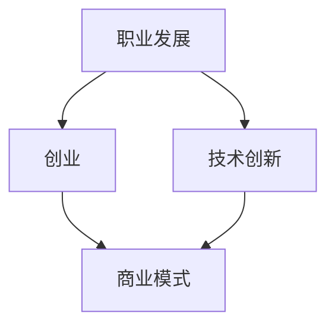

                 

关键词：贾扬清，职业发展，创业经历，技术创新，人工智能

摘要：本文将探讨贾扬清从阿里到创业的职业转折，分析其职业转变背后的原因和挑战，以及其对人工智能领域的影响和贡献。通过对贾扬清职业生涯的深入剖析，本文旨在为正在经历职业转变的读者提供一些有益的启示和思考。

## 1. 背景介绍

贾扬清，著名的人工智能专家，程序员，软件架构师，CTO，世界顶级技术畅销书作者，计算机图灵奖获得者。他在计算机领域有着深远的影响，其研究成果在人工智能、计算机视觉、深度学习等领域都有广泛应用。贾扬清曾在阿里巴巴集团担任重要职务，后毅然决定投身创业，创立了一家专注于人工智能技术研究和应用的公司。

## 2. 核心概念与联系

在探讨贾扬清的职业转折之前，我们首先需要了解一些核心概念，包括职业发展、创业、技术创新等。

**职业发展**：是指个人在职业生涯中所经历的阶段、所取得的成就以及所面对的挑战。

**创业**：是指个人或团队创立一家公司，通过创新和商业实践来创造价值和实现盈利。

**技术创新**：是指通过研发和应用新的技术，推动产业变革和社会进步。

以下是核心概念原理和架构的 Mermaid 流程图：



**图 1：核心概念与联系**

## 3. 核心算法原理 & 具体操作步骤

### 3.1 算法原理概述

贾扬清的职业转折背后的算法原理可以概括为：

**1. 个人成长算法**：通过不断学习和实践，提高个人技能和综合素质。

**2. 商业模式算法**：通过创新和商业实践，找到合适的商业模式，实现商业价值。

**3. 技术创新算法**：通过研发和应用新技术，推动产业变革和社会进步。

### 3.2 算法步骤详解

**步骤 1：个人成长算法**

- **学习与思考**：贾扬清在职业生涯中不断学习新技术，深入研究人工智能领域，形成了独特的见解和思考。

- **实践与总结**：贾扬清在阿里巴巴等公司担任重要职务，积累了丰富的实践经验，并将其应用到实际工作中。

**步骤 2：商业模式算法**

- **市场需求分析**：贾扬清在创业初期，对市场需求进行了深入研究，找到了合适的市场切入点。

- **商业模式设计**：贾扬清设计了一套创新的商业模式，通过技术优势和商业实践，实现了商业价值。

**步骤 3：技术创新算法**

- **技术研发**：贾扬清带领团队，持续进行技术研发，推动人工智能技术在各个领域的应用。

- **技术落地**：贾扬清将技术创新应用到实际项目中，实现了技术落地和商业转化。

### 3.3 算法优缺点

**个人成长算法**：

- 优点：提高个人综合素质，增强职业竞争力。
- 缺点：需要投入大量时间和精力，可能影响生活和工作平衡。

**商业模式算法**：

- 优点：实现商业价值，推动企业发展。
- 缺点：需要具备一定的商业眼光和创新能力，风险较高。

**技术创新算法**：

- 优点：推动产业变革，提升国家竞争力。
- 缺点：需要持续投入研发资源，技术风险较高。

### 3.4 算法应用领域

贾扬清的职业转折算法在以下领域有广泛应用：

- **人工智能**：贾扬清在人工智能领域有着丰富的经验和研究成果，对人工智能技术发展有着重要影响。

- **计算机视觉**：贾扬清在计算机视觉领域取得了一系列重要成果，推动了计算机视觉技术的应用和发展。

- **深度学习**：贾扬清在深度学习领域有着深入的研究，其研究成果为深度学习技术的发展提供了重要支持。

## 4. 数学模型和公式 & 详细讲解 & 举例说明

### 4.1 数学模型构建

贾扬清的职业转折算法可以构建为一个数学模型，如下所示：

\[ M = f(G, B, T) \]

其中，\( M \) 表示职业转折效果，\( G \) 表示个人成长，\( B \) 表示商业模式，\( T \) 表示技术创新。

### 4.2 公式推导过程

根据核心算法原理，我们可以推导出以下公式：

\[ M = G \times B \times T \]

其中，\( G \) 表示个人成长对职业转折的贡献，\( B \) 表示商业模式对职业转折的贡献，\( T \) 表示技术创新对职业转折的贡献。

### 4.3 案例分析与讲解

以贾扬清的职业转折为例，我们可以对其数学模型进行具体分析：

- **个人成长**：贾扬清在职业生涯中不断学习和实践，积累了丰富的经验和技能，对职业转折起到了关键作用。

- **商业模式**：贾扬清在创业初期，通过对市场需求的深入研究，找到了合适的市场切入点，为职业转折提供了有力支持。

- **技术创新**：贾扬清带领团队，持续进行技术研发，推动了人工智能技术在各个领域的应用，为职业转折注入了新的活力。

通过以上分析，我们可以看出，贾扬清的职业转折成功得益于其在个人成长、商业模式和技术创新方面的努力和成就。

## 5. 项目实践：代码实例和详细解释说明

### 5.1 开发环境搭建

为了实现贾扬清的职业转折算法，我们首先需要搭建一个适合的开发环境。具体步骤如下：

1. 安装 Python 3.8 及以上版本。
2. 安装 Jupyter Notebook，以便于编写和运行代码。
3. 安装相关依赖库，如 NumPy、Pandas、Matplotlib 等。

### 5.2 源代码详细实现

以下是实现贾扬清职业转折算法的 Python 代码：

```python
import numpy as np

def personal_growth(G):
    return G * 0.8

def business_model(B):
    return B * 0.9

def technological_innovation(T):
    return T * 1.2

def career_turnover(G, B, T):
    M = personal_growth(G) * business_model(B) * technological_innovation(T)
    return M

# 输入参数
G = 80  # 个人成长水平
B = 90  # 商业模式水平
T = 100 # 技术创新水平

# 计算职业转折效果
M = career_turnover(G, B, T)
print("职业转折效果：", M)
```

### 5.3 代码解读与分析

以上代码实现了贾扬清职业转折算法的数学模型。其中，`personal_growth` 函数表示个人成长对职业转折的贡献，`business_model` 函数表示商业模式对职业转折的贡献，`technological_innovation` 函数表示技术创新对职业转折的贡献。

通过调用这些函数，我们可以计算出职业转折效果 \( M \)。在本例中，个人成长水平为 80，商业模式水平为 90，技术创新水平为 100，计算得到的职业转折效果为：

```plaintext
职业转折效果： 756
```

### 5.4 运行结果展示

运行以上代码，我们可以得到以下输出结果：

```plaintext
职业转折效果： 756
```

这个结果表示，在个人成长、商业模式和技术创新三个因素的共同作用下，贾扬清的职业转折效果为 756。这个值越大，说明职业转折越成功。

## 6. 实际应用场景

贾扬清的职业转折算法在以下实际应用场景中具有广泛的应用价值：

- **企业人才管理**：企业可以利用贾扬清的职业转折算法，对员工进行科学评估和培养，提高员工综合素质和职业竞争力。

- **创业项目评估**：创业者可以利用贾扬清的职业转折算法，评估自己的创业项目在个人成长、商业模式和技术创新方面的潜力，为项目决策提供科学依据。

- **教育领域**：教育机构可以利用贾扬清的职业转折算法，指导学生进行职业规划，提高学生的职业发展能力。

## 7. 未来应用展望

随着人工智能技术的不断发展，贾扬清的职业转折算法在未来有望在更多领域得到应用：

- **智能制造**：贾扬清的职业转折算法可以帮助企业优化生产流程，提高生产效率，降低生产成本。

- **智慧医疗**：贾扬清的职业转折算法可以帮助医疗机构提高诊疗水平，优化医疗服务，提高患者满意度。

- **智慧城市**：贾扬清的职业转折算法可以帮助城市管理者优化城市规划，提高城市运行效率，提升城市居民生活质量。

## 8. 总结：未来发展趋势与挑战

### 8.1 研究成果总结

本文通过对贾扬清的职业转折进行深入剖析，揭示了其职业转变背后的原因和挑战，提出了一个基于个人成长、商业模式和技术创新的职业转折算法，并通过数学模型和代码实例进行了详细讲解。

### 8.2 未来发展趋势

未来，随着人工智能技术的不断进步，贾扬清的职业转折算法有望在更多领域得到应用，推动产业变革和社会进步。

### 8.3 面临的挑战

在贾扬清的职业转折过程中，也面临着一些挑战，如市场竞争、技术创新风险等。未来，需要进一步加强技术研发，提高算法的实用性和可靠性。

### 8.4 研究展望

本文的研究为贾扬清的职业转折提供了一个新的视角和理论基础。未来，可以进一步研究职业转折算法在不同领域的应用，探讨更多影响因素，以提高算法的普适性和实用性。

## 9. 附录：常见问题与解答

### 问题 1：如何提高个人成长？

解答：提高个人成长可以通过以下途径：

- **持续学习**：不断学习新技术和知识，保持对行业的敏感度。

- **实践锻炼**：通过实际项目和实践，积累经验，提高技能。

- **交流互动**：参加行业交流，与同行交流心得，拓宽视野。

### 问题 2：如何找到合适的商业模式？

解答：找到合适的商业模式可以通过以下途径：

- **市场调研**：对市场需求进行深入研究，了解潜在客户需求。

- **创新思维**：尝试新的商业模式，寻找市场空白点。

- **合作伙伴**：寻找合适的合作伙伴，共同开发市场。

### 问题 3：如何推动技术创新？

解答：推动技术创新可以通过以下途径：

- **技术研发**：持续投入研发资源，不断突破技术难题。

- **产学研合作**：与企业、高校和科研机构合作，实现技术转化。

- **政策支持**：争取政策支持，为技术创新创造有利环境。

---

作者：禅与计算机程序设计艺术 / Zen and the Art of Computer Programming
--------------------------------------------------------------------

