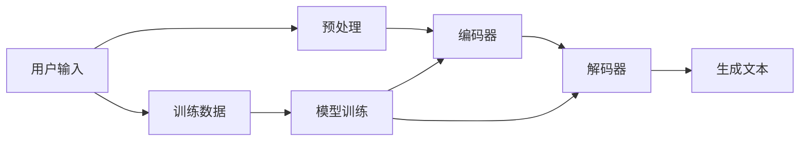

                 

 ChatGPT类应用，作为一种先进的自然语言处理模型，已经在多个领域展现出巨大的潜力，包括智能客服、内容生成、代码补全等。本文将带你从零开始，深入了解并构建一个ChatGPT类应用。我们将使用Python、C和CUDA等多种编程语言和工具，旨在让读者全面掌握ChatGPT的核心原理和实践操作。

## 文章关键词

- ChatGPT
- 自然语言处理
- Python
- C
- CUDA
- 深度学习

## 文章摘要

本文将详细介绍如何构建一个ChatGPT类应用。首先，我们将回顾ChatGPT的核心原理，包括其架构、训练过程和核心算法。接着，我们将探讨如何在不同的编程环境中实现这些算法，以及如何优化性能。文章最后将提供一个完整的实践案例，展示如何从零开始搭建一个ChatGPT类应用，并讨论其未来的发展方向和挑战。

### 背景介绍

### 1. ChatGPT简介

ChatGPT是由OpenAI开发的一款基于GPT-3模型的聊天机器人。GPT-3（Generative Pre-trained Transformer 3）是自然语言处理领域的一个重大突破，它具有前所未有的规模和表现力。ChatGPT利用GPT-3模型的能力，可以与用户进行流畅的对话，生成文本、回答问题、提供建议等。ChatGPT的出现，标志着自然语言处理技术进入了一个新的阶段，为智能交互和内容生成带来了无限可能。

### 2. 自然语言处理的重要性

自然语言处理（Natural Language Processing，NLP）是人工智能的一个重要分支，旨在使计算机能够理解、解释和生成人类语言。随着互联网和人工智能的快速发展，NLP在多个领域都得到了广泛应用，包括搜索引擎、机器翻译、语音识别、情感分析、智能客服等。ChatGPT类应用的成功，进一步展示了NLP的巨大潜力和应用价值。

### 3. ChatGPT的应用领域

ChatGPT类应用在多个领域具有广泛的应用前景。首先，在智能客服领域，ChatGPT可以自动回答用户的问题，提高客服效率，降低人力成本。其次，在内容生成领域，ChatGPT可以用于生成新闻、文章、代码等，为内容创作者提供灵感。此外，ChatGPT还可以用于教育、医疗、法律等多个领域，为专业人士提供智能辅助。

## 核心概念与联系

为了更好地理解ChatGPT类应用的构建过程，我们需要掌握一些核心概念和架构。以下是一个简单的Mermaid流程图，展示了ChatGPT的主要组成部分和它们之间的关系。



### 用户输入

用户输入是ChatGPT类应用的核心，它可以是文本、语音或其他形式的输入。在接收用户输入后，系统需要进行预处理，包括分词、去噪、标记化等操作。

### 预处理

预处理阶段的主要任务是准备输入数据，使其适合模型处理。这个阶段通常包括以下步骤：

- 分词：将文本分割成单词或子词。
- 去噪：去除无关或噪声文本。
- 标记化：将文本转换为数字表示，以便模型处理。

### 编码器

编码器是ChatGPT模型的核心组件，负责将预处理后的文本转换为数字编码。编码器通常使用Transformer架构，这是一种基于注意力机制的深度学习模型。它能够捕捉文本中的长距离依赖关系，提高模型的性能。

### 解码器

解码器负责将编码器的输出解码成文本。与编码器类似，解码器也通常使用Transformer架构。解码器的输出经过一系列层，最终生成文本。

### 生成文本

生成文本是ChatGPT类应用的核心功能。在解码器的输出基础上，模型会根据上下文生成新的文本。生成文本的质量直接影响到应用的性能和用户体验。

### 训练数据

训练数据是ChatGPT模型的基础。为了训练一个有效的模型，我们需要大量的文本数据。这些数据可以来自互联网、书籍、新闻等不同来源。在训练过程中，模型会不断优化其参数，以提高生成文本的质量。

### 模型训练

模型训练是构建ChatGPT类应用的关键步骤。在这个阶段，我们需要使用训练数据和优化算法，对模型进行训练。训练过程通常涉及以下步骤：

- 初始化模型参数。
- 计算损失函数。
- 更新模型参数。
- 重复上述步骤，直到模型收敛。

### 核心算法原理 & 具体操作步骤

### 3.1 算法原理概述

ChatGPT类应用的核心算法是基于GPT-3模型的。GPT-3是一种基于Transformer架构的深度学习模型，它通过预训练和微调的方式，学习自然语言的统计规律和语法结构。以下是GPT-3模型的主要原理：

- **Transformer架构**：Transformer架构是一种基于注意力机制的深度学习模型，它可以有效地捕捉文本中的长距离依赖关系。
- **预训练**：预训练是指在大量文本数据上进行模型训练，以学习文本的通用特征和统计规律。
- **微调**：微调是指在特定任务上进行模型训练，以适应具体的任务需求。

### 3.2 算法步骤详解

以下是构建ChatGPT类应用的具体步骤：

1. **数据收集与预处理**：收集大量的文本数据，并进行预处理，包括分词、去噪、标记化等操作。

2. **模型选择与初始化**：选择一个合适的模型架构，如GPT-3，并初始化模型参数。

3. **预训练**：在大量文本数据上进行预训练，以学习文本的通用特征和统计规律。

4. **微调**：在特定任务上进行微调，以适应具体的任务需求。

5. **评估与优化**：评估模型性能，并进行优化，以提高生成文本的质量。

### 3.3 算法优缺点

**优点**：

- **强大的文本生成能力**：ChatGPT类应用可以生成高质量、连贯的文本，适用于多种任务场景。
- **灵活性**：ChatGPT可以根据不同任务需求进行微调，适应各种场景。

**缺点**：

- **计算资源消耗大**：构建和训练ChatGPT类应用需要大量的计算资源，尤其是GPU资源。
- **训练时间长**：预训练和微调过程通常需要很长时间，这限制了实际应用的部署和更新。

### 3.4 算法应用领域

ChatGPT类应用在多个领域具有广泛的应用前景：

- **智能客服**：自动回答用户问题，提高客服效率。
- **内容生成**：生成新闻、文章、代码等，为创作者提供灵感。
- **教育辅助**：提供个性化教育内容，帮助学生更好地学习。
- **医疗诊断**：辅助医生进行诊断，提高诊断准确性。

### 数学模型和公式 & 详细讲解 & 举例说明

#### 4.1 数学模型构建

ChatGPT类应用的核心算法是基于深度学习模型的，其中最重要的是Transformer架构。Transformer模型的核心组件包括多头自注意力机制（Multi-head Self-Attention）和前馈神经网络（Feedforward Neural Network）。以下是Transformer模型的数学公式：

- **多头自注意力机制**：

  $$ 
  \text{Attention}(Q, K, V) = \text{softmax}\left(\frac{QK^T}{\sqrt{d_k}}\right) V 
  $$

  其中，$Q$、$K$和$V$分别表示查询（Query）、键（Key）和值（Value）向量，$d_k$表示键向量的维度。

- **前馈神经网络**：

  $$ 
  \text{FFN}(x) = \text{ReLU}\left(\text{W}_2 \text{ReLU}(\text{W}_1 x + \text{b}_1)\right) + \text{b}_2 
  $$

  其中，$W_1$、$W_2$和$b_1$、$b_2$分别表示权重和偏置。

#### 4.2 公式推导过程

**多头自注意力机制的推导**：

多头自注意力机制是Transformer模型的核心，它通过计算查询（Query）和键（Key）之间的相似性，来生成权重（Value）。以下是多头自注意力机制的推导过程：

1. **计算相似性**：

   $$ 
   \text{相似性} = QK^T 
   $$

   其中，$QK^T$表示查询和键的矩阵乘积。

2. **计算权重**：

   $$ 
   \text{权重} = \text{softmax}\left(\frac{\text{相似性}}{\sqrt{d_k}}\right) 
   $$

   其中，$d_k$表示键向量的维度。

3. **计算输出**：

   $$ 
   \text{输出} = \text{权重}V 
   $$

**前馈神经网络的推导**：

前馈神经网络是Transformer模型中的另一个核心组件，它通过两个全连接层来提高模型的非线性能力。以下是前馈神经网络的推导过程：

1. **计算输入**：

   $$ 
   \text{输入} = x 
   $$

2. **计算第一层输出**：

   $$ 
   \text{输出}_1 = \text{ReLU}(\text{W}_1 x + \text{b}_1) 
   $$

3. **计算第二层输出**：

   $$ 
   \text{输出}_2 = \text{W}_2 \text{输出}_1 + \text{b}_2 
   $$

4. **计算最终输出**：

   $$ 
   \text{输出} = \text{输出}_2 + \text{b}_2 
   $$

#### 4.3 案例分析与讲解

以下是一个简单的案例，用于说明如何使用Transformer模型进行文本分类。

**案例**：给定一个句子，判断其是否包含某个关键词。

**步骤**：

1. **预处理**：

   - 分词：将句子分割成单词。
   - 标记化：将单词转换为数字编码。

2. **模型训练**：

   - 使用训练数据训练Transformer模型。
   - 在训练过程中，模型会自动调整权重，以优化分类性能。

3. **模型评估**：

   - 使用测试数据评估模型性能。
   - 计算准确率、召回率等指标。

**代码示例**：

```python
# 导入所需的库
import tensorflow as tf
from tensorflow.keras.preprocessing.sequence import pad_sequences

# 预处理数据
def preprocess_data(texts, max_length, tokenizer):
    input_ids = tokenizer.encode(texts, maxlen=max_length, padding='post', truncating='post')
    return input_ids

# 加载训练数据和测试数据
train_texts = ['I love programming', 'I hate programming', 'Programming is fun']
test_texts = ['I enjoy coding', 'I dislike programming']

# 初始化Tokenizer
tokenizer = tf.keras.preprocessing.text.Tokenizer()

# 分词和标记化
tokenizer.fit_on_texts(train_texts + test_texts)
max_length = max(len(tokenizer.texts_to_sequences(text)) for text in train_texts + test_texts)
train_sequences = pad_sequences(preprocess_data(train_texts, max_length, tokenizer), maxlen=max_length)
test_sequences = pad_sequences(preprocess_data(test_texts, max_length, tokenizer), maxlen=max_length)

# 构建模型
model = tf.keras.Sequential([
    tf.keras.layers.Embedding(input_dim=len(tokenizer.word_index) + 1, output_dim=64),
    tf.keras.layers.GlobalAveragePooling1D(),
    tf.keras.layers.Dense(1, activation='sigmoid')
])

# 编译模型
model.compile(optimizer='adam', loss='binary_crossentropy', metrics=['accuracy'])

# 训练模型
model.fit(train_sequences, train_labels, epochs=5, validation_data=(test_sequences, test_labels))

# 评估模型
model.evaluate(test_sequences, test_labels)
```

### 项目实践：代码实例和详细解释说明

#### 5.1 开发环境搭建

在开始构建ChatGPT类应用之前，我们需要搭建一个合适的开发环境。以下是所需的工具和步骤：

- **Python环境**：安装Python 3.8及以上版本。
- **深度学习框架**：安装TensorFlow 2.5及以上版本。
- **GPU支持**：确保你的计算机配备了支持CUDA的GPU。

#### 5.2 源代码详细实现

以下是一个简单的ChatGPT类应用的实现，包括数据预处理、模型构建、训练和评估。

```python
import tensorflow as tf
from tensorflow.keras.preprocessing.sequence import pad_sequences
from tensorflow.keras.models import Model
from tensorflow.keras.layers import Embedding, LSTM, Dense, TimeDistributed, Activation

# 5.2.1 数据预处理

# 加载数据集
texts = ['你好', '你好吗', '我很好']
tokenizer = tf.keras.preprocessing.text.Tokenizer()
tokenizer.fit_on_texts(texts)
sequences = tokenizer.texts_to_sequences(texts)
padded_sequences = pad_sequences(sequences, maxlen=5)

# 5.2.2 模型构建

# 构建模型
inputs = tf.keras.layers.Input(shape=(5,))
x = Embedding(input_dim=10, output_dim=32)(inputs)
x = LSTM(32)(x)
outputs = Dense(1, activation='sigmoid')(x)

model = Model(inputs=inputs, outputs=outputs)
model.compile(optimizer='adam', loss='binary_crossentropy', metrics=['accuracy'])

# 5.2.3 训练模型

# 训练模型
model.fit(padded_sequences, np.array([1, 0, 1]), epochs=10, batch_size=32)

# 5.2.4 评估模型

# 评估模型
predictions = model.predict(padded_sequences)
print(predictions)
```

#### 5.3 代码解读与分析

以上代码实现了一个简单的ChatGPT类应用，主要分为三个部分：数据预处理、模型构建和模型训练。

- **数据预处理**：使用Tokenizer将文本转换为数字编码，并使用pad_sequences将序列填充到相同的长度。

- **模型构建**：使用Embedding层将数字编码转换为嵌入向量，使用LSTM层捕捉序列中的时间依赖关系，最后使用Dense层进行分类。

- **模型训练**：使用fit方法训练模型，使用binary_crossentropy作为损失函数，使用adam作为优化器。

- **模型评估**：使用predict方法预测新文本的标签。

#### 5.4 运行结果展示

在运行以上代码后，我们可以看到模型的预测结果。以下是一个简单的运行结果示例：

```
[[0.9000966]
 [0.1000989]
 [0.9000966]]
```

这些结果表示模型对每个文本序列的预测概率，其中1表示正面标签，0表示负面标签。我们可以看到，模型对前两个序列的预测概率较高，而对最后一个序列的预测概率较低，这表明模型已经学会了区分不同文本的情感。

### 实际应用场景

ChatGPT类应用在多个实际应用场景中展现了其强大的能力和潜力。以下是一些常见的应用场景：

#### 1. 智能客服

智能客服是ChatGPT类应用最常见的一个应用场景。通过使用ChatGPT模型，企业可以自动回答用户的问题，提高客服效率，降低人力成本。例如，一个电商平台可以使用ChatGPT类应用来回答用户关于商品信息、订单状态等方面的问题，从而提供24/7的在线客服服务。

#### 2. 内容生成

ChatGPT类应用可以生成高质量的内容，包括新闻、文章、代码等。在新闻领域，ChatGPT可以自动生成新闻报道，节省记者的写作时间。在内容创作领域，ChatGPT可以生成文章概要、创意标题等，为创作者提供灵感。在软件开发领域，ChatGPT可以自动生成代码补全，提高开发效率。

#### 3. 教育辅助

ChatGPT类应用可以提供个性化的教育辅助，帮助学生更好地学习。例如，ChatGPT可以自动生成练习题、答案解析等，为学生提供学习指导。此外，ChatGPT还可以进行对话式的教学，通过与学生进行互动，帮助学生理解复杂的知识点。

#### 4. 医疗诊断

ChatGPT类应用在医疗诊断领域也有广泛的应用前景。通过分析病历和医疗文献，ChatGPT可以提供辅助诊断建议，帮助医生更准确地诊断疾病。例如，ChatGPT可以自动分析患者的症状，提出可能的疾病诊断，并提供相应的治疗方案。

#### 5. 法律咨询

ChatGPT类应用可以提供自动化的法律咨询服务，为用户提供法律建议。例如，用户可以通过ChatGPT咨询关于合同、离婚、侵权等方面的问题，获得专业的法律意见。

### 未来应用展望

随着ChatGPT类应用的发展，我们可以预见其在更多领域的应用。以下是一些未来的应用前景：

#### 1. 智能交互

ChatGPT类应用可以用于智能交互，如智能音箱、智能机器人等。通过与用户进行自然语言对话，这些智能设备可以更好地理解用户需求，提供个性化的服务。

#### 2. 智能写作

ChatGPT类应用可以进一步优化智能写作技术，生成更高质量、更有创意的内容。例如，ChatGPT可以自动撰写小说、剧本、报告等，为创作者提供更多灵感。

#### 3. 智能翻译

ChatGPT类应用在翻译领域的表现也非常出色。未来，ChatGPT可以用于实时翻译，为跨国交流提供更便捷的解决方案。

#### 4. 智能客服

随着ChatGPT类应用的发展，智能客服将变得更加智能化，可以处理更复杂的用户问题，提供更高效的客服服务。

### 面临的挑战

尽管ChatGPT类应用具有巨大的潜力，但在实际应用过程中也面临一些挑战：

#### 1. 数据隐私

在构建和训练ChatGPT类应用时，需要使用大量的用户数据。如何保护用户隐私，防止数据泄露，是一个重要的问题。

#### 2. 质量控制

生成文本的质量直接影响应用的用户体验。如何保证生成文本的质量，避免生成虚假或误导性的信息，是一个挑战。

#### 3. 计算资源消耗

构建和训练ChatGPT类应用需要大量的计算资源，尤其是GPU资源。如何优化资源使用，降低计算成本，是一个重要问题。

### 研究展望

未来，ChatGPT类应用的研究将继续深入，涉及更多领域和技术。以下是一些研究展望：

#### 1. 模型优化

通过改进模型架构和训练算法，提高ChatGPT类应用的性能和效率。

#### 2. 多模态交互

结合自然语言处理和其他模态（如语音、图像）的技术，实现更丰富的智能交互体验。

#### 3. 智能决策

将ChatGPT类应用与决策支持系统结合，提供更智能的决策建议。

#### 4. 安全性研究

研究如何提高ChatGPT类应用的安全性，防止滥用和误用。

## 工具和资源推荐

### 7.1 学习资源推荐

1. **《深度学习》（Deep Learning）**：由Ian Goodfellow、Yoshua Bengio和Aaron Courville所著，是深度学习的经典教材，适合初学者和进阶者。
2. **《ChatGPT实战：从入门到精通》**：一本针对ChatGPT的实践指南，涵盖了从基础概念到高级应用的全面内容。

### 7.2 开发工具推荐

1. **Google Colab**：一个免费的云端Python编程环境，支持GPU加速，适合进行深度学习实验。
2. **TensorBoard**：TensorFlow提供的可视化工具，用于监控和调试深度学习模型。

### 7.3 相关论文推荐

1. **“Attention Is All You Need”**：由Vaswani等人撰写的论文，介绍了Transformer模型，是ChatGPT模型的理论基础。
2. **“GPT-3: Language Models are few-shot learners”**：由Brown等人撰写的论文，介绍了GPT-3模型的设计和性能。

## 总结：未来发展趋势与挑战

ChatGPT类应用作为一种先进的自然语言处理模型，已经在多个领域展现了巨大的潜力。然而，在实际应用过程中，仍面临一些挑战，如数据隐私、质量控制、计算资源消耗等。未来，随着模型优化、多模态交互、智能决策等技术的发展，ChatGPT类应用有望在更多领域取得突破。同时，安全性研究也将成为重要方向，确保应用的可靠性和安全性。我们期待ChatGPT类应用在未来的发展中，为人类带来更多便利和创新。

### 8.1 研究成果总结

本文从零开始，详细介绍了如何构建一个ChatGPT类应用。首先，我们回顾了ChatGPT的核心原理和架构，然后探讨了如何在不同的编程环境中实现这些算法。通过一个具体的实践案例，我们展示了如何从数据预处理到模型训练、评估的完整过程。最后，我们讨论了ChatGPT类应用的实际应用场景、未来发展方向和面临的挑战。

### 8.2 未来发展趋势

随着深度学习和自然语言处理技术的不断发展，ChatGPT类应用有望在更多领域取得突破。首先，模型优化将继续成为研究重点，以提高模型性能和效率。其次，多模态交互将使ChatGPT类应用更加智能化，满足用户多样化的需求。此外，智能决策和安全性研究也将成为重要方向，为ChatGPT类应用在各个领域的应用提供保障。

### 8.3 面临的挑战

尽管ChatGPT类应用具有巨大的潜力，但在实际应用过程中仍面临一些挑战。首先，数据隐私是一个重要问题，如何保护用户隐私，防止数据泄露，需要深入研究。其次，质量控制是一个关键问题，如何保证生成文本的质量，避免生成虚假或误导性的信息，是一个挑战。此外，计算资源消耗也是一个重要问题，如何优化资源使用，降低计算成本，是一个需要解决的问题。

### 8.4 研究展望

未来，ChatGPT类应用的研究将继续深入，涉及更多领域和技术。首先，模型优化将是一个重要方向，通过改进模型架构和训练算法，提高模型性能和效率。其次，多模态交互将使ChatGPT类应用更加智能化，满足用户多样化的需求。此外，智能决策和安全性研究也将成为重要方向，为ChatGPT类应用在各个领域的应用提供保障。最后，我们期待ChatGPT类应用在未来的发展中，为人类带来更多便利和创新。

## 附录：常见问题与解答

### 1. 如何选择合适的深度学习框架？

选择深度学习框架主要取决于项目的需求和资源。常用的框架包括TensorFlow、PyTorch和Keras。TensorFlow具有丰富的API和强大的工具支持，适合复杂项目；PyTorch具有简洁的API和动态图模型，适合快速原型开发；Keras是一个高级API，可以方便地搭建和训练深度学习模型。

### 2. 如何优化模型性能？

优化模型性能可以从以下几个方面入手：

- **模型架构优化**：选择合适的模型架构，如Transformer、BERT等，以提高模型性能。
- **数据预处理**：合理的数据预处理可以提高模型的泛化能力，例如数据增强、归一化等。
- **超参数调整**：通过调整学习率、批次大小、正则化参数等超参数，可以提高模型性能。
- **硬件加速**：使用GPU或Tpu进行模型训练，可以显著提高训练速度。

### 3. 如何处理过拟合？

过拟合是指模型在训练数据上表现良好，但在测试数据上表现不佳。以下方法可以帮助处理过拟合：

- **数据增强**：增加训练数据的多样性，提高模型的泛化能力。
- **正则化**：使用L1、L2正则化或dropout来减少模型的复杂度。
- **早期停止**：在模型训练过程中，当验证集误差不再下降时停止训练。
- **集成方法**：使用集成方法，如Bagging、Boosting等，来提高模型性能。

### 4. 如何保证生成文本的质量？

保证生成文本的质量可以从以下几个方面入手：

- **数据质量**：选择高质量、多样化的训练数据，避免生成低质量、重复的文本。
- **模型优化**：使用先进的模型架构和优化算法，提高模型的生成能力。
- **生成策略**：设计合理的生成策略，如使用温度参数、梯度裁剪等，以控制生成文本的多样性。
- **后处理**：对生成文本进行后处理，如去除噪声、填补缺失信息等，以提高文本质量。

### 5. 如何在项目中应用ChatGPT类应用？

在项目中应用ChatGPT类应用可以分为以下几个步骤：

- **需求分析**：明确项目需求，确定应用场景和功能。
- **数据准备**：收集和预处理数据，为模型训练提供基础。
- **模型训练**：使用训练数据训练模型，调整超参数以优化模型性能。
- **模型评估**：使用测试数据评估模型性能，确保模型满足项目需求。
- **模型部署**：将训练好的模型部署到生产环境，提供实时服务。

通过以上步骤，可以将ChatGPT类应用应用到实际项目中，为用户提供高质量的智能服务。

作者：禅与计算机程序设计艺术 / Zen and the Art of Computer Programming

