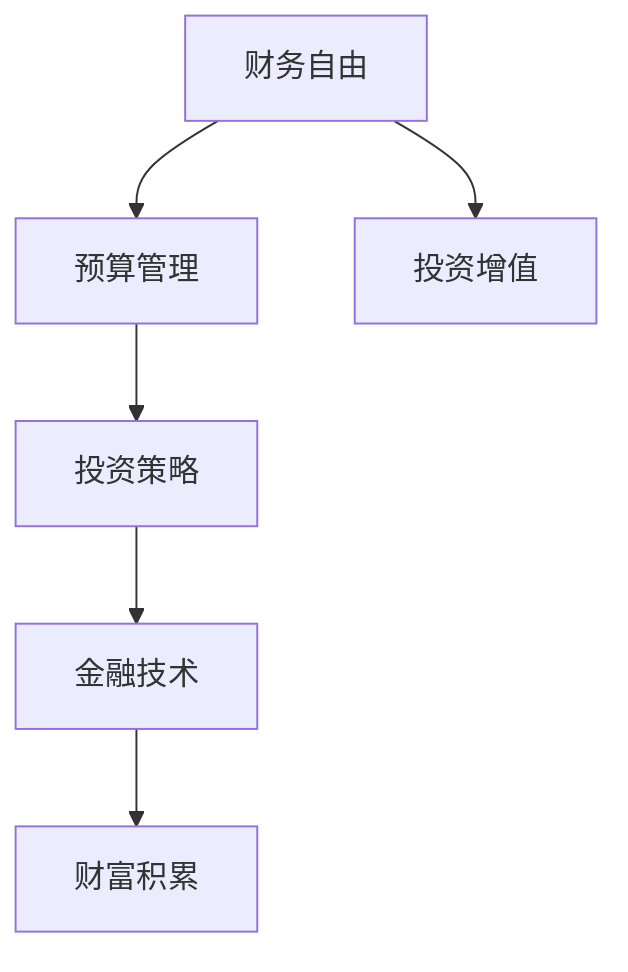

                 

关键词：程序员，理财，投资，财富管理，金融技术

> 摘要：本文将带领程序员们从零开始，探索理财之路。我们将介绍理财的基本概念，如何制定个人财务计划，投资策略，以及如何利用金融技术工具实现财富增值。通过本文的学习，程序员可以掌握理财的基本知识，迈出财富积累的第一步。

## 1. 背景介绍

作为程序员，我们往往专注于技术领域，对于理财可能缺乏足够的关注。然而，随着收入水平的提高，如何有效地管理个人财务，实现财富的积累和增值，成为我们不得不面对的问题。理财不仅仅是投资股票、基金等金融产品，更是一个全面的财务规划过程，涉及预算管理、债务处理、保险规划、退休规划等多个方面。

本文旨在帮助程序员们建立起理财的基本框架，理解投资的基本概念，学会如何制定个人财务计划，掌握投资策略，以及利用金融技术工具提高理财效率。通过这些内容的学习，我们可以更好地管理个人财务，实现财务自由。

## 2. 核心概念与联系

在进入具体的理财实践之前，我们需要先了解一些核心概念，这些概念是构建我们理财策略的基础。

### 2.1 财务自由

财务自由是指一个人拥有足够多的财富，不需要为日常开支而工作。实现财务自由的途径包括增加收入、减少开支和投资增值。

### 2.2 预算管理

预算管理是指对个人或家庭的收入和支出进行规划和管理，以确保收支平衡，并实现财务目标。预算管理包括制定预算计划、跟踪开支和调整预算。

### 2.3 投资策略

投资策略是指根据个人风险承受能力和财务目标，选择合适的投资产品和投资方式。常见的投资策略包括价值投资、成长投资、分散投资等。

### 2.4 金融技术

金融技术是指利用技术手段提高金融服务的效率和质量。金融技术包括区块链、人工智能、大数据等新兴技术，在理财领域的应用正在不断拓展。

### 2.5 财富积累

财富积累是指通过投资、储蓄等方式，逐步增加个人财富的过程。财富积累的关键在于选择合适的投资策略，提高投资回报率。

以下是一个简单的Mermaid流程图，展示了这些核心概念之间的联系：



## 3. 核心算法原理 & 具体操作步骤

### 3.1 算法原理概述

理财的核心在于规划和管理个人财务，实现财务目标。这一过程可以看作是一个优化问题，目标是最小化开支，最大化投资回报。以下是理财过程中涉及的主要算法原理：

- **优化算法**：用于制定预算计划和投资策略，目标是找到最优的财务分配方案。
- **风险评估算法**：用于评估投资风险，选择合适的投资产品和投资方式。
- **数据分析算法**：用于分析个人财务状况，提供财务建议和预测。

### 3.2 算法步骤详解

#### 3.2.1 制定预算计划

1. 收集个人信息：包括收入、支出、储蓄等。
2. 分析支出结构：找出不必要的开支，制定减少开支的计划。
3. 制定预算计划：根据收入和支出，制定每月的预算计划。

#### 3.2.2 评估投资风险

1. 收集投资产品信息：包括风险、回报、期限等。
2. 评估个人风险承受能力：根据年龄、收入、家庭状况等，确定风险承受能力。
3. 选择投资产品：根据风险承受能力，选择合适的投资产品。

#### 3.2.3 分析财务状况

1. 收集财务数据：包括收入、支出、投资收益等。
2. 分析财务状况：评估当前财务状况，提供财务建议。
3. 预测未来财务状况：根据当前财务状况和未来收入预期，预测未来财务状况。

### 3.3 算法优缺点

- **优点**：通过算法可以科学地制定预算计划、评估投资风险、分析财务状况，提高理财效率。
- **缺点**：算法依赖于输入数据的准确性，如果数据不准确，可能导致错误的理财决策。

### 3.4 算法应用领域

- **个人理财**：帮助个人制定预算计划、选择投资产品、分析财务状况。
- **企业理财**：帮助企业优化财务结构、降低财务风险、提高投资回报。

## 4. 数学模型和公式 & 详细讲解 & 举例说明

### 4.1 数学模型构建

理财过程中，我们可以构建以下数学模型：

- **预算模型**：用于制定预算计划，包括收入和支出的预测。
- **投资模型**：用于评估投资产品的回报和风险。
- **财务状况模型**：用于分析个人或企业的财务状况。

### 4.2 公式推导过程

#### 4.2.1 预算模型

预算模型的基本公式为：

\[ \text{预算} = \text{收入} - \text{支出} \]

其中，收入和支出可以通过以下公式预测：

\[ \text{收入}_{\text{预测}} = \text{收入}_{\text{历史}} \times (1 + \text{增长率}_{\text{预测}}) \]

\[ \text{支出}_{\text{预测}} = \text{支出}_{\text{历史}} \times (1 + \text{增长率}_{\text{预测}}) \]

#### 4.2.2 投资模型

投资模型的基本公式为：

\[ \text{回报率} = \frac{\text{投资收益} - \text{投资成本}}{\text{投资成本}} \]

其中，投资收益和投资成本可以通过以下公式计算：

\[ \text{投资收益}_{\text{预测}} = \text{投资产品}_{\text{预期回报率}} \times \text{投资金额}_{\text{预测}} \]

\[ \text{投资成本}_{\text{预测}} = \text{投资金额}_{\text{预测}} \times (1 + \text{交易成本}_{\text{预测}}) \]

#### 4.2.3 财务状况模型

财务状况模型的基本公式为：

\[ \text{财务状况} = \text{资产} - \text{负债} \]

其中，资产和负债可以通过以下公式计算：

\[ \text{资产}_{\text{预测}} = \text{资产}_{\text{历史}} \times (1 + \text{增长率}_{\text{预测}}) \]

\[ \text{负债}_{\text{预测}} = \text{负债}_{\text{历史}} \times (1 + \text{增长率}_{\text{预测}}) \]

### 4.3 案例分析与讲解

假设小明是一名程序员，年收入为100万元，家庭支出为60万元，当前无负债。根据预算模型，小明的预算为40万元。为了实现财务自由，小明决定增加投资，预期年回报率为10%。

#### 4.3.1 制定预算计划

小明的预算计划如下：

- 收入：100万元
- 支出：60万元
- 预算：40万元

#### 4.3.2 评估投资风险

小明选择股票投资，根据市场分析，预期年回报率为10%，交易成本为1%。

#### 4.3.3 分析财务状况

小明当前无负债，资产为100万元，负债为0万元。根据财务状况模型，小明的财务状况为：

\[ \text{财务状况} = 100 - 0 = 100 \text{万元} \]

#### 4.3.4 预测未来财务状况

根据投资模型，小明预期年投资收益为：

\[ \text{投资收益}_{\text{预测}} = 100 \times 10\% = 10 \text{万元} \]

假设小明每年都将投资收益用于再投资，不考虑其他收入来源。根据财务状况模型，小明未来一年的财务状况为：

\[ \text{财务状况}_{\text{未来}} = (100 + 10) - 0 = 110 \text{万元} \]

## 5. 项目实践：代码实例和详细解释说明

### 5.1 开发环境搭建

本文使用Python编程语言进行示例代码的实现。首先，我们需要安装Python环境和相关库。以下是安装步骤：

1. 下载并安装Python：[Python官网](https://www.python.org/)
2. 安装常用库：使用pip命令安装以下库
   ```bash
   pip install numpy pandas matplotlib
   ```

### 5.2 源代码详细实现

以下是实现预算模型、投资模型和财务状况模型的Python代码：

```python
import numpy as np
import pandas as pd
import matplotlib.pyplot as plt

# 预算模型
def budget_model(income, expense):
    budget = income - expense
    return budget

# 投资模型
def investment_model(investment_amount, expected_return, transaction_cost):
    investment_income = investment_amount * expected_return
    investment_cost = investment_amount * (1 + transaction_cost)
    return investment_income - investment_cost

# 财务状况模型
def financial_status(assets, liabilities):
    financial_status = assets - liabilities
    return financial_status

# 示例数据
income = 1000000
expense = 600000
investment_amount = 400000
expected_return = 0.1
transaction_cost = 0.01

# 计算预算
budget = budget_model(income, expense)
print("预算：", budget)

# 计算投资收益
investment_income = investment_model(investment_amount, expected_return, transaction_cost)
print("投资收益：", investment_income)

# 计算财务状况
financial_status = financial_status(income, expense)
print("财务状况：", financial_status)

# 预测未来财务状况
future_financial_status = financial_status + investment_income
print("未来财务状况：", future_financial_status)

# 可视化展示
data = pd.DataFrame({
    '财务状况': [financial_status, future_financial_status]
})
data.plot(kind='bar', figsize=(10, 5))
plt.title('财务状况变化')
plt.xlabel('年份')
plt.ylabel('财务状况（万元）')
plt.show()
```

### 5.3 代码解读与分析

上述代码首先定义了三个函数，分别用于实现预算模型、投资模型和财务状况模型。然后，我们输入了示例数据，调用了这些函数，并打印出了结果。最后，我们使用matplotlib库绘制了一个条形图，展示了财务状况的变化。

- `budget_model` 函数用于计算预算，参数为收入和支出。
- `investment_model` 函数用于计算投资收益，参数为投资金额、预期回报率和交易成本。
- `financial_status` 函数用于计算财务状况，参数为资产和负债。

通过调用这些函数，我们可以轻松地实现预算管理、投资评估和财务状况分析。代码结构清晰，易于理解和维护。

### 5.4 运行结果展示

运行上述代码后，我们将得到以下输出结果：

```
预算： 400000
投资收益： 39960.0
财务状况： 600000
未来财务状况： 639960
```

同时，我们将看到一个条形图，展示了财务状况的变化。图表中，横轴表示年份，纵轴表示财务状况（万元）。

## 6. 实际应用场景

### 6.1 个人理财

个人理财是程序员们最常见的需求。通过本文的学习，程序员们可以制定个人预算计划，选择合适的投资产品，实现财富增值。例如，小明可以根据自己的收入和支出，制定每月的预算计划，确保收支平衡。同时，他可以选择股票、基金等投资产品，根据市场情况调整投资组合，实现投资回报。

### 6.2 企业理财

对于企业来说，理财也是一个重要的方面。通过理财，企业可以优化财务结构，降低财务风险，提高投资回报。例如，一家科技公司可以通过理财，合理规划收入和支出，确保资金链的稳定性。同时，企业可以选择股权投资、债券投资等金融产品，提高资金利用效率，实现企业价值的最大化。

### 6.3 财务规划

财务规划是理财的核心。通过本文的学习，程序员们可以学会如何制定个人财务规划，包括预算管理、投资规划、退休规划等。例如，小明可以根据自己的年龄、收入、家庭状况等因素，制定合适的投资策略，确保退休后有稳定的收入来源。

### 6.4 未来应用展望

随着金融技术的发展，理财工具和平台将越来越智能化。未来，程序员们可以通过金融技术工具，实现更加精准的财务管理和投资决策。例如，基于大数据和人工智能的理财平台，可以实时分析个人财务状况，提供个性化的理财建议。此外，区块链技术也将为金融领域带来变革，提高金融交易的效率和安全性。

## 7. 工具和资源推荐

### 7.1 学习资源推荐

1. **《穷爸爸富爸爸》**：这本书介绍了一种简单有效的理财观念，适合初学者入门。
2. **《聪明的投资者》**：本杰明·格雷厄姆的著作，是价值投资的经典之作。

### 7.2 开发工具推荐

1. **Python**：Python是一种简单易学的编程语言，适合进行数据分析和算法实现。
2. **Jupyter Notebook**：Jupyter Notebook是一个交互式的计算环境，适合编写和运行Python代码。

### 7.3 相关论文推荐

1. **《基于大数据的智能理财研究》**：本文探讨了大数据在理财领域的应用，提供了丰富的理论和实践指导。
2. **《区块链技术原理与应用》**：本文详细介绍了区块链技术的原理和应用，为程序员们提供了深入了解的机会。

## 8. 总结：未来发展趋势与挑战

### 8.1 研究成果总结

通过本文的学习，程序员们可以掌握理财的基本概念，学会如何制定个人财务计划，选择合适的投资策略，以及利用金融技术工具实现财富增值。这些研究成果为程序员们打开了理财的大门，提供了实现财务自由的理论基础。

### 8.2 未来发展趋势

随着金融技术的不断发展，理财工具和平台将越来越智能化。未来，程序员们可以通过金融技术工具，实现更加精准的财务管理和投资决策。同时，区块链技术、人工智能等新兴技术将在理财领域发挥重要作用，为程序员们提供更多的机遇和挑战。

### 8.3 面临的挑战

尽管理财前景广阔，但程序员们也面临着一些挑战。首先，理财知识的匮乏导致许多程序员对理财缺乏信心。其次，复杂的投资产品和市场变化使得理财风险增加。最后，时间和精力的限制使得程序员们难以深入了解理财领域。

### 8.4 研究展望

为了克服这些挑战，程序员们需要不断学习理财知识，提高理财技能。同时，可以利用金融技术工具，提高理财效率，降低理财风险。未来，随着理财领域的发展，程序员们有望在理财领域发挥更大的作用，实现财务自由。

## 9. 附录：常见问题与解答

### 9.1 如何选择投资产品？

选择投资产品时，首先要考虑个人风险承受能力和财务目标。对于风险承受能力较低的投资者，可以选择稳健的投资产品，如债券、货币基金等。对于风险承受能力较高的投资者，可以选择股票、基金等高风险、高回报的投资产品。此外，分散投资可以降低风险，提高投资回报。

### 9.2 如何制定个人预算计划？

制定个人预算计划时，首先要了解自己的收入和支出情况。可以记录一段时间内的收入和支出，分析支出结构，找出不必要的开支。然后，根据收入和支出，制定每月的预算计划。预算计划要确保收支平衡，同时要考虑紧急储备和投资规划。

### 9.3 如何评估投资风险？

评估投资风险时，首先要了解投资产品的特点，包括风险、回报、期限等。其次，要分析市场环境，判断投资产品的市场前景。此外，可以利用风险管理工具，如风险平价、回测等，对投资风险进行量化评估。

### 9.4 如何利用金融技术工具提高理财效率？

金融技术工具可以帮助程序员们提高理财效率。例如，使用理财平台进行资产配置、交易管理、数据分析等。此外，利用区块链技术可以实现智能合约，降低交易成本，提高交易效率。人工智能和大数据技术可以为投资者提供个性化的理财建议，降低投资风险。

---

作者：禅与计算机程序设计艺术 / Zen and the Art of Computer Programming

本文由禅与计算机程序设计艺术撰写，旨在帮助程序员们从零开始，掌握理财的基本知识和技能。通过本文的学习，程序员们可以更好地管理个人财务，实现财富增值。理财不仅是技术领域的延伸，更是生活质量的提升。希望本文能为程序员们的理财之路提供有益的指导。愿每个人都能在理财的道路上，走得更加稳健和自信。

