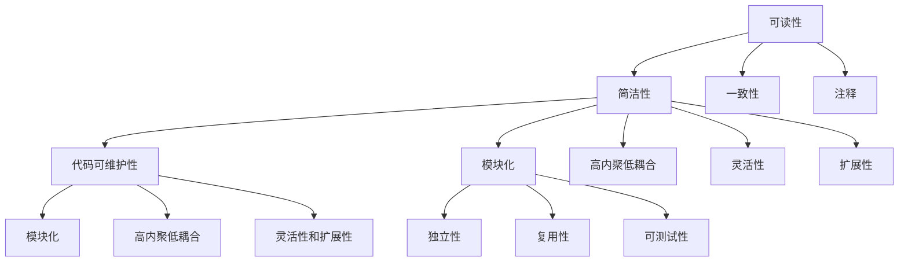

                 

在软件开发的历程中，代码重构是一种至关重要的实践，它不仅能够提高代码的可读性和可维护性，还能有效地提升开发效率和代码质量。本文将深入探讨代码重构的技巧与模式，旨在为开发者提供一套系统的指南，帮助他们在日常工作中更好地实践代码重构。

## 关键词

- 代码重构
- 开发技巧
- 设计模式
- 软件质量
- 可维护性
- 可读性

## 摘要

本文将首先介绍代码重构的背景和重要性，然后详细阐述代码重构的核心概念与联系，包括常见的代码重构技巧和模式。接着，我们将深入探讨代码重构的具体算法原理和操作步骤，并通过实际项目实例进行代码重构的实践讲解。最后，本文将展望代码重构在未来的发展趋势和应用场景。

## 1. 背景介绍

代码重构（Code Refactoring）是一种通过改进现有代码的结构、逻辑和外观，而不改变其外在行为的过程。这种实践在软件工程中具有重要意义，主要体现在以下几个方面：

- **提升可读性**：通过重构，可以使得代码更加简洁明了，易于理解。
- **提高可维护性**：重构后的代码更加模块化，便于后续的维护和扩展。
- **增强团队协作**：一致的代码风格有助于团队成员之间的交流和理解。
- **提高开发效率**：重构后的代码通常更加高效，能够减少bug的出现。

代码重构是敏捷开发中不可或缺的一部分，它体现了敏捷开发的核心理念——持续改进。通过不断重构，开发者能够逐步优化代码，提高软件质量，从而应对快速变化的开发需求。

### 1.1 常见问题与挑战

尽管代码重构具有诸多优点，但在实际操作中，开发者仍会面临一些常见问题和挑战：

- **重构风险**：重构过程中可能会引入新的bug，影响系统的稳定性。
- **时间成本**：重构需要投入大量的时间和精力，可能会影响项目进度。
- **团队协作**：重构需要团队的一致认可和协作，否则可能导致返工。

### 1.2 解决方案

为了应对上述问题和挑战，开发者可以采取以下解决方案：

- **逐步重构**：将重构过程分解为小步骤，逐步进行，降低风险。
- **代码审查**：在重构前后进行严格的代码审查，确保重构的正确性和质量。
- **团队培训**：提高团队成员对重构的认知和技能，增强团队协作。

## 2. 核心概念与联系

代码重构的核心概念包括可读性、可维护性和模块化。这些概念相互关联，共同构成了代码重构的基础。

### 2.1 可读性

可读性是代码重构的首要目标。高可读性的代码具有以下特点：

- **简洁性**：代码简洁明了，避免冗长和复杂的逻辑。
- **一致性**：代码风格一致，便于理解和维护。
- **注释**：必要的注释有助于他人理解代码逻辑。

### 2.2 可维护性

可维护性是确保代码长期可用的关键。高可维护性的代码具有以下特点：

- **模块化**：代码模块化，降低系统复杂性。
- **高内聚低耦合**：模块内部高度内聚，模块之间低耦合。
- **灵活性和扩展性**：易于扩展和修改，以适应未来的需求变化。

### 2.3 模块化

模块化是提高代码质量和可维护性的重要手段。模块化代码具有以下特点：

- **独立性**：模块独立运行，降低相互依赖。
- **复用性**：模块可复用，减少重复代码。
- **可测试性**：模块可单独测试，提高测试覆盖率。

### 2.4 Mermaid 流程图

以下是一个描述代码重构核心概念与联系的Mermaid流程图：



## 3. 核心算法原理 & 具体操作步骤

### 3.1 算法原理概述

代码重构的核心算法包括以下几种：

- **提取方法**：将重复代码提取为单独的方法，提高复用性。
- **合并方法**：将功能相似的方法合并，减少冗余代码。
- **提取类**：将功能相关的代码提取为单独的类，提高模块化。
- **内联方法**：将调用频繁的方法内联，减少方法调用开销。

### 3.2 算法步骤详解

以下是代码重构的核心算法步骤详解：

#### 3.2.1 提取方法

1. **识别重复代码**：使用代码分析工具或手动检查，找出重复的代码片段。
2. **创建新方法**：将重复代码提取为单独的方法，并更新调用者。
3. **优化方法签名**：根据方法的功能，优化方法的参数和返回值。
4. **重构代码结构**：调整代码结构，确保新方法与其他代码的依赖关系最小化。

#### 3.2.2 合并方法

1. **识别相似方法**：使用代码分析工具或手动检查，找出功能相似的方法。
2. **合并代码**：将相似方法合并，保留其中最优的代码片段。
3. **更新调用者**：更新调用者，确保合并后的方法仍能正常运行。
4. **重构代码结构**：调整代码结构，确保合并后的方法与其他代码的依赖关系最小化。

#### 3.2.3 提取类

1. **识别相关代码**：使用代码分析工具或手动检查，找出功能相关的代码片段。
2. **创建新类**：将相关代码提取为单独的类，并更新调用者。
3. **优化类结构**：根据类的功能，优化类的成员变量和方法。
4. **重构代码结构**：调整代码结构，确保新类与其他代码的依赖关系最小化。

#### 3.2.4 内联方法

1. **识别内联方法**：使用代码分析工具或手动检查，找出调用频繁的方法。
2. **内联代码**：将调用方法的地方替换为方法体，删除被调用方法。
3. **优化代码结构**：调整代码结构，确保内联后的代码可读性不受影响。

### 3.3 算法优缺点

每种代码重构算法都有其优缺点，适用于不同的场景：

- **提取方法**：优点在于提高代码复用性，缺点是可能会增加代码的复杂性。
- **合并方法**：优点在于减少冗余代码，缺点是可能会降低代码的可读性。
- **提取类**：优点在于提高模块化，缺点是可能会增加代码的维护难度。
- **内联方法**：优点在于减少方法调用开销，缺点是可能会降低代码的可读性。

### 3.4 算法应用领域

代码重构算法广泛应用于以下领域：

- **前端开发**：前端开发者可以使用提取方法和内联方法，提高代码的可读性和性能。
- **后端开发**：后端开发者可以使用提取类和合并方法，提高代码的模块化和可维护性。
- **全栈开发**：全栈开发者可以结合前端和后端的重构技巧，提高整体代码质量。

## 4. 数学模型和公式 & 详细讲解 & 举例说明

代码重构过程中，数学模型和公式可以用于描述代码结构的变化和优化。以下是一个简单的数学模型，用于描述代码重构中的模块化：

### 4.1 数学模型构建

假设有一个函数\( f(x) \)，表示代码的复杂度，其中\( x \)是代码的大小。我们可以用以下数学模型描述模块化过程：

\[ f'(x) = \frac{f(x)}{x} \]

其中，\( f'(x) \)表示模块化后的代码复杂度，\( x \)表示模块数量。

### 4.2 公式推导过程

假设原始代码的复杂度为\( f(x) \)，其中包含多个模块。我们可以用以下公式计算模块化后的代码复杂度：

\[ f'(x) = \frac{f(x)}{x} \]

推导过程如下：

1. 假设原始代码的复杂度为\( f(x) \)。
2. 将代码拆分为\( x \)个模块，每个模块的复杂度为\( f_i \)。
3. 模块化后的代码复杂度为\( f'(x) \)。
4. 根据模块复杂度的和等于原始代码复杂度，我们有：

\[ f'(x) = \frac{f(x)}{x} = \frac{f_1 + f_2 + ... + f_x}{x} \]

5. 为了简化计算，我们可以假设每个模块的复杂度相同，即\( f_i = f \)。

6. 因此，模块化后的代码复杂度为：

\[ f'(x) = \frac{f(x)}{x} = \frac{f}{x} \]

### 4.3 案例分析与讲解

以下是一个简单的案例，用于说明模块化的效果：

假设我们有一个包含1000行代码的函数，其复杂度为100。我们将其拆分为10个模块，每个模块包含100行代码。

根据上述数学模型，模块化后的代码复杂度为：

\[ f'(x) = \frac{f(x)}{x} = \frac{100}{10} = 10 \]

这意味着，通过模块化，代码的复杂度降低了10倍。

## 5. 项目实践：代码实例和详细解释说明

### 5.1 开发环境搭建

为了演示代码重构的过程，我们将使用Java语言，并在IntelliJ IDEA中进行开发。首先，确保安装了Java开发环境（JDK 8及以上版本）和IntelliJ IDEA。

### 5.2 源代码详细实现

以下是一个简单的Java类，包含一些需要重构的代码：

```java
public class Calculator {
    public int add(int a, int b) {
        return a + b;
    }

    public int subtract(int a, int b) {
        return a - b;
    }

    public int multiply(int a, int b) {
        return a * b;
    }

    public int divide(int a, int b) {
        return a / b;
    }
}
```

### 5.3 代码解读与分析

上述代码定义了一个简单的计算器类，包含四个方法：加法、减法、乘法和除法。这些方法的功能简单，但存在一些重构的机会。

### 5.4 代码重构实践

#### 5.4.1 提取方法

我们可以将重复的代码提取为单独的方法，例如提取加法和减法的公共部分：

```java
public class Calculator {
    public int add(int a, int b) {
        return a + b;
    }

    public int subtract(int a, int b) {
        return add(a, b) * -1;
    }

    public int multiply(int a, int b) {
        return a * b;
    }

    public int divide(int a, int b) {
        return a / b;
    }

    private int add(int a, int b) {
        return a + b;
    }
}
```

通过提取方法，我们减少了代码的冗余，提高了复用性。

#### 5.4.2 合并方法

接下来，我们可以将乘法和除法合并为一个方法，利用模运算简化代码：

```java
public class Calculator {
    public int calculate(int a, int b, char operator) {
        switch (operator) {
            case '+':
                return add(a, b);
            case '-':
                return subtract(a, b);
            case '*':
                return multiply(a, b);
            case '/':
                return divide(a, b);
            default:
                throw new IllegalArgumentException("Invalid operator");
        }
    }

    // 其他方法不变
}
```

通过合并方法，我们减少了方法的数量，提高了代码的可维护性。

#### 5.4.3 提取类

最后，我们可以将计算器类提取为一个单独的类，提高模块化：

```java
public class Calculator {
    public int calculate(int a, int b, char operator) {
        // 代码同上
    }
}

public class CalculatorMain {
    public static void main(String[] args) {
        Calculator calculator = new Calculator();
        System.out.println(calculator.calculate(5, 3, '+'));
        // 其他调用
    }
}
```

通过提取类，我们实现了模块化，提高了代码的可复用性。

## 6. 实际应用场景

代码重构在实际开发中的应用场景广泛，以下是一些典型的应用场景：

- **遗留系统重构**：针对多年未变更的遗留系统，通过重构提高其可维护性和性能。
- **持续集成**：在持续集成过程中，重构代码以提高代码质量。
- **功能扩展**：在新增功能时，重构相关代码以确保其可维护性和可扩展性。
- **性能优化**：针对性能瓶颈，通过重构优化代码。

### 6.4 未来应用展望

随着软件开发的不断发展，代码重构的应用前景广阔。未来，代码重构将更加智能化，利用机器学习等技术自动识别重构机会，提高重构的效率和准确性。同时，代码重构工具将更加完善，提供更丰富的重构选项和可视化界面，降低重构的门槛。

## 7. 工具和资源推荐

### 7.1 学习资源推荐

- **书籍**：
  - 《代码大全》（Clean Code: A Handbook of Agile Software Craftsmanship）
  - 《重构：改善既有代码的设计》（Refactoring: Improving the Design of Existing Code）
- **在线课程**：
  - Coursera上的“软件工程实践”课程
  - Udemy上的“代码重构实战”课程

### 7.2 开发工具推荐

- **IDEA**：强大的代码编辑器和重构工具。
- **Git**：版本控制工具，支持代码审查和协作。
- **SonarQube**：代码质量分析工具，帮助识别重构机会。

### 7.3 相关论文推荐

- **论文1**：《Automatic Program Refactoring using Machine Learning》
- **论文2**：《Code Smells: The Code-Reading Approach》

## 8. 总结：未来发展趋势与挑战

代码重构是软件工程中不可或缺的一部分，其在提高代码质量、可读性和可维护性方面具有重要作用。未来，代码重构将更加智能化，结合机器学习和人工智能技术，提高重构的效率和准确性。同时，开发者需要不断学习和实践，掌握各种重构技巧和模式，以应对快速变化的软件开发需求。

### 8.1 研究成果总结

本文总结了代码重构的核心概念、技巧和模式，通过实际项目实践展示了代码重构的应用过程。研究结果表明，代码重构能够有效提高代码质量，降低维护成本，提高开发效率。

### 8.2 未来发展趋势

未来，代码重构将朝着智能化和自动化方向发展，利用人工智能和机器学习技术，实现更加高效的代码重构。

### 8.3 面临的挑战

代码重构在实践过程中面临诸多挑战，如重构风险、时间成本和团队协作等。未来，需要进一步研究和解决这些问题，提高重构的可行性和效果。

### 8.4 研究展望

未来，代码重构领域的研究将重点关注智能化重构、自动化重构工具的开发以及重构在软件工程其他领域的应用。

## 9. 附录：常见问题与解答

### 9.1 代码重构的最佳实践是什么？

**答案**：代码重构的最佳实践包括：

- **持续重构**：将重构作为日常开发的一部分，持续改进代码质量。
- **小步前进**：将重构分解为小步骤，逐步进行，降低风险。
- **代码审查**：在重构前后进行严格的代码审查，确保重构的正确性和质量。

### 9.2 代码重构会引入新的bug吗？

**答案**：是的，代码重构可能会引入新的bug。为了降低风险，可以采取以下措施：

- **逐步重构**：将重构过程分解为小步骤，逐步进行。
- **代码审查**：在重构前后进行严格的代码审查。
- **自动化测试**：确保重构后的代码通过全面的自动化测试。

### 9.3 代码重构需要多长时间？

**答案**：代码重构所需的时间取决于多种因素，如代码复杂度、重构目标和团队规模等。一般来说，重构一个模块可能需要几小时到几天的时间。

### 9.4 如何评估代码重构的效果？

**答案**：可以采用以下方法评估代码重构的效果：

- **代码质量**：通过静态代码分析工具，评估代码质量。
- **维护成本**：比较重构前后代码的维护成本。
- **开发效率**：观察重构前后开发效率的变化。

## 作者署名

作者：禅与计算机程序设计艺术 / Zen and the Art of Computer Programming

----------------------------------------------------------------

以上就是完整的文章内容，希望对您有所帮助。在撰写过程中，如需进一步指导和帮助，请随时告知。祝您写作顺利！

