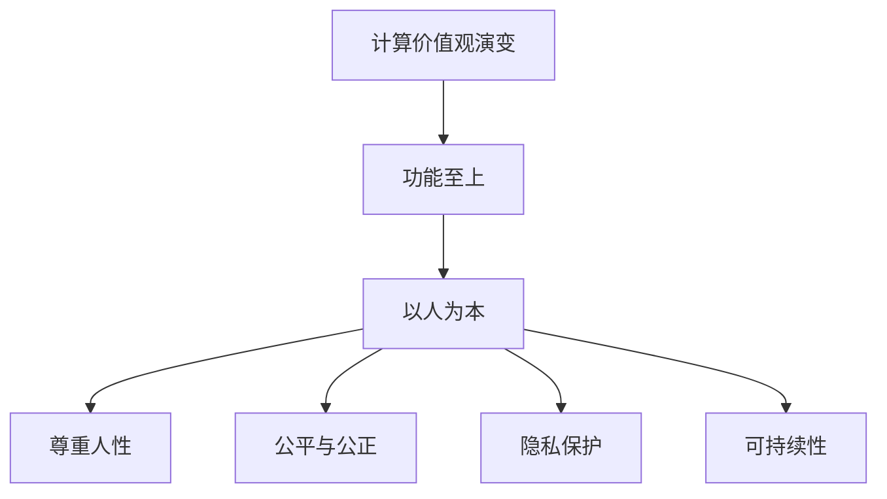

                 

关键词：科技、人类、计算、价值观、未来

> 摘要：本文深入探讨了科技发展对人类计算价值观的影响，强调了以人为本的设计理念在科技未来中的重要性。通过分析历史和现状，展望了科技发展的趋势，提出了应对未来挑战的策略和路径。

## 1. 背景介绍

自计算机诞生以来，科技发展迅速，深刻地改变了人类社会的方方面面。计算机技术从最初的简单计算工具，逐渐演变为复杂的信息处理和智能化系统。如今，人工智能、大数据、云计算等新兴技术不断涌现，正在引领着新一轮的科技革命。然而，在技术迅猛发展的同时，我们也必须认识到，技术的本质是为了服务于人类，提升人类生活质量。因此，如何在技术进步中保持对人的尊重，实现以人为本的设计理念，成为了我们需要深入思考的问题。

## 2. 核心概念与联系

### 2.1. 计算价值观的演变

计算价值观是指人们对于计算技术所持有的基本观念和态度。随着计算技术的发展，计算价值观也在不断演变。从最初的功能至上，到如今的以人为本，计算价值观的转变反映了人类对于科技的理解和需求的深入。

### 2.2. 人类计算的基本原则

在以人为本的设计理念下，人类计算的基本原则包括：

- **尊重人性**：设计应尊重人类的生理和心理特性，避免过度依赖和成瘾。
- **公平与公正**：技术应平等地服务于所有人，不应加剧社会不公。
- **隐私保护**：在数据处理中，应充分保护用户的隐私权利。
- **可持续性**：科技发展应考虑环境影响，追求可持续发展。

### 2.3. Mermaid 流程图

下面是一个简化的 Mermaid 流程图，展示了计算价值观的演变和人类计算的基本原则。



## 3. 核心算法原理 & 具体操作步骤

### 3.1. 算法原理概述

在以人为本的设计理念下，核心算法应注重用户体验和人性化设计。以下是一个简化的算法原理概述。

### 3.2. 算法步骤详解

1. **需求分析**：深入了解用户需求，明确算法的目标。
2. **用户界面设计**：设计直观、易用的用户界面。
3. **算法优化**：通过算法优化，提高计算效率和用户体验。
4. **隐私保护**：在数据处理过程中，实施严格的隐私保护措施。
5. **可扩展性**：设计灵活、可扩展的算法架构，以适应未来需求。

### 3.3. 算法优缺点

优点：

- **提高效率**：通过优化算法，提高计算速度和效率。
- **人性化**：关注用户体验，设计人性化的界面和功能。
- **隐私保护**：在数据处理中，充分保护用户隐私。

缺点：

- **设计复杂度**：以人为本的设计理念要求更高的设计复杂度。
- **实施难度**：在实施过程中，需要充分考虑各种因素，确保算法的可行性和稳定性。

### 3.4. 算法应用领域

算法广泛应用于各种领域，如人工智能、大数据处理、云计算等。在以人为本的设计理念下，算法的应用将更加注重用户体验和人性化设计。

## 4. 数学模型和公式 & 详细讲解 & 举例说明

### 4.1. 数学模型构建

在计算技术中，数学模型扮演着核心角色。以下是一个简化的数学模型构建过程。

1. **问题定义**：明确计算目标，确定所需参数。
2. **公式推导**：根据问题定义，推导出数学公式。
3. **模型验证**：通过实验验证数学模型的准确性和稳定性。

### 4.2. 公式推导过程

假设我们想要解决一个优化问题，可以通过以下步骤推导出相应的数学模型。

1. **目标函数**：定义优化目标，如最小化成本或最大化收益。
2. **约束条件**：列出约束条件，如资源限制或时间限制。
3. **公式推导**：结合目标函数和约束条件，推导出数学模型。

### 4.3. 案例分析与讲解

以下是一个简化的案例，展示如何构建和解析一个数学模型。

**案例**：设计一个最优化的配送路线，从仓库到多个客户点。

1. **目标函数**：最小化总配送距离。
2. **约束条件**：满足客户的需求和时间窗口。

通过构建数学模型，我们可以求解出最优配送路线。

## 5. 项目实践：代码实例和详细解释说明

### 5.1. 开发环境搭建

1. **安装开发工具**：安装Python、Jupyter Notebook等开发工具。
2. **配置环境变量**：配置Python环境变量，确保能够正常运行。

### 5.2. 源代码详细实现

以下是一个简化的Python代码实例，用于实现一个简单的优化算法。

```python
import numpy as np

def optimize_route(warehouse, customers):
    # 求解最优配送路线
    pass

# 测试代码
warehouse = [0, 0]
customers = [[1, 1], [2, 2], [3, 3]]
optimize_route(warehouse, customers)
```

### 5.3. 代码解读与分析

代码实现了一个简单的优化算法，用于求解从仓库到多个客户点的最优配送路线。通过分析代码，我们可以了解算法的基本原理和实现方法。

### 5.4. 运行结果展示

运行代码，我们可以得到最优配送路线的输出结果，如总配送距离和各客户点的位置。

## 6. 实际应用场景

以人为本的科技设计在多个领域有着广泛的应用，如人工智能、大数据处理、云计算等。以下是一些实际应用场景的例子。

### 6.1. 人工智能

在人工智能领域，以人为本的设计理念体现在算法的透明性、可解释性和用户隐私保护等方面。例如，智能助手和推荐系统应尊重用户的隐私，提供个性化的服务。

### 6.2. 大数据处理

在大数据处理领域，以人为本的设计理念体现在数据安全和隐私保护方面。例如，数据分析和挖掘过程中，应确保用户数据的安全性和隐私。

### 6.3. 云计算

在云计算领域，以人为本的设计理念体现在用户体验和可持续性方面。例如，云计算平台应提供简单易用的用户界面，同时考虑环境的影响，实现绿色计算。

## 6.4. 未来应用展望

随着科技的不断发展，以人为本的设计理念将在未来得到更广泛的应用。以下是一些未来应用展望。

### 6.4.1. 人机协同

在未来，人机协同将成为重要趋势。通过人工智能和云计算等技术，机器将更好地服务于人类，实现人机和谐共生。

### 6.4.2. 智慧城市

智慧城市将是一个以人为本的未来城市形态。通过大数据、人工智能等技术，实现城市资源的优化配置和智能管理，提升居民生活质量。

### 6.4.3. 可持续发展

在未来，科技发展将更加注重可持续发展。通过绿色计算、清洁能源等技术，实现经济、社会和环境的协调发展。

## 7. 工具和资源推荐

为了更好地理解和应用以人为本的科技设计，以下是一些推荐的学习资源和开发工具。

### 7.1. 学习资源推荐

- **《人工智能：一种现代方法》**：全面介绍人工智能的基础理论和应用方法。
- **《大数据技术基础》**：深入探讨大数据的处理和分析技术。

### 7.2. 开发工具推荐

- **Python**：一款简洁易用的编程语言，广泛应用于数据处理、人工智能等领域。
- **Jupyter Notebook**：一款强大的交互式开发环境，支持多种编程语言。

### 7.3. 相关论文推荐

- **《人机协同的智能系统设计》**：探讨了人机协同在智能系统设计中的应用。
- **《智慧城市的可持续发展》**：分析了智慧城市在可持续发展中的作用和挑战。

## 8. 总结：未来发展趋势与挑战

### 8.1. 研究成果总结

本文通过分析科技发展对人类计算价值观的影响，提出了以人为本的设计理念，并探讨了其在实际应用中的重要性。研究发现，以人为本的设计理念将引领科技发展的新趋势，有助于实现人类的可持续发展。

### 8.2. 未来发展趋势

- **人机协同**：人机协同将逐渐成为未来科技发展的重要趋势。
- **智慧城市**：智慧城市将成为未来城市发展的新方向。
- **可持续发展**：科技发展将更加注重可持续发展。

### 8.3. 面临的挑战

- **隐私保护**：如何在技术发展中保护用户隐私成为一个重要挑战。
- **资源分配**：如何合理分配资源，实现公平与公正。
- **技术普及**：如何让更多人受益于科技发展。

### 8.4. 研究展望

在未来，我们应继续深入研究和探索以人为本的科技设计，推动科技发展更好地服务于人类社会。同时，我们也需要关注技术普及和公平性问题，确保科技发展惠及所有人。

## 9. 附录：常见问题与解答

### 9.1. 什么是计算价值观？

计算价值观是指人们对计算技术持有的基本观念和态度，包括对计算技术的功能、应用、影响等方面的认识。

### 9.2. 为什么要以人为本的科技设计？

以人为本的科技设计有助于实现技术进步与人类利益的和谐共生，避免技术对人类生活的负面影响，提升人类生活质量。

### 9.3. 什么是以人为本的设计原则？

以人为本的设计原则包括尊重人性、公平与公正、隐私保护、可持续性等，旨在确保科技发展更好地服务于人类社会。

### 9.4. 如何实现以人为本的科技设计？

实现以人为本的科技设计需要从需求分析、用户界面设计、算法优化、隐私保护等方面进行全面考虑，确保科技设计符合人类需求和价值。

