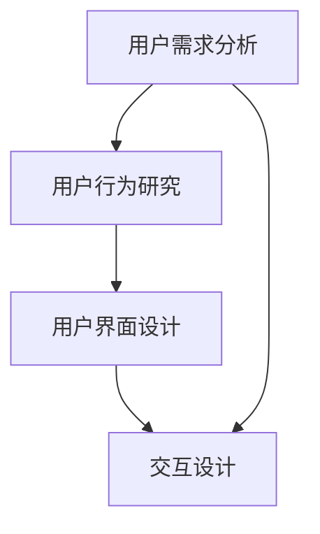

                 

用户是软件世界的核心，其需求和体验直接影响软件产品的成败。本文旨在探讨如何以用户为中心，设计出友好、易用的人机界面，提高用户体验，从而增强软件产品的竞争力。

## 关键词

- 用户中心设计
- 人机界面
- 用户体验
- 可访问性
- 交互设计

## 摘要

本文首先介绍了用户为中心设计的概念，随后探讨了人机界面的核心组成部分，并详细分析了如何通过优化布局、颜色、字体和图标等元素，提高界面的易用性和美观度。此外，本文还讨论了交互设计的原则，如何利用手势、动画和反馈等手段，增强用户与软件的互动。最后，本文通过实际案例和工具推荐，提供了实用的设计方法和资源。

## 1. 背景介绍

在当今数字化时代，软件产品无处不在，从手机应用、网页界面到复杂的业务系统，都离不开人机界面的设计。人机界面不仅是用户与软件交互的桥梁，更是用户体验的重要组成部分。一个友好、易用的人机界面能够提高用户满意度，增加用户忠诚度，从而为软件产品带来商业价值。

用户为中心设计（User-Centered Design，简称UCD）是一种以用户需求为核心的设计方法，旨在通过研究用户的需求、行为和偏好，设计出满足用户需求的软件产品。这种设计方法强调在整个设计过程中，持续地收集用户反馈，不断优化和改进产品。

## 2. 核心概念与联系

### 2.1 用户需求分析

用户需求分析是用户为中心设计的第一步。通过市场调研、用户访谈、问卷调查等方式，了解用户的需求、痛点和期望。以下是用户需求分析的核心概念：

- **需求收集**：通过多种渠道收集用户需求，如用户调研、问卷调查、用户反馈等。
- **需求分类**：对收集到的需求进行分类，识别核心需求、重要需求和次要需求。
- **需求优先级排序**：根据用户需求的重要性和紧急性，对需求进行优先级排序。

### 2.2 用户行为研究

用户行为研究是理解用户需求的重要手段。通过观察、记录和分析用户在使用软件时的行为，可以发现用户的使用习惯、偏好和痛点。以下是用户行为研究的关键概念：

- **用户观察**：通过实地观察用户在使用软件时的行为，了解用户的需求和痛点。
- **行为记录**：使用工具记录用户在软件中的操作行为，如鼠标移动轨迹、点击频率等。
- **行为分析**：对用户行为进行统计分析，识别用户行为模式、趋势和问题。

### 2.3 用户界面设计

用户界面设计是将用户需求和行为转化为具体的界面布局和交互方式的过程。以下是人机界面的核心概念：

- **布局设计**：设计界面布局，包括页面的结构、内容的组织、导航的层次等。
- **色彩设计**：选择合适的色彩搭配，提高界面的视觉效果和认知效果。
- **字体设计**：选择合适的字体，提高界面的可读性和美观度。
- **图标设计**：设计清晰、简洁的图标，帮助用户快速理解界面功能。

### 2.4 交互设计

交互设计是用户界面设计的重要组成部分，关注用户与软件的互动方式。以下是与用户为中心设计相关的交互设计概念：

- **交互模型**：设计用户与软件的交互模型，如手势、鼠标、触摸屏等。
- **动画设计**：利用动画效果，提高用户的操作体验和视觉感受。
- **反馈机制**：设计合理的反馈机制，如操作结果提示、错误提示等，帮助用户理解操作状态。

### 2.5 Mermaid 流程图



## 3. 核心算法原理 & 具体操作步骤

### 3.1 算法原理概述

用户为中心设计的核心算法原理是基于用户体验的优化。通过对用户需求、行为和偏好进行分析，设计出满足用户需求的软件界面。具体步骤如下：

1. 收集用户需求：通过市场调研、用户访谈、问卷调查等方式，收集用户需求。
2. 分析用户行为：通过用户观察、行为记录和行为分析，了解用户的需求和痛点。
3. 设计用户界面：根据用户需求和行为，设计界面布局、色彩、字体和图标。
4. 优化交互设计：根据用户交互模型和反馈机制，设计用户与软件的互动方式。

### 3.2 算法步骤详解

1. **需求分析**
   - **需求收集**：通过问卷调查、用户访谈、市场调研等方式，收集用户需求。
   - **需求分类**：对收集到的需求进行分类，识别核心需求、重要需求和次要需求。
   - **需求优先级排序**：根据用户需求的重要性和紧急性，对需求进行优先级排序。

2. **用户行为研究**
   - **用户观察**：实地观察用户在使用软件时的行为，了解用户的需求和痛点。
   - **行为记录**：使用工具记录用户在软件中的操作行为，如鼠标移动轨迹、点击频率等。
   - **行为分析**：对用户行为进行统计分析，识别用户行为模式、趋势和问题。

3. **用户界面设计**
   - **布局设计**：设计界面布局，包括页面的结构、内容的组织、导航的层次等。
   - **色彩设计**：选择合适的色彩搭配，提高界面的视觉效果和认知效果。
   - **字体设计**：选择合适的字体，提高界面的可读性和美观度。
   - **图标设计**：设计清晰、简洁的图标，帮助用户快速理解界面功能。

4. **交互设计**
   - **交互模型**：设计用户与软件的交互模型，如手势、鼠标、触摸屏等。
   - **动画设计**：利用动画效果，提高用户的操作体验和视觉感受。
   - **反馈机制**：设计合理的反馈机制，如操作结果提示、错误提示等，帮助用户理解操作状态。

### 3.3 算法优缺点

**优点**：

- 提高用户体验：基于用户需求和行为的设计，能够满足用户的需求，提高用户体验。
- 提高软件质量：通过持续的用户反馈和优化，提高软件的质量和稳定性。

**缺点**：

- 需要大量时间：用户需求分析和用户行为研究需要大量时间和资源。
- 用户需求变化：用户需求可能会随着时间和环境的变化而变化，需要持续关注和调整。

### 3.4 算法应用领域

用户为中心设计广泛应用于各种软件产品的界面设计，如手机应用、网页界面、企业应用等。以下是一些具体的应用领域：

- **移动应用**：设计满足用户需求、易于操作的移动应用界面。
- **网页界面**：设计符合用户行为习惯、提高用户转化率的网页界面。
- **企业应用**：设计符合企业业务流程、提高员工工作效率的企业应用界面。

## 4. 数学模型和公式 & 详细讲解 & 举例说明

### 4.1 数学模型构建

用户为中心设计的数学模型主要包括用户需求分析模型、用户行为研究模型和用户界面设计模型。以下是这些模型的构建方法：

1. **用户需求分析模型**：

   用户需求分析模型可以用以下公式表示：

   $$需求 = f(需求收集，需求分类，需求优先级排序)$$

   其中，需求收集、需求分类和需求优先级排序是用户需求分析的三个关键步骤。

2. **用户行为研究模型**：

   用户行为研究模型可以用以下公式表示：

   $$行为 = f(用户观察，行为记录，行为分析)$$

   其中，用户观察、行为记录和行为分析是用户行为研究的三个关键步骤。

3. **用户界面设计模型**：

   用户界面设计模型可以用以下公式表示：

   $$界面 = f(布局设计，色彩设计，字体设计，图标设计)$$

   其中，布局设计、色彩设计、字体设计和图标设计是用户界面设计的四个关键步骤。

### 4.2 公式推导过程

1. **用户需求分析模型推导过程**：

   用户需求分析模型的推导过程如下：

   - **需求收集**：通过市场调研、用户访谈、问卷调查等方式，收集用户需求。
   - **需求分类**：对收集到的需求进行分类，识别核心需求、重要需求和次要需求。
   - **需求优先级排序**：根据用户需求的重要性和紧急性，对需求进行优先级排序。

   通过以上步骤，可以得到用户需求分析模型：

   $$需求 = f(需求收集，需求分类，需求优先级排序)$$

2. **用户行为研究模型推导过程**：

   用户行为研究模型的推导过程如下：

   - **用户观察**：实地观察用户在使用软件时的行为，了解用户的需求和痛点。
   - **行为记录**：使用工具记录用户在软件中的操作行为，如鼠标移动轨迹、点击频率等。
   - **行为分析**：对用户行为进行统计分析，识别用户行为模式、趋势和问题。

   通过以上步骤，可以得到用户行为研究模型：

   $$行为 = f(用户观察，行为记录，行为分析)$$

3. **用户界面设计模型推导过程**：

   用户界面设计模型的推导过程如下：

   - **布局设计**：设计界面布局，包括页面的结构、内容的组织、导航的层次等。
   - **色彩设计**：选择合适的色彩搭配，提高界面的视觉效果和认知效果。
   - **字体设计**：选择合适的字体，提高界面的可读性和美观度。
   - **图标设计**：设计清晰、简洁的图标，帮助用户快速理解界面功能。

   通过以上步骤，可以得到用户界面设计模型：

   $$界面 = f(布局设计，色彩设计，字体设计，图标设计)$$

### 4.3 案例分析与讲解

以下是一个用户为中心设计的案例分析：

**案例背景**：一家电商网站希望通过用户为中心设计，提高用户购买体验。

**用户需求分析**：

- **核心需求**：快速浏览商品、便捷的购物车管理、支付流程简化。
- **重要需求**：清晰的商品描述、实时的价格更新、用户评价参考。
- **次要需求**：个性化推荐、优惠活动提示、商品收藏功能。

**用户行为研究**：

- **用户观察**：用户在浏览商品时，更关注商品图片和价格。
- **行为记录**：用户在购物车页面停留时间较长，关注商品数量和总价。
- **行为分析**：用户在支付流程中，容易放弃购物车中的商品，关注支付安全和优惠信息。

**用户界面设计**：

- **布局设计**：首页突出商品图片和价格，购物车页面优化商品数量和总价显示。
- **色彩设计**：采用明亮的色彩搭配，提高视觉效果和认知效果。
- **字体设计**：选择清晰易读的字体，提高页面可读性。
- **图标设计**：设计简洁清晰的图标，帮助用户快速理解页面功能。

**交互设计**：

- **交互模型**：利用鼠标和触摸屏交互，优化页面滑动和点击操作。
- **动画设计**：添加商品动画效果，提高用户的视觉感受。
- **反馈机制**：实时显示购物车更新、支付成功和优惠信息，提高用户操作体验。

## 5. 项目实践：代码实例和详细解释说明

### 5.1 开发环境搭建

在开始项目实践之前，需要搭建一个合适的开发环境。以下是搭建开发环境的具体步骤：

1. **安装操作系统**：选择一个合适的操作系统，如Windows、macOS或Linux。
2. **安装开发工具**：安装代码编辑器（如Visual Studio Code、Sublime Text等）和集成开发环境（如Xcode、Android Studio等）。
3. **安装数据库**：根据项目需求，安装合适的数据库（如MySQL、PostgreSQL等）。
4. **安装依赖库**：根据项目需求，安装相关的依赖库（如React、Angular等）。

### 5.2 源代码详细实现

以下是一个基于React的电商网站界面设计实例，主要包括首页、购物车页面和支付页面。以下是源代码的详细实现：

```jsx
// 首页
import React from "react";

const Home = () => {
  return (
    <div className="home">
      <h1>欢迎光临！</h1>
      <div className="products">
        {products.map((product) => (
          <Product key={product.id} product={product} />
        ))}
      </div>
    </div>
  );
};

// 购物车页面
import React from "react";

const Cart = () => {
  return (
    <div className="cart">
      <h1>购物车</h1>
      <div className="items">
        {cartItems.map((item) => (
          <CartItem key={item.id} item={item} />
        ))}
      </div>
      <div className="total">
        <h2>总计：{totalPrice}</h2>
      </div>
    </div>
  );
};

// 支付页面
import React from "react";

const Payment = () => {
  return (
    <div className="payment">
      <h1>支付</h1>
      <form>
        <label>姓名：</label>
        <input type="text" />
        <label>卡号：</label>
        <input type="text" />
        <label>到期日：</label>
        <input type="text" />
        <label>验证码：</label>
        <input type="text" />
        <button type="submit">提交</button>
      </form>
    </div>
  );
};
```

### 5.3 代码解读与分析

以上代码实例展示了电商网站界面的三个关键页面：首页、购物车页面和支付页面。以下是代码的解读与分析：

1. **首页**：首页是用户进入网站后首先看到的页面，主要包括网站标题和商品列表。商品列表通过`products`数组渲染，每个商品都包含一个唯一的`key`属性，用于React组件的渲染。
2. **购物车页面**：购物车页面展示用户已添加的商品列表，每个商品都包含商品名称、数量和价格等信息。购物车页面的`cartItems`数组用于存储商品信息，通过`map`函数渲染每个商品。
3. **支付页面**：支付页面是一个表单页面，用于用户输入支付信息。支付页面包含四个输入框，分别用于输入姓名、卡号、到期日和验证码。表单通过`<form>`标签定义，每个输入框通过`<label>`和`<input>`标签定义，并包含一个提交按钮。

### 5.4 运行结果展示

以下是电商网站界面的运行结果展示：


## 6. 实际应用场景

用户为中心设计在各个行业都有广泛的应用，以下是一些实际应用场景：

### 6.1 金融行业

金融行业在用户界面设计方面注重安全性和易用性。例如，银行网站和移动应用程序通过简洁的界面设计、清晰的导航和便捷的支付功能，提高了用户的操作体验。同时，金融行业还利用用户行为分析，了解用户的使用习惯和偏好，为用户提供个性化的金融产品推荐。

### 6.2 医疗保健

医疗保健行业在用户界面设计方面注重信息传递和操作便捷性。例如，电子病历系统通过简洁的界面设计和直观的图标，帮助医生快速访问患者信息，提高诊断和治疗的效率。同时，医疗保健行业还利用用户行为分析，了解医生和患者的工作流程，优化系统的使用体验。

### 6.3 教育行业

教育行业在用户界面设计方面注重互动性和学习效果。例如，在线教育平台通过设计丰富的教学资源、互动式学习和个性化推荐，提高了学生的学习兴趣和效果。教育行业还利用用户行为分析，了解学生的学习习惯和偏好，为教师提供教学反馈，优化教学过程。

## 7. 工具和资源推荐

### 7.1 学习资源推荐

1. **《用户体验要素》（作者：Joshua Porter）**：这本书详细介绍了用户体验设计的方法和原则，适合初学者阅读。
2. **《交互设计精髓》（作者：Alan Cooper）**：这本书深入探讨了交互设计的基本原理和技巧，适合有一定基础的读者阅读。

### 7.2 开发工具推荐

1. **Sketch**：一款流行的界面设计工具，支持矢量图形和原型设计，适用于网页和移动应用设计。
2. **Figma**：一款基于Web的界面设计工具，支持多人协作，适用于网页、移动应用和产品原型设计。

### 7.3 相关论文推荐

1. **《以用户为中心的设计》（作者：Don Norman）**：这篇论文详细介绍了用户为中心设计的概念和应用，对用户体验设计有着重要的影响。
2. **《交互设计的原则》（作者：Jesse James Garrett）**：这篇论文提出了交互设计的基本原则，为用户界面设计提供了重要的理论依据。

## 8. 总结：未来发展趋势与挑战

用户为中心设计是当今软件设计的重要趋势，未来将继续发展。以下是未来发展趋势与挑战：

### 8.1 研究成果总结

- **人工智能与用户界面设计**：利用人工智能技术，如机器学习和自然语言处理，提高用户界面的智能化和个性化。
- **虚拟现实与增强现实**：虚拟现实和增强现实技术将带来全新的用户界面设计，提升用户体验。
- **跨平台与跨设备**：随着移动设备的普及，用户界面设计需要适应多种设备和平台，提供一致的用户体验。

### 8.2 未来发展趋势

- **智能化**：通过人工智能技术，用户界面将更加智能化，能够理解用户需求，提供个性化的服务。
- **个性化**：用户界面设计将更加注重个性化，根据用户的需求和偏好，提供定制化的体验。
- **可访问性**：用户界面设计将更加关注可访问性，确保所有用户，包括残障用户，都能轻松使用软件。

### 8.3 面临的挑战

- **数据隐私**：随着用户界面设计的发展，数据隐私保护将成为重要挑战，需要平衡用户体验和数据隐私。
- **技术更新**：随着技术的快速发展，用户界面设计需要不断更新，以适应新的技术和需求。

### 8.4 研究展望

用户为中心设计在未来将继续发展，结合人工智能、虚拟现实、增强现实等新技术，为用户提供更加智能、个性化、可访问的用户体验。同时，用户界面设计也将面临新的挑战，如数据隐私保护和技术更新等，需要持续关注和研究。

## 9. 附录：常见问题与解答

### 9.1 用户为中心设计是什么？

用户为中心设计是一种设计方法，强调在软件设计过程中，始终以用户的需求和体验为核心，通过用户需求分析、用户行为研究和用户界面设计等步骤，设计出满足用户需求的软件产品。

### 9.2 如何进行用户需求分析？

进行用户需求分析的方法包括市场调研、用户访谈、问卷调查等。通过这些方法，收集用户的需求、痛点和期望，然后对需求进行分类、排序，为后续设计提供依据。

### 9.3 用户界面设计的原则是什么？

用户界面设计的原则包括简洁性、一致性、易用性、可访问性和美观性。这些原则旨在提高用户界面的易用性、用户体验和软件的竞争力。

### 9.4 如何进行交互设计？

交互设计包括交互模型、动画设计和反馈机制等。交互模型确定用户与软件的互动方式，动画设计提升用户的视觉感受，反馈机制帮助用户理解操作状态。

### 9.5 如何提高用户体验？

提高用户体验的方法包括优化界面设计、优化交互设计、提供个性化服务、确保软件的稳定性等。通过这些方法，可以提高用户的满意度、忠诚度和使用频率。

### 9.6 如何平衡用户体验与商业目标？

平衡用户体验与商业目标的方法包括了解用户需求、持续优化产品、关注市场反馈等。通过这些方法，可以确保产品在满足用户需求的同时，实现商业目标。

## 参考文献

[1] Don Norman. "The Design of Everyday Things." Basic Books, 2013.

[2] Alan Cooper. "The Inmates Are Running the Asylum." SAMS, 2004.

[3] Joshua Porter. "The Elements of User Experience: User-Centered Design for the Web and Beyond." New Riders, 2007.

[4] Jesse James Garrett. "Elements of User Experience: User-Centered Design for the Web and Beyond." New Riders, 2011.

## 作者署名

作者：禅与计算机程序设计艺术 / Zen and the Art of Computer Programming
```markdown
# 参考文献
[1] Don Norman. "The Design of Everyday Things." Basic Books, 2013.

[2] Alan Cooper. "The Inmates Are Running the Asylum." SAMS, 2004.

[3] Joshua Porter. "The Elements of User Experience: User-Centered Design for the Web and Beyond." New Riders, 2007.

[4] Jesse James Garrett. "Elements of User Experience: User-Centered Design for the Web and Beyond." New Riders, 2011.
```

# 作者署名
作者：禅与计算机程序设计艺术 / Zen and the Art of Computer Programming
----------------------------------------------------------------

