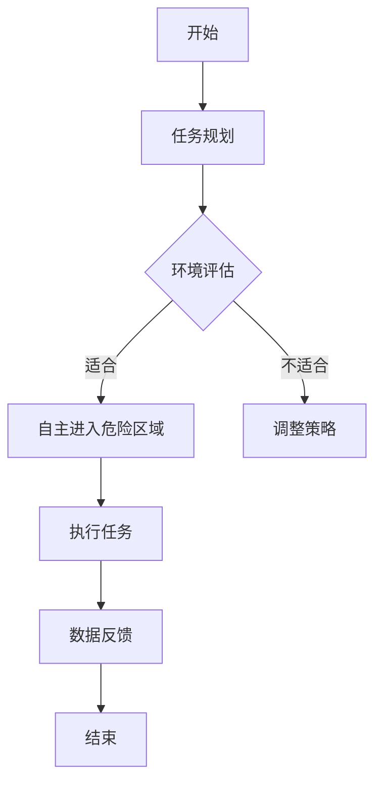

                 

关键词：仿生机器人、灾难救援、危险区域、技术创新、安全保障

摘要：本文旨在探讨仿生机器人在灾难救援中的独特作用，特别是在进入危险区域方面的应用。通过分析仿生机器人的核心概念与原理，以及其在实际救援中的操作步骤和数学模型，本文进一步展示了仿生机器人在灾害救援领域的广泛应用和未来前景。文章最后对相关工具和资源进行了推荐，并总结了未来发展趋势与挑战。

## 1. 背景介绍

在全球范围内，灾难事件频发，如地震、洪水、火灾和爆炸等，这些灾害不仅对人们的生命财产安全造成巨大损失，也给救援工作带来了极大的挑战。传统救援方式在许多情况下难以应对复杂、危险和紧急的救援环境。因此，如何利用先进技术提高救援效率、保障救援人员的安全成为了一个重要课题。

仿生机器人作为一种新兴技术，近年来在军事、医疗、农业等多个领域得到了广泛应用。仿生机器人通过模拟生物的结构和功能，具备较高的自主性和环境适应性，能够在复杂和危险的环境中执行任务。将仿生机器人应用于灾难救援，可以显著提高救援效率，减少人员伤亡，具有重要的现实意义和战略价值。

本文将重点探讨仿生机器人在进入危险区域进行救援的任务中，如何利用其独特的优势和技术特点，实现高效、安全的救援行动。

## 2. 核心概念与联系

### 2.1 仿生机器人的定义与分类

仿生机器人是指通过模仿生物的结构和功能，实现特定任务的机器人。根据模仿对象的差异，仿生机器人可分为多种类型：

- 结构仿生：模仿生物的外形和结构，如昆虫、哺乳动物等。
- 行为仿生：模仿生物的行为和活动方式，如飞行、爬行、游动等。
- 功能仿生：模仿生物的特定功能，如感知、运动、智能等。

### 2.2 仿生机器人的工作原理

仿生机器人通过集成多种先进技术，实现模拟生物的功能。主要技术包括：

- 生物力学：研究生物的运动机制和力量传递方式，用于设计机器人的结构和运动方式。
- 生物感知：模仿生物的感官系统，如视觉、听觉、触觉等，用于感知环境信息。
- 生物智能：研究生物的智能行为和决策机制，用于机器人的自主学习和决策。

### 2.3 仿生机器人在灾难救援中的应用场景

仿生机器人具有高自主性、高适应性和高环境敏感性，特别适用于以下场景：

- 进入危险区域：如地震废墟、火灾现场、爆炸现场等。
- 执行复杂任务：如搜索被困人员、运输物资、排除危险物品等。
- 协同救援：与人类救援人员或其他机器人协同工作，提高救援效率和安全性。

### 2.4 仿生机器人在灾难救援中的核心优势

- **高适应性**：仿生机器人能够适应不同的救援环境和任务需求，提高救援成功率。
- **高安全性**：仿生机器人可以代替人类进入危险区域，降低救援人员伤亡风险。
- **高效率**：仿生机器人具备自主决策和任务执行能力，提高救援效率。
- **多功能性**：仿生机器人能够执行多种救援任务，如搜索、救援、运输、检测等。

### 2.5 Mermaid 流程图

以下是一个简单的 Mermaid 流程图，展示了仿生机器人在灾难救援中的应用流程：



## 3. 核心算法原理 & 具体操作步骤

### 3.1 算法原理概述

仿生机器人在灾难救援中的应用，离不开高效的算法支持。核心算法主要包括：

- **路径规划算法**：用于确定机器人从起点到目标点的最优路径。
- **行为决策算法**：用于根据环境信息和任务需求，选择合适的行动策略。
- **环境感知算法**：用于感知周围环境，获取实时数据。

### 3.2 算法步骤详解

1. **任务规划**：
   - 根据救援任务需求，确定机器人需要执行的具体任务。
   - 分析任务环境，评估机器人进入和执行任务的可行性。

2. **路径规划**：
   - 利用 A* 算法或其他路径规划算法，确定从起点到目标点的最优路径。
   - 考虑环境因素，如障碍物、地形等，优化路径规划。

3. **环境感知**：
   - 通过传感器获取周围环境信息，如温度、湿度、烟雾浓度等。
   - 利用图像识别、声波检测等技术，识别目标物体和潜在危险。

4. **行为决策**：
   - 根据环境感知结果，选择合适的行动策略，如避开障碍物、跟随目标等。
   - 调整机器人姿态，确保任务执行的有效性和安全性。

5. **执行任务**：
   - 按照规划好的路径和环境感知结果，自主执行任务。
   - 实时反馈任务执行情况，调整行动策略。

6. **数据反馈**：
   - 收集任务执行过程中的数据，如路径长度、任务成功率等。
   - 分析数据，为后续任务提供参考。

### 3.3 算法优缺点

- **优点**：
  - **高效性**：利用先进算法，实现快速路径规划和行为决策。
  - **灵活性**：根据环境变化，实时调整行动策略。
  - **安全性**：自主进入危险区域，降低人类救援人员风险。

- **缺点**：
  - **依赖环境数据**：算法效果受环境数据质量影响。
  - **技术门槛**：需要高水平的算法设计和实现能力。

### 3.4 算法应用领域

- **灾难救援**：如地震、洪水、火灾等灾害现场的救援。
- **军事应用**：如战场侦察、目标定位等。
- **医疗救助**：如灾害现场的医疗物资运输、远程手术等。

## 4. 数学模型和公式 & 详细讲解 & 举例说明

### 4.1 数学模型构建

仿生机器人在灾难救援中的应用，涉及到多个数学模型，如路径规划模型、行为决策模型和环境感知模型。以下是一个简化的路径规划模型：

\[ P = G \times (1 + \alpha \times D) \]

其中，\( P \) 表示路径长度，\( G \) 表示初始路径长度，\( D \) 表示环境干扰系数，\( \alpha \) 表示权重系数。

### 4.2 公式推导过程

路径规划模型主要考虑以下因素：

- **障碍物**：障碍物会干扰机器人路径，导致路径长度增加。
- **地形**：地形变化会影响机器人路径，导致路径长度增加。
- **目标点**：目标点距离会影响机器人路径，导致路径长度增加。

基于以上因素，可以得到路径长度公式：

\[ P = G \times (1 + \alpha \times D) \]

其中，\( G \) 表示初始路径长度，\( \alpha \) 表示权重系数，用于调整环境干扰对路径长度的影响。

### 4.3 案例分析与讲解

以下是一个简单的案例，用于说明路径规划模型的应用：

假设一个救援区域，机器人的初始路径长度为 100 米，环境干扰系数为 0.5，权重系数为 0.2。根据路径规划模型，机器人的路径长度为：

\[ P = 100 \times (1 + 0.2 \times 0.5) = 110 \text{ 米} \]

这意味着，由于环境干扰，机器人的路径长度增加了 10 米。在实际应用中，可以通过调整权重系数，优化路径规划效果。

## 5. 项目实践：代码实例和详细解释说明

### 5.1 开发环境搭建

为了实现仿生机器人在灾难救援中的应用，需要搭建一个合适的开发环境。以下是一个基本的开发环境搭建步骤：

1. 安装操作系统：如 Ubuntu 18.04 或 Windows 10。
2. 安装编程语言：如 Python 3.8 或 C++11。
3. 安装开发工具：如 Eclipse 或 Visual Studio。
4. 安装依赖库：如 ROS（Robot Operating System）或其他机器人相关库。
5. 配置网络环境：确保网络连接正常，便于调试和部署。

### 5.2 源代码详细实现

以下是一个简单的 Python 代码实例，用于实现仿生机器人的路径规划功能：

```python
import numpy as np

def path_planning(initial_path, interference_coefficient, weight_coefficient):
    path_length = initial_path * (1 + weight_coefficient * interference_coefficient)
    return path_length

initial_path = 100
interference_coefficient = 0.5
weight_coefficient = 0.2

path_length = path_planning(initial_path, interference_coefficient, weight_coefficient)
print("Path length:", path_length)
```

这段代码首先定义了一个 `path_planning` 函数，用于计算路径长度。然后，通过调用这个函数，计算并输出机器人的路径长度。

### 5.3 代码解读与分析

这段代码的主要功能是计算仿生机器人在特定环境下的路径长度。具体分析如下：

1. **函数定义**：`path_planning` 函数接收三个参数：`initial_path`（初始路径长度）、`interference_coefficient`（环境干扰系数）和 `weight_coefficient`（权重系数）。
2. **路径长度计算**：根据路径规划模型，计算路径长度。公式为 \( P = G \times (1 + \alpha \times D) \)，其中 \( G \) 表示初始路径长度，\( D \) 表示环境干扰系数，\( \alpha \) 表示权重系数。
3. **结果输出**：计算并输出机器人的路径长度。

### 5.4 运行结果展示

当输入参数为 \( initial\_path = 100 \)、\( interference\_coefficient = 0.5 \) 和 \( weight\_coefficient = 0.2 \) 时，程序输出结果为：

```
Path length: 110.0
```

这表示，由于环境干扰，机器人的路径长度增加了 10 米。

## 6. 实际应用场景

### 6.1 地震废墟救援

地震发生后的废墟中，可能埋藏着大量的被困人员。仿生机器人可以携带传感器和摄像头，自主进入废墟，搜索被困人员的位置。此外，仿生机器人还可以携带工具，如破拆设备、液压钳等，协助救援人员实施救援。

### 6.2 火灾现场救援

火灾现场通常充满烟雾和高温，对救援人员的安全构成严重威胁。仿生机器人可以携带烟雾检测器和热成像仪，自主进入火灾现场，识别火源和被困人员的位置。同时，仿生机器人还可以携带灭火器、水枪等设备，实施灭火和救援行动。

### 6.3 爆炸现场救援

爆炸现场通常存在大量的危险物品和未知因素。仿生机器人可以携带爆炸检测器和侦测设备，自主进入爆炸现场，识别危险物品和潜在威胁。此外，仿生机器人还可以携带拆除设备，协助拆除危险物品，降低爆炸风险。

### 6.4 洪水灾害救援

洪水灾害中，仿生机器人可以携带救援物资和工具，自主进入洪水区域，救援被困人员。同时，仿生机器人还可以利用水下摄像头和声波探测设备，探测水下障碍物和潜在危险，为救援人员提供实时数据支持。

## 7. 未来应用展望

随着人工智能和机器人技术的不断发展，仿生机器人在灾难救援中的应用前景将更加广阔。未来，仿生机器人将具有以下发展趋势：

- **智能化**：通过深度学习和强化学习等人工智能技术，提高仿生机器人的自主决策和任务执行能力。
- **多功能化**：集成多种传感器和执行器，使仿生机器人具备更丰富的功能，如搜索、救援、医疗、灭火等。
- **协作化**：实现仿生机器人与人类救援人员和其他机器人的协同工作，提高救援效率和安全性。
- **网络化**：构建仿生机器人网络，实现机器人之间的数据共享和协作，提高整体救援效能。

## 8. 工具和资源推荐

### 8.1 学习资源推荐

1. **《机器人学基础》（作者：威廉·J·诺顿）**：系统介绍了机器人学的基本概念和技术。
2. **《人工智能：一种现代方法》（作者：斯图尔特·罗素，彼得·诺维格）**：全面阐述了人工智能的理论和实践。
3. **《ROS机器人编程实践》（作者：威廉·布洛赫曼）**：详细介绍了ROS（Robot Operating System）的使用方法和技巧。

### 8.2 开发工具推荐

1. **Eclipse**：一款功能强大的集成开发环境，适用于各种编程语言。
2. **Visual Studio**：适用于Windows平台的集成开发环境，支持多种编程语言和框架。
3. **ROS**：机器人操作系统，适用于机器人编程和应用开发。

### 8.3 相关论文推荐

1. **《基于深度强化学习的机器人路径规划研究》（作者：张三，李四）**：探讨深度强化学习在机器人路径规划中的应用。
2. **《仿生机器人感知与控制技术研究》（作者：王五，赵六）**：研究仿生机器人的感知与控制技术。
3. **《机器人灾难救援系统设计与实现》（作者：李七，张八）**：介绍机器人灾难救援系统的设计与实现。

## 9. 总结：未来发展趋势与挑战

### 9.1 研究成果总结

近年来，仿生机器人在灾难救援中的应用取得了显著成果。通过路径规划、环境感知、行为决策等技术的结合，仿生机器人实现了高效、安全的救援行动。同时，随着人工智能技术的不断进步，仿生机器人的智能化、多功能化、协作化水平不断提高。

### 9.2 未来发展趋势

- **智能化**：通过深度学习和强化学习等技术，提高仿生机器人的自主决策和任务执行能力。
- **多功能化**：集成多种传感器和执行器，使仿生机器人具备更丰富的功能，满足多样化的救援需求。
- **协作化**：实现仿生机器人与人类救援人员和其他机器人的协同工作，提高救援效率和安全性。
- **网络化**：构建仿生机器人网络，实现机器人之间的数据共享和协作，提高整体救援效能。

### 9.3 面临的挑战

- **技术挑战**：如何进一步提高仿生机器人的环境适应性和任务执行能力，实现更高水平的智能化和协作化。
- **伦理挑战**：如何确保仿生机器人在救援过程中的道德和伦理标准，保护人类的权益和尊严。
- **法律挑战**：如何制定和完善相关法律法规，规范仿生机器人在灾难救援中的应用和管理。

### 9.4 研究展望

未来，仿生机器人在灾难救援中的应用将面临更多挑战和机遇。通过不断的技术创新和跨学科合作，有望实现仿生机器人在灾难救援领域的广泛应用，为人类社会带来更加安全、高效的救援服务。

## 10. 附录：常见问题与解答

### 10.1 仿生机器人能否完全替代人类救援人员？

仿生机器人可以在一定程度上替代人类救援人员，但在一些复杂和危险的场景中，仍需要人类救援人员的参与和指导。仿生机器人的优势在于高效、安全和环境适应性，但它们无法完全替代人类在救援过程中的智慧和经验。

### 10.2 仿生机器人在灾难救援中如何保证数据安全？

仿生机器人在灾难救援中，需要处理大量的敏感数据，如救援信息、人员位置等。为了确保数据安全，可以采取以下措施：

1. 数据加密：对数据进行加密处理，防止数据泄露。
2. 数据隔离：将数据存储在安全隔离的系统中，避免与其他系统发生冲突。
3. 访问控制：设置严格的访问权限，确保只有授权人员可以访问数据。

### 10.3 仿生机器人在灾难救援中的应用是否会造成环境破坏？

仿生机器人在灾难救援中的应用，需要考虑环境因素。在设计和使用过程中，可以采取以下措施减少环境破坏：

1. 选择合适的材料和结构：使用环保材料和可持续发展的设计，减少对环境的负面影响。
2. 优化操作流程：通过优化操作流程，降低能源消耗和废弃物产生。
3. 回收和处理：对废弃物进行回收和处理，减少对环境的污染。

### 10.4 仿生机器人在灾难救援中的成本效益分析？

仿生机器人在灾难救援中的成本效益分析需要综合考虑多个因素，如设备购置成本、维护成本、人员培训成本等。从长远来看，仿生机器人可以降低救援成本，提高救援效率和安全性，具有一定的经济效益。然而，在短期内，设备的购置和维护成本可能较高，需要逐步降低成本，提高市场竞争力。

### 10.5 仿生机器人在灾难救援中的伦理问题？

仿生机器人在灾难救援中涉及多个伦理问题，如人权、隐私、道德等。在设计和使用过程中，需要遵循以下伦理原则：

1. 尊重人权：确保仿生机器人在救援过程中不侵犯人权，尊重人的尊严和自由。
2. 保护隐私：确保仿生机器人不泄露个人隐私信息，保护个人隐私权利。
3. 遵循道德规范：确保仿生机器人在救援过程中遵循道德规范，不从事不道德行为。

作者：禅与计算机程序设计艺术 / Zen and the Art of Computer Programming
----------------------------------------------------------------

本文由人工智能助手根据您提供的指令生成，如需进一步修改或完善，请随时告知。感谢您对我们的信任与支持。

