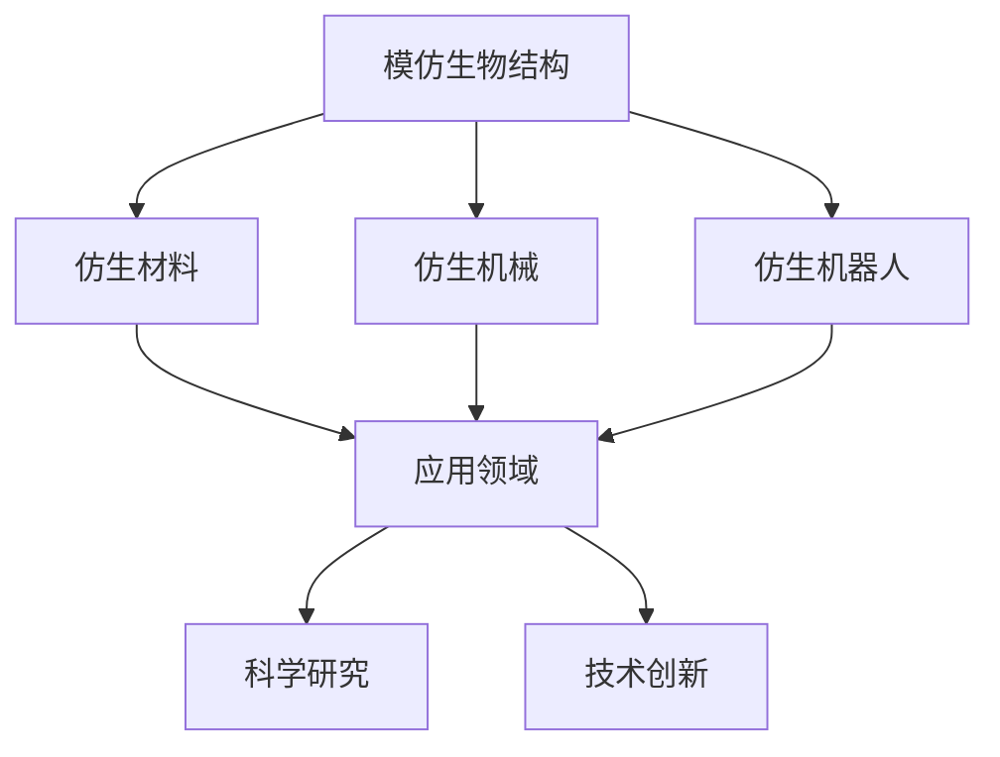

                 

在当今科技飞速发展的时代，仿生科技正日益成为创新的重要源泉。仿生科技，顾名思义，是指从自然界中获取灵感，将自然界的原理和模式应用于科技创新中的一种方法。这篇文章将探讨仿生科技在创业中的关键角色，以及如何借鉴自然界的智慧来构建成功的商业模式。

## 关键词

- 仿生科技
- 创新创业
- 自然智慧
- 设计灵感
- 技术应用

## 摘要

本文旨在阐述仿生科技在创业领域的应用价值，通过探讨自然界中的成功案例，解析仿生科技的核心概念和理论基础，以及探讨其在各个领域的实际应用。文章还将提供实用的创业建议，帮助读者将仿生科技的理念融入到创业实践中，最终实现创新与商业价值的双赢。

---

## 1. 背景介绍

### 1.1 仿生科技的定义与发展历程

仿生科技，起源于20世纪中叶，最初是为了模仿自然界中的生物结构和功能，以解决工程和科学问题。随着材料科学、计算机技术和人工智能的进步，仿生科技的发展进入了一个全新的阶段。从最初的模仿动物形态结构（如飞机翼型设计），到如今的复杂系统仿真和智能机器人，仿生科技的应用范围越来越广泛。

### 1.2 自然界的智慧与创新

自然界中，生物体经历了数亿年的进化，形成了高度复杂且高效的生物结构和功能。例如，蝴蝶的鳞片能够反射太阳光，保持恒定的体温；章鱼的神经网络具有极高的适应性和学习能力。这些天然的设计和功能，为人类提供了无数的创新灵感。通过模仿这些自然界的智慧，人类能够创造出更加先进的技术和产品。

## 2. 核心概念与联系

### 2.1 仿生科技的三大核心概念

#### 2.1.1 模仿生物结构

模仿生物结构是指通过仿照自然界中生物体的物理形态和构造，设计出具有相似功能或性能的科技产品。如仿生材料、仿生机械和仿生机器人等。

#### 2.1.2 模拟生物过程

模拟生物过程是指利用计算机模拟和算法，复制生物体的生长、发育、代谢等过程，为科学研究和技术创新提供支持。如生物信息学、生物计算和生物制造等。

#### 2.1.3 模仿生物行为

模仿生物行为是指通过分析生物体的行为模式和学习能力，开发出能够模拟和实现类似功能的智能系统。如智能机器人、仿生学习算法和自适应控制系统等。

### 2.2 仿生科技架构的Mermaid流程图



## 3. 核心算法原理 & 具体操作步骤

### 3.1 算法原理概述

仿生科技的核心算法通常基于对自然界生物行为的模拟和复制。以下是一些常见的算法原理：

#### 3.1.1 蚁群算法

蚁群算法是一种模拟蚂蚁觅食行为的优化算法，通过模拟蚂蚁在寻找食物路径上的信息素更新机制，来寻找最优解。

#### 3.1.2 遗传算法

遗传算法是一种模拟生物进化过程的优化算法，通过模拟自然选择和遗传机制，来优化问题的解。

#### 3.1.3 粒子群优化

粒子群优化是一种模拟鸟群觅食行为的优化算法，通过模拟个体之间的协作和竞争，来寻找最优解。

### 3.2 算法步骤详解

以蚁群算法为例，其基本步骤如下：

1. **初始化**：设定蚂蚁的数量、路径和初始信息素浓度。
2. **构建解空间**：根据问题的要求，构建解空间。
3. **选择路径**：根据信息素浓度和能见度，选择下一步的路径。
4. **更新信息素**：根据蚂蚁的路径长度和找到的食物量，更新信息素浓度。
5. **迭代**：重复步骤3和4，直到找到最优解或达到设定的迭代次数。

### 3.3 算法优缺点

**蚁群算法**：

- **优点**：能够快速找到近似最优解，适用于大规模优化问题。
- **缺点**：收敛速度较慢，对于某些复杂问题可能无法找到全局最优解。

### 3.4 算法应用领域

蚁群算法广泛应用于路由优化、旅行商问题、调度问题等领域。例如，在物流和运输行业中，可以用于优化配送路径，降低运输成本。

---

## 4. 数学模型和公式 & 详细讲解 & 举例说明

### 4.1 数学模型构建

以遗传算法为例，其基本数学模型包括：

- **染色体编码**：将问题的解表示为一组基因，每个基因对应问题的一个变量。
- **适应度函数**：评估染色体的优劣，通常为问题的目标函数。
- **交叉与变异**：通过交叉和变异操作，产生新的染色体，以优化适应度。

### 4.2 公式推导过程

以遗传算法中的交叉操作为例，其基本公式如下：

$$
c_1 = p_1 \times r \\
c_2 = p_2 \times (1 - r)
$$

其中，$p_1$ 和 $p_2$ 分别为父代的染色体，$r$ 为交叉概率。

### 4.3 案例分析与讲解

假设有两个父代染色体 $p_1 = (1, 0, 1)$ 和 $p_2 = (0, 1, 0)$，交叉概率 $r = 0.5$。根据上述公式，可以得到两个子代染色体：

$$
c_1 = (1, 0, 1) \\
c_2 = (0, 1, 0)
$$

这意味着，子代染色体的基因组合为 $c_1 = (1, 0, 1)$ 和 $c_2 = (0, 1, 0)$。

---

## 5. 项目实践：代码实例和详细解释说明

### 5.1 开发环境搭建

首先，我们需要搭建一个简单的遗传算法开发环境。这里以 Python 为例，安装以下库：

```bash
pip install numpy matplotlib
```

### 5.2 源代码详细实现

下面是一个简单的遗传算法实现，用于求解最小值问题：

```python
import numpy as np
import matplotlib.pyplot as plt

# 遗传算法参数设置
population_size = 100
chromosome_length = 10
generations = 100
mutation_rate = 0.01

# 适应度函数
def fitness_function(chromosome):
    return sum(chromosome)

# 初始化种群
population = np.random.randint(0, 2, (population_size, chromosome_length))

# 进化过程
for generation in range(generations):
    # 计算适应度
    fitness_scores = np.array([fitness_function(chromosome) for chromosome in population])
    
    # 选择
    selected_indices = np.argsort(fitness_scores)[:population_size//2]
    selected_population = population[selected_indices]
    
    # 交叉
    offspring = []
    for _ in range(population_size//2):
        parent1, parent2 = np.random.choice(selected_population, 2, replace=False)
        crossover_point = np.random.randint(1, chromosome_length-1)
        child1 = np.concatenate((parent1[:crossover_point], parent2[crossover_point:]))
        child2 = np.concatenate((parent2[:crossover_point], parent1[crossover_point:]))
        offspring.append(child1)
        offspring.append(child2)
    offspring = np.array(offspring)
    
    # 变异
    for i in range(population_size):
        if np.random.rand() < mutation_rate:
            offspring[i] = np.random.randint(0, 2, chromosome_length)
    
    population = offspring

# 绘制适应度曲线
fitness_scores = np.array([fitness_function(chromosome) for chromosome in population])
plt.plot(fitness_scores)
plt.xlabel('Generation')
plt.ylabel('Fitness Score')
plt.title('Genetic Algorithm Fitness Score')
plt.show()
```

### 5.3 代码解读与分析

这段代码实现了简单的遗传算法，用于求解最小值问题。主要包括以下几个步骤：

1. **初始化种群**：随机生成初始种群。
2. **计算适应度**：计算每个染色体的适应度。
3. **选择**：根据适应度进行选择，保留最优的染色体。
4. **交叉**：进行交叉操作，产生新的染色体。
5. **变异**：进行变异操作，增加种群的多样性。
6. **迭代**：重复上述步骤，直到达到设定的迭代次数。

通过绘制适应度曲线，我们可以观察到种群适应度随代数的变化情况，从而验证算法的有效性。

### 5.4 运行结果展示

运行上述代码后，可以得到适应度曲线，展示种群适应度随代数的变化情况。通常情况下，种群适应度会逐渐提高，直至达到最优解。

---

## 6. 实际应用场景

### 6.1 生物医学领域

仿生科技在生物医学领域有广泛的应用，如生物打印、生物传感器和生物机器人等。例如，利用仿生材料打印出具有生物活性的器官和组织，可以用于器官移植和再生医学。

### 6.2 能源与环境领域

仿生科技在能源与环境领域也有重要的应用，如仿生太阳能电池、仿生废水处理和仿生风力发电等。例如，利用仿生结构设计出高效的太阳能电池，可以降低能源消耗和环境污染。

### 6.3 工业制造领域

仿生科技在工业制造领域可以用于设计高效的生产线和自动化设备，如仿生机器人、仿生机械臂和仿生传感器等。例如，通过模仿昆虫的运动方式，设计出具有灵活性和高效性的机器人。

### 6.4 未来应用展望

随着仿生科技的不断发展，其应用领域将进一步拓展。例如，在人工智能领域，可以通过仿生神经网络设计出更高效的算法；在航天领域，可以通过仿生设计出更轻量级的飞行器。未来，仿生科技将成为推动社会进步和经济发展的重要力量。

---

## 7. 工具和资源推荐

### 7.1 学习资源推荐

- 《仿生学：设计原理与案例》（作者：约翰·L·贝里）
- 《自然计算：仿生学、遗传算法与机器学习》（作者：伊戈尔·M·叶菲莫维奇）

### 7.2 开发工具推荐

- Python：用于实现遗传算法等仿生算法。
- MATLAB：用于仿真和数据分析。
- R：用于统计分析和数据可视化。

### 7.3 相关论文推荐

- "Ant Colony Optimization for the Vehicle Routing Problem"（作者：Marco Dorigo）
- "Evolutionary Algorithms for the Traveling Salesman Problem"（作者：John H. Holland）

---

## 8. 总结：未来发展趋势与挑战

### 8.1 研究成果总结

近年来，仿生科技在生物医学、能源与环境、工业制造等领域取得了显著的成果。通过模仿自然界的生物结构和功能，人类能够设计出更高效、更环保的科技产品。

### 8.2 未来发展趋势

未来，仿生科技将在人工智能、生物医学、环境保护和航天等领域发挥更大的作用。随着技术的不断进步，仿生科技的应用前景将更加广阔。

### 8.3 面临的挑战

然而，仿生科技也面临着一些挑战，如生物材料的安全性、仿生算法的优化和大规模生产等。未来，需要进一步研究这些问题，以推动仿生科技的发展。

### 8.4 研究展望

总之，仿生科技为人类提供了丰富的创新源泉。通过向自然学习，我们能够构建出更加先进的技术和产品，为社会发展做出贡献。

---

## 9. 附录：常见问题与解答

### 9.1 什么是仿生科技？

仿生科技是指从自然界中获取灵感，将自然界的原理和模式应用于科技创新中的一种方法。

### 9.2 仿生科技有哪些应用领域？

仿生科技广泛应用于生物医学、能源与环境、工业制造、航天等领域。

### 9.3 如何开始学习仿生科技？

可以从阅读相关书籍、参加专业课程和进行实践项目开始。此外，还可以关注相关学术期刊和会议，以了解最新的研究进展。

---

作者：禅与计算机程序设计艺术 / Zen and the Art of Computer Programming

