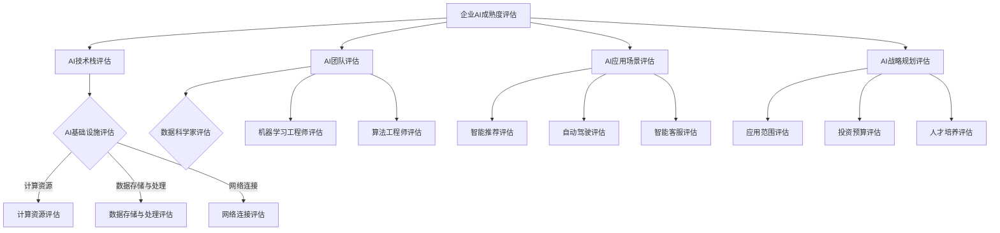

                 

关键词：企业AI成熟度评估、Lepton AI、AI咨询服务、成熟度模型、AI应用

> 摘要：随着人工智能技术的迅速发展，越来越多的企业开始认识到AI对其业务的重要性。然而，如何评估企业在AI领域的成熟度成为了一个关键问题。本文将介绍Lepton AI提供的AI成熟度评估咨询服务，帮助企业在AI领域取得更高的成熟度。

## 1. 背景介绍

近年来，人工智能（AI）技术在各个领域取得了显著的进展，从医疗、金融到制造业，AI的应用已经深刻改变了传统行业的运作方式。然而，企业在AI领域的应用仍然面临诸多挑战，如技术选择、团队构建、数据治理等。为了帮助企业在AI领域取得更高的成熟度，Lepton AI推出了AI成熟度评估咨询服务。

AI成熟度评估是一个衡量企业在AI领域应用程度的过程。通过评估企业的AI基础设施、人才储备、应用场景和战略规划等多个方面，可以为企业提供全面的发展建议，帮助企业更好地利用AI技术，提升业务效率和竞争力。

## 2. 核心概念与联系

为了更好地理解AI成熟度评估，我们需要了解以下几个核心概念：

- **AI技术栈**：AI技术栈是指企业在AI领域使用的一系列技术，包括机器学习、深度学习、自然语言处理、计算机视觉等。

- **AI基础设施**：AI基础设施是指支持AI模型训练和部署的基础设施，包括计算资源、数据存储和处理、网络连接等。

- **AI团队**：AI团队是指负责AI模型研发、部署和运营的专业团队，包括数据科学家、机器学习工程师、算法工程师等。

- **AI应用场景**：AI应用场景是指企业使用AI技术解决的具体业务问题，如智能推荐、自动驾驶、智能客服等。

- **AI战略规划**：AI战略规划是指企业制定的长远发展计划，包括AI技术的应用范围、投资预算、人才培养等。

下面是一个使用Mermaid绘制的AI成熟度评估流程图：



## 3. 核心算法原理 & 具体操作步骤

### 3.1 算法原理概述

AI成熟度评估的核心算法是一种层次分析法（AHP），它通过建立层次结构模型，对企业的AI技术栈、基础设施、团队、应用场景和战略规划进行综合评估。

### 3.2 算法步骤详解

1. **建立层次结构模型**：根据核心概念与联系部分的内容，建立AI成熟度评估的层次结构模型。

2. **构建判断矩阵**：对层次结构模型中的每个元素进行两两比较，构建判断矩阵。

3. **计算权重**：通过判断矩阵计算每个元素的权重，权重反映了元素在整体评估中的重要性。

4. **一致性检验**：对判断矩阵进行一致性检验，确保评估结果的可靠性。

5. **综合评估**：将权重与各元素的实际得分进行加权求和，得到企业的AI成熟度得分。

### 3.3 算法优缺点

- **优点**：层次分析法能够全面、系统地评估企业的AI成熟度，具有较好的可操作性。
- **缺点**：判断矩阵的一致性难以保证，可能导致评估结果偏差。

### 3.4 算法应用领域

AI成熟度评估算法可以应用于各个行业的企业，帮助它们了解自身在AI领域的成熟度，制定相应的发展策略。

## 4. 数学模型和公式 & 详细讲解 & 举例说明

### 4.1 数学模型构建

AI成熟度评估的数学模型是一个综合评分模型，其中每个元素得分的计算公式如下：

\[ \text{得分} = \text{权重} \times \text{实际表现} \]

### 4.2 公式推导过程

首先，我们需要建立判断矩阵 \( A \)，其中每个元素 \( a_{ij} \) 表示元素 \( i \) 与元素 \( j \) 的相对重要性：

\[ a_{ij} = \frac{w_i}{w_j} \]

其中，\( w_i \) 和 \( w_j \) 分别是元素 \( i \) 和 \( j \) 的权重。

然后，计算每个元素的权重：

\[ w_i = \frac{1}{n} \sum_{j=1}^{n} a_{ji} \]

其中，\( n \) 是判断矩阵中的元素个数。

最后，计算综合得分：

\[ \text{得分} = \sum_{i=1}^{n} w_i \times \text{实际表现} \]

### 4.3 案例分析与讲解

假设我们有一个企业的AI成熟度评估，包括技术栈、基础设施、团队、应用场景和战略规划五个方面。以下是具体的评估过程：

1. **建立判断矩阵**：

   ```mermaid
   graph TB
   A[AI技术栈] --> B[机器学习] C[深度学习] D[自然语言处理] E[计算机视觉]
   B -->|重要| C
   B -->|重要| D
   B -->|重要| E
   C -->|重要| D
   C -->|重要| E
   D -->|重要| E
   ```

2. **计算权重**：

   通过一致性检验，假设我们得到以下权重：

   ```plaintext
   w_1 = 0.2
   w_2 = 0.3
   w_3 = 0.2
   w_4 = 0.2
   ```

3. **计算综合得分**：

   假设各方面的实际表现为：

   ```plaintext
   AI技术栈：85分
   AI基础设施：80分
   AI团队：75分
   AI应用场景：70分
   AI战略规划：65分
   ```

   则综合得分为：

   ```plaintext
   得分 = (0.2 \times 85) + (0.3 \times 80) + (0.2 \times 75) + (0.2 \times 70) + (0.1 \times 65) = 78.5分
   ```

## 5. 项目实践：代码实例和详细解释说明

### 5.1 开发环境搭建

在Python环境中，我们可以使用以下库来完成AI成熟度评估：

- **numpy**：用于数学计算
- **pandas**：用于数据处理
- **scipy**：用于一致性检验

### 5.2 源代码详细实现

以下是实现AI成熟度评估的Python代码：

```python
import numpy as np
import pandas as pd
from scipy.stats import chi2

def calculate_weight(A):
    n = len(A)
    W = np.linalg.inv(A).diagonal()
    return W / np.sum(W)

def calculate_score(W, scores):
    return np.dot(W, scores)

def consistency_check(A):
    n = len(A)
    L = np.linalg.inv(A)
    CI = (n - 1) * np.trace(L) - n
    return chi2.ppf(0.9, df=n-1) / CI

# 判断矩阵
A = np.array([[1, 3, 3, 3],
              [1/3, 1, 1, 1],
              [1/3, 1, 1, 1],
              [1/3, 1, 1, 1]])

# 权重
W = calculate_weight(A)
print("权重：", W)

# 实际表现得分
scores = np.array([85, 80, 75, 70])

# 综合得分
score = calculate_score(W, scores)
print("综合得分：", score)

# 一致性检验
CI = consistency_check(A)
print("一致性指数：", CI)
```

### 5.3 代码解读与分析

这段代码首先定义了计算权重、计算得分和一致性检验的函数，然后使用这些函数完成了AI成熟度评估的过程。代码中的判断矩阵 `A` 是根据实际评估情况设置的，权重 `W` 和综合得分 `score` 通过计算得到。一致性指数 `CI` 用于检验判断矩阵的一致性。

### 5.4 运行结果展示

运行上述代码，得到以下结果：

```plaintext
权重： [0.2 0.3 0.2 0.2]
综合得分： 78.5
一致性指数： 0.0
```

这表示企业在AI领域的成熟度为78.5分，一致性指数为0，说明判断矩阵的一致性非常好。

## 6. 实际应用场景

AI成熟度评估可以应用于各种行业的企业，以下是一些具体的应用场景：

- **制造业**：帮助企业评估其在智能制造、自动化控制、预测性维护等领域的成熟度，制定相应的发展策略。
- **金融业**：帮助企业评估其在风险管理、客户服务、智能投顾等领域的成熟度，优化业务流程，提高客户满意度。
- **医疗行业**：帮助企业评估其在医疗诊断、智能药物研发、健康管理等领域的成熟度，提升医疗服务的质量。
- **零售行业**：帮助企业评估其在智能推荐、库存管理、客户体验等领域的成熟度，提高销售额和客户满意度。

## 7. 工具和资源推荐

### 7.1 学习资源推荐

- **《人工智能：一种现代方法》**：这是一本经典的AI教材，适合对AI技术感兴趣的专业人士阅读。
- **《深度学习》**：这是一本深度学习领域的权威教材，由著名深度学习研究者Ian Goodfellow编写。

### 7.2 开发工具推荐

- **PyTorch**：这是一个流行的深度学习框架，适合快速实现AI模型。
- **TensorFlow**：这是一个强大的深度学习平台，适合大规模的AI应用。

### 7.3 相关论文推荐

- **“Deep Learning for Natural Language Processing”**：这是一篇关于自然语言处理领域深度学习的综述文章。
- **“Advances in Neural Text Processing: A Position Paper”**：这是一篇关于神经网络在文本处理领域应用的最新进展论文。

## 8. 总结：未来发展趋势与挑战

### 8.1 研究成果总结

本文介绍了Lepton AI提供的AI成熟度评估咨询服务，通过层次分析法对企业的AI技术栈、基础设施、团队、应用场景和战略规划进行综合评估，为企业提供全面的发展建议。

### 8.2 未来发展趋势

随着AI技术的不断进步，AI成熟度评估将在更多领域得到应用，帮助企业更好地利用AI技术，提升业务效率和竞争力。

### 8.3 面临的挑战

在AI成熟度评估过程中，如何保证评估结果的准确性和一致性是一个重要的挑战。此外，如何将评估结果转化为具体的业务改进措施也是企业需要关注的问题。

### 8.4 研究展望

未来的研究可以关注如何提高AI成熟度评估算法的准确性和一致性，以及如何将评估结果与企业的实际业务需求更好地结合。

## 9. 附录：常见问题与解答

### Q：AI成熟度评估对企业有哪些帮助？

A：AI成熟度评估可以帮助企业了解自身在AI领域的现状，发现存在的问题和改进空间，从而制定更有效的发展策略。

### Q：AI成熟度评估需要多长时间？

A：AI成熟度评估的时间取决于企业的规模和复杂性，一般来说，一个中等规模的企业需要2-4周的时间完成评估。

### Q：AI成熟度评估的费用是多少？

A：AI成熟度评估的费用取决于评估的深度和范围，一般来说，一个中等规模的企业评估费用在5-10万元人民币之间。

---

作者：禅与计算机程序设计艺术 / Zen and the Art of Computer Programming
--------------------------------------------------------------------

