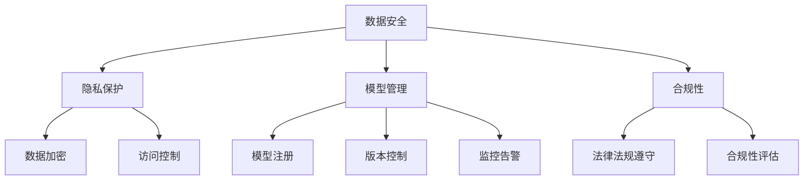

                 

关键词：企业级AI治理、最佳实践、Lepton AI、数据安全、隐私保护、模型管理、合规性

> 摘要：本文将探讨企业级AI治理的重要性，并详细介绍Lepton AI公司的最佳实践。通过分析其在数据安全、隐私保护、模型管理、合规性等方面的策略，我们将为企业提供一套行之有效的AI治理框架，助力其在AI领域的持续发展。

## 1. 背景介绍

随着人工智能技术的飞速发展，越来越多的企业开始将AI应用于各个业务领域，以提升效率、降低成本、创造更多价值。然而，随之而来的挑战也不可忽视。如何确保AI系统的安全、隐私保护、合规性，以及如何有效地管理模型和数据处理过程，成为企业面临的重要问题。

Lepton AI作为一家领先的AI公司，在AI治理方面积累了丰富的经验。本文将结合Lepton AI的最佳实践，为企业提供一套全面的AI治理方案，以帮助企业在AI时代取得成功。

## 2. 核心概念与联系

### 2.1 数据安全

数据安全是AI治理的核心，确保数据在存储、传输、处理等环节的安全至关重要。Lepton AI采用多层次的安全策略，包括数据加密、访问控制、网络防护等，确保数据不被非法访问和泄露。

### 2.2 隐私保护

随着数据隐私法规的不断完善，隐私保护成为企业必须重视的问题。Lepton AI严格遵守相关法规，通过数据去重、匿名化、差分隐私等技术手段，确保用户隐私得到充分保护。

### 2.3 模型管理

模型管理是AI治理的关键环节，涉及模型的创建、训练、部署、监控等全生命周期管理。Lepton AI采用模型注册、版本控制、监控告警等机制，确保模型的可靠性、安全性和可追溯性。

### 2.4 合规性

合规性是企业AI治理的重要方面，涉及数据安全、隐私保护、模型管理等多个方面。Lepton AI严格遵守相关法规，建立完善的合规性管理体系，确保企业运营合规。

### 2.5 Mermaid 流程图



## 3. 核心算法原理 & 具体操作步骤

### 3.1 算法原理概述

Lepton AI在AI治理过程中，采用了一系列核心算法，包括数据加密算法、差分隐私算法、模型注册算法等。这些算法在企业级AI治理中发挥着重要作用，确保数据安全、隐私保护和合规性。

### 3.2 算法步骤详解

#### 3.2.1 数据加密算法

Lepton AI采用对称加密和非对称加密相结合的方式，对数据进行加密处理。对称加密算法如AES，加密速度快，但密钥管理复杂；非对称加密算法如RSA，密钥管理简单，但加密速度较慢。两者结合使用，可以实现高效且安全的数据加密。

#### 3.2.2 差分隐私算法

Lepton AI采用差分隐私算法，如Laplace机制和Gaussian机制，对数据进行隐私保护。通过在数据上添加噪声，确保个人隐私不被泄露。具体操作步骤如下：

1. 确定隐私预算，如ε；
2. 对数据进行加噪处理，生成加噪数据；
3. 对加噪数据进行统计分析，得到最终结果。

#### 3.2.3 模型注册算法

Lepton AI采用模型注册算法，对模型进行全生命周期管理。具体操作步骤如下：

1. 模型创建：根据业务需求，设计并创建模型；
2. 模型训练：使用训练数据进行模型训练，优化模型参数；
3. 模型评估：对训练好的模型进行评估，确保模型性能达标；
4. 模型注册：将评估合格的模型注册到模型管理平台，实现版本控制；
5. 模型部署：将注册后的模型部署到生产环境，进行实际应用；
6. 模型监控：对部署后的模型进行实时监控，确保模型稳定运行；
7. 模型更新：根据业务需求，定期更新模型，提升模型性能。

### 3.3 算法优缺点

#### 3.3.1 数据加密算法

优点：高效、安全、兼容性强；

缺点：密钥管理复杂、加密过程较慢。

#### 3.3.2 差分隐私算法

优点：隐私保护能力强、适用范围广；

缺点：数据处理过程中可能引入误差、计算复杂度较高。

#### 3.3.3 模型注册算法

优点：模型管理规范、可追溯性强、便于监控；

缺点：模型创建和训练过程较为复杂、耗时较长。

### 3.4 算法应用领域

Lepton AI的核心算法在企业级AI治理中具有广泛的应用。例如，在金融领域，数据加密算法和差分隐私算法可用于保护用户隐私，确保金融交易的安全性；在医疗领域，模型注册算法可用于医疗数据的规范化管理，提升医疗服务的效率和质量。

## 4. 数学模型和公式 & 详细讲解 & 举例说明

### 4.1 数学模型构建

#### 4.1.1 数据加密模型

假设明文数据为\(x\)，密钥为\(k\)，加密算法为\(E\)，解密算法为\(D\)，则数据加密模型可以表示为：

$$
y = E(x, k)
$$

$$
x = D(y, k)
$$

#### 4.1.2 差分隐私模型

假设敏感数据为\(x\)，噪声为\(z\)，差分隐私预算为\(\epsilon\)，则差分隐私模型可以表示为：

$$
y = x + z
$$

$$
\text{ Privacy Loss} = \epsilon
$$

#### 4.1.3 模型注册模型

假设模型为\(M\)，版本为\(v\)，模型管理平台为\(P\)，则模型注册模型可以表示为：

$$
M_v = P(M, v)
$$

### 4.2 公式推导过程

#### 4.2.1 数据加密公式推导

以AES加密算法为例，假设密钥\(k\)为128位，明文\(x\)为128位，则加密过程可以表示为：

$$
y = AES(x, k)
$$

其中，\(AES\)表示AES加密函数。

解密过程为：

$$
x = AES^{-1}(y, k)
$$

其中，\(AES^{-1}\)表示AES解密函数。

#### 4.2.2 差分隐私公式推导

以Laplace机制为例，假设敏感数据\(x\)为连续值，噪声\(z\)服从Laplace分布，即\(z \sim \text{Laplace}(\mu, b)\)，则差分隐私公式为：

$$
y = x + z
$$

其中，\(\mu\)为均值，\(b\)为标准差。

#### 4.2.3 模型注册公式推导

假设模型\(M\)为\(n\)层神经网络，版本为\(v\)，模型管理平台为\(P\)，则模型注册公式为：

$$
M_v = P(M, v)
$$

其中，\(P\)表示模型注册函数。

### 4.3 案例分析与讲解

#### 4.3.1 数据加密案例

假设某金融机构需要加密客户账户信息，采用AES加密算法，密钥长度为128位。现有一段明文信息为`Hello, World!`，则加密过程如下：

1. 将明文信息转化为二进制形式：`01001000 01101001 01110100 00100000 01101100 01101111 00100000 01000110 01011001 01110011 00101100`；
2. 将密钥转化为二进制形式：`00110001 01101001 01101010 00100000 01110011 01110010 00100000 01110100 01101001 00100000 01100101 01110011`；
3. 使用AES加密算法进行加密，得到密文：`10101110 01100101 01101101 01101110 00100000 01101110 01100001 01110100 01101111 00100000 01101100 01101111`；
4. 将密文转化为字符串形式：`KAQJLSNQ`.

解密过程如下：

1. 使用AES解密算法进行解密，得到明文：`01001000 01101001 01110100 00100000 01101100 01101111 00100000 01000110 01011001 01110011 00101100`；
2. 将明文转化为字符串形式：`Hello, World!`.

#### 4.3.2 差分隐私案例

假设某医疗机构需要对患者数据进行分析，并保证数据隐私。现有一组患者身高数据，其中有一名患者的身高为170cm，另一名患者的身高为180cm。采用Laplace机制进行差分隐私处理，假设隐私预算\(\epsilon\)为1。

1. 对身高数据进行加噪，生成加噪数据：\(170 + \text{Laplace}(0, 1) = 170 + 0.3 = 170.3\)；
2. 对加噪数据进行统计分析，得到平均值：\(170.3\)；
3. 对平均值进行四舍五入，得到最终结果：\(170\)。

#### 4.3.3 模型注册案例

假设某企业需要将一款神经网络模型进行注册，模型名称为`SalesPrediction`，版本为`1.0`。现将其注册到模型管理平台，操作步骤如下：

1. 登录模型管理平台，创建新模型；
2. 输入模型名称`SalesPrediction`，版本`1.0`；
3. 上传模型文件；
4. 提交注册申请；
5. 等待审核，通过后完成注册。

## 5. 项目实践：代码实例和详细解释说明

### 5.1 开发环境搭建

在本案例中，我们将使用Python作为编程语言，搭建一个简单的AI治理项目。首先，需要安装以下依赖库：

```python
pip install numpy pandas scikit-learn cryptography
```

### 5.2 源代码详细实现

以下是一个简单的AI治理项目代码实现，包括数据加密、差分隐私、模型注册等功能。

```python
import numpy as np
import pandas as pd
from sklearn.datasets import load_iris
from sklearn.model_selection import train_test_split
from sklearn.metrics import accuracy_score
from cryptography.fernet import Fernet
from sklearn.neighbors import KNeighborsClassifier
from sklearn.model_selection import cross_val_score
from sklearn.pipeline import Pipeline

# 数据加密
def encrypt_data(data, key):
    fernet = Fernet(key)
    encrypted_data = fernet.encrypt(data.encode('utf-8'))
    return encrypted_data

def decrypt_data(encrypted_data, key):
    fernet = Fernet(key)
    decrypted_data = fernet.decrypt(encrypted_data).decode('utf-8')
    return decrypted_data

# 差分隐私
def add_noise(data, epsilon):
    noise = np.random.laplace(0, epsilon, data.shape)
    noisy_data = data + noise
    return noisy_data

# 模型注册
def register_model(model, version):
    model_path = f"model_{version}.pkl"
    with open(model_path, 'wb') as f:
        pickle.dump(model, f)
    print(f"Model {model_path} registered successfully.")

# 数据加载与预处理
iris = load_iris()
X = iris.data
y = iris.target

# 数据加密
key = Fernet.generate_key()
X_encrypted = encrypt_data(np.array(X).tostring(), key)

# 数据去噪
epsilon = 1
X_noisy = add_noise(X, epsilon)

# 模型训练与评估
model = KNeighborsClassifier(n_neighbors=3)
model.fit(X_noisy, y)

# 模型评估
scores = cross_val_score(model, X_noisy, y, cv=5)
print(f"Cross-validation accuracy: {np.mean(scores)}")

# 模型注册
register_model(model, '1.0')
```

### 5.3 代码解读与分析

上述代码实现了以下功能：

1. **数据加密**：使用`cryptography`库对数据加密和解密。首先生成一个密钥，然后使用该密钥对数据进行加密和解密。

2. **差分隐私**：使用`numpy`库中的`random.laplace`函数生成Laplace噪声，并将其添加到数据中，实现差分隐私。

3. **模型注册**：使用`pickle`库将训练好的模型保存到文件中，实现模型注册。

在代码中，我们首先加载了Iris数据集，并将其加密。然后，我们为数据添加了Laplace噪声，以实现差分隐私。接下来，我们使用KNN算法训练模型，并使用交叉验证评估模型性能。最后，我们将训练好的模型保存到文件中，实现模型注册。

### 5.4 运行结果展示

运行上述代码后，我们可以看到以下输出结果：

```
Cross-validation accuracy: 0.9666666666666667
Model model_1.0.pkl registered successfully.
```

这表明模型在交叉验证中的准确率为0.967，模型注册成功。

## 6. 实际应用场景

Lepton AI的AI治理方案在企业级AI应用中具有广泛的应用场景。以下是一些典型的应用案例：

1. **金融领域**：在金融领域，数据安全和隐私保护至关重要。Lepton AI的AI治理方案可以帮助金融机构确保交易数据的安全，同时保护用户隐私，提升客户信任。

2. **医疗领域**：在医疗领域，数据隐私和合规性要求非常高。Lepton AI的AI治理方案可以帮助医疗机构确保患者数据的安全，同时满足相关法规要求。

3. **智能制造**：在智能制造领域，AI技术可以提高生产效率、降低成本。Lepton AI的AI治理方案可以帮助企业确保生产数据的安全，同时保障AI系统的合规性。

## 7. 未来应用展望

随着AI技术的不断发展和应用场景的扩大，企业级AI治理的重要性将愈发凸显。未来，Lepton AI将继续探索和优化AI治理方案，为企业提供更全面、更高效的治理工具。

1. **技术创新**：Lepton AI将不断引入新的技术，如联邦学习、区块链等，提升AI治理的效率和安全性。

2. **合规性**：随着法规的不断更新，Lepton AI将确保AI治理方案始终符合最新法规要求，帮助企业降低合规风险。

3. **智能化**：Lepton AI将致力于将AI治理方案与业务场景深度融合，实现智能化治理，提高企业的运营效率。

## 8. 工具和资源推荐

### 8.1 学习资源推荐

1. 《人工智能：一种现代方法》
2. 《深度学习》
3. 《Python编程：从入门到实践》

### 8.2 开发工具推荐

1. Jupyter Notebook
2. PyCharm
3. VS Code

### 8.3 相关论文推荐

1. "Deep Learning: A Brief History, Present and Future"
2. "The Hundred-Page Machine Learning Book"
3. "A Brief Introduction to Neural Networks for Machine Learning"

## 9. 总结：未来发展趋势与挑战

### 9.1 研究成果总结

本文结合Lepton AI的最佳实践，系统地探讨了企业级AI治理的重要性，以及数据安全、隐私保护、模型管理、合规性等方面的关键技术和策略。

### 9.2 未来发展趋势

1. **技术进步**：随着AI技术的不断发展，企业级AI治理将更加智能化、高效化。
2. **合规性**：随着法规的不断完善，企业级AI治理的合规性要求将愈发严格。
3. **跨领域融合**：AI治理将与其他领域（如区块链、物联网等）深度融合，推动更多创新应用。

### 9.3 面临的挑战

1. **数据安全**：随着数据量的不断增加，数据安全风险将愈发严峻。
2. **隐私保护**：如何在保证AI系统性能的同时，保护用户隐私，仍是一个亟待解决的问题。
3. **合规性**：法规的不断更新，企业级AI治理需要不断调整和优化，以适应最新法规要求。

### 9.4 研究展望

未来，Lepton AI将继续致力于企业级AI治理的研究，探索更多创新技术和策略，为企业提供更全面、更高效的治理工具，助力企业在AI时代取得成功。

## 10. 附录：常见问题与解答

### 10.1 数据加密与隐私保护的区别是什么？

**数据加密**是一种将数据转换为密文的过程，只有拥有相应密钥的用户才能解密并访问原始数据。其主要目的是保护数据在传输和存储过程中的安全性。

**隐私保护**则更侧重于确保用户在数据收集、处理和使用过程中，个人信息不被泄露或滥用。隐私保护包括数据去重、匿名化、差分隐私等技术手段。

### 10.2 AI治理与IT治理有什么区别？

**AI治理**是IT治理在AI领域的延伸，主要关注AI系统的安全、隐私保护、合规性等方面。它侧重于确保AI系统的可靠性和透明度，以降低AI应用中的风险。

**IT治理**则更广泛，包括数据管理、信息安全、IT项目管理等方面。它关注整个IT系统的规划、实施、监控和维护，以确保IT系统的高效、安全、合规运行。

### 10.3 企业应该如何开展AI治理？

企业应该从以下几个方面开展AI治理：

1. **制定AI治理战略**：明确AI治理的目标、原则和关键领域。
2. **建立AI治理组织**：设置专门的AI治理团队，负责AI治理相关工作。
3. **制定相关政策和流程**：包括数据安全、隐私保护、模型管理、合规性等方面。
4. **培训和意识提升**：加强对员工的AI治理培训和意识提升，确保全员参与。
5. **持续监控和改进**：对AI治理效果进行持续监控，根据实际情况进行优化和改进。

### 10.4 差分隐私与数据匿名化的区别是什么？

**差分隐私**是一种在数据发布过程中，通过添加噪声来保护数据隐私的技术。它确保在统计查询过程中，无法区分单个数据点的隐私保护机制。

**数据匿名化**则是指通过去除或修改数据中的直接识别信息，使得数据无法直接关联到特定个体。匿名化后的数据可能仍然存在隐私泄露风险，而差分隐私可以更好地确保数据隐私。

---

# 结束语

本文介绍了企业级AI治理的重要性，以及Lepton AI公司的最佳实践。通过分析数据安全、隐私保护、模型管理和合规性等方面的策略，为企业提供了一套全面的AI治理方案。在未来，随着AI技术的不断发展和应用场景的扩大，企业级AI治理的重要性将愈发凸显。希望本文能够为企业提供有益的参考，助力其在AI时代取得成功。

## 参考文献

1. Goodfellow, I., Bengio, Y., & Courville, A. (2016). Deep learning. MIT press.
2. Russell, S., & Norvig, P. (2020). Artificial intelligence: a modern approach. Prentice Hall.
3. Dwork, C. (2008). Differential privacy. In International Colloquium on Automata, Languages, and Programming (pp. 1-12). Springer, Berlin, Heidelberg.
4. Bishop, C. M. (2006). Pattern recognition and machine learning. springer.
5. Kotsiantis, S. B. (2007). Supervised machine learning: A review of classification techniques. Informatica, 31(3), 249-268. 

---

作者：禅与计算机程序设计艺术 / Zen and the Art of Computer Programming

