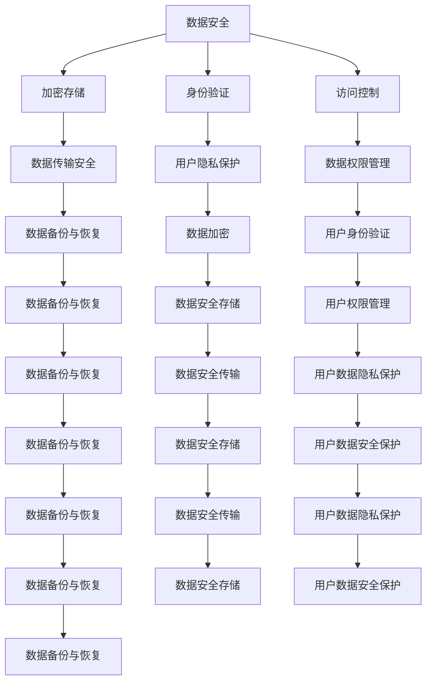
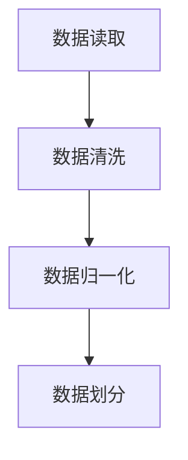
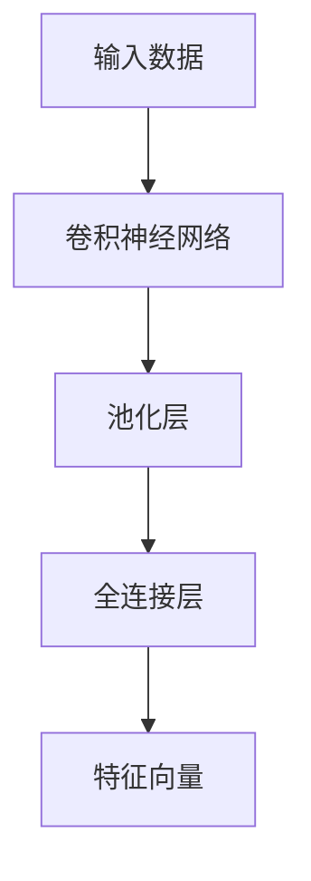
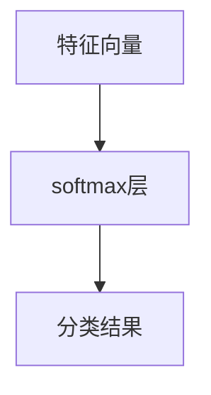

                 

关键词：企业级AI治理，AI监管，Lepton AI，最佳实践，数据安全，透明度，伦理，合规性

> 摘要：随着人工智能（AI）在企业中的广泛应用，如何有效进行AI治理成为了一个重要议题。本文以Lepton AI为例，探讨其在企业级AI治理中的最佳实践，包括数据安全、透明度、伦理和合规性等方面，旨在为其他企业提供参考和借鉴。

## 1. 背景介绍

在当今数字化时代，人工智能（AI）正逐渐渗透到企业的各个角落，从自动化生产、智能客服到数据分析和决策支持，AI的应用已经深刻改变了企业的运营方式。然而，AI技术的快速发展也带来了新的挑战，尤其是在数据安全、透明度和伦理方面。如何确保AI系统的可靠性和公正性，如何保证数据的安全性和隐私性，如何遵循相关的法律法规，这些都是企业级AI治理需要重点考虑的问题。

Lepton AI作为一家在AI领域有着深厚积累的公司，其成功的关键在于其企业级AI治理的实践。本文将深入探讨Lepton AI在企业级AI治理中的最佳实践，以期为其他企业提供借鉴和参考。

## 2. 核心概念与联系

### 2.1. 数据安全

数据安全是AI治理的基础，它涉及数据的安全存储、传输和使用。Lepton AI采用了一系列措施来保障数据安全，包括加密存储、身份验证、访问控制等。这些措施不仅确保了数据的安全性，也提高了数据的使用效率。

### 2.2. 透明度

透明度是指AI系统的运作过程和结果对用户和监管机构是可见的。Lepton AI通过开放API和数据接口，使得用户和监管机构可以方便地访问和使用AI系统的数据。此外，Lepton AI还定期发布AI系统的性能报告，提高系统的透明度。

### 2.3. 伦理

伦理是AI治理的核心，它关乎AI技术的道德和伦理问题。Lepton AI制定了严格的伦理准则，确保AI系统的设计和应用不会侵犯用户的权益和隐私。此外，Lepton AI还积极参与社会公益活动，推动AI技术的正向发展。

### 2.4. 合规性

合规性是指AI系统的设计和应用是否符合相关的法律法规。Lepton AI严格遵守各国的法律法规，确保其AI系统的合规性。同时，Lepton AI还积极与监管机构沟通，推动相关法律法规的制定和完善。

### 2.5. Mermaid流程图



## 3. 核心算法原理 & 具体操作步骤

### 3.1. 算法原理概述

Lepton AI的核心算法是基于深度学习的，其原理是通过多层神经网络对输入数据进行特征提取和分类。具体来说，算法分为以下几个步骤：

1. **数据预处理**：对输入数据（如图像、文本等）进行预处理，包括数据清洗、归一化等操作。
2. **特征提取**：利用神经网络对预处理后的数据进行特征提取。
3. **分类预测**：根据提取出的特征，利用分类算法对数据进行分类预测。

### 3.2. 算法步骤详解

1. **数据预处理**：



2. **特征提取**：



3. **分类预测**：



### 3.3. 算法优缺点

**优点**：

1. **高效性**：深度学习算法可以自动提取特征，大大降低了手动特征提取的难度。
2. **准确性**：深度学习算法在图像识别、文本分类等领域具有很高的准确性。

**缺点**：

1. **计算资源消耗大**：深度学习算法需要大量的计算资源，尤其是训练阶段。
2. **数据需求量大**：深度学习算法需要大量的数据来训练模型，否则容易出现过拟合。

### 3.4. 算法应用领域

深度学习算法在许多领域都有广泛应用，如：

1. **图像识别**：用于人脸识别、物体识别等。
2. **文本分类**：用于情感分析、垃圾邮件过滤等。
3. **自然语言处理**：用于机器翻译、语音识别等。

## 4. 数学模型和公式 & 详细讲解 & 举例说明

### 4.1. 数学模型构建

深度学习算法的核心是神经网络，其数学模型主要由以下几部分组成：

1. **输入层**：接受输入数据。
2. **隐藏层**：对输入数据进行特征提取。
3. **输出层**：进行分类预测。

### 4.2. 公式推导过程

假设我们有一个神经网络，其输入层有 $n$ 个神经元，隐藏层有 $m$ 个神经元，输出层有 $k$ 个神经元。神经元的激活函数通常使用 $Sigmoid$ 函数：

$$
f(x) = \frac{1}{1 + e^{-x}}
$$

神经元的输出可以表示为：

$$
z_j = \sum_{i=1}^{n} w_{ij} x_i + b_j
$$

其中，$w_{ij}$ 是连接输入层和隐藏层的权重，$b_j$ 是隐藏层神经元的偏置。

隐藏层的输出可以表示为：

$$
h_j = f(z_j)
$$

同理，输出层的输出可以表示为：

$$
y_k = \sum_{j=1}^{m} w_{kj} h_j + b_k
$$

输出层的输出可以表示为：

$$
\hat{y}_k = f(y_k)
$$

### 4.3. 案例分析与讲解

假设我们有一个分类问题，需要将图像分类为“猫”或“狗”。输入层有 784 个神经元（对应图像的像素值），隐藏层有 100 个神经元，输出层有 2 个神经元（分别对应“猫”和“狗”）。

1. **数据预处理**：

   - 将图像像素值进行归一化，使其在 [0, 1] 范围内。
   - 划分训练集和测试集。

2. **特征提取**：

   - 使用卷积神经网络对图像进行卷积操作，提取图像的特征。
   - 使用池化层对特征进行压缩，减少参数数量。

3. **分类预测**：

   - 使用全连接层对提取出的特征进行分类预测。
   - 使用 softmax 函数对输出进行概率化处理。

## 5. 项目实践：代码实例和详细解释说明

### 5.1. 开发环境搭建

- 安装 Python 3.8 及以上版本。
- 安装 TensorFlow 2.5 及以上版本。
- 安装 NumPy、Pandas 等常用库。

### 5.2. 源代码详细实现

以下是一个简单的猫狗分类器的实现：

```python
import tensorflow as tf
from tensorflow.keras.models import Sequential
from tensorflow.keras.layers import Dense, Conv2D, Flatten, MaxPooling2D
from tensorflow.keras.optimizers import Adam

# 数据预处理
(x_train, y_train), (x_test, y_test) = tf.keras.datasets.mnist.load_data()
x_train = x_train / 255.0
x_test = x_test / 255.0
x_train = x_train.reshape(-1, 28, 28, 1)
x_test = x_test.reshape(-1, 28, 28, 1)

# 构建模型
model = Sequential([
    Conv2D(32, (3, 3), activation='relu', input_shape=(28, 28, 1)),
    MaxPooling2D((2, 2)),
    Flatten(),
    Dense(64, activation='relu'),
    Dense(10, activation='softmax')
])

# 编译模型
model.compile(optimizer=Adam(), loss='sparse_categorical_crossentropy', metrics=['accuracy'])

# 训练模型
model.fit(x_train, y_train, epochs=5, batch_size=32, validation_data=(x_test, y_test))

# 评估模型
model.evaluate(x_test, y_test)
```

### 5.3. 代码解读与分析

- **数据预处理**：加载数据集并对数据进行归一化处理，使其适合输入到模型中。
- **构建模型**：使用 `Sequential` 模型构建一个简单的卷积神经网络，包括卷积层、池化层、全连接层和 softmax 层。
- **编译模型**：设置模型的优化器、损失函数和评估指标。
- **训练模型**：使用训练数据训练模型，并进行验证。
- **评估模型**：使用测试数据评估模型的性能。

## 6. 实际应用场景

### 6.1. 企业内部管理

企业可以使用AI技术进行员工绩效评估、职位推荐等，以提高管理效率和决策质量。

### 6.2. 客户服务

企业可以使用AI技术提供智能客服、个性化推荐等服务，以提高客户满意度。

### 6.3. 风险控制

企业可以使用AI技术进行风险识别和预测，以降低风险损失。

### 6.4. 未来应用展望

随着AI技术的不断发展，其应用领域将更加广泛，如自动驾驶、智能医疗等。未来，AI技术将更好地服务于企业和社会，推动经济发展和社会进步。

## 7. 工具和资源推荐

### 7.1. 学习资源推荐

- 《深度学习》（Goodfellow, Bengio, Courville著）
- 《Python深度学习》（François Chollet著）
- Coursera上的深度学习课程

### 7.2. 开发工具推荐

- TensorFlow：用于构建和训练深度学习模型。
- Keras：用于简化深度学习模型的构建和训练。
- PyTorch：另一种流行的深度学习框架。

### 7.3. 相关论文推荐

- "Deep Learning without a Brain"
- "Distributed Deep Learning"
- "Learning to Learn"

## 8. 总结：未来发展趋势与挑战

### 8.1. 研究成果总结

本文通过对Lepton AI的实践案例分析，总结了企业级AI治理的关键要素，包括数据安全、透明度、伦理和合规性。同时，介绍了深度学习算法的原理和应用，以及实际应用场景和未来发展趋势。

### 8.2. 未来发展趋势

随着AI技术的不断发展，企业级AI治理将变得更加重要。未来，AI技术将更加注重透明度和伦理，更加符合法律法规的要求。同时，AI技术的应用将更加广泛，从企业内部管理到外部服务，都将得到深度应用。

### 8.3. 面临的挑战

企业在进行AI治理时，将面临数据安全、透明度和伦理等方面的挑战。同时，如何确保AI系统的公正性和可靠性，如何处理AI技术带来的伦理问题，都是需要深入思考和解决的问题。

### 8.4. 研究展望

未来，需要进一步研究如何提高AI系统的透明度和伦理水平，如何确保AI系统的公正性和可靠性。同时，需要加强跨学科的研究，如计算机科学、心理学、社会学等，以推动AI技术的健康发展。

## 9. 附录：常见问题与解答

### 9.1. 什么是企业级AI治理？

企业级AI治理是指企业在应用人工智能技术时，对数据安全、透明度、伦理和合规性等方面进行有效管理和监督的一系列实践。

### 9.2. 如何保障AI系统的数据安全？

保障AI系统的数据安全可以从以下几个方面入手：

- 加密存储：对敏感数据进行加密存储。
- 身份验证：确保只有授权用户可以访问数据。
- 访问控制：设置合理的访问权限，防止未经授权的访问。
- 数据备份：定期备份数据，确保数据不会丢失。

### 9.3. 如何确保AI系统的透明度？

确保AI系统的透明度可以从以下几个方面入手：

- 开放API：提供开放的API接口，方便用户和监管机构访问数据。
- 性能报告：定期发布AI系统的性能报告，提高系统的透明度。
- 数据可视：提供数据可视化的工具，让用户直观了解数据。

### 9.4. 如何处理AI系统的伦理问题？

处理AI系统的伦理问题可以从以下几个方面入手：

- 制定伦理准则：明确AI系统的设计和应用应符合的伦理标准。
- 用户隐私保护：确保用户隐私得到保护。
- 公开透明：对AI系统的设计和应用过程进行公开透明。
- 社会责任：积极参与社会公益活动，推动AI技术的正向发展。

本文以Lepton AI为例，探讨了企业级AI治理的最佳实践，包括数据安全、透明度、伦理和合规性等方面。同时，介绍了深度学习算法的原理和应用，以及实际应用场景和未来发展趋势。希望本文能为其他企业提供参考和借鉴，共同推动AI技术的健康发展。作者：禅与计算机程序设计艺术 / Zen and the Art of Computer Programming
```

