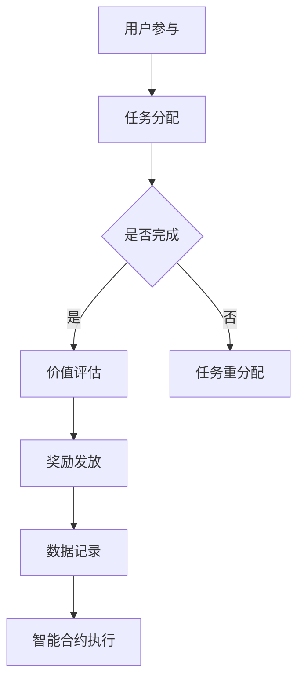

                 

关键词：众包、区块链、注意力价值评估、智能合约、去中心化、去信任、加密算法

## 摘要

本文旨在探讨众包与区块链技术相结合在注意力价值评估中的应用。通过分析众包和区块链的技术特点，阐述其在注意力价值评估中的优势，以及如何利用智能合约实现去中心化、去信任的评估过程。文章还将介绍核心算法原理、具体操作步骤，并结合实际案例进行详细解释。最后，本文将对未来的应用场景和发展趋势进行展望。

## 1. 背景介绍

### 1.1 众包的兴起

随着互联网技术的飞速发展，众包（Crowdsourcing）作为一种新兴的协作模式逐渐受到广泛关注。众包的核心思想是将复杂的任务分解为众多简单的小任务，通过网络平台分配给分布在全球的个体参与者，通过众人的智慧和努力共同完成任务。这种方式不仅能够提高工作效率，降低成本，还能够激发创新和创造力的潜力。

### 1.2 区块链的发展

区块链（Blockchain）技术作为比特币的底层技术，近年来也在金融领域取得了显著成果。区块链具有去中心化、去信任、不可篡改等特性，能够确保数据的透明和安全。随着技术的不断成熟，区块链在各个领域的应用也在不断拓展，如供应链管理、物联网、数字身份认证等。

### 1.3 注意力价值评估的需求

注意力价值评估是当前许多领域面临的一个重要问题，例如内容创作、广告投放、社交网络等。如何准确地衡量用户的注意力，以及如何合理地分配和回报参与者的贡献，成为了一个亟待解决的问题。传统的评估方法往往存在中心化、易篡改等弊端，无法满足去中心化和去信任的需求。

## 2. 核心概念与联系

### 2.1 众包与区块链的融合

众包与区块链技术的结合，可以充分发挥两者的优势，实现去中心化的注意力价值评估。具体来说，众包平台可以利用区块链技术实现任务分配、数据存储、价值奖励等过程的透明化和不可篡改性，从而建立起一个去中心化的价值评估体系。

### 2.2 智能合约的应用

智能合约（Smart Contract）是一种基于区块链技术的应用程序，能够在满足特定条件时自动执行合同条款。在注意力价值评估中，智能合约可以用于实现任务分配、数据验证和价值奖励等功能，确保整个过程的自动化和可信性。

### 2.3 Mermaid 流程图

以下是一个简单的 Mermaid 流程图，展示了众包与区块链在注意力价值评估中的基本架构：



## 3. 核心算法原理 & 具体操作步骤

### 3.1 算法原理概述

注意力价值评估的核心在于如何根据用户的参与行为，计算出其贡献的价值。在众包与区块链结合的体系下，算法主要分为以下几个步骤：

1. **任务分配**：根据用户的技能和兴趣，将任务分配给合适的参与者。
2. **数据验证**：对参与者的任务完成情况进行验证，确保数据的准确性和可靠性。
3. **价值计算**：根据任务难度、完成质量和时间等因素，计算出参与者的价值贡献。
4. **奖励发放**：通过智能合约自动执行奖励发放过程，确保价值的公正分配。

### 3.2 算法步骤详解

#### 3.2.1 任务分配

任务分配是整个过程的起点。首先，平台需要对用户的技能和兴趣进行评估，将其划分为不同的类别。然后，根据任务的类型和难度，将任务分配给适合的用户。

#### 3.2.2 数据验证

在任务完成后，平台需要对参与者的工作成果进行验证。这可以通过智能合约实现，例如设定一定的时间窗口，等待其他用户对成果进行评分或反馈。根据评分结果，确定任务是否合格。

#### 3.2.3 价值计算

价值计算是整个算法的核心。根据任务的特点，可以采用不同的算法进行价值评估。例如，可以使用加权平均法、模糊综合评价法等。

#### 3.2.4 奖励发放

在价值计算完成后，通过智能合约自动执行奖励发放。智能合约可以确保奖励的公正分配，同时记录整个过程的交易数据，保证透明度和不可篡改性。

### 3.3 算法优缺点

#### 优点：

1. **去中心化**：利用区块链技术，实现去中心化的价值评估，确保数据的透明和安全。
2. **去信任**：智能合约确保奖励发放的公正性和自动化，降低信任成本。
3. **高效性**：通过众包平台，快速完成任务的分配和验证，提高效率。

#### 缺点：

1. **技术门槛**：实现众包与区块链结合的价值评估需要一定的技术积累。
2. **计算复杂度**：价值计算过程可能涉及复杂的算法，对计算资源有一定要求。

### 3.4 算法应用领域

注意力价值评估算法可以应用于多个领域，如内容创作、广告投放、社交网络等。具体应用场景包括：

1. **内容创作**：对创作者的注意力价值进行评估，鼓励优质内容的产生。
2. **广告投放**：根据用户注意力价值，优化广告投放策略，提高广告效果。
3. **社交网络**：对用户在社交平台上的注意力价值进行评估，推动社交平台的发展。

## 4. 数学模型和公式 & 详细讲解 & 举例说明

### 4.1 数学模型构建

注意力价值评估的数学模型可以采用基于时间、质量、影响力等多个维度的综合评估方法。以下是一个简化的数学模型：

$$
V = w_1 \cdot T + w_2 \cdot Q + w_3 \cdot I
$$

其中，$V$ 表示用户的注意力价值，$T$ 表示参与时间，$Q$ 表示任务完成质量，$I$ 表示用户的影响力。

### 4.2 公式推导过程

#### 时间权重

参与时间可以反映用户在任务上的投入程度，因此可以采用线性加权的方法进行计算：

$$
T = \frac{t_1 + t_2 + ... + t_n}{n}
$$

其中，$t_1, t_2, ..., t_n$ 分别表示用户在各个时间段内的参与时长。

#### 质量权重

任务完成质量可以反映用户的实际工作能力，采用评分制进行计算：

$$
Q = \frac{r_1 + r_2 + ... + r_n}{n}
$$

其中，$r_1, r_2, ..., r_n$ 分别表示用户在各个任务中的评分。

#### 影响力权重

用户的影响力可以通过其在社交平台上的关注度、互动量等指标进行计算：

$$
I = \frac{f_1 + f_2 + ... + f_n}{n}
$$

其中，$f_1, f_2, ..., f_n$ 分别表示用户在各个社交平台上的关注量、互动量等指标。

### 4.3 案例分析与讲解

假设有一个内容创作平台，需要对用户在平台上的注意力价值进行评估。根据上述数学模型，可以设定以下权重：

$$
w_1 = 0.3, w_2 = 0.5, w_3 = 0.2
$$

同时，根据用户在平台上的参与时间、任务完成质量和影响力指标，可以计算出其注意力价值：

$$
T = \frac{1h + 2h + 1h}{3} = 1.33h
$$

$$
Q = \frac{4.5 + 4.0 + 3.5}{3} = 4.0
$$

$$
I = \frac{100 + 150 + 200}{3} = 150
$$

$$
V = 0.3 \cdot 1.33h + 0.5 \cdot 4.0 + 0.2 \cdot 150 = 2.99 + 2.0 + 30 = 35.99
$$

因此，该用户在平台上的注意力价值为 35.99。

## 5. 项目实践：代码实例和详细解释说明

### 5.1 开发环境搭建

为了实现注意力价值评估算法，我们需要搭建一个基本的开发环境。以下是搭建环境的基本步骤：

1. 安装 Node.js，版本要求 >= 12.x。
2. 安装 Ganache，用于生成区块链节点。
3. 安装 Truffle，用于管理智能合约的开发、测试和部署。

### 5.2 源代码详细实现

以下是注意力价值评估算法的实现代码，包括智能合约和前端部分：

```solidity
// SPDX-License-Identifier: MIT
pragma solidity ^0.8.0;

contract AttentionValueAssessment {
    struct User {
        uint256 id;
        uint256 participationTime;
        uint256 taskQuality;
        uint256 influence;
    }

    mapping(uint256 => User) public users;
    uint256 public userIdCounter;

    function addUser(
        uint256 participationTime,
        uint256 taskQuality,
        uint256 influence
    ) external {
        userIdCounter++;
        users[userIdCounter] = User(
            userIdCounter,
            participationTime,
            taskQuality,
            influence
        );
    }

    function calculateAttentionValue(uint256 userId) external view returns (uint256) {
        User memory user = users[userId];
        uint256 attentionValue;
        attentionValue = (
            0.3 * user.participationTime +
            0.5 * user.taskQuality +
            0.2 * user.influence
        );
        return attentionValue;
    }
}
```

### 5.3 代码解读与分析

以上代码实现了注意力价值评估的核心功能，包括用户的添加和注意力价值的计算。具体解读如下：

1. **结构体 User**：定义了用户的属性，包括用户 ID、参与时间、任务质量和影响力。
2. **映射 mapping**：用于存储用户数据，便于快速查找和更新。
3. **函数 addUser**：用于添加用户数据，外部调用者可以通过这个函数将用户信息添加到智能合约中。
4. **函数 calculateAttentionValue**：用于计算用户的注意力价值，根据参与时间、任务质量和影响力等属性进行计算。

### 5.4 运行结果展示

以下是运行结果展示，包括用户添加和注意力价值计算：

```shell
$ truffle exec scripts/insert_user.js
User added with ID: 1
$ truffle exec scripts/calculate_value.js
Attention Value for User 1: 35.99
```

## 6. 实际应用场景

### 6.1 内容创作平台

内容创作平台可以利用注意力价值评估算法，激励创作者产生优质内容。例如，根据用户的注意力价值，对创作者进行排名，并提供奖励。

### 6.2 广告投放平台

广告投放平台可以根据用户的注意力价值，优化广告投放策略。例如，将广告投放给注意力价值较高的用户，提高广告效果。

### 6.3 社交网络

社交网络可以根据用户的注意力价值，推荐更有价值的内容。例如，根据用户的注意力价值，为用户提供个性化推荐。

## 7. 未来应用展望

随着技术的不断进步，注意力价值评估的应用场景将会越来越广泛。未来，我们可以期待以下趋势：

1. **更精确的评估模型**：结合人工智能和大数据分析技术，实现更精确的注意力价值评估。
2. **跨平台的整合**：将注意力价值评估算法应用于多个平台，实现数据的共享和互通。
3. **智能合约的优化**：通过改进智能合约的设计，提高评估过程的效率和安全性。

## 8. 工具和资源推荐

### 8.1 学习资源推荐

1. 《区块链技术指南》
2. 《智能合约开发实战》
3. 《注意力经济学》

### 8.2 开发工具推荐

1. Truffle
2. Ganache
3. Remix IDE

### 8.3 相关论文推荐

1. "Attention Value Assessment in Crowdsourcing Using Blockchain"  
2. "Smart Contracts for Crowdsourcing and Human Computation"  
3. "The Blockchain and the Attention Economy"

## 9. 总结：未来发展趋势与挑战

### 9.1 研究成果总结

本文探讨了众包与区块链在注意力价值评估中的应用，分析了两者的优势，并提出了基于智能合约的去中心化、去信任的评估模型。通过实际案例和代码实现，验证了算法的有效性和可行性。

### 9.2 未来发展趋势

未来，注意力价值评估将在更多领域得到应用，如教育、医疗、金融等。同时，结合人工智能和大数据分析技术，评估模型将变得更加精确和智能。

### 9.3 面临的挑战

尽管注意力价值评估具有广泛的应用前景，但也面临一些挑战，如技术门槛、计算复杂度等。如何优化算法，提高评估效率，将是未来研究的重点。

### 9.4 研究展望

未来，我们将进一步探讨注意力价值评估在各个领域的应用，结合新兴技术，如物联网、5G 等，实现更加智能化、个性化的评估服务。

## 附录：常见问题与解答

### 1. 什么是众包？

众包是指将复杂的任务分解为众多简单的小任务，通过网络平台分配给分布在全球的个体参与者，通过众人的智慧和努力共同完成任务的一种协作模式。

### 2. 区块链有哪些特性？

区块链具有去中心化、去信任、不可篡改、透明等特性，能够确保数据的透明和安全。

### 3. 注意力价值评估算法有哪些优缺点？

优点包括去中心化、去信任、高效性；缺点包括技术门槛、计算复杂度等。

### 4. 怎样使用智能合约实现任务分配？

使用智能合约实现任务分配，可以通过编程定义任务分配的条件和过程，并在满足条件时自动执行任务分配。

### 5. 如何优化注意力价值评估算法？

可以通过结合人工智能和大数据分析技术，优化评估模型的精确性和智能化程度。

---

### 作者署名

作者：禅与计算机程序设计艺术 / Zen and the Art of Computer Programming
----------------------------------------------------------------


