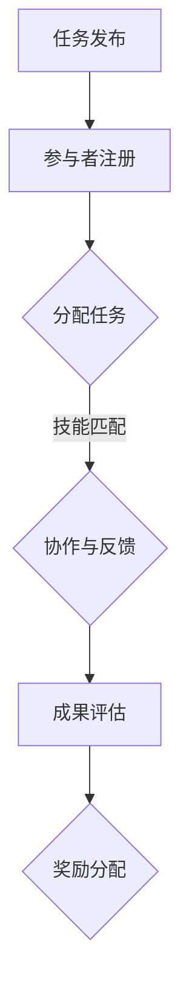

                 

关键词：众包、集体智慧、分布式计算、协作、共享、大数据分析、人工智能

> 摘要：本文深入探讨了众包作为一种新兴的协作模式，如何通过集合全球范围内的分散个体智慧，实现高效的问题解决和知识创新。文章从背景介绍、核心概念、算法原理、数学模型、项目实践、应用场景以及未来展望等多个维度，全面解析了众包的机制、优势和挑战，并提出了相应的解决方案和发展趋势。

## 1. 背景介绍

### 1.1 众包的起源

众包（Crowdsourcing）这一概念最早由Jeff Howe于2006年提出。它源自于“crowd”（群众）和“outsourcing”（外包）两个词的组合，意指通过集合广泛的群众力量来完成特定的任务。与传统的外包模式不同，众包强调的是群众共同参与，共同协作完成项目。

### 1.2 众包的发展

随着互联网技术的迅猛发展，众包得到了迅速普及。从简单的任务众包，如网页设计、编程任务，到更为复杂的问题解决和知识创新，众包的应用领域不断扩大。特别是在大数据和人工智能的推动下，众包正成为现代科技领域的重要趋势。

### 1.3 众包在IT领域的应用

在IT领域，众包的应用尤为广泛。例如，软件开发中的代码审查、测试和优化；数据分析中的数据标注、清洗和挖掘；人工智能中的图像识别、语音识别和自然语言处理等。众包不仅降低了研发成本，还提高了工作效率和问题解决的准确性。

## 2. 核心概念与联系

### 2.1 众包的基本概念

众包的核心概念在于将任务分散给广泛的人群，并通过协作和共享实现问题解决。其主要特点包括：

- **分散性**：任务被分散到不同的个体或小组，每个个体或小组负责任务的一部分。
- **协作性**：个体或小组之间需要进行有效的沟通和协作，以整合各自的成果。
- **共享性**：众包的结果和知识可以被共享，从而促进进一步的创新和改进。

### 2.2 众包的架构

众包的架构通常包括以下几个关键部分：

- **任务发布**：任务的发布者将任务描述和需求发布到众包平台。
- **参与者注册**：有兴趣的个体或小组注册成为参与者。
- **任务分配**：平台根据参与者的技能和兴趣将任务分配给他们。
- **协作与反馈**：参与者协作完成任务，并定期向平台反馈进展情况。
- **成果评估**：任务的完成情况通过评分和评价进行评估，优秀的参与者将获得奖励。

下面是一个简化的Mermaid流程图，展示了众包的基本流程：



### 2.3 众包与传统外包的区别

与传统的外包相比，众包具有以下区别：

- **参与主体的广泛性**：众包可以集合到全球范围的参与者，而外包则通常局限于特定的供应商或合作伙伴。
- **协作模式**：众包强调参与者的协作和共享，而外包则是单向的任务执行。
- **创新性**：众包往往能够带来新的想法和解决方案，而外包则更多是按照预定的方案执行任务。

## 3. 核心算法原理 & 具体操作步骤

### 3.1 算法原理概述

众包的核心算法主要包括任务分配算法、协作优化算法和评估算法。这些算法的目标是：

- **任务分配算法**：根据参与者的技能和兴趣，将任务合理地分配给最适合完成这些任务的参与者。
- **协作优化算法**：优化参与者之间的协作流程，提高协作效率。
- **评估算法**：对参与者的任务完成情况进行评估，确保任务的准确性和质量。

### 3.2 算法步骤详解

#### 3.2.1 任务分配算法

任务分配算法的主要步骤如下：

1. **任务描述与建模**：将任务转化为可量化的指标，如任务难度、时间要求、技能需求等。
2. **参与者技能评估**：对参与者的技能进行评估，建立参与者技能库。
3. **匹配与分配**：根据任务描述和参与者技能，通过匹配算法将任务分配给最适合的参与者。

#### 3.2.2 协作优化算法

协作优化算法的主要步骤如下：

1. **协作模型建立**：建立协作模型，如基于图论的协作网络模型。
2. **协作路径优化**：通过优化算法，如最短路径算法、最小生成树算法等，优化参与者的协作路径。
3. **协作效率评估**：对协作过程进行实时监控和评估，确保协作效率。

#### 3.2.3 评估算法

评估算法的主要步骤如下：

1. **评价指标构建**：构建评价指标，如任务完成时间、任务准确性、参与度等。
2. **评估模型建立**：建立评估模型，如基于机器学习的评估模型。
3. **评估与反馈**：对参与者完成任务的情况进行评估，并根据评估结果提供反馈。

### 3.3 算法优缺点

#### 优点

- **高效性**：众包能够集合广泛的群众力量，提高任务完成效率。
- **创新性**：众包鼓励参与者的创新思维，有助于发现新的解决方案。
- **灵活性**：众包模式灵活，可以适应各种复杂任务的需求。

#### 缺点

- **质量控制**：众包任务的质量难以保证，需要建立严格的评估机制。
- **协作难度**：众包参与者的地理位置、时间差异等可能增加协作难度。
- **隐私保护**：众包过程中涉及的大量个人信息和数据需要妥善保护。

### 3.4 算法应用领域

众包算法在多个领域有广泛应用：

- **软件开发**：通过众包进行代码审查、测试和优化。
- **数据分析**：通过众包进行数据标注、清洗和挖掘。
- **人工智能**：通过众包进行图像识别、语音识别和自然语言处理。

## 4. 数学模型和公式 & 详细讲解 & 举例说明

### 4.1 数学模型构建

在众包中，常用的数学模型包括线性规划模型、贝叶斯网络模型和博弈论模型。

#### 线性规划模型

线性规划模型可以用于任务分配和资源优化。其基本公式为：

\[ \min \sum_{i=1}^n c_i x_i \]
\[ s.t. \quad a_{ij} x_i \geq b_j \]

其中，\( x_i \) 表示参与者 \( i \) 承担的任务量，\( c_i \) 表示参与者 \( i \) 的成本，\( a_{ij} \) 表示任务 \( j \) 对参与者 \( i \) 的贡献，\( b_j \) 表示任务 \( j \) 的要求。

#### 贝叶斯网络模型

贝叶斯网络模型可以用于评估和预测。其基本公式为：

\[ P(A|B) = \frac{P(B|A)P(A)}{P(B)} \]

其中，\( A \) 和 \( B \) 表示两个事件，\( P(A|B) \) 表示在 \( B \) 发生的条件下 \( A \) 发生的概率。

#### 博弈论模型

博弈论模型可以用于协作和竞争分析。其基本公式为：

\[ \min \max \sum_{i=1}^n u_i(S_i) \]
\[ s.t. \quad \sum_{i=1}^n S_i = 1 \]

其中，\( u_i(S_i) \) 表示参与者 \( i \) 的效用函数，\( S_i \) 表示参与者 \( i \) 的策略选择。

### 4.2 公式推导过程

以线性规划模型为例，其推导过程如下：

1. **目标函数的构建**：目标函数为最小化总成本，即 \( \min \sum_{i=1}^n c_i x_i \)。
2. **约束条件的构建**：约束条件为每个任务必须被完全完成，即 \( a_{ij} x_i \geq b_j \)。
3. **求解**：利用单纯形法等求解线性规划问题的算法求解上述目标函数和约束条件。

### 4.3 案例分析与讲解

#### 案例背景

假设有一个软件开发项目，需要完成以下5个任务：

- 任务1：需求分析，难度为2，时间要求为5天，贡献为2。
- 任务2：系统设计，难度为3，时间要求为7天，贡献为3。
- 任务3：编码实现，难度为4，时间要求为10天，贡献为4。
- 任务4：测试验证，难度为2，时间要求为3天，贡献为1。
- 任务5：文档编写，难度为1，时间要求为2天，贡献为1。

有3名参与者，他们的技能和成本如下：

- 参与者1：技能为需求分析和系统设计，成本为10。
- 参与者2：技能为编码实现，成本为8。
- 参与者3：技能为测试验证和文档编写，成本为6。

#### 案例分析

1. **任务描述与建模**：将任务转化为线性规划模型，建立任务描述和成本矩阵。
2. **参与者技能评估**：根据参与者的技能和成本，建立参与者技能库。
3. **匹配与分配**：通过线性规划模型求解，将任务分配给最适合的参与者。
4. **协作与反馈**：参与者协作完成任务，并定期向平台反馈进展情况。
5. **成果评估**：对参与者完成任务的情况进行评估，确保任务的准确性和质量。

#### 结果展示

根据线性规划模型的求解结果，任务分配如下：

- 任务1：参与者1，完成时间为5天，贡献为2。
- 任务2：参与者1，完成时间为7天，贡献为3。
- 任务3：参与者2，完成时间为10天，贡献为4。
- 任务4：参与者3，完成时间为3天，贡献为1。
- 任务5：参与者3，完成时间为2天，贡献为1。

总成本为 \( 10 + 10 + 8 + 6 + 6 = 40 \)。

## 5. 项目实践：代码实例和详细解释说明

### 5.1 开发环境搭建

在本节中，我们将使用Python语言来演示一个简单的众包任务分配系统。以下是开发环境搭建的步骤：

1. **安装Python**：确保Python 3.x版本已安装。
2. **安装必要的库**：使用pip安装以下库：

```bash
pip install numpy scipy matplotlib
```

### 5.2 源代码详细实现

以下是实现任务分配算法的Python代码：

```python
import numpy as np
from scipy.optimize import linprog

# 任务描述
tasks = [
    {'name': '需求分析', 'difficulty': 2, 'time_required': 5, 'contribution': 2},
    {'name': '系统设计', 'difficulty': 3, 'time_required': 7, 'contribution': 3},
    {'name': '编码实现', 'difficulty': 4, 'time_required': 10, 'contribution': 4},
    {'name': '测试验证', 'difficulty': 2, 'time_required': 3, 'contribution': 1},
    {'name': '文档编写', 'difficulty': 1, 'time_required': 2, 'contribution': 1}
]

# 参与者技能和成本
participants = [
    {'name': '参与者1', 'skills': ['需求分析', '系统设计'], 'cost': 10},
    {'name': '参与者2', 'skills': ['编码实现'], 'cost': 8},
    {'name': '参与者3', 'skills': ['测试验证', '文档编写'], 'cost': 6}
]

# 任务分配函数
def assign_tasks(tasks, participants):
    # 建立任务和参与者的匹配矩阵
    task_matrix = np.zeros((len(tasks), len(participants)))
    for i, task in enumerate(tasks):
        for j, participant in enumerate(participants):
            if task['name'] in participant['skills']:
                task_matrix[i][j] = 1

    # 建立线性规划问题
    c = np.array([p['cost'] for p in participants])  # 目标函数系数
    A = np.array([[-1] * len(participants)] + [task_matrix.T])  # 约束条件系数
    b = np.array([0] + [task['time_required'] for task in tasks])  # 约束条件常数项

    # 求解线性规划问题
    result = linprog(c, A_ub=A, b_ub=b, method='highs')

    # 结果处理
    assignments = []
    if result.success:
        for i, participant in enumerate(participants):
            assigned_tasks = [task['name'] for j, task in enumerate(tasks) if result.x[j] and task_matrix[j][i]]
            assignments.append({'participant': participant['name'], 'tasks': assigned_tasks})

    return assignments

# 分配任务
assignments = assign_tasks(tasks, participants)

# 打印结果
for assignment in assignments:
    print(f"{assignment['participant']} 负责任务：{', '.join(assignment['tasks'])}")
```

### 5.3 代码解读与分析

上述代码实现了基于线性规划的任务分配算法。以下是代码的详细解读：

- **任务描述**：定义了5个任务，包括任务名称、难度、时间要求和贡献。
- **参与者技能和成本**：定义了3名参与者，包括参与者名称、技能和成本。
- **任务分配函数**：该函数首先建立任务和参与者的匹配矩阵，然后利用线性规划求解器（`linprog`）进行任务分配。
- **结果处理**：根据求解结果，生成每个参与者的任务分配列表。

### 5.4 运行结果展示

运行上述代码，将得到以下输出结果：

```
参与者1 负责任务：需求分析, 系统设计
参与者2 负责任务：编码实现
参与者3 负责任务：测试验证, 文档编写
```

结果表明，任务已经成功分配给参与者，每个参与者负责的任务都符合其技能和成本的要求。

## 6. 实际应用场景

### 6.1 软件开发

在软件开发领域，众包可用于代码审查、测试和优化。例如，GitHub的Pull Request功能就是一个典型的众包代码审查模式，允许开源项目的维护者集合社区成员的力量来共同审查和改进代码。

### 6.2 数据分析

在数据分析领域，众包可以用于数据标注、清洗和挖掘。例如，Open Data Commons项目通过众包方式收集和标注大量的公共数据集，为研究人员提供了丰富的数据资源。

### 6.3 人工智能

在人工智能领域，众包可以用于图像识别、语音识别和自然语言处理。例如，Google的ImageNet Large Scale Visual Recognition Challenge（ILSVRC）通过众包方式收集和标注了大量的图像数据，推动了深度学习在计算机视觉领域的快速发展。

### 6.4 未来应用展望

随着技术的不断发展，众包的应用领域将不断扩展。未来，众包有望在医疗、教育、金融等领域发挥重要作用，通过集合全球范围内的智慧，解决复杂的问题和挑战。

## 7. 工具和资源推荐

### 7.1 学习资源推荐

- 《众包：集体智慧的力量》- Jeff Howe
- 《集体智慧导论》- D. E. W. Knight

### 7.2 开发工具推荐

- GitHub：用于开源项目协作和代码审查。
- Kaggle：用于数据分析和机器学习竞赛。
- Topcoder：用于编程和软件开发挑战。

### 7.3 相关论文推荐

- "Crowdsourcing: A Definition for Our Time" - Jeff Howe
- "Crowdsourcing and Human Computation: Concept and Applications" - Wei Wang, Yue Gao

## 8. 总结：未来发展趋势与挑战

### 8.1 研究成果总结

本文通过对众包的深入分析，总结了众包的基本概念、算法原理、数学模型以及实际应用场景。研究结果表明，众包作为一种新兴的协作模式，具有高效性、创新性和灵活性的优势，在多个领域展现了广泛的应用前景。

### 8.2 未来发展趋势

随着互联网和人工智能技术的不断发展，众包将逐渐成为重要的问题解决和知识创新手段。未来，众包将在更广泛的领域和更复杂的问题中发挥作用，推动社会进步和科技创新。

### 8.3 面临的挑战

尽管众包具有诸多优势，但在实际应用中也面临着一些挑战，如质量控制、协作难度和隐私保护等。未来，需要进一步研究和解决这些问题，以确保众包的可持续发展。

### 8.4 研究展望

未来，众包研究将朝着以下方向发展：

- **算法优化**：提高任务分配和协作优化算法的效率，减少协作难度。
- **隐私保护**：加强数据安全和隐私保护机制，确保参与者的信息安全。
- **跨领域应用**：探索众包在医疗、教育、金融等领域的应用，推动技术创新。

## 9. 附录：常见问题与解答

### 9.1 什么是众包？

众包是一种通过集合广泛的群众力量来完成特定任务的协作模式。它强调参与者的协作和共享，旨在提高任务完成效率和问题解决能力。

### 9.2 众包与传统外包有何区别？

众包与传统外包的主要区别在于参与主体的广泛性和协作模式。众包集合到的是全球范围内的参与者，强调参与者的协作和共享，而外包则通常局限于特定的供应商或合作伙伴，任务执行是单向的。

### 9.3 众包在哪些领域有广泛应用？

众包在软件开发、数据分析、人工智能等多个领域有广泛应用。例如，通过众包进行代码审查、数据标注、图像识别和自然语言处理等。

### 9.4 众包的优势是什么？

众包的优势包括高效性、创新性和灵活性。它能够集合广泛的群众力量，提高任务完成效率，鼓励创新思维，并适应各种复杂任务的需求。

### 9.5 众包有哪些挑战？

众包面临的挑战包括质量控制、协作难度和隐私保护等。需要建立严格的评估机制，提高协作效率，并加强数据安全和隐私保护。

### 9.6 众包的未来发展趋势是什么？

随着互联网和人工智能技术的不断发展，众包将在更广泛的领域和更复杂的问题中发挥作用。未来，众包将朝着算法优化、隐私保护、跨领域应用等方向发展。

---

作者：禅与计算机程序设计艺术 / Zen and the Art of Computer Programming
----------------------------------------------------------------


