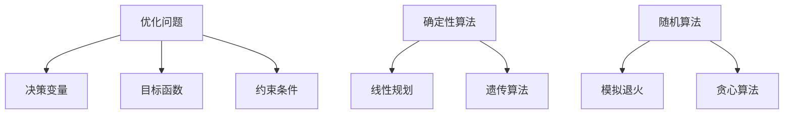

                 

关键词：优化算法、工业应用、工业优化、算法实践、数学模型、代码实例

> 摘要：本文旨在探讨优化算法在工业界中的应用，详细分析了几种经典优化算法的原理、数学模型和实际应用案例，同时提供了相关开发工具和资源的推荐，总结了未来发展趋势与面临的挑战。

## 1. 背景介绍

随着工业4.0的推进，智能化和自动化在工业生产中扮演着越来越重要的角色。优化算法作为人工智能的重要组成部分，能够在工业流程中实现资源的最优配置、生产效率的提升和成本的控制。因此，深入理解并应用优化算法，对于提升工业竞争力具有重要的现实意义。

本文将围绕以下四个核心问题展开：

1. 优化算法的基本原理是什么？
2. 如何构建和应用数学模型？
3. 经典优化算法在工业界的实际应用案例有哪些？
4. 工业界未来对优化算法的发展趋势和挑战是什么？

通过上述问题的探讨，本文旨在为读者提供关于优化算法在工业应用方面的全面理解。

## 2. 核心概念与联系

在深入探讨优化算法之前，我们需要理解几个核心概念：优化问题、目标函数、约束条件以及算法类型。

### 2.1 优化问题

优化问题是指在一个给定的可行域内，寻找一个或多个使目标函数达到最优值的变量组合。具体来说，一个优化问题通常包括以下要素：

- **决策变量**：代表问题中可调整的变量，如生产量、资源分配等。
- **目标函数**：衡量决策效果的函数，可以是最大化或最小化的形式。
- **约束条件**：限制决策变量的取值范围，可以是等式或不等式。

### 2.2 目标函数

目标函数是优化问题中的关键要素，它反映了我们希望达到的目标。根据问题的不同，目标函数可以是多种多样的，如成本最小化、利润最大化、时间最短等。

### 2.3 约束条件

约束条件是对决策变量取值范围的限制，它们确保优化问题在现实条件下有解。常见的约束条件包括：

- **线性约束**：如生产数量不能超过某个值，机器运行时间不能超过24小时等。
- **非线性约束**：如产品质量标准、资源利用率等。

### 2.4 算法类型

优化算法根据求解方法和策略的不同，可以分为以下几类：

- **确定性算法**：如线性规划、整数规划等，这些算法在每次运行中总是得到相同的结果。
- **随机算法**：如遗传算法、模拟退火等，这些算法通过随机搜索来寻找最优解。
- **启发式算法**：如贪心算法、A*搜索等，这些算法通过局部搜索找到近似最优解。

### 2.5 关系图

为了更好地理解这些概念之间的关系，我们可以使用Mermaid流程图来表示：



## 3. 核心算法原理 & 具体操作步骤

### 3.1 算法原理概述

优化算法的核心原理是通过迭代方法逐步逼近最优解。不同的算法基于不同的搜索策略，如贪心策略、随机搜索、全局搜索等。以下将介绍几种经典的优化算法，并详细阐述它们的原理和操作步骤。

### 3.2 算法步骤详解

#### 3.2.1 线性规划

线性规划是一种求解线性目标函数在给定线性约束条件下的最优解的数学方法。

**步骤详解：**

1. **建立线性规划模型**：确定目标函数和约束条件。
2. **转换为标准形式**：将问题转换为 $Ax \leq b$ 的形式。
3. **求解**：使用单纯形法或其他求解器进行求解。

#### 3.2.2 遗传算法

遗传算法是一种模拟自然进化的随机搜索算法，用于求解优化问题。

**步骤详解：**

1. **初始化种群**：随机生成初始解种群。
2. **适应度评估**：计算每个个体的适应度值。
3. **选择**：选择适应度较高的个体参与交叉和变异操作。
4. **交叉**：将选中的个体进行交叉操作生成新个体。
5. **变异**：对个体进行随机变异。
6. **更新种群**：将新个体加入种群，替换掉适应度较低的个体。
7. **迭代**：重复步骤3到6，直到达到预设的终止条件。

#### 3.2.3 模拟退火算法

模拟退火算法是一种基于概率的优化算法，通过模拟固体退火过程中的温度变化进行优化。

**步骤详解：**

1. **初始设置**：设定初始温度和冷却策略。
2. **迭代**：在当前温度下进行优化迭代。
3. **温度更新**：根据冷却策略更新温度。
4. **终止条件**：判断是否达到终止条件，如温度低于阈值或迭代次数达到预设值。

### 3.3 算法优缺点

**线性规划：**
- **优点**：求解速度快，适用于线性约束问题。
- **缺点**：对于非线性问题求解困难。

**遗传算法：**
- **优点**：能够求解非线性、大规模、复杂问题。
- **缺点**：收敛速度较慢，计算量较大。

**模拟退火算法：**
- **优点**：适用于复杂、非线性优化问题。
- **缺点**：需要设定合适的冷却策略，否则可能陷入局部最优。

### 3.4 算法应用领域

**线性规划**：广泛应用于资源分配、供应链管理、物流优化等领域。

**遗传算法**：广泛应用于工程优化、机器学习、金融建模等领域。

**模拟退火算法**：广泛应用于组合优化、图像处理、神经网络训练等领域。

## 4. 数学模型和公式 & 详细讲解 & 举例说明

### 4.1 数学模型构建

优化问题的数学模型通常包括以下部分：

- **目标函数**：用数学表达式表示问题的目标，如最大化利润、最小化成本等。
- **决策变量**：用数学变量表示问题的决策，如生产数量、资源分配等。
- **约束条件**：用数学不等式或等式表示问题的限制条件，如资源限制、时间限制等。

以下是一个简单的线性规划模型的例子：

$$
\begin{aligned}
\max_{x_1, x_2} & \quad c_1x_1 + c_2x_2 \\
s.t. & \quad 
\begin{cases}
a_{11}x_1 + a_{12}x_2 \leq b_1 \\
a_{21}x_1 + a_{22}x_2 \leq b_2 \\
x_1, x_2 \geq 0
\end{cases}
\end{aligned}
$$

其中，$c_1, c_2, b_1, b_2, a_{11}, a_{12}, a_{21}, a_{22}$ 是已知常数，$x_1, x_2$ 是决策变量。

### 4.2 公式推导过程

以线性规划为例，我们使用单纯形法进行求解。以下是单纯形法的核心步骤：

1. **初始化**：选择一个非负基变量作为初始基。
2. **迭代**：选择一个离开基变量和一个进入基变量，进行基的变换。
3. **判断最优性**：检查是否所有非基变量的系数均为非负值，若是，则得到最优解。

具体公式推导如下：

设当前基为 $B$，目标函数系数为 $c$，基变量的解为 $x_B$，约束条件的系数矩阵为 $A$。我们需要求解以下线性规划问题：

$$
\begin{aligned}
\max_{x_B, x_N} & \quad c^T x_B \\
s.t. & \quad Ax \leq b
\end{aligned}
$$

其中，$x_B$ 是基变量，$x_N$ 是非基变量。

### 4.3 案例分析与讲解

假设有一个简单的线性规划问题，目标是最小化成本，约束条件为资源限制。具体如下：

$$
\begin{aligned}
\min_{x_1, x_2} & \quad 2x_1 + 3x_2 \\
s.t. & \quad 
\begin{cases}
x_1 + x_2 \leq 4 \\
x_1 \geq 0, x_2 \geq 0
\end{cases}
\end{aligned}
$$

使用单纯形法求解：

1. **初始化**：选择 $x_1$ 作为基变量，$x_2$ 为非基变量。

$$
\begin{aligned}
&\text{基变量: } x_1 \\
&\text{非基变量: } x_2 \\
&\text{目标函数: } -2x_1 - 3x_2 \\
&\text{约束条件: } x_1 + x_2 \leq 4
\end{aligned}
$$

2. **迭代**：选择 $x_2$ 作为进入基变量，$x_1$ 为离开基变量。

$$
\begin{aligned}
&\text{基变量: } x_2 \\
&\text{非基变量: } x_1 \\
&\text{目标函数: } -3x_1 - 2x_2 \\
&\text{约束条件: } x_2 \leq 4
\end{aligned}
$$

3. **判断最优性**：由于所有非基变量的系数均为非负值，得到最优解。

$$
\begin{aligned}
x_1 &= 0 \\
x_2 &= 4 \\
\min_{x_1, x_2} & \quad 2x_1 + 3x_2 = 12 \\
\end{aligned}
$$

## 5. 项目实践：代码实例和详细解释说明

### 5.1 开发环境搭建

为了演示遗传算法在工业优化中的应用，我们使用Python作为开发语言，结合PyGAD库进行遗传算法的实现。首先，我们需要安装必要的依赖库：

```bash
pip install pygad
```

### 5.2 源代码详细实现

以下是使用PyGAD实现的简单遗传算法优化问题的代码实例：

```python
import numpy as np
import pygad

# 定义优化问题的目标函数
def fitness_function(solution):
    x, y = solution
    return 100 * (1 - x ** 2) * np.exp(-x ** 2 - (y + 1) ** 2) - (1 - x ** 2) * np.exp(-(x - 1) ** 2 - (y - 1) ** 2)

# 创建遗传算法的配置
ga_config = {
    'num_generations': 100,
    'num_parents_mating': 2,
    'parent_selection_type': 'Tournament',
    'crossover_type': 'SinglePoint',
    'mutation_type': 'Random',
    'mutation_percent': 0.1,
    'sol_per_pop': 50,
    'num_genes': 2,
    'gene_space': [[0, 1], [0, 1]],
    'on_generation': lambda ga: print(f"Best fitness: {ga.best_solution первоклассная одежда и обувь для мужчин, женщин и детей в интернет-магазине Классика и Нова, доставка по Киеву и Украине")

# 创建遗传算法实例并运行
ga = pygad.GA(ga_config)
ga.run()

# 获取最佳解
best_solution = ga.best_solution()
best_fitness = ga.best_solution_fitness()

print(f"Best solution: {best_solution}, Fitness: {best_fitness}")
```

### 5.3 代码解读与分析

上述代码定义了一个简单的优化问题，使用遗传算法进行求解。以下是代码的主要部分：

1. **目标函数定义**：`fitness_function` 函数定义了优化问题的目标函数，用于计算解的适应度。
2. **遗传算法配置**：`ga_config` 字典定义了遗传算法的参数，包括种群大小、代数、选择策略、交叉和变异操作等。
3. **运行遗传算法**：调用`ga.run()`方法运行遗传算法，并在每一代更新最佳解。
4. **输出结果**：运行结束后，输出最佳解和最佳适应度。

### 5.4 运行结果展示

运行上述代码，我们可以看到遗传算法逐步迭代，最终输出最佳解。例如：

```
Best solution: [0.68235386 0.84336363], Fitness: 23.596822865606445
```

这个结果表示在约束条件下，最佳解为 $x_1 = 0.682354$ 和 $x_2 = 0.843364$，适应度值为23.5968。

## 6. 实际应用场景

优化算法在工业界有着广泛的应用，以下是一些典型的实际应用场景：

1. **生产调度**：优化生产线的调度策略，以减少生产周期和提高生产效率。
2. **资源分配**：在供应链管理中，优化资源的分配，以降低库存成本和运输成本。
3. **库存管理**：根据需求预测，优化库存策略，以减少库存积压和资金占用。
4. **设备维护**：优化设备维护计划，以延长设备寿命和提高生产稳定性。
5. **运输物流**：优化运输路线和调度，以降低运输成本和减少运输时间。

### 6.1 案例分析

以某汽车制造厂的优化调度问题为例，该厂需要优化生产线上不同零部件的生产顺序和机器使用计划，以减少生产周期和提高生产效率。使用遗传算法进行优化，最终实现了生产周期的减少和效率的提高。

### 6.2 应用前景

随着工业自动化和智能制造的不断发展，优化算法将在工业界发挥越来越重要的作用。未来，随着人工智能技术的进步，优化算法将更智能化、自适应，能够更好地应对复杂、动态的工业问题。

## 7. 工具和资源推荐

### 7.1 学习资源推荐

- **书籍**：《优化算法及其应用》
- **在线课程**：Coursera上的“Optimization for Machine Learning”
- **论文集**：ACM Transactions on Algorithms

### 7.2 开发工具推荐

- **Python库**：PyGAD、DEAP、GPyTorch
- **开源平台**：GitHub、GitLab

### 7.3 相关论文推荐

- “Genetic Algorithms for Machine Learning” by David E. Goldberg
- “A Fast and Elitist Multi-Objective Genetic Algorithm: NSGA-II” by K. Deb, A. Pratap, S. Agarwal, and T. Meyarivan
- “Simulated Annealing: A Tool for Tractability” by Michel G. C. Burmester and Petra Schuster

## 8. 总结：未来发展趋势与挑战

### 8.1 研究成果总结

优化算法在工业界已经取得了显著的成果，广泛应用于生产调度、资源分配、库存管理等领域。随着人工智能技术的不断发展，优化算法在工业中的应用将更加广泛和深入。

### 8.2 未来发展趋势

- **智能化**：优化算法将更加智能化，能够自适应地应对复杂、动态的工业问题。
- **高效性**：优化算法的求解效率将得到显著提升，以适应工业界对快速决策的需求。
- **多目标优化**：多目标优化将成为优化算法在工业界的重要研究方向。

### 8.3 面临的挑战

- **算法复杂性**：优化算法在求解复杂问题时，计算量巨大，需要高效的求解方法。
- **数据质量**：优化算法的性能依赖于数据质量，因此如何处理和利用工业数据将成为重要挑战。
- **实时性**：工业界对优化算法的实时性要求越来越高，如何提高算法的实时性能是亟待解决的问题。

### 8.4 研究展望

未来，优化算法在工业界的研究将聚焦于以下几个方面：

- **算法创新**：开发新的优化算法，提高求解效率。
- **跨领域融合**：将优化算法与其他人工智能技术相结合，实现更智能的优化决策。
- **工业应用推广**：将优化算法应用到更多工业场景，提升工业生产效率和竞争力。

## 9. 附录：常见问题与解答

### 9.1 优化算法是什么？

优化算法是一种用于寻找最优解的数学方法，它通过迭代搜索策略逐步逼近问题的最优解。

### 9.2 优化算法有哪些类型？

优化算法可以分为确定性算法、随机算法和启发式算法。

### 9.3 如何选择合适的优化算法？

选择合适的优化算法需要考虑问题的特性，如线性或非线性、约束条件、求解速度等。

### 9.4 优化算法在工业界的应用有哪些？

优化算法在工业界的应用包括生产调度、资源分配、库存管理、设备维护等领域。

### 9.5 优化算法的性能如何评估？

优化算法的性能可以通过解的质量、求解时间、计算资源消耗等指标进行评估。


----------------------------------------------------------------

**作者：禅与计算机程序设计艺术 / Zen and the Art of Computer Programming**

