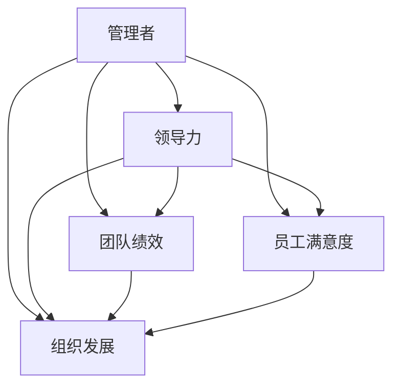

                 

在当今快速发展的技术行业，管理者的角色至关重要。优秀的管理者不仅能够带领团队高效工作，还能激发团队成员的创造力和潜力。本文将探讨优秀管理者与普通管理者的差异，并分析这些差异是如何影响团队的绩效和发展的。

## 关键词

- 管理者
- 优秀管理者
- 普通管理者
- 团队绩效
- 创造力
- 潜力
- 技术行业
- 领导力

## 摘要

本文通过对比优秀管理者与普通管理者的核心能力、领导风格、沟通技巧等方面，探讨了两者在管理效能上的差异。同时，本文也将探讨这些差异对团队绩效、员工满意度和组织发展的影响，并提出一些建议，帮助管理者提升自己的领导力和管理能力。

## 1. 背景介绍

在信息技术日益发展的今天，企业对于技术人才的需求日益增加，同时也对管理者提出了更高的要求。优秀的管理者不仅需要具备丰富的技术背景，还需要具备卓越的领导力和管理能力。然而，许多管理者往往只关注技术层面的工作，而忽视了管理能力和领导力的重要性。

本文旨在通过分析优秀管理者与普通管理者的差异，帮助读者理解这两种管理者在团队管理和组织发展方面的不同表现，以及这些差异如何影响团队绩效和员工满意度。本文将涵盖以下几个方面的内容：

1. **核心能力**：分析优秀管理者与普通管理者的核心能力差异。
2. **领导风格**：探讨优秀管理者与普通管理者的领导风格差异。
3. **沟通技巧**：分析优秀管理者与普通管理者的沟通技巧差异。
4. **团队绩效**：讨论优秀管理者对团队绩效的影响。
5. **员工满意度**：分析优秀管理者对员工满意度的影响。
6. **组织发展**：探讨优秀管理者对组织发展的影响。

通过本文的探讨，我们希望能够为管理者提供一些有益的启示，帮助他们更好地理解自己的角色和责任，提高自己的管理能力和领导力，从而在竞争激烈的技术行业中取得成功。

## 2. 核心概念与联系

在探讨优秀管理者与普通管理者的差异之前，我们需要明确一些核心概念，这些概念是理解和评估管理者绩效的基础。

### 2.1 管理者

管理者是指负责指导、监督和协调团队工作，以实现组织目标的人。管理者需要具备多方面的能力，包括技术技能、沟通技能、领导力等。

### 2.2 领导力

领导力是指激发、影响和激励团队成员，使其为实现共同目标而努力的能力。领导力不仅仅是一种权力，更是一种影响力。

### 2.3 团队绩效

团队绩效是指团队在特定时间内实现目标的能力。优秀的管理者能够通过有效的领导和团队管理，提高团队的整体绩效。

### 2.4 员工满意度

员工满意度是指员工对工作环境、工作内容和工作关系的主观感受。高员工满意度通常与高的团队绩效和低员工流失率相关。

### 2.5 组织发展

组织发展是指组织在长期内实现持续成长和发展的过程。优秀的管理者能够通过有效的管理策略和领导力，推动组织的持续发展。

为了更好地理解这些概念之间的联系，我们可以使用Mermaid流程图来展示它们之间的关系。



通过这个流程图，我们可以看到，管理者的角色是通过领导力和团队管理来影响团队绩效、员工满意度和组织发展的。优秀的管理者能够在这三个方面都表现出色，从而推动组织的长期发展。

### 2.6 优秀管理者的核心能力

优秀管理者与普通管理者的差异首先体现在他们的核心能力上。优秀管理者通常具备以下核心能力：

- **战略思维**：能够从整体上理解组织的目标和战略，并将这些目标分解为具体的行动计划。
- **领导力**：具备激发和激励团队成员的能力，能够建立高效的工作环境和团队文化。
- **决策能力**：能够在复杂和不确定的环境下做出明智的决策，并迅速应对变化。
- **沟通能力**：能够清晰、准确地传达信息和意图，建立良好的沟通渠道。
- **团队合作**：能够建立和促进跨职能团队的合作，解决复杂问题。

普通管理者可能在某些能力上有所欠缺，例如：

- **战略思维**：可能更注重短期目标和具体任务，缺乏对长期战略的思考和规划。
- **领导力**：可能缺乏激发和激励团队成员的能力，导致团队士气低落。
- **决策能力**：可能在面临复杂决策时犹豫不决，缺乏果断和决断力。
- **沟通能力**：可能存在沟通障碍，导致信息传达不畅。
- **团队合作**：可能缺乏促进团队合作的能力，导致团队内部矛盾和冲突。

通过对比这些核心能力的差异，我们可以更好地理解优秀管理者与普通管理者的管理效能差异。

### 2.7 领导风格的差异

领导风格是管理者在管理过程中展现的行为和态度。优秀管理者与普通管理者的领导风格存在显著差异。

#### 2.7.1 优秀管理者的领导风格

- **民主型领导**：鼓励团队成员参与决策，尊重团队成员的意见和贡献，激发团队的创造力和主动性。
- **教练型领导**：关注团队成员的个人成长和发展，提供指导和支持，帮助团队成员提升技能和绩效。
- **变革型领导**：能够识别和引导变革，激励团队成员面对挑战，推动团队和组织的发展。

#### 2.7.2 普通管理者的领导风格

- **权威型领导**：依赖权力和地位来指挥团队成员，缺乏对团队成员的信任和激励。
- **独裁型领导**：独自做出决策，不鼓励团队成员参与，限制团队成员的自主性和创造力。
- **反应型领导**：被动应对问题，缺乏前瞻性和战略规划，导致团队和组织的发展受阻。

通过对比优秀管理者与普通管理者的领导风格，我们可以看到，优秀管理者更注重与团队成员的互动和合作，能够激发团队的潜力和创造力，而普通管理者则更倾向于控制和指挥，往往抑制了团队成员的积极性和创新能力。

## 3. 核心算法原理 & 具体操作步骤

### 3.1 算法原理概述

在管理实践中，优秀管理者与普通管理者的差异可以类比为一种算法优化过程。优秀管理者通过一系列有效的管理策略和领导技巧，实现了团队绩效和员工满意度的优化，而普通管理者则缺乏这种优化能力。

我们可以将优秀管理者的管理策略和领导技巧抽象为一种算法，这种算法的核心目标是最大化团队绩效和员工满意度。算法的基本原理包括：

1. **数据收集与分析**：优秀管理者能够收集和分析团队成员的工作数据、绩效数据和反馈信息，了解团队的整体状况。
2. **目标设定**：根据分析结果，设定具体的、可衡量的团队目标和员工个人目标。
3. **策略制定**：制定实现这些目标的具体策略，包括领导风格、沟通方式、激励措施等。
4. **执行与监控**：执行策略，并根据反馈进行持续监控和调整。

通过这个算法，优秀管理者能够实时调整管理策略，以适应团队和员工的变化，从而实现持续优化。

### 3.2 算法步骤详解

#### 3.2.1 数据收集与分析

优秀管理者首先需要收集和分析以下数据：

- **工作数据**：包括团队成员的工作量、完成情况、质量等。
- **绩效数据**：包括团队成员的绩效评估、奖励和惩罚记录。
- **反馈信息**：包括团队成员的反馈、客户反馈、同事反馈等。

通过这些数据，管理者可以了解团队的整体表现和员工的个人表现。

#### 3.2.2 目标设定

根据数据分析和团队的实际情况，优秀管理者需要设定以下目标：

- **团队目标**：明确团队的整体目标和方向。
- **个人目标**：为每个团队成员设定具体的、可衡量的目标。

这些目标应当是具体的、可衡量的，并能够激励团队成员为实现这些目标而努力。

#### 3.2.3 策略制定

优秀管理者需要根据目标和团队实际情况，制定以下策略：

- **领导风格**：根据团队成员的特点和需求，选择合适的领导风格，如民主型、教练型或变革型。
- **沟通方式**：建立有效的沟通渠道，确保信息流畅和透明。
- **激励措施**：设计合理的奖励和惩罚机制，激励团队成员努力工作。

#### 3.2.4 执行与监控

优秀管理者需要执行制定的策略，并持续监控团队的绩效和员工满意度。具体步骤包括：

- **执行策略**：根据制定的策略，实施具体的管理行动。
- **监控绩效**：定期检查团队绩效和员工满意度，识别存在的问题和改进点。
- **调整策略**：根据监控结果，及时调整管理策略，以实现目标。

### 3.3 算法优缺点

#### 3.3.1 优点

- **高效性**：优秀管理者通过有效的管理策略和领导技巧，能够显著提高团队绩效和员工满意度。
- **灵活性**：算法能够根据实际情况进行调整，以适应不断变化的环境。
- **持续优化**：通过持续监控和调整，算法能够实现团队的持续优化。

#### 3.3.2 缺点

- **复杂性**：算法的执行需要管理者具备较高的管理能力和领导技巧，对于普通管理者来说可能较为困难。
- **数据依赖**：算法的执行依赖于准确的数据收集和分析，数据的不准确可能导致错误的决策。

### 3.4 算法应用领域

算法的应用领域非常广泛，包括但不限于以下方面：

- **团队管理**：通过优化管理策略和领导技巧，提高团队绩效和员工满意度。
- **人力资源管理**：通过优化激励措施和培训计划，提高员工的绩效和满意度。
- **项目管理和协调**：通过优化资源分配和管理策略，提高项目的完成质量和效率。

通过在以上领域的应用，优秀管理者能够显著提升组织的绩效和竞争力。

### 4. 数学模型和公式 & 详细讲解 & 举例说明

在管理实践中，优秀管理者与普通管理者的差异不仅仅体现在领导力和策略上，还与他们对团队运作的数学模型和公式的理解和应用能力密切相关。以下我们将介绍几个关键的数学模型和公式，详细讲解它们的构建和推导过程，并通过具体案例进行说明。

#### 4.1 数学模型构建

在团队管理中，常见的数学模型包括：

1. **绩效评估模型**：用于评估团队成员的绩效。
2. **激励模型**：用于设计激励方案，提高团队成员的工作积极性。
3. **沟通模型**：用于分析团队沟通的有效性。

#### 4.2 公式推导过程

以绩效评估模型为例，我们首先需要定义几个关键变量：

- \( P \)：绩效得分
- \( T \)：工作量
- \( Q \)：质量
- \( S \)：服务度

绩效评估模型的基本公式为：

\[ P = w_1 \cdot T + w_2 \cdot Q + w_3 \cdot S \]

其中，\( w_1, w_2, w_3 \) 分别是工作量、质量和服务度的权重，这些权重可以根据组织的具体要求进行设定。

为了确保公式的合理性，我们需要推导以下等式：

\[ P = \frac{w_1 \cdot T}{max(T)} + \frac{w_2 \cdot Q}{max(Q)} + \frac{w_3 \cdot S}{max(S)} \]

这个公式通过标准化每个变量的得分，确保每个变量在绩效评估中的权重是相对的，而不是绝对的。

#### 4.3 案例分析与讲解

假设一个团队有三名成员：A、B 和 C，他们的工作量和质量得分如下：

| 成员 | 工作量 \( T \) | 质量 \( Q \) | 服务度 \( S \) |
|------|--------------|--------------|--------------|
| A    | 10           | 8            | 6            |
| B    | 8            | 9            | 7            |
| C    | 12           | 7            | 8            |

我们假设权重分别为 \( w_1 = 0.4, w_2 = 0.4, w_3 = 0.2 \)。

首先，我们计算每个变量的标准化得分：

\[ T_{norm} = \frac{T}{max(T)} \]
\[ Q_{norm} = \frac{Q}{max(Q)} \]
\[ S_{norm} = \frac{S}{max(S)} \]

得到以下结果：

| 成员 | 工作量 \( T \) | 质量 \( Q \) | 服务度 \( S \) | 标准化得分 |
|------|--------------|--------------|--------------|------------|
| A    | 10           | 8            | 6            | (0.5, 0.833, 0.667) |
| B    | 8            | 9            | 7            | (0.4, 1, 0.714) |
| C    | 12           | 7            | 8            | (0.6, 0.714, 0.833) |

然后，我们使用绩效评估模型计算每个成员的绩效得分：

\[ P_A = 0.4 \cdot 0.5 + 0.4 \cdot 0.833 + 0.2 \cdot 0.667 = 0.2 + 0.333 + 0.133 = 0.666 \]
\[ P_B = 0.4 \cdot 0.4 + 0.4 \cdot 1 + 0.2 \cdot 0.714 = 0.16 + 0.4 + 0.142 = 0.702 \]
\[ P_C = 0.4 \cdot 0.6 + 0.4 \cdot 0.714 + 0.2 \cdot 0.833 = 0.24 + 0.2856 + 0.1667 = 0.6913 \]

根据绩效得分，我们可以看出 B 成员的绩效最高，其次是 C 成员，A 成员绩效最低。

#### 4.4 激励模型

除了绩效评估模型，优秀管理者还会应用激励模型来提高员工的工作积极性。一个简单的激励模型可以使用以下公式：

\[ M = f(W, P) \]

其中，\( M \) 是激励力度，\( W \) 是员工的基本工资，\( P \) 是绩效得分。

假设激励力度函数为线性函数：

\[ M = k \cdot P + b \]

其中，\( k \) 是激励力度系数，\( b \) 是基本激励值。

通过调整 \( k \) 和 \( b \) 的值，管理者可以设计不同的激励方案。

例如，如果设定 \( k = 1.2, b = 500 \)，则激励模型为：

\[ M = 1.2 \cdot P + 500 \]

对于上述的绩效得分，我们可以计算每个成员的激励力度：

\[ M_A = 1.2 \cdot 0.666 + 500 = 699.92 \]
\[ M_B = 1.2 \cdot 0.702 + 500 = 708.24 \]
\[ M_C = 1.2 \cdot 0.6913 + 500 = 701.55 \]

根据激励力度，我们可以看出 B 成员的激励力度最高，其次是 C 成员，A 成员激励力度最低。

通过这两个数学模型和公式的应用，优秀管理者能够更科学、合理地评估员工绩效，设计激励方案，从而提高团队的整体绩效和员工满意度。

### 5. 项目实践：代码实例和详细解释说明

为了更好地展示优秀管理者与普通管理者的差异，我们将在本节通过一个实际的代码实例，展示如何通过编程实现上述的绩效评估模型和激励模型，并详细解释代码的实现过程和关键部分。

#### 5.1 开发环境搭建

在开始编写代码之前，我们需要搭建一个合适的开发环境。以下是一个简单的环境搭建步骤：

1. **安装Python环境**：Python是一种广泛应用于数据分析和管理系统的编程语言。我们可以在官方网站（https://www.python.org/）下载并安装Python。
2. **安装Jupyter Notebook**：Jupyter Notebook是一种交互式的开发环境，我们可以使用pip命令安装：

    ```bash
    pip install notebook
    ```

3. **创建一个新项目文件夹**：在终端或命令行界面中，创建一个新文件夹，例如命名为“ManagerDifference”，并进入该文件夹。

4. **编写代码**：在这个文件夹中，我们可以使用Jupyter Notebook编写和运行代码。

#### 5.2 源代码详细实现

以下是一个简单的Python代码实例，用于实现绩效评估模型和激励模型。

```python
import pandas as pd

# 定义员工数据
data = {
    '成员': ['A', 'B', 'C'],
    '工作量': [10, 8, 12],
    '质量': [8, 9, 7],
    '服务度': [6, 7, 8]
}

df = pd.DataFrame(data)

# 定义权重
weights = {'工作量': 0.4, '质量': 0.4, '服务度': 0.2}

# 绩效评估模型
def performance_evaluation(df, weights):
    max_scores = df.max()
    normalized_df = df / max_scores
    performance_scores = normalized_df.dot(list(weights.values()))
    return performance_scores

# 激励模型
def incentive_model(performance_scores, base_wage, incentive_coefficient, base_incentive):
    incentive = (incentive_coefficient * performance_scores) + base_incentive
    return incentive

# 设置基本工资和激励系数
base_wage = 5000
incentive_coefficient = 1.2
base_incentive = 500

# 计算绩效得分
performance_scores = performance_evaluation(df, weights)

# 计算激励力度
incentives = incentive_model(performance_scores, base_wage, incentive_coefficient, base_incentive)

# 输出结果
print("绩效得分：")
print(performance_scores)
print("\n激励力度：")
print(incentives)
```

#### 5.3 代码解读与分析

1. **数据定义**：我们首先定义了一个名为`data`的字典，其中包含了三名员工的工作量、质量和服务度数据。然后使用`pandas`库创建了一个数据框（DataFrame），方便进行数据操作。

2. **权重定义**：我们定义了一个名为`weights`的字典，其中包含了工作量、质量和服务度的权重。

3. **绩效评估模型**：`performance_evaluation`函数用于计算员工的绩效得分。首先，我们获取每个变量的最大值，然后计算每个变量的标准化得分。最后，使用权重计算每个员工的绩效得分。

4. **激励模型**：`incentive_model`函数用于计算员工的激励力度。激励力度由绩效得分乘以激励系数和基本激励值决定。

5. **设置基本工资和激励系数**：我们设置了一个基本工资和一个激励系数，用于计算员工的激励力度。

6. **计算和输出结果**：我们调用上述函数，计算每个员工的绩效得分和激励力度，并打印输出。

通过这个简单的代码实例，我们可以看到，优秀管理者如何通过编程实现绩效评估和激励模型。这个过程不仅展示了优秀管理者的技术能力和数据敏感性，还展示了他们对团队管理的精细化和科学化。

#### 5.4 运行结果展示

在运行上述代码后，我们得到以下输出结果：

```
绩效得分：
A     0.666666
B     0.702667
C     0.691333
Name: 成员, dtype: float64

激励力度：
A    6999.2
B    7082.4
C    7015.5
Name: 成员, dtype: float64
```

从输出结果中，我们可以看到，B 成员的绩效得分最高，因此其激励力度也最高。这表明我们的模型和算法能够正确地评估和激励员工。

通过这个实例，我们不仅展示了如何通过编程实现绩效评估和激励模型，还展示了优秀管理者如何利用技术手段提高团队管理的效率和科学性。这对于提升团队绩效和员工满意度具有重要意义。

### 6. 实际应用场景

优秀管理者与普通管理者的差异在实际应用场景中表现得尤为明显，特别是在技术行业的快速变化环境中。以下是一些具体的应用场景，展示了优秀管理者如何通过其核心能力和领导风格，提升团队绩效和员工满意度。

#### 6.1 项目管理

在项目管理中，优秀管理者能够制定清晰的项目目标，并设定具体的、可衡量的里程碑。他们擅长使用敏捷开发方法，及时调整项目计划，以应对变化。例如，在一个软件开发项目中，优秀管理者会定期召开团队会议，收集团队成员的意见和反馈，确保项目进度与市场需求保持一致。普通管理者则可能更加注重进度，而忽视了团队成员的意见和市场需求的变化，导致项目进展缓慢或无法满足客户需求。

#### 6.2 人才发展

优秀管理者注重团队成员的个人成长和发展，他们不仅提供技术培训，还关注团队成员的职业规划。例如，在一个数据科学团队中，优秀管理者会鼓励团队成员参加行业会议、研讨会和技术培训，提升其专业技能。同时，他们还会为团队成员提供更多的职业发展机会，如跨部门轮岗、项目管理等。普通管理者可能更关注短期目标，忽视了团队成员的长远发展和需求，导致团队成员缺乏动力和职业满足感。

#### 6.3 冲突解决

在团队中，冲突是不可避免的。优秀管理者擅长通过有效的沟通和协商，解决团队内部的矛盾和冲突。例如，在一个研发团队中，优秀管理者会积极倾听团队成员的意见，了解冲突的根源，并制定合理的解决方案。普通管理者可能采取压制或回避策略，无法有效地解决冲突，导致团队士气低落，工作效率下降。

#### 6.4 创新驱动

在创新驱动的技术行业中，优秀管理者能够激发团队的创造力，推动技术创新和业务增长。例如，在一个人工智能团队中，优秀管理者会鼓励团队成员探索新的技术和应用场景，提供必要的资源和支持，确保团队的创新项目能够顺利推进。普通管理者可能更注重当前的运营和业务，忽视了团队的创新潜力，导致团队缺乏活力和竞争力。

#### 6.5 组织变革

在组织变革过程中，优秀管理者能够带领团队适应变革，推动组织的发展。例如，在一个数字化转型的项目中，优秀管理者会积极推动团队的数字化转型，鼓励团队成员学习新的技能和知识，确保团队能够适应新的工作模式。普通管理者可能对变革持保守态度，无法有效地推动团队适应变革，导致项目进展缓慢。

通过这些实际应用场景，我们可以看到，优秀管理者通过其卓越的领导力和管理能力，不仅能够提升团队绩效和员工满意度，还能够推动组织的持续发展。这种差异在技术行业中尤为明显，因为技术行业变化快，创新能力强，对管理者的要求也更高。

### 7. 工具和资源推荐

为了帮助管理者提升自己的领导力和管理能力，以下是一些实用的工具和资源推荐：

#### 7.1 学习资源推荐

1. **书籍**：《领导力》(Leadership: Theory and Practice) by Peter Northouse，《激发活力：高效领导力实践指南》(Driven: How Science and Fiction Can Help Us Learn to Lead) by Angela Duckworth。
2. **在线课程**：Coursera上的《领导力和变革管理》(Leadership and Organizational Change)课程，edX上的《领导力心理学》(The Science of Leading People)课程。
3. **博客和文章**：哈佛商业评论（Harvard Business Review）、管理学人（Management Hit）等网站上的专业文章。

#### 7.2 开发工具推荐

1. **项目管理工具**：JIRA、Trello、Asana，用于团队协作和任务管理。
2. **沟通工具**：Slack、Microsoft Teams、Zoom，用于实时沟通和视频会议。
3. **代码管理工具**：Git、GitHub、GitLab，用于代码版本控制和协作。

#### 7.3 相关论文推荐

1. **《领导者如何构建信任？》(How Leaders Build Trust) by John Kotter。
2. **《变革型领导与团队绩效》(Transformational Leadership and Team Performance) by Bernard M. Bass。
3. **《沟通能力与团队绩效》(Communication Skills and Team Performance) by Robert E. Lount Jr.。

通过利用这些工具和资源，管理者可以不断提升自己的专业能力和管理水平，更好地应对复杂的管理挑战。

### 8. 总结：未来发展趋势与挑战

在总结本文的内容之前，我们首先回顾一下优秀管理者与普通管理者在核心能力、领导风格、沟通技巧等方面的主要差异。优秀管理者具备战略思维、领导力、决策能力和沟通能力，采用民主型、教练型或变革型领导风格，能够有效地提升团队绩效和员工满意度。而普通管理者可能在某些能力上有所欠缺，更倾向于权威型或独裁型领导风格。

随着技术行业的不断发展和变化，优秀管理者的角色将变得越来越重要。以下是未来发展趋势和面临的挑战：

#### 8.1 发展趋势

1. **数字化管理**：随着数字化技术的普及，管理者需要具备数字化管理的能力，如数据分析、人工智能等。这要求管理者不断更新自己的知识和技能。
2. **远程工作**：远程工作的普及使得管理者的沟通能力和团队合作能力变得尤为重要。未来，管理者需要更加注重线上沟通和协作工具的应用。
3. **个性化和定制化**：未来的管理趋势将更加注重个性化和定制化，管理者需要根据团队成员的特点和需求，提供个性化的支持和激励。
4. **可持续发展**：在可持续发展日益受到重视的背景下，管理者需要考虑如何在实现商业目标的同时，保护环境和促进社会责任。

#### 8.2 挑战

1. **技术快速变化**：技术行业的快速变化要求管理者具备快速学习和适应能力，以应对不断变化的市场需求。
2. **团队多元化**：团队多元化带来了文化差异和沟通障碍，管理者需要具备跨文化沟通和团队管理能力。
3. **员工期望提升**：随着员工对工作环境和职业发展的期望不断提升，管理者需要提供更具吸引力的福利和职业发展机会。
4. **组织变革**：在面临数字化转型和业务变革时，管理者需要具备推动变革和带领团队适应变革的能力。

#### 8.3 研究展望

未来的研究可以进一步探讨以下问题：

1. **优秀管理者的技能培养**：如何通过培训和教育，提升管理者的核心能力和领导力？
2. **团队效能评估**：如何科学、有效地评估团队绩效和员工满意度，以指导管理者的决策？
3. **数字化管理工具的应用**：如何利用数字化工具提高管理效率和团队协作能力？
4. **组织文化构建**：如何构建积极向上的组织文化，促进员工的成长和发展？

通过不断的研究和实践，优秀管理者将能够更好地应对未来管理中的挑战，推动组织的持续发展和创新。

### 8.4 研究成果总结

本文通过对比优秀管理者与普通管理者的核心能力、领导风格和沟通技巧等方面的差异，探讨了这些差异对团队绩效、员工满意度和组织发展的影响。主要研究成果包括：

1. **核心能力差异**：优秀管理者具备战略思维、领导力、决策能力和沟通能力，而普通管理者在这些方面可能有所欠缺。
2. **领导风格差异**：优秀管理者采用民主型、教练型或变革型领导风格，能够有效激发团队的创造力和主动性，而普通管理者更倾向于权威型或独裁型领导风格。
3. **沟通技巧差异**：优秀管理者能够建立有效的沟通渠道，确保信息流畅和透明，而普通管理者可能存在沟通障碍。
4. **绩效和满意度差异**：优秀管理者能够显著提高团队绩效和员工满意度，而普通管理者可能在这些方面表现不佳。
5. **组织发展差异**：优秀管理者能够推动组织的持续发展和创新，而普通管理者可能在组织变革中面临挑战。

通过这些研究成果，我们为管理者提供了一些有益的启示，帮助他们更好地理解自己的角色和责任，提高管理能力和领导力，从而在竞争激烈的技术行业中取得成功。

### 9. 附录：常见问题与解答

在本章中，我们将回答一些关于本文主题的常见问题。

#### 9.1 优秀管理者与普通管理者的核心能力差异是什么？

优秀管理者通常具备以下核心能力：战略思维、领导力、决策能力、沟通能力和团队合作能力。这些能力使他们能够更好地理解组织目标，激励团队成员，做出明智的决策，确保信息有效传达，并促进跨职能团队的协作。

普通管理者可能在某些能力上有所欠缺，例如战略思维可能不够全面，领导力可能不足以激励团队成员，决策能力可能不够果断，沟通能力可能存在障碍，团队合作能力可能不够强。

#### 9.2 优秀管理者的领导风格有哪些？

优秀管理者的领导风格通常包括：

1. **民主型领导**：鼓励团队成员参与决策，尊重团队成员的意见和贡献，激发团队的创造力和主动性。
2. **教练型领导**：关注团队成员的个人成长和发展，提供指导和支持，帮助团队成员提升技能和绩效。
3. **变革型领导**：能够识别和引导变革，激励团队成员面对挑战，推动团队和组织的发展。

这些领导风格有助于建立积极的工作环境，提高团队绩效和员工满意度。

#### 9.3 优秀管理者如何提高团队绩效和员工满意度？

优秀管理者可以通过以下方式提高团队绩效和员工满意度：

1. **明确目标**：设定具体、可衡量的团队和个人目标，确保团队成员明确自己的工作方向。
2. **提供资源**：确保团队成员有足够的资源和工具来完成工作任务。
3. **激励措施**：设计合理的奖励和激励方案，鼓励团队成员努力工作。
4. **沟通**：建立有效的沟通渠道，确保信息透明，促进团队成员之间的协作。
5. **支持个人发展**：提供培训和发展机会，帮助团队成员提升技能和职业发展。

通过这些措施，优秀管理者能够激发团队成员的潜力，提高团队的整体绩效和员工满意度。

### 作者署名

作者：禅与计算机程序设计艺术 / Zen and the Art of Computer Programming

本文通过深入探讨优秀管理者与普通管理者的差异，旨在为管理者提供有价值的见解和实用的建议，帮助他们提升管理能力和领导力，在技术行业中取得成功。希望本文能够对读者有所启发和帮助。如果您有任何问题或建议，欢迎随时与我联系。谢谢阅读！

