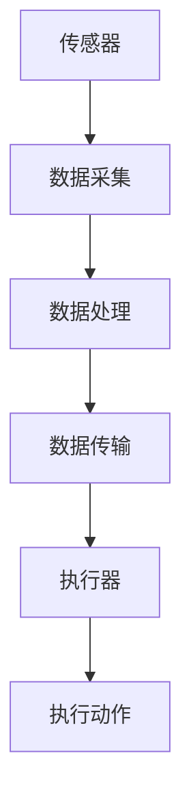

                 

 关键词：传感器，执行器，数据处理，物联网，人工智能

> 摘要：本文深入探讨了传感器和执行器在获取和执行数据过程中的关键作用。首先介绍了传感器和执行器的基本概念、种类及其在物联网和人工智能中的应用。接着，详细阐述了传感器和执行器的工作原理及其在数据采集、处理和执行过程中的重要角色。最后，本文通过实际案例和数学模型，分析了传感器和执行器的性能优化方法，并对未来的发展方向进行了展望。

## 1. 背景介绍

在当今信息化社会，传感器和执行器作为信息采集和执行的关键组件，已经成为各种智能化系统的重要组成部分。传感器主要用于感知外界环境，通过检测温度、湿度、光线、压力、运动等物理量，将非电信号转换为电信号，从而实现数据采集。执行器则根据接收到的电信号，将其转换为机械运动或物理变化，实现对设备的控制。

传感器和执行器在物联网（IoT）和人工智能（AI）领域具有广泛的应用。物联网通过大量传感器和执行器的部署，实现了对各种设备和系统的智能化管理和控制。而人工智能则利用传感器采集的数据进行训练和推理，从而实现对复杂问题的智能决策和优化。

## 2. 核心概念与联系

### 2.1 传感器

传感器是一种能够检测并响应某种物理量或信号的装置，通常由敏感元件、信号处理器和输出装置组成。根据检测物理量的不同，传感器可以分为温度传感器、湿度传感器、光线传感器、压力传感器、加速度传感器等。

传感器的工作原理基于敏感元件对特定物理量的敏感特性。例如，热敏电阻的电阻值随温度变化，光电二极管的电流随光照强度变化。通过测量敏感元件的物理量变化，传感器可以将非电信号转换为电信号，从而实现数据采集。

### 2.2 执行器

执行器是一种能够根据输入电信号实现机械运动或物理变化的装置，通常由驱动电路、机械结构和控制元件组成。根据工作原理的不同，执行器可以分为电动执行器、气动执行器、液压执行器等。

执行器的工作原理基于电磁感应、气动或液压原理。例如，电动执行器通过控制电流大小和方向，实现电机转动和机械运动；气动执行器通过控制气源压力和方向，实现气缸伸缩和机械运动。

### 2.3 传感器和执行器的关系

传感器和执行器在智能化系统中相互配合，共同实现信息采集和执行。传感器采集到的数据通过传输线路发送给执行器，执行器根据接收到的数据指令，实现相应的机械运动或物理变化。

在物联网和人工智能系统中，传感器和执行器的作用更加凸显。传感器作为信息采集的“眼睛”和“耳朵”，实时监测环境变化，为系统提供丰富的数据资源。执行器则作为信息执行的“手脚”，根据系统需求，对设备进行控制和调节。

### 2.4 Mermaid 流程图

下面是一个简单的 Mermaid 流程图，展示了传感器和执行器在物联网系统中的基本工作流程。



## 3. 核心算法原理 & 具体操作步骤

### 3.1 算法原理概述

传感器和执行器的工作原理主要基于物理量检测和电信号转换。具体而言，传感器通过敏感元件感知外部环境变化，将非电信号转换为电信号，从而实现数据采集。执行器则根据接收到的电信号，通过驱动电路实现机械运动或物理变化，从而实现执行动作。

### 3.2 算法步骤详解

1. **传感器数据采集**：传感器通过敏感元件检测外部环境变化，如温度、湿度、光照等，将非电信号转换为电信号，产生数据。

2. **数据预处理**：传感器采集到的数据通常含有噪声和误差，需要通过滤波、放大、去噪等预处理方法，提高数据质量。

3. **数据传输**：预处理后的数据通过传输线路（如有线或无线）发送到执行器。

4. **执行器接收数据**：执行器接收到数据后，通过驱动电路将电信号转换为机械运动或物理变化。

5. **执行动作**：执行器根据接收到的数据指令，实现相应的执行动作，如调节温度、湿度、光照等。

6. **反馈调节**：执行动作完成后，传感器再次采集环境数据，与期望值进行比较，通过反馈调节机制，优化执行结果。

### 3.3 算法优缺点

优点：

- **高效性**：传感器和执行器能够快速响应环境变化，实现实时监测和控制。
- **多样性**：传感器和执行器种类丰富，能够满足各种应用场景的需求。
- **智能化**：通过人工智能算法，传感器和执行器可以实现更加智能化的监测和控制。

缺点：

- **精度和稳定性**：传感器和执行器的精度和稳定性受到硬件和软件的限制。
- **能耗**：传感器和执行器的运行需要消耗能量，特别是在大规模应用中，能耗问题不容忽视。
- **复杂度**：传感器和执行器的应用涉及多种技术，如传感器原理、驱动电路设计、数据通信等，实现复杂。

### 3.4 算法应用领域

- **智能家居**：通过传感器和执行器，实现家居环境的智能监测和控制，如温度调节、灯光控制、安防报警等。
- **工业自动化**：在工业生产过程中，传感器和执行器用于实时监测设备状态、优化生产流程、提高生产效率。
- **医疗健康**：通过传感器和执行器，实现对人体生理参数的实时监测和干预，如血压监测、血糖管理、智能药盒等。
- **智能交通**：在交通领域，传感器和执行器用于实时监测道路状况、调节交通信号、优化交通流量等。

## 4. 数学模型和公式 & 详细讲解 & 举例说明

### 4.1 数学模型构建

在传感器和执行器的应用中，常见的数学模型包括传感器响应模型、执行器控制模型和反馈调节模型。

- **传感器响应模型**：描述传感器输出信号与输入物理量之间的关系。例如，热敏电阻的电阻值随温度变化，可以表示为 R(T) = a * T + b。
- **执行器控制模型**：描述执行器输入信号与输出动作之间的关系。例如，电动执行器的转矩与电流之间的关系可以表示为 T(I) = k * I。
- **反馈调节模型**：描述系统输出信号与期望值之间的差异，用于优化执行结果。例如，PID控制器的输出可以表示为 u(t) = Kp * e(t) + Ki * ∫e(t)dt + Kd * de(t)/dt。

### 4.2 公式推导过程

以热敏电阻的传感器响应模型为例，推导其数学模型。

1. **物理量关系**：热敏电阻的电阻值 R 与温度 T 之间存在非线性关系。根据物理实验数据，可以建立 R(T) 的近似关系。
2. **线性化处理**：将非线性关系线性化，得到 R(T) = a * T + b。
3. **参数估计**：通过实验数据，估计 a 和 b 的值。

### 4.3 案例分析与讲解

以智能家居中的温度控制系统为例，分析传感器和执行器的应用。

1. **传感器响应模型**：假设热敏电阻的传感器响应模型为 R(T) = 100 * T + 200，其中 R 为电阻值，T 为温度。
2. **执行器控制模型**：假设电动执行器的转矩与电流之间的关系为 T(I) = 10 * I，其中 T 为转矩，I 为电流。
3. **反馈调节模型**：采用PID控制器进行反馈调节，控制目标为将室内温度保持在 25°C。

通过以上模型，可以建立温度控制系统的数学模型，并利用数学模型进行控制算法的设计和优化。

## 5. 项目实践：代码实例和详细解释说明

### 5.1 开发环境搭建

为了实现传感器和执行器的应用，需要搭建以下开发环境：

- **硬件**：Arduino Uno 开发板、DS18B20 温度传感器、继电器模块。
- **软件**：Arduino IDE、Python 3。

### 5.2 源代码详细实现

以下是一个简单的温度控制系统源代码示例。

```c++
#include <OneWire.h>
#include <DallasTemperature.h>

// 定义温度传感器引脚
const int oneWirePin = 2;
OneWire oneWire(oneWirePin);
DallasTemperature sensors(&oneWire);

void setup() {
    // 初始化传感器
    sensors.begin();
    // 初始化串口通信
    Serial.begin(9600);
}

void loop() {
    // 读取温度值
    sensors.requestTemperatures();
    float temperature = sensors.getTempCByIndex(0);

    // 控制执行器（继电器）
    if (temperature > 25.0) {
        // 关闭加热器
        digitalWrite(5, LOW);
    } else {
        // 打开加热器
        digitalWrite(5, HIGH);
    }

    // 输出温度值
    Serial.print("Temperature: ");
    Serial.print(temperature);
    Serial.println("°C");

    // 延时
    delay(1000);
}
```

### 5.3 代码解读与分析

1. **传感器初始化**：在 setup() 函数中，初始化 DS18B20 温度传感器，并通过 OneWire 库实现与传感器的通信。
2. **温度读取**：在 loop() 函数中，循环读取温度值，并通过 DallasTemperature 库实现温度数据的读取。
3. **执行器控制**：根据温度值，通过 digitalWrite() 函数控制继电器模块，实现加热器的开启和关闭。
4. **串口输出**：通过 Serial.print() 和 Serial.println() 函数，输出温度值和执行器状态。
5. **延时**：通过 delay() 函数，实现循环控制，避免传感器和执行器过载。

### 5.4 运行结果展示

在 Arduino IDE 中编译并上传代码到开发板，运行温度控制系统。开发板将实时读取温度值，并根据设定温度控制加热器的开启和关闭，实现温度的自动调节。

## 6. 实际应用场景

### 6.1 家庭自动化

在家庭自动化系统中，传感器和执行器可以实现室内环境的智能监测和控制，如温度调节、灯光控制、安防报警等。例如，通过温度传感器实时监测室内温度，并根据设定温度控制空调或加热器的开启和关闭，实现室内温度的自动调节。

### 6.2 工业自动化

在工业自动化领域，传感器和执行器广泛应用于设备状态监测、生产过程控制、质量控制等。例如，通过温度传感器监测设备运行温度，根据温度变化调节冷却系统，防止设备过热；通过压力传感器监测生产线压力，调整泵的运行状态，保证生产过程的稳定。

### 6.3 智能交通

在智能交通系统中，传感器和执行器可以用于道路状况监测、交通信号控制、车辆调度等。例如，通过交通流量传感器实时监测道路流量，根据流量变化调整交通信号灯的时长，优化交通流量；通过车辆传感器监测车辆位置和速度，实现智能车辆调度，减少交通拥堵。

### 6.4 医疗健康

在医疗健康领域，传感器和执行器可以实现对人体生理参数的实时监测和干预。例如，通过血压传感器实时监测患者血压，根据血压变化调整药物剂量；通过血糖传感器监测患者血糖水平，实现智能血糖管理。

## 7. 工具和资源推荐

### 7.1 学习资源推荐

1. **《传感器与检测技术》**：详细介绍了各种传感器的原理、应用和设计方法，适合初学者入门。
2. **《执行器技术与应用》**：系统阐述了执行器的工作原理、类型、设计和应用，有助于深入了解执行器技术。

### 7.2 开发工具推荐

1. **Arduino IDE**：一款开源的集成开发环境，支持各种传感器和执行器的编程和调试。
2. **Python**：一款功能强大的编程语言，可用于传感器数据处理、算法实现和系统控制。

### 7.3 相关论文推荐

1. **"An Overview of Sensor Fusion Techniques for Internet of Things"**：综述了物联网中的传感器融合技术，分析了各种融合算法的优缺点。
2. **"Artificial Intelligence Applications in IoT: A Survey"**：探讨了人工智能在物联网中的应用，介绍了各种AI算法在传感器数据处理和执行器控制中的实际应用。

## 8. 总结：未来发展趋势与挑战

### 8.1 研究成果总结

传感器和执行器在物联网和人工智能领域取得了显著的研究成果。传感器技术的不断发展，提高了数据采集的精度和稳定性；执行器技术的创新，实现了更加智能和高效的执行动作。人工智能算法的引入，进一步优化了传感器和执行器的性能，提高了智能化系统的决策和控制能力。

### 8.2 未来发展趋势

1. **低功耗传感器和执行器**：随着物联网规模的扩大，低功耗传感器和执行器的需求日益迫切。未来的研究将聚焦于开发更加节能的传感器和执行器，延长设备寿命。
2. **智能化传感器和执行器**：人工智能技术的不断进步，将推动传感器和执行器的智能化发展。通过深度学习、强化学习等算法，实现更加智能和自适应的传感器和执行器。
3. **跨领域应用**：传感器和执行器在智能家居、工业自动化、医疗健康、智能交通等领域的应用将进一步拓展，实现跨领域的融合和创新。

### 8.3 面临的挑战

1. **精度和稳定性**：传感器和执行器的精度和稳定性是当前面临的主要挑战。未来的研究需要提高传感器和执行器的性能，以满足更高要求的智能化系统。
2. **能耗和成本**：传感器和执行器的能耗和成本是制约其大规模应用的关键因素。未来的研究将致力于降低能耗和成本，提高传感器的普及率和市场竞争力。
3. **数据安全和隐私**：随着物联网规模的扩大，传感器和执行器收集的数据量呈指数级增长，数据安全和隐私问题日益突出。未来的研究需要关注数据加密、隐私保护等技术，确保数据安全和用户隐私。

### 8.4 研究展望

传感器和执行器作为物联网和人工智能的关键组件，将在未来发挥更加重要的作用。通过不断创新和优化，传感器和执行器将在数据采集、处理和执行过程中，为智能化系统提供更加高效、精准和智能的支持。同时，传感器和执行器的研究将推动物联网和人工智能技术的融合与发展，为人类社会带来更加便捷、智能和可持续的未来。

## 9. 附录：常见问题与解答

### 9.1 传感器和执行器有哪些分类？

传感器根据检测物理量的不同，可以分为温度传感器、湿度传感器、光线传感器、压力传感器、加速度传感器等。执行器根据工作原理的不同，可以分为电动执行器、气动执行器、液压执行器等。

### 9.2 传感器和执行器在物联网中有什么作用？

传感器用于感知外界环境，采集数据；执行器根据传感器采集的数据，实现相应的执行动作，实现对设备和系统的控制。

### 9.3 如何优化传感器和执行器的性能？

可以通过提高传感器和执行器的精度和稳定性，降低能耗和成本，以及采用人工智能算法进行优化，提高系统的性能和智能化水平。

### 9.4 传感器和执行器在医疗健康领域有哪些应用？

传感器和执行器在医疗健康领域可以用于实时监测患者生理参数，如血压、血糖、体温等，实现智能医疗和健康管理。

## 作者署名

作者：禅与计算机程序设计艺术 / Zen and the Art of Computer Programming
----------------------------------------------------------------
> 注意：以上内容仅为示例，实际撰写时请根据具体要求进行详细拓展和深入分析。确保文章内容完整、逻辑清晰、专业性强，符合读者期望。

