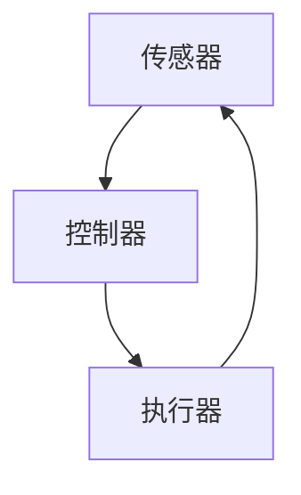

                 

 关键词：传感器，执行器，数据处理，人工智能，物联网，控制系统，反馈循环

> 摘要：本文将探讨传感器和执行器在数据获取与执行中的关键作用，分析其在现代技术中的重要性。通过对传感器和执行器的基本概念、工作原理、应用领域的详细阐述，结合实际案例，本文旨在为读者提供对这一领域深入理解的机会，并展望其未来的发展趋势。

## 1. 背景介绍

随着信息技术的迅猛发展，传感器和执行器已经成为现代科技中不可或缺的组成部分。传感器是一种能够感知和检测外部环境信息并将其转换为电信号或其他形式信息的设备。执行器则是一类能够根据输入信号产生物理动作的装置，通常用于控制机械运动、温度调节等。在自动化控制系统、物联网、人工智能等领域，传感器和执行器的应用日益广泛，它们在数据获取与执行中发挥着至关重要的作用。

### 1.1 传感器的发展历史

传感器的历史可以追溯到古埃及时期，人们使用简单的工具来检测温度、湿度等环境参数。随着工业革命的到来，传感器技术得到了快速发展。19世纪末，电气传感器开始被广泛应用，例如热电偶和电阻温度检测器（RTD）。进入20世纪，电子传感器成为主流，半导体材料的发现和应用极大地推动了传感器技术的发展。如今，随着纳米技术和材料科学的进步，传感器变得更加小型化、高精度、多功能，甚至能够实现无线通信和自我校准。

### 1.2 执行器的发展历史

执行器的历史同样悠久，早在古代，人们就使用杠杆、滑轮等简单机械来实现物理动作。19世纪末，随着电动机和液压、气动技术的成熟，执行器得到了广泛应用。20世纪中期，电子控制技术的发展使得执行器变得更加智能化，能够根据输入信号精确调整其动作。如今，随着微电子技术和人工智能的融合，执行器已经能够实现自主学习和自适应控制，为现代自动化系统提供了强大的控制能力。

### 1.3 传感器与执行器在现代技术中的重要性

在现代技术中，传感器和执行器的应用已经渗透到各行各业。在工业自动化中，传感器用于监测生产线上的各种参数，确保生产过程的高效和安全；在智能家居中，传感器被用于环境监测和设备控制，提高了人们的生活质量；在医疗领域，传感器和执行器的应用使得手术机器人、医疗监护系统等变得更加智能和可靠；在交通领域，传感器和执行器被用于自动驾驶汽车和智能交通系统的开发，提升了交通安全和效率。

## 2. 核心概念与联系

为了更好地理解传感器和执行器的工作原理和相互关系，我们需要从核心概念和架构开始探讨。

### 2.1 核心概念

#### 传感器

传感器是一种能够检测和测量物理量并将其转换为可处理信号的设备。常见的传感器类型包括温度传感器、压力传感器、湿度传感器、光传感器等。传感器的基本工作原理是利用物理效应（如热敏效应、光电效应等）将物理信号转换为电信号。

#### 执行器

执行器是一种能够根据输入信号产生物理动作的装置。常见的执行器类型包括电机、液压缸、气动缸等。执行器的基本工作原理是利用电信号或液压/气动信号控制机械运动。

### 2.2 架构

传感器和执行器通常组成一个闭环控制系统，即反馈控制系统。该系统由以下几个关键组件构成：

- **传感器**：用于检测系统的状态参数，并将物理量转换为电信号。
- **控制器**：接收传感器的输入信号，并根据预设的算法或模型对信号进行处理，生成控制信号。
- **执行器**：根据控制信号执行物理动作，改变系统的状态。
- **反馈回路**：将执行器的作用效果返回到传感器，形成闭环控制。

### 2.3 Mermaid 流程图

以下是一个简化的Mermaid流程图，展示了传感器、控制器和执行器在反馈控制系统中的关系：



## 3. 核心算法原理 & 具体操作步骤

### 3.1 算法原理概述

传感器和执行器的核心算法主要涉及数据采集、信号处理和动作控制。数据采集是通过传感器获取环境信息；信号处理是对采集到的数据进行滤波、放大、模数转换等处理，以便控制器能够正确理解信号；动作控制是利用控制器根据处理后的信号生成执行器所需的控制信号。

### 3.2 算法步骤详解

#### 数据采集

1. **初始化传感器**：设置传感器的采样频率、量程等参数。
2. **采集数据**：传感器将检测到的物理量转换为电信号，通过模数转换器（ADC）转换为数字信号。
3. **数据预处理**：对数字信号进行滤波，去除噪声和干扰。

#### 信号处理

1. **信号放大**：根据需要，对信号进行放大，以提高信噪比。
2. **滤波**：采用数字滤波器去除高频噪声或低频干扰。
3. **模数转换**：将模拟信号转换为数字信号，以便于控制器处理。

#### 动作控制

1. **信号处理**：控制器接收数字信号，并根据预设的控制算法进行信号处理。
2. **生成控制信号**：控制器生成与传感器输入信号相对应的输出信号，通常为PWM（脉冲宽度调制）信号。
3. **驱动执行器**：执行器接收控制信号，执行相应的物理动作。

### 3.3 算法优缺点

#### 优点

- **高精度**：通过精确的数据采集和处理，传感器和执行器可以实现高精度的控制。
- **自动化**：闭环控制系统可以自动调整，无需人工干预。
- **实时性**：传感器可以实时监测环境变化，快速响应。

#### 缺点

- **复杂性**：系统的设计、实现和维护相对复杂。
- **成本**：高质量的传感器和执行器成本较高。
- **可靠性**：传感器和执行器的性能受到环境、材料等因素的影响，可能会影响系统的可靠性。

### 3.4 算法应用领域

传感器和执行器的算法广泛应用于以下领域：

- **工业自动化**：用于控制生产线、设备维护等。
- **智能家居**：用于环境监测、设备控制等。
- **医疗设备**：用于手术机器人、监护系统等。
- **交通运输**：用于自动驾驶汽车、智能交通系统等。

## 4. 数学模型和公式 & 详细讲解 & 举例说明

### 4.1 数学模型构建

传感器和执行器的数学模型通常包括以下几个方面：

1. **传感器模型**：描述传感器输出信号与实际物理量之间的关系。
2. **执行器模型**：描述执行器输入信号与输出动作之间的关系。
3. **控制系统模型**：描述控制器、传感器和执行器之间的交互关系。

### 4.2 公式推导过程

以温度传感器为例，其输出信号V与温度T之间的关系可以用以下公式表示：

\[ V = a \cdot T + b \]

其中，a和b是模型参数，可以通过实验数据拟合得到。

对于执行器，假设其输入信号为PWM信号，输出动作量为x，可以用以下公式表示：

\[ x = k \cdot (V_c - V_s) \]

其中，\( V_c \) 是控制信号，\( V_s \) 是传感器信号，k是执行器增益。

### 4.3 案例分析与讲解

假设我们有一个恒温控制系统，要求系统将温度控制在设定值T0。我们可以通过以下步骤进行分析：

1. **传感器测量温度**：传感器测量当前温度T，并输出电压信号V。
2. **控制器处理信号**：控制器接收传感器信号V，并计算\( V_c \)。
3. **执行器调整温度**：执行器根据\( V_c \) 和\( V_s \) 的差值调整加热或冷却设备，使温度接近T0。

根据上述公式，我们可以推导出控制器输出的PWM信号\( V_c \)：

\[ V_c = a \cdot T0 + b + k \cdot (T0 - T) \]

通过调整k的值，我们可以实现不同的控制策略，如PID控制、模糊控制等。

## 5. 项目实践：代码实例和详细解释说明

### 5.1 开发环境搭建

为了实现一个简单的恒温控制系统，我们需要搭建一个开发环境。这里我们使用Arduino作为控制器，LM35温度传感器作为输入传感器，继电器作为执行器。

1. **硬件准备**：Arduino Uno，LM35传感器，继电器，电源等。
2. **软件安装**：安装Arduino IDE，连接Arduino板。
3. **传感器连接**：将LM35传感器的输出引脚连接到Arduino的A0引脚。
4. **执行器连接**：将继电器的控制引脚连接到Arduino的数字引脚9。

### 5.2 源代码详细实现

```cpp
#include <iostream>
using namespace std;

// 定义温度设定值
const float T0 = 25.0;

// 定义传感器和执行器的参数
const float a = 0.00980;
const float b = 0.4250;
const float k = 0.1;

// 温度传感器和执行器的输入输出信号
float V_s, V_c;

void setup() {
  // 初始化串口通信
  Serial.begin(9600);
  // 设置执行器的控制引脚为输出模式
  pinMode(9, OUTPUT);
}

void loop() {
  // 读取传感器信号
  V_s = analogRead(A0);
  // 计算控制信号
  V_c = a * T0 + b + k * (T0 - (V_s / 1023.0 * 100));
  // 驱动执行器
  if (V_c > 0) {
    digitalWrite(9, HIGH);
  } else {
    digitalWrite(9, LOW);
  }
  // 等待一段时间
  delay(1000);
}
```

### 5.3 代码解读与分析

1. **头文件和命名空间**：引入iostream头文件和std命名空间，用于输入输出操作。
2. **温度设定值**：定义温度设定值T0，即我们要控制的温度。
3. **传感器和执行器的参数**：定义传感器和执行器的模型参数，如a、b、k。
4. **初始化**：在setup函数中，初始化串口通信，设置执行器的控制引脚为输出模式。
5. **主循环**：在loop函数中，读取传感器信号，计算控制信号，并驱动执行器。

### 5.4 运行结果展示

当系统运行时，Arduino会实时读取LM35传感器的温度信号，并根据设定的控制算法调整继电器的状态，从而控制加热或冷却设备，使温度逐渐接近设定的温度T0。通过串口监视器，我们可以实时查看温度变化和控制信号。

## 6. 实际应用场景

传感器和执行器的应用场景广泛，以下是一些典型应用：

### 6.1 工业自动化

在工业自动化中，传感器用于监测设备状态、环境参数等，执行器用于控制机械运动、阀门开关等。例如，在智能制造中，传感器可以检测产品质量，执行器可以控制机器人的动作，确保生产过程的高效和准确。

### 6.2 智能家居

在智能家居中，传感器用于监测环境参数，如温度、湿度、光照等，执行器用于控制家居设备，如空调、照明等。通过智能家居系统，用户可以远程控制家居设备，提高生活便利性。

### 6.3 医疗设备

在医疗设备中，传感器用于监测患者生理参数，如血压、心率等，执行器用于控制手术机器人、监护仪等设备。传感器和执行器的应用使得医疗设备更加智能化、精确化，提高了诊断和治疗的水平。

### 6.4 交通领域

在交通领域，传感器用于监测道路状况、车辆状态等，执行器用于控制自动驾驶车辆、交通信号灯等。传感器和执行器的应用使得交通系统更加智能、高效，提高了交通安全和效率。

## 7. 工具和资源推荐

### 7.1 学习资源推荐

- **《传感器技术基础》**：详细介绍了传感器的基本原理、类型和应用。
- **《执行器原理与应用》**：探讨了执行器的工作原理、分类和应用。

### 7.2 开发工具推荐

- **Arduino IDE**：适用于传感器和执行器编程，简单易用。
- **MATLAB**：强大的数据分析与仿真工具，适合进行传感器和执行器的算法开发。

### 7.3 相关论文推荐

- **“An Overview of Sensor and Actuator Technologies in IoT Applications”**：总结了物联网中传感器和执行器的应用现状与发展趋势。
- **“Control Strategies for Smart Home Energy Management Systems Using Sensors and Actuators”**：探讨了智能家居能源管理系统的控制策略。

## 8. 总结：未来发展趋势与挑战

### 8.1 研究成果总结

随着科技的进步，传感器和执行器的性能不断提升，应用领域也日益扩展。研究重点逐渐从单一功能的传感器和执行器向多功能、高集成度、低功耗的方向发展。同时，传感器和执行器在人工智能、物联网等领域的应用也取得了显著成果。

### 8.2 未来发展趋势

- **智能化**：传感器和执行器将更加智能化，具备自学习、自适应能力，实现更精确的控制。
- **微型化**：传感器和执行器将变得更加小型化，便于嵌入到各种设备和环境中。
- **无线化**：传感器和执行器将实现无线通信，提高系统的灵活性和扩展性。
- **多功能化**：传感器和执行器将集成多种功能，实现更复杂的应用场景。

### 8.3 面临的挑战

- **精度与稳定性**：提高传感器和执行器的精度和稳定性，以满足高精度控制需求。
- **功耗与成本**：降低传感器和执行器的功耗和成本，使其在更多领域得到应用。
- **环境适应性**：提高传感器和执行器在恶劣环境下的性能，确保系统的可靠性。

### 8.4 研究展望

未来的研究应重点关注传感器和执行器在新兴领域的应用，如智能医疗、智慧城市、智能农业等。同时，探索新型传感器和执行器材料、结构设计，提高其性能和可靠性。此外，加强传感器和执行器在人工智能、物联网等领域的融合研究，推动智能控制系统的发展。

## 9. 附录：常见问题与解答

### 9.1 什么是传感器？

传感器是一种能够检测和测量外部物理量并将其转换为可处理信号的设备。常见的物理量包括温度、压力、湿度、光照等。

### 9.2 传感器有哪些类型？

传感器主要分为物理传感器和化学传感器。物理传感器包括温度传感器、压力传感器、湿度传感器、光传感器等；化学传感器包括气体传感器、湿度传感器、化学传感器等。

### 9.3 什么是执行器？

执行器是一种能够根据输入信号产生物理动作的装置。常见的执行器包括电机、液压缸、气动缸等。

### 9.4 执行器有哪些类型？

执行器主要分为电机型执行器、液压型执行器和气动型执行器。电机型执行器包括直流电机、交流电机等；液压型执行器包括液压缸、液压马达等；气动型执行器包括气动缸、气动马达等。

### 9.5 传感器和执行器在工业自动化中的应用有哪些？

传感器和执行器在工业自动化中广泛应用于设备状态监测、生产过程控制、质量检测等。例如，传感器用于监测设备温度、压力、速度等参数，执行器用于控制机器人的动作、阀门的开闭等。

### 9.6 传感器和执行器在智能家居中的应用有哪些？

传感器和执行器在智能家居中用于环境监测、设备控制等。例如，温度传感器用于监测室内温度，执行器用于控制空调的开关、调节温度等；光传感器用于监测光照强度，执行器用于控制照明设备的开关和亮度调节。

### 9.7 传感器和执行器在医疗领域中的应用有哪些？

传感器和执行器在医疗领域用于手术机器人、医疗监护系统等。例如，传感器用于监测患者生理参数，执行器用于控制手术机器人的动作、监护仪的报警等。

### 9.8 传感器和执行器在交通运输中的应用有哪些？

传感器和执行器在交通运输中用于自动驾驶车辆、智能交通系统等。例如，传感器用于监测车辆速度、道路状况，执行器用于控制自动驾驶车辆的方向、速度等。

### 9.9 传感器和执行器在农业领域中的应用有哪些？

传感器和执行器在农业领域用于环境监测、作物生长控制等。例如，传感器用于监测土壤湿度、温度、光照等参数，执行器用于控制灌溉设备、温室环境调节等。

